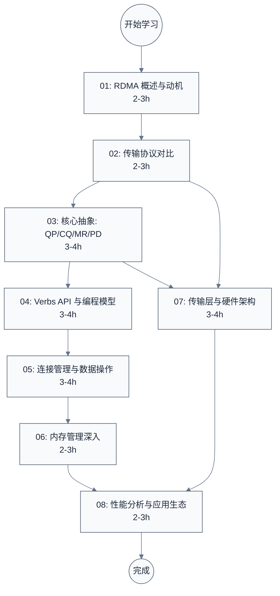

# RDMA 技术学习笔记

> 面向底层软件工程师、驱动开发者和系统架构师的 RDMA（Remote Direct Memory Access，远程直接内存访问）技术完整学习指南。从动机与协议对比出发，深入核心抽象、编程模型、传输层、硬件架构，到性能分析与应用生态。

---

## 学习路线图



---

## 文档索引

| 序号 | 文档 | 内容概要 | 建议用时 |
|:----:|------|---------|:--------:|
| 01 | [RDMA 概述与动机](./01-rdma-overview.md) | 传统网络栈瓶颈、kernel bypass 原理、RDMA 三大收益、IB/RoCE/iWARP 一句话对比 | 2-3h |
| 02 | [传输协议对比](./02-rdma-transport-protocols.md) | InfiniBand 协议栈分层、RoCE v1/v2 对比、iWARP 架构、包格式差异、适用场景决策 | 2-3h |
| 03 | [核心抽象：QP/CQ/MR/PD](./03-rdma-core-abstractions.md) | QP 类型与状态机、CQ 通知模型、MR 注册语义、PD 隔离域、WR/WQE/CQE 生命周期 | 3-4h |
| 04 | [Verbs API 与编程模型](./04-rdma-verbs-api.md) | libibverbs/librdmacm 架构、设备发现、资源创建流程、完整 ping-pong 示例 | 3-4h |
| 05 | [连接管理与数据操作](./05-rdma-connection-and-operations.md) | RDMA CM 连接流程、SEND/RECV 语义、RDMA READ/WRITE 单边操作、Atomic、Immediate Data | 3-4h |
| 06 | [内存管理深入](./06-rdma-memory-management.md) | MR 注册策略、MW（Memory Window）、PBL/IOMMU 交互、GPUDirect RDMA | 2-3h |
| 07 | [传输层与硬件架构](./07-rdma-transport-and-hardware.md) | 可靠传输协议、RoCE 无损网络（PFC/ECN/DCQCN）、RNIC 硬件流水线 | 3-4h |
| 08 | [性能分析与应用生态](./08-rdma-performance-and-ecosystem.md) | perftest 延迟/带宽测量、调优参数、NVMe-oF、AI 训练中的 RDMA（NCCL/RCCL 后端） | 2-3h |

---

## 按角色推荐学习路径

### 驱动/BSP 工程师

关注 RNIC 硬件架构、内存管理、无损网络机制：

```
01 概述 → 02 协议对比 → 03 核心抽象 → 07 传输层与硬件架构（重点）→ 06 内存管理（重点）→ 08 应用生态
```

- **07 是核心**：PFC/DCQCN 是 RoCE 驱动工程师必须理解的无损网络机制，RNIC 硬件流水线帮你理解 WQE 如何被硬件消费
- 06 的 IOMMU/SMMU 交互是 BSP 工程师配置 DMA 映射的关键参考
- 02 理解协议分层，才能看懂 RNIC 数据手册的寄存器布局

### 应用/性能工程师

关注 API 编程和性能调优：

```
01 概述 → 03 核心抽象 → 04 Verbs API（重点）→ 05 连接管理（重点）→ 08 性能分析（重点）
```

- 04/05 包含完整可运行代码，学完就能写 RDMA 程序
- 08 的 perftest 工具是日常性能测量的必备技能

### 存储/HPC 架构师

关注单边操作和 NVMe-oF：

```
01 概述 → 02 协议对比 → 03 核心抽象 → 05 数据操作（重点：RDMA READ/WRITE）→ 06 内存管理 → 08 应用生态（重点：NVMe-oF）
```

---

## 关键术语速查

| 缩写 | 全称 | 含义 |
|------|------|------|
| RDMA | Remote Direct Memory Access | 远程直接内存访问 |
| RNIC | RDMA Network Interface Card | RDMA 网卡 |
| HCA | Host Channel Adapter | 主机通道适配器（InfiniBand 语境下的 RNIC） |
| IB | InfiniBand | InfiniBand 网络体系 |
| RoCE | RDMA over Converged Ethernet | 基于融合以太网的 RDMA |
| iWARP | Internet Wide Area RDMA Protocol | 基于 TCP 的 RDMA 协议 |
| QP | Queue Pair | 队列对（发送队列+接收队列） |
| CQ | Completion Queue | 完成队列 |
| MR | Memory Region | 内存区域（注册后的内存） |
| PD | Protection Domain | 保护域（资源隔离容器） |
| WR | Work Request | 工作请求 |
| WQE | Work Queue Element | 工作队列元素 |
| CQE | Completion Queue Element | 完成队列元素 |
| SGE | Scatter-Gather Element | 分散-聚集元素 |
| CM | Connection Management | 连接管理 |
| PFC | Priority-based Flow Control | 基于优先级的流量控制（IEEE 802.1Qbb） |
| ECN | Explicit Congestion Notification | 显式拥塞通知 |
| DCQCN | Data Center Quantized Congestion Notification | 数据中心量化拥塞通知 |
| NVMe-oF | NVMe over Fabrics | 基于网络的 NVMe 存储协议 |

---

**文档版本**: v1.0
**最后更新**: 2026-05-10
**适用对象**: 驱动工程师、BSP 工程师、系统架构师、性能工程师