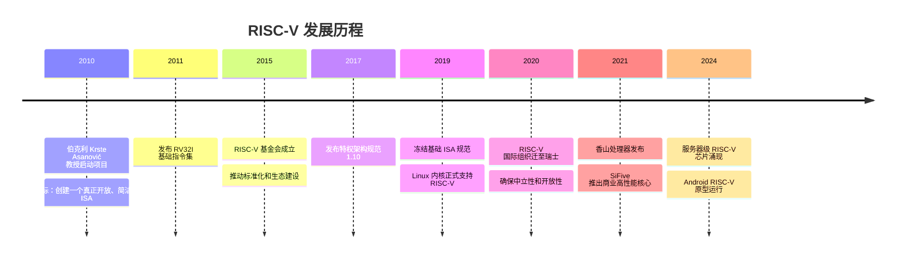
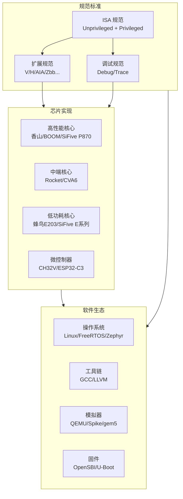

# RISC-V 概览

## 学习目标

完成本章学习后，你将能够：

- 复述 RISC-V 从 2010 年伯克利项目到当今全球生态的发展脉络，理解"开放 ISA"模式的战略意义
- 阐释 RISC-V 的五条核心设计原则（开源免费、模块化、简洁、稳定、可扩展）及其对软件生态的影响
- 解析 `RV64IMAFDC` 命名规范的每一组成部分，列举至少 8 个标准扩展及其用途
- 对比 RISC-V 与 ARM、x86 在授权模式、指令数量、特权级设计上的关键差异
- 辨别 RISC-V 与 OpenRISC、SPARC、MIPS 的历史分岔——理解为什么前人未能成功而 RISC-V 成功了
- 描述 RISC-V 软件与硬件生态的全景（工具链、模拟器、芯片实现），并按场景匹配合适的 Profile
- 解释 RVA22/RVA23 Profile 的扩展组成，判断给定 Profile 是否适合服务器或 AI 推理场景

## 为什么 RISC-V 值得深入学习？

RISC-V 的"开源"不只是免费——它意味着你可以深入底层，理解每一条指令的精确行为，甚至参与标准的制定。对于系统软件工程师，这消除了 x86/ARM 中常见的"黑盒困惑"：不再依赖厂商手册猜测行为，而是直接阅读官方规范与开源实现。

更具体地说：

- **职业价值**：从 NVIDIA GPU 管理核心到 Western Digital SSD 控制器，从 ESP32-C3 到 64 核香山服务器——RISC-V 已渗透进每一个计算层次。掌握它，你就掌握了一张覆盖从 MCU 到云服务器的技术通行证。
- **学习价值**：RISC-V 基础指令集仅 40 条，你可以在一个学期内完整理解一条指令从取指到写回的全过程——在 x86（1500+ 条指令）上几乎不可能做到同等深度的掌握。
- **创新价值**：开放的 ISA 意味着你可以按需求定制指令扩展（Domain-Specific Acceleration），这在封闭的 x86/ARM 生态中需要天价授权费或根本不可行。

### 前置知识

| 需要了解 | 参考文档 |
|----------|----------|
| CPU 体系结构基础（寄存器、流水线、Cache） | [体系结构基础](./90-appendix-architecture-background.md) |
| C 语言基本语法 | — |

---

## 1. RISC-V 的起源



**核心人物：** David Patterson（RISC 概念提出者，2017 年图灵奖得主）和 Krste Asanović。

### 1.1 前车之鉴：历史上的开放 ISA 为何未能成功？

RISC-V 并非第一个"开放 ISA"。在它之前，至少有三个重要的开放架构尝试。理解它们的失败原因，有助于看清 RISC-V 的历史定位。

| 架构 | 年代 | 开放方式 | 失败原因 | 与 RISC-V 的差异 |
|------|------|----------|----------|-------------------|
| **SPARC** | 1986 | Sun 将 SPARC V8/V9 定为开放标准，允许任何人实现兼容处理器 | 技术层面：寄存器窗口（Register Window）设计复杂，上下文切换代价高；商业层面：Sun 作为主导公司衰落，生态随之瓦解。SPARC 本质是"一家公司主导的开源" | RISC-V：基金会治理，无单一主导公司；放弃寄存器窗口设计，使用扁平的 32 寄存器模型 |
| **MIPS** | 1985 | MIPS Technologies 授权 ISA，开放程度有限；2018 年 Wave Computing 宣布 MIPS Open，2020 年又关闭 | 商业摇摆：在开放与封闭之间反复，生态缺乏信任；技术层面：分支延迟槽（Branch Delay Slot）在深流水线时代成为负担 | RISC-V：从第一天起就明确"基础 ISA 永不改变"的承诺；无延迟槽设计，分支预测由微架构自行决定 |
| **OpenRISC** | 2000 | 完全开源（GPL/LGPL），由开源社区维护 | 缺乏商业支持：没有芯片巨头采纳，工具链不成熟，限于学术圈；规范更新缓慢，版本迭代跟不上产业需求 | RISC-V：由学术界启动但迅速引入产业力量（Google、NVIDIA、Qualcomm 等均为会员）；基金会治理机制保证"中立、开放、快速迭代" |

> **RISC-V 成功的三个关键因素：**（1）时机——2010 年代摩尔定律放缓，产业需要差异化而非通用微架构优化，开放 ISA 恰好满足定制化需求；（2）设计质量——Patterson 和 Asanović 是世界顶级的体系结构学者，RV32I 的设计经过了与 Chisel 硬件描述语言同步迭代的严格验证；（3）治理模型——从大学项目转型为瑞士注册的全球基金会，确保没有任何单一一国可以控制 ISA 的方向。

### 1.2 这次为什么成功了

RISC-V 的起源故事说明：技术上的正确性只是必要条件，而非充分条件。SPARC 有技术（被 Fujitsu/Oracle 用于服务器 20 年），MIPS 有生态（SGI 工作站和 PlayStation），OpenRISC 有开放的初心——但它们都因为治理模式的缺陷而未能成为"全行业标准"。RISC-V 的成功是"正确的人、在正确的时间、用正确的治理机制"三者叠加的结果。

---

## 2. 设计哲学：为什么 RISC-V 与众不同？

### 2.1 RISC-V 的核心设计原则

| 原则 | 说明 | 对比 x86/ARM |
|------|------|--------------|
| **开源免费** | 任何人都可以实现，无需授权费 | ARM 需支付数百万美元授权费，x86 不开放授权 |
| **模块化** | 极小的基础集 + 按需扩展，扩展可由社区提出 | ARM 扩展由 ARM Ltd. 单方定义，x86 全部集成不可拆分 |
| **简洁** | 基础指令集仅 40 条 | x86 有 1500+ 条指令，ARMv8-A 约 300 条 |
| **稳定** | 基础 ISA 一旦冻结永不改变 | x86 每代追加新指令以保证向后兼容 |
| **可扩展** | 支持自定义指令扩展（通过预留编码空间） | ARM 需特殊授权，x86 不允许第三方扩展 |

### 2.2 一个类比

**x86** 就像一座不断加盖的老房子：

- 每一代都在原有结构上加新房间
- 有些房间已经没人用了，但不敢拆（向后兼容）
- 房子越来越复杂，维护成本越来越高

**ARM** 就像品牌连锁酒店：

- 设计统一，质量有保障
- 但你想改造房间布局？请先交授权费
- 不同版本（ARMv7/ARMv8/ARMv9）之间有差异

**RISC-V** 就像乐高积木：

- 基础套装很小，只有核心积木块
- 你可以自由选择扩展包
- 甚至可以自己设计新的积木块
- 没人收你授权费

RISC-V 的设计哲学可以浓缩为一句话——"给基础，不设限"。开源降低准入门槛，模块化避免"全有或全无"的臃肿，简洁让验证和实现成本可控，稳定保证软件投资不被废弃，可扩展则是 RISC-V 最独特的战略武器——它让 ISA 从"芯片公司规定游戏规则"变成"需求方也可以参与规则制定"。x86 是我们可以"用"的架构，ARM 是我们可以"买"的架构，RISC-V 才是我们可以"改"的架构。

---

## 3. 模块化扩展机制

RISC-V 的命名规范揭示了它的模块化设计：

```
RV64IMAFDC
│  │|||||
│  │|||||└── C: 压缩指令扩展（16-bit 指令）
│  |||||└─── D: 双精度浮点扩展
│  ||||└──── F: 单精度浮点扩展
│  |||└───── A: 原子指令扩展
│  ||└────── M: 乘除法扩展
│  |└─────── I: 基础整数指令集（必须）
│  └──────── 64: 整数寄存器宽度 64 位（XLEN=64）
└─────────── RV: RISC-V

常用组合：
  RV32IMAC    → 嵌入式/MCU 常见配置
  RV64IMAFDC  → 全功能 Linux 系统配置（又称 RV64GC）
```

### 扩展分类

| 类别 | 扩展名 | 说明 | 状态 |
|------|--------|------|------|
| **基础** | I | 整数指令集，必须实现 | 已冻结 |
| **标准扩展** | M | 整数乘除法 | 已冻结 |
| | A | 原子操作 | 已冻结 |
| | F | 单精度浮点 | 已冻结 |
| | D | 双精度浮点 | 已冻结 |
| | C | 压缩指令 | 已冻结 |
| **特权扩展** | H | Hypervisor 虚拟化 | 已冻结 |
| | S | Supervisor 模式 | 已冻结 |
| **子扩展** | Zicsr | CSR 指令 | 已冻结 |
| | Zifencei | 指令缓存刷新 | 已冻结 |
| | Zba | 地址生成加速 | 已冻结 |
| | Zbb | 基本位操作 | 已冻结 |
| | Zbs | 单位操作 | 已冻结 |
| **向量** | V | 向量扩展 | 已冻结 |
| **新兴** | Zicond | 条件操作 | 已冻结 |
| | Zc | 额外压缩指令 | 已冻结 |

> **命名规则：** 标准扩展用单个大写字母，子扩展用 Z + 小写字母组合。这种命名方式使得扩展可以独立开发和验证。

模块化是 RISC-V 最核心的设计决策。I（整数基础）是不可动摇的地基；M/A/F/D/C 构成了通用计算的标准配置；V（向量）打开高性能计算的大门；而 Z* 子扩展则允许以极细的粒度添加功能而不破坏兼容性。理解这种分层，就能理解为什么同一个 RV64GC 二进制可以在 50 美分的微控制器和 5000 美元的服务器的 CPU 上同时运行。

---

## 4. RISC-V 与其他 ISA 的对比

| 对比维度 | RISC-V | ARM | x86 |
|----------|--------|-----|-----|
| **授权模式** | 完全开源免费 | 商业授权（IP 授权费） | Intel 独占，不授权 |
| **指令数量（基础）** | ~40 条（RV32I） | ~100 条（ARMv8-A） | ~1500 条 |
| **指令长度** | 32-bit（C 扩展 16-bit） | 32-bit（Thumb2 16/32-bit） | 变长 1-15 字节 |
| **设计风格** | Load-Store 架构 | Load-Store 架构 | CISC（寄存器-内存架构） |
| **特权级** | M/S/U（+H 扩展） | EL0-EL3 | Ring 0-3 |
| **虚拟化** | H 扩展 | ARMv8.1 VHE | VT-x/AMD-V |
| **自定义扩展** | ✅ 自由扩展 | ❌ 需授权 | ❌ 不允许 |
| **生态成熟度** | 🌱 快速成长中 | 🌳 非常成熟 | 🌳 非常成熟 |
| **主要应用** | 嵌入式、IoT、新兴服务器 | 移动、嵌入式、服务器 | 桌面、服务器 |

### Load-Store 架构

RISC-V 采用 Load-Store 架构，这意味着：

- **只有 Load/Store 指令可以访问内存**
- **运算指令只能在寄存器之间操作**

```asm
# RISC-V (Load-Store)
lw   t0, 0(a0)       # 从内存加载到寄存器
add  t0, t0, t1      # 寄存器间运算
sw   t0, 0(a1)       # 从寄存器存储到内存

# x86 (CISC，允许内存操作数)
add  [rax], rbx      # 直接对内存操作数做运算
```

这种设计简化了指令解码和流水线实现，是 RISC 哲学的核心。

RISC-V 与 ARM/x86 的对比不是"孰优孰劣"的简单结论，而是"不同历史阶段的产物"。x86 诞生于 1978 年，当时晶体管昂贵、编译器不成熟，CISC 的"一条指令干多件事"是有道理的；ARM 诞生于 1985 年，面向低功耗移动场景优化；RISC-V 诞生于 2010 年，受益于 30 年的 RISC 研究和编译器进步，可以从零开始做最干净的设计。选择 RISC-V 不是因为它"打败"了谁，而是因为它是目前唯一允许你在 ISA 层面自由创新的现代架构。

---

## 5. RISC-V 生态全景



### 关键组织

| 组织 | 角色 |
|------|------|
| **RISC-V International** | 管理 ISA 规范，推动标准化 |
| **CHIPS Alliance** | 推动开源硬件实现 |
| **PLCT Lab** | 中国团队，贡献工具链和模拟器 |
| **中科院** | 香山处理器开发 |
| **芯来科技** | 商业 RISC-V IP 和开发工具 |

---

## 6. RISC-V 的典型应用场景

| 场景 | 代表产品/项目 | 使用的核心 |
|------|---------------|------------|
| **微控制器** | ESP32-C3, CH32V003 | RV32IMAC |
| **IoT/嵌入式** | SiFive FE310, 蜂鸟 E203 | RV32IMAC |
| **边缘计算** | StarFive JH7110 (VisionFive 2) | RV64IMAFDC |
| **AI 加速器** | NVIDIA GPU 管理核心 | RV64I |
| **存储控制器** | Western Digital SSD 控制器 | 自定义 RV 核心 |
| **高性能计算** | 香山处理器, SiFive P870 | RV64GCV |
| **Android** | RISC-V Android 原型 | RV64GCV |
| **云服务器** | SG2042, 香山, SiFive P870 | RVA22/RVA23 Profile |

> **一个有趣的例子：** NVIDIA 在其 GPU 中使用 RISC-V 作为管理核心，取代了之前的专有微控制器。这说明了 RISC-V 在"看不见的地方"的广泛应用。

---

## 7. 服务器 Profile：RVA22 / RVA23

RISC-V 的模块化是优势，但也带来了碎片化风险。为了确保软件兼容性，RISC-V International 定义了 **Profile**——一组固定的扩展组合，类似于 ARM 的 v8.x-A Profile。

### 7.1 为什么需要 Profile？

**没有 Profile**：厂商 A 实现 RV64IMAFDC_Zba_Zbb，厂商 B 实现 RV64IMAFDC_Zbc_Zbs——同一份软件可能在一个平台运行，另一个不行，碎片化！

**有 Profile**：RVA22 要求必须实现 Zba+Zbb+Zbs——所有 RVA22 兼容的芯片都支持相同的指令集，软件只需声明"需要 RVA22"即可。

### 7.2 RVA22 Profile

RVA22（RISC-V Application processor profile 22）是面向应用处理器的 Profile，也是服务器场景的最低标准：

| 类别 | 必须包含 | 说明 |
|------|----------|------|
| **基础 ISA** | RV64I | 64 位基础整数 |
| **标准扩展** | M, A, F, D, C | 乘除法、原子、浮点、压缩 |
| **位操作** | Zba, Zbb, Zbs | 地址加速、基本位操作、单位操作 |
| **CSR** | Zicsr | CSR 指令 |
| **缓存管理** | Zicbom, Zicboz | 缓存维护和零初始化 |
| **性能计数器** | Zicntr, Zihpm | 基本和可编程计数器 |
| **计数器扩展** | Zihintpause | PAUSE 指令提示 |
| **页表** | Sv39 | 39 位虚拟地址 |
| **特权** | S-mode | Supervisor 模式 |

> **RVA22 不包含 V 扩展！** 这意味着 RVA22 兼容的服务器不一定有向量能力。如果需要向量，应选择 RVA23。

### 7.3 RVA23 Profile

RVA23 在 RVA22 基础上增加了向量扩展和更多子扩展：

| 类别 | 新增扩展 | 说明 |
|------|----------|------|
| **向量** | V | 可变长度向量扩展 |
| **向量浮点** | Zvfh, Zvfhmin | 向量半精度浮点 |
| **条件操作** | Zicond | 条件选择指令（类似 x86 CMOV） |
| **可能为0的操作** | Zimop | 预留操作指令（当前为 NOP，未来可扩展） |
| **压缩操作** | Zcmop | 压缩的条件操作 |
| **页表** | Sv48 | 48 位虚拟地址（可选 Sv57） |

### 7.4 Profile 对软件的意义

```mermaid
graph LR
    SRC[源代码] --> |"编译时指定<br/>-march=rv64gcv_zba_zbb_zbs"| BIN1[二进制]
    BIN1 --> |"运行在 RVA22 平台"| FAIL[❌ V 扩展指令<br/>可能不支持"]

    SRC --> |"编译时指定<br/>-march=rva22"| BIN2[二进制]
    BIN2 --> |"运行在 RVA22 平台"| OK[✅ 完全兼容]

    SRC --> |"编译时指定<br/>-march=rva23"| BIN3[二进制]
    BIN3 --> |"运行在 RVA23 平台"| OK2[✅ 完全兼容]
    BIN3 --> |"运行在 RVA22 平台"| FAIL2[❌ V 扩展指令<br/>不支持"]

    style OK fill:#4ecdc4,color:#fff
    style OK2 fill:#4ecdc4,color:#fff
    style FAIL fill:#ff6b6b,color:#fff
    style FAIL2 fill:#ff6b6b,color:#fff
```

| Profile | 目标场景 | 关键扩展 | 状态 |
|---------|----------|----------|------|
| **RVA20** | 通用应用处理器 | RV64GC | 已发布 |
| **RVA22** | 服务器/桌面最低标准 | + Zba/Zbb/Zbs/Zicbom/Zicboz | 已发布 |
| **RVA23** | AI/HPC 服务器 | + V/Zicond | 已发布 |
| **RVM22** | 微控制器 | RV32IMC | 已发布 |

> **服务器选型建议：** 如果目标是云服务器，至少选择 RVA22 兼容的处理器。如果需要 AI 推理或 HPC 能力，选择 RVA23 兼容的处理器。

### 7.5 RISC-V Profile 与其他架构的等价对应

理解 RISC-V Profile 最直观的方式是找到它在 x86 和 ARM 世界的"对应物"：

| 维度 | RISC-V | x86 (Intel/AMD) | ARM |
|------|--------|-----------------|-----|
| **入门 MCU** | RVM22 (RV32IMC) | —（x86 无此空间） | Cortex-M4/M7 (ARMv7E-M) |
| **中端嵌入** | RVA20 (RV64GC) | — | Cortex-R (ARMv8-R) |
| **通用服务器** | RVA22 | x86-64-v2 (SSE4.2 + POPCNT) | ARMv8.0-A (AArch64 baseline) |
| **高性能服务器** | RVA23 (+V) | x86-64-v3 (AVX2 + BMI) | ARMv8.2-A + SVE |
| **HPC / AI** | RVA23 + Sv48 | x86-64-v4 (AVX-512) | ARMv9-A + SVE2 |

> **关键差异：**
> - x86 的向量能力是"与生俱来"的（SSE/AVX 从 1999 年就开始了），每次升级都是叠加
> - ARM 的 SVE 是 2016 年后引入的可变长度向量，与 RISC-V 的 V 扩展设计理念相近
> - RISC-V 的优势在于：**V 扩展是标准但不强制**——不需要向量的场景可以省面积，需要向量的场景全功能支持
> - x86 在"去除历史包袱"上最弱（新增指令只叠不减）；ARM 中等（A32/T32 两套指令模式并存）；RISC-V 最强（基础集冻结，新能力走扩展而非改动基础集）

### 7.6 Profile 对固件和 OS 开发的实际影响

```c
// GCC 中指定 Profile 编译
// RVA22 编译：生成的代码不使用 V 扩展，可用于所有 RVA22+ 平台
riscv64-unknown-linux-gnu-gcc -march=rva22gc -O2 -c kernel.c

// 在 Makefile 中使用条件编译
ifeq ($(CONFIG_RISCV_PROFILE), rva23)
    CFLAGS += -march=rva23gc -mabi=lp64d
else
    CFLAGS += -march=rva22gc -mabi=lp64d
endif
```

| Profile | 固件需要实现的特性 | 额外考虑 |
|---------|--------------------|----------|
| **RVM22** | PMP（物理内存保护）、基础 trap 处理 | 无 MMU，裸机/RTOS 场景 |
| **RVA20** | Sv39 MMU、S-mode trap、基础 SBI | Linux 可运行但缺少向量加速 |
| **RVA22** | + Zicbom/Zicboz (Cache 管理 SBI 调用) | 服务器固件的基础要求 |
| **RVA23** | + V 扩展上下文保存（CSR: vstart/vxsat/vcsr） | 使用 V 扩展的内核需注意向量寄存器状态 |

> **实际操作：** 在 QEMU 中验证 Profile 兼容性——`qemu-system-riscv64 -cpu rva22s64`（RVA22）或 `-cpu rva23s64`（RVA23），可以在不同 Profile 下测试固件行为。

---

## 小结

本章建立了 RISC-V 的全局认知框架，可以将所有要点归纳为一条主线：

**历史维度**——RISC-V 不是第一个开放 ISA（SPARC、MIPS、OpenRISC 都尝试过），但它是第一个在正确的时机（摩尔定律放缓）、由正确的人（Patterson/Asanović）、以正确的治理模型（瑞士基金会）推动的开放 ISA。这一组合使它在诞生十年内完成了前人三十年未竟的事业。

**设计维度**——五条原则形成了一个正反馈循环：开源 → 低成本实验 → 更多参与者 → 模块化设计检验 → 简洁性提升 → 更广泛的应用场景。这个循环是 RISC-V 从学术项目蜕变为产业标准的底层动力。

**技术维度**——RV32I（40 条指令）→ RV64GC（通用计算）→ RVA22（服务器基线）→ RVA23（AI/HPC）构成了从简单到复杂的清晰进阶路径。Load-Store 架构、定长指令和扁平寄存器文件确保每一级都建立在坚实的基础上。

**生态维度**——工具链（GCC/LLVM）、模拟器（QEMU/Spike）、固件（OpenSBI/U-Boot）和芯片实现（从 ESP32-C3 到香山）构成了一个完整的软件栈。RISC-V 不只是 ISA 规范，它是一个正在快速成熟的、从规格书到硅片的完整计算平台。

> **一句话总结：** RISC-V 是首个在现代半导体产业背景下成功建立"开放 ISA 标准"的架构。它不是"免费版的 ARM"，而是一种全新的芯片设计范式——从"一家公司定义，所有人购买"转变为"社区共同定义，所有人自由实现"。

---

## 参考资料

- [RISC-V Unprivileged ISA Spec v20260517](https://github.com/riscv/riscv-isa-manual/releases/tag/20260517) — 非特权 ISA 权威规范
- [RISC-V International — Profiles](https://github.com/riscv/riscv-profiles) — RVA/RVM/RVH Profile 定义
- [RISC-V International — Technical Overview](https://riscv.org/technical/specifications/) — 各扩展规范列表
- [Calista Redmond (RISC-V CEO) — State of the Union 2024](https://riscv.org/blog/2024/12/) — 产业动态与生态展望

---

→ 下一节：[基础整数指令集 RV32I/RV64I](./01-isa-rv32i-rv64i.md)
