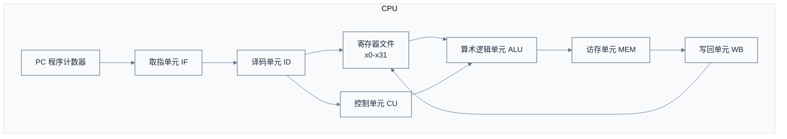
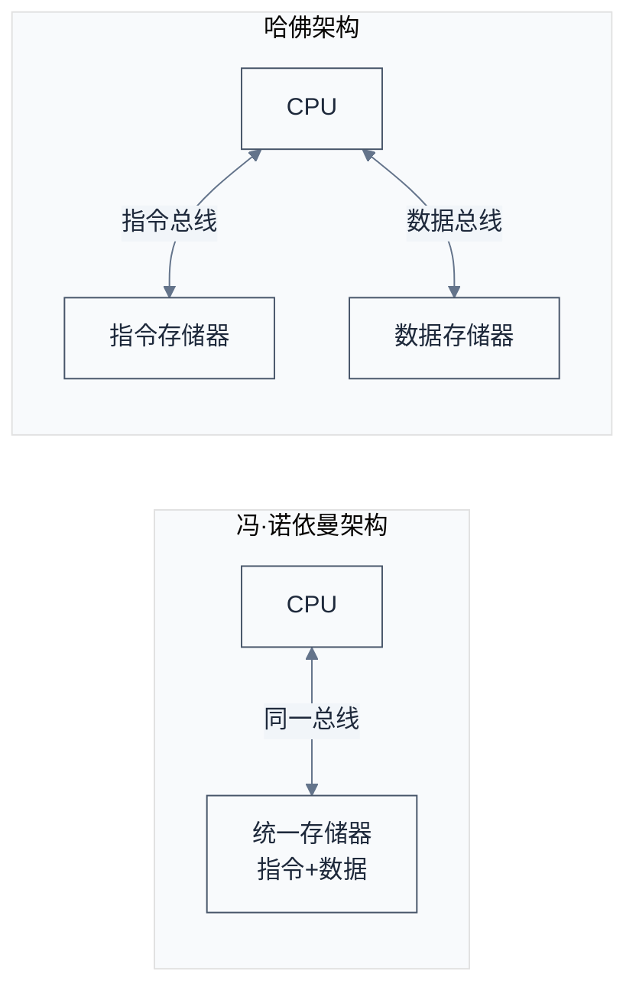
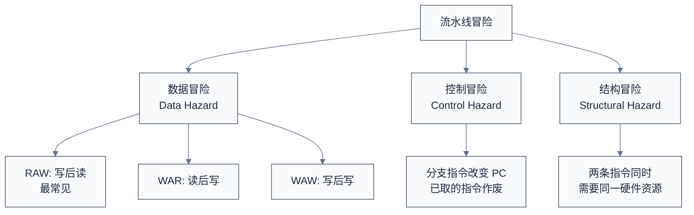
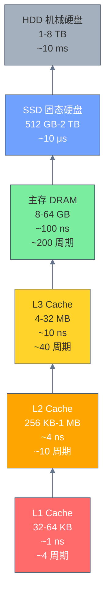
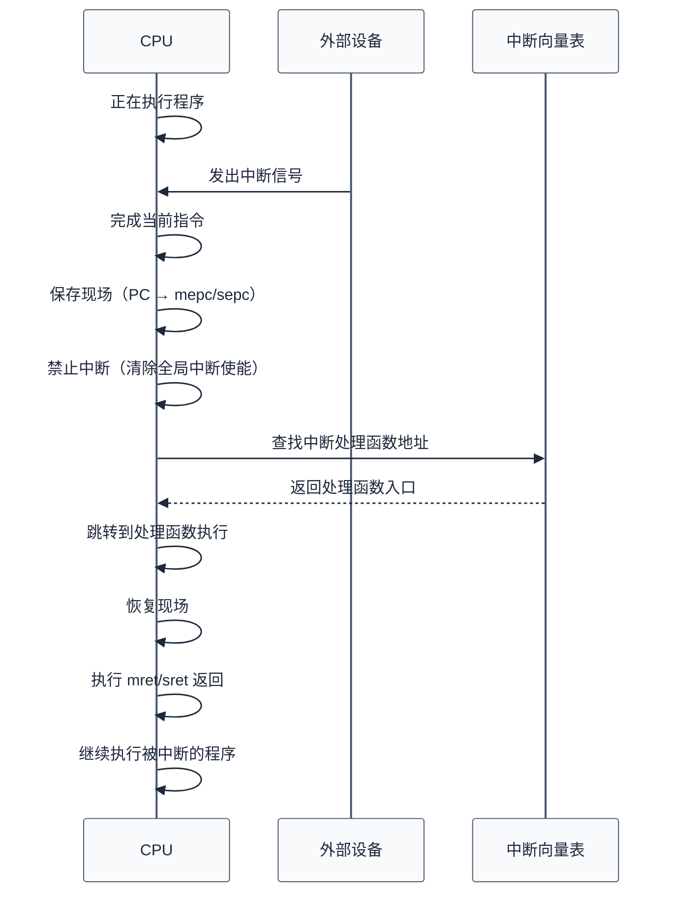

# 计算机体系结构基础

## 学习目标

完成本章学习后，你将能够：

- 解释 **ISA（指令集架构）与微架构（Microarchitecture）** 的本质区别，理解为什么这种分离是现代处理器设计的基石
- 描述 CPU 的核心组成部件（PC、寄存器文件、ALU、控制单元）及其协作方式
- 对比 **冯·诺依曼架构与哈佛架构** 的差异，并说明现代处理器如何结合两者优势
- 阐释 **RISC 设计哲学的五条核心原则**，理解它们为何使流水线实现更高效
- 画出经典 **5 级流水线**，列出三大流水线冒险及其应对策略
- 使用 **Amdahl 定律** 量化分析性能瓶颈，理解"优化常见情况"的工程意义
- 描述 **内存层次结构** 中各层级的容量与延迟数量级，解释局部性原理为何使这套机制有效
- 区分 **中断（Interrupt）与异常（Exception）**，理解两者统称为 **陷入（Trap）**，掌握 RISC-V 语境中三者的层次关系
- 解释 **MMU** 如何通过页表和 TLB 实现虚拟地址到物理地址的翻译

## 为什么需要这些知识？

这些"基础概念"不是过时的理论——它们是你日常调试的直觉来源：

- 当程序突然变慢，你想到的是"Cache miss 了？"而非盲目猜测
- 当多线程程序出现随机崩溃，你想到的是"内存序问题？"而非加 `printf` 碰运气
- 当系统在高负载下响应迟钝，你能区分这是 CPU 瓶颈、内存带宽耗尽还是 I/O 阻塞
- 当阅读 RISC-V 特权态规范时，"陷阱委托""页表遍历""中断等待"这些概念不再是天书

更重要的是，RISC-V 的设计哲学（简洁、模块化、可扩展）本身就是对体系结构原理的直接回应。理解这些基础，你才能真正懂得为什么 RISC-V 选择了这样的设计，以及它比 x86/ARM 更适合教学与定制的深层原因。

### 前置知识

本文为整个 RISC-V 学习笔记的第一篇，只需了解 C 语言基本语法即可。文中会解释所有体系结构术语，不需要任何硬件背景。

---

## 1. ISA 与微架构：计算机设计的"契约"与"实现"

在学习 CPU 内部结构之前，必须先理解计算机体系结构中最基础、也最容易被忽视的区别：**指令集架构（ISA）是软件与硬件之间的契约，微架构（Microarchitecture）是这份契约的具体实现。**

### 1.1 核心定义

| 概念 | 定义 | 类比 |
|------|------|------|
| **ISA（指令集架构）** | 定义处理器"能做什么"——指令集、寄存器、地址空间、数据类型、中断模型等。是程序员可见的接口。 | 建筑的设计图纸：规定了房间数量、门的位置、承重墙的分布 |
| **微架构** | 定义处理器"怎么做"——流水线深度、执行单元数量、Cache 大小、分支预测策略等。对程序员透明。 | 建筑的具体施工方案：用什么材料、施工顺序、内部管线走向 |

### 1.2 为什么这种分离至关重要？

```
同一份 ISA，不同的微架构：

  RV64GC (ISA 不变)
      ├── SiFive U74     → 双发射、9 级流水线、32KB L1 Cache
      ├── 香山(雁栖湖)    → 6 发射、11 级流水线、64KB L1 Cache
      └── BOOM            → 4 发射、乱序执行、分支预测器可配置

  三种实现运行同样的 RISC-V 二进制，但性能和功耗差异巨大。
```

这种分离带来了三个关键好处：

1. **软件兼容性**：为 RV64GC 编译的程序可以在任何符合该 ISA 的处理器上运行，无论其微架构如何。类似于 Android 应用可以在不同厂商的手机上运行——因为它们遵循相同的 ARM ISA。
2. **独立演进**：ISA 保持稳定的同时，微架构可以持续创新。Intel 从 Sandy Bridge 到 Raptor Lake 跨越了十余年，ISA 仍是 x86-64，但微架构已彻底重构多次。
3. **定制化空间**：同一 ISA 下，面向嵌入式设备的实现可以用 2 级流水线、无 Cache；面向服务器的实现可以用 12 级流水线、超大 Cache——而软件层面完全兼容。

> **RISC-V 的独特优势：** 由于 ISA 是开放的，你甚至可以修改或扩展 ISA 本身来适应特定领域（Domain-Specific Architecture）。x86 和 ARM 的 ISA 是封闭的，你只能在给定的 ISA 下优化微架构；RISC-V 允许你在 ISA 层面做加法——这是 AI 加速器、存储控制器等专用芯片纷纷转向 RISC-V 的根本原因。

**本节摘要：** ISA 定义"什么指令可用、什么行为得到保证"，微架构决定"多快执行、多省功耗"。理解这个区别，是区分"指令集设计"和"处理器设计"两类工作的前提。后续章节中，寄存器、地址空间、中断模型属于 ISA 范畴；流水线、Cache、分支预测属于微架构范畴。

---

## 2. CPU 的基本组成

CPU 是计算机的"大脑"，它的核心职责是：**取指令 → 译码 → 执行**。下面拆解它的内部结构：



| 部件 | 作用 | 类比 |
|------|------|------|
| **PC（程序计数器）** | 保存当前指令的地址，每执行一条指令自动递增 | 书的"书签"，标记你读到哪一页 |
| **寄存器文件** | 一组高速存储单元，暂存操作数和结果 | 厨师的"调料台"，最常用的食材就在手边 |
| **ALU（算术逻辑单元）** | 执行加减、与或等运算 | 厨师的"刀和锅"，实际干活的地方 |
| **控制单元** | 产生控制信号，协调各部件工作 | 厨房的"总调度"，指挥谁先谁后 |
| **Cache** | 缓存常用数据，弥补 CPU 与内存的速度差距 | 冰箱，比去超市（内存）快得多 |

**本节摘要：** CPU 的五大核心部件（PC、寄存器文件、ALU、控制单元、Cache）构成了"取指令→译码→执行"的基本循环。PC 决定了执行流的走向，寄存器文件和 Cache 体现了存储的层次性（寄存器最快但最小，Cache 次之），ALU 和控制单元负责"做什么"。这个简单模型是理解后续所有主题（流水线、RISC 原则、中断处理）的起点。

---

## 3. RISC 设计原则：为何"少即是多"

RISC（Reduced Instruction Set Computer）的理念直接塑造了 RISC-V 的 ISA 设计。理解这些原则，才能理解 RISC-V 指令集为何是现在这个样子。

### 3.1 五条核心原则

| 原则 | 含义 | 在 RISC-V 中的体现 |
|------|------|---------------------|
| **定长指令** | 所有指令长度相同 | RV32/RV64 基础指令均为 32-bit（C 扩展允许 16-bit 压缩指令作为补充） |
| **Load-Store 架构** | 只有 Load/Store 指令访问内存，运算指令仅操作寄存器 | `add` 的两个操作数必须来自寄存器，结果写回寄存器；`lw`/`sw` 是唯一的内存交互通道 |
| **大寄存器文件** | 提供大量通用寄存器，减少内存访问 | RV32I 有 32 个通用寄存器（x0-x31），ARMv8 也是 32 个，x86-64 只有 16 个 |
| **简单寻址模式** | 内存寻址方式尽量简单 | 仅支持 `基址 + 偏移`（`lw rd, offset(rs1)`），无自增/自减、无变址寻址 |
| **少量指令** | 基础指令集保持精简 | RV32I 仅 40 条基础指令，涵盖整数运算、分支、访存和 CSR 操作 |

### 3.2 Load-Store 架构的深层含义

Load-Store 架构不是一句口号——它直接决定了 CPU 内部数据通路的形态：

```
RISC (Load-Store):
  寄存器 ← ALU → 寄存器          （运算在寄存器间进行）
  寄存器 ← Load/Store → 内存      （内存访问是独立的一类操作）

CISC (如 x86):
  寄存器 ← ALU → 寄存器          （也可以做到）
  寄存器 ← ALU → 内存            （ALU 运算可以直接以内存为操作数！）
```

CISC 的"内存操作数"看似方便（少写一条指令），但代价巨大：
- 指令长度不固定，解码逻辑复杂
- ALU 操作可能被内存访问延迟阻塞，流水线停顿难以预测
- 编译器优化变量分配时，必须额外处理"内存别名"问题

而 RISC 将内存访问收束到两条指令（Load/Store），使得：
- 指令长度固定，解码器简单高效
- 流水线各阶段职责清晰：ALU 阶段只做运算，MEM 阶段只做访存——不会出现"ALU 等了 200 个周期等内存"的情况
- 编译器可以放心地在寄存器间分配变量，无需担心隐式的内存副作用

> **反直觉的事实：** "精简指令集"并不意味着性能更低。恰恰相反——正是因为指令简洁，流水线才能做得更深、更宽、更高效。Intel Core 系列处理器虽然向程序员暴露 x86 CISC 指令，但内部会将复杂指令解码为类 RISC 的微操作（μop），本质上是在 CISC 外面披了一件 RISC 的内衣——这被称为 RISC 化的 CISC。RISC-V 直接省去了这个解码步骤。

**本节摘要：** RISC 的五条原则（定长指令、Load-Store、大寄存器文件、简单寻址、少量指令）不是教条，而是经过三十年工业实践验证的"如何让流水线最高效"的最优解。后续章节中，你会反复看到 RV32I 的 40 条指令、32 个寄存器、"只有 `lw`/`sw` 访问内存"这一设计产生的连锁简化效应。

---

## 4. 冯·诺依曼架构 vs 哈佛架构



| 对比项 | 冯·诺依曼 | 哈佛 |
|--------|-----------|------|
| 指令和数据 | 共享同一存储空间和总线 | 分离的存储空间和总线 |
| 优点 | 硬件简单，灵活 | 可同时取指和取数，带宽翻倍 |
| 缺点 | 取指和取数不能同时进行（冯·诺依曼瓶颈） | 硬件复杂 |
| 典型应用 | 通用计算机 | DSP、微控制器、RISC-V 内部 Cache |

> **RISC-V 的实际情况：** 从 ISA 角度看是冯·诺依曼架构（统一地址空间），但现代 RISC-V 处理器内部通常采用哈佛架构的 L1 Cache（I-Cache 和 D-Cache 分离），兼顾了两种架构的优点。

---

## 5. 流水线：让 CPU 像工厂一样高效

### 5.1 为什么需要流水线？

没有流水线时，一条指令必须完全执行完，下一条才能开始：

```
多周期执行（非流水线，每条指令需要 5 个时钟周期）：

指令1: [IF][ID][EX][MEM][WB]
指令2:                        [IF][ID][EX][MEM][WB]
指令3:                                             [IF][ID][EX][MEM][WB]

→ 3 条指令需要 15 个周期，CPI = 5
```

加入流水线后，不同指令的不同阶段可以重叠执行：

```
5 级流水线：

周期:    1    2    3    4    5    6    7
指令1:  [IF] [ID] [EX] [MEM][WB]
指令2:       [IF] [ID] [EX] [MEM][WB]
指令3:            [IF] [ID] [EX] [MEM][WB]

→ 3 条指令只需 7 个周期，CPI ≈ 1（稳态）
```

### 5.2 经典 5 级流水线

| 级别 | 缩写 | 做什么 |
|------|------|--------|
| 第 1 级 | **IF**（Instruction Fetch） | 从 I-Cache 取指令，PC 递增 |
| 第 2 级 | **ID**（Instruction Decode） | 译码，读寄存器，生成立即数 |
| 第 3 级 | **EX**（Execute） | ALU 运算，计算地址，判断分支 |
| 第 4 级 | **MEM**（Memory Access） | 访问 D-Cache，加载/存储数据 |
| 第 5 级 | **WB**（Write Back） | 将结果写回寄存器文件 |

### 5.3 流水线的三大冒险



| 冒险类型 | 原因 | 解决方案 |
|----------|------|----------|
| **数据冒险** | 后续指令依赖前序指令的结果 | 转发（Forwarding/Bypassing）、流水线停顿（Stall）、指令调度 |
| **控制冒险** | 分支指令改变执行流，已取指令可能作废 | 分支预测、延迟分支、停顿 |
| **结构冒险** | 多条指令同时争用同一硬件资源 | 资源复制（如哈佛架构 I/D Cache 分离）、流水线停顿 |

### 5.4 性能量化：IPC、CPI 与 Amdahl 定律

流水线的最终目标是提升性能。以下三个指标是评估性能的基准工具：

**IPC（Instructions Per Cycle）与 CPI（Cycles Per Instruction）**

- **IPC**：每个时钟周期平均完成的指令数。理想单发射 5 级流水线的稳态 IPC = 1。现代超标量处理器（如香山）可达 IPC = 3~6。
- **CPI**：IPC 的倒数，即平均每条指令消耗的时钟周期数。非流水线处理器的 CPI = 5（对应 5 级多周期执行），流水线处理器的稳态 CPI ≈ 1。

```
IPC 越高越好，CPI 越低越好。
流水线让 CPI 趋近于 1，但三大冒险会导致 CPI 大于 1。
```

**Amdahl 定律：优化常见情况**

Amdahl 定律量化了一个残酷但重要的工程现实：

```
         1
加速比 = ─────────────
         (1 - f) + f/S

其中：f  = 被优化部分占总执行时间的比例
      S  = 该部分的加速倍数
```

核心含义：**即使你将某个部分优化到无限快（S → ∞），整体加速比也不会超过 1/(1-f)。**

举例：
- 如果某段代码占总执行时间的 80%（f = 0.8），将其加速 10 倍（S = 10），整体加速比 ≈ 3.57 倍
- 如果某段代码只占 20%（f = 0.2），即使将其加速到"不花时间"（S → ∞），整体也只能快 1.25 倍

**工程启示：** 只有优化"经常发生"的事情才有意义。20% 的单次耗时操作不如 80% 的频繁小操作值得优化。这就是为什么 CPU 设计者花大量精力优化分支预测（每条分支都触发）和 Cache（每次访存都触发），而非追求极致复杂的单条指令实现。

**本节摘要：** 流水线通过在时间上重叠执行指令，将 CPI 从 5 降至接近 1，代价是需要处理数据、控制和结构三类冒险。Amdahl 定律进一步告诉我们：处理器性能的持续提升，靠的不是个别指令的极致优化，而是让常见路径（分支、访存、流水线填充）尽可能高效。

---

## 6. 内存层次结构

CPU 和内存之间存在巨大的速度差距，内存层次结构通过"越快越小、越慢越大"的原则来弥补：



| 层级 | 容量 | 延迟 | 所在位置 |
|------|------|------|----------|
| 寄存器 | ~1 KB | 0 周期 | CPU 内部 |
| L1 Cache | 32-64 KB | ~4 周期 | CPU 内部 |
| L2 Cache | 256 KB-1 MB | ~10 周期 | CPU 内部/封装内 |
| L3 Cache | 4-32 MB | ~40 周期 | CPU 封装内 |
| 主存 DRAM | 8-64 GB | ~200 周期 | 主板上 |
| SSD | 512 GB+ | ~100,000 周期 | 外部接口 |

### 局部性原理

内存层次结构之所以有效，是因为程序具有两种局部性：

- **时间局部性**：刚被访问的数据，很快会被再次访问（如循环变量）
- **空间局部性**：被访问数据附近的数据，很快也会被访问（如数组遍历）

**本节摘要：** 内存层次结构用"分层"策略弥合 CPU 与主存之间约 200 倍的速度差距。每一层既是上一层的缓存，也是下一层的高速子集。时间局部性和空间局部性是这套机制有效的数学保证——没有它们，Cache 的命中率将崩塌，所有层级都退化为"昂贵但无用"的摆设。在后续 RISC-V 特权态学习中，TLB 管理和 Cache 维护指令（如 `fence.i`、`sfence.vma`）都直接操作这些层次。

---

## 7. 中断与异常机制

### 7.1 中断 vs 异常

| 概念 | 触发源 | 同步/异步 | 举例 |
|------|--------|-----------|------|
| **中断（Interrupt）** | 外部硬件 | 异步 | 键盘输入、定时器到期、网卡收到数据 |
| **异常（Exception）** | 指令执行 | 同步 | 除零错误、缺页、非法指令 |
| **系统调用（Ecall）** | 软件主动 | 同步 | `ecall` 系统调用、`ebreak` 断点 |

> RISC-V 规范中，"trap" 是中断和异常的统称，表示任何导致 CPU 改变正常执行流的事件。`ecall`/`ebreak` 在 RISC-V 中属于异常（exception）的子类。

### 7.2 中断处理的基本流程



### 7.3 中断控制器的作用

现代系统有大量中断源，中断控制器负责：

1. **汇聚**：多个中断源 → 少量 CPU 中断线
2. **优先级**：高优先级中断先处理
3. **路由**：多核系统中将中断分配给特定 CPU
4. **屏蔽**：允许/禁止特定中断

RISC-V 中的中断控制器：
- **CLINT**（Core Local Interruptor）：处理软件中断和定时器中断
- **PLIC**（Platform-Level Interrupt Controller）：处理外部设备中断
- **AIA**（Advanced Interrupt Architecture）：新一代中断架构，支持 MSI

**本节摘要：** 中断是外部硬件发起的异步信号，异常是指令执行过程中触发的同步事件，系统调用则是软件主动陷入特权态的同步请求。三者统称为 trap。理解这个分类，是阅读 RISC-V 特权态规范中 `mcause`/`scause` 寄存器含义的前提——这些寄存器的值直接告诉你"为什么进入了 trap handler"。

---

## 8. MMU 与虚拟内存

### 8.1 为什么需要虚拟内存？

| 问题 | 虚拟内存的解决方案 |
|------|---------------------|
| 程序地址冲突 | 每个进程拥有独立的地址空间 |
| 物理内存不够 | 将不常用的页换出到磁盘 |
| 内存保护 | 页表项包含权限位，防止越权访问 |
| 碎片化 | 虚拟地址连续，物理地址可以不连续 |

### 8.2 地址翻译过程


关键概念：

| 概念 | 说明 |
|------|------|
| **页（Page）** | 虚拟内存管理的最小单位，通常 4 KB |
| **页表（Page Table）** | 存储虚拟页 → 物理页的映射关系 |
| **TLB** | 页表的 Cache，加速地址翻译 |
| **缺页异常** | 访问的虚拟页不在物理内存中，触发异常由 OS 处理 |

**本节摘要：** 虚拟内存通过页表将虚拟地址映射到物理地址，TLB 作为页表的 Cache 加速了这一翻译过程。每个进程看到的是独立、连续的虚拟地址空间，而物理内存可以按页粒度任意分布。RISC-V 定义了 Sv32、Sv39、Sv48 三种页表格式，分别对应 32 位、39 位、48 位虚拟地址空间。理解 MMU 是理解操作系统进程隔离和 RISC-V S-mode 特权态的硬件基础。

---

## 小结

本章从 ISA 与微架构的本质区别出发，逐层拆解了计算机体系结构的核心概念。这些概念构成了一个相互关联的整体：

| 概念 | 所属层面 | 在 RISC-V 中的对应 | 关键收获 |
|------|----------|---------------------|----------|
| ISA vs 微架构 | 元概念 | 开放 ISA + 多样化实现（SiFive/香山/BOOM） | "做什么"与"怎么做"分离，是 RISC-V 生态繁荣的根本原因 |
| 寄存器文件 | ISA | RV32I 的 32 个通用寄存器 x0-x31 | Load-Store 架构的前提：足够的寄存器才能减少内存访问 |
| 流水线 | 微架构 | RISC 简洁指令集天然适合深流水线 | 定长指令让 IF/ID 两级极其简单；Load-Store 让 MEM 级职责单一 |
| 内存层次结构 | 微架构 | `fence.i` / `sfence.vma` 等 Cache 维护指令 | TLB 是页表的 Cache，I-Cache/D-Cache 分离对应哈佛架构 |
| 中断与异常 | ISA | M/S/U 特权模式下的 trap 处理，`mcause`/`scause` | 中断=异步外部信号，异常=同步指令副作用，ecall=主动陷入 |
| 虚拟内存 | ISA | Sv32 / Sv39 / Sv48 页表 | 进程隔离的基础；Sv39 是 RVA22 的必备要求 |
| 性能模型 | 分析工具 | IPC/CPI + Amdahl 定律 | 指导优化方向：优先加速常见路径（分支预测、Cache） |

---

## 参考资料

- [David Patterson & John Hennessy — *Computer Organization and Design: RISC-V Edition*](https://www.elsevier.com/books/computer-organization-and-design-risc-v-edition/patterson/978-0-12-820331-6) — 流水线与缓存章节为本文核心参考
- [RISC-V Unprivileged ISA Spec v20260517](https://github.com/riscv/riscv-isa-manual/releases/tag/20260517) — 整数指令集与 CSR 的权威定义
- [RISC-V Privileged Architecture Spec v1.13](https://github.com/riscv/riscv-isa-manual/releases/tag/Priv-v1.13) — MMU 和 PMP 的权威定义
- [POWER ISA v3.1B (Book I: Memory Model)](https://openpowerfoundation.org/specifications/isa/) — RISC-V 内存模型的参考来源之一
- [ARMv8-M Architecture Reference Manual](https://developer.arm.com/documentation/ddi0553/) — 对比 RISC-V 中断向量表设计的差异

---

→ 下一篇：[RISC-V 概览](./riscv-overview.md)
```