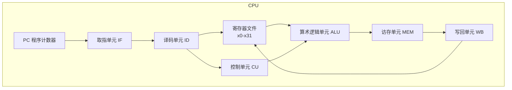
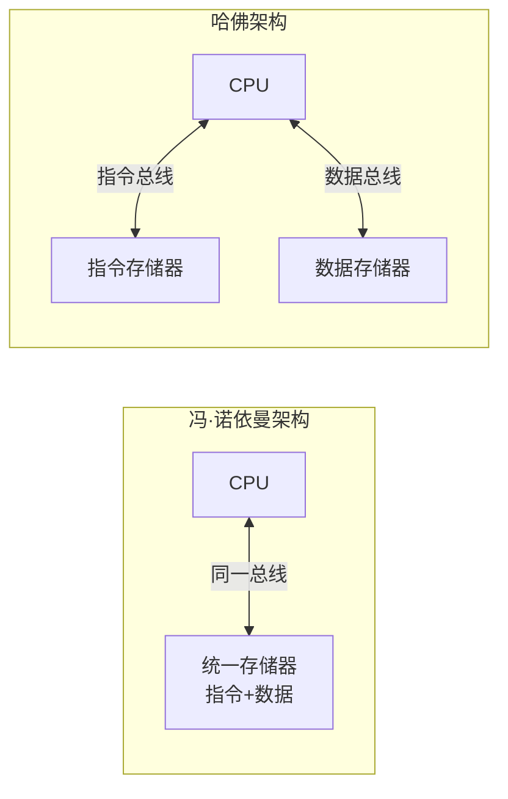
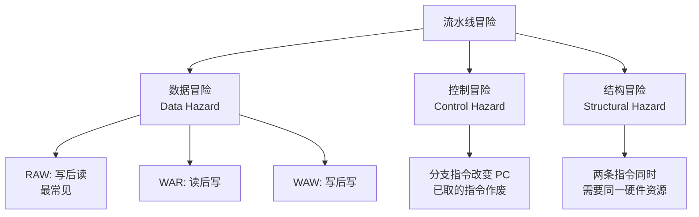
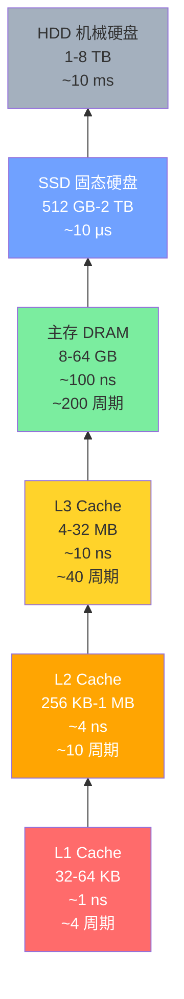
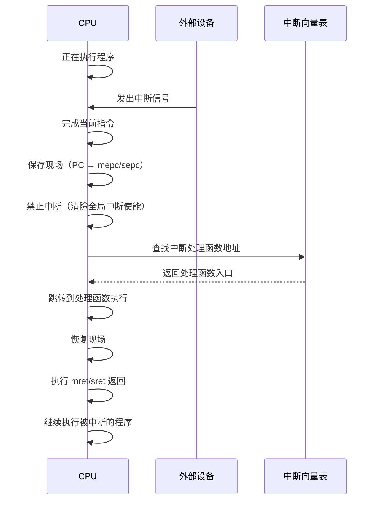

# 计算机体系结构基础

> 在深入 RISC-V 之前，先回顾 CPU 的基本组成和工作原理。这些概念是理解任何指令集架构的基石。
>
> **工程师视角**：这些"基础概念"不是过时的理论——它们是你日常调试的直觉来源。当程序突然变慢时，你想到的是"Cache miss 了？"；当多线程程序出现随机崩溃时，你想到的是"内存序问题？"。这些直觉，正是从基础概念中生长出来的。

---

## 1. CPU 的基本组成

CPU 是计算机的"大脑"，它的核心职责是：**取指令 → 译码 → 执行**。让我们拆解它的内部结构：



| 部件 | 作用 | 类比 |
|------|------|------|
| **PC（程序计数器）** | 保存当前指令的地址，每执行一条指令自动递增 | 书的"书签"，标记你读到哪一页 |
| **寄存器文件** | 一组高速存储单元，暂存操作数和结果 | 厨师的"调料台"，最常用的食材就在手边 |
| **ALU（算术逻辑单元）** | 执行加减、与或等运算 | 厨师的"刀和锅"，实际干活的地方 |
| **控制单元** | 产生控制信号，协调各部件工作 | 厨房的"总调度"，指挥谁先谁后 |
| **Cache** | 缓存常用数据，弥补 CPU 与内存的速度差距 | 冰箱，比去超市（内存）快得多 |

---

## 2. 冯·诺依曼架构 vs 哈佛架构



| 对比项 | 冯·诺依曼 | 哈佛 |
|--------|-----------|------|
| 指令和数据 | 共享同一存储空间和总线 | 分离的存储空间和总线 |
| 优点 | 硬件简单，灵活 | 可同时取指和取数，带宽翻倍 |
| 缺点 | 取指和取数不能同时进行（冯·诺依曼瓶颈） | 硬件复杂 |
| 典型应用 | 通用计算机 | DSP、微控制器、RISC-V 内部 Cache |

> **RISC-V 的实际情况：** 从 ISA 角度看是冯·诺依曼架构（统一地址空间），但现代 RISC-V 处理器内部通常采用哈佛架构的 L1 Cache（I-Cache 和 D-Cache 分离），兼顾了两种架构的优点。

---

## 3. 流水线：让 CPU 像工厂一样高效

### 3.1 为什么需要流水线？

没有流水线时，一条指令必须完全执行完，下一条才能开始：

```
多周期执行（非流水线，每条指令需要 5 个时钟周期）：

指令1: [IF][ID][EX][MEM][WB]
指令2:                        [IF][ID][EX][MEM][WB]
指令3:                                             [IF][ID][EX][MEM][WB]

→ 3 条指令需要 15 个周期，CPI = 5
```

加入流水线后，不同指令的不同阶段可以重叠执行：

```
5 级流水线：

周期:    1    2    3    4    5    6    7
指令1:  [IF] [ID] [EX] [MEM][WB]
指令2:       [IF] [ID] [EX] [MEM][WB]
指令3:            [IF] [ID] [EX] [MEM][WB]

→ 3 条指令只需 7 个周期，CPI ≈ 1（稳态）
```

### 3.2 经典 5 级流水线

| 级别 | 缩写 | 做什么 |
|------|------|--------|
| 第 1 级 | **IF**（Instruction Fetch） | 从 I-Cache 取指令，PC 递增 |
| 第 2 级 | **ID**（Instruction Decode） | 译码，读寄存器，生成立即数 |
| 第 3 级 | **EX**（Execute） | ALU 运算，计算地址，判断分支 |
| 第 4 级 | **MEM**（Memory Access） | 访问 D-Cache，加载/存储数据 |
| 第 5 级 | **WB**（Write Back） | 将结果写回寄存器文件 |

### 3.3 流水线的三大冒险



| 冒险类型 | 原因 | 解决方案 |
|----------|------|----------|
| **数据冒险** | 后续指令依赖前序指令的结果 | 转发（Forwarding/Bypassing）、流水线停顿（Stall）、指令调度 |
| **控制冒险** | 分支指令改变执行流，已取指令可能作废 | 分支预测、延迟分支、停顿 |
| **结构冒险** | 多条指令同时争用同一硬件资源 | 资源复制（如哈佛架构 I/D Cache 分离）、流水线停顿 |

---

## 4. 内存层次结构

CPU 和内存之间存在巨大的速度差距，内存层次结构通过"越快越小、越慢越大"的原则来弥补：



| 层级 | 容量 | 延迟 | 所在位置 |
|------|------|------|----------|
| 寄存器 | ~1 KB | 0 周期 | CPU 内部 |
| L1 Cache | 32-64 KB | ~4 周期 | CPU 内部 |
| L2 Cache | 256 KB-1 MB | ~10 周期 | CPU 内部/封装内 |
| L3 Cache | 4-32 MB | ~40 周期 | CPU 封装内 |
| 主存 DRAM | 8-64 GB | ~200 周期 | 主板上 |
| SSD | 512 GB+ | ~100,000 周期 | 外部接口 |

### 局部性原理

内存层次结构之所以有效，是因为程序具有两种局部性：

- **时间局部性**：刚被访问的数据，很快会被再次访问（如循环变量）
- **空间局部性**：被访问数据附近的数据，很快也会被访问（如数组遍历）

---

## 5. 中断与异常机制

### 5.1 中断 vs 异常

| 概念 | 触发源 | 同步/异步 | 举例 |
|------|--------|-----------|------|
| **中断（Interrupt）** | 外部硬件 | 异步 | 键盘输入、定时器到期、网卡收到数据 |
| **异常（Exception）** | 指令执行 | 同步 | 除零错误、缺页、非法指令 |
| **系统调用（Ecall）** | 软件主动 | 同步 | `ecall` 系统调用、`ebreak` 断点 |

> RISC-V 规范中，"trap" 是中断和异常的统称，表示任何导致 CPU 改变正常执行流的事件。`ecall`/`ebreak` 在 RISC-V 中属于异常（exception）的子类。

### 5.2 中断处理的基本流程



### 5.3 中断控制器的作用

现代系统有大量中断源，中断控制器负责：

1. **汇聚**：多个中断源 → 少量 CPU 中断线
2. **优先级**：高优先级中断先处理
3. **路由**：多核系统中将中断分配给特定 CPU
4. **屏蔽**：允许/禁止特定中断

RISC-V 中的中断控制器：
- **CLINT**（Core Local Interruptor）：处理软件中断和定时器中断
- **PLIC**（Platform-Level Interrupt Controller）：处理外部设备中断
- **AIA**（Advanced Interrupt Architecture）：新一代中断架构，支持 MSI

---

## 6. MMU 与虚拟内存

### 6.1 为什么需要虚拟内存？

| 问题 | 虚拟内存的解决方案 |
|------|---------------------|
| 程序地址冲突 | 每个进程拥有独立的地址空间 |
| 物理内存不够 | 将不常用的页换出到磁盘 |
| 内存保护 | 页表项包含权限位，防止越权访问 |
| 碎片化 | 虚拟地址连续，物理地址可以不连续 |

### 6.2 地址翻译过程


关键概念：

| 概念 | 说明 |
|------|------|
| **页（Page）** | 虚拟内存管理的最小单位，通常 4 KB |
| **页表（Page Table）** | 存储虚拟页 → 物理页的映射关系 |
| **TLB** | 页表的 Cache，加速地址翻译 |
| **缺页异常** | 访问的虚拟页不在物理内存中，触发异常由 OS 处理 |

---

## 小结

本章回顾了 CPU 体系结构的核心概念，这些知识将在后续 RISC-V 的学习中反复出现：

| 概念 | 在 RISC-V 中的对应 |
|------|---------------------|
| 寄存器文件 | RV32I 的 32 个通用寄存器 x0-x31 |
| 流水线 | RISC-V 的简洁指令集天然适合流水线实现 |
| 中断机制 | M/S/U 特权模式下的 trap 处理 |
| 虚拟内存 | Sv32/Sv39/Sv48 页表 |
| 中断控制器 | CLINT、PLIC、AIA |

→ 下一节：[RISC-V 概览](./riscv-overview.md)
