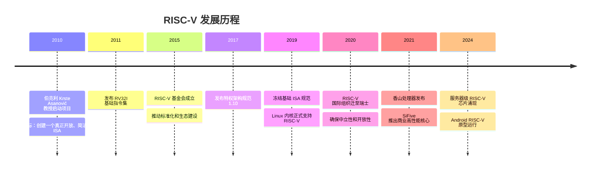
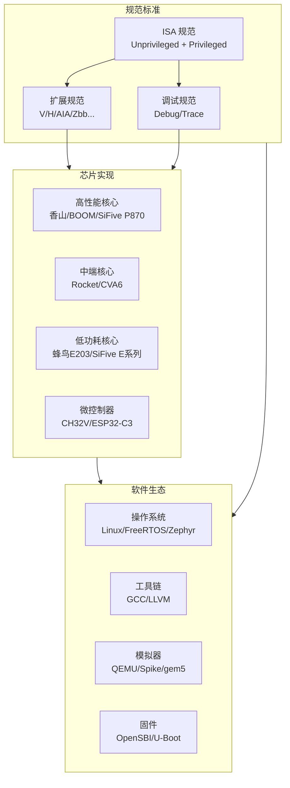

# RISC-V 概览

> RISC-V 是一个开源、模块化的指令集架构，正在改变芯片行业的游戏规则。本文从全局视角理解 RISC-V 的设计哲学与生态。
>
> **工程师视角**：RISC-V 的"开源"不只是免费——它意味着你可以深入到底层，理解每一条指令的精确行为，甚至参与标准的制定。对于系统软件工程师，这消除了 x86/ARM 中常见的"黑盒困惑"：不再依赖厂商的手册猜测行为，而是直接阅读官方 Spec 和开源实现。

---

## 1. RISC-V 的起源



**核心人物：** David Patterson（RISC 概念提出者，2017 年图灵奖得主）和 Krste Asanović。

---

## 2. 设计哲学：为什么 RISC-V 与众不同？

### 2.1 RISC-V 的核心设计原则

| 原则 | 说明 | 对比 x86/ARM |
|------|------|--------------|
| **开源免费** | 任何人都可以实现，无需授权费 | ARM 授权费高昂，x86 不开放 |
| **模块化** | 极小的基础集 + 按需扩展 | ARM 版本碎片化，x86 历史包袱重 |
| **简洁** | 基础指令集仅 40 条指令 | x86 有 1500+ 条指令 |
| **稳定** | 基础 ISA 永不改变 | x86 不断追加新指令 |
| **可扩展** | 支持自定义指令扩展 | ARM 需要授权才能扩展 |

### 2.2 一个类比

```
x86 就像一座不断加盖的老房子：
  - 每一代都在原有结构上加新房间
  - 有些房间已经没人用了，但不敢拆（向后兼容）
  - 房子越来越复杂，维护成本越来越高

ARM 就像品牌连锁酒店：
  - 设计统一，质量有保障
  - 但你想改造房间布局？请先交授权费
  - 不同版本（ARMv7/ARMv8/ARMv9）之间有差异

RISC-V 就像乐高积木：
  - 基础套装很小，只有核心积木块
  - 你可以自由选择扩展包
  - 甚至可以自己设计新的积木块
  - 没人收你授权费
```

---

## 3. 模块化扩展机制

RISC-V 的命名规范揭示了它的模块化设计：

```
RV64IMAFDC
│  │|||||
│  │|||||└── C: 压缩指令扩展（16-bit 指令）
│  |||||└─── D: 双精度浮点扩展
│  ||||└──── F: 单精度浮点扩展
│  |||└───── A: 原子指令扩展
│  ||└────── M: 乘除法扩展
│  |└─────── I: 基础整数指令集（必须）
│  └──────── 64: 整数寄存器宽度 64 位（XLEN=64）
└─────────── RV: RISC-V

常用组合：
  RV32IMAC    → 嵌入式/MCU 常见配置
  RV64IMAFDC  → 全功能 Linux 系统配置（又称 RV64GC）
```

### 扩展分类

| 类别 | 扩展名 | 说明 | 状态 |
|------|--------|------|------|
| **基础** | I | 整数指令集，必须实现 | 已冻结 |
| **标准扩展** | M | 整数乘除法 | 已冻结 |
| | A | 原子操作 | 已冻结 |
| | F | 单精度浮点 | 已冻结 |
| | D | 双精度浮点 | 已冻结 |
| | C | 压缩指令 | 已冻结 |
| **特权扩展** | H | Hypervisor 虚拟化 | 已冻结 |
| | S | Supervisor 模式 | 已冻结 |
| **子扩展** | Zicsr | CSR 指令 | 已冻结 |
| | Zifencei | 指令缓存刷新 | 已冻结 |
| | Zba | 地址生成加速 | 已冻结 |
| | Zbb | 基本位操作 | 已冻结 |
| | Zbs | 单位操作 | 已冻结 |
| **向量** | V | 向量扩展 | 已冻结 |
| **新兴** | Zicond | 条件操作 | 已冻结 |
| | Zc | 额外压缩指令 | 已冻结 |

> **命名规则：** 标准扩展用单个大写字母，子扩展用 Z + 小写字母组合。这种命名方式使得扩展可以独立开发和验证。

---

## 4. RISC-V 与其他 ISA 的对比

| 对比维度 | RISC-V | ARM | x86 |
|----------|--------|-----|-----|
| **授权模式** | 完全开源免费 | 商业授权（IP 授权费） | Intel 独占，不授权 |
| **指令数量（基础）** | ~40 条（RV32I） | ~100 条（ARMv8-A） | ~1500 条 |
| **指令长度** | 32-bit（C 扩展 16-bit） | 32-bit（Thumb2 16/32-bit） | 变长 1-15 字节 |
| **设计风格** | Load-Store 架构 | Load-Store 架构 | CISC（寄存器-内存架构） |
| **特权级** | M/S/U（+H 扩展） | EL0-EL3 | Ring 0-3 |
| **虚拟化** | H 扩展 | ARMv8.1 VHE | VT-x/AMD-V |
| **自定义扩展** | ✅ 自由扩展 | ❌ 需授权 | ❌ 不允许 |
| **生态成熟度** | 🌱 快速成长中 | 🌳 非常成熟 | 🌳 非常成熟 |
| **主要应用** | 嵌入式、IoT、新兴服务器 | 移动、嵌入式、服务器 | 桌面、服务器 |

### Load-Store 架构

RISC-V 采用 Load-Store 架构，这意味着：

- **只有 Load/Store 指令可以访问内存**
- **运算指令只能在寄存器之间操作**

```asm
# RISC-V (Load-Store)
lw   t0, 0(a0)       # 从内存加载到寄存器
add  t0, t0, t1      # 寄存器间运算
sw   t0, 0(a1)       # 从寄存器存储到内存

# x86 (CISC，允许内存操作数)
add  [rax], rbx      # 直接对内存操作数做运算
```

这种设计简化了指令解码和流水线实现，是 RISC 哲学的核心。

---

## 5. RISC-V 生态全景



### 关键组织

| 组织 | 角色 |
|------|------|
| **RISC-V International** | 管理 ISA 规范，推动标准化 |
| **CHIPS Alliance** | 推动开源硬件实现 |
| **PLCT Lab** | 中国团队，贡献工具链和模拟器 |
| **中科院** | 香山处理器开发 |
| **芯来科技** | 商业 RISC-V IP 和开发工具 |

---

## 6. RISC-V 的典型应用场景

| 场景 | 代表产品/项目 | 使用的核心 |
|------|---------------|------------|
| **微控制器** | ESP32-C3, CH32V003 | RV32IMAC |
| **IoT/嵌入式** | SiFive FE310, 蜂鸟 E203 | RV32IMAC |
| **边缘计算** | StarFive JH7110 (VisionFive 2) | RV64IMAFDC |
| **AI 加速器** | NVIDIA GPU 管理核心 | RV64I |
| **存储控制器** | Western Digital SSD 控制器 | 自定义 RV 核心 |
| **高性能计算** | 香山处理器, SiFive P870 | RV64GCV |
| **Android** | RISC-V Android 原型 | RV64GCV |
| **云服务器** | SG2042, 香山, SiFive P870 | RVA22/RVA23 Profile |

> **一个有趣的例子：** NVIDIA 在其 GPU 中使用 RISC-V 作为管理核心，取代了之前的专有微控制器。这说明了 RISC-V 在"看不见的地方"的广泛应用。

---

## 7. 服务器 Profile：RVA22 / RVA23

RISC-V 的模块化是优势，但也带来了碎片化风险。为了确保软件兼容性，RISC-V International 定义了 **Profile**——一组固定的扩展组合，类似于 ARM 的 v8.x-A Profile。

### 7.1 为什么需要 Profile？

```
没有 Profile：
  厂商 A 实现 RV64IMAFDC_Zba_Zbb
  厂商 B 实现 RV64IMAFDC_Zbc_Zbs
  → 同一份软件可能在一个平台运行，另一个不行
  → 碎片化！

有 Profile：
  RVA22 要求必须实现 Zba+Zbb+Zbs
  → 所有 RVA22 兼容的芯片都支持相同的指令集
  → 软件只需声明"需要 RVA22"即可
```

### 7.2 RVA22 Profile

RVA22（RISC-V Application processor profile 22）是面向应用处理器的 Profile，也是服务器场景的最低标准：

| 类别 | 必须包含 | 说明 |
|------|----------|------|
| **基础 ISA** | RV64I | 64 位基础整数 |
| **标准扩展** | M, A, F, D, C | 乘除法、原子、浮点、压缩 |
| **位操作** | Zba, Zbb, Zbs | 地址加速、基本位操作、单位操作 |
| **CSR** | Zicsr | CSR 指令 |
| **缓存管理** | Zicbom, Zicboz | 缓存维护和零初始化 |
| **性能计数器** | Zicntr, Zihpm | 基本和可编程计数器 |
| **计数器扩展** | Zihintpause | PAUSE 指令提示 |
| **页表** | Sv39 | 39 位虚拟地址 |
| **特权** | S-mode | Supervisor 模式 |

> **RVA22 不包含 V 扩展！** 这意味着 RVA22 兼容的服务器不一定有向量能力。如果需要向量，应选择 RVA23。

### 7.3 RVA23 Profile

RVA23 在 RVA22 基础上增加了向量扩展和更多子扩展：

| 类别 | 新增扩展 | 说明 |
|------|----------|------|
| **向量** | V | 可变长度向量扩展 |
| **向量浮点** | Zvfh, Zvfhmin | 向量半精度浮点 |
| **条件操作** | Zicond | 条件选择指令（类似 x86 CMOV） |
| **可能为0的操作** | Zimop | 预留操作指令（当前为 NOP，未来可扩展） |
| **压缩操作** | Zcmop | 压缩的条件操作 |
| **页表** | Sv48 | 48 位虚拟地址（可选 Sv57） |

### 7.4 Profile 对软件的意义

```mermaid
graph LR
    SRC[源代码] --> |"编译时指定<br/>-march=rv64gcv_zba_zbb_zbs"| BIN1[二进制]
    BIN1 --> |"运行在 RVA22 平台"| FAIL[❌ V 扩展指令<br/>可能不支持"]

    SRC --> |"编译时指定<br/>-march=rva22"| BIN2[二进制]
    BIN2 --> |"运行在 RVA22 平台"| OK[✅ 完全兼容]

    SRC --> |"编译时指定<br/>-march=rva23"| BIN3[二进制]
    BIN3 --> |"运行在 RVA23 平台"| OK2[✅ 完全兼容]
    BIN3 --> |"运行在 RVA22 平台"| FAIL2[❌ V 扩展指令<br/>不支持"]

    style OK fill:#4ecdc4,color:#fff
    style OK2 fill:#4ecdc4,color:#fff
    style FAIL fill:#ff6b6b,color:#fff
    style FAIL2 fill:#ff6b6b,color:#fff
```

| Profile | 目标场景 | 关键扩展 | 状态 |
|---------|----------|----------|------|
| **RVA20** | 通用应用处理器 | RV64GC | 已发布 |
| **RVA22** | 服务器/桌面最低标准 | + Zba/Zbb/Zbs/Zicbom/Zicboz | 已发布 |
| **RVA23** | AI/HPC 服务器 | + V/Zicond | 已发布 |
| **RVM22** | 微控制器 | RV32IMC | 已发布 |

> **服务器选型建议：** 如果目标是云服务器，至少选择 RVA22 兼容的处理器。如果需要 AI 推理或 HPC 能力，选择 RVA23 兼容的处理器。

---

## 小结

| 要点 | 说明 |
|------|------|
| RISC-V 是开源的 | 不需要授权费，任何人都可以实现 |
| 模块化是核心 | 小基础集 + 按需扩展，像乐高积木 |
| Load-Store 架构 | 只有 load/store 访问内存，简化流水线 |
| 生态正在爆发 | 从 MCU 到服务器，全场景覆盖 |
| 自定义扩展是杀手锏 | 可以针对特定领域优化，这是 x86/ARM 做不到的 |
| **Profile 防碎片化** | RVA22/RVA23 定义服务器标准扩展组合 |
| **服务器 = RVA22+** | 至少 RVA22，AI/HPC 需要 RVA23 |

→ 下一节：[基础整数指令集 RV32I/RV64I](../02-isa/rv32i-rv64i-instructions.md)
