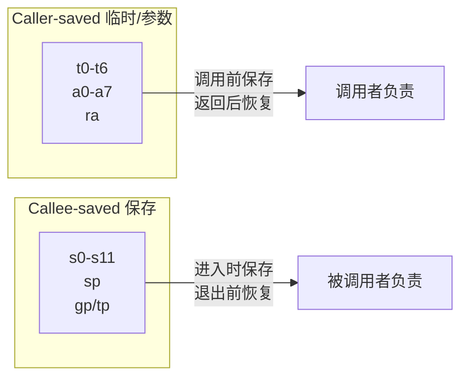

# 基础整数指令集 RV32I / RV64I

> RV32I 是 RISC-V 的灵魂——仅 40 条指令，却足以表达任何计算。理解它，就理解了 RISC-V 的设计精髓。
>
> **工程师视角**：这 40 条指令是你阅读反汇编的"字母表"。当你用 `objdump -d` 查看内核崩溃现场时，看到的不是神秘的十六进制，而是 `ld`、`add`、`beq` 这些熟悉的指令。掌握它们，就像掌握一门新语言的常用词汇——不需要背诵全部，但需要能快速识别。

### 前置知识

| 需要了解 | 参考文档 |
|----------|----------|
| RISC-V ISA 定位与模块化设计 | [RISC-V 概览](./00-riscv-overview.md) |
| CPU 寄存器文件与流水线概念 | [体系结构基础](./90-appendix-architecture-background.md) |

### 学习目标

读完本章后，你应该能够：

1. **理解寄存器用途**：区分 caller-saved 和 callee-saved 寄存器，理解 x0 硬连线为 0 的设计意义
2. **识别六种指令格式**：能一眼从编码中判断 R/I/S/B/U/J 类型，理解立即数为何打乱排列
3. **使用完整 RV32I 指令集**：能独立编写包含算术、访存、分支、跳转的完整汇编程序
4. **区分 RV32I 与 RV64I**：知道哪些指令是 RV64I 新增的，以及 W 后缀的语义
5. **理解编码规律**：掌握 opcode 的低 2 位为何始终为 11，以及 funct3/funct7 如何复用

---

## 1. 寄存器文件

RISC-V 有 32 个通用寄存器（x0-x31），其中 x0 硬连线为 0。

| 寄存器 | ABI 名称 | 用途 | 调用约定 |
|--------|----------|------|----------|
| x0 | **zero** | 常量 0（硬连线） | — |
| x1 | **ra** | 返回地址 | Caller 保存 |
| x2 | **sp** | 栈指针 | Callee 保存 |
| x3 | **gp** | 全局指针 | — |
| x4 | **tp** | 线程指针 | — |
| x5-x7 | **t0-t2** | 临时寄存器 | Caller 保存 |
| x8 | **s0/fp** | 保存寄存器 / 帧指针 | Callee 保存 |
| x9 | **s1** | 保存寄存器 | Callee 保存 |
| x10-x11 | **a0-a1** | 函数参数 / 返回值 | Caller 保存 |
| x12-x17 | **a2-a7** | 函数参数 | Caller 保存 |
| x18-x27 | **s2-s11** | 保存寄存器 | Callee 保存 |
| x28-x31 | **t3-t6** | 临时寄存器 | Caller 保存 |

> **x0 = 0 的妙用：** 很多操作不需要专门的指令，利用 x0 即可实现：
> - `MOV rd, rs` → `ADD rd, rs, x0`（加 0 等于复制）
> - `NOP` → `ADD x0, x0, x0`（结果写 x0 等于丢弃）
> - `CLR rd` → `ADD rd, x0, x0`（从 0 复制等于清零）

### Caller-saved vs Callee-saved



---

## 2. 指令格式

RISC-V 只有 6 种指令格式，设计极其规整：

```
31        25 24   20 19   15 14  12 11       7 6        0
┌───────────┬───────┬───────┬───────┬───────────┬──────────┐
│  funct7   │  rs2  │  rs1  │funct3 │    rd     │  opcode  │  R-type
├───────────┼───────┼───────┼───────┼───────────┼──────────┤
│       imm[11:0]    │  rs1  │funct3 │    rd     │  opcode  │  I-type
├───────────┼───────┼───────┼───────┼───────────┼──────────┤
│ imm[11:5] │  rs2  │  rs1  │funct3 │ imm[4:0]  │  opcode  │  S-type
├───────────┼───────┼───────┼───────┼───────────┼──────────┤
│ imm[12|10:5]│ rs2  │  rs1  │funct3 │imm[4:1|11]│  opcode  │  B-type
├───────────┼───────┴───────┴───────┼───────────┼──────────┤
│          imm[31:12]               │    rd     │  opcode  │  U-type
├───────────┴───────┬───────┬───────┼───────────┼──────────┤
│ imm[20|10:1|11|19:12]     │  rd   │  opcode   │  J-type
└───────────┴───────┴───────┴───────┴───────────┴──────────┘
```

| 格式 | 用途 | 立即数范围 | 典型指令 |
|------|------|-----------|----------|
| **R-type** | 寄存器-寄存器运算 | 无立即数 | ADD, SUB, SLL, SRL |
| **I-type** | 立即数运算 / 加载 / CSR | 12-bit 有符号 (-2048~2047) | ADDI, LW, CSRR |
| **S-type** | 存储 | 12-bit 有符号 | SW, SH, SB |
| **B-type** | 条件分支 | 13-bit 有符号（2 对齐），范围 ±4 KiB | BEQ, BNE, BLT |
| **U-type** | 长立即数 | 20-bit（左移 12 位） | LUI, AUIPC |
| **J-type** | 无条件跳转 | 21-bit 有符号（2 对齐） | JAL |

### 立即数编码的巧妙设计

RISC-V 的立即数编码看起来有些奇怪，但这是有深意的：

- **符号位始终在最高位（bit 31）**：简化了硬件中符号扩展的实现
- **所有格式共享立即数字段的位位置**：减少了硬件多路选择器的复杂度

#### B-type 立即数打乱排列

B-type 立即数为 13-bit 有符号数，bit 0 固定为 0（因为分支目标 2 字节对齐）：

```
B-type 立即数编码（13-bit 有符号，bit 0 固定为 0）:

  指令中的位置:  [31]     [30:25]  [11:8]    [7]
  立即数位:      imm[12]  imm[10:5] imm[4:1] imm[11]

  重组后:  imm[12|11|10|9|8|7|6|5|4|3|2|1|0]
           ↑  ↑  └──────┘ └─────┘ └──────┘
           31  7   30:25    11:8     (bit 0 = 0)
```

#### J-type 立即数打乱排列

J-type 立即数为 21-bit 有符号数，bit 0 固定为 0（因为跳转目标 2 字节对齐）：

```
J-type 立即数编码（21-bit 有符号，bit 0 固定为 0）:

  指令中的位置:  [31]      [30:21]   [20]      [19:12]
  立即数位:      imm[20]   imm[10:1] imm[11]   imm[19:12]

  重组后:  imm[20|19|18|...|12|11|10|9|...|1|0]
           ↑   └──────────┘  ↑  └────────┘  ↑
           31    19:12       20   30:21      (bit 0 = 0)
```

> **为什么打乱？** 符号位（imm 的最高位）始终放在指令的最高位（bit 31），这样硬件做符号扩展时只需读取 bit 31，不需要从中间位提取。其他位的排列则尽量与 I/S-type 共享位位置，减少硬件多路选择器的复杂度。

#### 六种格式如何覆盖全部指令？

理解了格式之后，你可能会问：这些格式分别对应哪些指令？不妨在脑中建立这个映射：

- **R-type** → 所有 "rd = rs1 OP rs2" 的运算：ADD, SUB, SLT, XOR…但 RV64I 的 W 后缀指令也复用了 R-type 格式（通过 funct7 区分 ADDW 和 SUBW）
- **I-type** → 三类：立即数算术（ADDI, SLLI…）、加载（所有 L* 指令，包括 RV64I 的 LWU）、环境操作（CSR 读写）
- **S-type** → 所有存储指令（SB, SH, SW, SD）。注意它牺牲 rs2 来提供第二个操作数，没有 rd 字段
- **B-type** → 6 条条件分支。立即数为 ±4 KiB 范围，且最低位永远为 0（因为 RISC-V 支持压缩指令，但分支目标仍然需要 2 字节对齐）
- **U-type** → LUI 和 AUIPC，仅两条。它们提供 20-bit 立即数左移 12 位的能力，是构造任意 32/64 位常数的"上半部分"
- **J-type** → 仅 JAL，提供 ±1 MiB 跳转范围

> **常见误区**：`JALR` 是 I-type 而非 J-type！它的立即数是 12-bit 有符号数，用于相对基址寄存器的偏移。

---

## 3. 指令详解

### 3.1 算术与逻辑指令

#### R-type（寄存器-寄存器）

| 指令 | 功能 | 等价 C 代码 | funct3 | funct7 |
|------|------|-------------|--------|--------|
| `ADD rd, rs1, rs2` | 加法 | rd = rs1 + rs2 | 000 | 0000000 |
| `SUB rd, rs1, rs2` | 减法 | rd = rs1 - rs2 | 000 | 0100000 |
| `SLL rd, rs1, rs2` | 逻辑左移 | rd = rs1 << rs2 | 001 | 0000000 |
| `SLT rd, rs1, rs2` | 有符号小于 | rd = (rs1 < rs2) ? 1 : 0 | 010 | 0000000 |
| `SLTU rd, rs1, rs2` | 无符号小于 | rd = (rs1 < rs2) ? 1 : 0 | 011 | 0000000 |
| `XOR rd, rs1, rs2` | 异或 | rd = rs1 ^ rs2 | 100 | 0000000 |
| `SRL rd, rs1, rs2` | 逻辑右移 | rd = rs1 >> rs2 | 101 | 0000000 |
| `SRA rd, rs1, rs2` | 算术右移 | rd = rs1 >> rs2（符号扩展） | 101 | 0100000 |
| `OR rd, rs1, rs2` | 或 | rd = rs1 \| rs2 | 110 | 0000000 |
| `AND rd, rs1, rs2` | 与 | rd = rs1 & rs2 | 111 | 0000000 |

> **设计亮点：** ADD 和 SUB 共享 funct3=000，通过 funct7 区分。SRL 和 SRA 同理。这减少了译码逻辑。

#### I-type（立即数运算）

| 指令 | 功能 | 等价 C 代码 |
|------|------|-------------|
| `ADDI rd, rs1, imm` | 加立即数 | rd = rs1 + imm |
| `SLTI rd, rs1, imm` | 有符号小于立即数 | rd = (rs1 < imm) ? 1 : 0 |
| `SLTIU rd, rs1, imm` | 无符号小于立即数 | rd = (rs1 < imm) ? 1 : 0 |
| `XORI rd, rs1, imm` | 异或立即数 | rd = rs1 ^ imm |
| `ORI rd, rs1, imm` | 或立即数 | rd = rs1 \| imm |
| `ANDI rd, rs1, imm` | 与立即数 | rd = rs1 & imm |
| `SLLI rd, rs1, shamt` | 逻辑左移立即数 | rd = rs1 << shamt |
| `SRLI rd, rs1, shamt` | 逻辑右移立即数 | rd = rs1 >> shamt |
| `SRAI rd, rs1, shamt` | 算术右移立即数 | rd = rs1 >> shamt（符号扩展） |

> **没有 SUBI？** 不需要！`SUBI rd, rs1, imm` 等价于 `ADDI rd, rs1, -imm`，立即数本身是有符号的。

### 3.2 加载与存储指令

RISC-V 是 Load-Store 架构，只有这两类指令可以访问内存。

#### 加载指令（I-type）

| 指令 | 功能 | 数据宽度 | 是否符号扩展 |
|------|------|----------|-------------|
| `LB rd, offset(rs1)` | 加载字节 | 8-bit | ✅ 符号扩展 |
| `LBU rd, offset(rs1)` | 加载无符号字节 | 8-bit | ❌ 零扩展 |
| `LH rd, offset(rs1)` | 加载半字 | 16-bit | ✅ 符号扩展 |
| `LHU rd, offset(rs1)` | 加载无符号半字 | 16-bit | ❌ 零扩展 |
| `LW rd, offset(rs1)` | 加载字 | 32-bit | RV64 中符号扩展到 64 位 |
| `LWU rd, offset(rs1)` | 加载无符号字（RV64） | 32-bit | 零扩展到 64 位 |
| `LD rd, offset(rs1)` | 加载双字（RV64） | 64-bit | — |

#### 存储指令（S-type）

| 指令 | 功能 | 数据宽度 |
|------|------|----------|
| `SB rs2, offset(rs1)` | 存储字节 | 8-bit |
| `SH rs2, offset(rs1)` | 存储半字 | 16-bit |
| `SW rs2, offset(rs1)` | 存储字 | 32-bit |
| `SD rs2, offset(rs1)` | 存储双字（RV64） | 64-bit |

```asm
# 示例：从数组中读取元素并加 1 后写回
# a0 = 数组基地址, a1 = 索引

slli  t0, a1, 2       # t0 = index * 4 (每个 int 占 4 字节)
add   t0, a0, t0      # t0 = &array[index]
lw    t1, 0(t0)       # t1 = array[index]
addi  t1, t1, 1       # t1 += 1
sw    t1, 0(t0)       # array[index] = t1
```

### 3.3 分支与跳转指令

#### 条件分支（B-type）

| 指令 | 功能 | 跳转条件 |
|------|------|----------|
| `BEQ rs1, rs2, offset` | 相等则跳转 | rs1 == rs2 |
| `BNE rs1, rs2, offset` | 不等则跳转 | rs1 != rs2 |
| `BLT rs1, rs2, offset` | 有符号小于则跳转 | rs1 < rs2（有符号） |
| `BGE rs1, rs2, offset` | 有符号大于等于则跳转 | rs1 >= rs2（有符号） |
| `BLTU rs1, rs2, offset` | 无符号小于则跳转 | rs1 < rs2（无符号） |
| `BGEU rs1, rs2, offset` | 无符号大于等于则跳转 | rs1 >= rs2（无符号） |

> **没有 BLE / BGT？** `BLE rs1, rs2` 等价于 `BGE rs2, rs1`，操作数交换即可。这减少了指令数量。

#### 无条件跳转

| 指令 | 功能 | 链接（保存返回地址） |
|------|------|---------------------|
| `JAL rd, offset` | 跳转并链接 | rd = PC+4, PC += offset |
| `JALR rd, rs1, offset` | 间接跳转并链接 | rd = PC+4, PC = (rs1+offset) & ~1 |

```asm
# 函数调用
jal  ra, func       # ra = 返回地址, 跳转到 func

# 函数返回
jalr x0, 0(ra)      # 跳转到 ra, 返回地址存 x0（丢弃）

# 无条件跳转（不需要返回）
jal  x0, label      # 等价于 C 的 goto
```

### 3.4 上位立即数指令（U-type）

| 指令 | 功能 | 用途 |
|------|------|------|
| `LUI rd, imm` | rd = imm << 12 | 构造 32-bit 常数的高 20 位 |
| `AUIPC rd, imm` | rd = PC + (imm << 12) | 位置无关代码，PC 相对寻址 |

```asm
# 构造任意 32-bit 常数
# 例如：加载 0x12345678 到 t0
lui   t0, 0x12345        # t0 = 0x12345000
addi  t0, t0, 0x678      # t0 = 0x12345678

# 注意：如果低 12 位的最高位为 1，addi 会做符号扩展
# 例如：加载 0x12345FFF
lui   t0, 0x12346        # t0 = 0x12346000 (高 20 位 +1)
addi  t0, t0, -1         # t0 = 0x12345FFF (-1 = 0xFFF 符号扩展)
```

#### 指令集设计的几个关键权衡

在进入速查表之前，值得停下来思考：为什么 RV32I 是这样设计的？理解这些"取舍"比死记硬背指令表更有价值：

**为什么没有 MOV / NOT / NEG？** 因为 x0=0。`ADD rd, rs, x0` 就是 MOV，`XORI rd, rs, -1` 就是 NOT，`SUB rd, x0, rs` 就是 NEG。每减少一条专用指令，就减少一点译码逻辑的面积和延迟。

**为什么只有 BEQ/BNE/BLT/BGE/BLTU/BGEU，而没有 BLE/BGT？** 交换操作数即可。`BLE rs1, rs2` 就是 `BGE rs2, rs1`。这保持了分支指令恰好 6 条，完美填满 funct3 的 3 个 bit（当然，不是全部编码都用满了——实际上还有 100 和 101 是保留的）。

**为什么 SLLI/SRLI/SRAI 的移位量只用到低 5-bit（RV32）或低 6-bit（RV64）？** 因为寄存器的位宽就是 32 或 64，移位超过位宽没有意义。I-type 的立即数字段是 12-bit，移位指令只使用其中一部分，剩余高位被 funct7 复用——SLLI 的 funct7=0000000，SRLI=0000000，SRAI=0100000，通过 funct3 和 funct7 联合解码来区分。

这些设计让 RV32I 的硬件解码器极其简洁——很大程度上，指令字中的每个 bit 位置都有固定含义，不需要复杂的多级译码。

---

## 4. RV32I 完整指令速查表

```
┌─────────────────────────────────────────────────────────┐
│                    RV32I 指令速查表                       │
├──────────┬──────────────────────────────────────────────┤
│ 算术运算  │ ADD SUB ADDI SLT SLTU SLTI SLTIU            │
│ 逻辑运算  │ AND OR XOR ANDI ORI XORI                    │
│ 移位运算  │ SLL SRL SRA SLLI SRLI SRAI                  │
│ 加载      │ LB LBU LH LHU LW                            │
│ 存储      │ SB SH SW                                     │
│ 条件分支   │ BEQ BNE BLT BGE BLTU BGEU                   │
│ 跳转       │ JAL JALR                                    │
│ 上位立即数 │ LUI AUIPC                                    │
│ 系统       │ ECALL EBREAK FENCE                           │
├──────────┼──────────────────────────────────────────────┤
│ 合计      │ 40 条指令（不含 Zicsr 和 Zifencei）         │
└──────────┴──────────────────────────────────────────────┘
```

> **关于指令计数：** RV32I 基础整数指令为 40 条（不含 Zicsr 和 Zifencei）。CSR 指令（CSRRW/CSRRS/CSRRC/CSRRWI/CSRRSI/CSRRCI）共 6 条属于 **Zicsr** 扩展，FENCE.I 属于 **Zifencei** 扩展。自 20191213 版规范起，这两个子扩展从 I 扩展中独立出来。在 GCC 工具链中，`-march=rv64i` 默认包含这两个扩展，但严格来说它们已不属于 I 扩展本身。

---

## 5. RV64I 的扩展

RV64I 在 RV32I 基础上增加了 **W 后缀指令**（32 位运算并符号扩展至 64 位）、**64 位访存指令**、以及 **无符号字加载（LWU）**——后者是 RV64I 特有的指令，用于从内存读取 32 位无符号值并零扩展到 64 位：

| 指令 | 功能 |
|------|------|
| `ADDIW rd, rs1, imm` | 32 位加立即数，结果符号扩展到 64 位 |
| `SLLIW rd, rs1, shamt` | 32 位逻辑左移，结果符号扩展 |
| `SRLIW rd, rs1, shamt` | 32 位逻辑右移，结果符号扩展 |
| `SRAIW rd, rs1, shamt` | 32 位算术右移，结果符号扩展 |
| `ADDW rd, rs1, rs2` | 32 位加法，结果符号扩展 |
| `SUBW rd, rs1, rs2` | 32 位减法，结果符号扩展 |
| `SLLW rd, rs1, rs2` | 32 位逻辑左移，结果符号扩展 |
| `SRLW rd, rs1, rs2` | 32 位逻辑右移，结果符号扩展 |
| `SRAW rd, rs1, rs2` | 32 位算术右移，结果符号扩展 |
| `LWU rd, offset(rs1)` | 加载无符号字（32-bit），零扩展到 64 位 |
| `LD rd, offset(rs1)` | 加载双字（64-bit） |
| `SD rs2, offset(rs1)` | 存储双字（64-bit） |

> **W 的含义：** Word = 32 位。W 后缀指令只使用寄存器的低 32 位进行运算，然后将结果符号扩展到 64 位。这是为了兼容 32 位代码和 `int` 类型操作。

#### LW vs LWU：理解有符号/无符号字加载的区别

在 64 位环境中，从内存加载 32 位数据有两种方式：

- **LW**：将 32 位数据符号扩展到 64 位。适用于 `int32_t` 类型的值（因为 C 语言的 `int` 是有符号的，扩展到 64 位时负数的 bit [63:32] 全是 1）
- **LWU**：将 32 位数据零扩展到 64 位。适用于 `uint32_t` 类型的值（无符号扩展，bit [63:32] 全是 0）

这也是为什么 RV64I 需要 LWU——RV32I 中寄存器就是 32 位的，不需要扩展；但在 RV64I 中，寄存器是 64 位的，需要明确指定"这个 32 位值是无符号的"。实际上，编译器在处理 `uint32_t` 变量时默认就会生成 LWU 而非 LW。

---

## 6. 指令编码规律

理解了指令的功能之后，最后来看一下它们的编码规律。RISC-V 的 opcode 编码不是随意分配的，而是有清晰的设计模式——这使得硬件译码器更简单，也方便你快速识别反汇编输出中的指令类型：

| opcode[4:0] | 类型 |
|-------------|------|
| 01101 | U-type (LUI) |
| 00101 | U-type (AUIPC) |
| 11011 | J-type (JAL) |
| 11001 | I-type (JALR) |
| 11000 | B-type (分支) |
| 00000 | I-type (加载) |
| 01000 | S-type (存储) |
| 01100 | R-type (算术逻辑) |
| 00100 | I-type (算术逻辑立即数) |
| 11100 | 系统 (ECALL/EBREAK/CSR) |

> **设计哲学：** opcode 的低 2 位始终为 11（32-bit 指令标识），这使得 C 扩展（16-bit 指令）的低 2 位可以用来区分 16-bit 和 32-bit 指令。

---

## 小结

回顾本章的内容脉络：我们从**寄存器**出发，了解了 RISC-V 的 32 个通用寄存器和调用约定；然后进入**指令格式**——6 种格式如何以最少的硬件代价覆盖所有操作；接着逐类学习了**40 条 RV32I 指令**——算术逻辑、访存、分支跳转、立即数构造；最后扩展到 **RV64I 的 12 条新增指令**——W 后缀操作和 64 位访存。

如果只记住几件事，那应该是这四点：

**RV32I 只有 40 条指令，但它是图灵完备的。** 精简不是功能弱，而是设计克制。每一条指令的存在都有明确理由，不该有的指令都通过 x0 或操作数交换来"免费"获得。

**x0=0 是寄存器层面最聪明的设计。** 它消灭了 MOV、NOP、CLR、NEG 等"伪指令"，每条省下的指令都是硬件译码器的面积和延迟。

**六种格式覆盖所有指令，JALR 也是 I-type。** 记住格式→指令的映射：R→运算、I→立即数/加载/环境、S→存储、B→分支、U→长立即数、J→跳转。JALR 不是 J-type，新手常犯这个错误。

**RV64I 通过 W 后缀优雅地支持 32 位操作，通过 LWU 填补了无符号 32 位加载的空白。** 编译器在处理 `int` 和 `uint32_t` 时会自动选择合适的指令，但理解背后的扩展策略有助于阅读反汇编。

掌握了这 40 条指令和 6 种格式，你就具备了阅读任何 RISC-V 反汇编的基本能力。接下来，我们将探索标准扩展——M（乘除法）、A（原子操作）、F/D（浮点）、C（压缩指令）等——它们构建在 RV32I/RV64I 之上，理解本章内容后学习扩展会事半功倍。

---

## 参考资料

- [RISC-V Unprivileged ISA Spec v20260517 — 第 2 章 RV32I/RV64I](https://github.com/riscv/riscv-isa-manual/releases/tag/20260517) — 整数指令集权威定义
- [David Patterson & Andrew Waterman — *The RISC-V Reader*](http://www.riscvbook.com/) — 便携入门手册，指令编码速查
- [RISC-V Assembly Programmer's Manual](https://github.com/riscv-non-isa/riscv-asm-manual/blob/master/riscv-asm.md) — 汇编编程实践指南

---

→ 下一节：[标准扩展详解](./02-standard-extensions.md)
