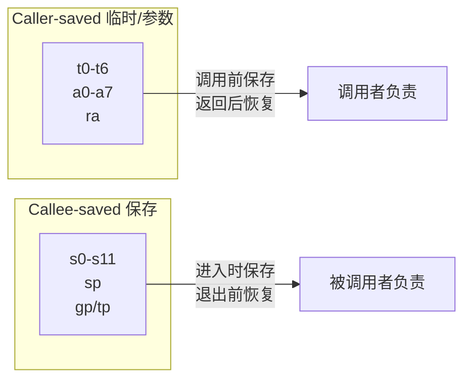

# 基础整数指令集 RV32I / RV64I

> RV32I 是 RISC-V 的灵魂——仅 40 条指令，却足以表达任何计算。理解它，就理解了 RISC-V 的设计精髓。
>
> **工程师视角**：这 40 条指令是你阅读反汇编的"字母表"。当你用 `objdump -d` 查看内核崩溃现场时，看到的不是神秘的十六进制，而是 `ld`、`add`、`beq` 这些熟悉的指令。掌握它们，就像掌握一门新语言的常用词汇——不需要背诵全部，但需要能快速识别。

### 前置知识

| 需要了解 | 参考文档 |
|----------|----------|
| RISC-V ISA 定位与模块化设计 | [RISC-V 概览](../01-basics/riscv-overview.md) |
| CPU 寄存器文件与流水线概念 | [体系结构基础](../01-basics/computer-architecture-fundamentals.md) |

---

## 1. 寄存器文件

RISC-V 有 32 个通用寄存器（x0-x31），其中 x0 硬连线为 0。

| 寄存器 | ABI 名称 | 用途 | 调用约定 |
|--------|----------|------|----------|
| x0 | **zero** | 常量 0（硬连线） | — |
| x1 | **ra** | 返回地址 | Caller 保存 |
| x2 | **sp** | 栈指针 | Callee 保存 |
| x3 | **gp** | 全局指针 | — |
| x4 | **tp** | 线程指针 | — |
| x5-x7 | **t0-t2** | 临时寄存器 | Caller 保存 |
| x8 | **s0/fp** | 保存寄存器 / 帧指针 | Callee 保存 |
| x9 | **s1** | 保存寄存器 | Callee 保存 |
| x10-x11 | **a0-a1** | 函数参数 / 返回值 | Caller 保存 |
| x12-x17 | **a2-a7** | 函数参数 | Caller 保存 |
| x18-x27 | **s2-s11** | 保存寄存器 | Callee 保存 |
| x28-x31 | **t3-t6** | 临时寄存器 | Caller 保存 |

> **x0 = 0 的妙用：** 很多操作不需要专门的指令，利用 x0 即可实现：
> - `MOV rd, rs` → `ADD rd, rs, x0`（加 0 等于复制）
> - `NOP` → `ADD x0, x0, x0`（结果写 x0 等于丢弃）
> - `CLR rd` → `ADD rd, x0, x0`（从 0 复制等于清零）

### Caller-saved vs Callee-saved



---

## 2. 指令格式

RISC-V 只有 6 种指令格式，设计极其规整：

```
31        25 24   20 19   15 14  12 11       7 6        0
┌───────────┬───────┬───────┬───────┬───────────┬──────────┐
│  funct7   │  rs2  │  rs1  │funct3 │    rd     │  opcode  │  R-type
├───────────┼───────┼───────┼───────┼───────────┼──────────┤
│       imm[11:0]    │  rs1  │funct3 │    rd     │  opcode  │  I-type
├───────────┼───────┼───────┼───────┼───────────┼──────────┤
│ imm[11:5] │  rs2  │  rs1  │funct3 │ imm[4:0]  │  opcode  │  S-type
├───────────┼───────┼───────┼───────┼───────────┼──────────┤
│ imm[12|10:5]│ rs2  │  rs1  │funct3 │imm[4:1|11]│  opcode  │  B-type
├───────────┼───────┴───────┴───────┼───────────┼──────────┤
│          imm[31:12]               │    rd     │  opcode  │  U-type
├───────────┴───────┬───────┬───────┼───────────┼──────────┤
│ imm[20|10:1|11|19:12]     │  rd   │  opcode   │  J-type
└───────────┴───────┴───────┴───────┴───────────┴──────────┘
```

| 格式 | 用途 | 立即数范围 | 典型指令 |
|------|------|-----------|----------|
| **R-type** | 寄存器-寄存器运算 | 无立即数 | ADD, SUB, SLL, SRL |
| **I-type** | 立即数运算 / 加载 / CSR | 12-bit 有符号 (-2048~2047) | ADDI, LW, CSRR |
| **S-type** | 存储 | 12-bit 有符号 | SW, SH, SB |
| **B-type** | 条件分支 | 13-bit 有符号（2 对齐），范围 ±4 KiB | BEQ, BNE, BLT |
| **U-type** | 长立即数 | 20-bit（左移 12 位） | LUI, AUIPC |
| **J-type** | 无条件跳转 | 21-bit 有符号（2 对齐） | JAL |

### 立即数编码的巧妙设计

RISC-V 的立即数编码看起来有些奇怪，但这是有深意的：

- **符号位始终在最高位（bit 31）**：简化了硬件中符号扩展的实现
- **所有格式共享立即数字段的位位置**：减少了硬件多路选择器的复杂度

---

## 3. 指令详解

### 3.1 算术与逻辑指令

#### R-type（寄存器-寄存器）

| 指令 | 功能 | 等价 C 代码 | funct3 | funct7 |
|------|------|-------------|--------|--------|
| `ADD rd, rs1, rs2` | 加法 | rd = rs1 + rs2 | 000 | 0000000 |
| `SUB rd, rs1, rs2` | 减法 | rd = rs1 - rs2 | 000 | 0100000 |
| `SLL rd, rs1, rs2` | 逻辑左移 | rd = rs1 << rs2 | 001 | 0000000 |
| `SLT rd, rs1, rs2` | 有符号小于 | rd = (rs1 < rs2) ? 1 : 0 | 010 | 0000000 |
| `SLTU rd, rs1, rs2` | 无符号小于 | rd = (rs1 < rs2) ? 1 : 0 | 011 | 0000000 |
| `XOR rd, rs1, rs2` | 异或 | rd = rs1 ^ rs2 | 100 | 0000000 |
| `SRL rd, rs1, rs2` | 逻辑右移 | rd = rs1 >> rs2 | 101 | 0000000 |
| `SRA rd, rs1, rs2` | 算术右移 | rd = rs1 >> rs2（符号扩展） | 101 | 0100000 |
| `OR rd, rs1, rs2` | 或 | rd = rs1 \| rs2 | 110 | 0000000 |
| `AND rd, rs1, rs2` | 与 | rd = rs1 & rs2 | 111 | 0000000 |

> **设计亮点：** ADD 和 SUB 共享 funct3=000，通过 funct7 区分。SRL 和 SRA 同理。这减少了译码逻辑。

#### I-type（立即数运算）

| 指令 | 功能 | 等价 C 代码 |
|------|------|-------------|
| `ADDI rd, rs1, imm` | 加立即数 | rd = rs1 + imm |
| `SLTI rd, rs1, imm` | 有符号小于立即数 | rd = (rs1 < imm) ? 1 : 0 |
| `SLTIU rd, rs1, imm` | 无符号小于立即数 | rd = (rs1 < imm) ? 1 : 0 |
| `XORI rd, rs1, imm` | 异或立即数 | rd = rs1 ^ imm |
| `ORI rd, rs1, imm` | 或立即数 | rd = rs1 \| imm |
| `ANDI rd, rs1, imm` | 与立即数 | rd = rs1 & imm |
| `SLLI rd, rs1, shamt` | 逻辑左移立即数 | rd = rs1 << shamt |
| `SRLI rd, rs1, shamt` | 逻辑右移立即数 | rd = rs1 >> shamt |
| `SRAI rd, rs1, shamt` | 算术右移立即数 | rd = rs1 >> shamt（符号扩展） |

> **没有 SUBI？** 不需要！`SUBI rd, rs1, imm` 等价于 `ADDI rd, rs1, -imm`，立即数本身是有符号的。

### 3.2 加载与存储指令

RISC-V 是 Load-Store 架构，只有这两类指令可以访问内存。

#### 加载指令（I-type）

| 指令 | 功能 | 数据宽度 | 是否符号扩展 |
|------|------|----------|-------------|
| `LB rd, offset(rs1)` | 加载字节 | 8-bit | ✅ 符号扩展 |
| `LBU rd, offset(rs1)` | 加载无符号字节 | 8-bit | ❌ 零扩展 |
| `LH rd, offset(rs1)` | 加载半字 | 16-bit | ✅ 符号扩展 |
| `LHU rd, offset(rs1)` | 加载无符号半字 | 16-bit | ❌ 零扩展 |
| `LW rd, offset(rs1)` | 加载字 | 32-bit | RV64 中符号扩展到 64 位 |
| `LD rd, offset(rs1)` | 加载双字（RV64） | 64-bit | — |

#### 存储指令（S-type）

| 指令 | 功能 | 数据宽度 |
|------|------|----------|
| `SB rs2, offset(rs1)` | 存储字节 | 8-bit |
| `SH rs2, offset(rs1)` | 存储半字 | 16-bit |
| `SW rs2, offset(rs1)` | 存储字 | 32-bit |
| `SD rs2, offset(rs1)` | 存储双字（RV64） | 64-bit |

```asm
# 示例：从数组中读取元素并加 1 后写回
# a0 = 数组基地址, a1 = 索引

slli  t0, a1, 2       # t0 = index * 4 (每个 int 占 4 字节)
add   t0, a0, t0      # t0 = &array[index]
lw    t1, 0(t0)       # t1 = array[index]
addi  t1, t1, 1       # t1 += 1
sw    t1, 0(t0)       # array[index] = t1
```

### 3.3 分支与跳转指令

#### 条件分支（B-type）

| 指令 | 功能 | 跳转条件 |
|------|------|----------|
| `BEQ rs1, rs2, offset` | 相等则跳转 | rs1 == rs2 |
| `BNE rs1, rs2, offset` | 不等则跳转 | rs1 != rs2 |
| `BLT rs1, rs2, offset` | 有符号小于则跳转 | rs1 < rs2（有符号） |
| `BGE rs1, rs2, offset` | 有符号大于等于则跳转 | rs1 >= rs2（有符号） |
| `BLTU rs1, rs2, offset` | 无符号小于则跳转 | rs1 < rs2（无符号） |
| `BGEU rs1, rs2, offset` | 无符号大于等于则跳转 | rs1 >= rs2（无符号） |

> **没有 BLE / BGT？** `BLE rs1, rs2` 等价于 `BGE rs2, rs1`，操作数交换即可。这减少了指令数量。

#### 无条件跳转

| 指令 | 功能 | 链接（保存返回地址） |
|------|------|---------------------|
| `JAL rd, offset` | 跳转并链接 | rd = PC+4, PC += offset |
| `JALR rd, rs1, offset` | 间接跳转并链接 | rd = PC+4, PC = (rs1+offset) & ~1 |

```asm
# 函数调用
jal  ra, func       # ra = 返回地址, 跳转到 func

# 函数返回
jalr x0, 0(ra)      # 跳转到 ra, 返回地址存 x0（丢弃）

# 无条件跳转（不需要返回）
jal  x0, label      # 等价于 C 的 goto
```

### 3.4 上位立即数指令（U-type）

| 指令 | 功能 | 用途 |
|------|------|------|
| `LUI rd, imm` | rd = imm << 12 | 构造 32-bit 常数的高 20 位 |
| `AUIPC rd, imm` | rd = PC + (imm << 12) | 位置无关代码，PC 相对寻址 |

```asm
# 构造任意 32-bit 常数
# 例如：加载 0x12345678 到 t0
lui   t0, 0x12345        # t0 = 0x12345000
addi  t0, t0, 0x678      # t0 = 0x12345678

# 注意：如果低 12 位的最高位为 1，addi 会做符号扩展
# 例如：加载 0x12345FFF
lui   t0, 0x12346        # t0 = 0x12346000 (高 20 位 +1)
addi  t0, t0, -1         # t0 = 0x12345FFF (-1 = 0xFFF 符号扩展)
```

---

## 4. RV32I 完整指令速查表

```
┌─────────────────────────────────────────────────────────┐
│                    RV32I 指令速查表                       │
├──────────┬──────────────────────────────────────────────┤
│ 算术运算  │ ADD SUB ADDI SLT SLTU SLTI SLTIU            │
│ 逻辑运算  │ AND OR XOR ANDI ORI XORI                    │
│ 移位运算  │ SLL SRL SRA SLLI SRLI SRAI                  │
│ 加载     │ LB LBU LH LHU LW                            │
│ 存储     │ SB SH SW                                     │
│ 条件分支  │ BEQ BNE BLT BGE BLTU BGEU                   │
│ 跳转     │ JAL JALR                                     │
│ 上位立即数│ LUI AUIPC                                    │
│ 系统     │ ECALL EBREAK FENCE                           │
├──────────┼──────────────────────────────────────────────┤
│ 合计     │ 40 条指令（不含 Zicsr 和 Zifencei）         │
└──────────┴──────────────────────────────────────────────┘
```

> **关于指令计数：** RV32I 基础整数指令为 40 条（不含 Zicsr 和 Zifencei）。CSR 指令（CSRRW/CSRRS/CSRRC/CSRRWI/CSRRSI/CSRRCI）共 6 条属于 **Zicsr** 扩展，FENCE.I 属于 **Zifencei** 扩展。自 20191213 版规范起，这两个子扩展从 I 扩展中独立出来。在 GCC 工具链中，`-march=rv64i` 默认包含这两个扩展，但严格来说它们已不属于 I 扩展本身。

---

## 5. RV64I 的扩展

RV64I 在 RV32I 基础上增加了 **W 后缀指令**，用于在 64 位寄存器上执行 32 位操作：

| 指令 | 功能 |
|------|------|
| `ADDIW rd, rs1, imm` | 32 位加立即数，结果符号扩展到 64 位 |
| `SLLIW rd, rs1, shamt` | 32 位逻辑左移，结果符号扩展 |
| `SRLIW rd, rs1, shamt` | 32 位逻辑右移，结果符号扩展 |
| `SRAIW rd, rs1, shamt` | 32 位算术右移，结果符号扩展 |
| `ADDW rd, rs1, rs2` | 32 位加法，结果符号扩展 |
| `SUBW rd, rs1, rs2` | 32 位减法，结果符号扩展 |
| `SLLW rd, rs1, rs2` | 32 位逻辑左移，结果符号扩展 |
| `SRLW rd, rs1, rs2` | 32 位逻辑右移，结果符号扩展 |
| `SRAW rd, rs1, rs2` | 32 位算术右移，结果符号扩展 |
| `LD rd, offset(rs1)` | 加载双字（64-bit） |
| `SD rs2, offset(rs1)` | 存储双字（64-bit） |

> **W 的含义：** Word = 32 位。W 后缀指令只使用寄存器的低 32 位进行运算，然后将结果符号扩展到 64 位。这是为了兼容 32 位代码和 `int` 类型操作。

---

## 6. 指令编码规律

RISC-V 的 opcode 编码有清晰的规律：

| opcode[4:0] | 类型 |
|-------------|------|
| 01101 | U-type (LUI) |
| 00101 | U-type (AUIPC) |
| 11011 | J-type (JAL) |
| 11001 | I-type (JALR) |
| 11000 | B-type (分支) |
| 00000 | I-type (加载) |
| 01000 | S-type (存储) |
| 01100 | R-type (算术逻辑) |
| 00100 | I-type (算术逻辑立即数) |
| 11100 | 系统 (ECALL/EBREAK/CSR) |

> **设计哲学：** opcode 的低 2 位始终为 11（32-bit 指令标识），这使得 C 扩展（16-bit 指令）的低 2 位可以用来区分 16-bit 和 32-bit 指令。

---

## 小结

| 要点 | 说明 |
|------|------|
| 40 条指令足够 | RV32I 虽然精简，但图灵完备 |
| x0=0 消除冗余 | 不需要 MOV、NOP、CLR 等专用指令 |
| 格式规整 | 6 种格式，立即数符号位统一在 bit 31 |
| Load-Store 架构 | 运算和访存分离，简化流水线 |
| RV64 加 W 后缀 | 优雅地支持 32 位操作 |

---

## 参考资料

- [RISC-V Unprivileged ISA Spec v20240411 — 第 2 章 RV32I/RV64I](https://github.com/riscv/riscv-isa-manual/releases/tag/20240411) — 整数指令集权威定义
- [David Patterson & Andrew Waterman — *The RISC-V Reader*](http://www.riscvbook.com/) — 便携入门手册，指令编码速查
- [RISC-V Assembly Programmer's Manual](https://github.com/riscv-non-isa/riscv-asm-manual/blob/master/riscv-asm.md) — 汇编编程实践指南

---

→ 下一节：[标准扩展详解](./standard-extensions.md)
