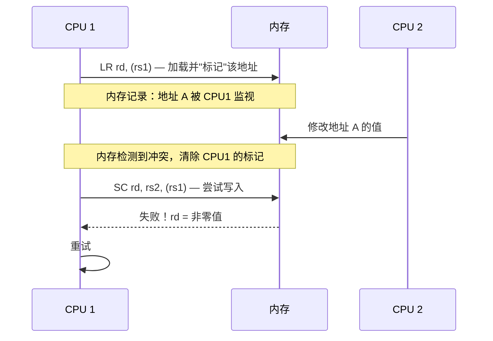
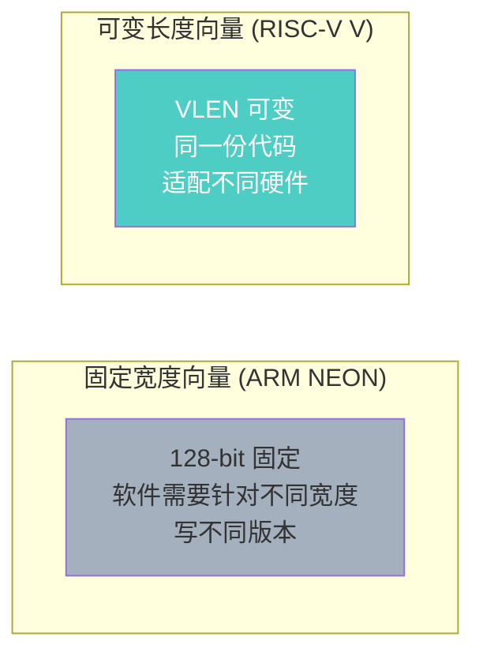

# 标准扩展 M / A / F / D / C

> RISC-V 的模块化设计意味着你可以按需添加功能。这些标准扩展覆盖了乘除法、原子操作、浮点和代码密度。
>
> **工程师视角**：扩展不是"越多越好"。服务器芯片需要 A（原子操作）和 V（向量）扩展；实时嵌入式系统可能只需要 M 扩展；而 Boot ROM 为了最小体积，可能连 M 都不要。理解每个扩展的代价和收益，是架构设计的基础决策。

### 前置知识

| 需要了解 | 参考文档 |
|----------|----------|
| RV32I/RV64I 整数指令集 | [RV32I/RV64I 指令集详解](./rv32i-rv64i-instructions.md) |
| RISC-V 模块化扩展理念与 Profile | [RISC-V 概览](../01-basics/riscv-overview.md) |

---

## 1. M 扩展：整数乘除法

M 扩展添加了 8 条乘除法指令，分为有符号和无符号两类。

### 1.1 乘法指令

| 指令 | 功能 | 结果位宽 | 说明 |
|------|------|----------|------|
| `MUL rd, rs1, rs2` | 乘法（低半部分） | XLEN | rd = (rs1 × rs2)[XLEN-1:0] |
| `MULH rd, rs1, rs2` | 有符号×有符号（高半部分） | XLEN | rd = (rs1 × rs2)[2*XLEN-1:XLEN] |
| `MULHU rd, rs1, rs2` | 无符号×无符号（高半部分） | XLEN | 同上，无符号 |
| `MULHSU rd, rs1, rs2` | 有符号×无符号（高半部分） | XLEN | rs1 有符号，rs2 无符号 |

> **为什么需要 MULH 系列？** 两个 32 位数相乘结果是 64 位，`MUL` 只返回低 32 位。要获取完整结果，需要 `MUL` + `MULH` 配合使用。

```asm
# 64 位乘法结果（RV32I + M）
# a0:a1 = a2 * a3
mul   a0, a2, a3       # 低 32 位
mulh  a1, a2, a3       # 高 32 位

# 只需要低 32 位时，一条 MUL 即可
mul   t0, t1, t2       # t0 = t1 * t2（低 32 位）
```

### 1.2 除法指令

| 指令 | 功能 | 特殊情况处理 |
|------|------|-------------|
| `DIV rd, rs1, rs2` | 有符号除法 | 除以 0 → -1；溢出 → -2^(XLEN-1) |
| `DIVU rd, rs1, rs2` | 无符号除法 | 除以 0 → 2^XLEN - 1 |
| `REM rd, rs1, rs2` | 有符号取余 | 除以 0 → rs1；溢出 → 0 |
| `REMU rd, rs1, rs2` | 无符号取余 | 除以 0 → rs1 |

> **除以 0 不触发异常！** 这是 RISC-V 的设计选择——除以 0 返回特殊值而非触发异常，简化了控制逻辑。软件可以自行检查除数是否为 0。

| 除以 0 的返回值 | 有符号 | 无符号 |
|-----------------|--------|--------|
| DIV | -1 | 2^XLEN - 1 |
| REM | rs1 | rs1 |

---

## 2. A 扩展：原子操作

A 扩展提供两种原子操作机制：**LR/SC**（保留加载/条件存储）和 **AMO**（原子内存操作）。

### 2.1 LR/SC：锁的实现基础

#### 为什么需要 LR/SC？

想象两个 CPU 核心同时想修改同一个变量：
- CPU 0 读取值为 0，想加 1 变成 1
- CPU 1 同时读取值也是 0，也想加 1 变成 1
- 结果：两个都写回 1，但正确结果应该是 2！

这就是**竞态条件**。我们需要一种机制，确保"读取-修改-写回"这三步作为一个整体完成，中间不能被其他 CPU 打断。

#### LR/SC 的工作原理

LR/SC 采用**乐观锁**策略：先读，再检查，最后写。如果检查期间有人修改过，就放弃并重试。



**关键概念：**

| 概念 | 解释 |
|------|------|
| **保留标记（Reservation）** | LR 执行后，硬件在该地址设置一个"监视标记"，记录这是"我的"地址 |
| **监视范围（Reservation Set）** | 实际监视的是一个**缓存行**（通常 64 字节），而不仅是目标地址 |
| **SC 失败条件** | 1) 其他 CPU 写了同一缓存行；2) 当前 CPU 执行了其他 SC；3) 中断/上下文切换 |

#### 指令详解

| 指令 | 功能 | 返回值 |
|------|------|--------|
| `LR.W rd, (rs1)` | 加载 32 位值，并在该地址设置保留标记 | rd = 内存值 |
| `SC.W rd, rs2, (rs1)` | 若保留标记仍有效，将 rs2 写入内存 | rd = 0（成功）或 非零（失败） |
| `LR.D rd, (rs1)` | 64 位版本（RV64） | — |
| `SC.D rd, rs2, (rs1)` | 64 位版本（RV64） | — |

> **重要：** SC 的返回值写入 rd，不是写入内存！内存写入是否成功由 rd 是否为 0 表示。

#### 实际例子：自旋锁

```asm
# 自旋锁实现
# a0 指向锁变量（0=未锁，1=已锁）

spin_lock:
    li    t0, 1          # t0 = 1（锁的值）
1:
    lr.w  t1, (a0)       # ① 读取锁状态，设置保留标记
    bnez  t1, 1b         # ② 如果锁已被持有（t1 != 0），重试
    sc.w  t1, t0, (a0)   # ③ 尝试将 1 写入锁（仅在保留有效时成功）
    bnez  t1, 1b         # ④ 如果 SC 失败（t1 != 0），重试
    ret                  # 成功获取锁

spin_unlock:
    sw    x0, (a0)       # 简单地将 0 写入锁即可释放
    ret
```

**逐行详解：**

| 行 | 指令 | 详解 |
|---|------|------|
| `li t0, 1` | 加载立即数 | 把 1 放进寄存器 t0。这个 1 就是"锁被占用"的标志值 |
| `1:` | 标签 | 定义一个名为 "1" 的标签，用于循环跳转。`1b` 表示 backward（向前跳转到最近的标签1） |
| `lr.w t1, (a0)` | 保留加载 | **L**oad-**R**eserved。从 a0 指向的内存读取 32 位值到 t1，同时硬件在这个地址做个"记号"（保留标记） |
| `bnez t1, 1b` | 不为零则跳转 | **B**ranch if **N**ot **E**qual **Z**ero。如果 t1 ≠ 0（锁已被占用），跳回标签 1 重新尝试 |
| `sc.w t1, t0, (a0)` | 条件存储 | **S**tore-**C**onditional。尝试把 t0（值1）写入 a0 指向的内存。**只有保留标记还在时才成功**。结果（0=成功，非0=失败）写入 t1 |
| `bnez t1, 1b` | 不为零则跳转 | 如果 SC 失败（t1 ≠ 0），跳回标签 1 重新尝试。失败原因可能是其他 CPU 在此期间修改了锁 |
| `ret` | 返回 | 成功获取锁，返回调用者 |
| `sw x0, (a0)` | 存储字 | **S**tore **W**ord。把 x0（恒为0）写入锁变量，表示释放锁。普通 store 即可，因为释放锁时只有持有者有权限写 |

**关键理解点：**

```
为什么需要两次 bnez 检查？

第一次 bnez（lr.w 之后）：
  检查锁是否已被占用
  如果锁是 1（被占用），直接重试，不执行 SC
  这是一种优化，避免不必要的 SC 操作

第二次 bnez（sc.w 之后）：
  检查 SC 是否成功
  即使锁原来是 0（空闲），执行 SC 时也可能失败
  失败原因：其他 CPU 在 LR 和 SC 之间抢占了锁
```

**执行流程分析：**

```
情况 1：锁空闲，无竞争
  LR:  读取 0，设置保留标记
  SC:  保留标记仍有效，写入 1 成功，返回 0
  → 获取锁成功

情况 2：锁被占用
  LR:  读取 1
  检查：bnez 发现不为 0，跳回重试
  → 忙等待直到锁释放

情况 3：获取锁期间被其他 CPU 抢占（竞态）
  CPU 0: LR 读取 0，设置保留标记
  CPU 1: 获取锁成功，将地址改为 1
  CPU 0: SC 发现保留标记已被清除（CPU 1 修改了同一缓存行）
         SC 失败，返回非零，跳回重试
  → 安全地重试，不会破坏数据
```

#### LR/SC 使用规则

RISC-V 规范对 LR/SC 序列有严格要求：

1. **指令数量限制**：LR 和 SC 之间最多 16 条指令（实际实现可能更严格）
2. **只能访问相同地址**：SC 的地址必须与 LR 相同
3. **不能执行其他 SC**：一个 LR/SC 序列中只能有一个 SC
4. **不能执行系统调用**：LR/SC 序列中不能有 ECALL/EBREAK

#### 何时使用 LR/SC 而非 AMO？

| 场景 | 推荐方式 | 原因 |
|------|----------|------|
| 简单原子操作（加、交换） | AMO | 一条指令完成，更高效 |
| 复杂条件判断（如链表插入） | LR/SC | 需要检查条件后再决定是否写入 |
| 实现锁、信号量 | LR/SC | 需要检查锁状态再尝试获取 |
| 无锁数据结构 | LR/SC | 需要比较-交换（CAS）语义 |

> **AMO vs LR/SC 类比：** AMO 像银行柜台的"即时业务"（存取款），一次搞定；LR/SC 像"需要审批的业务"（贷款），先查资料，再决定是否办理，如果期间政策变了就重新申请。

### 2.2 AMO：原子内存操作

AMO 指令在一条指令中完成"读取-修改-写回"，天然原子：

| 指令 | 功能 | 等价伪代码 |
|------|------|-----------|
| `AMOSWAP.W rd, rs2, (rs1)` | 原子交换 | temp = *addr; *addr = rs2; rd = temp |
| `AMOADD.W rd, rs2, (rs1)` | 原子加 | temp = *addr; *addr += rs2; rd = temp |
| `AMOAND.W rd, rs2, (rs1)` | 原子与 | temp = *addr; *addr &= rs2; rd = temp |
| `AMOOR.W rd, rs2, (rs1)` | 原子或 | temp = *addr; *addr \|= rs2; rd = temp |
| `AMOXOR.W rd, rs2, (rs1)` | 原子异或 | temp = *addr; *addr ^= rs2; rd = temp |
| `AMOMIN.W rd, rs2, (rs1)` | 原子最小值（有符号） | temp = *addr; *addr = min(*addr, rs2); rd = temp |
| `AMOMAX.W rd, rs2, (rs1)` | 原子最大值（有符号） | temp = *addr; *addr = max(*addr, rs2); rd = temp |
| `AMOMINU.W rd, rs2, (rs1)` | 原子最小值（无符号） | 同上，无符号比较 |
| `AMOMAXU.W rd, rs2, (rs1)` | 原子最大值（无符号） | 同上，无符号比较 |

> 所有 AMO 指令都有 `.W`（32 位）和 `.D`（64 位，RV64）两个版本。

```asm
# 原子计数器递增
# a0 指向计数器
amoadd.w t0, t1, (a0)    # *counter += t1, t0 = 旧值

# 原子设置标志位
li      t1, 0x01
amoand.w t0, t1, (a0)    # *flags &= 0x01, t0 = 旧值
```

### 2.3 内存序（Fence）

AMO 和 LR/SC 可以附加 `.AQ`（Acquire）和 `.RL`（Release）后缀来控制内存序：

| 后缀 | 含义 | 典型用途 |
|------|------|----------|
| （无） | 无排序保证 | 单核或已知无竞争场景 |
| `.AQ` | 后续读写不能重排到此指令之前 | 获取锁 |
| `.RL` | 前序读写不能重排到此指令之后 | 释放锁 |
| `.AQRL` | 同时具有 AQ 和 RL 语义 | 全屏障 |

```asm
# 使用 Acquire-Release 语义的自旋锁
spin_lock:
    li    t0, 1
1:
    lr.w.aq  t1, (a0)     # Acquire: 后续操作不能提前
    bnez  t1, 1b
    sc.w.rl  t1, t0, (a0) # Release: 之前的操作不能延后
    bnez  t1, 1b
    ret
```

---

## 3. F/D 扩展：浮点运算

### 3.1 浮点寄存器

F 扩展添加 32 个浮点寄存器 **f0-f31**（每个 32-bit），D 扩展将宽度扩展到 64-bit。

| 浮点寄存器 | ABI 名称 | 用途 | 调用约定 |
|-----------|----------|------|----------|
| f0-f7 | ft0-ft7 | 临时寄存器 | Caller 保存 |
| f8-f9 | fs0-fs1 | 保存寄存器 | Callee 保存 |
| f10-f11 | fa0-fa1 | 参数/返回值 | Caller 保存 |
| f12-f17 | fa2-fa7 | 参数 | Caller 保存 |
| f18-f27 | fs2-fs11 | 保存寄存器 | Callee 保存 |
| f28-f31 | ft8-ft11 | 临时寄存器 | Caller 保存 |

### 3.2 F 扩展指令（单精度）

| 类别 | 指令 | 功能 |
|------|------|------|
| **算术** | `FADD.S` `FSUB.S` `FMUL.S` `FDIV.S` | 加减乘除 |
| | `FSQRT.S` | 平方根 |
| | `FMIN.S` `FMAX.S` | 最小/最大值 |
| **转换** | `FCVT.W.S` `FCVT.S.W` | 整数 ↔ 单精度 |
| | `FCVT.L.S` `FCVT.S.L` | 长整数 ↔ 单精度（RV64） |
| | `FMV.X.W` `FMV.W.X` | 位模式搬移（不转换） |
| **比较** | `FEQ.S` `FLT.S` `FLE.S` | 相等/小于/小于等于 |
| **其他** | `FSGNJ.S` `FSGNJN.S` `FSGNJX.S` | 符号注入 |
| | `FCLASS.S` | 分类（NaN/Inf/零/正规数等） |

### 3.3 D 扩展指令（双精度）

D 扩展的指令与 F 扩展完全对称，只需将 `.S` 替换为 `.D`：

| F 扩展 | D 扩展 | 说明 |
|--------|--------|------|
| `FADD.S` | `FADD.D` | 双精度加减乘除 |
| `FCVT.W.S` | `FCVT.W.D` | 双精度与整数互转 |
| `FMV.X.W` | `FMV.X.D` | 64 位位模式搬移（RV64） |
| — | `FCVT.S.D` / `FCVT.D.S` | 单双精度互转 |

### 3.4 浮点控制状态寄存器（fcsr）

```
fcsr (32-bit):
┌─────────────────────────────────┬───────┬───────────────┐
│              reserved           │  FRM  │     FFLAGS     │
│                                 │ [7:5] │    [4:0]      │
└─────────────────────────────────┴───────┴───────────────┘

FFLAGS (浮点异常标志):
  bit 4: NV - 无效操作 (Invalid)
  bit 3: DZ - 除以零 (Divide by Zero)
  bit 2: OF - 上溢 (Overflow)
  bit 1: UF - 下溢 (Underflow)
  bit 0: NX - 不精确 (Inexact)

FRM (舍入模式):
  000: RNE - 向最近偶数舍入 (默认)
  001: RTZ - 向零舍入
  010: RDN - 向负无穷舍入
  011: RUP - 向正无穷舍入
  100: RMM - 向最近值舍入，远离零
  111: DYN - 动态舍入模式（由 fcsr.FRM 决定）
```

---

## 4. C 扩展：压缩指令

C 扩展将常用指令编码为 16-bit，可减少代码体积 25%-30%。

### 4.1 设计原理

```
32-bit 指令的低 2 位始终为 11
16-bit 指令的低 2 位为 00, 01, 10

→ 硬件可以通过低 2 位快速判断指令长度
→ 16-bit 和 32-bit 指令可以自由混合，无需对齐
```

### 4.2 常用压缩指令

| 压缩指令 | 展开后的 32-bit 指令 | 说明 |
|----------|---------------------|------|
| `C.LI rd, imm6` | `ADDI rd, x0, imm6` | 加载小立即数 |
| `C.LUI rd, imm6` | `LUI rd, imm6` | 加载上位立即数 |
| `C.ADDI rd, imm6` | `ADDI rd, rd, imm6` | 加小立即数 |
| `C.ADDI4SPN rd', imm` | `ADDI rd', sp, imm` | 基于 SP 的地址计算 |
| `C.ADDI16SP imm` | `ADDI sp, sp, imm` | 调整栈指针 |
| `C.MV rd, rs` | `ADD rd, x0, rs` | 寄存器复制 |
| `C.ADD rd, rs` | `ADD rd, rd, rs` | 寄存器加法 |
| `C.LW rd', offset(rs1')` | `LW rd, offset(rs1)` | 加载字 |
| `C.SW rs2', offset(rs1')` | `SW rs2, offset(rs1)` | 存储字 |
| `C.BEQZ rs', offset` | `BEQ rs, x0, offset` | 等于零则跳转 |
| `C.BNEZ rs', offset` | `BNE rs, x0, offset` | 不等于零则跳转 |
| `C.J offset` | `JAL x0, offset` | 无条件跳转 |
| `C.JAL offset` | `JAL x1, offset` | 调用（RV32） |
| `C.JR rs` | `JALR x0, 0(rs)` | 寄存器跳转 |
| `C.JALR rs` | `JALR x1, 0(rs)` | 寄存器调用 |
| `C.NOP` | `ADDI x0, x0, 0` | 空操作 |
| `C.EBREAK` | `EBREAK` | 断点 |

> **C 扩展的限制：** 压缩指令只能访问部分寄存器（x8-x15，即 s0-s1, a0-a5），立即数范围也有限。这是 16-bit 编码空间有限的妥协。

### 4.3 代码密度对比

```asm
# 不使用 C 扩展（每条 4 字节，共 20 字节）
addi  sp, sp, -16
sw    ra, 12(sp)
sw    s0, 8(sp)
addi  s0, sp, 16
li    a5, 0

# 使用 C 扩展（混合 16/32-bit，共 14 字节，节省 30%）
c.addi sp, -16       # 2 字节
c.sw   ra, 12(sp)    # 2 字节
c.sw   s0, 8(sp)     # 2 字节
c.addi s0, sp, 16    # 2 字节
c.li   a5, 0         # 2 字节
```

---

## 5. B 扩展：位操作

B 扩展（Bitmanip）提供高效的位操作指令，对密码学、网络包处理、数据压缩等场景有显著加速。B 扩展由多个 Zb* 子扩展组成。

### 5.1 子扩展概览

| 子扩展 | 名称 | 说明 | 状态 |
|--------|------|------|------|
| **Zba** | 地址生成加速 | 加速数组索引计算 | 已冻结 |
| **Zbb** | 基本位操作 | 位反转、计数、最值等 | 已冻结 |
| **Zbs** | 单位操作 | 位设置/清除/取反/提取 | 已冻结 |
| **Zbc** | 进位乘法 | 大数乘法加速 | 已冻结 |
| **Zbkb** | 密码学位操作 | 密码学专用位操作：字节置换、按位旋转 | 已冻结 |
| **Zbkc** | 密码学进位乘法 | 无进位乘法加速（CLMUL），用于 GCM 模式 | 已冻结 |
| **Zbkx** | 交叉乘 | 32-bit 交叉乘法，加速 AES S-box 查表 | 已冻结 |

> **RVA22 Profile 要求：** 服务器场景的 RVA22 Profile 强制要求 Zba + Zbb + Zbs，是 RV64 服务器的事实标准。

### 5.2 Zba：地址生成加速

Zba 提供了加速地址计算的指令——将"移位 + 加法"合并为一条指令：

| 指令 | 功能 | 等价操作 | 典型用途 |
|------|------|----------|----------|
| `SH1ADD rd, rs1, rs2` | rs1 << 1 + rs2 | rd = (rs1 << 1) + rs2 | 数组索引（2 字节元素） |
| `SH2ADD rd, rs1, rs2` | rs1 << 2 + rs2 | rd = (rs1 << 2) + rs2 | 数组索引（4 字节元素） |
| `SH3ADD rd, rs1, rs2` | rs1 << 3 + rs2 | rd = (rs1 << 3) + rs2 | 数组索引（8 字节元素） |

```asm
# 传统方式：访问 int 数组
slli  t0, a1, 2        # t0 = index * 4
add   t0, a0, t0       # t0 = base + index * 4
lw    t1, 0(t0)        # t1 = array[index]

# Zba 方式：节省一条指令
sh2add t0, a1, a0      # t0 = base + index * 4（一条搞定）
lw     t1, 0(t0)       # t1 = array[index]
```

### 5.3 Zbb：基本位操作

| 指令 | 功能 | 用途 |
|------|------|------|
| `CLZ rd, rs` | 前导零计数 | 快速求 log2，优先级编码 |
| `CTZ rd, rs` | 后导零计数 | 求最低有效位位置 |
| `CPOP rd, rs` | 位计数（popcount） | 海明距离、位图统计 |
| `MIN rd, rs1, rs2` | 有符号最小值 | 排序、限幅 |
| `MAX rd, rs1, rs2` | 有符号最大值 | 排序、限幅 |
| `MINU rd, rs1, rs2` | 无符号最小值 | 无符号比较 |
| `MAXU rd, rs1, rs2` | 无符号最大值 | 无符号比较 |
| `SEXT.B rd, rs` | 符号扩展字节 | 数据类型转换 |
| `SEXT.H rd, rs` | 符号扩展半字 | 数据类型转换 |
| `ZEXT.H rd, rs` | 零扩展半字 | 数据类型转换 |
| `REV8 rd, rs` | 字节反转 | 大小端转换 |
| `ORC.B rd, rs` | 字节级或合并 | 字符串处理 |
| `ROL rd, rs1, rs2` | 循环左移 | 密码学 |
| `ROR rd, rs1, rs2` | 循环右移 | 密码学 |
| `RORI rd, rs1, shamt` | 立即数循环右移 | 密码学 |

```asm
# 前导零计数 → 快速求 log2
clz   t0, a0           # t0 = 前导零个数
li    t1, 63
sub   t0, t1, t0       # t0 = 63 - clz = floor(log2(a0))

# popcount → 统计位图中有多少位被设置
cpop  t0, a0           # t0 = a0 中 1 的个数

# 循环移位 → 密码学中的常见操作
ror   t0, a0, a1       # t0 = a0 循环右移 a1 位
```

### 5.4 Zbs：单位操作

| 指令 | 功能 | 等价操作 |
|------|------|----------|
| `BSET rd, rs1, rs2` | 设置指定位 | rd = rs1 \| (1 << rs2) |
| `BCLR rd, rs1, rs2` | 清除指定位 | rd = rs1 & ~(1 << rs2) |
| `BINV rd, rs1, rs2` | 取反指定位 | rd = rs1 ^ (1 << rs2) |
| `BEXT rd, rs1, rs2` | 提取指定位 | rd = (rs1 >> rs2) & 1 |

```asm
# 传统方式：设置第 5 位
li    t0, 0x20         # 1 << 5
or    t1, a0, t0       # t1 = a0 | (1 << 5)

# Zbs 方式：一条指令
bseti t1, a0, 5        # t1 = a0 | (1 << 5)，更直观
```

### 5.5 密码学子扩展：Zbkb / Zbkc / Zbkx

密码学子扩展针对 AES、SM4、GHASH 等算法的核心操作做了硬件加速。对于 TLS/DTLS、磁盘加密、区块链等需要大量密码运算的场景，这些指令可以带来 **3-10 倍**的性能提升。

#### Zbkb：基本密码学位操作

| 指令 | 功能 | 密码学用途 |
|------|------|-----------|
| `PACK` `PACKH` `PACKW` | 寄存器高低半部分打包/组合 | SHA-256 消息调度中的 32-bit 加法 |
| `BREV8` | 按位反转字节内的位（bit-reverse within byte） | 比特反转用于 CRC、扰码 |
| `REV8` | 字节序反转（大小端转换） | 数据格式转换（网络字节序 ↔ 主机序） |
| `UNZIP` `ZIP` | 比特交叉/解交叉 | AES S-box 查表前的比特重排 |
| `ROL` `ROR` `RORI` | 循环左移/右移 | SHA-256 的 Σ0/Σ1 函数、SM3 的 P0/P1 置换 |
| `ANDN` `ORN` `XNOR` | 与非、或非、同或 | 布尔函数加速 |
| `CLMUL` `CLMULH` `CLMULR` | 无进位乘法（低位/高位/反转） | GHASH/GCM 的有限域乘法 |
| `GORC` `GREV` | 广义 OR-Combine / 广义 Reverse | SHA-3/Keccak 的 θ 步骤 |

#### Zbkc：无进位乘法

Zbkc 实际是 Zbkb 中 `CLMUL*` 指令的子集，专门用于 GCM（Galois/Counter Mode）：

```asm
# GCM 中 GHASH 的有限域乘法 (GF(2^128))
# 传统 C 实现需要数百条指令逐位处理
# Zbkc 只需：
clmul   t0, a0, a1        # 低 64 位 × 低 64 位（无进位）
clmulh  t1, a0, a1        # 高 64 位 × 高 64 位（无进位）
# 然后用几条 XOR 和移位完成 GF 约简
```

> **为什么需要无进位乘法？** 普通乘法会有进位传播，而有限域 GF(2^n) 上的乘法定义为多项式乘法（异或代替加法），天然不需要进位传播。无进位乘法 `CLMUL`（CarryLess MULtiplication）直接实现了这一点，比软件逐比特循环快 **10-50 倍**。

#### Zbkx：交叉乘指令

Zbkx 提供两条专用指令：

| 指令 | 功能 | 说明 |
|------|------|------|
| `XPERM8 rd, rs1, rs2` | 交叉字节置换 | 用 rs2 的字节索引从 rs1 选字节，实现 S-box 查表 |
| `XPERM4 rd, rs1, rs2` | 交叉半字置换 | 类似 XPERM8，但按 4-bit 半字索引 |

```asm
# AES SubBytes 步骤：每个字节进入 S-box 查表替换
# 传统方式：查 256 字节的表 → 需要 load 指令，可能 cache miss
# Zbkx 方式：
#   预加载 S-box 到寄存器 rs1（8 字节容纳不了 256 条目，
#   通常需要多次加载，但配合压缩指令可减少代码体积）
#   但核心优势在于消除了分支和内存依赖
#   对于 SM4 这种 8-bit S-box，XPERM8 一条指令就能完成查表
xperm8  t0, t0, a0        # t0 中每个字节作为索引，从 a0 中选对应字节
```

> **实际应用场景：** 在 TLS 1.3 握手过程中，AES-GCM 和 ChaCha20-Poly1305 是强制密码套件。支持 Zbkb+Zbkc 的 RISC-V 处理器可以在无专用加密引擎的情况下，仅靠指令扩展就接近硬件加速器的吞吐量。这对于 IoT 设备和边缘网关（面积/功耗受限，无法放置大型加密 IP）尤为关键。

---

V 扩展是 RISC-V 最重要的扩展之一，提供可变长度向量（Vector）处理能力，对 AI 推理、信号处理、多媒体等场景至关重要。

### 6.1 设计哲学：可变长度向量

与 ARM SVE/NEON 的固定宽度向量不同，RISC-V V 扩展采用**可变长度向量**设计：



| 特性 | ARM NEON | ARM SVE | RISC-V V |
|------|----------|---------|----------|
| **向量宽度** | 固定 128-bit | 可变 128~2048-bit | 可变（VLEN 由实现决定） |
| **编程模型** | 需要知道宽度 | 通过谓词（Predicate） | 通过 vsetvli 动态设置 |
| **前向兼容** | ❌ 新硬件需重新编译 | ✅ 同一二进制可扩展 | ✅ 同一二进制可扩展 |
| **掩码操作** | 有限 | 谓词寄存器 | 掩码寄存器 v0 |

### 6.2 向量寄存器

V 扩展添加 32 个向量寄存器 v0-v31，每个宽度为 VLEN（实现决定，常见 128/256/512-bit）。

| 寄存器 | 特殊用途 |
|--------|----------|
| **v0** | 掩码寄存器（1 bit per element） |
| **v1-v31** | 通用向量数据寄存器 |

> **向量分组（LMUL）：** 可以将多个向量寄存器组合使用，形成更宽的向量。LMUL=1 使用 1 个寄存器，LMUL=2 使用 2 个，最大 LMUL=8（使用 8 个连续寄存器）。

### 6.3 vsetvli：动态配置向量长度

`vsetvli` 是 V 扩展最核心的指令，用于设置向量操作的元素宽度和分组：

```asm
# vsetvli rd, rs1, vtypei
#   rd    = 实际设置的向量长度 (VL)
#   rs1   = 期望的向量长度（0 = 使用最大值）
#   vtypei = 向量类型配置

# 示例：配置为 32-bit 整数，LMUL=1
vsetvli t0, a0, e32, m1, ta, ma
# e32 = 元素宽度 32-bit
# m1  = LMUL=1（1 个寄存器一组）
# ta  = tail agnostic（尾部元素不关心）
# ma  = mask agnostic（掩码元素不关心）
# t0  = 实际处理的元素个数
```

```
vtype 寄存器关键字段:

 31  30  29  28  27  26  25  24  23  22  21  20  19  18  7   6   5   4   3   2   1   0
┌───┬───┬───┬───┬───┬───┬───┬───┬───┬───┬───┬───┬───┬─────┬───┬───┬───┬───┬───┬───┬───┬───┐
│   │   │   │   │   │   │   │   │   │   │   │   │   │ ... │NV │NM │MA │TA │SEW│ VMA│ VSEW│
└───┴───┴───┴───┴───┴───┴───┴───┴───┴───┴───┴───┴───┴─────┴───┴───┴───┴───┴───┴───┴───┴───┘

VSEW (Selected Element Width):
  000 = 8-bit    001 = 16-bit    010 = 32-bit    011 = 64-bit

VLMUL (Vector Length Multiplier):
  000 = LMUL=1   001 = LMUL=2   010 = LMUL=4   011 = LMUL=8
  111 = fractional LMUL (f8, f4, f2)
```

### 6.4 向量指令分类

| 类别 | 指令示例 | 说明 |
|------|----------|------|
| **配置** | `vsetvli`, `vsetvl` | 设置向量参数 |
| **加载/存储** | `vle32.v`, `vse32.v`, `vlse32.v` | 连续/步进/索引访存 |
| **算术** | `vadd.vv`, `vsub.vv`, `vmul.vv` | 向量-向量运算 |
| | `vadd.vx`, `vsub.vx` | 向量-标量运算 |
| | `vadd.vi` | 向量-立即数运算 |
| **比较** | `vmseq.vv`, `vmslt.vv` | 产生掩码结果 |
| **归约** | `vredsum.vs`, `vredmax.vs` | 向量归约为标量 |
| **掩码** | `vmand.mm`, `vmor.mm` | 掩码逻辑操作 |
| **排列** | `vrgather.vv`, `vcompress.vm` | 向量元素重排 |
| **转换** | `vzext.vf2`, `vsext.vf2` | 元素宽度转换 |
| **浮点** | `vfadd.vv`, `vfmul.vv`, `vfsgnj.vv` | 浮点向量运算 |

### 6.5 向量编程示例

```asm
# 向量加法：C[i] = A[i] + B[i]
# a0 = A 的地址, a1 = B 的地址, a2 = C 的地址, a3 = 元素个数

vadd_loop:
    vsetvli  t0, a3, e32, m1, ta, ma   # 设置 32-bit 元素
    vle32.v  v1, (a0)                    # 加载 A
    vle32.v  v2, (a1)                    # 加载 B
    vadd.vv  v3, v1, v2                  # 向量加法
    vse32.v  v3, (a2)                    # 存储 C
    sub      a3, a3, t0                  # 剩余元素数
    slli     t0, t0, 2                   # 字节偏移
    add      a0, a0, t0                  # A 指针前进
    add      a1, a1, t0                  # B 指针前进
    add      a2, a2, t0                  # C 指针前进
    bnez     a3, vadd_loop               # 循环
```

```asm
# 条件加法：仅对偶数索引元素加 1
# 使用掩码操作

masked_add:
    vsetvli  t0, a1, e32, m1, ta, ma
    vid.v    v1                          # v1[i] = i（索引向量）
    vand.vi  v2, v1, 1                   # v2[i] = i & 1
    vmseq.vi v0, v2, 0                   # v0 = 掩码（偶数索引为 1）
    vle32.v  v3, (a0)                    # 加载数据
    vadd.vi  v3, v3, 1, v0.t             # 掩码加法：仅偶数元素 +1
    vse32.v  v3, (a0)                    # 存储结果
    sub      a1, a1, t0
    slli     t0, t0, 2
    add      a0, a0, t0
    bnez     a1, masked_add
```

### 6.6 VLEN 对性能的影响

| VLEN | 每周期处理 32-bit 元素数 | 典型硬件 |
|------|--------------------------|----------|
| 128 | 4 | 低功耗核心、嵌入式 |
| 256 | 8 | 中端核心 |
| 512 | 16 | 高性能服务器核心 |
| 1024+ | 32+ | AI 加速器 |

> **服务器场景：** RVA22 Profile 不强制要求 V 扩展，但 RVA23 Profile 强制要求。对于 AI 推理和 HPC 场景，V 扩展是必选项。

---

## 7. 服务器关键子扩展

除了上述主要扩展，RV64 服务器场景还有几个重要的子扩展：

### 7.1 Zicbom / Zicboz：缓存管理

| 子扩展 | 功能 | 关键指令 |
|--------|------|----------|
| **Zicbom** | 缓存块维护（无效化、清空） | `CBO.INVAL`, `CBO.CLEAN`, `CBO.FLUSH` |
| **Zicboz** | 缓存块零初始化 | `CBO.ZERO` |

```asm
# 缓存管理指令
cbo.clean  (a0)     # 将脏数据写回内存，保留缓存副本
cbo.inval  (a0)     # 使缓存行无效（不写回脏数据）
cbo.flush  (a0)     # 清空：写回 + 无效化（最安全）
cbo.zero   (a0)     # 将缓存行清零（用于内存分配优化）
```

> **服务器场景：** 缓存管理对 DMA 一致性、自修改代码和多核同步至关重要。RVA22 强制要求 Zicbom + Zicboz。

### 7.2 Zicntr / Zihpm：性能计数器

| 子扩展 | 功能 |
|--------|------|
| **Zicntr** | 基本性能计数器（cycle、time、instret） |
| **Zihpm** | 硬件性能监控计数器（可编程事件计数器） |

```asm
# 读取基本计数器
csrr  t0, cycle       # 时钟周期数
csrr  t1, instret     # 已完成指令数
csrr  t2, time        # 当前时间

# 使用 HPM 计数器
csrw  mhpmcounter3, x0     # 清零计数器 3
csrw  mhpmevent3, 0x01     # 设置事件：L1 I-cache miss
# ... 运行代码 ...
csrr  t0, mhpmcounter3     # 读取 L1 I-cache miss 次数
```

### 7.3 Zicsr：CSR 指令

自 20191213 版规范起，CSR 指令从 I 扩展中拆分为独立的 **Zicsr** 扩展：

| 指令 | 功能 |
|------|------|
| `CSRRW` | 原子读-写 CSR |
| `CSRRS` | 原子读-置位 CSR |
| `CSRRC` | 原子读-清位 CSR |
| `CSRRWI/CSRRSI/CSRRCI` | 对应的立即数版本 |

> **实际影响：** GCC 工具链中 `-march=rv64i` 默认包含 Zicsr，但严格来说 `-march=rv64i_zicsr` 才是规范写法。在 RVA22/RVA23 Profile 中 Zicsr 是强制要求的。

### 7.4 Zifencei：指令缓存刷新

```asm
fence.i              # 保证指令缓存与数据缓存的一致性
                     # 用于自修改代码、JIT 等
```

> **注意：** Zifencei 在 RVA22 中不是强制要求，Linux 通过 SBI 调用 `sbi_remote_fence_i()` 替代。但在裸机场景仍然有用。

---

## 参考资料

- [RISC-V Unprivileged ISA Spec v20240411](https://github.com/riscv/riscv-isa-manual/releases/tag/20240411) — M/A/F/D/B/V/C 扩展的权威规范
- [RISC-V V Extension Spec v1.0](https://github.com/riscv/riscv-v-spec/releases/tag/v1.0) — 向量扩展详细定义
- [RISC-V Scalar Cryptography Extensions v1.0.1](https://github.com/riscv/riscv-crypto/releases/tag/v1.0.1) — Zbkb/Zbkc/Zbkx 密码学指令规范
- [RISC-V Bit-Manipulation (Zba/Zbb/Zbs) v1.0.0](https://github.com/riscv-non-isa/riscv-bitmanip/releases/tag/1.0.0) — 位操作扩展规范

---

→ 下一节：[特权模式与 CSR](../03-privileged/privileged-modes-and-csr.md)

---

## 8. 扩展组合速查

| 配置名称 | 包含扩展 | 典型应用 |
|----------|----------|----------|
| RV32I | 基础整数 | 最小实现，教学 |
| RV32IMC | + 乘除法 + 压缩 | 嵌入式 MCU |
| RV32IMAC | + 原子 | 多核嵌入式 |
| RV32IMAFDC | + 浮点 | 全功能 32 位 |
| RV64IMAC | 64 位 + 乘除法 + 原子 + 压缩 | Linux-capable |
| RV64IMAFDC | 全功能 64 位 | 服务器/桌面 |
| RV64G | = RV64IMAFDZicsr_Zifencei | 旧称"GC"的替代 |
| **RV64GC+V** | + 向量扩展 | AI/HPC 服务器 |
| **RVA22** | RV64IMAFDC + Zba+Zbb+Zbs+Zicbom+Zicboz+Zihpm+... | 服务器 Profile |
| **RVA23** | RVA22 + V + Zicond+Zimop+Zcmop+... | 服务器 Profile（含向量） |

---

## 小结

| 扩展 | 核心价值 | 关键指令 |
|------|----------|----------|
| **M** | 硬件乘除法，避免软件模拟 | MUL, DIV, REM |
| **A** | 多核同步、无锁编程 | LR/SC, AMOADD, AMOSWAP |
| **F/D** | IEEE 754 浮点运算 | FADD.S/D, FCVT |
| **C** | 代码密度提升 25-30% | C.LI, C.MV, C.LW, C.SW |
| **B** | 位操作加速、密码学 | SH2ADD, CLZ, CPOP, BSET |
| **V** | 可变长度向量、AI/HPC | vsetvli, vle32.v, vadd.vv |

→ 下一节：[特权模式与 CSR](../03-privileged/privileged-modes-and-csr.md)
