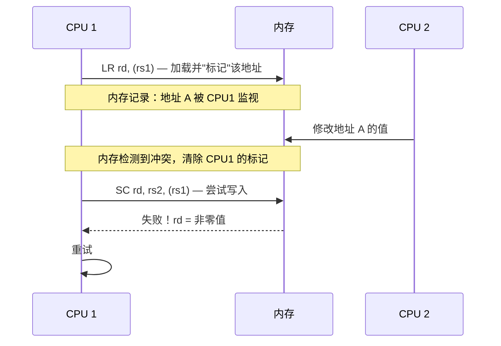
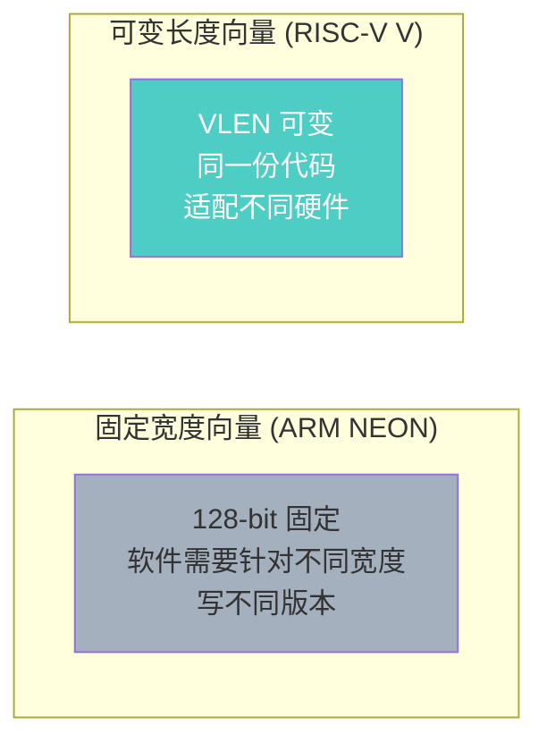

# 标准扩展 M / A / F / D / C

> RISC-V 的模块化设计意味着你可以按需添加功能。这些标准扩展覆盖了乘除法、原子操作、浮点和代码密度。
>
> **扩展全称速查**：M = Multiply/Division（乘除法）、A = Atomic（原子操作）、F = Single-Precision Floating-Point（单精度浮点）、D = Double-Precision Floating-Point（双精度浮点）、C = Compressed（压缩指令）
>
> **工程师视角**：扩展不是"越多越好"。服务器芯片需要 A（原子操作）和 V（向量）扩展；实时嵌入式系统可能只需要 M 扩展；而 Boot ROM 为了最小体积，可能连 M 都不要。理解每个扩展的代价和收益，是架构设计的基础决策。

### 关键术语

| 缩写 | 全称 | 含义 |
|------|------|------|
| AMO | Atomic Memory Operation | 原子内存操作 |
| LR/SC | Load-Reserved / Store-Conditional | 保留加载/条件存储 |
| SEW | Selected Element Width | 选中元素宽度（V 扩展） |
| LMUL | Vector Length Multiplier | 向量长度乘数（V 扩展） |
| VLMAX | Vector Length Maximum | 最大向量长度 |
| VLEN | Vector Register Length | 向量寄存器位宽 |
| PMU | Performance Monitoring Unit | 性能监控单元 |
| HPM | Hardware Performance Monitor | 硬件性能监控计数器 |
| TSO | Total Store Order | 全存储序内存模型 |
| RVWMO | RISC-V Weak Memory Ordering | RISC-V 弱内存序模型 |
| TLB | Translation Lookaside Buffer | 页表缓存 |
| ASID | Address Space Identifier | 地址空间标识符 |
| CSR | Control and Status Register | 控制状态寄存器 |
| SBI | Supervisor Binary Interface | 管理模式二进制接口 |

### 前置知识

| 需要了解 | 参考文档 |
|----------|----------|
| RV32I/RV64I 整数指令集 | [RV32I/RV64I 指令集详解](./01-isa-rv32i-rv64i.md) |
| RISC-V 模块化扩展理念与 Profile | [RISC-V 概览](./00-riscv-overview.md) |

### 学习目标

本章涵盖 15 个以上 RISC-V 标准扩展。读完你应该能够：

1. **区分各扩展的实际用途**：知道 M（乘除法）、A（原子操作）、F/D（浮点）、C（压缩）、B（位操作）、V（向量）各自解决什么问题，以及哪些是服务器 Profile（RVA22/RVA23）的强制要求
2. **理解 LR/SC 与 AMO 的设计差异**：知道何时用乐观锁（LR/SC），何时用单指令原子操作（AMO），以及自旋锁的完整实现
3. **掌握浮点寄存器和指令的对应关系**：FSGNJ 系列的符号注入、FCLASS 的分类编码、FCVT 的舍入行为
4. **理解向量扩展的可变长度设计**：为什么 vsetvli 是 V 扩展的核心，VLMAX 公式如何计算
5. **识别服务器场景的关键子扩展**：Zicond（条件选择）、Svinval（TLB 刷新）、Zawrs（低功耗等待）等各自解决什么实际问题

### 阅读建议

这篇内容较长，不必一次读完。建议按需阅读：
- 先读完 **M/A/C** 扩展（最常用），再跳到第 9 节看扩展组合速查表建立全局印象
- **F/D/V** 扩展可以分开阅读，它们是独立的知识体系
- **B 扩展**和**服务器子扩展**（第 8 节）作为参考备用，需要时查阅即可

---

## 1. M 扩展：整数乘除法（Multiply/Division）

M 扩展添加了 8 条乘除法指令，分为有符号和无符号两类。

### 1.1 乘法指令

| 指令 | 功能 | 结果位宽 | 说明 |
|------|------|----------|------|
| `MUL rd, rs1, rs2` | 乘法（低半部分） | XLEN | rd = (rs1 × rs2)[XLEN-1:0] |
| `MULH rd, rs1, rs2` | 有符号×有符号（高半部分） | XLEN | rd = (rs1 × rs2)[2*XLEN-1:XLEN] |
| `MULHU rd, rs1, rs2` | 无符号×无符号（高半部分） | XLEN | 同上，无符号 |
| `MULHSU rd, rs1, rs2` | 有符号×无符号（高半部分） | XLEN | rs1 有符号，rs2 无符号 |

> **为什么需要 MULH 系列？** 两个 32 位数相乘结果是 64 位，`MUL` 只返回低 32 位。要获取完整结果，需要 `MUL` + `MULH` 配合使用。

```asm
# 64 位乘法结果（RV32I + M）
# a0:a1 = a2 * a3
mul   a0, a2, a3       # 低 32 位
mulh  a1, a2, a3       # 高 32 位

# 只需要低 32 位时，一条 MUL 即可
mul   t0, t1, t2       # t0 = t1 * t2（低 32 位）
```

### 1.2 除法指令

| 指令 | 功能 | 特殊情况处理 |
|------|------|-------------|
| `DIV rd, rs1, rs2` | 有符号除法 | 除以 0 → -1；溢出 → -2^(XLEN-1) |
| `DIVU rd, rs1, rs2` | 无符号除法 | 除以 0 → 2^XLEN - 1 |
| `REM rd, rs1, rs2` | 有符号取余 | 除以 0 → rs1；溢出 → 0 |
| `REMU rd, rs1, rs2` | 无符号取余 | 除以 0 → rs1 |

> **除以 0 不触发异常！** 这是 RISC-V 的设计选择——除以 0 返回特殊值而非触发异常，简化了控制逻辑。软件可以自行检查除数是否为 0。

| 除以 0 的返回值 | 有符号 | 无符号 |
|-----------------|--------|--------|
| DIV | -1 | 2^XLEN - 1 |
| REM | rs1 | rs1 |

#### 小结：M 扩展

M 扩展的 8 条指令可分为两类：**乘法**（4 条）解决了从"获取完整 64/128 位积"到"只需要低半部分"的各种需求；**除法**（4 条）通过"除以 0 不异常，返回特殊值"避免了微架构中复杂的异常处理。在嵌入式场景中，如果代码里没有乘除法运算，完全可以省略 M 扩展来节省面积。但如果需要做任何 DSP 或控制算法，M 扩展就是性价比最高的选择。

---

## 2. A 扩展：原子操作（Atomic）

A 扩展提供两种原子操作机制：**LR/SC**（保留加载/条件存储）和 **AMO**（原子内存操作）。

### 2.1 LR/SC：锁的实现基础

#### 为什么需要 LR/SC？

想象两个 CPU 核心同时想修改同一个变量：
- CPU 0 读取值为 0，想加 1 变成 1
- CPU 1 同时读取值也是 0，也想加 1 变成 1
- 结果：两个都写回 1，但正确结果应该是 2！

这就是**竞态条件**。我们需要一种机制，确保"读取-修改-写回"这三步作为一个整体完成，中间不能被其他 CPU 打断。

#### LR/SC 的工作原理

LR/SC 采用**乐观锁**策略：先读，再检查，最后写。如果检查期间有人修改过，就放弃并重试。



**关键概念：**

| 概念 | 解释 |
|------|------|
| **保留标记（Reservation）** | LR 执行后，硬件在该地址设置一个"监视标记"，记录这是"我的"地址 |
| **监视范围（Reservation Set）** | 实际监视的是一个**缓存行**（通常 64 字节），而不仅是目标地址 |
| **SC 失败条件** | 1) 其他 CPU 写了同一缓存行；2) 当前 CPU 执行了其他 SC；3) 中断/上下文切换 |

#### 指令详解

| 指令 | 功能 | 返回值 |
|------|------|--------|
| `LR.W rd, (rs1)` | 加载 32 位值，并在该地址设置保留标记 | rd = 内存值 |
| `SC.W rd, rs2, (rs1)` | 若保留标记仍有效，将 rs2 写入内存 | rd = 0（成功）或 非零（失败） |
| `LR.D rd, (rs1)` | 64 位版本（RV64） | — |
| `SC.D rd, rs2, (rs1)` | 64 位版本（RV64） | — |

> **重要：** SC 的返回值写入 rd，不是写入内存！内存写入是否成功由 rd 是否为 0 表示。

#### 实际例子：自旋锁

```asm
# 自旋锁实现
# a0 指向锁变量（0=未锁，1=已锁）

spin_lock:
    li    t0, 1          # t0 = 1（锁的值）
1:
    lr.w  t1, (a0)       # ① 读取锁状态，设置保留标记
    bnez  t1, 1b         # ② 如果锁已被持有（t1 != 0），重试
    sc.w  t1, t0, (a0)   # ③ 尝试将 1 写入锁（仅在保留有效时成功）
    bnez  t1, 1b         # ④ 如果 SC 失败（t1 != 0），重试
    ret                  # 成功获取锁

spin_unlock:
    sw    x0, (a0)       # 简单地将 0 写入锁即可释放
    ret
```

**逐行详解：**

| 行 | 指令 | 详解 |
|---|------|------|
| `li t0, 1` | 加载立即数 | 把 1 放进寄存器 t0。这个 1 就是"锁被占用"的标志值 |
| `1:` | 标签 | 定义一个名为 "1" 的标签，用于循环跳转。`1b` 表示 backward（向前跳转到最近的标签1） |
| `lr.w t1, (a0)` | 保留加载 | **L**oad-**R**eserved。从 a0 指向的内存读取 32 位值到 t1，同时硬件在这个地址做个"记号"（保留标记） |
| `bnez t1, 1b` | 不为零则跳转 | **B**ranch if **N**ot **E**qual **Z**ero。如果 t1 ≠ 0（锁已被占用），跳回标签 1 重新尝试 |
| `sc.w t1, t0, (a0)` | 条件存储 | **S**tore-**C**onditional。尝试把 t0（值1）写入 a0 指向的内存。**只有保留标记还在时才成功**。结果（0=成功，非0=失败）写入 t1 |
| `bnez t1, 1b` | 不为零则跳转 | 如果 SC 失败（t1 ≠ 0），跳回标签 1 重新尝试。失败原因可能是其他 CPU 在此期间修改了锁 |
| `ret` | 返回 | 成功获取锁，返回调用者 |
| `sw x0, (a0)` | 存储字 | **S**tore **W**ord。把 x0（恒为0）写入锁变量，表示释放锁。普通 store 即可，因为释放锁时只有持有者有权限写 |

**关键理解点：**

**第一次 bnez**（lr.w 之后）：检查锁是否已被占用——如果锁是 1（被占用），直接重试，不执行 SC。这是一种优化，避免不必要的 SC 操作。

**第二次 bnez**（sc.w 之后）：检查 SC 是否成功——即使锁原来是 0（空闲），执行 SC 时也可能失败。失败原因：其他 CPU 在 LR 和 SC 之间抢占了锁。

**执行流程分析：**

- **情况 1：锁空闲，无竞争**——LR 读取 0，设置保留标记；SC 时保留标记仍有效，写入 1 成功，返回 0 → 获取锁成功。
- **情况 2：锁被占用**——LR 读取 1，bnez 发现不为 0，跳回重试 → 忙等待直到锁释放。
- **情况 3：获取锁期间被其他 CPU 抢占（竞态）**——CPU 0 的 LR 读取 0 并设置保留标记；CPU 1 抢先获取锁成功，将地址改为 1；CPU 0 的 SC 发现保留标记已被清除（CPU 1 修改了同一缓存行），SC 失败返回非零，跳回重试 → 安全地重试，不会破坏数据。

#### LR/SC 使用规则

RISC-V 规范对 LR/SC 序列有严格要求：

1. **指令数量限制**：LR 和 SC 之间最多 16 条指令（实际实现可能更严格）
2. **只能访问相同地址**：SC 的地址必须与 LR 相同
3. **不能执行其他 SC**：一个 LR/SC 序列中只能有一个 SC
4. **不能执行系统调用**：LR/SC 序列中不能有 ECALL/EBREAK

#### 何时使用 LR/SC 而非 AMO？

| 场景 | 推荐方式 | 原因 |
|------|----------|------|
| 简单原子操作（加、交换） | AMO | 一条指令完成，更高效 |
| 复杂条件判断（如链表插入） | LR/SC | 需要检查条件后再决定是否写入 |
| 实现锁、信号量 | LR/SC | 需要检查锁状态再尝试获取 |
| 无锁数据结构 | LR/SC | 需要比较-交换（CAS）语义 |

> **AMO vs LR/SC 类比：** AMO 像银行柜台的"即时业务"（存取款），一次搞定；LR/SC 像"需要审批的业务"（贷款），先查资料，再决定是否办理，如果期间政策变了就重新申请。

### 2.2 AMO：原子内存操作

AMO 指令在一条指令中完成"读取-修改-写回"，天然原子：

| 指令 | 功能 | 等价伪代码 |
|------|------|-----------|
| `AMOSWAP.W rd, rs2, (rs1)` | 原子交换 | temp = *addr; *addr = rs2; rd = temp |
| `AMOADD.W rd, rs2, (rs1)` | 原子加 | temp = *addr; *addr += rs2; rd = temp |
| `AMOAND.W rd, rs2, (rs1)` | 原子与 | temp = *addr; *addr &= rs2; rd = temp |
| `AMOOR.W rd, rs2, (rs1)` | 原子或 | temp = *addr; *addr \|= rs2; rd = temp |
| `AMOXOR.W rd, rs2, (rs1)` | 原子异或 | temp = *addr; *addr ^= rs2; rd = temp |
| `AMOMIN.W rd, rs2, (rs1)` | 原子最小值（有符号） | temp = *addr; *addr = min(*addr, rs2); rd = temp |
| `AMOMAX.W rd, rs2, (rs1)` | 原子最大值（有符号） | temp = *addr; *addr = max(*addr, rs2); rd = temp |
| `AMOMINU.W rd, rs2, (rs1)` | 原子最小值（无符号） | 同上，无符号比较 |
| `AMOMAXU.W rd, rs2, (rs1)` | 原子最大值（无符号） | 同上，无符号比较 |

> 所有 AMO 指令都有 `.W`（32 位）和 `.D`（64 位，RV64）两个版本。

```asm
# 原子计数器递增
# a0 指向计数器
amoadd.w t0, t1, (a0)    # *counter += t1, t0 = 旧值

# 原子设置标志位
li      t1, 0x01
amoand.w t0, t1, (a0)    # *flags &= 0x01, t0 = 旧值
```

### 2.3 内存序（Fence）

AMO 和 LR/SC 可以附加 `.AQ`（Acquire）和 `.RL`（Release）后缀来控制内存序：

| 后缀 | 含义 | 典型用途 |
|------|------|----------|
| （无） | 无排序保证 | 单核或已知无竞争场景 |
| `.AQ` | 后续读写不能重排到此指令之前 | 获取锁 |
| `.RL` | 前序读写不能重排到此指令之后 | 释放锁 |
| `.AQRL` | 同时具有 AQ 和 RL 语义 | 全屏障 |

```asm
# 使用 Acquire-Release 语义的自旋锁
spin_lock:
    li    t0, 1
1:
    lr.w.aq  t1, (a0)     # Acquire: 后续操作不能提前
    bnez  t1, 1b
    sc.w.rl  t1, t0, (a0) # Release: 之前的操作不能延后
    bnez  t1, 1b
    ret
```

#### FENCE 指令的 pred/succ 编码

FENCE 指令通过 pred（前序）和 succ（后序）字段精确控制内存操作排序：

```
FENCE pred, succ 指令编码:

  pred [27:24]: 前序操作类型（必须在此 fence 之前完成）
  succ [23:20]: 后续操作类型（必须在此 fence 之后开始）

  每个字段的位编码:
    bit 3 = I (Input):  设备输入（读）
    bit 2 = O (Output): 设备输出（写）
    bit 1 = R (Read):   内存读
    bit 0 = W (Write):  内存写
```

| FENCE 写法 | pred | succ | 含义 |
|-----------|------|------|------|
| `fence` | IORW | IORW | 全屏障（所有操作有序） |
| `fence w, r` | W | R | 写-读屏障（Release 语义） |
| `fence r, rw` | R | RW | 读-读写屏障（Acquire 语义） |
| `fence.i` | — | — | 指令缓存与数据缓存一致性（Zifencei） |

```asm
# 生产者-消费者模式
# 生产者：写数据后执行 Release fence
sw    t0, 0(a0)          # 写数据
fence w, r               # 确保写对其他核可见
sw    t1, 4(a0)          # 写标志位

# 消费者：读标志后执行 Acquire fence
lw    t1, 4(a0)          # 读标志位
fence r, rw              # 确保读到标志后，后续读能看到数据
lw    t0, 0(a0)          # 读数据
```

#### 小结：A 扩展

A 扩展提供了两种互补的原子机制：**LR/SC** 适合复杂条件判断（锁获取、CAS 语义），**AMO** 适合简单读写-修改操作（计数器递增、标志位更新）。两者的核心区别在于：LR/SC 在"读"和"写"之间允许任意计算，代价是可能重试；AMO 一条指令完成全部操作，但只支持固定的 9 种运算。在多核场景中，选择 A 扩展几乎是必选项——没有原子操作，就无法正确实现锁和同步原语。

A 扩展中 `.AQ`/`.RL` 后缀的内存序控制与 FENCE 指令紧密关联——它们共同构成了 RISC-V 弱内存序模型（RVWMO）的底层机制。理解这些对于编写正确的多核代码至关重要。

---

## 3. F/D 扩展：浮点运算（Floating-Point）

- **F 扩展**：Single-Precision Floating-Point（单精度浮点，32-bit）
- **D 扩展**：Double-Precision Floating-Point（双精度浮点，64-bit）

### 3.1 浮点寄存器

F 扩展添加 32 个浮点寄存器 **f0-f31**（每个 32-bit），D 扩展将宽度扩展到 64-bit。

| 浮点寄存器 | ABI 名称 | 用途 | 调用约定 |
|-----------|----------|------|----------|
| f0-f7 | ft0-ft7 | 临时寄存器 | Caller 保存 |
| f8-f9 | fs0-fs1 | 保存寄存器 | Callee 保存 |
| f10-f11 | fa0-fa1 | 参数/返回值 | Caller 保存 |
| f12-f17 | fa2-fa7 | 参数 | Caller 保存 |
| f18-f27 | fs2-fs11 | 保存寄存器 | Callee 保存 |
| f28-f31 | ft8-ft11 | 临时寄存器 | Caller 保存 |

### 3.2 F 扩展指令（单精度）

| 类别 | 指令 | 功能 |
|------|------|------|
| **算术** | `FADD.S` `FSUB.S` `FMUL.S` `FDIV.S` | 加减乘除 |
| | `FSQRT.S` | 平方根 |
| | `FMIN.S` `FMAX.S` | 最小/最大值 |
| **转换** | `FCVT.W.S` `FCVT.S.W` | 整数 ↔ 单精度 |
| | `FCVT.L.S` `FCVT.S.L` | 长整数 ↔ 单精度（RV64） |
| | `FMV.X.W` `FMV.W.X` | 位模式搬移（不转换） |
| **比较** | `FEQ.S` `FLT.S` `FLE.S` | 相等/小于/小于等于 |
| **其他** | `FSGNJ.S` `FSGNJN.S` `FSGNJX.S` | 符号注入 |
| | `FCLASS.S` | 分类（NaN/Inf/零/正规数等） |

### 3.3 D 扩展指令（双精度）

D 扩展的指令与 F 扩展完全对称，只需将 `.S` 替换为 `.D`：

| F 扩展 | D 扩展 | 说明 |
|--------|--------|------|
| `FADD.S` | `FADD.D` | 双精度加减乘除 |
| `FCVT.W.S` | `FCVT.W.D` | 双精度与整数互转 |
| `FMV.X.W` | `FMV.X.D` | 64 位位模式搬移（RV64） |
| — | `FCVT.S.D` / `FCVT.D.S` | 单双精度互转 |

### 3.4 FSGNJ 系列：符号注入

| 指令 | 功能 | 等价 |
|------|------|------|
| `FSGNJ.S rd, rs1, rs2` | 复制 rs1 的值，但符号位取自 rs2 | rd = \|rs1\| × sign(rs2) |
| `FSGNJN.S rd, rs1, rs2` | 复制 rs1 的值，符号位取自 rs2 的反 | rd = \|rs1\| × ~sign(rs2) |
| `FSGNJX.S rd, rs1, rs2` | 复制 rs1 的值，符号位与 rs2 异或 | rd = \|rs1\| × (sign(rs1) ⊕ sign(rs2)) |

```asm
fmv.s fa0, fa1    # 伪指令，展开为 fsgnj.s fa0, fa1, fa1
fneg.s fa0, fa1   # 伪指令，展开为 fsgnjn.s fa0, fa1, fa1
fabs.s fa0, fa1   # 伪指令，展开为 fsgnjx.s fa0, fa1, fa1
```

> **设计用意：** 用三条 FSGNJ 变体来模拟 MOV/NEG/ABS，而不是增加三条专用浮点指令——这延续了 x0=0 消除整数 MOV/NOP 的设计哲学。此外，FSGNJ 的直接用途包括：在复数运算中交换实虚部符号、在迭代算法中注入特定的符号位、以及实现 `copysign()` 等数学函数。

### 3.5 FCLASS：浮点分类

FCLASS 将浮点数的类别编码为一个 10-bit 的独热码写入 rd：

| bit | 类别 | 说明 |
|-----|------|------|
| 0 | 负无穷 | -∞ |
| 1 | 负正规数 | 负常数值 |
| 2 | 负非正规数 | 负极小值 |
| 3 | -0 | 负零 |
| 4 | +0 | 正零 |
| 5 | 正非正规数 | 正极小值 |
| 6 | 正正规数 | 正常数值 |
| 7 | 正无穷 | +∞ |
| 8 | 信令 NaN | sNaN |
| 9 | 安静 NaN | qNaN |

```asm
# 检查是否为 NaN
fclass.s t0, fa0
andi    t1, t0, 0x300    # bit 8 或 bit 9 = NaN
bnez    t1, is_nan
```

### 3.6 FCVT：浮点-整数转换

FCVT 的舍入行为由 fcsr.FRM 或指令中的 rm 字段控制。关键注意点：

- `FCVT.W.S` 将浮点转为 32-bit 有符号整数，结果符号扩展到 XLEN
- `FCVT.WU.S` 将浮点转为 32-bit 无符号整数
- 越界值被钳位到目标类型的最大/最小值（不触发异常，只设置 NV 标志）
- `FMV.X.W` 是位模式搬移，不做任何转换

### 3.7 Zfa：额外浮点指令（Additional Floating-Point Instructions）

Zfa 扩展为 F/D/Q 扩展添加了实用的浮点指令：

| 指令 | 功能 | 说明 |
|------|------|------|
| `FLI.S rd, fimm` | 加载浮点立即数 | 从 8-bit 编码加载常见浮点常量（如 0.0, 1.0, π, √2 等） |
| `FLI.D rd, fimm` | 加载双精度浮点立即数 | 同上，双精度版本 |
| `FMINM.S rd, rs1, rs2` | IEEE 最小值 | 遵循 IEEE 754-2019 minNum 语义（-0 < +0，NaN 传播） |
| `FMAXM.S rd, rs1, rs2` | IEEE 最大值 | 遵循 IEEE 754-2019 maxNum 语义 |
| `FMINM.D / FMAXM.D` | 双精度版本 | — |
| `FROUND.S rd, rs1, rm` | 浮点取整 | 按 rm 模式取整为整数，结果仍为浮点格式 |
| `FROUNDNX.S rd, rs1, rm` | 浮点取整（不精确例外） | 同 FROUND 但会触发不精确异常 |
| `FCVTMOD.W.D rd, rs1, rm` | 模取整转换 | 双精度转整数，仅低 32 位有效，用于 JavaScript |

> **RVA23 必需。** FLI 指令避免了加载浮点常量时需要从内存读取的开销，一条指令即可加载 π、e、√2 等常用常量。

### 3.8 Zfh/Zfhmin：半精度浮点（Half-Precision Floating-Point）

- **Zfh**：完整半精度浮点支持（Full Half-Precision）
- **Zfhmin**：最小半精度支持（Minimal Half-Precision）

| 子扩展 | 说明 |
|--------|------|
| **Zfh** | 完整的半精度浮点支持，包含所有 .H 后缀的算术/转换/比较指令 |
| **Zfhmin** | 最小半精度支持，仅包含 FCVT.S.H / FCVT.H.S（半精度与单精度互转），不包含 .H 算术指令 |

半精度浮点（IEEE 754-2008 binary16）格式：

- 1 位符号 + 5 位指数 + 10 位尾数 = 16 bit
- 范围：±6.55×10⁴，精度约 3.3 位十进制
- 主要用于 AI 推理（FP16）、图形处理（HDR）

```asm
# Zfhmin：半精度与单精度互转
fcvt.s.h  fa0, fa1     # 半精度 → 单精度（扩展）
fcvt.h.s  fa0, fa1     # 单精度 → 半精度（舍入）

# Zfh：半精度算术
fadd.h  fa0, fa1, fa2  # 半精度加法
fmul.h  fa0, fa1, fa2  # 半精度乘法
```

> **RVA23 要求 Zvfh（向量半精度），但不要求 Zfh。** AI 推理场景通常使用向量半精度（V 扩展的 Zvfh）而非标量半精度。

### 3.9 浮点控制状态寄存器（fcsr）

```
fcsr (32-bit):
┌─────────────────────────────────┬───────┬───────────────┐
│              reserved           │  FRM  │     FFLAGS     │
│                                 │ [7:5] │    [4:0]      │
└─────────────────────────────────┴───────┴───────────────┘

FFLAGS (浮点异常标志):
  bit 4: NV - 无效操作 (Invalid)
  bit 3: DZ - 除以零 (Divide by Zero)
  bit 2: OF - 上溢 (Overflow)
  bit 1: UF - 下溢 (Underflow)
  bit 0: NX - 不精确 (Inexact)

FRM (舍入模式):
  000: RNE - 向最近偶数舍入 (默认)
  001: RTZ - 向零舍入
  010: RDN - 向负无穷舍入
  011: RUP - 向正无穷舍入
  100: RMM - 向最近值舍入，远离零
  111: DYN - 动态舍入模式（由 fcsr.FRM 决定）
```

#### 小结：F/D 扩展

浮点扩展的设计体现了 RISC-V 一贯的模块化理念：**F 扩展**提供 32 个浮点寄存器 + 完整的单精度运算（算术、比较、转换、分类），**D 扩展**将寄存器拓宽到 64-bit 并添加双精度版本（指令对称，`.S` → `.D`）。**Zfa** 在此基础上补充了浮点立即数加载（FLI）和 IEEE 兼容的取整/最值操作，**Zfh/Zfhmin** 则为半精度提供了标量支持。

一个容易被忽视的细节是：`FMV.X.W` 是**位模式搬移**而非数据类型转换——它把浮点寄存器的 32 个 bit 原封不动地复制到整数寄存器，不做任何数值转换。这和 `FCVT.W.S`（真正做浮点→整数转换）有本质区别。另外，fcsr 的舍入模式和异常标志是全局状态，在上下文切换时需要保存/恢复。

---

## 4. C 扩展：压缩指令（Compressed）

C 扩展将常用指令编码为 16-bit，可减少代码体积 25%-30%。

### 4.1 设计原理

```
32-bit 指令的低 2 位始终为 11
16-bit 指令的低 2 位为 00, 01, 10

→ 硬件可以通过低 2 位快速判断指令长度
→ 16-bit 和 32-bit 指令可以自由混合，无需对齐
```

### 4.2 常用压缩指令

| 压缩指令 | 展开后的 32-bit 指令 | 说明 |
|----------|---------------------|------|
| `C.LI rd, imm6` | `ADDI rd, x0, imm6` | 加载小立即数 |
| `C.LUI rd, imm6` | `LUI rd, imm6` | 加载上位立即数 |
| `C.ADDI rd, imm6` | `ADDI rd, rd, imm6` | 加小立即数 |
| `C.ADDI4SPN rd', imm` | `ADDI rd', sp, imm` | 基于 SP 的地址计算 |
| `C.ADDI16SP imm` | `ADDI sp, sp, imm` | 调整栈指针 |
| `C.MV rd, rs` | `ADD rd, x0, rs` | 寄存器复制 |
| `C.ADD rd, rs` | `ADD rd, rd, rs` | 寄存器加法 |
| `C.LW rd', offset(rs1')` | `LW rd, offset(rs1)` | 加载字 |
| `C.SW rs2', offset(rs1')` | `SW rs2, offset(rs1)` | 存储字 |
| `C.BEQZ rs', offset` | `BEQ rs, x0, offset` | 等于零则跳转 |
| `C.BNEZ rs', offset` | `BNE rs, x0, offset` | 不等于零则跳转 |
| `C.J offset` | `JAL x0, offset` | 无条件跳转 |
| `C.JAL offset` | `JAL x1, offset` | 调用（RV32） |
| `C.JR rs` | `JALR x0, 0(rs)` | 寄存器跳转 |
| `C.JALR rs` | `JALR x1, 0(rs)` | 寄存器调用 |
| `C.NOP` | `ADDI x0, x0, 0` | 空操作 |
| `C.EBREAK` | `EBREAK` | 断点 |

> **C 扩展的限制：** 16-bit 编码空间有限，因此寄存器访问和立即数范围有不同程度限制：
> - CI/CJ/CL/CS/CB 格式只能访问 x8-x15（称为 rd'/rs1'/rs2'，即 s0-s1, a0-a5）
> - C.LI/C.ADDI/C.LUI/C.ADDI16SP 等可以访问任何寄存器
> - C.MV/C.ADD 可以访问任何寄存器对
> - 立即数范围也因指令而异（如 C.LI 仅 6-bit 有符号，C.ADDI4SPN 仅无符号 nzuimm）

### 4.3 代码密度对比

```asm
# 不使用 C 扩展（每条 4 字节，共 20 字节）
addi  sp, sp, -16
sw    ra, 12(sp)
sw    s0, 8(sp)
addi  s0, sp, 16
li    a5, 0

# 使用 C 扩展（混合 16/32-bit，共 14 字节，节省 30%）
c.addi sp, -16       # 2 字节
c.sw   ra, 12(sp)    # 2 字节
c.sw   s0, 8(sp)     # 2 字节
c.addi s0, sp, 16    # 2 字节
c.li   a5, 0         # 2 字节
```

#### 小结：C 扩展

C 扩展是**使用门槛最低、收益最直观**的扩展。它利用 32-bit 指令低 2 位始终为 11 这一规律，将常用指令重新编码为 16-bit 格式。使用时需要注意两点限制：一是部分压缩指令只能访问 x8-x15 寄存器子集，二是立即数范围按指令类型缩水。但即使有这些限制，C 扩展仍然能为典型嵌入式代码节省 25%-30% 的空间——在现代芯片上，这个面积的"成本"远低于 Flash/ROM 存储的成本，因此几乎所有实际部署的 RISC-V 核心都包含 C 扩展。

---

## 5. B 扩展：位操作（Bitmanipulation）

B 扩展（Bitmanip）提供高效的位操作指令，对密码学、网络包处理、数据压缩等场景有显著加速。B 扩展由多个 Zb* 子扩展组成。

### 5.1 子扩展概览

| 子扩展 | 名称 | 说明 | 状态 |
|--------|------|------|------|
| **Zba** | 地址生成加速 | 加速数组索引计算 | 已冻结 |
| **Zbb** | 基本位操作 | 位反转、计数、最值等 | 已冻结 |
| **Zbs** | 单位操作 | 位设置/清除/取反/提取 | 已冻结 |
| **Zbc** | 进位乘法 | 大数乘法加速 | 已冻结 |
| **Zbkb** | 密码学位操作 | 密码学专用位操作：字节置换、按位旋转 | 已冻结 |
| **Zbkc** | 密码学进位乘法 | 无进位乘法加速（CLMUL），用于 GCM 模式 | 已冻结 |
| **Zbkx** | 交叉乘 | 32-bit 交叉乘法，加速 AES S-box 查表 | 已冻结 |

> **RVA22 Profile 要求：** 服务器场景的 RVA22 Profile 强制要求 Zba + Zbb + Zbs，是 RV64 服务器的事实标准。

### 5.2 Zba：地址生成加速

Zba 提供了加速地址计算的指令——将"移位 + 加法"合并为一条指令：

| 指令 | 功能 | 等价操作 | 典型用途 |
|------|------|----------|----------|
| `SH1ADD rd, rs1, rs2` | rs1 << 1 + rs2 | rd = (rs1 << 1) + rs2 | 数组索引（2 字节元素） |
| `SH2ADD rd, rs1, rs2` | rs1 << 2 + rs2 | rd = (rs1 << 2) + rs2 | 数组索引（4 字节元素） |
| `SH3ADD rd, rs1, rs2` | rs1 << 3 + rs2 | rd = (rs1 << 3) + rs2 | 数组索引（8 字节元素） |

```asm
# 传统方式：访问 int 数组
slli  t0, a1, 2        # t0 = index * 4
add   t0, a0, t0       # t0 = base + index * 4
lw    t1, 0(t0)        # t1 = array[index]

# Zba 方式：节省一条指令
sh2add t0, a1, a0      # t0 = base + index * 4（一条搞定）
lw     t1, 0(t0)       # t1 = array[index]
```

### 5.3 Zbb：基本位操作

| 指令 | 功能 | 用途 |
|------|------|------|
| `CLZ rd, rs` | 前导零计数 | 快速求 log2，优先级编码 |
| `CTZ rd, rs` | 后导零计数 | 求最低有效位位置 |
| `CPOP rd, rs` | 位计数（popcount） | 海明距离、位图统计 |
| `MIN rd, rs1, rs2` | 有符号最小值 | 排序、限幅 |
| `MAX rd, rs1, rs2` | 有符号最大值 | 排序、限幅 |
| `MINU rd, rs1, rs2` | 无符号最小值 | 无符号比较 |
| `MAXU rd, rs1, rs2` | 无符号最大值 | 无符号比较 |
| `SEXT.B rd, rs` | 符号扩展字节 | 数据类型转换 |
| `SEXT.H rd, rs` | 符号扩展半字 | 数据类型转换 |
| `ZEXT.H rd, rs` | 零扩展半字 | 数据类型转换 |
| `REV8 rd, rs` | 字节反转 | 大小端转换 |
| `ORC.B rd, rs` | 字节级或合并 | 字符串处理 |
| `ROL rd, rs1, rs2` | 循环左移 | 密码学 |
| `ROR rd, rs1, rs2` | 循环右移 | 密码学 |
| `RORI rd, rs1, shamt` | 立即数循环右移 | 密码学 |

```asm
# 前导零计数 → 快速求 log2
clz   t0, a0           # t0 = 前导零个数
li    t1, 63
sub   t0, t1, t0       # t0 = 63 - clz = floor(log2(a0))

# popcount → 统计位图中有多少位被设置
cpop  t0, a0           # t0 = a0 中 1 的个数

# 循环移位 → 密码学中的常见操作
ror   t0, a0, a1       # t0 = a0 循环右移 a1 位
```

### 5.4 Zbs：单位操作

| 指令 | 功能 | 等价操作 |
|------|------|----------|
| `BSET rd, rs1, rs2` | 设置指定位 | rd = rs1 \| (1 << rs2) |
| `BCLR rd, rs1, rs2` | 清除指定位 | rd = rs1 & ~(1 << rs2) |
| `BINV rd, rs1, rs2` | 取反指定位 | rd = rs1 ^ (1 << rs2) |
| `BEXT rd, rs1, rs2` | 提取指定位 | rd = (rs1 >> rs2) & 1 |

```asm
# 传统方式：设置第 5 位
li    t0, 0x20         # 1 << 5
or    t1, a0, t0       # t1 = a0 | (1 << 5)

# Zbs 方式：一条指令
bseti t1, a0, 5        # t1 = a0 | (1 << 5)，更直观
```

### 5.5 密码学子扩展：Zbkb / Zbkc / Zbkx

密码学子扩展针对 AES、SM4、GHASH 等算法的核心操作做了硬件加速。对于 TLS/DTLS、磁盘加密、区块链等需要大量密码运算的场景，这些指令可以带来 **3-10 倍**的性能提升。

#### Zbkb：基本密码学位操作

| 指令 | 功能 | 密码学用途 |
|------|------|-----------|
| `PACK` `PACKH` `PACKW` | 寄存器高低半部分打包/组合 | SHA-256 消息调度中的 32-bit 加法 |
| `BREV8` | 按位反转字节内的位（bit-reverse within byte） | 比特反转用于 CRC、扰码 |
| `REV8` | 字节序反转（大小端转换） | 数据格式转换（网络字节序 ↔ 主机序） |
| `UNZIP` `ZIP` | 比特交叉/解交叉 | AES S-box 查表前的比特重排 |
| `ROL` `ROR` `RORI` | 循环左移/右移 | SHA-256 的 Σ0/Σ1 函数、SM3 的 P0/P1 置换 |
| `ANDN` `ORN` `XNOR` | 与非、或非、同或 | 布尔函数加速 |
| `CLMUL` `CLMULH` `CLMULR` | 无进位乘法（低位/高位/反转） | GHASH/GCM 的有限域乘法 |
| `GORC` `GREV` | 广义 OR-Combine / 广义 Reverse | SHA-3/Keccak 的 θ 步骤 |

#### Zbkc：无进位乘法

Zbkc 实际是 Zbkb 中 `CLMUL*` 指令的子集，专门用于 GCM（Galois/Counter Mode）：

```asm
# GCM 中 GHASH 的有限域乘法 (GF(2^128))
# 传统 C 实现需要数百条指令逐位处理
# Zbkc 只需：
clmul   t0, a0, a1        # 低 64 位 × 低 64 位（无进位）
clmulh  t1, a0, a1        # 高 64 位 × 高 64 位（无进位）
# 然后用几条 XOR 和移位完成 GF 约简
```

> **为什么需要无进位乘法？** 普通乘法会有进位传播，而有限域 GF(2^n) 上的乘法定义为多项式乘法（异或代替加法），天然不需要进位传播。无进位乘法 `CLMUL`（CarryLess MULtiplication）直接实现了这一点，比软件逐比特循环快 **10-50 倍**。

#### Zbkx：交叉乘指令

Zbkx 提供两条专用指令：

| 指令 | 功能 | 说明 |
|------|------|------|
| `XPERM8 rd, rs1, rs2` | 交叉字节置换 | 用 rs2 的字节索引从 rs1 选字节，实现 S-box 查表 |
| `XPERM4 rd, rs1, rs2` | 交叉半字置换 | 类似 XPERM8，但按 4-bit 半字索引 |

```asm
# AES SubBytes 步骤：每个字节进入 S-box 查表替换
# 传统方式：查 256 字节的表 → 需要 load 指令，可能 cache miss
# Zbkx 方式：
#   预加载 S-box 到寄存器 rs1（8 字节容纳不了 256 条目，
#   通常需要多次加载，但配合压缩指令可减少代码体积）
#   但核心优势在于消除了分支和内存依赖
#   对于 SM4 这种 8-bit S-box，XPERM8 一条指令就能完成查表
xperm8  t0, t0, a0        # t0 中每个字节作为索引，从 a0 中选对应字节
```

> **实际应用场景：** 在 TLS 1.3 握手过程中，AES-GCM 和 ChaCha20-Poly1305 是强制密码套件。支持 Zbkb+Zbkc 的 RISC-V 处理器可以在无专用加密引擎的情况下，仅靠指令扩展就接近硬件加速器的吞吐量。这对于 IoT 设备和边缘网关（面积/功耗受限，无法放置大型加密 IP）尤为关键。

#### 小结：B 扩展

B 扩展看似是"杂项位操作"，但它有清晰的层次结构：**Zba** 优化地址计算（将 slli+add 合并）、**Zbb** 提供通用位操作（CLZ/CTZ/CPOP/MIN/MAX 等十余条）、**Zbs** 实现单 bit 操作（BSET/BCLR/BINV/BEXT），这三者构成了 RVA22 的强制要求。**密码学子扩展**（Zbkb/Zbkc/Zbkx）则独立成体系，专门针对 AES、SM4、GHASH 等算法的核心操作做硬件加速——这对于 IoT 安全和 TLS 性能至关重要。

实际选择时，Zba+Zbb+Zbs 是最实用的组合，几乎任何代码都能从中受益。密码学子扩展则更专用，仅在需要加解密加速时考虑。

---

## 6. V 扩展：可变长度向量（Vector）

V 扩展是 RISC-V 最重要的扩展之一，提供可变长度向量（Vector）处理能力，对 AI 推理、信号处理、多媒体等场景至关重要。

### 6.1 设计哲学：可变长度向量

与 ARM SVE/NEON 的固定宽度向量不同，RISC-V V 扩展采用**可变长度向量**设计：



| 特性 | ARM NEON | ARM SVE | RISC-V V |
|------|----------|---------|----------|
| **向量宽度** | 固定 128-bit | 可变 128~2048-bit | 可变（VLEN 由实现决定） |
| **编程模型** | 需要知道宽度 | 通过谓词（Predicate） | 通过 vsetvli 动态设置 |
| **前向兼容** | ❌ 新硬件需重新编译 | ✅ 同一二进制可扩展 | ✅ 同一二进制可扩展 |
| **掩码操作** | 有限 | 谓词寄存器 | 掩码寄存器 v0 |

### 6.2 向量寄存器

V 扩展添加 32 个向量寄存器 v0-v31，每个宽度为 VLEN（实现决定，常见 128/256/512-bit）。

| 寄存器 | 特殊用途 |
|--------|----------|
| **v0** | 掩码寄存器（1 bit per element） |
| **v1-v31** | 通用向量数据寄存器 |

> **向量分组（LMUL）：** 可以将多个向量寄存器组合使用，形成更宽的向量。LMUL=1 使用 1 个寄存器，LMUL=2 使用 2 个，最大 LMUL=8（使用 8 个连续寄存器）。

### 6.3 vsetvli：动态配置向量长度

`vsetvli` 是 V 扩展最核心的指令，用于设置向量操作的元素宽度和分组：

```asm
# vsetvli rd, rs1, vtypei
#   rd    = 实际设置的向量长度 (VL)
#   rs1   = 期望的向量长度（0 = 使用最大值）
#   vtypei = 向量类型配置

# 示例：配置为 32-bit 整数，LMUL=1
vsetvli t0, a0, e32, m1, ta, ma
# a0  = 应用程序请求处理的元素总数（application vector length）
# e32 = 元素宽度 32-bit (SEW=32)
# m1  = LMUL=1（1 个寄存器一组）
# ta  = tail agnostic（尾部元素不关心）
# ma  = mask agnostic（掩码元素不关心）
# t0  = 本次实际能处理的元素个数 VL
#       vsetvli 根据 VLEN 和 SEW/LMUL 计算出 VL，写入 t0
#       如果 a0=0，则 VL=VLMAX（最大可能值）
```

#### VLMAX 计算公式

$$VLMAX = \frac{VLEN \times LMUL}{SEW}$$

其中 $VLEN$ 为向量寄存器位宽（硬件实现决定），$LMUL$ 为向量长度乘数，$SEW$ 为选中元素宽度。例如 $VLEN=256$，$SEW=32$，$LMUL=1$ 时，$VLMAX = 256 \times 1 / 32 = 8$。

#### vsetvl：非立即数版本

`vsetvl rd, rs1, rs2` 是 vsetvli 的寄存器版本，其中 rs2 是包含 vtype 值的寄存器（而非立即数），主要用于上下文恢复——保存的 vtype 值可以直接写回：

```asm
# 上下文恢复：从保存的 vtype 值恢复向量配置
vsetvl t0, a0, a1    # a1 = 之前保存的 vtype 值
```

#### Fractional LMUL

LMUL 支持分数值，用于减少寄存器占用：

| VLMUL 编码 | LMUL 值 | 含义 |
|------------|---------|------|
| 000 | 1 | 使用 1 个向量寄存器 |
| 001 | 2 | 使用 2 个连续向量寄存器 |
| 010 | 4 | 使用 4 个连续向量寄存器 |
| 011 | 8 | 使用 8 个连续向量寄存器 |
| 101 | 1/8 | 只使用向量寄存器的 1/8 位宽 |
| 110 | 1/4 | 只使用向量寄存器的 1/4 位宽 |
| 111 | 1/2 | 只使用向量寄存器的 1/2 位宽 |

Fractional LMUL 的典型用途是减少寄存器占用（如 LMUL=f2 只用半个寄存器，VLMAX 也减半）。当 $SEW > VLEN \times LMUL$ 时，$VLMAX=0$，此时无法处理任何元素。

#### 向量 CSR

| CSR | 地址 | 说明 |
|-----|------|------|
| `vstart` | 0x008 | 异常后恢复执行的起始元素索引，异常处理完成后应清零 |
| `vxsat` | 0x009 | 定点饱和溢出标志（1 = 发生过饱和） |
| `vcsr` | 0x00F | 向量控制状态寄存器，包含 vxsat（饱和溢出标志，bit 0）和 vxrm（定点舍入模式，bits 2:1） |

#### vtype 寄存器位域

```
XLEN-1                                    7     6     5   3    2    0
┌──────────────────────────────────────┬─────┬─────┬────────┬────────┐
│              reserved                │ VMA │ VTA │ VLMUL  │ VSEW   │
└──────────────────────────────────────┴─────┴─────┴────────┴────────┘

VSEW (Selected Element Width) [2:0]:
  000 = 8-bit    001 = 16-bit    010 = 32-bit    011 = 64-bit
  101 = 128-bit  110 = 256-bit   111 = 512-bit（保留给未来）

VLMUL (Vector Length Multiplier) [5:3]:
  000 = LMUL=1   001 = LMUL=2   010 = LMUL=4   011 = LMUL=8
  101 = LMUL=f8  110 = LMUL=f4  111 = LMUL=f2

VTA (Vector Tail Agnostic) [6]:
  0 = 尾部元素保留旧值（undisturbed）
  1 = 尾部元素值不确定（agnostic）

VMA (Vector Mask Agnostic) [7]:
  0 = 掩码元素保留旧值（undisturbed）
  1 = 掩码元素值不确定（agnostic）
```

### 6.4 向量指令分类

| 类别 | 指令示例 | 说明 |
|------|----------|------|
| **配置** | `vsetvli`, `vsetvl` | 设置向量参数 |
| **加载/存储** | `vle32.v`, `vse32.v`, `vlse32.v` | 连续/步进/索引访存 |
| **算术** | `vadd.vv`, `vsub.vv`, `vmul.vv` | 向量-向量运算 |
| | `vadd.vx`, `vsub.vx` | 向量-标量运算 |
| | `vadd.vi` | 向量-立即数运算 |
| **比较** | `vmseq.vv`, `vmslt.vv` | 产生掩码结果 |
| **归约** | `vredsum.vs`, `vredmax.vs` | 向量归约为标量 |
| **掩码** | `vmand.mm`, `vmor.mm` | 掩码逻辑操作 |
| **排列** | `vrgather.vv`, `vcompress.vm` | 向量元素重排 |
| **转换** | `vzext.vf2`, `vsext.vf2` | 元素宽度转换 |
| **浮点** | `vfadd.vv`, `vfmul.vv`, `vfsgnj.vv` | 浮点向量运算 |

### 6.5 向量加载/存储指令详解

V 扩展的访存指令分为四类，覆盖从连续访问到随机访问的所有场景：

#### Unit-stride：连续内存访问

最基础的向量访存模式，访问连续的内存地址：

| 指令 | 功能 |
|------|------|
| `vle<eew>.v vd, (rs1)` | 向量加载（连续） |
| `vse<eew>.v vs3, (rs1)` | 向量存储（连续） |

```asm
# 连续加载 32-bit 元素
vle32.v v1, (a0)     # 从 a0 地址连续加载 VL 个 32-bit 元素到 v1
vse32.v v1, (a1)     # 将 v1 连续存储到 a1 地址
```

#### Strided：固定步长访问

每次访问后地址增加固定步长，适用于矩阵行遍历等非连续访问：

| 指令 | 功能 |
|------|------|
| `vlse<eew>.v vd, (rs1), rs2` | 向量加载（步长） |
| `vsse<eew>.v vs3, (rs1), rs2` | 向量存储（步长） |

```asm
# 按行遍历矩阵（每行 4 个 int32，步长 = 16 字节）
li    t0, 16
vlse32.v v1, (a0), t0    # 加载矩阵第一列，步长 16 字节
```

#### Indexed：向量索引访问（Gather/Scatter）

用另一个向量提供索引，实现随机访问模式：

| 指令 | 功能 |
|------|------|
| `vluxei<eew>.v vd, (rs1), vs2` | 无序索引加载（Gather，不保证顺序） |
| `vloxei<eew>.v vd, (rs1), vs2` | 有序索引加载（Gather，保证顺序） |
| `vsuxei<eew>.v vs3, (rs1), vs2` | 无序索引存储（Scatter） |
| `vsoxei<eew>.v vs3, (rs1), vs2` | 有序索引存储（Scatter） |

```asm
# Gather：从索引数组指定的位置加载数据
# a0 = 基地址, v2 = 索引向量
vluxei32.v v1, (a0), v2    # v1[i] = *(a0 + v2[i])
```

#### Segment：多字段加载/存储

加载多个连续元素到多个向量寄存器，适用于 RGB 像素拆分等结构化数据：

| 指令 | 功能 |
|------|------|
| `vlseg<nf>e<eew>.v vd, (rs1)` | 加载 nf 个连续元素到 nf 个向量寄存器 |
| `vsseg<nf>e<eew>.v vs3, (rs1)` | 存储 nf 个向量寄存器到连续地址 |

```asm
# RGB 像素拆分：每个像素 3 字节 (R, G, B)
# 将连续的 RGB 数据拆分到 3 个向量寄存器
vlseg3e8.v v1, (a0)    # v1=R, v2=G, v3=B
```

### 6.6 向量编程示例

```asm
# 向量加法：C[i] = A[i] + B[i]
# a0 = A 的地址, a1 = B 的地址, a2 = C 的地址, a3 = 元素个数

vadd_loop:
    vsetvli  t0, a3, e32, m1, ta, ma   # 设置 32-bit 元素
    vle32.v  v1, (a0)                    # 加载 A
    vle32.v  v2, (a1)                    # 加载 B
    vadd.vv  v3, v1, v2                  # 向量加法
    vse32.v  v3, (a2)                    # 存储 C
    sub      a3, a3, t0                  # 剩余元素数
    slli     t0, t0, 2                   # 字节偏移
    add      a0, a0, t0                  # A 指针前进
    add      a1, a1, t0                  # B 指针前进
    add      a2, a2, t0                  # C 指针前进
    bnez     a3, vadd_loop               # 循环
```

```asm
# 条件加法：仅对偶数索引元素加 1
# 使用掩码操作

masked_add:
    vsetvli  t0, a1, e32, m1, ta, ma
    vid.v    v1                          # v1[i] = i（索引向量）
    vand.vi  v2, v1, 1                   # v2[i] = i & 1
    vmseq.vi v0, v2, 0                   # v0 = 掩码（偶数索引为 1）
    vle32.v  v3, (a0)                    # 加载数据
    vadd.vi  v3, v3, 1, v0.t             # 掩码加法：仅偶数元素 +1
    vse32.v  v3, (a0)                    # 存储结果
    sub      a1, a1, t0
    slli     t0, t0, 2
    add      a0, a0, t0
    bnez     a1, masked_add
```

> **常见误区：忘记 vsetvli 返回的是 VL 而非 AVL。** vsetvli 的第一个参数（rd）是本次实际可处理的元素个数 VL，不一定是应用程序请求的总数 AVL（rs1 的值）。每次循环迭代后，需要用 `sub a3, a3, t0` 更新剩余计数，而不能直接用原始的 a3。在向量循环的结尾必须检查 `bnez a3` 而非其他条件——这保证当没有剩余元素时退出。

### 6.7 VLEN 对性能的影响

| VLEN | 每周期处理 32-bit 元素数 | 典型硬件 |
|------|--------------------------|----------|
| 128 | 4 | 低功耗核心、嵌入式 |
| 256 | 8 | 中端核心 |
| 512 | 16 | 高性能服务器核心 |
| 1024+ | 32+ | AI 加速器 |

> **服务器场景：** RVA22 Profile 不强制要求 V 扩展，但 RVA23 Profile 强制要求。对于 AI 推理和 HPC 场景，V 扩展是必选项。

#### 小结：V 扩展

V 扩展的核心思想是"**一份代码，任意 VLEN**"——通过 vsetvli 动态设置 SEW（元素宽度）和 LMUL（寄存器分组），应用程序无需在编译时就确定向量宽度。这种可变长度设计解决了 ARM NEON（固定 128-bit）的前向兼容性问题。

理解 V 扩展只需抓住三个关键量：**VLEN**（硬件决定的寄存器位宽）、**SEW**（你指定的元素大小）、**LMUL**（寄存器分组因子）。VLMAX = VLEN × LMUL / SEW 给出了单条向量指令能处理的最大元素数，而 vsetvli 根据你需要的总元素数（application vector length）和 VLMAX 计算出实际的 VL。

V 扩展的学习曲线较陡，但一旦理解了 vsetvli 和四种访存模式（连续、步长、索引、分段），向量编程的实际体验出奇地一致——它和标量编程的思维类似，只是每次操作多个元素而已。

---

## 7. PMU：性能监控单元（Performance Monitoring Unit）

PMU (Performance Monitoring Unit) 是 RISC-V 的硬件性能监控机制，由三个子扩展组成：

### 7.1 Zicntr：基本计数器（Integer Counter）

Zicntr 扩展提供三个基本的 64-bit 硬件计数器，用于性能分析和时间测量：

| CSR | 地址 | 说明 |
|-----|------|------|
| `cycle` | 0xC00 | 自上次复位以来的时钟周期数（只读） |
| `time` | 0xC01 | 当前实时时钟值（只读，与 mtime 同步） |
| `instret` | 0xC02 | 自上次复位以来已完成的指令数（只读） |

M-mode 对应的计数器：`mcycle` (0xB00), `minstret` (0xB02)

```asm
csrr  t0, cycle       # 时钟周期数
csrr  t1, instret     # 已完成指令数
csrr  t2, time        # 当前时间
```

**访问控制**：M-mode 通过 `mcounteren` CSR 控制 S/U-mode 是否可以读取这些计数器。每个 bit 对应一个计数器，bit 0=cycle, bit 2=instret。如果 mcounteren 对应位为 0，S/U-mode 读取会触发非法指令异常。

### 7.2 Zihpm：硬件性能监控计数器（Hardware Performance Monitoring）

Zihpm 提供 29 个可编程事件计数器（mhpmcounter3-31），每个计数器有对应的事件选择寄存器：

| CSR | 地址范围 | 说明 |
|-----|----------|------|
| `mhpmcounter3-31` | 0xB03-B1F | M-mode 计数器值（64-bit，RV32 有高半部分 mhpmcounter3h-31h） |
| `mhpmevent3-31` | 0x323-33F | M-mode 事件选择寄存器 |
| `shpmcounter3-31` | 0xC03-C1F | S-mode 可见计数器（受 mcounteren/scounteren 控制） |

事件选择寄存器 mhpmevent 的编码由实现定义，但常见事件包括：

| 事件码（示例） | 含义 |
|----------------|------|
| 0x01 | L1 I-Cache miss |
| 0x02 | L1 D-Cache miss |
| 0x03 | TLB miss |
| 0x04 | 分支预测失败 |
| 0x05 | 分支指令执行 |
| 0x06 | Load 指令执行 |
| 0x07 | Store 指令执行 |

> **注意：** 事件码的具体编码由微架构实现决定，不同核心的事件码不同。Linux 通过设备树中的 `riscv,pmu` 节点或 SBI PMU 扩展来发现可用事件。

```asm
# 编程 HPM 计数器：统计 L1 D-Cache miss
csrw  mhpmevent3, 0x02      # 选择事件：L1 D-Cache miss
csrw  mhpmcounter3, x0      # 清零计数器
# ... 运行被测代码 ...
csrr  t0, mhpmcounter3      # 读取 L1 D-Cache miss 次数
```

### 7.3 Sscofpmf：计数器溢出中断（Supervisor-level Counter Overflow and Privilege Mode Filtering）

基本 HPM 计数器是 64-bit 宽，在高速运行时仍可能溢出。Sscofpmf 扩展为计数器添加了溢出检测和中断能力：

| CSR | 地址 | 说明 |
|-----|------|------|
| `mhpmevent3-31` | 0x323-33F | 扩展：bit 63 = OF（溢出标志），bit 62 = MINH（不在 M-mode 计数）等 |
| `mcountinhibit` | 0x320 | 计数器禁止寄存器，bit N=1 禁止计数器 N |
| `scountovf` | 0xDA0 | S-mode 可见的溢出状态（只读） |

溢出中断流程：

1. 计数器从最大值翻转到 0 时，mhpmevent 的 OF 位置 1
2. 如果 mie 的 LCOFIE（Local Counter Overflow Interrupt Enable）位为 1，触发溢出中断
3. 中断处理程序读取 scountovf 确定哪个计数器溢出
4. 软件维护 64-bit 以上的软件计数器，清零硬件计数器，清除 OF 位

```asm
# 启用计数器溢出中断
li    t0, (1 << 20)         # LCOFIE 位 (bit 20 of mie)
csrrs t1, mie, t0           # 使能溢出中断

# 配置计数器 3：统计 L1 D-Cache miss，启用溢出检测
li    t0, 0x02              # 事件：L1 D-Cache miss
csrw  mhpmevent3, t0
csrw  mhpmcounter3, x0     # 清零
```

### 7.4 Linux perf 与 RISC-V PMU

Linux 内核通过 SBI PMU 扩展（SBI v2.0+）访问 PMU 硬件：

```bash
# 查看 RISC-V PMU 事件
perf list | grep riscv

# 统计 L1 D-Cache miss
perf stat -e riscv_dcache_miss ./my_program

# 统计周期数和指令数
perf stat ./my_program

# 使用硬件计数器采样
perf record -e cycles ./my_program
perf report
```

SBI PMU 扩展定义了标准的事件发现和计数器管理接口，使得 OS 内核无需直接操作 CSR，而是通过 ecall 委托给 M-mode 固件（OpenSBI）。

> **服务器场景：** PMU 是性能调优的基础设施。在数据中心，perf top 可以实时监控热点函数；perf record 可以采集 off-CPU 分析数据。RVA22 Profile 强制要求 Zicntr + Zihpm。

#### 小结：PMU

PMU 按能力分为三层：**Zicntr** 提供 cycle/time/instret 三个基础计数器（几乎零成本），**Zihpm** 添加 29 个可编程事件计数器（需要硬件支持，事件码由实现定义），**Sscofpmf** 添加溢出中断（用于采样分析）。在 Linux 上，`perf stat` 和 `perf record` 底层都通过 SBI PMU 扩展访问这些计数器，开发者无需直接操作 CSR。RVA22 强制要求 Zicntr + Zihpm，因为性能监控是服务器运维的刚需。

---

## 8. 服务器关键子扩展

除了上述主要扩展，RV64 服务器场景还有几个重要的子扩展：

### 8.1 Zicbom / Zicboz：缓存管理（Cache Block Operations）

- **Zicbom**：Integer Cache Block Operation Maintenance（缓存块维护）
- **Zicboz**：Integer Cache Block Operation Zero（缓存块零初始化）

| 子扩展 | 功能 | 关键指令 |
|--------|------|----------|
| **Zicbom** | 缓存块维护（无效化、清空） | `CBO.INVAL`, `CBO.CLEAN`, `CBO.FLUSH` |
| **Zicboz** | 缓存块零初始化 | `CBO.ZERO` |

```asm
# 缓存管理指令
cbo.clean  (a0)     # 将脏数据写回内存，保留缓存副本
cbo.inval  (a0)     # 使缓存行无效（不写回脏数据）
cbo.flush  (a0)     # 清空：写回 + 无效化（最安全）
cbo.zero   (a0)     # 将缓存行清零（用于内存分配优化）
```

> **服务器场景：** 缓存管理对 DMA 一致性、自修改代码和多核同步至关重要。RVA22 强制要求 Zicbom + Zicboz。

### 8.2 Zicntr / Zihpm：性能计数器

> 详细内容见 [第 7 章 PMU](#7-pmu性能监控单元performance-monitoring-unit)。Zicntr 提供 cycle/time/instret 基本计数器，Zihpm 提供 29 个可编程事件计数器。RVA22 强制要求两者。

### 8.3 Zicsr：CSR 指令（Control and Status Register）

自 20191213 版规范起，CSR 指令从 I 扩展中拆分为独立的 **Zicsr** 扩展：

| 指令 | 功能 |
|------|------|
| `CSRRW` | 原子读-写 CSR |
| `CSRRS` | 原子读-置位 CSR |
| `CSRRC` | 原子读-清位 CSR |
| `CSRRWI/CSRRSI/CSRRCI` | 对应的立即数版本 |

> **实际影响：** GCC 工具链中 `-march=rv64i` 默认包含 Zicsr，但严格来说 `-march=rv64i_zicsr` 才是规范写法。在 RVA22/RVA23 Profile 中 Zicsr 是强制要求的。

### 8.4 Zifencei：指令缓存刷新（Instruction Fence）

Zifencei 扩展提供 `fence.i` 指令，用于保证指令缓存与数据缓存的一致性：

```asm
fence.i              # 保证指令缓存与数据缓存的一致性
                     # 用于自修改代码、JIT 等
```

> **注意：** Zifencei 在 RVA22 中是**强制要求**的扩展（参见 RISC-V Profiles 规范 Table A.1）。即使操作系统可以通过 SBI 调用 `sbi_remote_fence_i()` 实现远程 fence.i，本地的 `fence.i` 指令仍然是必需的（例如自修改代码后刷新本地指令缓存）。

### 8.5 Zicond：条件操作（Integer Conditional Operations）

Zicond 扩展提供两条条件选择指令，类似 x86 的 CMOV：

| 指令 | 功能 | 等价伪代码 |
|------|------|-----------|
| `CZERO.EQZ rd, rs1, rs2` | 条件清零（rs2=0 时） | rd = (rs2 == 0) ? 0 : rs1 |
| `CZERO.NEZ rd, rs1, rs2` | 条件清零（rs2≠0 时） | rd = (rs2 != 0) ? 0 : rs1 |

```asm
# if (cond) x = val; else x = 0;
# cond 在 a0, val 在 a1
czero.eqz t0, a1, a0    # a0==0 → t0=0; a0!=0 → t0=a1

# if (!cond) x = val; else x = 0;
czero.nez t0, a1, a0    # a0!=0 → t0=0; a0==0 → t0=a1
```

> **RVA23 必需。** Zicond 让编译器可以将简单的条件赋值转换为无分支代码，减少分支预测失败。GCC 12+ 和 LLVM 15+ 已支持。

### 8.6 Svinval：细粒度 TLB 刷新（Supervisor-level Invalidations）

标准 `sfence.vma` 是一条"重量级"指令，会刷新整个 TLB 或大范围条目。Svinval 扩展将 TLB 刷新拆分为三步，允许在批量刷新时减少流水线停顿：

| 指令 | 功能 |
|------|------|
| `SINVAL.VMA rs1, rs2` | 使单个 TLB 条目无效（按虚拟地址 rs1 和 ASID rs2） |
| `SFENCE.W.INVAL` | 确保所有之前的写操作在后续 SINVAL.VMA 之前完成 |
| `SFENCE.INVAL.IR` | 确保所有之前的 SINVAL.VMA 在后续指令取指之前完成 |

```asm
# 批量刷新多个 TLB 条目（比多次 sfence.vma 更高效）
sfence.w.inval              # 前置屏障
sinval.vma  t0, t1          # 刷新条目 1
sinval.vma  t2, t3          # 刷新条目 2
sinval.vma  t4, t5          # 刷新条目 3
sfence.inval.ir             # 后置屏障，确保所有 sinval 生效
```

> **性能意义：** 在进程切换或大范围页表更新时，Svinval 可以将 N 次 sfence.vma 的开销从 O(N) 次完整 TLB 刷新降低为 1 次 w.inval + N 次 sinval + 1 次 inval.ir，大幅减少流水线停顿。

### 8.7 Zawrs：等待预约集（Wait Reservation Set）

Zawrs 提供两条等待指令，用于优化自旋锁的功耗：

| 指令 | 功能 | 条件 |
|------|------|------|
| `WRS.NTO` | 等待直到中断或超时 | 在 LR 设置的预约集上等待 |
| `WRS.STO` | 等待直到中断或超时（严格） | 同上，但超时行为更严格 |

```asm
# 优化自旋锁：用 WRS 替代忙等
spin_lock:
    lr.w   t1, (a0)
    bnez   t1, spin_wait    # 锁被占用，进入等待
    sc.w   t1, t0, (a0)
    bnez   t1, spin_lock
    ret

spin_wait:
    wrs.nto                 # 低功耗等待，直到中断或预约集被破坏
    j      spin_lock        # 重新尝试
```

> **功耗优化：** WRS 让 CPU 在等待锁释放时进入低功耗状态，而不是持续轮询。当其他核心释放锁（写入锁变量）时，LR 的预约集被破坏，WRS 自动唤醒。

### 8.8 Ztso：全存储序（Total Store Order）

Ztso 扩展将处理器的内存模型从 RISC-V 默认的 RVWMO (RISC-V Weak Memory Ordering) 增强为 TSO (Total Store Order)，与 x86 的内存模型一致：

| 模型 | Store-Load 重排 | 典型架构 |
|------|----------------|----------|
| RVWMO（默认） | 允许 | ARM, RISC-V |
| TSO (Ztso) | 禁止 | x86, SPARC |

> **应用场景：** 从 x86 移植的软件可能隐含依赖 TSO 语义。启用 Ztso 后，这些软件无需添加额外的 fence 指令即可正确运行。但新写的 RISC-V 软件应遵循 RVWMO，显式使用 fence。

#### 这八个子扩展的共同主题

第 8 节的子扩展虽然功能各异，但都围绕一个共同目标：**让 RV64 服务器做好"真正跑起来"的准备**。Zicbom/Zicboz 解决了 DMA 一致性和内存清零效率，Zicntr/Zihpm 提供了性能监控，Zicsr/Zifencei 是特权软件的基础设施，Zicond 和 Zawrs 优化了分支和功耗，Svinval 降低了 TLB 维护开销，Ztso 则为 x86 迁移提供了兼容性。RVA22 和 RVA23 Profile 将这些零散的"必需品"系统化地组织成了服务器平台的底线要求。

## 9. 扩展组合速查

了解了各个扩展之后，实际芯片会按需组合它们。下表列出了常见的扩展组合及其典型应用场景：

| 配置名称 | 包含扩展 | 典型应用 |
|----------|----------|----------|
| RV32I | 基础整数 | 最小实现，教学 |
| RV32IMC | + 乘除法 + 压缩 | 嵌入式 MCU |
| RV32IMAC | + 原子 | 多核嵌入式 |
| RV32IMAFDC | + 浮点 | 全功能 32 位 |
| RV64IMAC | 64 位 + 乘除法 + 原子 + 压缩 | Linux-capable |
| RV64IMAFDC | 全功能 64 位 | 服务器/桌面 |
| RV64G | = RV64IMAFDZicsr_Zifencei | 旧称"GC"的替代 |
| **RV64GC+V** | + 向量扩展 | AI/HPC 服务器 |
| **RVA22** | RV64IMAFDC + Zba+Zbb+Zbs+Zicbom+Zicboz+Zicntr+Zihpm+Zicsr+... | 服务器 Profile |
| **RVA23** | RVA22 + V + Zicond+Zfa+Zimop+Zcmop+Svinval+... | 服务器 Profile（含向量） |

---

## 附录：扩展全称速查表

| 缩写 | 全称 | 中文含义 |
|------|------|----------|
| **M** | Multiply/Division | 乘除法 |
| **A** | Atomic | 原子操作 |
| **F** | Single-Precision Floating-Point | 单精度浮点 |
| **D** | Double-Precision Floating-Point | 双精度浮点 |
| **C** | Compressed | 压缩指令 |
| **B** | Bitmanipulation | 位操作 |
| **V** | Vector | 向量 |
| **Zba** | Address Generation Acceleration | 地址生成加速 |
| **Zbb** | Basic Bit-manipulation | 基本位操作 |
| **Zbc** | Carry-less Multiplication | 无进位乘法 |
| **Zbs** | Single-bit Operations | 单位操作 |
| **Zbkb** | Cryptographic Bit-manipulation | 密码学位操作 |
| **Zbkc** | Cryptographic Carry-less Multiplication | 密码学无进位乘法 |
| **Zbkx** | Cryptographic Crossbar Permutation | 密码学交叉置换 |
| **Zfa** | Additional Floating-Point Instructions | 额外浮点指令 |
| **Zfh** | Half-Precision Floating-Point | 半精度浮点 |
| **Zfhmin** | Minimal Half-Precision Floating-Point | 最小半精度浮点 |
| **Zicntr** | Integer Counter | 基本计数器 |
| **Zihpm** | Hardware Performance Monitoring | 硬件性能监控 |
| **Zicsr** | Control and Status Register | 控制状态寄存器 |
| **Zifencei** | Instruction Fence | 指令缓存刷新 |
| **Zicbom** | Cache Block Operation Maintenance | 缓存块维护 |
| **Zicboz** | Cache Block Operation Zero | 缓存块零初始化 |
| **Zicond** | Integer Conditional Operations | 条件操作 |
| **Ztso** | Total Store Order | 全存储序 |
| **Zawrs** | Wait Reservation Set | 等待预约集 |
| **Svinval** | Supervisor-level Invalidations | 细粒度 TLB 刷新 |
| **Sscofpmf** | Supervisor-level Counter Overflow and Privilege Mode Filtering | 计数器溢出中断 |
| **RVWMO** | RISC-V Weak Memory Ordering | RISC-V 弱内存序模型 |

---

## 小结

下表按"遇到什么问题→用什么扩展"的思路组织，方便快速查阅：

| 你的需求 | 对应扩展 | 关键指令 |
|----------|----------|----------|
| 需要硬件乘除法，避免软件模拟 | **M** | MUL, DIV, REM |
| 多核同步、无锁编程 | **A** | LR/SC, AMOADD, AMOSWAP |
| IEEE 754 单/双精度浮点 | **F/D** | FADD.S/D, FCVT |
| 减小代码体积 25-30% | **C** | C.LI, C.MV, C.LW, C.SW |
| 位操作加速、密码学 | **B** (Zba/Zbb/Zbs/Zbkb) | SH2ADD, CLZ, CPOP, BSET |
| AI/HPC 数据并行 | **V** | vsetvli, vle32.v, vadd.vv |
| 性能监控与调优 | **PMU** (Zicntr/Zihpm) | csrr cycle, mhpmevent |
| 消除分支预测失败 | **Zicond** | CZERO.EQZ, CZERO.NEZ |
| 浮点常量加载、IEEE 取整 | **Zfa** | FLI.S, FROUND.S |
| 半精度浮点（AI推理/图形） | **Zfh/Zfhmin** | FCVT.H.S, FADD.H |
| 批量 TLB 刷新优化 | **Svinval** | SINVAL.VMA |
| 自旋锁低功耗等待 | **Zawrs** | WRS.NTO |
| x86 内存模型兼容 | **Ztso** | — |

选择扩展时，一个实用的决策框架是：

1. **对标 Profile**：如果目标是运行标准 Linux 发行版，RVA22 就是最低基线；如果需要 AI/向量加速，则瞄准 RVA23
2. **按需裁剪**：最小嵌入式实现可以只需要 RV32IMC（三扩展）；IoT 设备可能额外加 Zbkb/Zbkc 做安全加速
3. **关注编译器和 OS 支持**：有些扩展（如 Zicond）虽然刚被纳入 Profile，但 GCC/LLVM 已经支持——实际可用性比纸面规范更重要

整体来看，RISC-V 扩展体系的核心哲学不是"做大做全"，而是"**精确选择你需要的，无需为不需要的买单**"。这种模块化设计使得同一套 ISA 可以从几美分的 MCU 扩展到百万核心的 AI 加速器。

---

## 参考资料

- [RISC-V Unprivileged ISA Spec v20260517](https://github.com/riscv/riscv-isa-manual/releases/tag/20260517) — M/A/F/D/B/V/C 扩展的权威规范
- [RISC-V V Extension Spec v1.0](https://github.com/riscv/riscv-v-spec/releases/tag/v1.0) — 向量扩展详细定义
- [RISC-V Scalar Cryptography Extensions v1.0.1](https://github.com/riscv/riscv-crypto/releases/tag/v1.0.1) — Zbkb/Zbkc/Zbkx 密码学指令规范
- [RISC-V Bit-Manipulation (Zba/Zbb/Zbs) v1.0.0](https://github.com/riscv-non-isa/riscv-bitmanip/releases/tag/1.0.0) — 位操作扩展规范
- [RISC-V Zicond Extension v1.0.0](https://github.com/riscv/riscv-zicond/releases/tag/v1.0.0) — 条件操作扩展规范
- [RISC-V Zfa Extension v1.0.0](https://github.com/riscv/riscv-zfa/releases/tag/v1.0.0) — 额外浮点指令扩展规范
- [RISC-V Zfh / Zfhmin Extension v1.0.0](https://github.com/riscv/riscv-zfh/releases/tag/v1.0.0) — 半精度浮点扩展规范
- [RISC-V Svinval Extension v1.0.0](https://github.com/riscv/riscv-svinval/releases/tag/v1.0.0) — 细粒度 TLB 刷新扩展规范
- [RISC-V Zawrs Extension v1.0.0](https://github.com/riscv/riscv-zawrs/releases/tag/v1.0.0) — 等待预约集扩展规范
- [RISC-V Ztso Extension v1.0.0](https://github.com/riscv/riscv-ztso/releases/tag/v1.0.0) — 全存储序扩展规范
- [RISC-V Sscofpmf Extension v1.0.0](https://github.com/riscv/riscv-sscofpmf/releases/tag/v1.0.0) — 计数器溢出中断扩展规范

---

→ 下一节：[特权模式与 CSR](./03-privileged-modes-and-csr.md)
