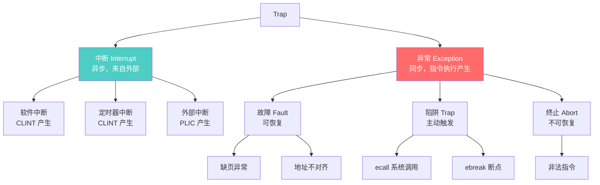
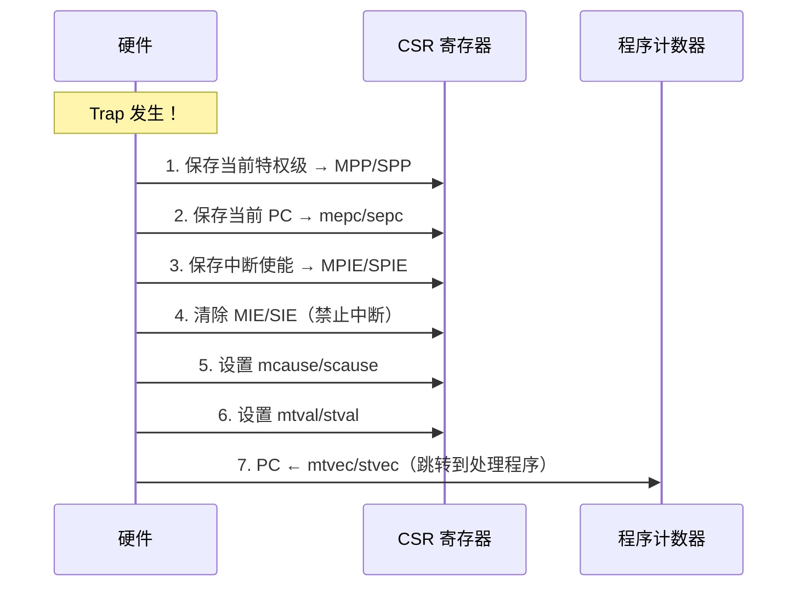
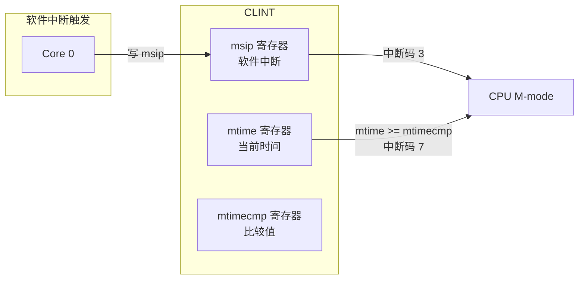
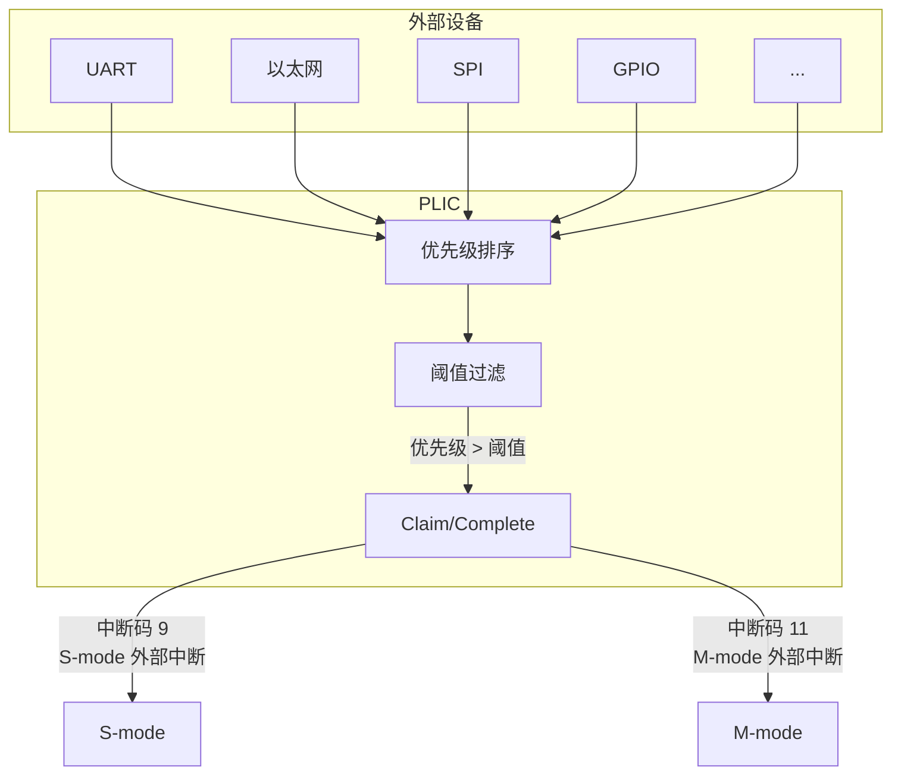
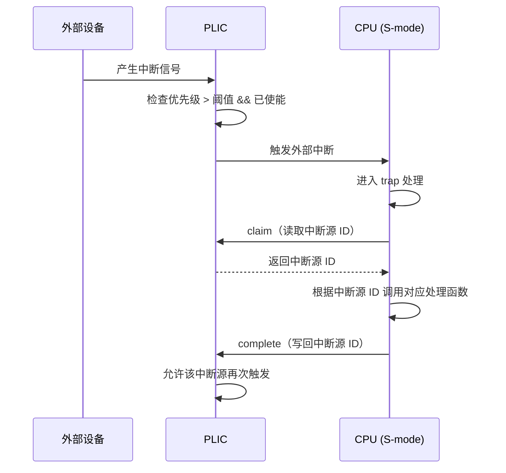
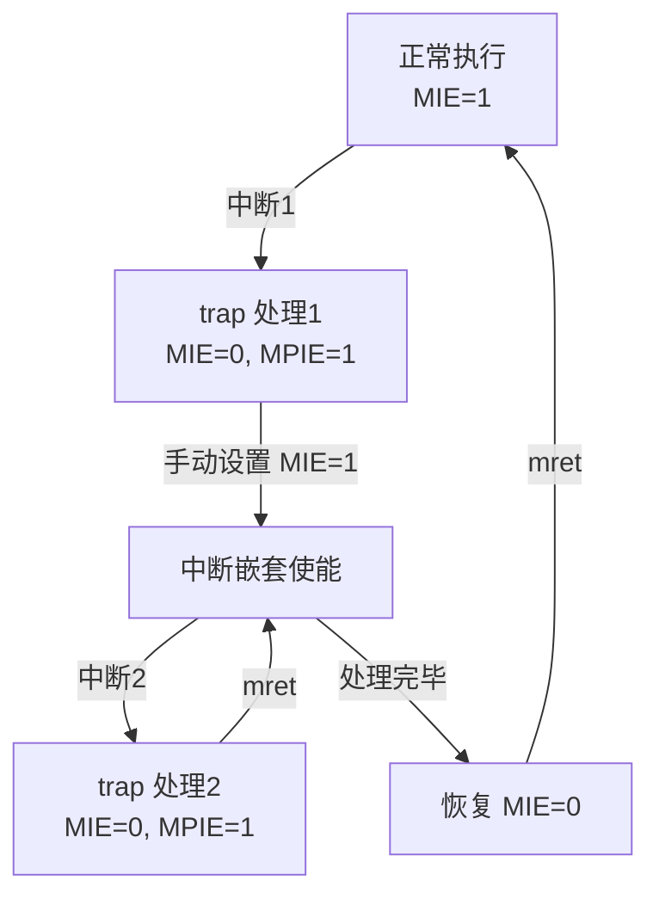
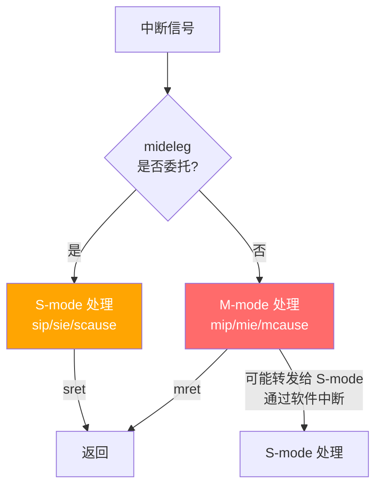
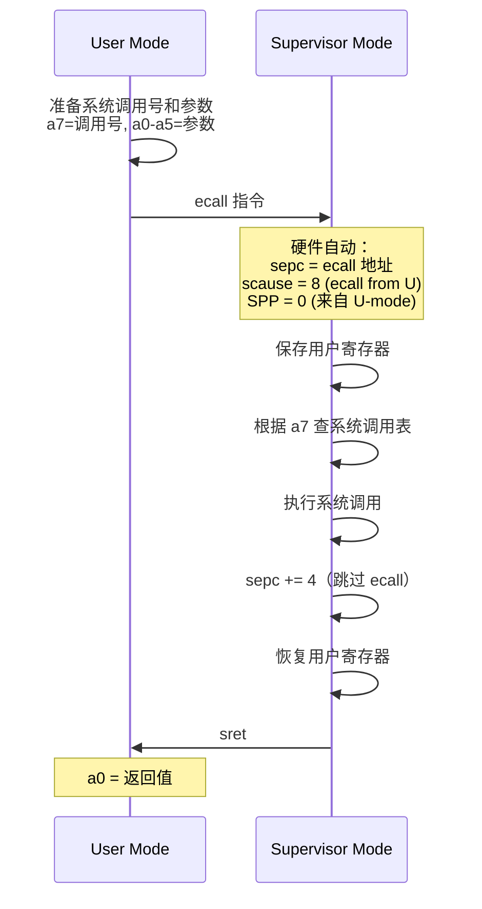

# 中断与异常处理

> 中断和异常是操作系统与硬件交互的核心机制。本文深入解析 RISC-V 的 trap 处理流程、中断控制器和实际编程。
>
> **工程师视角**：中断不是"异步事件"那么简单。在服务器 SoC 中，一个网络包到达后，从网卡 DMA → PLIC 仲裁 → CPU 中断 → 内核协议栈处理，全链路的延迟决定了系统吞吐。理解每个环节，是性能优化的起点。

### 前置知识

| 需要了解 | 参考文档 |
|----------|----------|
| RISC-V 特权模式 M/S/U 划分 | [特权模式与 CSR](./privileged-modes-and-csr.md) |
| CSR 寄存器读写方式（csrr/csrw） | [特权模式与 CSR](./privileged-modes-and-csr.md) |
| Zicsr / Zifencei 标准扩展 | [标准扩展详解](../02-isa/standard-extensions.md) |

---

## 1. Trap 的分类



| 属性 | 中断 | 异常 |
|------|------|------|
| 触发源 | 外部硬件信号 | 指令执行结果 |
| 同步性 | 异步（随时可能发生） | 同步（执行特定指令时发生） |
| mepc 指向 | 被中断的指令（返回后重新执行） | 触发异常的指令（可能需要跳过） |
| 典型用途 | I/O 响应、定时器、任务调度 | 系统调用、缺页处理、错误处理 |

---

## 2. Trap 处理完整流程

### 2.1 硬件自动完成的操作

当 trap 发生时，硬件原子地完成以下操作：



> **关键点：** 以上 7 步是硬件原子完成的，不可分割。软件不需要担心在保存现场过程中被再次中断。

### 2.2 软件需要完成的操作

```asm
# 完整的 trap 处理框架（M-mode）
trap_entry:
    # 1. 保存上下文
    csrrw  sp, mscratch, sp     # 切换到专用 trap 栈
    addi   sp, sp, -CONTEXT_SIZE

    sw     ra,   OFFSET_RA(sp)
    sw     gp,   OFFSET_GP(sp)
    sw     tp,   OFFSET_TP(sp)
    sw     t0,   OFFSET_T0(sp)
    sw     t1,   OFFSET_T1(sp)
    # ... 保存所有需要使用的寄存器

    # 2. 读取异常信息
    csrr   a0, mcause           # 异常原因
    csrr   a1, mepc             # 异常 PC
    csrr   a2, mtval            # 附加信息

    # 3. 判断中断还是异常
    bgez   a0, handle_exception # bit[XLEN-1]=0 → 异常

handle_interrupt:
    andi   a0, a0, 0x7FF        # 取异常码
    # 根据 code 分发到不同中断处理函数
    li     t0, 7
    beq    a0, t0, timer_irq    # 定时器中断
    li     t0, 11
    beq    a0, t0, external_irq # 外部中断
    j      unknown_irq

handle_exception:
    # 根据 code 分发到不同异常处理函数
    li     t0, 8
    beq    a0, t0, ecall_u      # U-mode ecall
    li     t0, 2
    beq    a0, t0, illegal_inst # 非法指令
    j      unknown_exception

    # 4. 处理完毕，恢复上下文
trap_exit:
    lw     ra,   OFFSET_RA(sp)
    lw     gp,   OFFSET_GP(sp)
    # ... 恢复所有寄存器

    addi   sp, sp, CONTEXT_SIZE
    csrrw  sp, mscratch, sp     # 恢复原始 sp
    mret                       # 返回
```

---

## 3. 中断控制器

trap handler 负责统一调度和分发，但实际的中断信号来源于硬件控制器。RISC-V 定义了 CLINT 和 PLIC 两级中断控制器，分别管理本地中断和外部设备中断：

### 3.1 CLINT（Core Local Interruptor）

CLINT 处理**每个核心本地**的中断：



| 寄存器 | 地址偏移 | 功能 |
|--------|----------|------|
| `msip` | 0x0000 + 4×hartid | 软件中断：写 1 触发 M-mode 软件中断，写 0 清除 |
| `mtime` | 0xBFF8 | 当前时间计数器（只读，由硬件自增，所有 hart 共享） |
| `mtimecmp` | 0x4000 + 8×hartid | 定时器比较值：mtime >= mtimecmp 时触发定时器中断（per-hart） |

> **Per-hart 寄存器：** msip 和 mtimecmp 是每个 hart 独立的。hart 0 的 mtimecmp 在 0x4000，hart 1 在 0x4008，hart N 在 0x4000 + 8×N。mtime 是全局共享的。

```asm
# 设置定时器中断（1ms 后触发）
# 假设时钟频率 10MHz，1ms = 10000 个时钟周期

timer_setup:
    li      t0, CLINT_BASE
    ld      t1, MTIME_OFFSET(t0)    # 读取当前 mtime
    addi    t1, t1, 10000            # 加 1ms
    sd      t1, MTIMECMP_OFFSET(t0) # 写入 mtimecmp
    ret
```

> **mtimecmp 的陷阱：** 如果写入 mtimecmp 时 mtime 已经大于新值，会立即触发中断。建议先写高 32 位再写低 32 位（或反过来，取决于实现）。

### 3.2 PLIC（Platform-Level Interrupt Controller）

PLIC 处理**外部设备**的中断，支持多中断源、优先级和多核路由：



**PLIC 的关键概念：**

| 概念 | 说明 |
|------|------|
| **中断源（Source）** | 每个外部设备有一个唯一 ID（1~1023） |
| **优先级（Priority）** | 每个中断源可设置 0-7 的优先级，0=禁用 |
| **阈值（Threshold）** | 只有优先级 > 阈值的中断才会通知 CPU |
| **使能（Enable）** | 每个上下文可以独立使能/禁用特定中断源 |
| **Claim** | CPU 读取当前最高优先级的中断源 ID |
| **Complete** | CPU 处理完后通知 PLIC（写回中断源 ID） |

**PLIC 处理流程：**



```c
// PLIC 中断处理伪代码
void handle_external_interrupt() {
    uint32_t claim = plic_claim(context_id);  // 获取中断源 ID

    switch (claim) {
        case UART_IRQ:
            uart_handler();
            break;
        case ETH_IRQ:
            eth_handler();
            break;
        default:
            unknown_irq_handler(claim);
            break;
    }

    plic_complete(context_id, claim);  // 通知 PLIC 处理完成
}
```

---

## 4. 中断嵌套

RISC-V 默认进入 trap 时禁止中断，不支持嵌套。要实现中断嵌套，需要软件手动重新使能中断：



```asm
# 支持中断嵌套的 trap 处理
nested_trap_entry:
    csrrw  sp, mscratch, sp
    # ... 保存上下文

    # 重新使能中断（允许更高优先级中断抢占）
    csrr   t0, mstatus
    ori    t0, t0, (1 << 3)     # 设置 MIE=1
    csrw   mstatus, t0

    # ... 处理中断

    # 禁止中断（防止在恢复上下文时被打断）
    csrr   t0, mstatus
    andi   t0, t0, ~(1 << 3)    # 清除 MIE
    csrw   mstatus, t0

    # ... 恢复上下文
    mret
```

> **嵌套条件：** 只有更高优先级的中断才能嵌套。需要通过 mie 和优先级寄存器来控制哪些中断可以抢占。

---

## 5. S-mode 的中断处理

前面讨论的中断嵌套是 M-mode 的高级用法。但在实际系统中，大部分中断最终由操作系统（S-mode）处理。M-mode 通过委托机制将中断下放，S-mode 拥有一套对称的 CSR（sip/sie/scause 等）来完成自己的 trap 处理。

### 5.1 中断路由



### 5.2 Sstc 扩展：S-mode 直接接收定时器中断

传统方式下，定时器中断只能由 M-mode 的 CLINT 产生，S-mode 需要通过 M-mode 中转（trap → M-mode → SBI 转发 → S-mode），增加了延迟。**Sstc 扩展**为 S-mode 提供了独立的定时器比较寄存器 `stimecmp`，使 S-mode 可以直接接收定时器中断，无需 M-mode 介入。

| CSR | 地址 | 说明 |
|-----|------|------|
| `stimecmp` | 0x14D | S-mode 定时器比较值（Sstc 扩展） |
| `vstimecmp` | 0x24D | VS-mode 定时器比较值（Sstc + H 扩展） |

```asm
# Sstc 方式设置定时器中断（无需 trap 到 M-mode）
# 直接写 stimecmp 即可
rdtime  t0                  # 读取当前时间
li      t1, 10000           # 10ms 后
add     t0, t0, t1
csrw    stimecmp, t0        # 直接设置，无需 ecall
```

> **性能影响：** 在虚拟化场景中，Sstc 的意义更大。没有 Sstc 时，Guest 的定时器中断需要 VS→HS→M→HS→VS 的漫长路径；有了 Sstc + vstimecmp，Guest 可以直接设置定时器，大幅减少 VM Exit 次数。Linux 6.6+ 已默认启用 Sstc 支持。

### 5.3 Linux 中的中断处理

Linux（RISC-V）的中断处理路径：

```
硬件中断 → M-mode (OpenSBI)
         → 如果已委托，直接进入 S-mode
         → 如果未委托，M-mode 转发给 S-mode

S-mode (Linux):
  1. 保存上下文到 pt_regs
  2. 切换到内核栈
  3. 调用 generic_handle_arch_irq()
  4. 根据中断源调用对应驱动处理函数
  5. 恢复上下文
  6. sret 返回
```

---

## 6. ecall：系统调用的实现

中断与异常都是被动触发的——前者来自外部，后者是执行错误。而 `ecall` 是软件主动请求特权级提升的唯一方式，也是用户态与内核之间唯一的合法"大门"。



```asm
# 用户态系统调用示例
# write(1, "Hello", 5)

    li    a7, 64          # write 的系统调用号
    li    a0, 1           # fd = stdout
    la    a1, msg         # buf = "Hello"
    li    a2, 5           # count = 5
    ecall                 # 进入内核
    # a0 = 返回值（写入的字节数或错误码）
```

---

## 7. 中断控制器对比

| 特性 | CLINT | PLIC | AIA (IMSIC) |
|------|-------|------|-------------|
| 中断类型 | 软件中断 + 定时器 | 外部设备中断 | 所有类型 |
| 中断信号 | 有线（电平触发） | 有线（电平触发） | MSI（消息信号） |
| 每核独立 | ✅ | ❌（可路由到多核） | ✅ |
| 优先级 | 无 | 0-7 | 0-255 |
| 中断嵌套 | 不支持 | 不支持 | 支持 |
| 虚拟化支持 | 无 | 无 | 原生支持 |
| 适用场景 | 简单系统 | 传统 SoC | 高端服务器/虚拟化 |

> AIA 的详细内容请参考 [RISC-V AIA 完全指南](../aia/riscv-aia-notes.md)

---

## 小结

| 要点 | 说明 |
|------|------|
| Trap = 中断 + 异常 | 中断异步，异常同步，处理流程相同 |
| 硬件自动保存现场 | 7 步原子操作，软件无需担心竞态 |
| CLINT 管理本地中断 | 软件中断 + 定时器中断 |
| PLIC 管理外部中断 | 优先级 + Claim/Complete 机制 |
| 委托机制 | M-mode 可将中断委托给 S-mode |
| ecall 实现系统调用 | U→S 的特权级提升，a7 传递调用号 |

---

## 参考资料

- [RISC-V Privileged Architecture Spec v1.12 — Chapter 3 (Machine-Level ISA)](https://github.com/riscv/riscv-isa-manual/releases/tag/Priv-v1.12) — Trap 处理权威定义
- [RISC-V PLIC Spec v1.0.0](https://github.com/riscv/riscv-plic-spec/releases/tag/1.0.0) — 平台级中断控制器规范
- [SBI Specification v3.0](https://github.com/riscv-non-isa/riscv-sbi-doc/releases/tag/v3.0) — Timer/IPI/HSM 等 SBI 调用定义

---

→ 下一节：[内存管理](./memory-management.md)
→ 实验：[Lab 1 — 裸机 Trap Handler](../08-labs/lab01-baremetal-trap-handler.md)
→ 高级中断架构：[RISC-V AIA 专题笔记](../aia/riscv-aia-notes.md)（推荐在完成 PLIC 章节后阅读）
