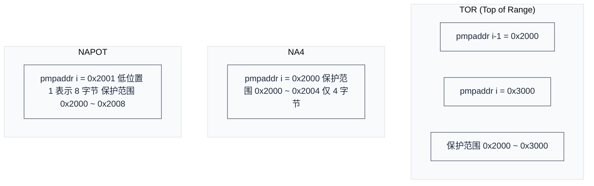
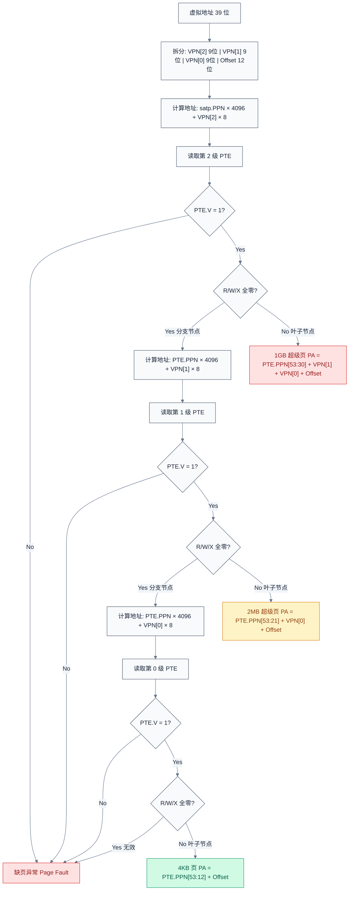
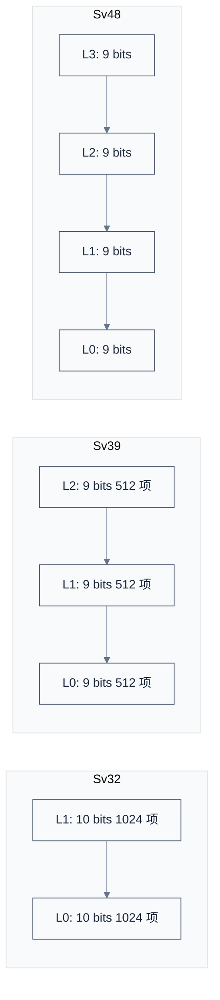
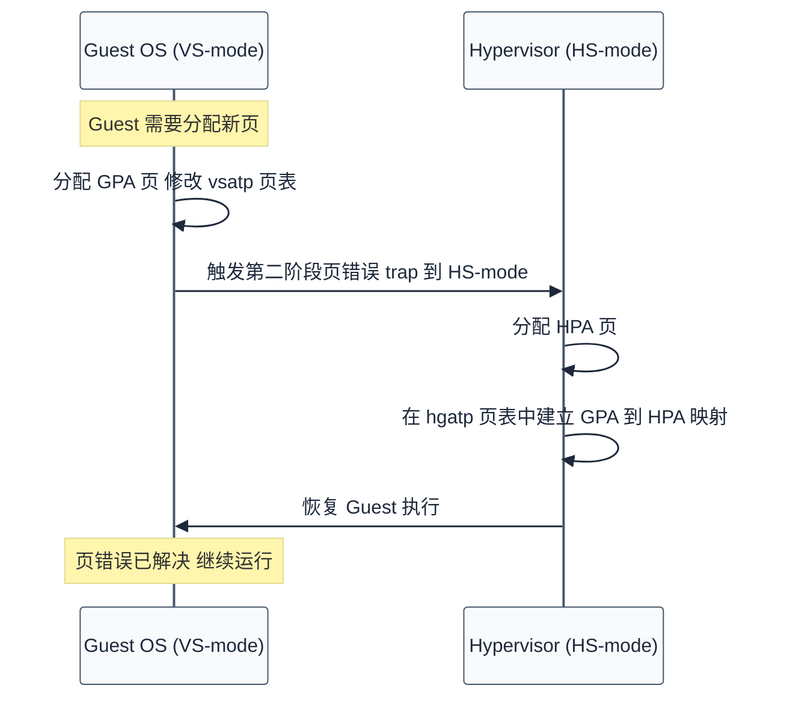

# 内存管理

> 虚拟内存是现代操作系统的基石。RISC-V 提供了 PMP（物理内存保护）和多级页表（Sv32/Sv39/Sv48）两种内存管理机制。
>
> **工程师视角**：页表不仅是"地址翻译"，更是安全策略的执行点。在服务器固件中，PMP 配置错误可能导致 S-mode 直接访问 M-mode 内存；在虚拟化场景中，两阶段页表的 TLB miss 路径是性能瓶颈的主要来源。理解页表遍历的每一步，是调试"神秘崩溃"和优化 VM 性能的基础。

### 学习目标

读完本文后，你将能够：

- **区分** PMP 和页表的职责：物理访问控制 vs 虚拟地址翻译
- **配置** PMP 条目（TOR/NAPOT 模式）保护指定的物理地址区域
- **解释** Sv39 三级页表的完整翻译过程：satp → L2 → L1 → L0 → 物理地址
- **理解** PTE 的 V/R/W/X 位如何区分"分支节点"和"叶子节点"
- **对比** Sv32/Sv39/Sv48/Sv57 四种页表模式的虚拟地址宽度和级数差异
- **描述** TLB 的作用以及 sfence.vma 在哪些场景下必须使用
- **说明** 两阶段地址翻译（VS-stage + G-stage）如何实现虚拟机的内存隔离

### 前置知识

| 需要了解                               | 参考文档                                       |
| ---------------------------------- | ------------------------------------------ |
| RISC-V 特权模式与 M 模式 CSR              | [特权模式与 CSR](./privileged-modes-and-csr.md) |
| Trap 处理流程（mepc/mcause/mtval 的写入时机） | [中断与异常](./interrupts-and-exceptions.md)    |

***

## 1. 物理内存保护（PMP）

PMP 是 M-mode 控制物理内存访问权限的机制，即使 S-mode 也不能绕过。

### 1.1 PMP 寄存器

| 寄存器                  | 数量 | 功能           |
| -------------------- | -- | ------------ |
| `pmpcfg0-pmpcfg15`   | 16 | 配置寄存器（权限、模式） |
| `pmpaddr0-pmpaddr63` | 64 | 地址寄存器        |

每个 PMP 条目由一个 pmpaddr 寄存器和 pmpcfg 中对应的 8 位配置字段组成。每个 pmpcfg（XLEN 宽）包含 4 个条目的配置：

```
pmpcfg 每个条目的 8 位布局 (RV64):
  7    6    5    4     3     2     1     0
┌─────┬────┬────┬──────┬──────┬──────┬──────┬──────┐
│  L  │ 0  │ 0  │ A[1] │ A[0] │  X   │  W   │  R   │
└─────┴────┴────┴──────┴──────┴──────┴──────┴──────┘

A (地址匹配模式) [4:3]:
  00 = OFF    — 禁用此条目
  01 = TOR    — Top of Range（地址从上一条到当前条目）
  10 = NA4    - 自然对齐 4 字节区域
  11 = NAPOT  - 自然对齐 2 的幂次区域

R/W/X (权限) [2:0]:
  0 = 禁止, 1 = 允许

L (Lock) [7]:
  1 = 锁定，M-mode 也不能修改（直到复位）

Reserved [6:5]:
  硬连线为 0
```

### 1.2 PMP 匹配模式



| 模式        | 地址要求   | 粒度             | 典型用途        |
| --------- | ------ | -------------- | ----------- |
| **TOR**   | 无对齐要求  | 4 字节           | 精确保护任意区域    |
| **NA4**   | 4 字节对齐 | 4 字节           | 保护单个字       |
| **NAPOT** | 2^n 对齐 | 8 字节 \~ 整个地址空间 | 保护大块区域（最常用） |

#### NAPOT 编码详解

NAPOT（Naturally Aligned Power-of-Two，自然对齐 2 的幂次区域）的核心思想：**pmpaddr 中存储的不是起始地址，而是起始地址与区域大小的编码**。pmpaddr 的低位连续 1 的个数编码了区域大小：

```
编码规则：pmpaddr = (base_addr >> 2) | ((size_in_bytes >> 2) - 1)

注：pmpaddr 存储的是物理地址右移 2 位后的值，下表中的地址为 pmpaddr 值，实际物理地址需左移 2 位

pmpaddr 二进制        起始(pmpaddr)  区域大小        覆盖范围(pmpaddr)
─────────────────────────────────────────────────────────────
0x2000 = ...0 0000    0x2000       4 B (NA4)     0x2000 - 0x2003
0x2001 = ...0 0001    0x2000       8 B           0x2000 - 0x2007
0x2003 = ...0 0011    0x2000       16 B          0x2000 - 0x200F
0x2007 = ...0 0111    0x2000       32 B          0x2000 - 0x201F
0x200F = ...0 1111    0x2000       64 B          0x2000 - 0x203F
0x201F = ...1 1111    0x2000       128 B         0x2000 - 0x207F

解读方法：
  1. 将 pmpaddr 右移，丢弃低位连续 1，得到起始地址 >> 2
  2. 低位连续 1 的个数 k → 区域大小 = 2^(k+3) 字节
  3. 区域大小必须 ≥ 8 字节（即 k ≥ 0，至少一个低位 1）
```

> **NA4 是特例：** NA4 对应 pmpaddr 低位没有连续 1（如 `0x2000`），区域固定为 4 字节。NAPOT 的最小区域为 8 字节。两者在 pmpcfg 的 A 字段中编码不同，硬件通过 A=10（NA4）和 A=11（NAPOT）区分。注意：NA4 在 RV32 和 RV64 上都有效，但 RV64 上 NAPOT 的最小粒度是 8 字节（因为 pmpaddr 的 bit 0 编码 8 字节区域），因此 NA4 是 RV64 上实现 4 字节粒度 PMP 的唯一方式。

### 1.3 PMP 的默认拒绝规则

```
PMP 检查规则（按条目顺序，编号越小优先级越高）:

  for each pmp_entry:
    if 地址匹配此条目:
      使用此条目的 R/W/X 权限判断是否允许访问
      （无论条目是否锁定，都参与权限检查）

  if 没有任何条目匹配:
    → M-mode: 允许访问（默认放行）
    → S/U-mode: 拒绝访问（默认拒绝）
```

> **Lock 位的含义：** Lock=1 表示该条目被"冻结"——M-mode 不能再修改此条目的配置（pmpaddr 和 pmpcfg），直到下次复位。但锁定条目**仍然参与**地址匹配和权限检查。如果 Lock=1 且 L=1 的条目匹配了某个地址，即使是 M-mode 也必须遵守该条目的 R/W/X 权限。这是 PMP 实现安全隔离的关键机制。

> **安全意义：** PMP 可以创建"安全区域"，即使是 S-mode（OS 内核）也无法访问。这在 TEE（可信执行环境）场景中非常重要。

> **本节要点：** PMP 是 M-mode 管控物理内存的最后一道关卡——它在页表翻译的"下游"起作用，因此即使 S-mode 配错了页表，也无法绕过 PMP。64 个条目通常足够覆盖固件保护区、MMIO 区域和安全内存。NAPOT 模式是最常用的配置方式，因为它能用一条 PMP 条目覆盖大块连续区域。记住 TOR 和 NAPOT 的区别：TOR 用相邻两条 pmpaddr 定义范围（适合精确区间），NAPOT 用一条 pmpaddr 的低位编码粒度（适合对齐的大块区域）。

***

## 2. 虚拟内存与页表

PMP 解决的是"谁能在物理地址上做什么"——它是一个低层次的访问控制栅栏。而虚拟内存通过页表实现了更高层次的抽象：每个进程拥有独立的地址空间，地址可以映射到不连续的物理页，页表项包含了细粒度的权限控制。这是现代操作系统内存管理的核心。

### 2.1 为什么需要虚拟内存？

| 问题      | 解决方案         |
| ------- | ------------ |
| 多进程地址冲突 | 每个进程独立地址空间   |
| 物理内存不够用 | 页面换出到磁盘      |
| 内存保护    | 页表权限位（R/W/X） |
| 内存碎片化   | 虚拟连续，物理不连续   |

### 2.2 satp 寄存器：页表的入口

要理解页表翻译，首先要找到页表在哪。这个入口就是 `satp` 寄存器——它存储了页表模式（MODE）、地址空间标识符（ASID）和页表根节点的物理页号（PPN）。satp 的完整布局和字段含义见 [特权模式与 CSR — satp](./privileged-modes-and-csr.md#satp--地址翻译与保护)。

```
satp 布局 (RV64):

 63   60 59           44 43                            0
┌───────┬───────────────┬───────────────────────────────┐
│ MODE  │     ASID      │           PPN                 │
└───────┴───────────────┴───────────────────────────────┘

MODE = 8 (Sv39) 时：
  satp.PPN 指向页表根节点（第 2 级页表）的物理地址
  → 根页表地址 = satp.PPN × 4096
```

> **关键点：** satp 是整个虚拟内存翻译的起点。MMU（Memory Management Unit）读取 satp.PPN 找到根页表，然后逐级查表完成地址翻译。satp 写入后不会立即生效，必须执行 `sfence.vma` 刷新 TLB。

### 2.3 Sv39 地址格式

Sv39 是 RV64 最常用的页表模式，使用 39 位虚拟地址，翻译后得到 56 位物理地址。虚拟地址被拆分为 3 段 VPN（Virtual Page Number）和页内偏移，每段 9 位对应一级页表的 512 个条目：

```
虚拟地址 (39-bit):
  38    30 29    21 20    12 11         0
┌─────────┬─────────┬─────────┬───────────┐
│  VPN[2] │  VPN[1] │  VPN[0] │ Page Offset│
│  9 bits │  9 bits │  9 bits │  12 bits   │
└─────────┴─────────┴─────────┴───────────┘

物理地址 (56-bit):
  55      30 29    21 20    12 11         0
┌───────────┬─────────┬─────────┬───────────┐
│  PPN[2]   │  PPN[1] │  PPN[0] │ Page Offset│
│  26 bits  │  9 bits │  9 bits │  12 bits   │
└───────────┴─────────┴─────────┴───────────┘
```

VPN 和 PPN 的对应关系：查表时用 VPN 作为索引，找到的 PTE 中包含 PPN，最终将 PPN 与 Offset 拼接得到物理地址。这个过程在 [2.5 页表遍历](#25-三级页表翻译过程) 中详细展开。

### 2.4 页表项（PTE）格式与权限

每条 PTE 占 8 字节（64 位），包含物理页号（PPN）和一组控制位。理解 PTE 的每一位是理解页表遍历的前提：

```
页表项 (64-bit):

 63  62 61 60      54 53          10 9  8  7  6  5  4  3  2  1  0
┌────┬────┬──────────┬──────────────┬───┬───┬───┬───┬───┬───┬───┬───┐
│ N  │PBMT│ Reserved │     PPN      │RSW│ D │ A │ G │ U │ X │ W │ R │ V │
│1bit│2bit│  7 bit   │   44 bit     │2bt│1bt│1bt│1bt│1bt│1bt│1bt│1bt│1bt│
└────┴────┴──────────┴──────────────┴───┴───┴───┴───┴───┴───┴───┴───┘
```

**页表遍历直接相关的位：**

| 位            | 名称   | 说明                                                                                              |
| ------------ | ---- | ----------------------------------------------------------------------------------------------- |
| **V \[0]**   | Valid  | **页表项有效位**。V=0 表示该条目无效，访问将触发缺页异常。这是页表遍历的第一道检查                                              |
| **R \[1]**   | Read   | 可读                                                                                            |
| **W \[2]**   | Write  | 可写                                                                                            |
| **X \[3]**   | Execute | 可执行                                                                                          |
| **PPN \[53:10]** | Physical Page Number | 物理页号（44 位），翻译结果的核心字段                                                                    |

**R/W/X 编码决定了 PTE 的类型：**

| R | W | X | 含义                     |
| - | - | - | ---------------------- |
| 0 | 0 | 0 | **分支节点**：不翻译地址，PPN 指向下一级页表  |
| 0 | 0 | 1 | 只执行页                   |
| 0 | 1 | 0 | ⚠️ 保留（W=1 且 R=0 为非法编码） |
| 0 | 1 | 1 | ⚠️ 保留（W=1 且 R=0 为非法编码） |
| 1 | 0 | 0 | 只读页                    |
| 1 | 0 | 1 | 读执行页                   |
| 1 | 1 | 0 | 读写页                    |
| 1 | 1 | 1 | 读写执行页                  |

> **页表遍历的判断逻辑：** 先检查 V=1（有效），再看 R/W/X——全零表示这是分支节点（PPN 指向下一级页表），不全零表示这是叶子节点（PPN 就是翻译结果的物理页号）。W=1 但 R=0 是非法的，硬件应触发缺页异常。

**其余控制位：**

| 位              | 名称                      | 说明                                               |
| -------------- | ----------------------- | ------------------------------------------------ |
| U \[4]         | User                    | U-mode 可访问                                       |
| G \[5]         | Global                  | 全局映射（不随 ASID 刷新）                                 |
| A \[6]         | Accessed                | 已被访问（硬件或软件设置）                                    |
| D \[7]         | Dirty                   | 已被修改（硬件或软件设置）                                    |
| RSW \[9:8]     | Reserved for Software   | 保留给操作系统软件使用，硬件忽略                                 |
| Reserved \[60:54] | —                    | 保留，必须为 0                                          |
| PBMT \[62:61]  | Page-Based Memory Types | 缓存属性提示（Svpbmt 扩展）：00=PMA, 01=NC（非缓存），10=IO（设备内存） |
| N \[63]        | NAPOT                   | 硬件页面合并标志（Svnapot 扩展），用于合并连续 PTE 为更大的 TLB 条目      |

#### sstatus 中的访问控制位

PTE 的 R/W/X/U 位定义了静态权限，而 sstatus 寄存器中的 SUM 和 MXR 位提供了运行时的动态覆盖：

| 位             | 名称                       | 说明                               |
| ------------- | ------------------------ | -------------------------------- |
| **SUM \[18]** | Supervisor User Memory   | S-mode 是否可以访问 U-mode 页。0=禁止，1=允许 |
| **MXR \[19]** | Make eXecutable Readable | 是否可以将只执行页当作可读页。0=禁止，1=允许         |

```
SUM 的用途：
  Linux 内核需要读写用户空间数据（如 copy_from_user）
  → 设置 SUM=1 允许内核访问 U-mode 页
  → 访问完毕后清除 SUM=0 防止意外访问

MXR 的用途：
  某些场景需要读取只执行页的内容（如调试、代码自修改）
  → 设置 MXR=1 允许读取 X=1, R=0 的页
```

> **SUM/MXR 与 PTE 的关系：** PTE 的 U 位决定"谁可以访问"，SUM 允许 S-mode 临时突破这个限制。PTE 的 R/X 位决定"可以做什么"，MXR 允许将只执行页视为可读。两者都是 sstatus 中的"运行时开关"，配合 PTE 的静态权限使用。

### 2.5 三级页表翻译过程

有了前面的基础——satp 指向根页表、VPN 作为索引、PTE 的 V/R/W/X 决定分支还是叶子——现在可以看完整的翻译流程。以 Sv39 为例，页表共 3 级，MMU 从根页表开始逐级查找：



**每一级查表的步骤相同：**

| 步骤 | 操作 | 说明 |
|------|------|------|
| 1 | 计算 PTE 地址 | `页表基址 × 4096 + VPN[n] × 8`（每条 PTE 8 字节） |
| 2 | 读取 PTE | 从内存加载 64 位 PTE |
| 3 | 检查 V 位 | V=0 → 缺页异常；V=1 → 继续 |
| 4 | 检查 R/W/X | 全零 → 分支节点，用 PTE.PPN 查下一级；不全零 → 叶子节点，翻译完成 |

**不同级别叶子节点的物理地址构造：**

| 叶子级别 | 超级页大小 | 物理地址构造 |
|---------|-----------|-------------|
| 第 2 级 | 1 GB | `PTE.PPN[53:30] ∥ VPN[1] ∥ VPN[0] ∥ Offset` |
| 第 1 级 | 2 MB | `PTE.PPN[53:21] ∥ VPN[0] ∥ Offset` |
| 第 0 级 | 4 KB | `PTE.PPN[53:12] ∥ Offset` |

> **超级页（Super Page）：** 在第 2 级或第 1 级遇到叶子页表项（V=1 且 R/W/X 不全为 0）时，直接完成翻译，跳过后续级别。超级页减少了 TLB miss 时的内存访问次数，是大内存工作负载的常用优化。

### 2.6 完整翻译示例

以 Sv39、虚拟地址 `0x00000000_12345678` 为例，走一遍完整的翻译流程：

```
1. 拆分虚拟地址：
   VPN[2] = 0x000 (bits 38:30)
   VPN[1] = 0x091 (bits 29:21)
   VPN[0] = 0x145 (bits 20:12)
   Offset = 0x678 (bits 11:0)

2. 查第 2 级页表（根页表）：
   PTE 地址 = satp.PPN × 4096 + VPN[2] × 8
   读取 PTE → V=1, R/W/X=000（分支节点）→ PTE.PPN = next_ppn

3. 查第 1 级页表：
   PTE 地址 = next_ppn × 4096 + VPN[1] × 8
   读取 PTE → V=1, R/W/X=000（分支节点）→ PTE.PPN = next_ppn2

4. 查第 0 级页表：
   PTE 地址 = next_ppn2 × 4096 + VPN[0] × 8
   读取 PTE → V=1, R/W/X=111（叶子节点）→ PTE.PPN = final_ppn

5. 组合物理地址：
   PA = final_ppn × 4096 + 0x678
```

> **性能影响：** 每次 TLB miss 需要 3 次内存访问（3 级页表各一次）。如果使用 1 GB 超级页，只需 1 次内存访问即可完成翻译。这就是为什么大内存服务器倾向于使用超级页。

> **本节要点：** Sv39 的页表翻译可以浓缩为三个判断循环：取 PTE → 检查 V 位 → 判断 R/W/X。全零意味着"这不是终点，继续往下查"；不全零意味着"找到了，这里就是翻译结果"。超级页是这个规律的自然推论——任何一级页表都可以提前终结，从而用一条 PTE 覆盖更大的地址范围。理解这个循环逻辑后，Sv48/Sv57 只是多套几层循环而已。

***

## 3. Sv32 / Sv39 / Sv48 / Sv57 对比

第 2 节以 Sv39 为例讲解了页表的完整工作原理。RISC-V 规范定义了多种页表模式，区别在于虚拟地址宽度和页表级数——Sv39 的 3 级结构是理解其他模式的基础，它们只是级数不同。

| 特性         | Sv32 | Sv39       | Sv48               | Sv57                       |
| ---------- | ---- | ---------- | ------------------ | -------------------------- |
| **适用架构**   | RV32 | RV64       | RV64               | RV64                       |
| **虚拟地址宽度** | 32 位 | 39 位       | 48 位               | 57 位                       |
| **物理地址宽度** | 34 位 | 56 位       | 56 位               | 56 位                       |
| **页表级数**   | 2    | 3          | 4                  | 5                          |
| **页大小**    | 4 KB | 4 KB       | 4 KB               | 4 KB                       |
| **超级页**    | 4 MB | 2 MB, 1 GB | 2 MB, 1 GB, 512 GB | 2 MB, 1 GB, 512 GB, 256 TB |
| **虚拟地址空间** | 4 GB | 512 GB     | 256 TB             | 128 PB                     |
| **每级页表项数** | 1024 | 512        | 512                | 512                        |



### 3.1 Sv48 页表结构详解

Sv48 使用 48 位虚拟地址，4 级页表，是 Sv39 的自然扩展。随着 RISC-V 服务器芯片支持更大内存，Sv48 越来越重要：

```
Sv48 虚拟地址 (48-bit):
  47    39 38    30 29    21 20    12 11         0
┌─────────┬─────────┬─────────┬─────────┬───────────┐
│  VPN[3] │  VPN[2] │  VPN[1] │  VPN[0] │ Page Offset│
│  9 bits │  9 bits │  9 bits │  9 bits │  12 bits   │
└─────────┴─────────┴─────────┴─────────┴───────────┘

satp.MODE = 9 (Sv48)
```

| 特性        | Sv39       | Sv48               |
| --------- | ---------- | ------------------ |
| 虚拟地址      | 39 bit     | 48 bit             |
| 页表级数      | 3          | 4                  |
| 地址空间      | 512 GB     | 256 TB             |
| 超级页       | 2 MB, 1 GB | 2 MB, 1 GB, 512 GB |
| satp.MODE | 8          | 9                  |

> **兼容性：** Sv48 完全兼容 Sv39 的页表格式——Sv48 的低 3 级页表结构与 Sv39 完全一致，只是多了一级 L3 页表。操作系统可以在启动时先使用 Sv39，运行时检测硬件支持后切换到 Sv48。

> **本节要点：** 四种页表模式的差异本质上是地址空间和级数的取舍。Sv32 是 RV32 的唯一选择（2 级、4 GB）；Sv39 是 RV64 的最常用模式（3 级、512 GB），足以覆盖大多数通用场景；Sv48（4 级、256 TB）和 Sv57（5 级、128 PB）面向大内存服务器。关键洞察：各级页表的 PTE 格式完全相同（V/R/W/X 等位的语义不变），因此从 Sv39 扩展到 Sv48/Sv57 只是"多查一张表"。

***

## 4. TLB 管理

前面介绍了页表翻译的完整路径——但每次翻译都需要 3~5 次内存访问，这对性能是不可接受的。TLB（Translation Lookaside Buffer，地址转换后备缓冲器）是页表的硬件 Cache，将翻译结果缓存在 CPU 内部，使后续访问无需再走完整的页表遍历。

### 4.1 sfence.vma 指令

| 指令                    | 功能                      |
| --------------------- | ----------------------- |
| `sfence.vma`          | 刷新所有 TLB 项              |
| `sfence.vma rs1, x0`  | 只刷新与 rs1 对应的虚拟地址相关的 TLB |
| `sfence.vma x0, rs2`  | 只刷新与 rs2（ASID）相关的 TLB   |
| `sfence.vma rs1, rs2` | 只刷新特定虚拟地址 + ASID 的 TLB  |

### 4.2 何时需要刷新 TLB

| 场景            | 刷新方式                           |
| ------------- | ------------------------------ |
| 切换页表（写 satp）  | `sfence.vma` 全刷                |
| 进程切换（不同 ASID） | `sfence.vma x0, rs2`（按 ASID 刷） |
| 修改单个页表项       | `sfence.vma rs1, x0`（按地址刷）     |
| 内核映射修改        | `sfence.vma` 全刷                |

### 4.3 ASID 的作用

ASID（Address Space ID）用于区分不同进程的 TLB 项，避免每次进程切换都全刷 TLB：

```
satp.ASID = 0x1234  →  进程 A 的 TLB 项标记为 ASID=0x1234
satp.ASID = 0x5678  →  进程 B 的 TLB 项标记为 ASID=0x5678

切换回进程 A 时：
  方案 1（无 ASID）：全刷 TLB → 进程 A 的 TLB 全部 miss → 性能差
  方案 2（有 ASID）：只刷 ASID=0x5678 的项 → 进程 A 的 TLB 可能还在 → 性能好
```

***

## 5. 虚拟化内存管理

第 2~4 节讨论的都是单层操作系统下的内存管理——一个内核管理一套页表。当 Hypervisor 引入虚拟机时，地址翻译变为两阶段：Guest OS 管理 GVA→GPA，Hypervisor 管理 GPA→HPA。这是 H 扩展对内存管理的核心增强。

### 5.1 两阶段地址翻译

在 H 扩展虚拟化场景下，地址翻译分为两个阶段：


| 阶段   | 控制寄存器   | 页表基址        | 管理者                 |
| ---- | ------- | ----------- | ------------------- |
| 第一阶段 | `vsatp` | Guest OS 页表 | Guest OS（VS-mode）   |
| 第二阶段 | `hgatp` | Host 页表     | Hypervisor（HS-mode） |

> **关键区别：** 第一阶段翻译与普通 S-mode 的 Sv39 完全一致，只是由 `vsatp` 而非 `satp` 控制。第二阶段是新增的翻译层，将 GPA 翻译为 HPA。

### 5.2 Sv39x4：第二阶段页表

第二阶段翻译使用 `Sv39x4` 模式（由 `hgatp.MODE` 设置），与 Sv39 级数相同，但根页表从 512 项扩展为 1024 项：

```
Sv39x4 的 Guest 物理地址 (41-bit 有效，页表 VPN 结构为 40-bit):

 39    30 29    21 20    12 11         0
┌─────────┬─────────┬─────────┬───────────┐
│ VPN[2]  │ VPN[1]  │ VPN[0]  │ Page Offset│
│ 10 bits │  9 bits │  9 bits │  12 bits   │
└─────────┴─────────┴─────────┴───────────┘

注意：比 Sv39 多了 2 位有效 GPA（41-bit vs 39-bit）。根页表有 1024 项
→ 每条 PTE 扩展为 16 字节（而非标准 8 字节），根页表共占 16 KiB
→ 仍为 3 级页表，VPN 结构 40-bit，额外 1 位通过 PPN 字段编码获得
```

| 特性     | Sv39（第一阶段）   | Sv39x4（第二阶段）            |
| ------ | ------------ | ----------------------- |
| 有效地址宽度 | 39 bit (GVA) | 41 bit (GPA)            |
| 页表级数   | 3            | 3（PTE 16 字节，根页表 1024 项） |
| 根页表项数  | 512          | 1024（16 KiB 根页表）        |
| 非根页表项数 | 512          | 512                     |
| 页大小    | 4 KB         | 4 KB                    |
| 超级页    | 2 MB, 1 GB   | 2 MB, 1 GB              |
| 地址空间   | 512 GB       | 2 TB                    |

> **为什么需要 x4？** 第二阶段翻译需要覆盖更大的地址空间。多个 Guest 的物理地址空间可能超过 512 GB，因此 Sv39x4 将 GPA 从 39 位扩展到 41 位，提供了 2 TB 的 GPA 空间。

### 5.3 hgatp 寄存器

```
hgatp 布局 (RV64):

 63   60 59      44 43             0
┌───────┬──────────┬───────────────┐
│ MODE  │   VMID   │     PPN       │
└───────┴──────────┴───────────────┘

MODE:
  0000 = Bare（不启用第二阶段翻译）
  1000 = Sv39x4
  1001 = Sv48x4
  1010 = Sv57x4

VMID (16-bit): 虚拟机 ID，用于 TLB 标记（有效位数由实现决定，QEMU RV64 实现为 14 位）
PPN: 第二阶段页表根节点的物理页号
```

| 字段   | 宽度     | 说明                                               |
| ---- | ------ | ------------------------------------------------ |
| MODE | 4 bit  | 页表模式                                             |
| VMID | 16 bit | 虚拟机标识符（有效位数由实现决定，QEMU RV64 为 14 位，最多 16384 个 VM） |
| PPN  | 44 bit | 页表根物理页号                                          |

### 5.4 VMID 的作用

VMID 与 ASID 类似，用于避免 VM 切换时刷新全部 TLB：

```
VM 切换时：
  无 VMID：全刷 TLB → Guest 热点页全部 miss → 性能差
  有 VMID：只刷当前 VMID 的 TLB → 其他 VM 的 TLB 保留 → 性能好
```

### 5.5 虚拟化 TLB 刷新指令

| 指令                     | 功能                    | 刷新范围      |
| ---------------------- | --------------------- | --------- |
| `hfence.vvma rs1, rs2` | 刷新第一阶段 TLB（GVA → GPA） | 按 ASID/地址 |
| `hfence.gvma rs1, rs2` | 刷新第二阶段 TLB（GPA → HPA） | 按 VMID/地址 |

```asm
# hfence.vvma: rs1 = 虚拟地址（x0 = 全刷），rs2 = ASID（x0 = 全刷）
# hfence.gvma: rs1 = GPA（x0 = 全刷），rs2 = VMID（x0 = 全刷）

hfence.vvma x0, x0     # 刷新所有第一阶段 TLB（所有 ASID）
hfence.gvma x0, x0     # 刷新所有第二阶段 TLB（所有 VMID）

# 刷新特定 ASID 的第一阶段 TLB
li      t0, ASID
hfence.vvma x0, t0     # 刷新指定 ASID 的第一阶段 TLB

# 刷新特定 VMID 的第二阶段 TLB
li      t1, VMID
hfence.gvma x0, t1     # 刷新指定 VMID 的第二阶段 TLB
```

### 5.6 虚拟化内存管理流程



> **深入理解：** Guest OS 管理自己的虚拟地址空间（GVA → GPA），但无法控制 GPA → HPA 的映射。Hypervisor 完全控制第二阶段翻译，可以实现内存超分（overcommit）、内存气球（balloon）等高级功能。

***

## 小结

| 要点             | 说明                                   |
| -------------- | ------------------------------------ |
| **PMP**        | M-mode 控制物理内存保护，S-mode 无法绕过          |
| **satp**       | 页表入口，MODE + ASID + PPN 三要素            |
| **PTE 格式**     | V 位判断有效，R/W/X 全零为分支节点，否则为叶子节点        |
| **页表遍历**      | 逐级查表：计算地址 → 读 PTE → 检查 V → 检查 R/W/X |
| **SUM/MXR**    | sstatus 中的运行时访问控制，配合 PTE 静态权限使用      |
| **Sv39→Sv48**  | 3 级→4 级，结构兼容，地址空间从 512 GB 扩展到 256 TB |
| **TLB**        | 页表 Cache，sfence.vma 刷新，ASID 避免全刷      |
| **虚拟化**       | 两阶段翻译（GVA→GPA→HPA），Sv39x4，hgatp，hfence |

***

## 参考资料

- [RISC-V Privileged Architecture Spec v1.13 — Chapter 4 (Sv32/Sv39/Sv48)](https://github.com/riscv/riscv-isa-manual/releases/tag/Priv-v1.13) — 页表格式权威定义
- [RISC-V PMP Spec (Privileged spec Ch3.7)](https://github.com/riscv/riscv-isa-manual/releases/tag/Priv-v1.13) — PMP 寄存器与编码
- [RISC-V Svpbmt Extension Spec](https://github.com/riscv/riscv-isa-manual) — 内存属性 PBMT 扩展

***

→ 下一节：[启动流程](./boot-process.md)
→ 虚拟化专题：[虚拟化：H 扩展与 KVM](./virtualization.md)
→ 实验：[Lab 3 — Sv39 页表建立](../08-labs/lab03-sv39-page-table.md)
