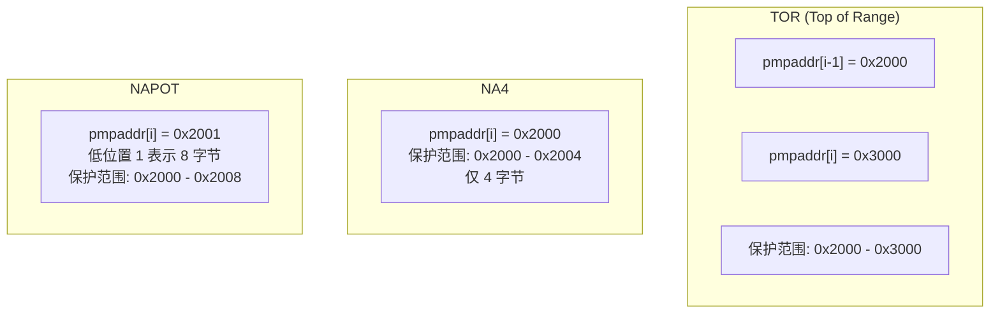
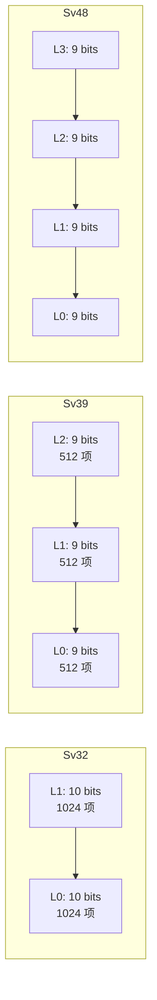
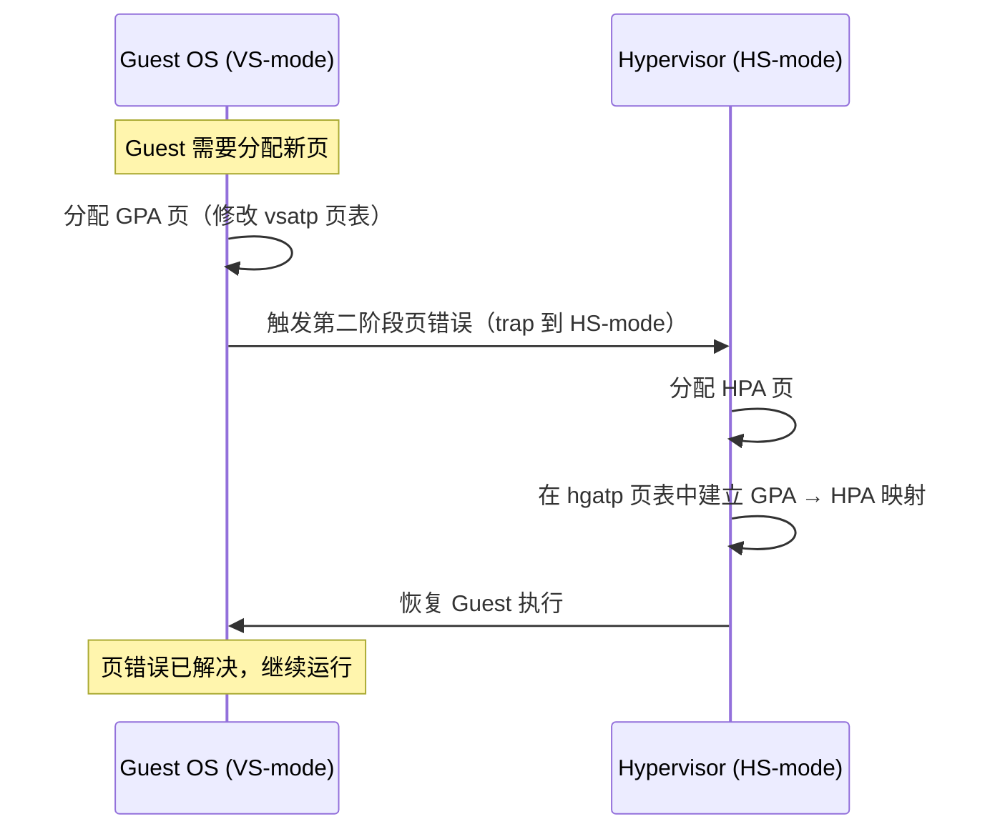

# 内存管理

> 虚拟内存是现代操作系统的基石。RISC-V 提供了 PMP（物理内存保护）和多级页表（Sv32/Sv39/Sv48）两种内存管理机制。
>
> **工程师视角**：页表不仅是"地址翻译"，更是安全策略的执行点。在服务器固件中，PMP 配置错误可能导致 S-mode 直接访问 M-mode 内存；在虚拟化场景中，两阶段页表的 TLB miss 路径是性能瓶颈的主要来源。理解页表遍历的每一步，是调试"神秘崩溃"和优化 VM 性能的基础。

---

## 1. 物理内存保护（PMP）

PMP 是 M-mode 控制物理内存访问权限的机制，即使 S-mode 也不能绕过。

### 1.1 PMP 寄存器

| 寄存器 | 数量 | 功能 |
|--------|------|------|
| `pmpcfg0-pmpcfg15` | 16 | 配置寄存器（权限、模式） |
| `pmpaddr0-pmpaddr63` | 64 | 地址寄存器 |

每个 PMP 条目由一个 pmpcfg 和一个 pmpaddr 组成：

```
pmpcfg 布局:
  7    6  5  4    3    2    1    0
┌──────┬──┬──┬─────┬─────┬─────┬─────┐
│ Lock │ 0│ 0│  R  │  W  │  X  │  A  │
└──────┴──┴──┴─────┴─────┴─────┴─────┘

A (地址匹配模式):
  00 = OFF    — 禁用此条目
  01 = TOR    — Top of Range（地址从上一条到当前条目）
  10 = NA4    - 自然对齐 4 字节区域
  11 = NAPOT  - 自然对齐 2 的幂次区域

R/W/X (权限):
  0 = 禁止, 1 = 允许

Lock:
  1 = 锁定，M-mode 也不能修改（直到复位）
```

### 1.2 PMP 匹配模式



| 模式 | 地址要求 | 粒度 | 典型用途 |
|------|----------|------|----------|
| **TOR** | 无对齐要求 | 4 字节 | 精确保护任意区域 |
| **NA4** | 4 字节对齐 | 4 字节 | 保护单个字 |
| **NAPOT** | 2^n 对齐 | 8 字节 ~ 整个地址空间 | 保护大块区域（最常用） |

### 1.3 PMP 的默认拒绝规则

```
PMP 检查规则（按条目顺序）:

  for each pmp_entry:
    if 地址匹配 && 条目未锁定:
      使用此条目的权限（R/W/X）
      → M-mode: 默认允许，PMP 可以禁止
      → S/U-mode: 默认禁止，PMP 可以允许

  if 没有任何条目匹配:
    → M-mode: 允许访问
    → S/U-mode: 拒绝访问
```

> **安全意义：** PMP 可以创建"安全区域"，即使是 S-mode（OS 内核）也无法访问。这在 TEE（可信执行环境）场景中非常重要。

---

## 2. 虚拟内存与页表

### 2.1 为什么需要虚拟内存？

| 问题 | 解决方案 |
|------|----------|
| 多进程地址冲突 | 每个进程独立地址空间 |
| 物理内存不够用 | 页面换出到磁盘 |
| 内存保护 | 页表权限位（R/W/X） |
| 内存碎片化 | 虚拟连续，物理不连续 |

### 2.2 Sv39 页表结构

Sv39 是 RV64 最常用的页表模式，使用 39 位虚拟地址：

```
虚拟地址 (39-bit):
  38    30 29    21 20    12 11         0
┌─────────┬─────────┬─────────┬───────────┐
│  VPN[2] │  VPN[1] │  VPN[0] │ Page Offset│
│  9 bits │  9 bits │  9 bits │  12 bits   │
└─────────┴─────────┴─────────┴───────────┘

物理地址 (56-bit):
  55      30 29    21 20    12 11         0
┌───────────┬─────────┬─────────┬───────────┐
│  PPN[2]   │  PPN[1] │  PPN[0] │ Page Offset│
│  26 bits  │  9 bits │  9 bits │  12 bits   │
└───────────┴─────────┴─────────┴───────────┘
```

### 2.3 三级页表翻译过程

```mermaid
graph TD
    VA[虚拟地址] --> SPLIT[拆分为<br/>VPN[2] + VPN[1] + VPN[0] + Offset]
    SPLIT --> L2["查第 2 级页表<br/>satp.PPN + VPN[2]"]
    L2 --> PTE2["页表项 PTE"]
    PTE2 --> |"PTE.V=1 && PTE.R/W/X≠0"| LEAF2["叶子页表<br/>直接翻译"]
    PTE2 --> |"PTE.V=1 && PTE.R/W/X=0"| BRANCH2["分支页表<br/>继续查下一级"]

    BRANCH2 --> L1["查第 1 级页表<br/>PTE.PPN + VPN[1]"]
    L1 --> PTE1["页表项 PTE"]
    PTE1 --> |"PTE.R/W/X≠0"| LEAF1["叶子页表"]
    PTE1 --> |"PTE.R/W/X=0"| L0["查第 0 级页表<br/>PTE.PPN + VPN[0]"]
    L0 --> LEAF0["叶子页表"]

    LEAF2 --> PA[物理地址 = PPN + Offset]
    LEAF1 --> PA
    LEAF0 --> PA

    style LEAF2 fill:#ff6b6b,color:#fff
    style LEAF1 fill:#ffa502,color:#fff
    style LEAF0 fill:#4ecdc4,color:#fff
```

> **超级页（Super Page）：** 如果在第 2 级或第 1 级就遇到叶子页表项，则该页是超级页（2MB 或 1GB），可以减少 TLB 压力。

### 2.4 页表项（PTE）格式

```
页表项 (64-bit):

 63  54 53  52 51  50 49  48 47  44 43  10 9  8  7  6  5  4  3  2  1  0
┌─────┬─────┬─────┬─────┬─────┬─────────┬───┬───┬───┬───┬───┬───┬───┬───┐
│ N   │ PBMT│  0  │  0  │  0  │   PPN   | R | W | X | U | G | A | D | V |
└─────┴─────┴─────┴─────┴─────┴─────────┴───┴───┴───┴───┴───┴───┴───┴───┘
```

| 位 | 名称 | 说明 |
|----|------|------|
| V [0] | Valid | 页表项有效 |
| R [1] | Read | 可读 |
| W [2] | Write | 可写 |
| X [3] | Execute | 可执行 |
| U [4] | User | U-mode 可访问 |
| G [5] | Global | 全局映射（不随 ASID 刷新） |
| A [6] | Accessed | 已被访问（硬件或软件设置） |
| D [7] | Dirty | 已被修改（硬件或软件设置） |
| PPN [53:10] | Physical Page Number | 物理页号 |
| PBMT [62:61] | Page-Based Memory Types | 缓存属性提示（Svpbmt 扩展）：00=PMA, 01=NC（非缓存），10=IO（设备内存） |
| N [63] | NAPOT | 硬件页面合并标志（Svnapot 扩展），用于合并连续 PTE 为更大的 TLB 条目 |

### 2.5 R/W/X 编码含义

| R | W | X | 含义 |
|---|---|---|------|
| 0 | 0 | 0 | 非叶子节点（指向下一级页表） |
| 0 | 0 | 1 | 只执行页 |
| 0 | 1 | 0 | ⚠️ 保留（W=1 且 R=0 为非法编码） |
| 0 | 1 | 1 | ⚠️ 保留（W=1 且 R=0 为非法编码） |
| 1 | 0 | 0 | 只读页 |
| 1 | 0 | 1 | 读执行页 |
| 1 | 1 | 0 | 读写页 |
| 1 | 1 | 1 | 读写执行页 |

> **W=1 但 R=0 是非法的**（除了 R=W=X=0 表示非叶子节点）。写权限隐含读权限是合理的，因为你要写一个东西至少得能看到它。因此 R=0/W=1 的组合为保留编码，硬件应触发缺页异常。

---

## 3. Sv32 / Sv39 / Sv48 / Sv57 对比

| 特性 | Sv32 | Sv39 | Sv48 | Sv57 |
|------|------|------|------|------|
| **适用架构** | RV32 | RV64 | RV64 | RV64 |
| **虚拟地址宽度** | 32 位 | 39 位 | 48 位 | 57 位 |
| **物理地址宽度** | 34 位 | 56 位 | 56 位 | 56 位 |
| **页表级数** | 2 | 3 | 4 | 5 |
| **页大小** | 4 KB | 4 KB | 4 KB | 4 KB |
| **超级页** | 4 MB | 2 MB, 1 GB | 2 MB, 1 GB, 512 GB | 2 MB, 1 GB, 512 GB, 256 TB |
| **虚拟地址空间** | 4 GB | 512 GB | 256 TB | 128 PB |
| **每级页表项数** | 1024 | 512 | 512 | 512 |



### 3.1 Sv48 页表结构详解

Sv48 使用 48 位虚拟地址，4 级页表，是 Sv39 的自然扩展。随着 RISC-V 服务器芯片支持更大内存，Sv48 越来越重要：

```
Sv48 虚拟地址 (48-bit):
  47    39 38    30 29    21 20    12 11         0
┌─────────┬─────────┬─────────┬─────────┬───────────┐
│  VPN[3] │  VPN[2] │  VPN[1] │  VPN[0] │ Page Offset│
│  9 bits │  9 bits │  9 bits │  9 bits │  12 bits   │
└─────────┴─────────┴─────────┴─────────┴───────────┘

satp.MODE = 9 (Sv48)
```

| 特性 | Sv39 | Sv48 |
|------|------|------|
| 虚拟地址 | 39 bit | 48 bit |
| 页表级数 | 3 | 4 |
| 地址空间 | 512 GB | 256 TB |
| 超级页 | 2 MB, 1 GB | 2 MB, 1 GB, 512 GB |
| satp.MODE | 8 | 9 |

> **兼容性：** Sv48 完全兼容 Sv39 的页表格式——Sv48 的低 3 级页表结构与 Sv39 完全一致，只是多了一级 L3 页表。操作系统可以在启动时先使用 Sv39，运行时检测硬件支持后切换到 Sv48。

---

## 4. TLB 管理

TLB（Translation Lookaside Buffer）是页表的 Cache，加速地址翻译。

### 4.1 sfence.vma 指令

| 指令 | 功能 |
|------|------|
| `sfence.vma` | 刷新所有 TLB 项 |
| `sfence.vma rs1, x0` | 只刷新与 rs1 对应的虚拟地址相关的 TLB |
| `sfence.vma x0, rs2` | 只刷新与 rs2（ASID）相关的 TLB |
| `sfence.vma rs1, rs2` | 只刷新特定虚拟地址 + ASID 的 TLB |

### 4.2 何时需要刷新 TLB

| 场景 | 刷新方式 |
|------|----------|
| 切换页表（写 satp） | `sfence.vma` 全刷 |
| 进程切换（不同 ASID） | `sfence.vma x0, rs2`（按 ASID 刷） |
| 修改单个页表项 | `sfence.vma rs1, x0`（按地址刷） |
| 内核映射修改 | `sfence.vma` 全刷 |

### 4.3 ASID 的作用

ASID（Address Space ID）用于区分不同进程的 TLB 项，避免每次进程切换都全刷 TLB：

```
satp.ASID = 0x1234  →  进程 A 的 TLB 项标记为 ASID=0x1234
satp.ASID = 0x5678  →  进程 B 的 TLB 项标记为 ASID=0x5678

切换回进程 A 时：
  方案 1（无 ASID）：全刷 TLB → 进程 A 的 TLB 全部 miss → 性能差
  方案 2（有 ASID）：只刷 ASID=0x5678 的项 → 进程 A 的 TLB 可能还在 → 性能好
```

---

## 5. sstatus 中的内存控制位

| 位 | 名称 | 说明 |
|----|------|------|
| **SUM** [18] | Supervisor User Memory | S-mode 是否可以访问 U-mode 页。0=禁止，1=允许 |
| **MXR** [19] | Make eXecutable Readable | 是否可以将只执行页当作可读页。0=禁止，1=允许 |

```
SUM 的用途：
  Linux 内核需要读写用户空间数据（如 copy_from_user）
  → 设置 SUM=1 允许内核访问 U-mode 页
  → 访问完毕后清除 SUM=0 防止意外访问

MXR 的用途：
  某些场景需要读取只执行页的内容（如调试、代码自修改）
  → 设置 MXR=1 允许读取 X=1, R=0 的页
```

---

## 6. 虚拟化内存管理

### 6.1 两阶段地址翻译

在 H 扩展虚拟化场景下，地址翻译分为两个阶段：


| 阶段 | 控制寄存器 | 页表基址 | 管理者 |
|------|-----------|----------|--------|
| 第一阶段 | `vsatp` | Guest OS 页表 | Guest OS（VS-mode） |
| 第二阶段 | `hgatp` | Host 页表 | Hypervisor（HS-mode） |

> **关键区别：** 第一阶段翻译与普通 S-mode 的 Sv39 完全一致，只是由 `vsatp` 而非 `satp` 控制。第二阶段是新增的翻译层，将 GPA 翻译为 HPA。

### 6.2 Sv39x4：第二阶段页表

第二阶段翻译使用 `Sv39x4` 模式（由 `hgatp.MODE` 设置），比 Sv39 多一级页表：

```
Sv39x4 的 Guest 物理地址 (40-bit):

 39    30 29    21 20    12 11         0
┌─────────┬─────────┬─────────┬───────────┐
│  VPN[3] │  VPN[2] │  VPN[1] │ Page Offset│
│  10 bits│  9 bits │  9 bits │  12 bits   │
└─────────┴─────────┴─────────┴───────────┘

注意：比 Sv39 多了 1 位（bit 39），因此 VPN[3] 有 10 bits
→ 根页表有 1024 项（而非 512 项），占 8 KiB
→ 仍为 3 级页表（与 Sv39 相同，根页表扩展为 1024 项）
```

| 特性 | Sv39（第一阶段） | Sv39x4（第二阶段） |
|------|------------------|-------------------|
| 输入地址宽度 | 39 bit (GVA) | 40 bit (GPA) |
| 页表级数 | 3 | 3（根页表扩展为 1024 项） |
| 根页表项数 | 512 | 1024 |
| 非根页表项数 | 512 | 512 |
| 页大小 | 4 KB | 4 KB |
| 超级页 | 2 MB, 1 GB | 2 MB, 1 GB, 512 GB |
| 地址空间 | 512 GB | 1 TB |

> **为什么需要 x4？** 第二阶段翻译需要覆盖更大的地址空间。多个 Guest 的物理地址空间可能超过 512 GB，因此 Sv39x4 提供了 1 TB 的 GPA 空间。

### 6.3 hgatp 寄存器

```
hgatp 布局 (RV64):

 63   60 59      44 43             0
┌───────┬──────────┬───────────────┐
│ MODE  │   VMID   │     PPN       │
└───────┴──────────┴───────────────┘

MODE:
  0000 = Bare（不启用第二阶段翻译）
  1000 = Sv39x4
  1001 = Sv48x4
  1010 = Sv57x4

VMID (14-bit): 虚拟机 ID，用于 TLB 标记
PPN: 第二阶段页表根节点的物理页号
```

| 字段 | 宽度 | 说明 |
|------|------|------|
| MODE | 4 bit | 页表模式 |
| VMID | 14 bit | 虚拟机标识符（最多 16384 个 VM） |
| PPN | 44 bit | 页表根物理页号 |

### 6.4 VMID 的作用

VMID 与 ASID 类似，用于避免 VM 切换时刷新全部 TLB：

```
VM 切换时：
  无 VMID：全刷 TLB → Guest 热点页全部 miss → 性能差
  有 VMID：只刷当前 VMID 的 TLB → 其他 VM 的 TLB 保留 → 性能好
```

### 6.5 虚拟化 TLB 刷新指令

| 指令 | 功能 | 刷新范围 |
|------|------|----------|
| `hfence.vvma rs1, rs2` | 刷新第一阶段 TLB（GVA → GPA） | 按 VMID/地址 |
| `hfence.gvma rs1, rs2` | 刷新第二阶段 TLB（GPA → HPA） | 按 VMID/地址 |

```asm
# Guest 切换时刷新 TLB
# rs1 = 虚拟地址（x0 = 全刷），rs2 = ASID/VMID（x0 = 全刷）

hfence.vvma x0, x0     # 刷新所有第一阶段 TLB
hfence.gvma x0, x0     # 刷新所有第二阶段 TLB

# 刷新特定 VMID 的 TLB
li      t0, VMID
hfence.vvma x0, t0     # 刷新指定 VMID 的第一阶段 TLB
hfence.gvma x0, t0     # 刷新指定 VMID 的第二阶段 TLB
```

### 6.6 虚拟化内存管理流程



> **深入理解：** Guest OS 管理自己的虚拟地址空间（GVA → GPA），但无法控制 GPA → HPA 的映射。Hypervisor 完全控制第二阶段翻译，可以实现内存超分（overcommit）、内存气球（balloon）等高级功能。

---

## 7. 地址翻译完整示例

假设使用 Sv39，虚拟地址 `0x00000000_12345678`：

```
1. 拆分虚拟地址：
   VPN[2] = 0x000000000  (bits 38:30)
   VPN[1] = 0x000000091  (bits 29:21)
   VPN[0] = 0x000000145  (bits 20:12)
   Offset = 0x678        (bits 11:0)

2. 查第 2 级页表：
   地址 = satp.PPN * 4096 + VPN[2] * 8
   读取 PTE → 非叶子节点 → PPN = next_level_ppn

3. 查第 1 级页表：
   地址 = next_level_ppn * 4096 + VPN[1] * 8
   读取 PTE → 非叶子节点 → PPN = next_level_ppn2

4. 查第 0 级页表：
   地址 = next_level_ppn2 * 4096 + VPN[0] * 8
   读取 PTE → 叶子节点 → PPN = final_ppn

5. 组合物理地址：
   PA = final_ppn * 4096 + Offset = final_ppn * 4096 + 0x678
```

---

## 小结

| 要点 | 说明 |
|------|------|
| PMP 物理内存保护 | M-mode 控制，S-mode 无法绕过 |
| Sv39 三级页表 | 9+9+9+12 位，4 KB 页，2 MB/1 GB 超级页 |
| PTE 的 R/W/X 编码 | 全 0 表示非叶子节点，其他组合表示权限 |
| TLB 刷新 | sfence.vma，支持全刷/按地址/按 ASID |
| ASID 优化 | 避免进程切换时全刷 TLB |
| SUM/MXR | 控制内核访问用户页和只执行页 |
| **Sv39x4** | 第二阶段翻译，4 级页表，1 TB GPA 空间 |
| **hgatp** | 控制第二阶段翻译，VMID 标记 VM |
| **hfence** | 虚拟化 TLB 刷新指令 |

→ 下一节：[启动流程](./boot-process.md)
→ 虚拟化专题：[虚拟化：H 扩展与 KVM](./virtualization.md)
