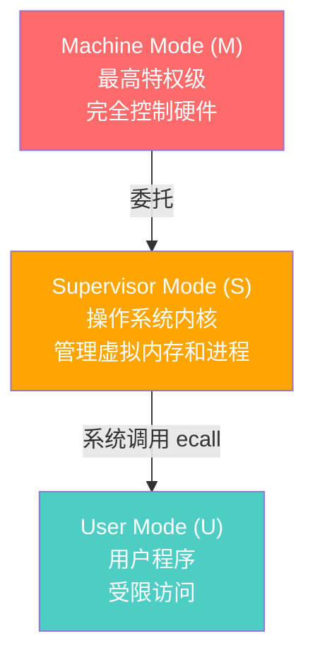
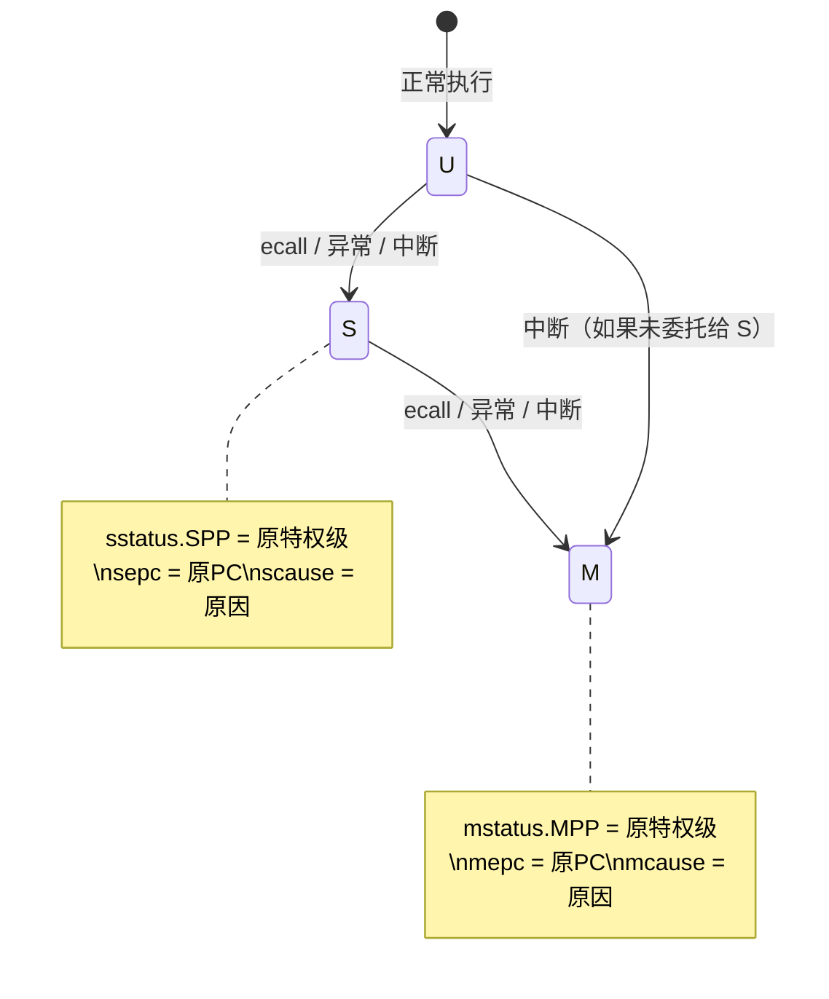
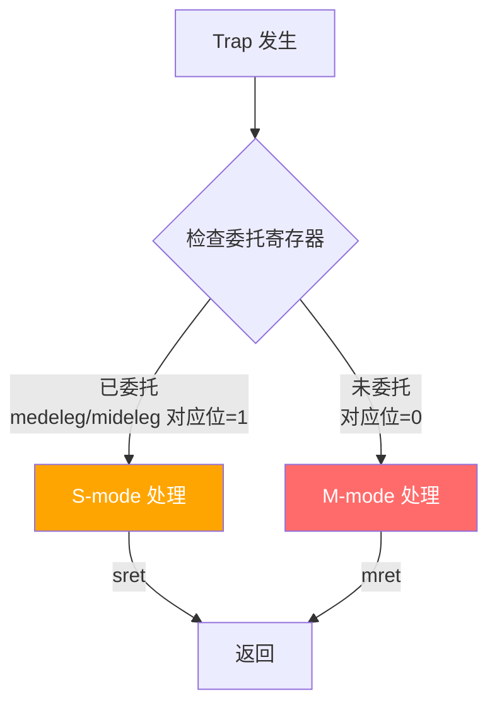
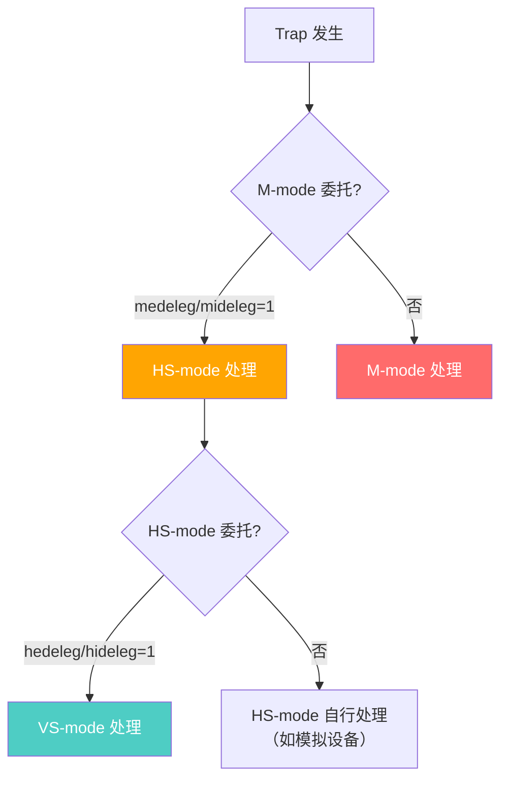

# 特权模式与 CSR

> 特权架构是操作系统运行的基础。理解 M/S/U 三级特权模式和 CSR 寄存器，是掌握 RISC-V 系统软件的关键。
>
> **工程师视角**：特权模式不仅是"权限分级"，更是故障隔离的最后一道防线。当用户态程序触发非法指令时，CPU 自动切换到 S-mode 处理；当 S-mode 遇到无法处理的异常时，M-mode 的固件接管。理解这个"升级"流程，是调试"神秘重启"和"权限违规"问题的关键。

### 前置知识

| 需要了解 | 参考文档 |
|----------|----------|
| RISC-V 指令集基础（RV32I/RV64I） | [RV32I/RV64I 指令集详解](../02-isa/rv32i-rv64i-instructions.md) |
| 32 个通用寄存器与 ABI 命名 | [汇编与 ABI](../05-system-software/assembly-and-abi.md) |

---

## 1. 特权级概览

RISC-V 定义了三级特权模式（加上 H 扩展共四级）：



| 特权级 | 编码 | 典型运行 | 权限 |
|--------|------|----------|------|
| **U (User)** | 00 | 用户态应用程序 | 只能访问 U 级 CSR，不能执行特权指令 |
| **S (Supervisor)** | 01 | 操作系统内核 | 可访问 S 级和 U 级 CSR，管理虚拟内存 |
| **M (Machine)** | 11 | 固件/BIOS (OpenSBI) | 完全控制硬件，可访问所有 CSR |
| **HS (Hypervisor)** | — | 虚拟机监控器 | H 扩展，管理虚拟机 |

### 类比理解

```
M-mode = 大楼管理员
  - 拥有所有钥匙，可以进入任何房间
  - 负责大楼的基础设施（电梯、电力、消防）
  - 处理最紧急的事件

HS-mode = 楼层管理员（Hypervisor）
  - 管理多个租户（虚拟机）
  - 可以分配和隔离房间（虚拟内存、设备）
  - 遇到处理不了的问题找大楼管理员

S-mode = 公司经理
  - 管理自己公司的办公室
  - 可以分配工位（虚拟内存）
  - 遇到处理不了的问题找管理员

VS-mode = 虚拟公司经理（Guest OS）
  - "以为"自己是真正的经理
  - 实际上只能看到分配给自己的空间
  - 请求需要经过楼层管理员审批

U-mode = 普通员工
  - 只能在自己的工位工作
  - 需要资源时向经理申请（系统调用）
  - 不能直接访问其他工位
```

> **服务器场景重点：** 在服务器虚拟化场景中，HS-mode 运行 Host Linux + KVM，VS-mode 运行 Guest OS，VU-mode 运行 Guest 用户态。理解 HS/VS/VU 的关系是掌握 RISC-V 服务器虚拟化的基础。详见 [虚拟化专题](./virtualization.md)。

---

## 2. CSR 寄存器地址编码

CSR 地址是 12 位（0x000 - 0xFFF），编码规则如下：

```
CSR 地址: [11:10] [9:8] [7:0]
           权限   类型   编号

权限位 [11:10]:
  00 - U 级可访问 (Unprivileged)
  01 - S 级可访问 (Supervisor)
  10 - HS 级可访问 (Hypervisor)
  11 - M 级可访问 (Machine)

读写位 [9:8]:
  00 - 读/写
  01 - 读/写
  10 - 只读
  11 - 只读
```

| 地址范围 | 权限 | 类型 | 举例 |
|----------|------|------|------|
| 0x000-0x0FF | U 级 | 读/写 | fflags, frm, fcsr |
| 0x100-0x1FF | S 级 | 读/写 | sstatus, sepc, stvec |
| 0x200-0x2FF | VS 级 / S 级只读 | 读/写 | vsstatus, vsepc, vstvec |
| 0x300-0x3FF | M 级 | 读/写 | mstatus, mepc, mtvec |
| 0x400-0x4FF | M 级 | 只读 | mvendorid, marchid, mimpid, mhartid |
| 0x500-0x5FF | M 级 | 只读 | mhpmcounter3-31 等 |
| 0x600-0x6FF | HS 级 | 读/写 | hstatus, hgatp, hideleg, hie |

> **H 扩展 CSR：** 地址 0x600-0x6FF 的 CSR 属于 Hypervisor（HS 级），如 hstatus、hgatp 等。VS-mode 的 CSR 位于 0x200-0x2FF（如 vsstatus=0x200, vsepc=0x241），与 S-mode CSR 地址不同但功能对称。详见 [虚拟化专题](./virtualization.md)。

> **访问规则：** 低特权级不能访问高特权级的 CSR，否则触发非法指令异常。高特权级可以访问低特权级的 CSR。

---

## 3. CSR 指令

| 指令 | 功能 | 等价伪代码 |
|------|------|-----------|
| `CSRR rd, csr` | 读 CSR | rd = CSR[csr] |
| `CSRW csr, rs` | 写 CSR | CSR[csr] = rs |
| `CSRRW rd, csr, rs` | 原子读-写 | t = CSR[csr]; CSR[csr] = rs; rd = t |
| `CSRRS rd, csr, rs` | 原子读-置位 | t = CSR[csr]; CSR[csr] = t \| rs; rd = t |
| `CSRRC rd, csr, rs` | 原子读-清位 | t = CSR[csr]; CSR[csr] = t & ~rs; rd = t |
| `CSRRWI rd, csr, uimm` | 立即数版本读-写 | 同 CSRRW，rs 替换为 uimm[4:0] |
| `CSRRSI rd, csr, uimm` | 立即数版本读-置位 | 同 CSRRS，rs 替换为 uimm[4:0] |
| `CSRRCI rd, csr, uimm` | 立即数版本读-清位 | 同 CSRRC，rs 替换为 uimm[4:0] |

```asm
# 常用写法
csrr  t0, mstatus        # 读取 mstatus
csrw  mstatus, t0        # 写入 mstatus

# 只修改特定位（推荐，避免破坏其他位）
csrr  t0, mstatus
ori   t0, t0, 0x8        # 设置 bit 3
csrw  mstatus, t0

# 更好的写法：原子读-置位
li    t0, 0x8
csrrs t1, mstatus, t0    # 原子地设置 bit 3，t1 = 旧值
```

---

## 4. M-mode 核心 CSR 详解

### 4.1 mstatus — 机器状态寄存器

mstatus 是最重要的 CSR，控制 CPU 的全局状态：

```
RV64 mstatus 布局（关键位）:

 63       40 39  38  37  36  35  34  33  32 31  23  22  21  20  19  18  17  16  15   8   7   6   5   4   3   2   1   0
┌───────────┬─────┬─────┬─────┬─────┬─────┬─────┬───────┬───────┬─────┬─────┬─────┬─────┬─────┬─────┬─────┬─────┬─────┬─────┐
│  SD  ...  │ SXL │ UXL │ SBE │ MBE │  ... │ MPRV │  ...  │  MPP  │ SPP │ MPIE│  ... │ SPIE│ UPIE│ MIE │  ... │ SIE │ UIE │
└───────────┴─────┴─────┴─────┴─────┴─────┴─────┴───────┴───────┴─────┴─────┴─────┴─────┴─────┴─────┴─────┴─────┴─────┴─────┘
```

| 位域 | 名称 | 说明 |
|------|------|------|
| **MIE** [3] | M-mode 中断使能 | 1=允许 M 级中断 |
| **SIE** [1] | S-mode 中断使能 | 1=允许 S 级中断 |
| **MPIE** [7] | M-mode 中断使能保存 | trap 前的 MIE 值 |
| **SPIE** [5] | S-mode 中断使能保存 | trap 前的 SIE 值 |
| **MPP** [12:11] | M-mode 特权级保存 | trap 前的特权级（00=U, 01=S, 11=M） |
| **SPP** [8] | S-mode 特权级保存 | trap 前的特权级（0=U, 1=S） |
| **MPRV** [17] | 内存特权 | 1=load/store 使用 MPP 指定的特权级 |
| **SXL** [35:34] | S-mode XLEN | RV64=10, RV32=01 |
| **UXL** [33:32] | U-mode XLEN | RV64=10, RV32=01 |

> **MIE/SIE 的嵌套机制：** 进入 trap 时，当前中断使能位保存到 MPIE/SPIE，然后 MIE/SIE 被清零（禁止中断）。执行 mret/sret 时，从 MPIE/SPIE 恢复。

### 4.2 mtvec — 机器陷阱向量

```
mtvec 布局:

  XLEN-1          6 5        2 1     0
┌───────────────────┬──────────┬───────┐
│     BASE          │   ...    │ MODE  │
└───────────────────┴──────────┴───────┘

MODE:
  00 = Direct:    所有异常跳转到 BASE
  01 = Vectored:  中断跳转到 BASE + 4×cause，异常跳转到 BASE
```

| 模式 | 异常处理 | 中断处理 |
|------|----------|----------|
| **Direct** | 跳转到 BASE | 跳转到 BASE（同一入口） |
| **Vectored** | 跳转到 BASE | 跳转到 BASE + 4×cause（不同中断不同入口） |

### 4.3 mepc — 机器异常 PC

- 保存触发 trap 的指令地址
- 对于中断：指向被中断的指令
- 对于异常：指向触发异常的指令
- mret 时 PC ← mepc

> **注意：** 如果异常指令是 ecall/ebreak，mepc 指向该指令本身。软件需要在返回前手动将 mepc 加 4，否则会无限循环。

### 4.4 mcause — 机器异常原因

```
mcause 布局:

  XLEN-1                    0
┌─────────────────────────────┐
│ Interrupt |   Exception Code │
└─────────────────────────────┘
```

| Interrupt 位 | 含义 |
|-------------|------|
| 1 | 中断（异步） |
| 0 | 异常（同步） |

**M-mode 异常码：**

| Code | Interrupt | 描述 |
|------|-----------|------|
| 0 | 0 | 指令地址不对齐 |
| 1 | 0 | 指令访问异常 |
| 2 | 0 | 非法指令 |
| 3 | 0 | 断点（ebreak） |
| 4 | 0 | 加载地址不对齐 |
| 5 | 0 | 加载访问异常 |
| 6 | 0 | 存储/AMO 地址不对齐 |
| 7 | 0 | 存储/AMO 访问异常 |
| 8 | 0 | U-mode ecall |
| 9 | 0 | S-mode ecall |
| 11 | 0 | M-mode ecall |
| 12 | 0 | 指令页错误 |
| 13 | 0 | 加载页错误 |
| 15 | 0 | 存储/AMO 页错误 |
| 3 | 1 | M-mode 软件中断 |
| 7 | 1 | M-mode 定时器中断 |
| 11 | 1 | M-mode 外部中断 |

### 4.5 mie / mip — 中断使能 / 中断等待

```
mie / mip 布局（关键位）:

  11    9    8    7    5    4    3    1
┌─────┬────┬────┬────┬────┬────┬────┬────┐
│ MEIE│ SEIE│  - │ MTIE│ STIE│  - │ MSIE│ SSIE│
└─────┴────┴────┴────┴────┴────┴────┴────┘

  MEIE = M-mode External Interrupt Enable
  MTIE = M-mode Timer Interrupt Enable
  MSIE = M-mode Software Interrupt Enable
  SEIE = S-mode External Interrupt Enable
  STIE = S-mode Timer Interrupt Enable
  SSIE = S-mode Software Interrupt Enable
```

> **中断触发的三要素：** 中断真正触发需要同时满足三个条件：
> 1. `mip` 对应位 = 1（中断信号存在）
> 2. `mie` 对应位 = 1（中断被使能）
> 3. `mstatus.MIE` = 1（全局中断使能）

### 4.6 mscratch — 机器暂存寄存器

没有特定功能，供 trap 处理程序使用。典型用途：

```asm
# 在 trap 入口保存当前 sp，用 mscratch 作为 trap 上下文的 sp
csrrw  sp, mscratch, sp    # 交换 sp 和 mscratch
# 现在 sp 指向 trap 栈，mscratch 保存了原来的 sp
```

### 4.7 mtval — 机器陷阱值

提供异常的附加信息：

| 异常类型 | mtval 值 |
|----------|----------|
| 地址不对齐/访问异常 | 出错的地址 |
| 非法指令 | 出错的指令编码 |
| 页错误 | 出错的地址 |
| 其他 | 0（或实现自定义） |

---

## 5. S-mode 核心 CSR 详解

S-mode 的 CSR 与 M-mode 大致对称，前缀从 `m` 改为 `s`：

| M-mode CSR | S-mode CSR | 说明 |
|------------|------------|------|
| mstatus | sstatus | M-mode 的子集，只能访问 S/U 相关位 |
| mtvec | stvec | S-mode trap 向量 |
| mepc | sepc | S-mode 异常 PC |
| mcause | scause | S-mode 异常原因 |
| mie | sie | S-mode 中断使能 |
| mip | sip | S-mode 中断等待 |
| mscratch | sscratch | S-mode 暂存 |
| mtval | stval | S-mode 陷阱值 |
| — | **satp** | S-mode 地址翻译与保护（页表基址） |

### sstatus 与 mstatus 的关系

sstatus 是 mstatus 的一个"窗口"，只能看到 S/U 相关的位：

```
sstatus 可见的位:
  SPP, SPIE, UPIE, SIE, UIE, SUM, MXR, UXL, SD

sstatus 不可见的位（只能 M-mode 访问）:
  MPP, MPIE, MIE, MPRV, SXL, MBE, SBE, ...
```

### satp — 地址翻译与保护

satp 是 S-mode 最重要的 CSR 之一，控制虚拟内存：

```
satp 布局（RV64）:

 63   60 59           44 43                            0
┌───────┬───────────────┬───────────────────────────────┐
│ MODE  │     ASID      │           PPN                 │
└───────┴───────────────┴───────────────────────────────┘

MODE:
  0000 = 裸模式（不使用虚拟内存）
  1000 = Sv39（39 位虚拟地址，3 级页表）
  1001 = Sv48（48 位虚拟地址，4 级页表）
  1010 = Sv57（57 位虚拟地址，5 级页表）

ASID: 地址空间标识符（16 位），用于 TLB 标记
PPN:  页表根节点的物理页号
```

> **satp 写入后不会立即生效！** 需要执行 `sfence.vma` 指令来刷新 TLB。

---

## 6. 特权级切换

### 6.1 特权级提升（trap 进入）



**trap 发生时硬件自动完成：**

1. 将当前特权级保存到 `MPP`/`SPP`
2. 将当前 PC 保存到 `mepc`/`sepc`
3. 将当前中断使能保存到 `MPIE`/`SPIE`
4. 清除 `MIE`/`SIE`（禁止中断）
5. 设置 `mcause`/`scause`
6. 设置 `mtval`/`stval`
7. PC ← `mtvec`/`stvec`

### 6.2 特权级返回（mret / sret）

**mret / sret 硬件自动完成：**

1. PC ← `mepc`/`sepc`
2. 特权级 ← `MPP`/`SPP`
3. 中断使能 ← `MPIE`/`SPIE`
4. `MPP`/`SPP` 设置为最低特权级（U）
5. `MPIE`/`SPIE` 设置为 1

```asm
# M-mode trap 处理程序模板
trap_entry:
    csrrw  sp, mscratch, sp    # 切换到 trap 栈
    addi   sp, sp, -128
    sw     ra, 0(sp)
    sw     t0, 4(sp)
    # ... 保存更多寄存器

    csrr   t0, mcause          # 读取异常原因
    bgez   t0, exception_handler  # bit 31 = 0 → 异常
    # 处理中断...

exception_handler:
    # 处理异常...

trap_exit:
    lw     ra, 0(sp)
    lw     t0, 4(sp)
    # ... 恢复更多寄存器
    addi   sp, sp, 128
    csrrw  sp, mscratch, sp    # 恢复原始 sp
    mret                      # 返回
```

---

## 7. 委托机制（Delegation）

默认情况下，所有 trap 都在 M-mode 处理。RISC-V 允许将部分 trap 委托给 S-mode 处理，减少 M-mode 的负担。

### 委托寄存器

| 寄存器 | 功能 |
|--------|------|
| `medeleg` | 异常委托（M → S） |
| `mideleg` | 中断委托（M → S） |

```
medeleg / mideleg 布局:
  每一位对应一个异常/中断码
  bit = 1 表示委托给 S-mode
  bit = 0 表示由 M-mode 处理

mideleg 示例:
  bit 1  = 1 → S-mode 软件中断委托给 S
  bit 5  = 1 → S-mode 定时器中断委托给 S
  bit 9  = 1 → S-mode 外部中断委托给 S
```



### 典型委托配置

```asm
# OpenSBI 的典型委托设置
# 将大部分异常和中断委托给 S-mode（Linux）

li      t0, (1 << 8) | (1 << 9)  # ecall from U/S
csrw    medeleg, t0

li      t0, 0x222    # SSIE, STIE, SEIE 委托
csrw    mideleg, t0
```

> **安全提示：** M-mode ecall（code=11）通常不委托，因为 M-mode 需要保留对固件服务的控制权。

### H 扩展的二级委托

在虚拟化场景中，存在两级委托链：



| 委托级别 | 寄存器 | 方向 | 说明 |
|----------|--------|------|------|
| M → HS | `medeleg` / `mideleg` | M 委托给 HS | 与 M→S 相同，HS 就是 S-mode 的扩展 |
| HS → VS | `hedeleg` / `hideleg` | HS 委托给 VS | Hypervisor 将部分异常/中断直接交给 Guest |

> **注意：** VS-mode 不能处理所有异常。例如 I/O 访问、第二阶段页错误等必须由 HS-mode 处理（模拟设备或分配物理页），这些异常不应委托给 VS-mode。

---

## 8. Debug Mode（调试模式）

RISC-V 定义了一个独立于 M/S/U 的 **Debug Mode**（调试模式），用于 JTAG 调试器控制处理器：

| 特性 | 说明 |
|------|------|
| 特权级 | 独立于 M/S/U，高于 M-mode |
| 进入方式 | 通过 JTAG 接口触发，或执行 `ebreak`（当 `dcsr.ebreakm=1` 时） |
| 核心寄存器 | `dcsr`（调试状态）、`dpc`（调试 PC）、`dscratch0/1`（调试暂存） |
| 能力 | 单步执行、硬件断点、观察点、读写任意 CSR 和内存 |

```
特权级关系：

  Debug Mode > M-mode > HS-mode > VS-mode > VU-mode > U-mode

  调试器通过 JTAG 可以：
    1. 暂停/恢复任意 hart
    2. 读写 GPR 和 CSR
    3. 设置硬件断点（地址/数据观察点）
    4. 单步执行
    5. 强制 hart 进入/退出复位状态
```

> **Bring-up 场景：** 在芯片 bring-up 阶段，串口可能还未就绪，JTAG + Debug Mode 是唯一的调试手段。OpenOCD 是常用的开源 JTAG 调试服务器，配合 GDB 可实现源码级调试。

---

## 小结

| 要点 | 说明 |
|------|------|
| 三级特权 | M（固件）> S（内核）> U（应用） |
| CSR 地址编码 | 高 2 位表示权限，硬件自动检查 |
| mstatus 是核心 | 控制中断使能、特权级保存、内存特权 |
| trap 处理流程 | 硬件保存现场 → 跳转处理 → mret/sret 恢复 |
| 委托机制 | 允许 M-mode 将 trap 转发给 S-mode 处理 |
| satp 控制虚拟内存 | MODE + ASID + PPN 三要素 |

---

## 参考资料

- [RISC-V Privileged Architecture Spec v1.12](https://github.com/riscv/riscv-isa-manual/releases/tag/Priv-v1.12) — 特权架构权威文档
- [RISC-V S-Mode Spec v1.12](https://github.com/riscv/riscv-isa-manual/releases/tag/Priv-v1.12) — S 模式 CSR 与 ecall 定义
- [RISC-V Debug Spec v1.0](https://github.com/riscv/riscv-debug-spec/releases/tag/1.0.0-STABLE) — D-mode 调试模式规范

---

→ 下一节：[中断与异常](./interrupts-and-exceptions.md)
