# 虚拟化：H 扩展与 KVM

> 虚拟化是 RISC-V 走向服务器的关键能力。H 扩展为 RISC-V 提供了硬件辅助虚拟化支持，使 KVM 等虚拟机监控器能够高效运行 Guest OS。
>
> **工程师视角**：虚拟化不是"在 CPU 上跑多个 OS"那么简单。在数据中心，虚拟化的开销直接转化为电费。两阶段地址翻译的 TLB 命中率、VM exit 的延迟、中断注入的效率，每一个指标都影响商业竞争力。RISC-V 的 H 扩展设计吸取了 x86/ARM 的经验，但实现质量取决于具体核心——这是系统软件工程师可以发挥巨大价值的领域。

### 学习目标

读完本文后，你将能够：

- **区分** H 扩展引入的四个新模式（HS/VS/VU）与传统 M/S/U 的关系
- **解释** 两阶段地址翻译：为什么 Guest OS "以为"自己在管理物理内存，实际由 Hypervisor 控制
- **理解** vsatp 与 hgatp 的分工：第一阶段（GVA→GPA）由 Guest 管理，第二阶段（GPA→HPA）由 Host 管理
- **描述** hvip 如何实现虚拟中断注入：Hypervisor 写 hvip → Guest 看到 vsip
- **说明** KVM on RISC-V 的架构：用户态 QEMU 通过 /dev/kvm 的 ioctl 驱动内核态 KVM
- **了解** IOMMU 和 AIA/IMSIC 如何解决设备直通和中断虚拟化的性能问题

### 前置知识

| 需要了解 | 参考文档 |
|----------|----------|
| H 模式 CSR (hstatus/hedeleg/hgatp 等) | [特权模式与 CSR](./privileged-modes-and-csr.md) |
| 两阶段地址翻译 (VS-stage + G-stage) | [内存管理](./memory-management.md) |
| Trap 处理流程 (cause/val/delegation) | [中断与异常](./interrupts-and-exceptions.md) |

---

## 1. 为什么需要虚拟化？

| 场景 | 需求 | 价值 |
|------|------|------|
| **云服务器** | 多租户隔离 | 每个用户运行独立 OS |
| **开发测试** | 快速环境搭建 | 一台物理机跑多个 Guest |
| **安全隔离** | TEE / 安全分区 | 敏感工作负载隔离 |
| **遗留兼容** | 运行不同 OS | Linux + RTOS 共存 |
| **容器替代** | 更强隔离 | VM 比 Container 隔离性更强 |

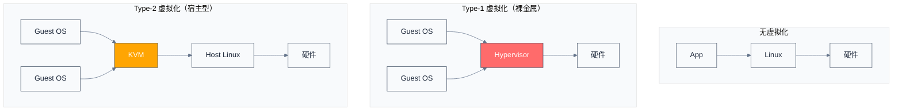

---

## 2. H 扩展：硬件辅助虚拟化

### 2.1 特权级扩展

H 扩展在原有 M/S/U 三级特权上增加了虚拟化支持，形成两级地址空间：

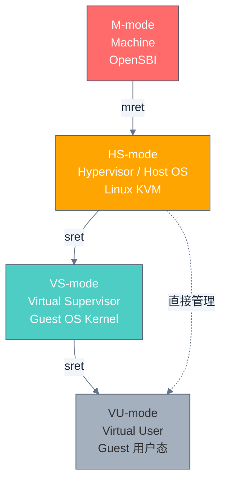

| 特权级 | 编码 | 运行内容 | 关键能力 |
|--------|------|----------|----------|
| **M** | 11 | OpenSBI | 完全硬件控制 |
| **HS** | 01 | Hypervisor / Host Linux | 管理 Guest、两阶段翻译 |
| **VS** | 01 | Guest OS 内核 | 与 S-mode 相同视角，但受限 |
| **VU** | 00 | Guest 用户程序 | 与 U-mode 相同视角 |

> **关键理解：** VS-mode 和 S-mode 的编码相同（01），通过 `mstatus.VS` 字段区分当前是否在虚拟化模式下运行。Guest OS "以为"自己在 S-mode，实际上是 VS-mode。

### 2.2 两阶段地址翻译

虚拟化的核心挑战是：Guest OS 使用的是 Guest 虚拟地址（GVA），需要翻译成 Host 物理地址（HPA），这需要两阶段翻译：


| 阶段 | 控制寄存器 | 输入 | 输出 | 由谁管理 |
|------|-----------|------|------|----------|
| **第一阶段** | `vsatp` | GVA | GPA | Guest OS（VS-mode） |
| **第二阶段** | `hgatp` | GPA | HPA | Hypervisor（HS-mode） |

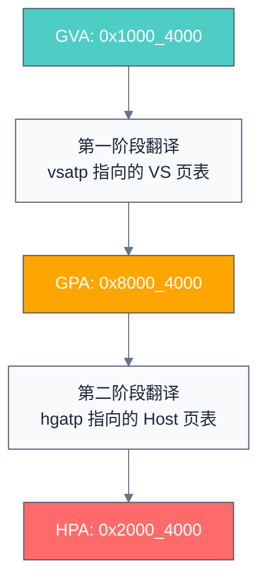

> **与 ARM/x86 对比：**
> - ARM: 两阶段翻译称为 Stage-1 / Stage-2，由 VTTBR_EL2 控制
> - x86: 使用 EPT（Extended Page Table），由 VMCS 中的 EPTP 控制
> - RISC-V: 使用 vsatp + hgatp，概念一致但命名更清晰

### 2.3 H 扩展核心 CSR

H 扩展新增了大量 CSR，分为几类：

#### 虚拟化控制类

| CSR | 地址 | 功能 |
|-----|------|------|
| **hstatus** | 0x600 | Hypervisor 状态寄存器 |
| **hedeleg** | 0x602 | Hypervisor 异常委托 |
| **hideleg** | 0x603 | Hypervisor 中断委托 |
| **hie** | 0x604 | Hypervisor 中断使能 |
| **hip** | 0x644 | Hypervisor 中断挂起 |
| **hvip** | 0x645 | Hypervisor 虚拟中断挂起 |
| **hgeip** | 0xE12 | Hypervisor Guest 外部中断挂起 |
| **hgeie** | 0x607 | Hypervisor Guest 外部中断使能 |

#### 地址翻译类

| CSR | 地址 | 功能 |
|-----|------|------|
| **hgatp** | 0x680 | Guest 地址翻译控制（第二阶段页表基址） |
| **vsatp** | 0x280 | VS-mode 地址翻译控制（第一阶段页表基址） |

#### VS-mode 上下文类

| CSR | 地址 | 功能 |
|-----|------|------|
| **vsstatus** | 0x200 | VS-mode 状态 |
| **vsie** | 0x204 | VS-mode 中断使能 |
| **vstvec** | 0x205 | VS-mode trap 向量 |
| **vsscratch** | 0x240 | VS-mode scratch |
| **vsepc** | 0x241 | VS-mode 异常 PC |
| **vscause** | 0x242 | VS-mode 异常原因 |
| **vstval** | 0x243 | VS-mode trap 值 |
| **vsip** | 0x244 | VS-mode 中断挂起 |

#### 指令缓存 / TLB 管理

| CSR | 地址 | 功能 |
|-----|------|------|
| **hfence.vvma** | — | 刷新 VS-mode 的 VLPT（Guest 虚拟 → Guest 物理） |
| **hfence.gvma** | — | 刷新第二阶段 TLB（Guest 物理 → Host 物理） |

### 2.4 hstatus 关键位域

```
hstatus 关键位域 (RV64):

 63    34 33  32 31  30  29  28  27  26  25  24  23  22  21  20  9   8   7   6   5   4   3   2   1   0
┌────────┬──────┬─────┬─────┬─────┬─────┬─────┬─────┬─────┬─────┬─────┬─────┬───┬───┬───┬───┬───┬───┬───┐
│  ...   │ VSXL │ VTSR│ VTW │ VTVM│ VGEIN│  ... │ SPVP│ SPV │  ... │VSBE│  ... │FD │  ... │   ...   │
└────────┴──────┴─────┴─────┴─────┴─────┴─────┴─────┴─────┴─────┴─────┴─────┴───┴───┴───┴───┴───┴───┴───┘
```

| 位域 | 名称 | 说明 |
|------|------|------|
| **SPV** [7] | Supervisor Previous Virtual | trap 前是否在 VS-mode |
| **SPVP** [8] | Supervisor Previous Virtual Privilege | trap 前的 VS-mode 特权级（0=VU, 1=VS） |
| **VGEIN** [17:12] | Virtual Guest External Interrupt Number | 当前注入的外部中断号 |
| **VSXL** [33:32] | VS-mode XLEN | RV64=10 |
| **VTW** [30] | Virtual Timer Wait | 是否允许 VS-mode 执行 WFI |
| **VTSR** [29] | Virtual Trap SRET | 是否允许 VS-mode 执行 SRET |

> **本节要点：** H 扩展的核心是"让 Guest OS 以为自己拥有整个机器，但实际上一切都在 Hypervisor 的监控之下"。两阶段地址翻译是实现这一幻觉的基础机制：Guest 管理自己的 vsatp 页表（GVA→GPA），但 GPA 并不是真正的物理地址——hgatp 页表在"最后一公里"将 GPA 重新映射到 HPA。hstatus.SPV 位是判断当前是否在虚拟化上下文中的关键标志——VM Exit 时硬件自动设置此位，Hypervisor 通过它区分来自 Guest 还是 Host 的 trap。

---

### 2.5 hgatp：第二阶段页表控制

```
hgatp 布局 (RV64):

 63    60 59      44 43             0
┌─────────┬──────────┬───────────────┐
│  MODE   │   VMID   │     PPN       │
│  [4 bit]│ [16 bit] │   [44 bit]    │
└─────────┴──────────┴───────────────┘

MODE:
  0000 = Bare（不启用第二阶段翻译）
  1000 = Sv39x4（41 位 GPA，3 级页表，根页表 1024 项 × 16 字节）
  1001 = Sv48x4（50 位 GPA，4 级页表，根页表 1024 项 × 16 字节）
  1010 = Sv57x4（59 位 GPA，5 级页表，根页表 1024 项 × 16 字节）

VMID: 虚拟机 ID，用于 TLB 标记，避免 VM 切换时刷新全部 TLB（字段宽度 16 位，有效位数由实现决定，QEMU RV64 实现为 14 位）
PPN:  第二阶段页表的根物理页号
```

| 模式 | GPA 宽度 | 页表级数 | 最大 Guest 物理地址空间 |
|------|----------|----------|----------------------|
| **Sv39x4** | 41 bit | 3（根页表 1024 项） | 2 TB |
| **Sv48x4** | 50 bit | 4（根页表 1024 项） | 1 PB |
| **Sv57x4** | 59 bit | 5（根页表 1024 项） | 512 PB |

> **为什么叫 x4？** x4 变体与原版页表级数相同，但根页表从 512 项扩展为 1024 项，且每条 PTE 从 8 字节扩展为 16 字节（共占 16 KiB），从而在 VPN 结构上多使用 1 位地址作为根页表索引。此外，阶段二 PTE 的 PPN 字段比阶段一宽 1 位，因此总 GPA 宽度比对应 VA 宽度多 2 位。例如 Sv39 使用 39 位地址，Sv39x4 使用 41 位 GPA，GPA 空间从 512 GB 扩展到 2 TB。

---

## 3. 虚拟中断注入

虚拟化需要 Hypervisor 向 Guest 注入中断，H 扩展提供了硬件支持：

### 3.1 中断注入机制

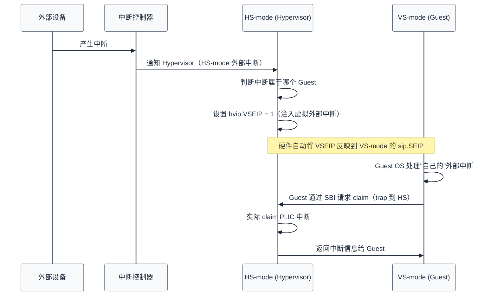

### 3.2 虚拟中断位映射

| Hypervisor 侧 | Guest 侧 | 含义 |
|---------------|-----------|------|
| `hvip.VSSIP` | `vsip.VSSIP` | Guest 软件中断 |
| `hvip.VSTIP` | `vsip.VSTIP` | Guest 定时器中断 |
| `hvip.VSEIP` | `vsip.VSEIP` | Guest 外部中断 |

> **注入方式：** Hypervisor 写 `hvip` 对应位即可注入虚拟中断。硬件自动将 `hvip` 的位反映到 VS-mode 的 `vsip`/`sip` 中，Guest OS 看到的行为与真实中断一致。

### 3.3 中断委托链

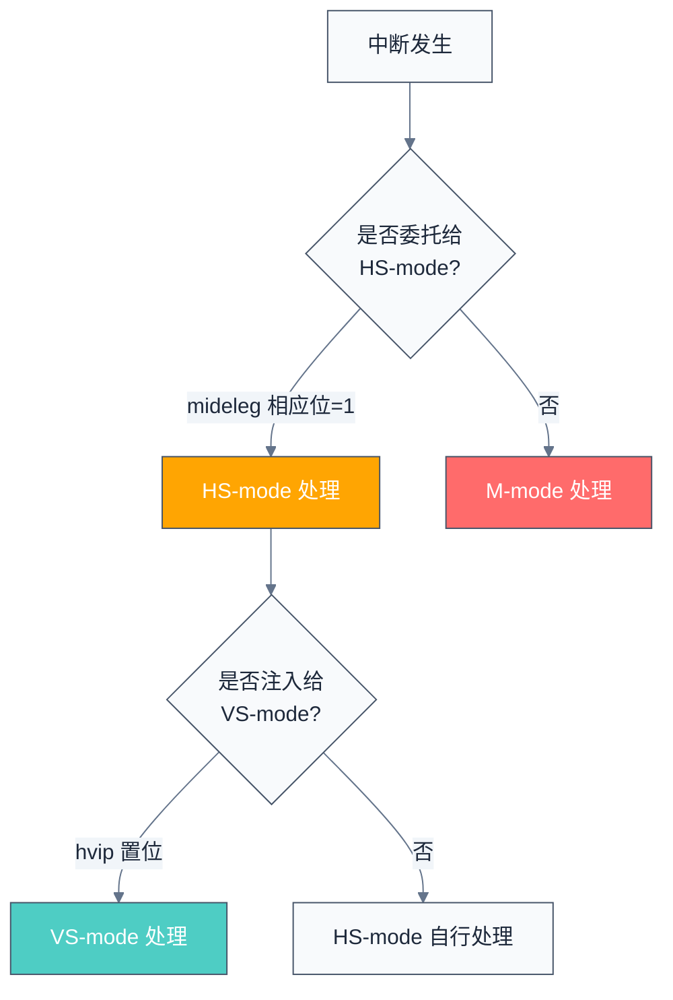

> **本节要点：** 虚拟中断注入的关键在于 hvip——Hypervisor 写入 hvip 后，硬件自动将其位反映到 VS-mode 的 vsip/sip 中。Guest OS 完全察觉不到这是"注入"的中断，行为与真实中断一致。中断委托链（M→HS→VS）需要 Hypervisor 精确判断哪些中断应该透传给 Guest、哪些需要自己处理。通常设备模拟中断需要 Hypervisor 介入（因为需要模拟设备寄存器），而 IPI 和定时器可以直接委托给 Guest。

---

## 4. VM 生命周期管理

### 4.1 VM 切换流程

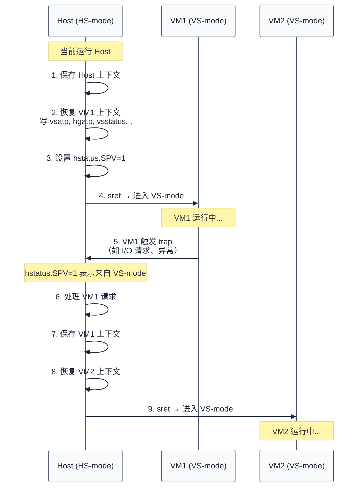

### 4.2 关键上下文保存/恢复

VM 切换时需要保存/恢复的 CSR：

| CSR | 保存 | 恢复 | 说明 |
|-----|------|------|------|
| `vsstatus` | ✅ | ✅ | Guest 状态 |
| `vsepc` | ✅ | ✅ | Guest 异常 PC |
| `vscause` | ✅ | ✅ | Guest 异常原因 |
| `vstval` | ✅ | ✅ | Guest trap 值 |
| `vstvec` | ✅ | ✅ | Guest trap 向量 |
| `vsatp` | ✅ | ✅ | Guest 页表基址 |
| `hgatp` | ✅ | ✅ | 第二阶段页表基址 |
| `hvip` | ✅ | ✅ | 虚拟中断注入状态 |
| `sstatus` | ✅ | ✅ | Host 状态 |
| `sepc` | ✅ | ✅ | Host 异常 PC |

> **本节要点：** VM 切换的本质是"换上下文"——保存当前 VM 的所有 CSR（vsstatus/vsepc/vsatp 等），恢复目标 VM 的上下文，然后通过 sret 进入 VS-mode。切换的开销主要体现在两个方面：一是 CSR 读写本身（约 10-20 个 CSR 需要保存/恢复），二是 TLB 刷新。VMID 的作用在这里体现——它为每个 VM 的 TLB 条目打上标签，使得 VM 切换时不需要全量刷新 TLB，只需按 VMID 精确刷新。

---

## 5. KVM on RISC-V

前面讨论的 VM 生命周期管理是理论模型。在 Linux 系统中，这个模型的具体实现就是 KVM——它将 H 扩展的硬件能力封装为标准的 Linux 接口，让 QEMU 等用户态 VMM 可以通过 `/dev/kvm` 创建和管理虚拟机。

### 5.1 架构概览

KVM 在 RISC-V 上的实现采用 Type-2 架构：

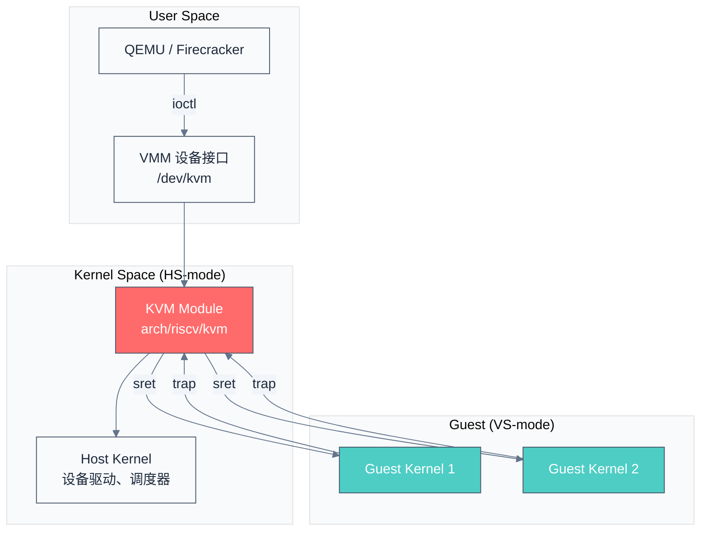

### 5.2 KVM 关键代码路径

```
arch/riscv/kvm/
├── main.c          # KVM 初始化、VM 创建
├── vm.c            # VM 生命周期管理
├── vcpu.c          # vCPU 创建、运行、切换
├── vcpu_switch.S   # 上下文切换汇编代码
├── mmu.c           # 第二阶段页表管理
├── tlb.c           # TLB 刷新 (hfence)
├── vcpu_exit.c     # VM Exit 处理分发
├── vcpu_insn.c     # 指令模拟
├── aia.c           # AIA 中断控制器虚拟化
└── nacl.c          # NACL (N-extension 加速)
```

### 5.3 VM Exit 原因

Guest 从 VS-mode 退出到 HS-mode 的常见原因：

| Exit 原因 | 触发条件 | 处理方式 |
|-----------|----------|----------|
| **ECALL** | Guest 执行 ecall | 模拟 SBI 调用 |
| **I/O 访问** | MMIO 读写 | 模拟设备或转发到 Host |
| **异常** | 缺页、非法指令等 | 反射给 Guest 或模拟 |
| **定时器** | Guest 定时器到期 | 切换到其他 vCPU |
| **外部中断** | 设备中断到达 Host | 注入给 Guest 或 Host 处理 |
| **WFI** | Guest 执行 WFI 等待 | 调度其他 vCPU |

### 5.4 SBI 转发

Guest OS 的 SBI 调用会被 KVM 拦截并处理：

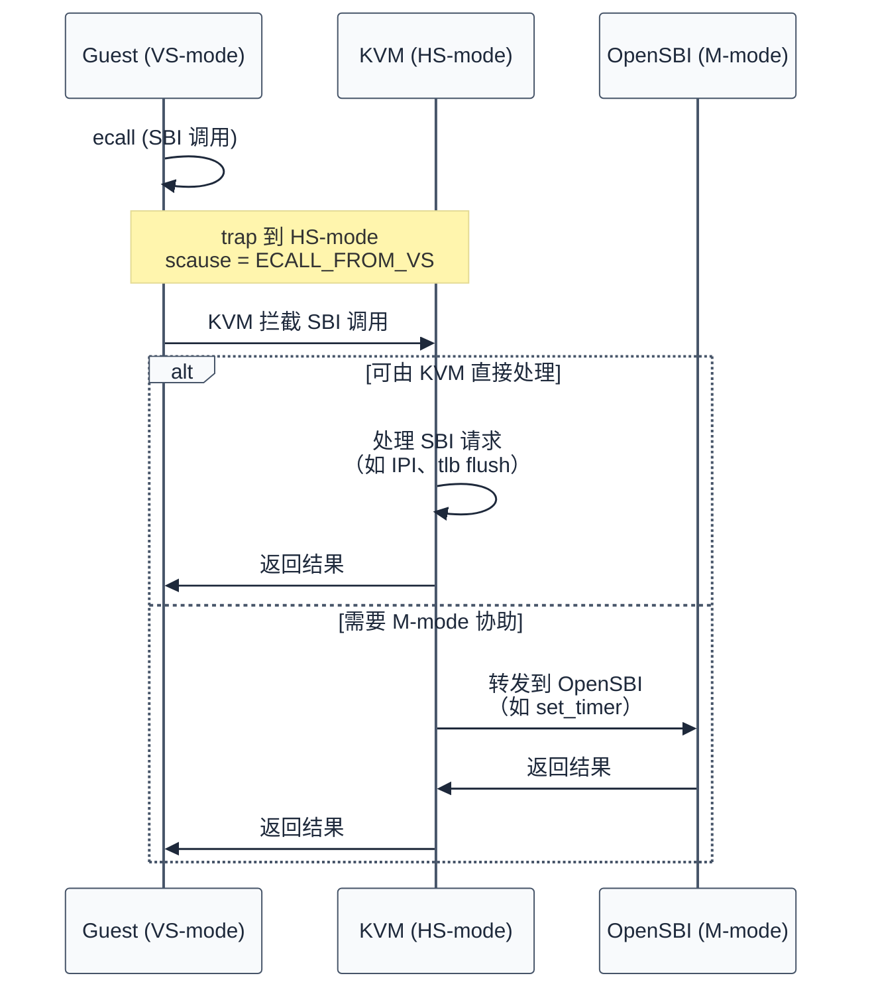

> **本节要点：** KVM on RISC-V 遵循 Linux 的 Type-2 虚拟化架构：用户态的 QEMU（或 Firecracker）通过 /dev/kvm 的 ioctl 接口创建 VM 和 vCPU，内核态的 KVM 模块通过 H 扩展的硬件能力执行实际的 VM 切换。Guest 的 SBI 调用被 KVM 拦截后分流处理：能在内核态完成的（IPI、TLB flush）直接处理，需要 M-mode 协助的（如关机、系统重置）转发给 OpenSBI。这个三段式结构（用户态 VMM → 内核态 KVM → 固件 OpenSBI）清晰分离了策略、机制和硬件访问。

---

## 6. IOMMU（RISC-V IOMMU）

KVM 负责 CPU 侧的虚拟化，但虚拟机的 I/O 安全同样重要——Guest 的 DMA 请求需要地址翻译和权限检查，防止恶意设备访问其他 VM 的内存。RISC-V IOMMU 就是为此而生的外设侧内存保护单元。

### 6.1 为什么需要 IOMMU？

| 问题 | IOMMU 的解决 |
|------|-------------|
| DMA 攻击 | 设备只能访问分配给它的内存 |
| 设备直通（Passthrough） | 安全地将设备直接分配给 Guest |
| Guest DMA 地址翻译 | 设备使用 GPA，IOMMU 翻译为 HPA |
| 设备隔离 | 不同设备访问不同地址空间 |

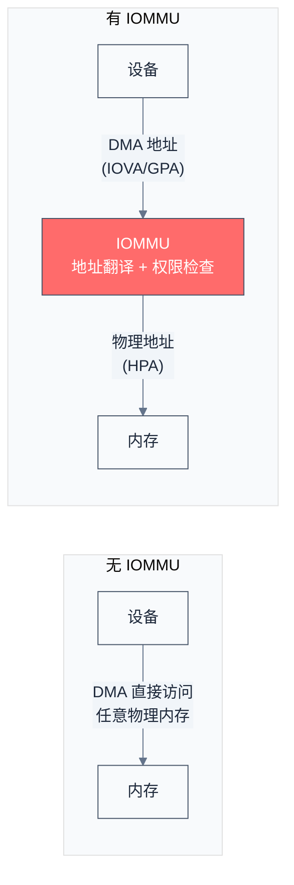

### 6.2 RISC-V IOMMU 规范

RISC-V IOMMU 规范于 2024 年批准，主要特性：

| 特性 | 说明 |
|------|------|
| **两阶段翻译** | 与 CPU 虚拟化一致，支持 IOVA→GPA→HPA |
| **ATS/PRI** | 支持 PCIe ATS（地址翻译缓存）和 PRI（页面请求） |
| **MSI 地址翻译** | 将设备 MSI 翻译到正确的中断控制器地址 |
| **多进程地址空间** | 每个设备可使用独立的地址空间（PASID） |
| **命令队列** | 通过内存中的命令队列管理 IOMMU |

### 6.3 IOMMU 与虚拟化协同

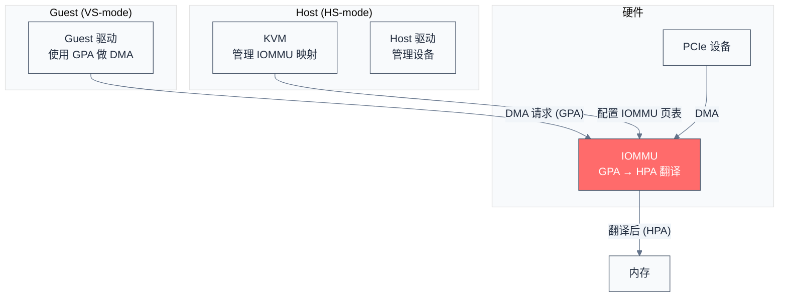

---

## 7. AIA（高级中断架构）与虚拟化

AIA（Advanced Interrupt Architecture）是 RISC-V 新一代中断架构，对虚拟化场景有重要改进：

### 7.1 AIA 对虚拟化的改进

| 特性 | PLIC（旧） | AIA（新） |
|------|-----------|----------|
| **中断注入** | 需要软件模拟 | 硬件直接注入（IMSIC） |
| **MSI 支持** | 有限 | 原生 MSI/MSI-X |
| **Per-CPU 中断** | 不支持 | IMSIC 每核独立 |
| **虚拟化开销** | 高（VM Exit 模拟） | 低（硬件虚拟化） |
| **中断优先级** | 全局优先级 | Per-CPU 优先级 |

### 7.2 IMSIC 虚拟化

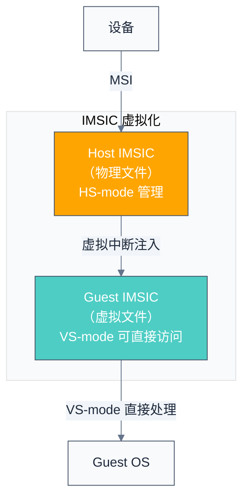

> **性能提升：** IMSIC 允许 Guest OS 直接处理中断，无需每次 VM Exit，大幅降低虚拟化开销。

---

## 8. 实战：QEMU 启动 RISC-V 虚拟机

### 8.1 环境准备

```bash
# 安装工具
sudo apt install qemu-system-riscv64

# 获取 OpenSBI + U-Boot + Linux
# 方法一：使用发行版预编译包
sudo apt install opensbi u-boot-qemu linux-image-riscv64

# 方法二：从源码编译（推荐学习）
git clone https://github.com/riscv-software-src/opensbi.git
git clone https://github.com/u-boot/u-boot.git
git clone https://github.com/torvalds/linux.git
```

### 8.2 启动带 H 扩展的 QEMU

```bash
# 启动 QEMU virt 平台（启用 H 扩展）
qemu-system-riscv64 \
    -machine virt \
    -cpu rv64,h=true \
    -smp 2 \
    -m 4G \
    -nographic \
    -bios /usr/lib/riscv64-linux-gnu/opensbi/generic/fw_dynamic.bin \
    -kernel /path/to/Image \
    -append "root=/dev/vda2 console=ttyS0" \
    -drive file=rootfs.ext4,format=raw,id=hd0 \
    -device virtio-blk-device,drive=hd0 \
    -netdev user,id=net0 \
    -device virtio-net-device,netdev=net0
```

### 8.3 在 Guest 中使用 KVM

```bash
# 在 Host Linux 中加载 KVM 模块
modprobe kvm

# 检查 KVM 是否可用
ls /dev/kvm
# 输出: /dev/kvm

# 使用 QEMU 启动嵌套虚拟机
qemu-system-riscv64 \
    -machine virt \
    -accel kvm \
    -cpu rv64 \
    -m 1G \
    -nographic \
    -kernel /path/to/guest/Image \
    -append "console=ttyS0" \
    -drive file=guest-rootfs.ext4,format=raw
```

### 8.4 验证 H 扩展支持

```bash
# 在 Linux 中检查 H 扩展
cat /proc/cpuinfo | grep "isa"
# 期望输出包含: rv64imafdc_h

# 检查 KVM 模块
lsmod | grep kvm
# kvm_riscv    xxxxx  0

# 查看 KVM 版本和能力
cat /sys/module/kvm/version
```

---

## 9. 虚拟化性能优化

QEMU 能让你快速验证功能，但生产环境中每一项 VM Exit 都直接转化为性能开销。以下优化技术是缩小虚拟化与裸机性能差距的关键。

### 9.1 常见优化技术

| 技术 | 原理 | 效果 |
|------|------|------|
| **大页映射** | 使用 2MB/1GB 超级页减少 TLB miss | 减少 TLB 压力 |
| **VMID** | TLB 标记虚拟机 ID，切换时不刷 TLB | 减少 TLB 刷新 |
| **直通设备** | 设备直接分配给 Guest | 减少 I/O VM Exit |
| **VirtIO** | 半虚拟化 I/O，减少陷出 | 降低 I/O 延迟 |
| **IMSIC** | 硬件虚拟化中断注入 | 减少中断 VM Exit |
| **NACL** | SBI 调用加速，减少陷出 | 减少 SBI 开销 |

### 9.2 两阶段翻译的 TLB 优化

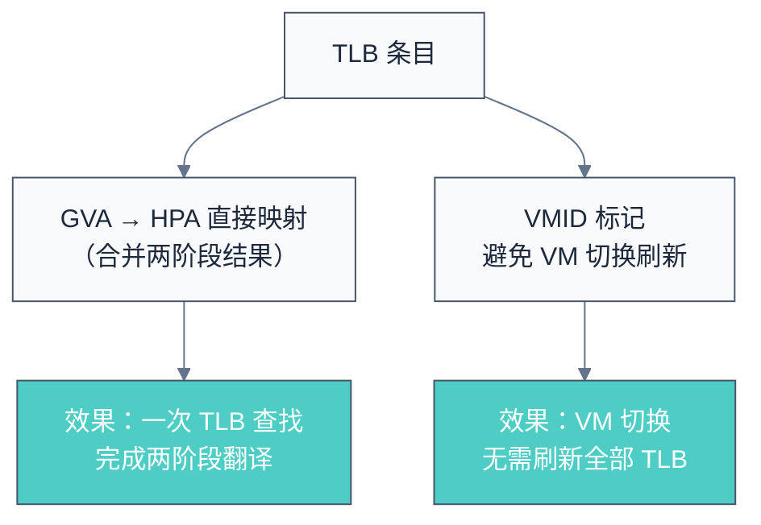

> **实际性能：** 两阶段翻译的额外开销通常在 5-15%，通过大页和 VMID 优化后可降至 2-5%。

---

## 10. 与 x86/ARM 虚拟化对比

| 特性 | RISC-V H 扩展 | Intel VT-x | ARM v8.1 VHE |
|------|--------------|------------|--------------|
| **虚拟化模式** | HS/VS/VU | Root/Non-Root | EL2/EL1/EL0 |
| **两阶段翻译** | vsatp + hgatp | EPT | Stage-1 + Stage-2 |
| **VM 切换指令** | sret | VMLAUNCH/VMRESUME | ERET |
| **中断注入** | hvip 位写入 | VMCS 字段 | HCR_EL2 位 |
| **IOMMU** | RISC-V IOMMU | VT-d | SMMU |
| **TLB 标记** | VMID (16-bit 字段，有效位数由实现决定) | VPID (16-bit) | VMID (8/16-bit) |
| **设计风格** | CSR 寄存器为主 | VMCS 结构体 | 系统寄存器 |

> **RISC-V 的优势：** H 扩展的设计更加简洁，通过 CSR 寄存器直接控制，没有 x86 VMCS 那样的复杂状态结构，实现更简单。

---

## 参考资料

- [RISC-V H-Extension Spec (Privileged spec 第 8 章)](https://github.com/riscv/riscv-isa-manual/releases/tag/Priv-v1.13) — H 扩展权威规范
- [RISC-V IOMMU Spec](https://github.com/riscv-non-isa/riscv-iommu) — RISC-V IOMMU 规范
- [RISC-V AIA Spec](https://github.com/riscv-non-isa/riscv-aia) — 高级中断架构（虚拟化中断注射依赖此标准）
- [KVM RISC-V 代码 (Linux 主线)](https://github.com/torvalds/linux/tree/master/arch/riscv/kvm) — KVM for RISC-V 的主线实现
- [QEMU RISC-V System Emulation](https://www.qemu.org/docs/master/system/target-riscv.html) — QEMU RISC-V 虚拟化支持文档
- [SBI HSM Extension v3.0](https://github.com/riscv-non-isa/riscv-sbi-doc/releases/tag/v3.0) — Hart State Management 的 SBI 调用

---
→ 下一节：[流水线基础](../04-microarchitecture/pipeline-basics.md)
→ 实验：[Lab 4 — H 扩展两阶段 MMU](../08-labs/lab04-h-extension-two-stage-mmu.md)
