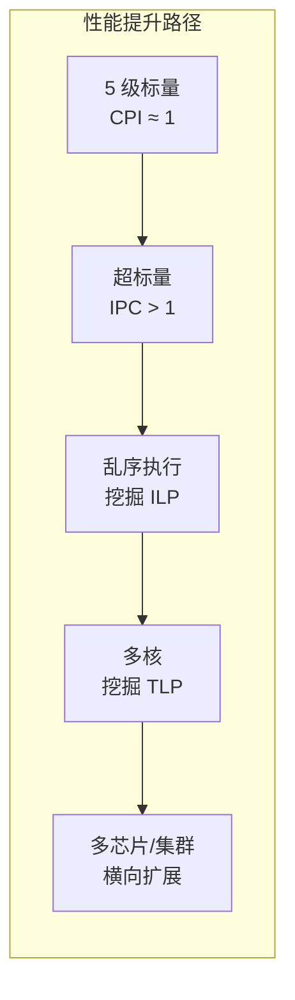
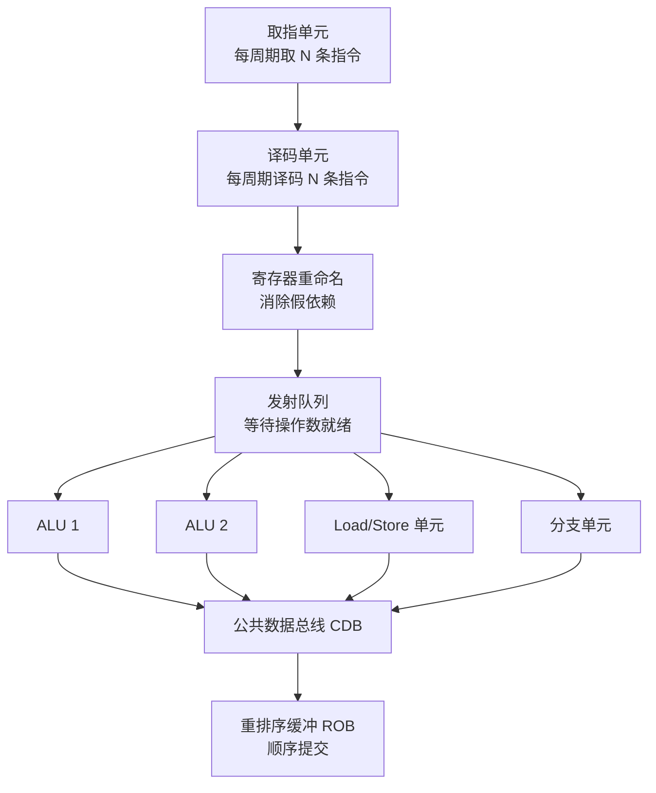
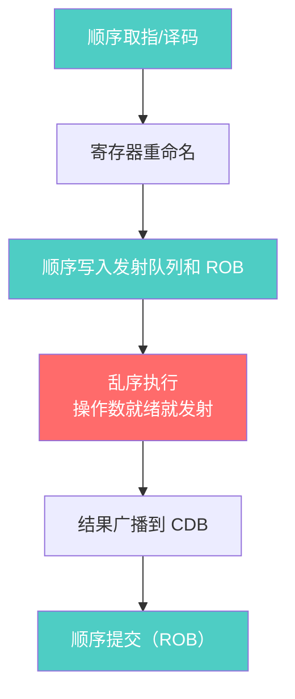
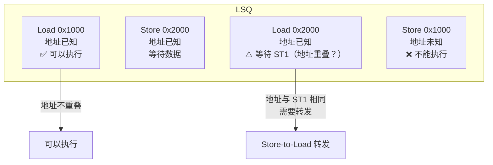
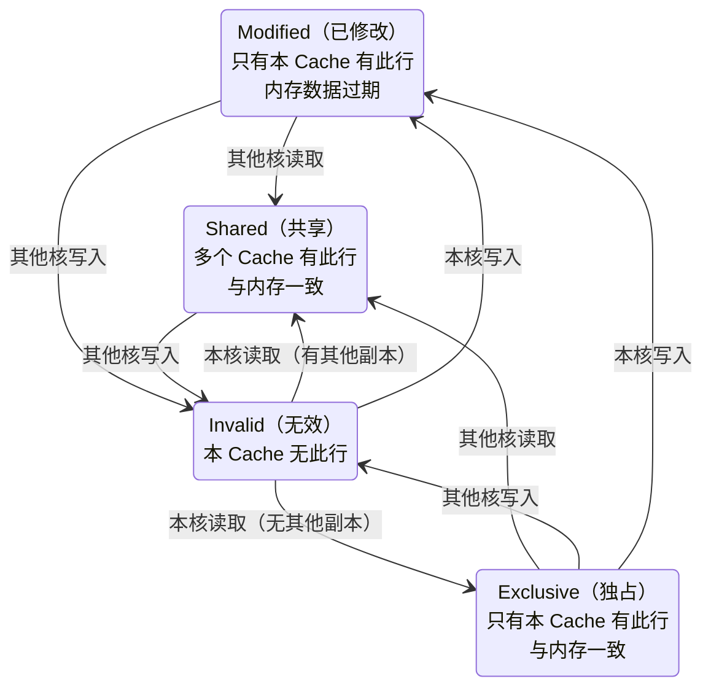
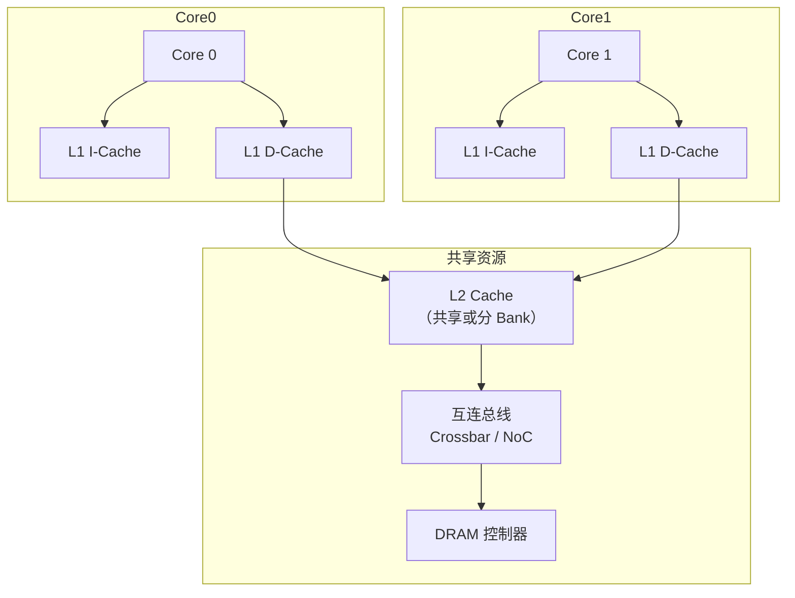
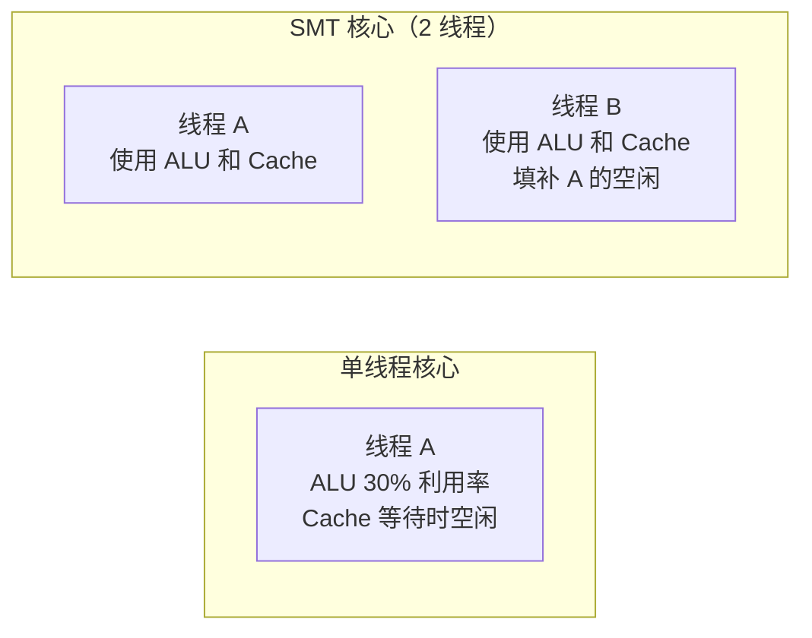

# 高级微架构

> 5 级流水线是小学水平，超标量、乱序执行、多核才是现代高性能 CPU 的"高考题"。本章从系统软件工程师的视角，拆解这些技术的核心逻辑——你不需要自己造 CPU，但需要知道怎么写出让 CPU "跑得快" 的代码。
>
> **工程师视角**：超标量和乱序执行对系统软件是"透明的"，但缓存一致性不是。当你写多核驱动或实现 RCU 锁时，必须清楚理解 Store Buffer、Cache Coherency Protocol 和 Memory Barrier 的交互。一个放错位置的 `fence`，可能导致其他核心看到 stale 数据——这种 bug 极难复现。

### 前置知识

| 需要了解 | 参考文档 |
|----------|----------|
| 经典 5 级流水线与流水线冒险 | [流水线基础](./pipeline-basics.md) |
| 数据冒险 / 控制冒险 / 结构冒险的解决 | [流水线基础](./pipeline-basics.md) |

---

## 1. 从 5 级流水线到高性能：性能提升路线图



| 技术 | 核心思想 | 性能提升 | 系统软件视角 |
|------|----------|----------|--------------|
| **超标量** | 每周期发射多条指令 | IPC > 1 | 编译器优化指令级并行 |
| **乱序执行** | 动态调整指令执行顺序 | 挖掘指令级并行（ILP） | 减少数据依赖，避免流水线停顿 |
| **多核** | 多个核心并行 | 挖掘线程级并行（TLP） | 并行编程、锁优化、NUMA 感知 |
| **SMT** | 单核心多线程 | 提高资源利用率 | 线程亲和性、避免伪共享 |

> **IPC vs CPI：** CPI（Cycles Per Instruction）是每指令周期数，IPC（Instructions Per Cycle）是每周期指令数。IPC = 1/CPI。超标量处理器的 IPC 可以大于 1。

---

## 2. 超标量处理器：从单车道到多车道

### 2.1 基本结构



### 2.2 关键组件：用生活类比理解

| 组件 | 功能 | 类比 | 对软件的意义 |
|------|------|------|-------------|
| **取指单元** | 每周期取多条指令，需要分支预测支持 | 图书馆一次借多本书 | 分支预测失败 = 书借错了，要还回去重借 |
| **寄存器重命名** | 消除 WAW 和 WAR 假依赖 | 给每个人发工号，避免同名混淆 | 编译器不需要担心寄存器冲突 |
| **发射队列** | 缓存已译码指令，等待操作数就绪 | 厨房备菜区，食材齐了再下锅 | 数据依赖的指令会在这里"等菜" |
| **ROB** | 保证指令按序提交，支持精确异常 | 银行叫号，按顺序办理 | 异常发生时能精确回滚到某条指令 |
| **CDB** | 广播执行结果，唤醒等待的指令 | 大喇叭通知"XX 号好了" | 结果广播越快，等待的指令越早唤醒 |

---

## 3. 乱序执行（Out-of-Order Execution）：灵活调度

### 3.1 为什么需要乱序执行？

```asm
# 顺序执行的问题：Cache miss 阻塞一切
lw   t0, 0(a0)       # Cache miss，需要 100 周期
add  t1, t2, t3      # 不依赖 t0，但被阻塞
sub  t4, t5, t6      # 不依赖 t0，但被阻塞
mul  t7, t0, t8      # 依赖 t0，必须等待

# 乱序执行：先干不依赖的活
lw   t0, 0(a0)       # 发射，等待 Cache（100 周期）
add  t1, t2, t3      # 操作数就绪，先执行！
sub  t4, t5, t6      # 操作数就绪，先执行！
# ... 100 周期后 ...
mul  t7, t0, t8      # 等 t0 到达后执行
```

> **类比：** 你在餐厅点了道菜，厨师发现主料缺货要等 20 分钟。聪明的厨师不会干等，而是先把其他菜做了。等主料到了，再快速出你的菜。

### 3.2 乱序执行的核心流程：顺序进，乱序做，顺序出



> **关键原则：** 乱序执行，顺序提交。指令可以乱序执行，但结果必须按程序顺序提交（写回寄存器/内存），这样才能保证精确异常。
>
> **为什么必须顺序提交？** 想象你在银行办业务，虽然后台可以乱序处理，但叫号必须按顺序。如果 5 号客户的业务办砸了需要回滚，你不能让 6 号客户已经办完离开。

### 3.3 寄存器重命名：消除假依赖

消除假依赖（名称依赖），只保留真依赖（数据依赖）：

```
假依赖类型:
  WAR (Write After Read):  后续指令写，前序指令读 → 重命名解决
  WAW (Write After Write): 两条指令写同一寄存器 → 重命名解决

真依赖:
  RAW (Read After Write):  后续指令读前序指令的结果 → 必须等待

示例:
  add t0, t1, t2    # t0 = t1 + t2       → t0 → p1 (物理寄存器)
  sub t3, t0, t4    # t3 = t0 + t4 (RAW) → 必须等 p1
  add t0, t5, t6    # t0 = t5 + t6 (WAW) → t0 → p2 (新物理寄存器)
  or  t7, t0, t8    # t7 = t0 | t8 (RAW) → 等 p2

  重命名后 WAW 消除：t0 先映射 p1，后映射 p2
  后续读 t0 的指令会自动读到 p2
```

> **类比：** 公司有两个叫"张伟"的员工。HR 给他们发工号：张伟#001 和 张伟#002。以后提到"张伟"，系统会根据上下文自动对应到正确的工号，不会混淆。

---

## 4. 加载/存储队列（LSQ）：内存操作的特殊处理

内存操作需要特殊处理，因为它们之间可能存在地址依赖：



| LSQ 功能 | 说明 | 对内核开发的意义 |
|----------|------|----------------|
| **地址检查** | 检查 Load 是否与之前的 Store 地址重叠 | 理解为什么 `memcpy` 的 src/dst 重叠是未定义行为 |
| **Store-to-Load 转发** | 如果 Load 的地址与前面 Store 相同，直接从 Store 队列获取数据 | 减少内存访问延迟 |
| **保序** | Store 必须按程序顺序执行（保证内存一致性） | 理解 `fence` 指令的必要性 |
| **推测执行** | Load 可以在地址确认前推测执行，如果冲突则回滚 | 理解 Spectre 漏洞的原理 |

---

## 5. 缓存一致性：多核系统的"同步账本"

多核系统中，每个核心有自己的 Cache，需要保持数据一致性：

### 5.1 MESI 协议：四状态状态机



| 状态 | 含义 | 可读 | 可写 | 内存是否最新 |
|------|------|------|------|-------------|
| **M** Modified | 数据已修改，仅本 Cache 有 | ✅ | ✅ | ❌ |
| **E** Exclusive | 数据干净，仅本 Cache 有 | ✅ | ✅ | ✅ |
| **S** Shared | 数据干净，多个 Cache 有 | ✅ | ❌ | ✅ |
| **I** Invalid | 无效 | ❌ | ❌ | — |

> **类比：** MESI 就像四个员工共享一个账本：
> - **M（Modified）：** 你改了账本，但还没同步到云端。只有你有最新版。
> - **E（Exclusive）：** 你有一份干净的副本，云端也是这个版本。你可以随意修改（会变成 M）。
> - **S（Shared）：** 很多人都有这个版本，没人修改。你只能看，不能改。
> - **I（Invalid）：** 你的版本过期了，别看。

### 5.2 MOESI 扩展：增加 Owner 状态

在 MESI 基础上增加 **O (Owner)** 状态：

| 状态 | 说明 |
|------|------|
| **O** Owner | 数据已修改或干净，本 Cache 负责向其他 Cache 提供数据，内存可能过期 |

> MOESI 的优势：允许从 Owner 状态的 Cache 直接转发数据给请求者，避免每次都要写回内存。
>
> **对系统软件工程师的意义：** 理解缓存一致性协议，才能写出高效的多线程代码。比如，伪共享（False Sharing）就是因为两个线程频繁修改同一缓存行的不同变量，导致缓存行在核心间来回"乒乓"。

---

## 6. 多核架构：从单核到众核

### 6.1 典型多核 SoC 结构



### 6.2 多核互连：从总线到片上网络

| 互连方式 | 延迟 | 带宽 | 扩展性 | 适用规模 |
|----------|------|------|--------|----------|
| **共享总线** | 低 | 低 | 差（4-8 核） | 小型 SoC |
| **Crossbar** | 低 | 高 | 中等（8-16 核） | 中型 SoC |
| **NoC（片上网络）** | 较高 | 高 | 好（64+ 核） | 大型芯片 |

> **类比：**
> - **共享总线：** 单车道马路，车多了就堵
> - **Crossbar：** 立交桥，多方向同时通行
> - **NoC：** 城市地铁网络，站点间通过固定路线连接

---

## 7. SMT（同时多线程）：一个身体，两个灵魂

SMT（Intel 称 Hyper-Threading）让一个物理核心同时执行多个线程：



| 特性 | 说明 |
|------|------|
| **共享资源** | ALU、Cache、分支预测器 |
| **独立资源** | 寄存器文件、PC、指令指针 |
| **性能提升** | 通常 20-40%（不是 2 倍！） |
| **RISC-V 支持** | 一些核心实现了类 SMT 机制 |

> **对系统软件工程师的意义：** SMT 不是免费的午餐。两个线程共享 Cache，如果它们访问的数据不相关，会互相驱逐对方的缓存行，导致性能下降。设置线程亲和性（affinity）让相关线程跑在不同核心上，是常见的优化手段。

---

## 8. 实战：写出对 CPU 友好的代码

### 8.1 避免 Load-Use 停顿

```c
// 不好的代码：Load-Use 冒险
int sum = 0;
for (int i = 0; i < n; i++) {
    sum += arr[i];  // lw + add 紧挨着，可能停顿
}

// 好的代码：循环展开，减少 Load-Use
int sum0 = 0, sum1 = 0, sum2 = 0, sum3 = 0;
for (int i = 0; i < n; i += 4) {
    sum0 += arr[i];
    sum1 += arr[i+1];
    sum2 += arr[i+2];
    sum3 += arr[i+3];
}
int sum = sum0 + sum1 + sum2 + sum3;
```

### 8.2 避免分支预测失败

```c
// 不好的代码：分支模式难以预测
for (int i = 0; i < n; i++) {
    if (arr[i] > threshold) {  // 随机数据，预测失败率高
        count++;
    }
}

// 好的代码：减少分支
for (int i = 0; i < n; i++) {
    count += (arr[i] > threshold);  // 无分支，利用条件移动
}
```

### 8.3 避免伪共享

```c
// 不好的代码：两个线程修改同一缓存行的不同变量
struct {
    int counter0;  // 线程 0 修改
    int counter1;  // 线程 1 修改
} shared;  // 两个变量在同一缓存行（64 字节）

// 好的代码：填充到缓存行大小
struct {
    int counter0;
    char pad[60];  // 填充到 64 字节
} counter0_aligned;

struct {
    int counter1;
    char pad[60];
} counter1_aligned;
```

---

## 小结

| 技术 | 解决的问题 | 代价 | 软件优化方向 |
|------|-----------|------|-------------|
| 超标量 | IPC > 1 | 硬件复杂度、功耗 | 编译器优化指令级并行 |
| 乱序执行 | 挖掘 ILP | ROB、重命名表、CDB | 减少数据依赖 |
| 缓存一致性 | 多核数据一致性 | MESI/MOESI 协议开销 | 避免伪共享、合理数据布局 |
| 多核 | 挖掘 TLP | 互连、一致性流量 | 并行编程、NUMA 感知 |
| SMT | 提高单核利用率 | 资源竞争、安全侧信道 | 线程亲和性、隔离关键线程 |

---

## 参考资料

- [Hennessy & Patterson — *Computer Architecture: A Quantitative Approach* 6th Ed, Ch3-5](https://www.elsevier.com/books/computer-architecture/hennessy/978-0-12-811905-1) — 乱序执行、SMT、Cache 预取等经典分析
- [RISC-V BOOM Documentation](https://docs.boom-core.org/) — BOOM 乱序核的微架构设计文档
- [gem5 Documentation — O3CPU](https://www.gem5.org/documentation/general_docs/cpu_models/O3CPU/) — gem5 中乱序 CPU 模型的实现细节

---

→ 下一节：[开源 RISC-V 核心](./opensource-cores.md)
