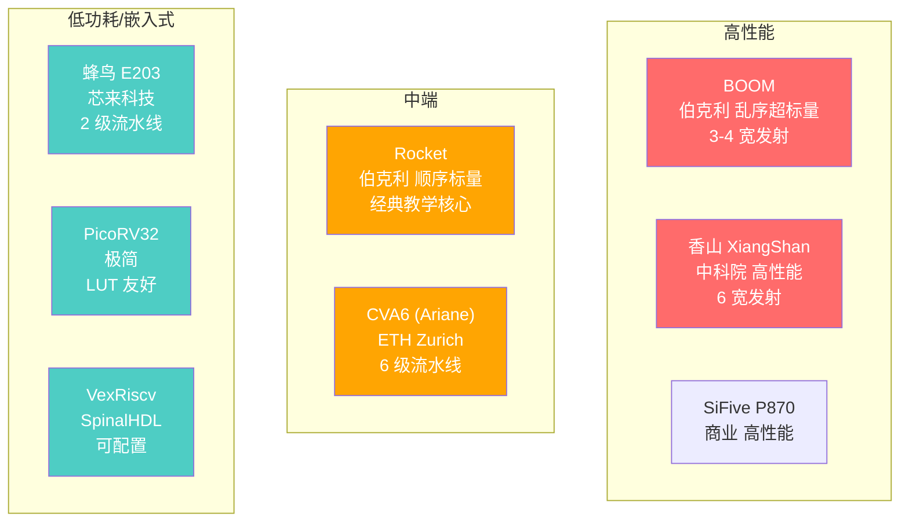
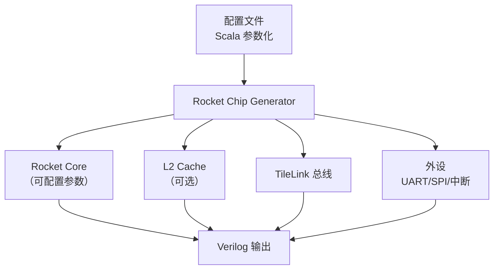
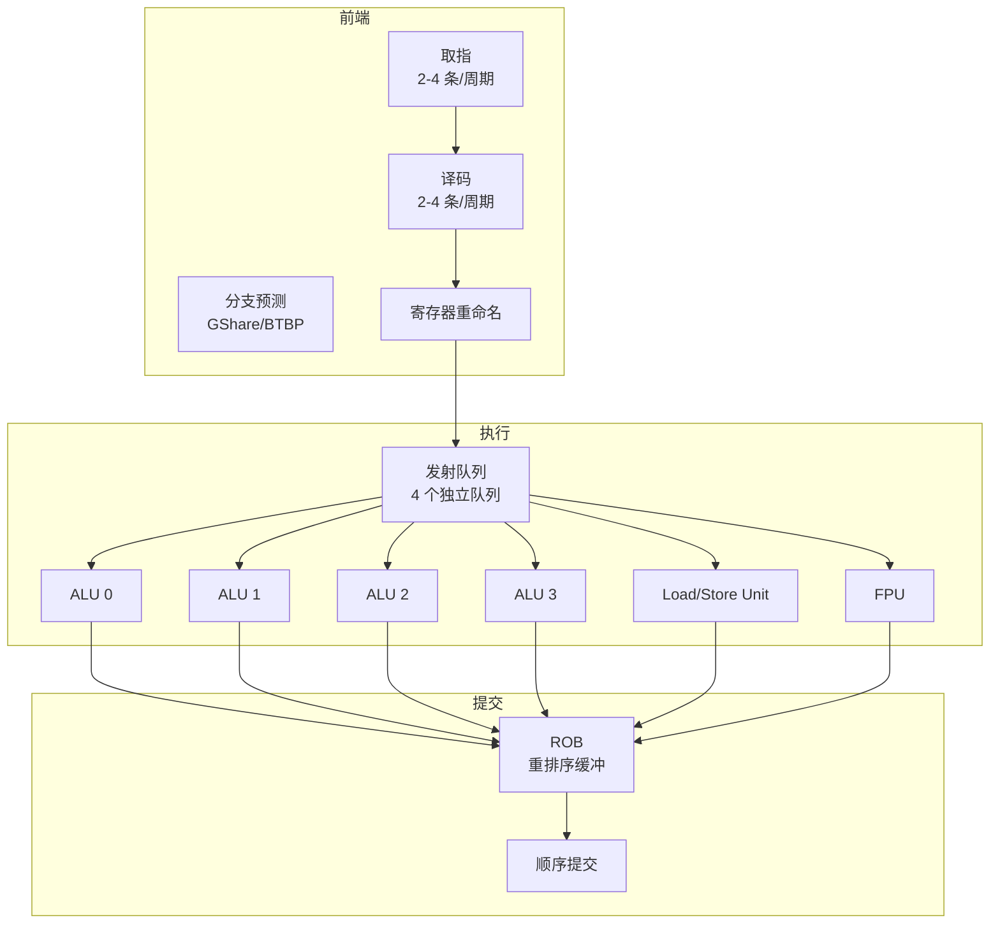
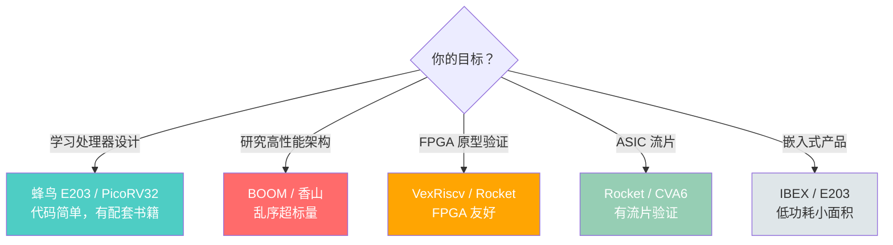

# 开源 RISC-V 核心

> RISC-V 的开源生态催生了多个优秀的处理器核心，从教学级到高性能服务器级。了解这些核心有助于选择合适的项目参考。

---

## 1. 开源核心全景



---

## 2. Rocket Chip

### 2.1 概述

| 属性 | 说明 |
|------|------|
| **来源** | UC Berkeley |
| **语言** | Chisel（硬件构造语言） |
| **架构** | 顺序标量，5-6 级流水线 |
| **ISA** | RV64IMAFDC + 自定义扩展 |
| **地位** | RISC-V 生态的"参考实现" |

### 2.2 Rocket 的微架构

```
Rocket 核心结构:

  [IF] → [ID] → [EX] → [MEM] → [WB]
                     ↑
              包含 ALU + 乘除法单元
              可选 FPU
              可选 Rocket Custom Coprocessor (RoCC)
```

### 2.3 Rocket Chip SoC 生成器

Rocket Chip 不仅是核心，更是一个 SoC 生成框架：



> **RoCC（Rocket Custom Coprocessor）：** Rocket 支持自定义协处理器扩展，通过自定义指令与主核心交互。这是 RISC-V 可扩展性的典型体现。

---

## 3. BOOM（Berkeley Out-of-Order Machine）

### 3.1 概述

| 属性 | 说明 |
|------|------|
| **来源** | UC Berkeley |
| **语言** | Chisel |
| **架构** | 乱序超标量 |
| **发射宽度** | 2-4 宽（可配置） |
| **适用** | 高性能计算、研究 |

### 3.2 BOOM 的微架构



### 3.3 Rocket vs BOOM 对比

| 特性 | Rocket | BOOM |
|------|--------|------|
| 执行方式 | 顺序 | 乱序 |
| 发射宽度 | 1 | 2-4 |
| 寄存器重命名 | 无 | 有 |
| ROB | 无 | 有 |
| 频率 | ~1 GHz (FPGA) | ~500 MHz (FPGA) |
| 面积 | 小 | 大（3-5 倍） |
| IPC | ~0.5-0.8 | ~1.5-2.5 |
| 适用场景 | 嵌入式、教学 | 高性能、研究 |

---

## 4. 香山（XiangShan）

### 4.1 概述

| 属性 | 说明 |
|------|------|
| **来源** | 中国科学院计算技术研究所 |
| **语言** | Chisel |
| **架构** | 乱序超标量 |
| **发射宽度** | 6 宽 |
| **目标性能** | ARM Cortex-A72 级别 |
| **开源** | ✅ GitHub 开源 |

### 4.2 香山的代际演进

| 版本 | 代号 | 特点 | 状态 |
|------|------|------|------|
| **v1** | 雁栖湖 | 6 发射乱序，4 个 ALU | 已发布 |
| **v2** | 南湖 | 优化微架构，提升 IPC | 已发布 |
| **v3** | 昆明湖 | 更宽发射，更高频率 | 开发中 |

### 4.3 香山的微架构亮点

```
香山南湖核心结构:

前端:
  - 6 宽取指/译码
  - TAGE-SC 分支预测器（高准确率）
  - FTQ（Fetch Target Queue）解耦前端和后端

后端:
  - 6 宽发射
  - 192 项 ROB
  - 6 个 ALU + 2 个乘法单元
  - 2 个 Load 单元 + 1 个 Store 单元
  - 128 项物理寄存器文件

访存:
  - 2 个 Load 单元（支持 Load-Load 乱序）
  - Store-to-Load 转发
  - L1 D-Cache: 64KB, 4-way
  - L2 Cache: 256KB-1MB, 共享
```

> **香山的意义：** 它是目前开源界最接近商用高性能的 RISC-V 核心，对 RISC-V 生态的推动作用巨大。

---

## 5. CVA6（Ariane）

| 属性 | 说明 |
|------|------|
| **来源** | ETH Zurich（瑞士联邦理工） |
| **语言** | SystemVerilog |
| **架构** | 顺序 6 级流水线 |
| **ISA** | RV64IMAFDC |
| **特点** | 支持 Linux SMP，代码清晰 |

CVA6 是一个"中等复杂度"的核心，比 Rocket 稍复杂，但比 BOOM 简单得多。它的 SystemVerilog 实现对不熟悉 Chisel 的开发者更友好。

---

## 6. 蜂鸟 E203

| 属性 | 说明 |
|------|------|
| **来源** | 芯来科技 |
| **语言** | Verilog |
| **架构** | 2 级流水线，顺序执行 |
| **ISA** | RV32IMAC |
| **特点** | 极简、面向 IoT/嵌入式 |

### E203 的微架构

```
E203 流水线:

  [IF] → [EX/MEM/WB]    ← 仅 2 级！

  特点:
  - 取指一次取 16-bit（压缩指令友好）
  - 执行级包含 ALU + 乘除法 + 访存
  - 面积极小（~30K 门）
  - 适合 FPGA 和 ASIC 实现
```

> **E203 的价值：** 配套书籍《手把手教你设计 CPU——RISC-V 处理器篇》是中文世界最好的 RISC-V 处理器设计入门教材。

---

## 7. 其他值得关注的开源核心

| 核心 | 语言 | 特点 | 适用场景 |
|------|------|------|----------|
| **PicoRV32** | Verilog | 极简，~1000 行代码 | FPGA 小项目 |
| **VexRiscv** | SpinalHDL | 高度可配置 | FPGA 通用 |
| **SERV** | Verilog | 单位宽，位串行 | 极致面积优化 |
| **IBEX** | SystemVerilog | 低功耗，2 级流水线 | Google OpenTitan 使用 |
| **OpenC910** | Verilog | 平头哥，乱序 | 高性能嵌入式 |

---

## 8. 如何选择开源核心



---

## 小结

| 核心 | 定位 | 语言 | 流水线 | 适合谁 |
|------|------|------|--------|--------|
| Rocket | 参考实现 | Chisel | 5-6 级顺序 | SoC 设计者 |
| BOOM | 高性能研究 | Chisel | 乱序超标量 | 研究人员 |
| 香山 | 商用高性能 | Chisel | 乱序超标量 | 高性能开发者 |
| CVA6 | 中端通用 | SV | 6 级顺序 | 不用 Chisel 的开发者 |
| E203 | 嵌入式入门 | Verilog | 2 级顺序 | 初学者 |
| IBEX | 低功耗安全 | SV | 2 级顺序 | 安全芯片开发者 |

→ 下一节：[SoC 与系统设计](./soc-design.md)
