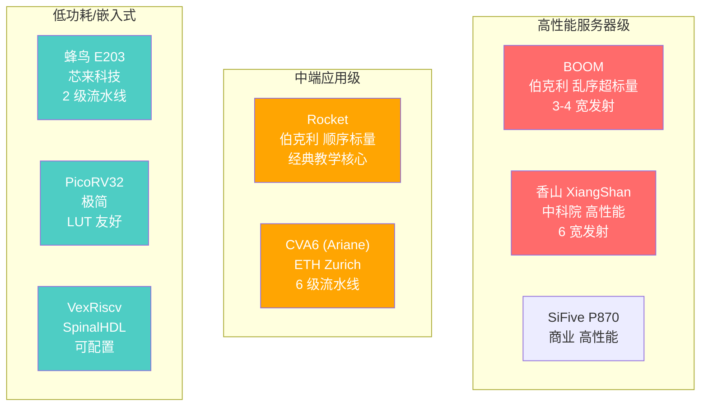
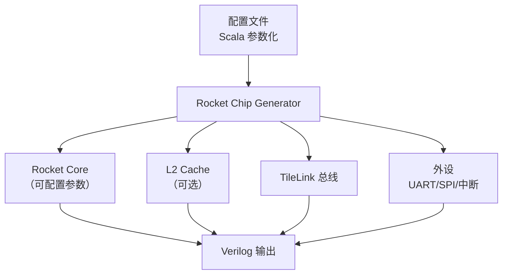
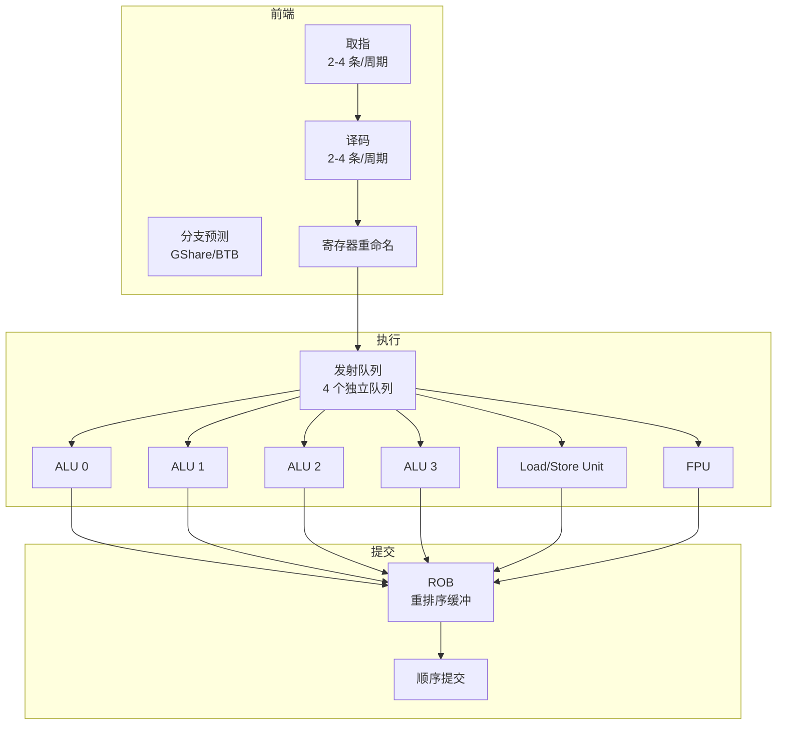
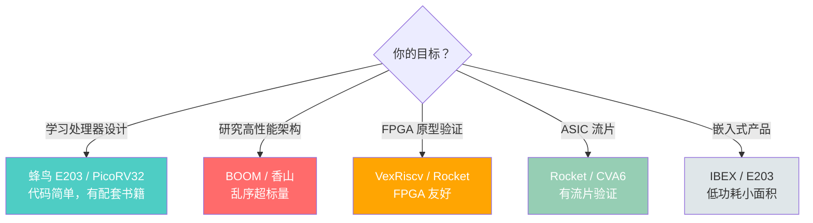

# 开源 RISC-V 核心

> 了解开源核心就像了解汽车发动机——你不需要自己造，但要知道哪台发动机适合你的赛道。从教学级的"小排量"到服务器级的"V12"，RISC-V 的开源生态应有尽有。
>
> **工程师视角**：选核心不是选"性能最高的"，而是选"最适合当前产品的"。做 MCU 选蜂鸟 E203，做 Linux SBC 选 CVA6，做服务器选香山。更重要的是，开源核心让你可以深入 RTL 理解硬件行为——当内核在特定核心上触发无法解释的 bug 时，查看 RTL 的 LSU 或 MMU 实现往往能找到根因。

### 前置知识

| 需要了解 | 参考文档 |
|----------|----------|
| 流水线基础与微架构概念 | [流水线基础](./pipeline-basics.md) |
| 乱序执行、超标量、多核概念 | [高级微架构](./advanced-microarchitecture.md) |

---

## 1. 开源核心全景：一张地图



> **系统软件工程师的视角：** 你的固件和内核代码最终要跑在这些核心上。理解它们的微架构差异，才能针对性地优化代码。比如，在 Rocket（顺序）上，Load-Use 停顿不可避免；在 BOOM（乱序）上，编译器可以少操心指令调度。

---

## 2. Rocket Chip：RISC-V 的"参考实现"

### 2.1 概述

| 属性 | 说明 |
|------|------|
| **来源** | UC Berkeley |
| **语言** | Chisel（硬件构造语言） |
| **架构** | 顺序标量，5-6 级流水线 |
| **ISA** | RV64IMAFDC + 自定义扩展 |
| **地位** | RISC-V 生态的"参考实现" |

### 2.2 Rocket 的微架构

```
Rocket 核心结构:

  [IF] → [ID] → [EX] → [MEM] → [WB]
                     ↑
              包含 ALU + 乘除法单元
              可选 FPU
              可选 Rocket Custom Coprocessor (RoCC)
```

> **特点：** 简单、清晰、可配置。Rocket 是理解 RISC-V 处理器的最佳起点，也是很多商业 SoC 的基础。

### 2.3 Rocket Chip SoC 生成器

Rocket Chip 不仅是核心，更是一个 SoC 生成框架：



> **RoCC（Rocket Custom Coprocessor）：** Rocket 支持自定义协处理器扩展，通过自定义指令与主核心交互。这是 RISC-V 可扩展性的典型体现。
>
> **对固件开发者的意义：** 如果你的 SoC 使用了 RoCC，你需要在 M-mode 固件中初始化并配置这些协处理器，可能需要自定义的 SBI 扩展来让 S-mode 访问它们。

---

## 3. BOOM：伯克利的"性能怪兽"

### 3.1 概述

| 属性 | 说明 |
|------|------|
| **来源** | UC Berkeley |
| **语言** | Chisel |
| **架构** | 乱序超标量 |
| **发射宽度** | 2-4 宽（可配置） |
| **适用** | 高性能计算、研究 |

### 3.2 BOOM 的微架构



### 3.3 Rocket vs BOOM 对比

| 特性 | Rocket | BOOM |
|------|--------|------|
| 执行方式 | 顺序 | 乱序 |
| 发射宽度 | 1 | 2-4 |
| 寄存器重命名 | 无 | 有 |
| ROB | 无 | 有 |
| 频率 | ~1 GHz (FPGA) | ~500 MHz (FPGA) |
| 面积 | 小 | 大（3-5 倍） |
| IPC | ~0.5-0.8 | ~1.5-2.5 |
| 适用场景 | 嵌入式、教学 | 高性能、研究 |

> **对系统软件工程师的意义：**
> - 在 Rocket 上，你需要更小心地写汇编，因为硬件不会帮你重排指令
> - 在 BOOM 上，编译器的 `-O2` 优化通常就够了，硬件会自动挖掘并行性
> - BOOM 的 ROB 和重命名表需要更多功耗，嵌入式场景要权衡

---

## 4. 香山（XiangShan）：中国的"性能之光"

### 4.1 概述

| 属性 | 说明 |
|------|------|
| **来源** | 中国科学院计算技术研究所 |
| **语言** | Chisel |
| **架构** | 乱序超标量 |
| **发射宽度** | 6 宽 |
| **目标性能** | ARM Cortex-A72 级别 |
| **开源** | ✅ GitHub 开源 |

### 4.2 香山的代际演进

| 版本 | 代号 | 特点 | 状态 |
|------|------|------|------|
| **v1** | 雁栖湖 | 6 发射乱序，4 个 ALU | 已发布 |
| **v2** | 南湖 | 优化微架构，提升 IPC | 已发布 |
| **v3** | 昆明湖 | 更宽发射，更高频率 | 开发中 |

### 4.3 香山的微架构亮点

```
香山南湖核心结构:

前端:
  - 6 宽取指/译码
  - TAGE-SC 分支预测器（高准确率）
  - FTQ（Fetch Target Queue）解耦前端和后端

后端:
  - 6 宽发射
  - 192 项 ROB
  - 6 个 ALU + 2 个乘法单元
  - 2 个 Load 单元 + 1 个 Store 单元
  - 128 项物理寄存器文件

访存:
  - 2 个 Load 单元（支持 Load-Load 乱序）
  - Store-to-Load 转发
  - L1 D-Cache: 64KB, 4-way
  - L2 Cache: 256KB-1MB, 共享
```

> **香山的意义：** 它是目前开源界最接近商用高性能的 RISC-V 核心。对于系统软件工程师来说，香山意味着 RISC-V 已经具备了与 ARM/x86 在服务器领域竞争的性能基础。

---

## 5. CVA6（Ariane）：SystemVerilog 的优雅

| 属性 | 说明 |
|------|------|
| **来源** | ETH Zurich / OpenHW Group |
| **语言** | SystemVerilog |
| **架构** | 顺序 6 级流水线，单发射 |
| **ISA** | RV64IMAFDC（支持 Sv39 MMU） |
| **特点** | 支持 Linux SMP，代码清晰，工业级验证 |

CVA6 是一个"中等复杂度"的核心——比 Rocket 稍复杂（多 1 级流水线），但远没有乱序执行的 BOOM 那么庞大。它的 SystemVerilog 实现对不熟悉 Chisel 的开发者更友好，同时已流片验证过多次（GlobalFoundries 22nm FDX 等），是**开源核心中工业成熟度最高**的选项之一。

### CVA6 的微架构

```
CVA6 6 级流水线:

  [PC Gen] → [IF] → [ID] → [Issue] → [EX] → [Commit]

特点:
  - 6 级而非经典 5 级：把 Issue（发射）独立出来
    → ID 译码后指令进入 Issue 级等待操作数就绪
    → 虽是顺序发射，但 Issue 级可以作为"缓冲"减少停顿
  - 分支预测：BTB + BHT + RAS（返回地址栈），不是简单的静态预测
  - 支持 Csr 旁路（bypass）优化 CSR 读写的延迟
  - L1 I-Cache: 16KB, 4-way；L1 D-Cache: 16/32KB 可配，4/8-way
```

| 特性 | Rocket | CVA6 | BOOM |
|------|--------|------|------|
| 流水线级数 | 5-6 | 6 | 深流水（乱序） |
| 发射宽度 | 1 | 1 | 2-4 |
| 分支预测 | 简单 BTB | BTB + BHT + RAS | GShare/TAGE |
| MMU | Sv39 | Sv39 | Sv39 |
| 硬件语言 | Chisel | SystemVerilog | Chisel |
| 社区归属 | Chips Alliance | OpenHW Group | Chips Alliance |

### CVA6 的应用场景

| 场景 | 说明 |
|------|------|
| **FPGA 原型** | 在 Xilinx/Intel FPGA 上可跑到 50-100 MHz，适合软硬件协同验证 |
| **ASIC 流片** | 多次成功流片，有成熟的物理设计参考 |
| **Linux SBC** | 配合 OpenSBI + Linux，可作为简单的 Linux-capable 核心 |
| **教学研究** | SystemVerilog 代码比 Chisel 更利于教学（不需要学一门新语言） |

> **对固件开发者的意义：** CVA6 支持 Linux SMP，意味着你需要实现完整的缓存一致性初始化、多核启动（IPI）和 PLIC 配置。CVA6 的 OpenHW Group 还维护了配套的验证环境和 SW 工具链，降低了 bring-up 难度。
>
> **选型对比：** 如果你需要做 ASIC 流片又不希望用 Chisel 开发流程，CVA6 是目前最成熟的选择。如果你在做学术界研究需要调整微架构参数，Rocket/BOOM（Chisel + Rocket Chip Generator）的灵活性更高。

---

## 6. 蜂鸟 E203：入门首选

| 属性 | 说明 |
|------|------|
| **来源** | 芯来科技 |
| **语言** | Verilog |
| **架构** | 2 级流水线，顺序执行 |
| **ISA** | RV32IMAC |
| **特点** | 极简、面向 IoT/嵌入式 |

### E203 的微架构

```
E203 流水线:

  [IF] → [EX/MEM/WB]    ← 仅 2 级！

  特点:
  - 取指一次取 16-bit（压缩指令友好）
  - 执行级包含 ALU + 乘除法 + 访存
  - 面积极小（~30K 门）
  - 适合 FPGA 和 ASIC 实现
```

> **E203 的价值：** 配套书籍《手把手教你设计 CPU——RISC-V 处理器篇》是中文世界最好的 RISC-V 处理器设计入门教材。
>
> **对系统软件工程师的意义：** 在 E203 这样的极简核心上，你的固件代码需要极度精简。没有复杂的缓存一致性，没有多核，但你需要自己处理所有中断和定时器。

---

## 7. 其他值得关注的开源核心

| 核心 | 语言 | 特点 | 适用场景 |
|------|------|------|----------|
| **PicoRV32** | Verilog | 极简，~1000 行代码 | FPGA 小项目 |
| **VexRiscv** | SpinalHDL | 高度可配置 | FPGA 通用 |
| **SERV** | Verilog | 单位宽，位串行 | 极致面积优化 |
| **IBEX** | SystemVerilog | 低功耗，2 级流水线 | Google OpenTitan 使用 |
| **OpenC910** | Verilog | 平头哥，乱序 | 高性能嵌入式 |

---

## 8. 如何选择开源核心：决策树



---

## 9. 系统软件视角：核心差异如何影响你的代码

| 核心特性 | 对固件/内核的影响 |
|----------|------------------|
| **顺序 vs 乱序** | 顺序核心需要手动指令调度；乱序核心依赖编译器优化 |
| **有无 FPU** | 无 FPU 时，内核浮点模拟（soft-float）或禁用用户态浮点 |
| **Cache 配置** | 缓存行大小影响锁和数据结构的内存对齐策略 |
| **MMU 支持** | 无 MMU 时只能运行 RTOS，无法运行 Linux |
| **多核支持** | 需要实现缓存一致性初始化、核间中断（IPI） |
| **自定义扩展** | 需要在固件中初始化扩展，可能需要自定义 SBI 接口 |

---

## 小结

| 核心 | 定位 | 语言 | 流水线 | 适合谁 | 系统软件关注点 |
|------|------|------|--------|--------|---------------|
| Rocket | 参考实现 | Chisel | 5-6 级顺序 | SoC 设计者 | 可配置性强，RoCC 扩展 |
| BOOM | 高性能研究 | Chisel | 乱序超标量 | 研究人员 | ROB 深度、分支预测 |
| 香山 | 商用高性能 | Chisel | 乱序超标量 | 高性能开发者 | 服务器级优化、SMP |
| CVA6 | 中端通用 | SV | 6 级顺序 | 不用 Chisel 的开发者 | Linux SMP 支持 |
| E203 | 嵌入式入门 | Verilog | 2 级顺序 | 初学者 | 极简，无 MMU |
| IBEX | 低功耗安全 | SV | 2 级顺序 | 安全芯片开发者 | 安全启动、PMP |

---

## 参考资料

- [Rocket Chip Generator (GitHub)](https://github.com/chipsalliance/rocket-chip) — Rocket 核心与 TileLink 总线源码
- [BOOM Documentation (boom-core.org)](https://docs.boom-core.org/) — BOOM 乱序核心的微架构技术手册
- [CVA6 / ARIANE (GitHub — OpenHW Group)](https://github.com/openhwgroup/cva6) — CVA6 的 SystemVerilog 实现
- [XiangShan (香山) (GitHub — 中科院计算所)](https://github.com/OpenXiangShan/XiangShan) — 香山高性能 RISC-V 处理器
- [Nuclei ISA Manual (蜂鸟 E203)](https://doc.nucleisys.com/) — 蜂鸟 E203 的指令与微架构文档
- [lowRISC IBEX (GitHub)](https://github.com/lowRISC/ibex) — IBEX 低功耗嵌入式核心

---

→ 下一节：[SoC 与系统设计](./soc-design.md)
