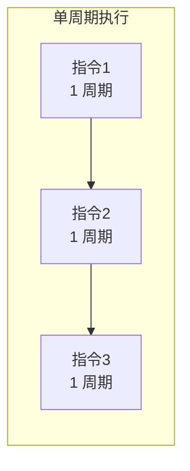
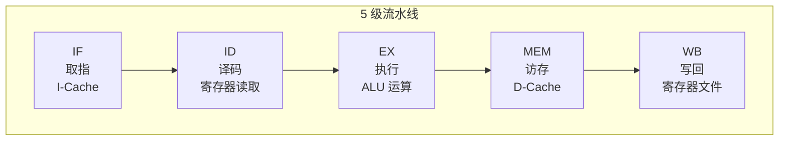
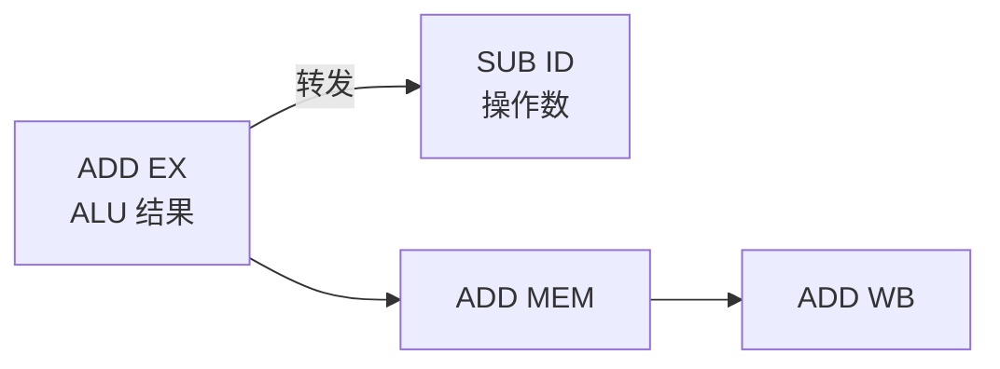
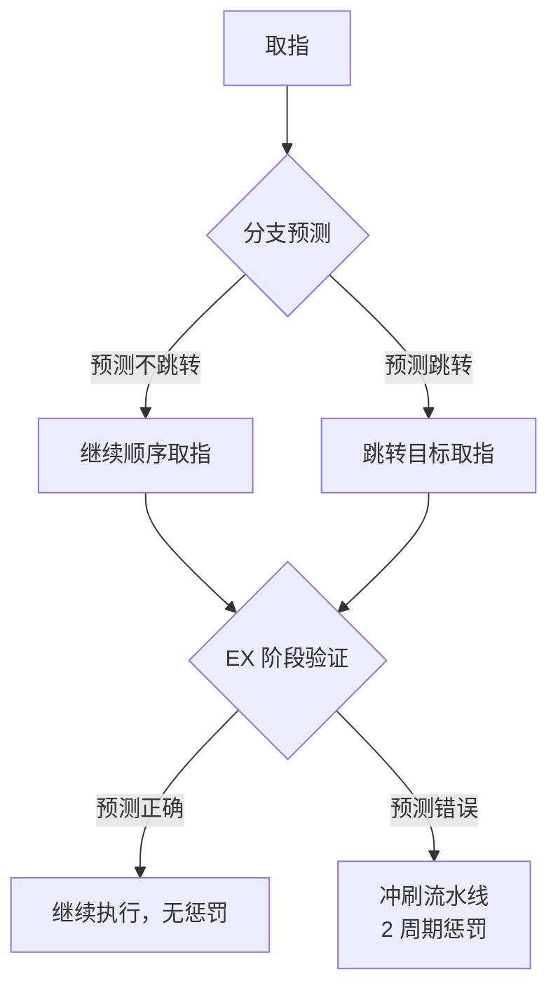

# 流水线基础

> 流水线是现代 CPU 性能的基石。理解流水线的工作原理和冒险处理，是掌握处理器微架构的第一步。

---

## 1. 单周期处理器

最简单的处理器实现——每条指令在一个时钟周期内完成：



| 优点 | 缺点 |
|------|------|
| 设计简单，CPI = 1 | 时钟频率由最慢的指令决定（通常是 LW） |
| 每条指令只执行一次 | 硬件利用率低（同一时刻只有一个部件在工作） |

> **关键问题：** 时钟周期必须满足最慢指令（访存指令）的延迟，导致简单指令（如 ADD）的时间被浪费。

---

## 2. 经典 5 级流水线

将指令执行分为 5 个阶段，不同指令的不同阶段可以重叠：



### 2.1 流水线时序

```
周期:    1     2     3     4     5     6     7
指令1:  [IF]  [ID]  [EX]  [MEM] [WB]
指令2:        [IF]  [ID]  [EX]  [MEM] [WB]
指令3:              [IF]  [ID]  [EX]  [MEM] [WB]
指令4:                    [IF]  [ID]  [EX]  [MEM] [WB]
指令5:                          [IF]  [ID]  [EX]  [MEM] [WB]

稳态吞吐量: 每周期完成 1 条指令 (CPI ≈ 1)
```

### 2.2 每个阶段的具体工作

| 阶段 | 操作 | 关键硬件 |
|------|------|----------|
| **IF** | PC → I-Cache 地址；取指令；PC+4 | PC 寄存器、I-Cache、加法器 |
| **ID** | 指令译码；读寄存器文件；生成立即数；分支判断 | 译码器、寄存器文件、比较器 |
| **EX** | ALU 运算；计算访存地址；计算跳转目标 | ALU、加法器、多路选择器 |
| **MEM** | 访问 D-Cache（仅 load/store） | D-Cache |
| **WB** | 将结果写回寄存器文件 | 寄存器文件写端口 |

### 2.3 流水线寄存器

相邻阶段之间需要流水线寄存器来传递数据：

```
[IF/ID 寄存器] → 保存：指令、PC+4、立即数
[ID/EX 寄存器] → 保存：操作数、ALU 控制信号、立即数、目标寄存器
[EX/MEM 寄存器] → 保存：ALU 结果、写入数据、访存控制信号
[MEM/WB 寄存器] → 保存：ALU 结果、加载的数据、写回目标
```

---

## 3. 数据冒险（Data Hazard）

### 3.1 RAW（Read After Write）——最常见的冒险

当后续指令需要读取前序指令尚未写回的结果时：

```asm
add  t0, t1, t2    # 结果在第 5 周期写回 t0
sub  t3, t0, t4    # 第 3 周期就需要 t0 → 数据冒险！
```

```
周期:    1     2     3     4     5
ADD:    [IF]  [ID]  [EX]  [MEM] [WB] ← t0 在此写回
SUB:          [IF]  [ID]  [EX]  [MEM] [WB]
                   ↑
              需要 t0，但 t0 还没写回！
```

### 3.2 解决方案 1：转发（Forwarding / Bypassing）

从流水线寄存器中直接获取结果，不等写回：



```
转发路径:
  EX → EX:  EX/MEM 寄存器 → ID/EX 寄存器（ALU 结果直接给下一条）
  MEM → EX: MEM/WB 寄存器 → ID/EX 寄存器（Load 后第二条可用）
```

### 3.3 解决方案 2：流水线停顿（Stall / Bubble）

Load-Use 冒险无法完全通过转发解决：

```asm
lw   t0, 0(sp)     # 数据在第 4 周期 MEM 结束才可用
sub  t3, t0, t4    # 第 3 周期 EX 就需要 → 必须停顿 1 周期
```

```
周期:    1     2     3     4     5     6     7
LW:     [IF]  [ID]  [EX]  [MEM] [WB]
SUB:          [IF]  [ID]  [气泡] [EX]  [MEM] [WB]
                            ↑
                      插入气泡，等待 LW 的 MEM 结果
                      然后从 MEM/WB 转发到 EX
```

### 3.4 解决方案 3：指令调度（编译器优化）

编译器通过重排指令来避免冒险：

```asm
# 原始代码（有 Load-Use 冒险）
lw   t0, 0(sp)
add  t1, t0, t2    # 冒险！需要停顿
sw   t1, 4(sp)

# 编译器调度后（无冒险）
lw   t0, 0(sp)
xxx  ...           # 插入无关指令填充延迟
add  t1, t0, t2    # 现在不需要停顿
sw   t1, 4(sp)
```

---

## 4. 控制冒险（Control Hazard）

分支指令改变 PC，但分支结果在 EX 阶段才知道，此时已经取了 2 条可能无效的指令。

### 4.1 简单方案：始终停顿

```
周期:    1     2     3     4     5
BEQ:    [IF]  [ID]  [EX]  [MEM] [WB]
             [气泡] [气泡] [正确指令]
                     ↑
              等 EX 判断分支结果，2 周期浪费
```

### 4.2 分支预测



#### 静态预测

| 策略 | 预测规则 | 准确率 | 适用场景 |
|------|----------|--------|----------|
| 预测不跳转 | 总是假设分支不发生 | ~60%（循环多时更低） | 简单处理器 |
| 预测跳转 | 总是假设分支发生 | ~40% | 特定场景 |
| BTFN | 向后跳转预测跳转，向前预测不跳转 | ~80% | 循环友好 |

#### 动态预测

| 预测器 | 原理 | 准确率 |
|--------|------|--------|
| **1-bit 预测** | 记录上次结果，本次预测相同 | ~85% |
| **2-bit 预测** | 两次错误才改变预测（饱和计数器） | ~90% |
| **局部预测** | 每个分支独立的 2-bit 计数器 | ~93% |
| **全局预测** | 基于全局分支历史（GShare） | ~95% |
| **TAGE** | 多种历史长度组合 | ~97%+ |

```
2-bit 饱和计数器:

  强不跳转(00) → 弱不跳转(01) → 弱跳转(10) → 强跳转(11)
       ↑                                                    ↓
       ← ← ← ← ← ← ← ← ← ← ← ← ← ← ← ← ← ← ← ← ← ←

  只有连续两次预测错误才改变方向
  → 对循环的最后一次退出有更好的容忍度
```

### 4.3 延迟分支（RISC-V 不使用）

> **注意：** RISC-V **没有**延迟分支（delay slot）。MIPS 等早期 RISC 架构使用延迟分支，分支后的指令总是执行。RISC-V 认为这增加了硬件复杂性和编译器负担，因此放弃了这一设计。

---

## 5. 结构冒险（Structural Hazard）

当两条指令同时需要同一硬件资源时发生：

| 冒险场景 | 原因 | 解决方案 |
|----------|------|----------|
| 同时取指和取数 | 统一内存 | 哈佛架构（I-Cache / D-Cache 分离） |
| 同时写回两个结果 | 寄存器文件只有一个写端口 | 增加写端口 / 流水线停顿 |
| 同时访问 Cache | 多条指令争用 | 多端口 Cache / 停顿 |

> **RISC-V 的设计优势：** Load-Store 架构使得 MEM 阶段只有 load/store 指令需要访问 D-Cache，减少了结构冒险的发生。

---

## 6. 流水线性能分析

### 6.1 CPI 计算

```
理想 CPI = 1（每周期完成 1 条指令）

实际 CPI = 1 + 停顿周期数

停顿来源:
  - 数据冒险停顿（Load-Use）
  - 控制冒险停顿（分支预测失败）
  - 结构冒险停顿（资源冲突）
  - Cache 缺失停顿
```

### 6.2 加速比

```
加速比 = 流水线深度 × 效率

理想加速比 = 流水线级数（5 级 → 5 倍）
实际加速比 < 理想值（因为冒险停顿和流水线寄存器开销）
```

---

## 小结

| 要点 | 说明 |
|------|------|
| 5 级流水线 | IF → ID → EX → MEM → WB，稳态 CPI ≈ 1 |
| 数据冒险 | RAW 最常见，转发解决大部分，Load-Use 需停顿 |
| 控制冒险 | 分支预测是关键，2-bit 饱和计数器是基础 |
| 结构冒险 | 哈佛架构（I/D Cache 分离）是标准解决方案 |
| RISC-V 无延迟分支 | 简化了编译器和硬件设计 |

→ 下一节：[高级微架构](./advanced-microarchitecture.md)
