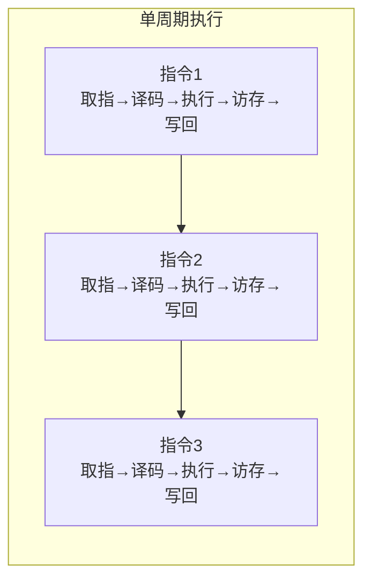
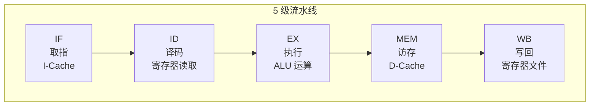
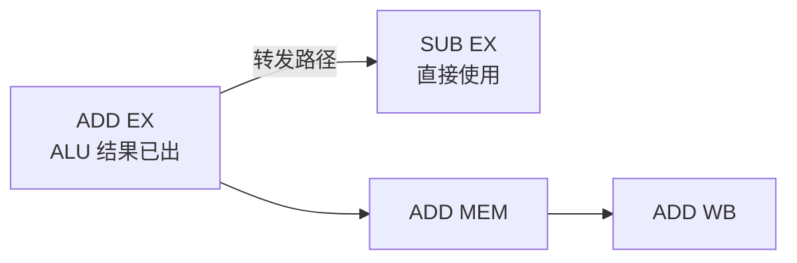
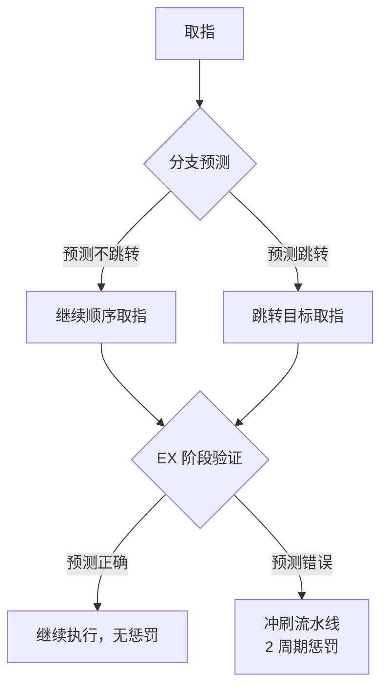

# 流水线基础

> 如果把 CPU 比作一家工厂，流水线就是让不同工位同时开工的秘诀。理解流水线如何运作、哪里会"堵车"、如何疏通，是读懂现代处理器微架构的第一课。
>
> **工程师视角**：流水线冒险不只是考试题——在写内核自旋锁或设备驱动时，你的代码会直接在流水线上执行。Load-Use 冒险导致的停顿、分支预测失败导致的刷新，都会转化为可测量的性能损失。理解这些机制，才能写出"对流水线友好"的代码。

---

## 1. 单周期处理器：最简单的起点

单周期处理器就像一间手工作坊——来一件活，做完一件，再做下一件。每条指令在一个时钟周期内完成全部操作：



| 优点 | 缺点 |
|------|------|
| 设计简单，CPI = 1 | 时钟频率被最慢的指令（访存）拖垮 |
| 每条指令一个周期完成，无冒险问题 | 硬件利用率极低，大部分部件在空转 |

> **关键洞察：** 时钟周期 = 最慢指令的延迟。`ADD` 早就做完了，但必须等 `LW` 访存结束才能进入下一周期。这就像等最慢的工人下班，全厂才能打卡。

---

## 2. 经典 5 级流水线：让工厂流动起来

5 级流水线把指令拆成 5 个工位，不同指令的不同工位可以重叠执行：



### 2.1 流水线时序：从串行到并行

```
周期:    1     2     3     4     5     6     7
指令1:  [IF]  [ID]  [EX]  [MEM] [WB]
指令2:        [IF]  [ID]  [EX]  [MEM] [WB]
指令3:              [IF]  [ID]  [EX]  [MEM] [WB]
指令4:                    [IF]  [ID]  [EX]  [MEM] [WB]
指令5:                          [IF]  [ID]  [EX]  [MEM] [WB]

稳态吞吐量: 每周期完成 1 条指令 (CPI ≈ 1)
```

> **类比：** 就像汽车工厂的流水线，第 5 辆车的底盘正在焊接时，第 4 辆正在喷漆，第 3 辆正在装发动机……同一时刻，5 辆车在不同工位上同时推进。

### 2.2 每个阶段的具体工作

| 阶段 | 操作 | 关键硬件 | 类比 |
|------|------|----------|------|
| **IF** | PC → I-Cache 地址；取指令；PC+4 | PC 寄存器、I-Cache、加法器 | 仓库取零件 |
| **ID** | 指令译码；读寄存器文件；生成立即数；分支判断 | 译码器、寄存器文件、比较器 | 看懂图纸 |
| **EX** | ALU 运算；计算访存地址；计算跳转目标 | ALU、加法器、多路选择器 | 实际加工 |
| **MEM** | 访问 D-Cache（仅 load/store） | D-Cache | 质量检测 |
| **WB** | 将结果写回寄存器文件 | 寄存器文件写端口 | 入库登记 |

### 2.3 流水线寄存器：工位间的传送带

相邻阶段之间需要流水线寄存器来传递数据，就像工位间的传送带：

```
[IF/ID 寄存器] → 保存：指令、PC+4、立即数
[ID/EX 寄存器] → 保存：操作数、ALU 控制信号、立即数、目标寄存器
[EX/MEM 寄存器] → 保存：ALU 结果、写入数据、访存控制信号
[MEM/WB 寄存器] → 保存：ALU 结果、加载的数据、写回目标
```

> **注意：** 流水线寄存器带来了额外的延迟和面积开销，但换来了吞吐量的大幅提升。这是典型的"用空间换时间"。

---

## 3. 数据冒险（Data Hazard）：零件还没到

### 3.1 RAW（Read After Write）——最常见的冒险

后续指令需要读取前序指令的结果，但前序指令还没写回：

```asm
add  t0, t1, t2    # 结果在第 5 周期 WB 阶段写回 t0
sub  t3, t0, t4    # 第 3 周期 EX 阶段就需要 t0 → 数据冒险！
```

```
周期:    1     2     3     4     5
ADD:    [IF]  [ID]  [EX]  [MEM] [WB] ← t0 在此写回
SUB:          [IF]  [ID]  [EX]  [MEM] [WB]
                   ↑
              需要 t0，但 t0 还在 MEM 阶段！
```

### 3.2 解决方案 1：转发（Forwarding / Bypassing）

不等写回，直接从流水线寄存器中拿结果：



```
转发路径:
  EX → EX:  EX/MEM 寄存器 → ID/EX 寄存器（ALU 结果直接给下一条）
  MEM → EX: MEM/WB 寄存器 → ID/EX 寄存器（Load 后第二条可用）
```

> **类比：** 装配线上，A 工位刚焊好的零件还没入库，B 工位就直接从传送带上拿走了，不用等入库再出库。

### 3.3 解决方案 2：流水线停顿（Stall / Bubble）

Load-Use 冒险无法完全通过转发解决——因为数据在 MEM 阶段结束才可用：

```asm
lw   t0, 0(sp)     # 数据在第 4 周期 MEM 结束才从 D-Cache 读出
sub  t3, t0, t4    # 第 3 周期 EX 就需要 t0 → 必须停顿 1 周期
```

```
周期:    1     2     3     4     5     6     7
LW:     [IF]  [ID]  [EX]  [MEM] [WB]
SUB:          [IF]  [ID]  [气泡] [EX]  [MEM] [WB]
                            ↑
                      插入气泡，等待 LW 的 MEM 结果
                      然后从 MEM/WB 转发到 EX
```

> **气泡是什么？** 就是让 SUB 在 ID 阶段多待一周期，向 EX 阶段推送一个空操作（NOP）。就像高速公路上前方堵车，你踩一脚刹车，等疏通了再走。

### 3.4 解决方案 3：指令调度（编译器优化）

聪明的编译器会重排指令，把无关指令插到 Load-Use 之间：

```asm
# 原始代码（有 Load-Use 冒险，需要停顿）
lw   t0, 0(sp)
sub  t3, t0, t4    # 冒险！需要停顿
sw   t1, 4(sp)

# 编译器调度后（无冒险）
lw   t0, 0(sp)
add  s2, s3, s4    # 插入无关指令填充延迟槽
sub  t3, t0, t4    # 现在不需要停顿，t0 已经可用
sw   t1, 4(sp)
```

> **对系统软件工程师的意义：** 理解这一点后，你在写关键路径的内联汇编时，可以手动调度指令来避免 Load-Use 停顿，榨取最后一滴性能。

---

## 4. 控制冒险（Control Hazard）：走哪条路？

分支指令改变 PC，但分支结果在 EX 阶段才知道，此时已经取了 2 条可能无效的指令。

### 4.1 简单方案：始终停顿

```
周期:    1     2     3     4     5
BEQ:    [IF]  [ID]  [EX]  [MEM] [WB]
             [气泡] [气泡] [正确指令]
                     ↑
              等 EX 判断分支结果，2 周期浪费
```

### 4.2 分支预测：猜一条路先走



#### 静态预测：简单规则

| 策略 | 预测规则 | 准确率 | 适用场景 |
|------|----------|--------|----------|
| 预测不跳转 | 总是假设分支不发生 | ~60% | 简单处理器 |
| BTFN | 向后跳转预测跳转，向前预测不跳转 | ~80% | 循环友好 |

#### 动态预测：学习历史

| 预测器 | 原理 | 准确率 | 类比 |
|--------|------|--------|------|
| **1-bit 预测** | 记录上次结果，本次预测相同 | ~85% | 记仇：上次怎么选这次还怎么选 |
| **2-bit 饱和计数器** | 两次错误才改变预测 | ~90% | 固执：除非被连续打脸两次，否则不改 |
| **局部预测** | 每个分支独立的 2-bit 计数器 | ~93% | 因人而异 |
| **全局预测 (GShare)** | 基于全局分支历史 | ~95% | 看大势 |
| **TAGE** | 多种历史长度组合 | ~97%+ | 集大成者 |

```
2-bit 饱和计数器状态机:

  强不跳转(00) → 弱不跳转(01) → 弱跳转(10) → 强跳转(11)
       ↑                                                    ↓
       ← ← ← ← ← ← ← ← ← ← ← ← ← ← ← ← ← ← ← ← ← ←

  只有连续两次预测错误才改变方向
  → 对循环的最后一次退出有更好的容忍度
```

> **为什么 2-bit 比 1-bit 好？** 考虑一个循环执行 100 次：
> - 1-bit：最后一次退出会改变预测，下次进入循环时第一次就预测错误
> - 2-bit：需要连续两次错误才改变，循环退出只错一次，下次进入仍预测跳转

### 4.3 RISC-V 没有延迟分支

> **注意：** RISC-V **没有**延迟分支（delay slot）。MIPS 等早期 RISC 架构使用延迟分支，分支后的指令总是执行。RISC-V 认为这增加了硬件复杂性和编译器负担，因此放弃了这一设计。
>
> 对系统软件工程师来说，这意味着分支指令后面不需要填充 NOP，编译器也不需要为 delay slot 做复杂的指令调度。

---

## 5. 结构冒险（Structural Hazard）：抢同一个工具

当两条指令同时需要同一硬件资源时发生：

| 冒险场景 | 原因 | 解决方案 |
|----------|------|----------|
| 同时取指和取数 | 统一内存（冯诺依曼架构） | **哈佛架构**（I-Cache / D-Cache 分离） |
| 同时写回两个结果 | 寄存器文件只有一个写端口 | 增加写端口 / 流水线停顿 |
| 同时访问 Cache | 多条指令争用 | 多端口 Cache / Bank 化 |

> **RISC-V 的设计优势：** Load-Store 架构使得 MEM 阶段只有 load/store 指令需要访问 D-Cache，ALU 指令直接跳过 MEM，大大减少了结构冒险的发生。这是 RISC-V 比 CISC 更容易实现高性能流水线的重要原因。

---

## 6. 流水线性能分析：量化你的优化

### 6.1 CPI 计算

```
理想 CPI = 1（每周期完成 1 条指令）

实际 CPI = 1 + 停顿周期数 / 总指令数

停顿来源:
  - 数据冒险停顿（Load-Use）
  - 控制冒险停顿（分支预测失败）
  - 结构冒险停顿（资源冲突）
  - Cache 缺失停顿（最致命）
```

### 6.2 加速比

```
加速比 = 流水线深度 × 效率

理想加速比 = 流水线级数（5 级 → 5 倍）
实际加速比 < 理想值（因为冒险停顿和流水线寄存器开销）
```

> **实战思考：** 当你优化一段内核代码时，如果能减少分支预测失败率 1%，在 4-wide 超标量处理器上可能带来 2-3% 的整体性能提升。理解微架构，才能写出对 CPU "友好" 的代码。

---

## 小结

| 要点 | 说明 |
|------|------|
| 5 级流水线 | IF → ID → EX → MEM → WB，稳态 CPI ≈ 1 |
| 数据冒险 | RAW 最常见，转发解决大部分，Load-Use 需停顿 |
| 控制冒险 | 分支预测是关键，2-bit 饱和计数器是基础 |
| 结构冒险 | 哈佛架构（I/D Cache 分离）是标准解决方案 |
| RISC-V 无延迟分支 | 简化了编译器和硬件设计 |

→ 下一节：[高级微架构](./advanced-microarchitecture.md)
