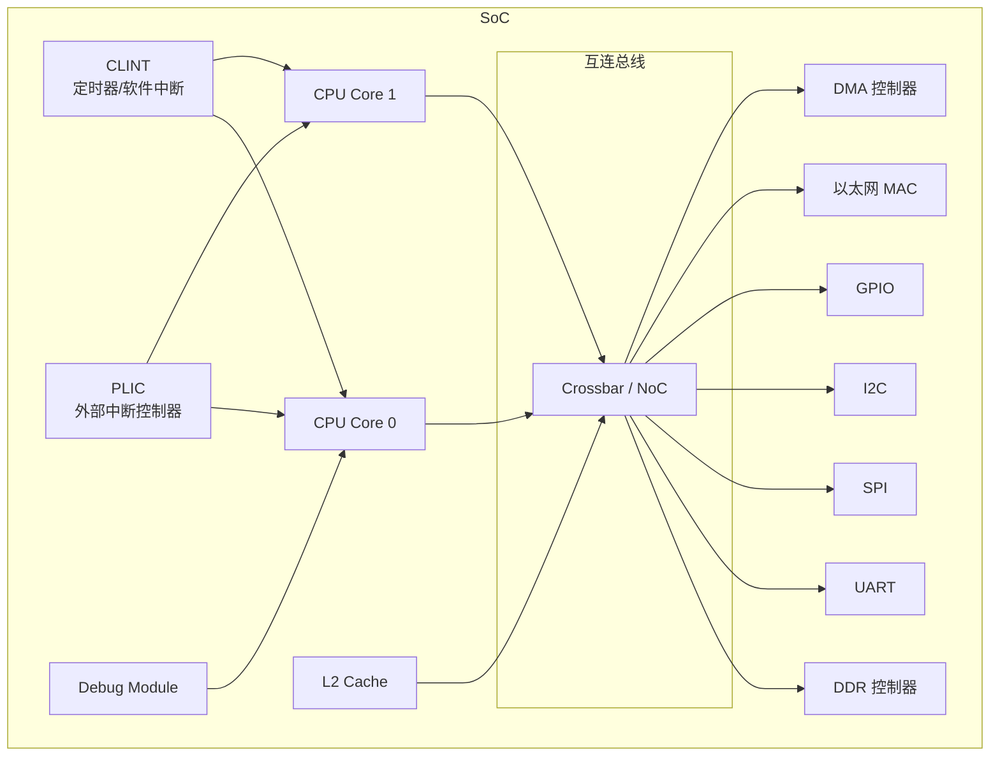
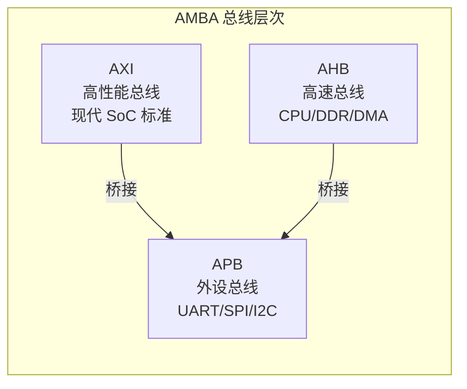
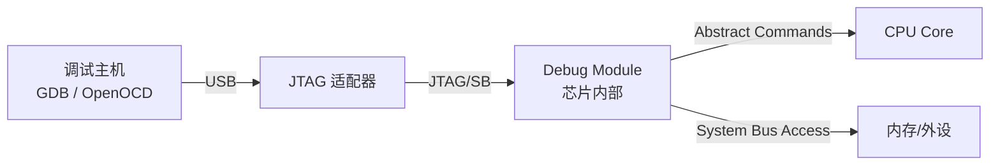

# SoC 与系统设计

> CPU 核心只是 SoC 的一部分。总线协议、中断控制器、调试接口等系统级设计同样重要。对系统软件工程师来说，理解 SoC 架构是写好固件和驱动的前提。
>
> **工程师视角**：SoC 设计决定了固件的上限。一个设计良好的中断控制器（如 AIA）可以让 Linux 驱动简洁高效；一个设计糟糕的总线交叉开关可能导致不可预测的延迟抖动。作为系统软件工程师，你虽然不改 RTL，但你需要能读懂设备树和地址映射，能在仿真环境中验证软件行为，能在 bring-up 阶段定位"是硬件问题还是软件问题"。

---

## 1. SoC 的组成：一座微型城市



> **类比：** SoC 就像一座微型城市。CPU 是市政府（做决策），总线是道路网（运输数据），外设是各种公共设施（UART 是邮局，DDR 是仓库，DMA 是物流公司）。固件工程师就是这座城市的"交通规划师"，要确保数据能高效、有序地流动。

---

## 2. 总线协议：SoC 的"道路系统"

### 2.1 AMBA 总线家族（ARM 定义，RISC-V 广泛使用）



| 协议 | 特点 | 带宽 | 典型连接 | 类比 |
|------|------|------|----------|------|
| **AXI4** | 5 通道（读地址/读数据/写地址/写数据/写响应），支持乱序 | 高 | CPU ↔ L2、DDR、DMA | 高速公路 |
| **AHB** | 单总线，简单 | 中 | CPU ↔ 外设（旧设计） | 国道 |
| **APB** | 最简单，无突发 | 低 | UART、I2C、GPIO | 乡间小路 |

### 2.2 AXI4 通道结构

```
AXI4 的 5 个独立通道:

  写操作:
    AW (Write Address)  → 主机发送写地址
    W  (Write Data)     → 主机发送写数据
    B  (Write Response) → 从机返回写响应

  读操作:
    AR (Read Address)   → 主机发送读地址
    R  (Read Data)      → 从机返回读数据

  每个通道独立握手:
    VALID → 主机有效时拉 VALID
    READY → 从机准备好时拉 READY
    传输发生在 VALID && READY 时
```

> **对固件工程师的意义：** 调试 DMA 或设备驱动时，如果看到 AXI 总线挂死，通常是 VALID/READY 握手没对上。用逻辑分析仪抓总线信号，看哪个通道的 VALID 一直高但 READY 没响应，就能定位问题。

### 2.3 TileLink（RISC-V 生态总线）

TileLink 是 Rocket Chip 使用的缓存一致性总线协议：

| 特性 | TileLink | AXI |
|------|----------|-----|
| 一致性 | 原生支持（MESI） | 需要额外 ACE 扩展 |
| 复杂度 | 较高 | 中等 |
| 生态 | RISC-V/Chisel 生态 | 行业标准，广泛使用 |
| 适用 | 多核 Cache 一致性系统 | 通用 SoC 互连 |

> **选择建议：** 如果你在用 Rocket Chip 或香山，大概率会遇到 TileLink。如果是商业 SoC 或自己搭系统，AXI4 是更通用的选择。

---

## 3. 中断控制器：SoC 的"应急调度中心"

### 3.1 CLINT（Core Local Interruptor）：本地事务

| 属性 | 说明 |
|------|------|
| 位置 | 每个核心私有 |
| 中断源 | 软件中断 (MSIP) + 定时器中断 (MTIMER) |
| 寄存器 | msip, mtime, mtimecmp |
| 特点 | 简单，无需 Claim/Complete |

> **类比：** CLINT 就像每个核心自带的闹钟和内线电话。定时器中断是闹钟，软件中断（IPI）是内线电话，一个核心可以"打电话"唤醒另一个核心。

### 3.2 PLIC（Platform-Level Interrupt Controller）：全局调度

| 属性 | 说明 |
|------|------|
| 位置 | 全局共享 |
| 中断源 | 外部设备（1-1023） |
| 优先级 | 0-7（0=禁用） |
| 上下文 | 每个核心的每个特权级各一个 |
| 流程 | Claim → 处理 → Complete |

> **Claim/Complete 机制：**
> - **Claim：** CPU 读取 PLIC 的 claim 寄存器，获取当前最高优先级的中断 ID。PLIC 同时标记该中断为"处理中"，防止其他核心重复处理。
> - **Complete：** CPU 处理完中断后，写入相同的 ID 到 complete 寄存器，PLIC 才允许该中断再次触发。
>
> **类比：** 就像医院的分诊台。病人（中断）来了，护士（PLIC）按优先级分配。医生（CPU）看完病后，要告诉护士"我看完了"，护士才允许这个病人下次再来。

### 3.3 AIA（Advanced Interrupt Architecture）：下一代中断系统

| 属性 | 说明 |
|------|------|
| 中断信号 | MSI（消息信号中断） |
| 优先级 | 0-255 |
| 核心组件 | IMSIC（每核中断控制器）+ APLIC（有线中断转换） |
| 虚拟化 | 原生支持 Guest 中断文件 |

> AIA 详细内容请参考 [RISC-V AIA 完全指南](../aia/riscv-aia-notes.md)
>
> **对服务器固件工程师的意义：** AIA 是服务器级 RISC-V 的标配。相比 PLIC，AIA 支持 MSI（类似 PCIe 的消息中断），优先级更多，虚拟化支持更好。如果你的 SoC 用了 AIA，固件需要初始化 IMSIC 和 APLIC，而不是 PLIC。

---

## 4. 调试接口：SoC 的"黑匣子"

### 4.1 RISC-V Debug 规范



| 组件 | 功能 | 对固件调试的意义 |
|------|------|----------------|
| **Debug Module (DM)** | 芯片内的调试模块，通过 JTAG 访问 | 芯片 bring-up 时，DM 是唯一的"救命稻草" |
| **Debug Transport Module (DTM)** | JTAG/SB 到 DM 的桥接 | 选择 JTAG 还是 Serial Bus 调试 |
| **触发器 (Trigger)** | 硬件断点、数据观察点 | 调试启动代码时，硬件断点比软件断点更可靠 |

### 4.2 调试功能

| 功能 | 说明 | CSR | 使用场景 |
|------|------|-----|----------|
| **单步执行** | 每条指令后暂停 | dcsr.step | 逐条跟踪启动代码 |
| **硬件断点** | PC 匹配时暂停 | tdata1/tdata2 | 调试 ROM/OpenSBI 代码 |
| **数据观察点** | 内存访问时暂停 | tdata1/tdata2 | 追踪非法内存访问 |
| **系统总线访问** | 直接读写内存/外设 | 通过 DM 的 SB 寄存器 | 芯片挂死时读取状态 |
| **抽象命令** | 读写寄存器、执行小程序 | abstractauto/command | 快速查看寄存器状态 |
| **触发器链** | 多个触发器组合 | tdata1.chain | 复杂条件断点 |

### 4.3 JTAG 信号

| 信号 | 方向 | 功能 |
|------|------|------|
| TCK | → | 时钟 |
| TMS | → | 状态机选择 |
| TDI | → | 数据输入 |
| TDO | ← | 数据输出 |
| TRST | → | 复位（可选） |

> **调试技巧：** 芯片刚流片回来，如果串口没输出，第一件事就是用 JTAG 连接，检查：
> 1. PC 是否在预期的启动地址（如 0x1000）
> 2. 通用寄存器是否被正确初始化
> 3. 是否能通过系统总线访问内存（验证总线是否正常）

---

## 5. 时钟与复位：SoC 的"心跳与重启"

### 5.1 时钟系统

```
典型时钟树:

  晶振 (24 MHz)
    └── PLL
         ├── CPU 时钟 (1 GHz)
         ├── L2 Cache 时钟 (500 MHz)
         ├── AXI 总线时钟 (250 MHz)
         └── APB 外设时钟 (100 MHz)
```

> **对固件工程师的意义：** 时钟初始化是启动代码的关键部分。通常 PLL 配置在 M-mode 完成，然后逐步释放各模块的时钟门控。如果某个外设不工作，先检查它的时钟是否使能。

### 5.2 复位策略

| 复位类型 | 触发方式 | 影响范围 | 固件处理 |
|----------|----------|----------|----------|
| **上电复位 (POR)** | 电源上电 | 整个芯片 | 完整启动流程 |
| **硬复位** | 复位引脚 | 整个芯片 | 完整启动流程 |
| **软复位** | 软件触发 | CPU + 部分外设 | 保留部分状态，快速重启 |
| **局部复位** | 模块级 | 单个外设 | 重新初始化该外设 |

---

## 6. 低功耗设计：SoC 的"睡眠模式"

### 6.1 RISC-V 的低功耗机制

| 机制 | 指令/CSR | 说明 | 固件控制 |
|------|----------|------|----------|
| **WFI** | `wfi` 指令 | 等待中断，核心进入低功耗状态 | 空闲循环中使用 |
| **时钟门控** | 硬件实现 | 空闲模块关闭时钟 | 通过寄存器配置 |
| **电源门控** | 硬件实现 | 空闲模块断电 | 需要保存/恢复状态 |
| **DVFS** | 软件控制 | 动态电压频率调节 | 根据负载调整 |

### 6.2 WFI 的使用

```asm
# CPU 空闲时进入低功耗
idle_loop:
    wfi                    # 等待中断，核心进入低功耗
    j    idle_loop         # 中断返回后继续等待

# 中断处理程序会自动唤醒 WFI
```

> **注意：** WFI 不是完全断电，只是停止时钟。如果需要更深的睡眠（保存状态、断电），需要 SoC 特定的电源管理单元（PMU）配合。

---

## 7. 实战：Bring-up 一个新 SoC

当你拿到一块新的 RISC-V SoC 时，典型的 bring-up 流程：

```
1. 确认 JTAG 连接正常
   → 能扫描到 DTM，能读写 DM 寄存器

2. 确认时钟和复位
   → 用 JTAG 读取时钟状态寄存器，确认 PLL 锁定

3. 确认内存访问
   → 通过系统总线访问 DDR，读写测试

4. 加载并运行最小固件
   → 一个只做 UART 输出的程序，验证指令执行

5. 初始化中断控制器
   → 配置 CLINT/PLIC，验证定时器中断

6. 启用 MMU（如果是 Linux 平台）
   → 建立页表，验证虚拟地址访问

7. 启动多核（如果是 SMP）
   → 配置 IPI，启动 secondary cores

8. 加载操作系统
   → 通过 SBI 启动 Linux/RTOS
```

---

## 小结

| 要点 | 说明 | 固件关注点 |
|------|------|-----------|
| AXI 是主流总线 | 5 通道，高性能，广泛使用 | 调试握手信号 |
| CLINT 管理本地中断 | 软件中断 + 定时器 | 初始化 mtimecmp |
| PLIC 管理外部中断 | 优先级 + Claim/Complete | 配置优先级和使能 |
| AIA 是服务器方向 | MSI + 虚拟化 | 初始化 IMSIC/APLIC |
| Debug Module | JTAG 调试，支持断点和总线访问 | Bring-up 必备 |
| WFI 低功耗 | 等待中断时进入低功耗 | 空闲循环中使用 |

→ 下一节：[汇编与底层编程](../05-system-software/assembly-and-abi.md)
