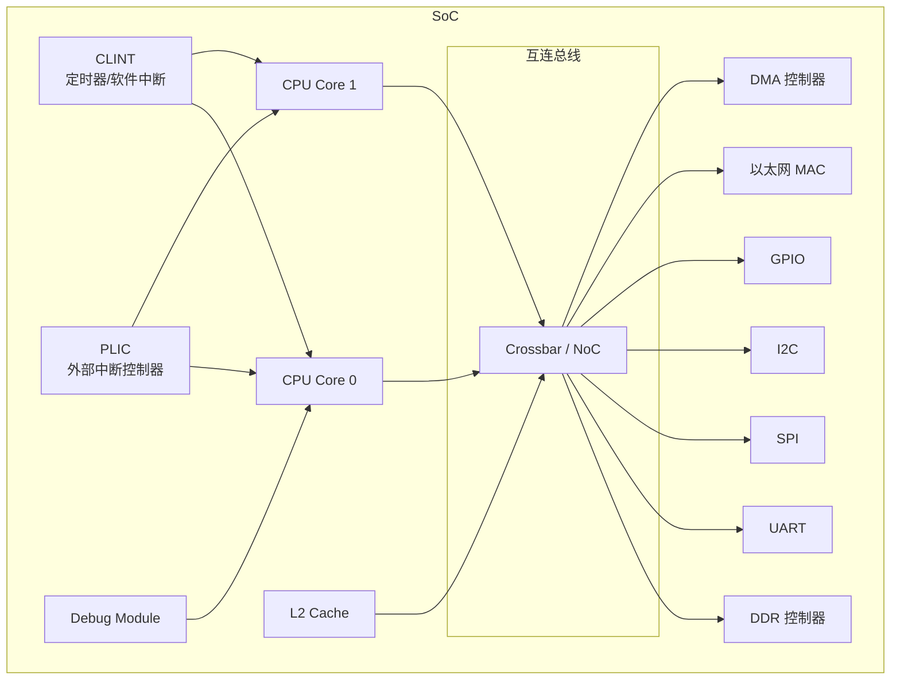
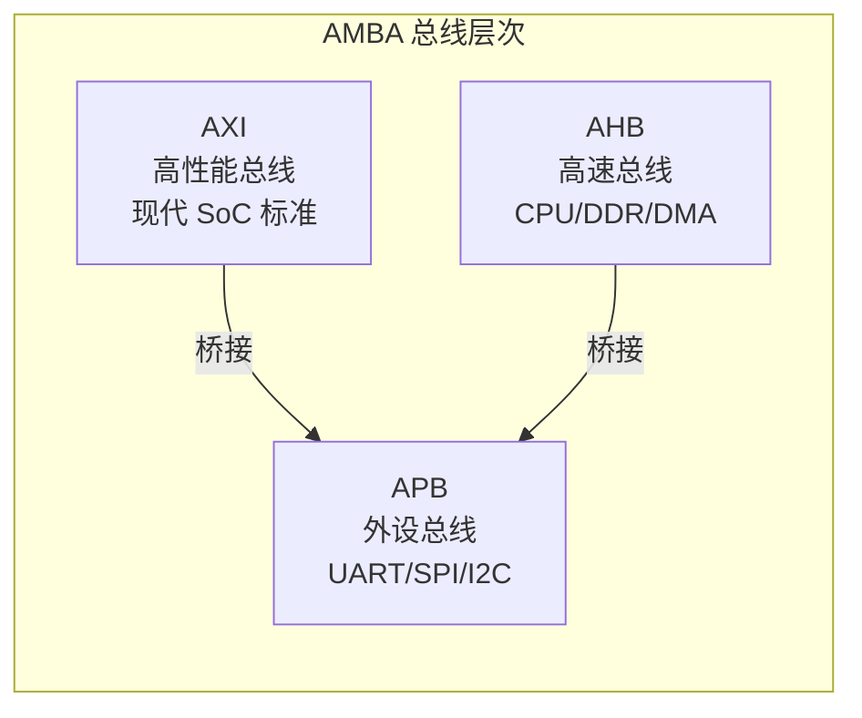
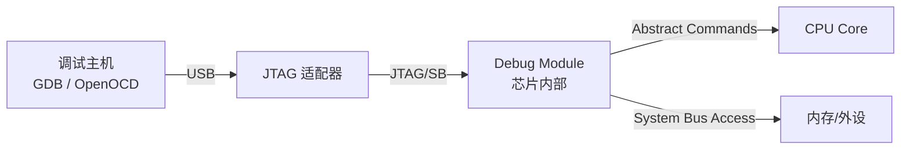

# SoC 与系统设计

> CPU 核心只是 SoC 的一部分。总线协议、中断控制器、调试接口等系统级设计同样重要。

---

## 1. SoC 的组成



---

## 2. 总线协议

### 2.1 AMBA 总线家族（ARM 定义，RISC-V 广泛使用）



| 协议 | 特点 | 带宽 | 典型连接 |
|------|------|------|----------|
| **AXI4** | 5 通道（读地址/读数据/写地址/写数据/写响应），支持乱序 | 高 | CPU ↔ L2、DDR、DMA |
| **AHB** | 单总线，简单 | 中 | CPU ↔ 外设（旧设计） |
| **APB** | 最简单，无突发 | 低 | UART、I2C、GPIO |

### 2.2 AXI4 通道结构

```
AXI4 的 5 个独立通道:

  写操作:
    AW (Write Address)  → 主机发送写地址
    W  (Write Data)     → 主机发送写数据
    B  (Write Response) → 从机返回写响应

  读操作:
    AR (Read Address)   → 主机发送读地址
    R  (Read Data)      → 从机返回读数据

  每个通道独立握手:
    VALID → 从机准备好时拉 READY
    READY → 主机有效时拉 VALID
```

### 2.3 TileLink（RISC-V 生态总线）

TileLink 是 Rocket Chip 使用的缓存一致性总线协议：

| 特性 | TileLink | AXI |
|------|----------|-----|
| 一致性 | 原生支持（MESI） | 需要额外 ACE 扩展 |
| 复杂度 | 较高 | 中等 |
| 生态 | RISC-V/Chisel 生态 | 行业标准，广泛使用 |
| 适用 | 多核 Cache 一致性系统 | 通用 SoC 互连 |

---

## 3. 中断控制器

### 3.1 CLINT（Core Local Interruptor）

| 属性 | 说明 |
|------|------|
| 位置 | 每个核心私有 |
| 中断源 | 软件中断 (MSIP) + 定时器中断 (MTIMER) |
| 寄存器 | msip, mtime, mtimecmp |
| 特点 | 简单，无需 Claim/Complete |

### 3.2 PLIC（Platform-Level Interrupt Controller）

| 属性 | 说明 |
|------|------|
| 位置 | 全局共享 |
| 中断源 | 外部设备（1-1023） |
| 优先级 | 0-7（0=禁用） |
| 上下文 | 每个核心的每个特权级各一个 |
| 流程 | Claim → 处理 → Complete |

### 3.3 AIA（Advanced Interrupt Architecture）

| 属性 | 说明 |
|------|------|
| 中断信号 | MSI（消息信号中断） |
| 优先级 | 0-255 |
| 核心组件 | IMSIC（每核中断控制器）+ APLIC（有线中断转换） |
| 虚拟化 | 原生支持 Guest 中断文件 |

> AIA 详细内容请参考 [RISC-V AIA 完全指南](../aia/riscv-aia-notes.md)

---

## 4. 调试接口

### 4.1 RISC-V Debug 规范



| 组件 | 功能 |
|------|------|
| **Debug Module (DM)** | 芯片内的调试模块，通过 JTAG 访问 |
| **Debug Transport Module (DTM)** | JTAG/SB 到 DM 的桥接 |
| **触发器 (Trigger)** | 硬件断点、数据观察点 |

### 4.2 调试功能

| 功能 | 说明 | CSR |
|------|------|-----|
| **单步执行** | 每条指令后暂停 | dcsr.step |
| **硬件断点** | PC 匹配时暂停 | tdata1/tdata2 |
| **数据观察点** | 内存访问时暂停 | tdata1/tdata2 |
| **系统总线访问** | 直接读写内存/外设 | 通过 DM 的 SB 寄存器 |
| **抽象命令** | 读写寄存器、执行小程序 | abstractauto/command |
| **触发器链** | 多个触发器组合 | tdata1.chain |

### 4.3 JTAG 信号

| 信号 | 方向 | 功能 |
|------|------|------|
| TCK | → | 时钟 |
| TMS | → | 状态机选择 |
| TDI | → | 数据输入 |
| TDO | ← | 数据输出 |
| TRST | → | 复位（可选） |

---

## 5. 时钟与复位

### 5.1 时钟系统

```
典型时钟树:

  晶振 (24 MHz)
    └── PLL
         ├── CPU 时钟 (1 GHz)
         ├── L2 Cache 时钟 (500 MHz)
         ├── AXI 总线时钟 (250 MHz)
         └── APB 外设时钟 (100 MHz)
```

### 5.2 复位策略

| 复位类型 | 触发方式 | 影响范围 |
|----------|----------|----------|
| **上电复位 (POR)** | 电源上电 | 整个芯片 |
| **硬复位** | 复位引脚 | 整个芯片 |
| **软复位** | 软件触发 | CPU + 部分外设 |
| **局部复位** | 模块级 | 单个外设 |

---

## 6. 低功耗设计

### 6.1 RISC-V 的低功耗机制

| 机制 | 指令/CSR | 说明 |
|------|----------|------|
| **WFI** | `wfi` 指令 | 等待中断，核心进入低功耗状态 |
| **WFE** | `wfi` + 事件 | 等待事件唤醒 |
| **时钟门控** | 硬件实现 | 空闲模块关闭时钟 |
| **电源门控** | 硬件实现 | 空闲模块断电 |
| **DVFS** | 软件控制 | 动态电压频率调节 |

### 6.2 WFI 的使用

```asm
# CPU 空闲时进入低功耗
idle_loop:
    wfi                    # 等待中断，核心进入低功耗
    j    idle_loop         # 中断返回后继续等待

# 中断处理程序会自动唤醒 WFI
```

---

## 小结

| 要点 | 说明 |
|------|------|
| AXI 是主流总线 | 5 通道，高性能，广泛使用 |
| CLINT 管理本地中断 | 软件中断 + 定时器 |
| PLIC 管理外部中断 | 优先级 + Claim/Complete |
| Debug Module | JTAG 调试，支持断点和总线访问 |
| WFI 低功耗 | 等待中断时进入低功耗状态 |

→ 下一节：[汇编与底层编程](../05-system-software/assembly-and-abi.md)
