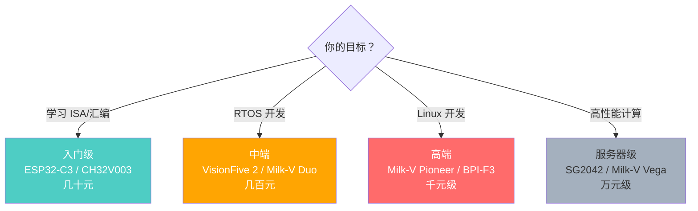
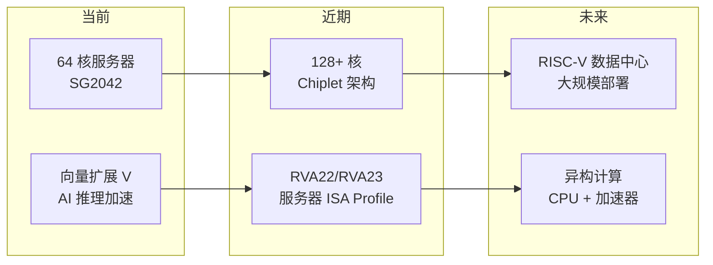
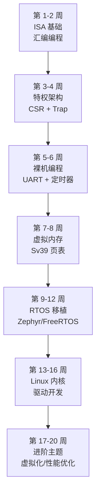

# 硬件平台与前沿方向

> 从开发板选型到前沿研究，RISC-V 生态正在快速演进。了解硬件平台和未来方向，有助于规划学习和职业路径。
>
> **工程师视角**：选择硬件平台不是"买最贵的"，而是"买最适合当前阶段的"。入门时 ESP32-C3 足够理解指令集；做 Linux 驱动开发时需要 VisionFive 2；而调试服务器级芯片的固件问题，QEMU 往往比真实硬件更高效。

---

## 1. 开发板选型

### 1.1 按需求选择



### 1.2 入门级开发板

| 开发板 | 核心 | ISA | 价格 | 特点 |
|--------|------|-----|------|------|
| **ESP32-C3** | ESP32-C3 | RV32IMAC | ~20 元 | WiFi/BLE，Arduino 兼容，生态好 |
| **CH32V003** | QingKe V2A | RV32EC | ~5 元 | 极便宜，适合纯入门 |
| **CH32V307** | QingKe V4F | RV32IMAC | ~30 元 | 丰富外设，USB OTG |
| **SiFive HiFive1 Rev B** | FE310 | RV32IMAC | ~$59 | 官方开发板，Arduino 兼容 |
| **Longan Nano** | GD32VF103 | RV32IMAC | ~$5 | 类 STM32，有 LCD |

### 1.3 中高端开发板

| 开发板 | 核心 | ISA | 价格 | 特点 |
|--------|------|-----|------|------|
| **VisionFive 2** | JH7110 (4×U74) | RV64GC | ~$80 | 最流行的 RISC-V SBC |
| **Milk-V Duo** | CV1800B | RV64GC + C906 | ~$9 | 超便宜，适合边缘 AI |
| **Milk-V Duo S** | SG2000 | RV64GC | ~$15 | Duo 升级版 |
| **LicheeRV Dock** | D1 | RV64GC | ~$30 | 带屏幕，适合便携项目 |
| **BPI-F3** | K1 (8×X60) | RV64GCV | ~$120 | 8 核，向量扩展 |

### 1.4 服务器级

| 开发板 | 核心 | 特点 |
|--------|------|------|
| **Milk-V Pioneer** | SG2042 (64×C920) | 64 核，4×DDR4，PCIe |
| **Milk-V Vega** | SG2042 | 服务器主板 |
| **DCU-R1** | 4×SG2042 | 256 核服务器 |

---

## 2. 实践项目建议

### 2.1 入门项目

| 项目 | 难度 | 学到什么 |
|------|------|----------|
| **裸机 Hello World** | ⭐ | 工具链、链接脚本、QEMU |
| **UART 驱动** | ⭐⭐ | 寄存器操作、轮询/中断 |
| **定时器中断** | ⭐⭐ | CLINT、CSR、trap 处理 |
| **简单调度器** | ⭐⭐⭐ | 上下文切换、栈管理 |

### 2.2 进阶项目

| 项目 | 难度 | 学到什么 |
|------|------|----------|
| **移植 FreeRTOS** | ⭐⭐⭐ | RTOS 架构、移植层 |
| **移植 Zephyr** | ⭐⭐⭐ | 设备树、驱动模型 |
| **实现虚拟内存** | ⭐⭐⭐⭐ | Sv39 页表、TLB、缺页处理 |
| **实现文件系统** | ⭐⭐⭐⭐ | VirtIO Block、块设备驱动 |

### 2.3 高级项目

| 项目 | 难度 | 学到什么 |
|------|------|----------|
| **实现简易 OS** | ⭐⭐⭐⭐⭐ | 全栈系统开发 |
| **实现简单 RISC-V 核心** | ⭐⭐⭐⭐ | 流水线、冒险处理 |
| **贡献 Linux 内核** | ⭐⭐⭐⭐⭐ | 内核社区、代码审查 |
| **贡献 OpenSBI** | ⭐⭐⭐⭐ | 固件开发、SBI 接口 |

---

## 3. 前沿方向

### 3.1 RISC-V 高性能计算



### 3.2 AI 加速器与自定义扩展

RISC-V 的最大优势之一是允许自定义指令扩展：

| 方向 | 说明 | 代表项目 |
|------|------|----------|
| **向量扩展 (V)** | 标准化的 SIMD 指令 | 已冻结，Linux 已支持 |
| **AI 自定义指令** | 针对推理/训练的专用指令 | 芯动科技、赛昉科技 |
| **密码学扩展** | 硬件加速加密算法 | Zkn/Zks/Zkg 系列 |
| **RoCC 协处理器** | Rocket Chip 自定义协处理器 | 学术研究 |

### 3.3 RISC-V 服务器与数据中心

| 里程碑 | 时间 | 说明 |
|--------|------|------|
| 64 核 SG2042 发布 | 2023 | 首款商用 RISC-V 服务器芯片 |
| RVA22 Profile 发布 | 2023 | 服务器 ISA 标准化 |
| Android RISC-V | 2024 | Google 官方支持 |
| RVA23 Profile | 2024 | 向量扩展标准化 |
| 大规模数据中心部署 | 2025+ | 预期 |

### 3.4 Chiplet 与 RISC-V

```
传统 SoC:
  [CPU] [GPU] [NPU] [IO]  ← 单片集成，制程统一

Chiplet:
  [CPU (3nm)] ─┐
  [GPU (5nm)] ─┤── 互连 (UCIe) ── 封装
  [IO (12nm)] ─┘

  RISC-V 的优势:
  - 不同 Chiplet 可以使用不同的 RISC-V 核心配置
  - 自定义扩展 Chiplet 更容易集成
  - 开源 IP 降低 Chiplet 开发门槛
```

### 3.5 安全与可信计算

| 方向 | RISC-V 机制 | 说明 |
|------|-------------|------|
| **TEE** | PMP + M-mode | 可信执行环境 |
| **安全启动** | M-mode 验证 | Chain of Trust |
| **内存加密** | 硬件加密引擎 | 加密内存访问 |
| **侧信道防护** | 实现相关 | Flush+Reload, Spectre 防御 |

---

## 4. 学习路线建议

### 4.1 系统软件工程师路线



### 4.2 每个阶段的产出与对应文档

| 阶段 | 产出 | 验证方式 | 参考文档 |
|------|------|----------|----------|
| ISA 基础 | 能读懂 RISC-V 汇编 | objdump 反汇编分析 | [01-ISA 基础](../01-isa-basics/) |
| 特权架构 | 能写 trap 处理程序 | QEMU 运行裸机代码 | [03-特权架构](../03-privileged/) |
| 裸机编程 | 能实现 UART 输出和定时器 | QEMU/开发板运行 | [Lab 1](../08-labs/lab01-baremetal-trap-handler.md) |
| 虚拟内存 | 能建立页表并启用 MMU | 虚拟地址访问成功 | [Lab 3](../08-labs/lab03-sv39-page-table.md) |
| RTOS 移植 | 能在 RISC-V 上运行 RTOS | 多任务调度正常 | [05-OS 移植](./os-porting.md) |
| Linux 内核 | 能编写简单驱动 | insmod 加载运行 | [05-OS 移植](./os-porting.md) |
| 虚拟化 | 能运行带 KVM 的 VM | 两阶段地址翻译成功 | [Lab 4](../08-labs/lab04-h-extension-two-stage-mmu.md) |

---

## 5. 社区与资源

| 资源 | 链接/说明 |
|------|-----------|
| **RISC-V International** | https://riscv.org |
| **RISC-V GitHub** | https://github.com/riscv |
| **RISC-V 邮件列表** | lists.riscv.org — 技术讨论主阵地 |
| **PLCT Lab** | https://github.com/plctlab — 中国团队贡献 |
| **RISC-V 中国社区** | 微信群、知乎专栏 |
| **香山社区** | https://github.com/OpenXiangShan |
| **OSPP 开源之夏** | 每年有 RISC-V 相关项目 |

---

## 6. 如何为这份笔记做贡献

这份笔记采用"理论 + 实战"的双轨结构。如果你发现内容有误或希望补充：

1. **理论修正**：ISA 规范以 [RISC-V 官方 Spec](https://riscv.org/technical/specifications/) 为准，特权架构以最新 Ratified 版本为准
2. **实战补充**：Lab 案例需要能在 QEMU 7.0+ 上直接运行，附 Makefile 和预期输出
3. **硬件验证**：真实硬件上的测试结果请注明开发板型号和固件版本

---

## 小结

| 要点 | 说明 |
|------|------|
| 开发板从便宜的开始 | ESP32-C3 / CH32V003 足够入门 |
| QEMU 是最佳练习平台 | 零成本，支持所有功能 |
| 自定义扩展是杀手锏 | 这是 x86/ARM 做不到的 |
| 服务器是未来方向 | RVA22/RVA23 Profile 标准化 |
| 实践比看文档更重要 | 每个阶段都要有可运行的产出 |
| 文档交叉引用 | 各章节通过 Lab 案例形成知识网络 |

→ 返回：[总览目录](../README.md)
