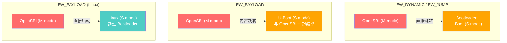
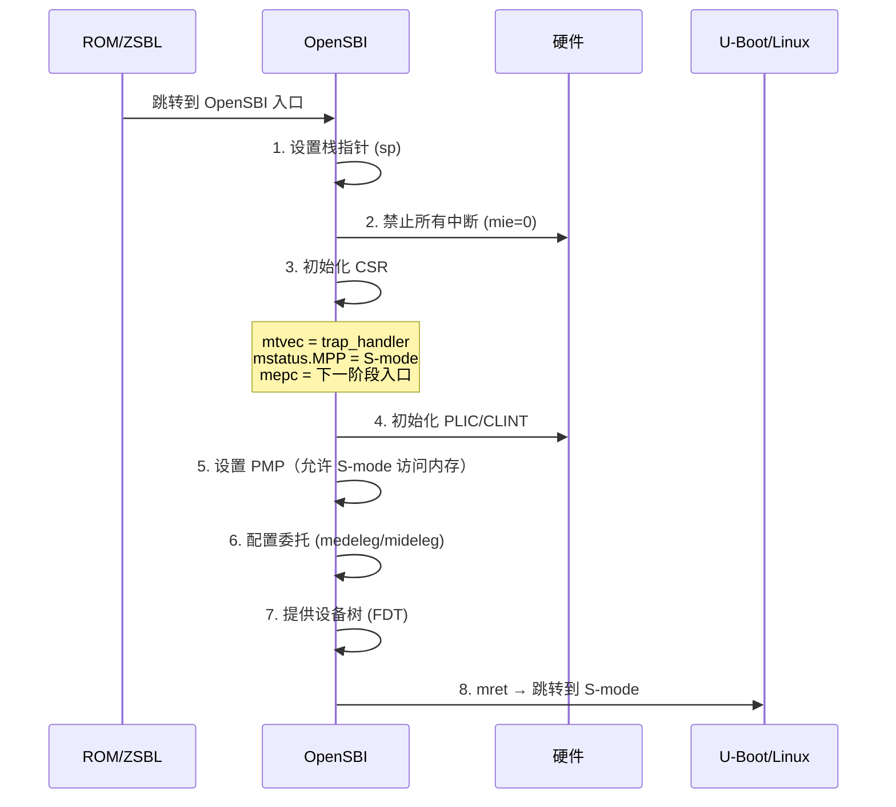
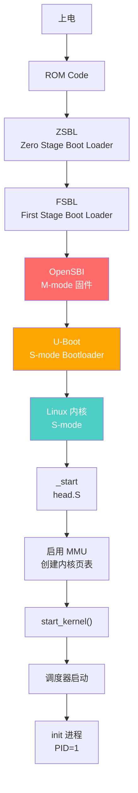
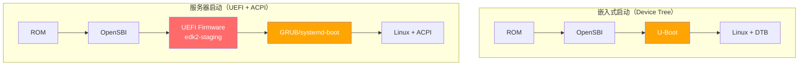
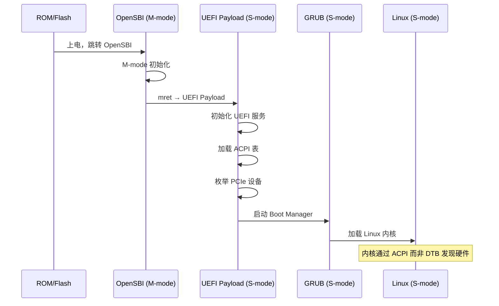

# 启动流程

> 从按下电源键到操作系统运行，RISC-V 的启动过程涉及固件、引导加载程序和内核的协作。理解启动流程是系统移植的第一步。
>
> **工程师视角**：启动流程不是"固定的顺序"，而是可配置的管道。在服务器 SoC 中，你可能需要从 SPI Flash 加载 Boot ROM → DDR 训练 → 加载 OpenSBI → 加载 U-Boot → 加载 Linux，任何一个环节出错都意味着"黑屏"。掌握每个阶段的调试技巧（如 JTAG 断点、串口早期输出）是 bring-up 工程师的核心竞争力。

### 学习目标

读完本文后，你将能够：

- **描述** RISC-V 从复位到 Linux 运行的完整四阶段启动链
- **理解** OpenSBI 三种运行模式（FW_DYNAMIC/FW_JUMP/FW_PAYLOAD）的适用场景
- **解释** SBI 的调用约定：a7=EID, a6=FID，以及 legacy 与新式扩展的区别
- **说明** 设备树（FDT）如何让同一份内核镜像适配不同硬件平台
- **对比** 嵌入式启动（DTB）与服务器启动（UEFI+ACPI）的差异
- **了解** Linux 内核在 head.S 中的早期初始化步骤：BSS 清零 → 页表建立 → MMU 使能

### 前置知识

| 需要了解 | 参考文档 |
|----------|----------|
| RISC-V 特权模式 M/S/U 划分与 CSR | [特权模式与 CSR](./03-privileged-modes-and-csr.md) |
| 页表建立与 MMU 使能（satp 配置） | [内存管理](./05-memory-management-pmp-sv39.md) |

---

## 1. 启动阶段总览


| 阶段 | 运行模式 | 典型软件 | 主要职责 |
|------|----------|----------|----------|
| **Stage 0** | M-mode | ROM Code | 最小初始化，加载固件 |
| **Stage 1** | M-mode | OpenSBI / U-Boot SPL | 硬件初始化，设置 M-mode CSR |
| **Stage 2** | M-mode → S-mode | U-Boot / GRUB | 加载内核，传递设备树 |
| **Stage 3** | S-mode | Linux / RTOS | 操作系统启动 |

---

## 2. 复位向量

RISC-V 没有固定的复位向量地址，由实现决定。常见配置：

| 平台 | 复位向量地址 | 说明 |
|------|-------------|------|
| QEMU virt | 0x1000 | QEMU 硬编码 |
| SiFive FU540 | 0x1004 | 从 ZSBL 跳转 |
| StarFive JH7110 | 0x18000000 | ROM 基地址 |
| 通用建议 | 0x80000000 | DRAM 起始地址 |

复位后 CPU 状态：

```
PC       = 复位向量地址
特权级    = M-mode
mstatus  = 0（所有中断禁止）
mie      = 0（所有中断禁止）
satp     = 0（裸模式，不使用虚拟内存）
所有 CSR = 实现定义的默认值
```

> **本节要点：** RISC-V 规范有意不固定复位向量地址，留给芯片设计者根据系统架构选择。但复位后的 CPU 状态是确定的——M-mode、中断全关、MMU 关闭。这个"裸 CPU"状态是所有固件的起点：OpenSBI 从这里接管，依次点亮硬件子系统，最终通过 mret 将 CPU 交给 S-mode 的 Linux。

---

## 3. OpenSBI：RISC-V 的标准固件

复位向量是硬件定义的起点，但 CPU 从这里能做的事情极其有限——需要初始化 DRAM、CSR、PMP，然后才能加载操作系统。在 RISC-V 生态中，OpenSBI 承担了这个角色，它是事实上的标准 M-mode 固件，类似于 x86 的 BIOS/UEFI。本章只建立全景；从启动汇编到 SBI 分发的寄存器级源码走读见 [OpenSBI 源码走读](./11-opensbi-source-walkthrough.md)。

### 3.1 OpenSBI 的三种运行模式



| 模式 | 特点 | 适用场景 |
|------|------|----------|
| **FW_DYNAMIC** | 启动参数由前一级传递，最灵活 | 通用，推荐 |
| **FW_JUMP** | 固定跳转地址 | 简单场景 |
| **FW_PAYLOAD** | OpenSBI 和下一阶段一起编译 | 嵌入式，减少启动步骤 |

### 3.2 OpenSBI 初始化流程



### 3.3 OpenSBI 的关键初始化代码

```c
// OpenSBI 初始化伪代码
void sbi_init(struct sbi_scratch *scratch) {
    // 1. 设置 trap 向量
    csr_write(CSR_MTVEC, &trap_entry);

    // 2. 禁止所有中断
    csr_write(CSR_MIE, 0);

    // 3. 设置 PMP — 允许 S-mode 访问所有内存
    csr_write(CSR_PMPADDR0, 0x3FFFFFFFFFFFFFFF);  // 整个地址空间（NAPOT 编码：-1 >> 2）
    csr_write(CSR_PMPCFG0, (PMP_A_NAPOT | PMP_R | PMP_W | PMP_X));

    // 4. 委托中断给 S-mode
    csr_write(CSR_MIDELEG,
        MIP_SSIE | MIP_STIE | MIP_SEIE);  // 软件/定时器/外部中断
    csr_write(CSR_MEDELEG,
        (1 << CAUSE_MISALIGNED_FETCH) |
        (1 << CAUSE_BREAKPOINT) |
        (1 << CAUSE_USER_ECALL) |
        (1 << CAUSE_FETCH_PAGE_FAULT) |
        (1 << CAUSE_LOAD_PAGE_FAULT) |
        (1 << CAUSE_STORE_PAGE_FAULT));

    // 5. 准备跳转到 S-mode
    unsigned long next_addr = scratch->next_addr;  // U-Boot/Linux 地址
    unsigned long next_mode = scratch->next_mode;  // S-mode

    csr_write(CSR_MEPC, next_addr);
    csr_write(CSR_MSTATUS,
        (csr_read(CSR_MSTATUS) & ~MSTATUS_MPP_MASK) |
        (next_mode << MSTATUS_MPP_SHIFT));

    // 6. 跳转
    sbi_hart_switch_mode(next_addr, next_mode);
}
```

> **本节要点：** OpenSBI 做的事情可以从它初始化的寄存器顺序中看出来：mtvec（先确定 trap 去哪）→ mie（关闭中断门）→ PMP（让 S-mode 能访问内存）→ mideleg/medeleg（把中断和异常的处理权交出去）→ mstatus.MPP + mepc（设置 mret 后的目的地）。这六步完成后，一个 mret 就让 CPU 从 M-mode 的"裸机环境"进入了 S-mode 的"操作系统环境"。FW_DYNAMIC 模式是服务器场景的首选，因为它允许前级固件动态传递启动参数。

---

## 4. SBI（Supervisor Binary Interface）

SBI 是 M-mode 固件向 S-mode 提供的服务接口，类似于 x86 的 BIOS 调用或 ARM 的 PSCI。

### 4.1 SBI 调用方式

```asm
# SBI 调用约定
# a7 = SBI 扩展 ID (EID)
# a6 = SBI 函数 ID (FID)
# a0-a5 = 参数
# ecall
# a0 = 返回值（错误码），a1 = 返回值

sbi_call:
    mv      a7, t0          # EID
    mv      a6, t1          # FID
    ecall                    # 触发 M-mode ecall
    ret
```

### 4.2 常用 SBI 扩展

SBI 扩展分为 **Legacy（旧式）** 和 **新式（v0.2+）** 两套编码。Legacy 扩展使用 EID 0x00-0x08，每个 EID 对应一个固定功能；新式扩展使用 EID ≥ 0x10，每个扩展下再用 FID 区分函数。现代软件应优先使用新式扩展。

**Legacy 扩展（EID 0x00-0x08，已废弃但仍广泛支持）：**

| EID | 扩展名 | 功能 |
|-----|--------|------|
| 0x00 | **sbi_set_timer** | 设置定时器（下次中断时间） |
| 0x01 | **sbi_console_putchar** | 输出字符到控制台 |
| 0x02 | **sbi_console_getchar** | 从控制台读取字符 |
| 0x03 | **sbi_clear_ipi** | 清除 IPI（核间中断） |
| 0x04 | **sbi_send_ipi** | 发送 IPI |
| 0x05 | **sbi_remote_fence_i** | 远程指令缓存刷新 |
| 0x06 | **sbi_remote_sfence_vma** | 远程 TLB 刷新 |
| 0x07 | **sbi_remote_sfence_vma_asid** | 远程 TLB 按 ASID 刷新 |
| 0x08 | **sbi_shutdown** | 关机 |

**新式扩展（EID ≥ 0x10，推荐）：**

| EID | 扩展名 | 功能 |
|-----|--------|------|
| 0x10 | **Timer** | 定时器（替代 legacy sbi_set_timer） |
| 0x4442434E | **sbi_dbcn** | 调试控制台（替代 legacy putchar/getchar） |
| 0x48534D | **HSM** | Hart 状态管理（启动/停止/暂停） |
| 0x53525354 | **SRST** | 系统重置（关机/重启） |

```c
// Linux 中使用 SBI 的示例
static inline long sbi_ecall(int ext, int fid,
                              unsigned long arg0, unsigned long arg1,
                              unsigned long arg2, unsigned long arg3,
                              unsigned long arg4, unsigned long arg5) {
    register unsigned long a0 asm("a0") = arg0;
    register unsigned long a1 asm("a1") = arg1;
    register unsigned long a2 asm("a2") = arg2;
    register unsigned long a3 asm("a3") = arg3;
    register unsigned long a4 asm("a4") = arg4;
    register unsigned long a5 asm("a5") = arg5;
    register unsigned long a6 asm("a6") = fid;
    register unsigned long a7 asm("a7") = ext;

    asm volatile("ecall"
                 : "+r"(a0), "+r"(a1)
                 : "r"(a2), "r"(a3), "r"(a4), "r"(a5), "r"(a6), "r"(a7)
                 : "memory");
    return a0;
}

// 设置定时器
void sbi_set_timer(uint64_t stime_value) {
    sbi_ecall(SBI_EXT_TIME, SBI_EXT_TIME_SET_TIMER,
              stime_value, 0, 0, 0, 0, 0);
}
```

> **本节要点：** SBI 的本质是一套"M-mode 服务发现协议"——S-mode 通过 ecall 向 M-mode 请求服务，M-mode 根据 a7（扩展 ID）和 a6（函数 ID）分发。Legacy 扩展虽然简单但已被标记为废弃，新式扩展（Timer/HSM/SRST/DBcn）提供了更清晰的扩展性。SBI 的设计哲学是"M-mode 提供机制，S-mode 制定策略"——比如定时器中断由 M-mode 的硬件产生，但调度策略完全由 S-mode 的 Linux 控制。

---

## 5. Linux 启动流程

### 5.1 完整启动链



### 5.2 Linux 内核入口

Linux RISC-V 内核的入口在 `arch/riscv/kernel/head.S`：

```asm
// 简化的内核启动流程
_start:
    // 1. 禁止中断
    csrw    mie, zero
    csrw    sip, zero

    // 2. 获取 hart ID 和设备树地址
    //     a0 = hartid, a1 = FDT 地址（由 OpenSBI 传入）
    mv      s0, a0          // 保存 hartid
    mv      s1, a1          // 保存 FDT 地址

    // 3. 设置内核栈
    la      sp, _end        // 栈在内核 BSS 段之后

    // 4. 清空 BSS 段
    la      t0, __bss_start
    la      t1, __bss_stop
1:  sd      zero, 0(t0)
    addi    t0, t0, 8
    blt     t0, t1, 1b

    // 5. 创建内核页表（early_pg_dir）
    call    setup_vm

    // 6. 启用 MMU
    la      t0, swapper_pg_dir
    csrw    satp, t0
    sfence.vma

    // 7. 跳转到虚拟地址
    la      t0, relocate
    jr      t0

relocate:
    // 8. 调用 C 语言入口
    mv      a0, s0          // hartid
    mv      a1, s1          // FDT
    call    start_kernel    // 进入 C 代码
```

### 5.3 start_kernel() 的关键步骤

```
start_kernel()
├── setup_arch()              // 架构相关初始化
│   ├── parse_dtb()           // 解析设备树
│   ├── memblock_init()       // 内存块初始化
│   ├── paging_init()         // 完整页表建立
│   └── zone_sizes_init()     // 内存区域初始化
├── trap_init()               // 异常/中断向量设置
├── init_IRQ()                // 中断控制器初始化
├── time_init()               // 定时器初始化
├── console_init()            // 控制台初始化
├── rest_init()
│   └── kernel_init()         // 启动 init 进程
```

---

## 6. RTOS 启动流程（以 Zephyr 为例）

Linux 的启动链涉及多级引导程序，步骤多、灵活性高。而 RTOS 面向的是资源受限的嵌入式场景，启动通常更直接——往往省去 Bootloader 阶段，固件直接从 ROM 跳转到 RTOS 本体。


```
Zephyr RISC-V 启动流程:
1. __start (汇编) → 设置栈、禁止中断、初始化 CSR
2. z_cstart() (C) → 设备驱动初始化、调度器启动
3. main() 或第一个线程运行
```

---

## 7. 服务器启动：UEFI + ACPI

嵌入式场景追求极简快速，而服务器场景更看重标准化和可管理性。RISC-V 服务器采用 UEFI + ACPI 启动模式，与 x86 服务器保持一致，便于云部署和运维管理。

### 7.1 服务器启动 vs 嵌入式启动



| 特性 | 嵌入式（DTB） | 服务器（UEFI + ACPI） |
|------|---------------|----------------------|
| **硬件描述** | 设备树（DTB） | ACPI 表 |
| **Bootloader** | U-Boot | UEFI Firmware（edk2） |
| **引导管理** | U-Boot 环境变量 | UEFI Boot Manager |
| **安全启动** | 无/自定义 | UEFI Secure Boot |
| **热插拔** | 不支持 | ACPI 热插拔 |
| **电源管理** | 简单 | ACPI 电源状态 |
| **标准化** | 低 | 高（与 x86 一致） |
| **适用场景** | 开发板、嵌入式 | 服务器、数据中心 |

### 7.2 UEFI on RISC-V

RISC-V 的 UEFI 实现基于 TianoCore EDK2，由社区维护：



**UEFI 关键组件：**

| 组件 | 说明 |
|------|------|
| **SEC** | 安全验证阶段（RISC-V 中较简单） |
| **PEI** | Pre-EFI 初始化（早期硬件初始化） |
| **DXE** | 驱动执行环境（加载 UEFI 驱动） |
| **BDS** | 启动设备选择（Boot Manager） |
| **TSL** | OS Loader 阶段（GRUB 等） |
| **RT** | 运行时服务（OS 可调用） |

### 7.3 ACPI on RISC-V

ACPI（Advanced Configuration and Power Interface）为服务器提供标准化的硬件发现和电源管理：

| ACPI 表 | 内容 | RISC-V 特有 |
|---------|------|-------------|
| **RSDP** | 根系统描述指针 | — |
| **XSDT** | 扩展系统描述表 | — |
| **MADT** | 多 APIC 描述表 | ✅ RISC-V 中断控制器 |
| **SRAT** | 系统资源亲和性表 | ✅ RISC-V NUMA 拓扑 |
| **DSDT/SSDT** | 差分系统描述 | ✅ RISC-V 设备定义 |
| **PPTT** | 处理器拓扑表 | ✅ RISC-V 核心层次 |
| **HMAT** | 异构内存属性表 | ✅ RISC-V 内存层次 |
| **IORT** | I/O 重映射表 | ✅ RISC-V IOMMU |
| **PCCT** | 平台通信通道 | ✅ RISC-V SBI 通信 |

### 7.4 服务器启动实战

```bash
# QEMU 启动 UEFI 模式的 RISC-V 服务器
# 需要：edk2 RISC-V UEFI 固件 + 支持 ACPI 的 Linux 内核

qemu-system-riscv64 \
    -machine virt,aia=aplic-imsic,aia-guests=2 \
    -cpu rv64,h=true \
    -smp 4 \
    -m 8G \
    -nographic \
    -bios /usr/lib/riscv64-linux-gnu/opensbi/generic/fw_dynamic.bin \
    -drive file=RISCV_VIRT.fd,if=pflash,format=raw,unit=0 \
    -drive file=rootfs.img,format=raw,id=hd0 \
    -device virtio-blk-pci,drive=hd0 \
    -netdev user,id=net0 \
    -device virtio-net-pci,netdev=net0 \
    -device virtio-gpu-pci \
    -device qemu-xhci \
    -device usb-kbd \
    -device usb-mouse
```

> **服务器启动的关键差异：** 使用 `virtio-*-pci` 而非 `virtio-*-device`，因为 UEFI 模式下需要 PCIe 枚举。ACPI 模式下，内核不再依赖设备树，而是通过 ACPI 表发现硬件。

> **本节要点：** UEFI+ACPI 与嵌入式 DTB 路径的核心差异在于标准化程度。嵌入式路径简单直接但每块板子需要单独的设备树；服务器路径复杂但硬件抽象化——ACPI 表将 CPU 拓扑、中断控制器、NUMA 节点、PCIe 拓扑等全部用标准数据结构描述，内核无需修改即可适配不同服务器。RISC-V 的 UEFI 实现（edk2）虽然仍处于追赶阶段，但已经能支撑完整的 Linux 启动流程。

---

## 8. 设备树（Device Tree）

UEFI+ACPI 是服务器标准，但对于嵌入式和非 UEFI 场景，RISC-V 系统传递硬件信息的主流方式是 **设备树（Device Tree）**。它让操作系统脱离硬编码，通过解析外部的数据结构来发现硬件——一份内核镜像即可适配多种开发板。

### 8.1 为什么需要设备树？

**没有设备树**：OS 需要知道硬件的精确信息（内存大小、外设地址、中断号等）→ 每个板子都要修改 OS 代码，不可维护。

**有设备树**：固件/Bootloader 传递设备树给 OS → OS 解析设备树，动态适配硬件，一份 OS 代码适配多板子。

### 8.2 RISC-V 设备树示例

```dts
/dts-v1/;

/ {
    #address-cells = <2>;
    #size-cells = <2>;
    compatible = "riscv-virtio";

    cpus {
        #address-cells = <1>;
        #size-cells = <0>;
        timebase-frequency = <10000000>;

        cpu@0 {
            device_type = "cpu";
            reg = <0>;
            status = "okay";
            compatible = "riscv";
            riscv,isa = "rv64imafdc";
            mmu-type = "riscv,sv39";
        };
    };

    memory@80000000 {
        device_type = "memory";
        reg = <0x0 0x80000000 0x0 0x40000000>;  // 1GB @ 0x80000000
    };

    clint@2000000 {
        compatible = "riscv,clint0";
        reg = <0x0 0x2000000 0x0 0x10000>;
        interrupts-extended = <&cpu0_intc 3 &cpu0_intc 7>;
    };

    plic@c000000 {
        compatible = "riscv,plic0";
        reg = <0x0 0xc000000 0x0 0x4000000>;
        riscv,ndev = <127>;
    };

    uart@10000000 {
        compatible = "ns16550a";
        reg = <0x0 0x10000000 0x0 0x100>;
        interrupts = <10>;
    };
};
```

---

## 小结

| 要点 | 说明 |
|------|------|
| 启动链 | ROM → OpenSBI → U-Boot/UEFI → Linux |
| 复位后进入 M-mode | 所有中断禁止，虚拟内存关闭 |
| OpenSBI 是标准固件 | 初始化硬件、设置 CSR、委托中断、提供 SBI 服务 |
| SBI 是 M→S 的接口 | 类似 x86 BIOS 调用，通过 ecall 实现 |
| 设备树传递硬件信息 | OS 动态适配，无需硬编码 |
| **UEFI + ACPI** | 服务器标准启动模式，与 x86 一致 |
| **ACPI 表** | 标准化硬件发现、电源管理、热插拔 |

---

## 参考资料

- [SBI Specification v3.0](https://github.com/riscv-non-isa/riscv-sbi-doc/releases/tag/v3.0) — SBI 扩展定义（HSM/legacy/system reset 等）
- [OpenSBI Documentation](https://github.com/riscv-software-src/opensbi/tree/master/docs) — OpenSBI 使用与移植指南
- [U-Boot RISC-V Port](https://docs.u-boot.org/en/latest/board/riscv/) — U-Boot RISC-V 移植文档
- [Linux RISC-V Boot Requirements](https://www.kernel.org/doc/html/latest/arch/riscv/boot-image-header.html) — Linux 内核对 RISC-V 启动的要求

---

→ 下一节：[流水线基础](./90-appendix-architecture-background.md)
→ 虚拟化专题：[虚拟化：H 扩展与 KVM](./06-virtualization-h-extension.md)
→ 实验：[Lab 2 — 最小 SBI 实现](./41-lab-minimal-sbi.md)
