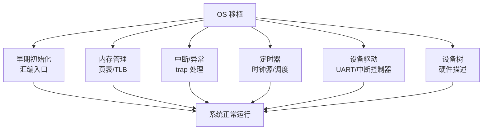
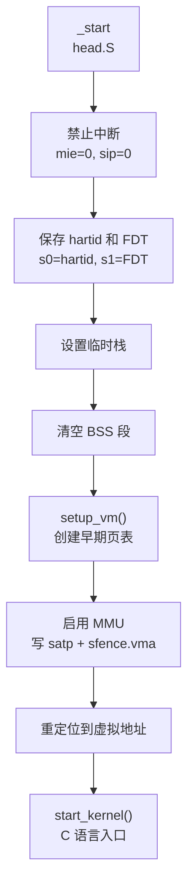
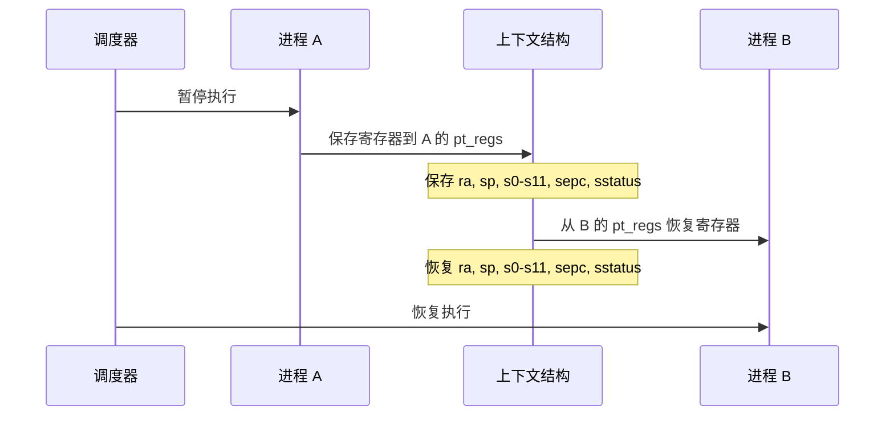

# 操作系统移植

> 将操作系统运行在 RISC-V 上是系统软件工程师的核心能力。本文以 Linux 为主，讲解移植的关键步骤。

## 为什么重要

从 OpenSBI 把 `a0=hartid` 和 `a1=FDT地址` 塞进寄存器跳转到内核的那一刻起，操作系统移植的每一个环节都在考验你对硬件的理解深度：`setup_vm()` 必须同时建立恒等映射和内核虚拟地址映射，否则启用 MMU 的下一条指令就会页错误；`_trap_entry` 汇编中如果忘记保存 `s0-s11`，进程上下文切换就会静默地损坏数据；PLIC 驱动中如果漏掉 Claim/Complete 配对，外部中断就会永久丢失。这些不是"可以后续优化"的点——它们是 OS 能不能启动的硬性条件。

本章以 Linux 内核启动为主线，从 OpenSBI 传递的启动协议（a0/a1）出发，逐层讲解早期页表建立、MMU 启用、上下文切换、中断异常处理、定时器驱动、PLIC 驱动、设备树解析的全流程，最后对比 RTOS（Zephyr/FreeRTOS）移植的简化路径。读完本章，你应当能在 QEMU 上跑通一个最小内核，或在拿到新的 RISC-V SoC 时按照 bring-up 流程让 Linux 启动到 shell。

> **工程师视角**：OS 移植不是"一次性任务"，而是持续迭代的过程。从 bring-up 阶段的"串口输出第一个字符"，到生产环境的"NUMA 调度优化"，每个阶段都需要深入理解硬件与软件的交互边界。

## 学习目标

- 描述 OpenSBI → Linux 内核的启动协议（a0/a1 寄存器约定）
- 解释 `setup_vm()` 为何必须同时建立恒等映射和内核映射
- 手写 RISC-V 上下文切换的汇编实现（保存/恢复 s0-s11, ra, sp, sepc, sstatus）
- 实现 C 层异常分发函数（根据 scause 分发系统调用/页错误/中断）
- 编写 PLIC 驱动程序：Claim → 处理 → Complete
- 解析设备树节点以获取硬件寄存器基地址
- 对比 Linux 移植与 RTOS 移植的复杂度差异

### 前置知识

| 需要了解 | 参考文档 |
|----------|----------|
| RISC-V 特权模式与 CSR 访问 | [特权模式与 CSR](./03-privileged-modes-and-csr.md) |
| 内存管理 MMU 页表 (Sv39) | [内存管理](./05-memory-management-pmp-sv39.md) |
| RISC-V 启动流程 (OpenSBI/U-Boot) | [启动流程](./10-boot-chain-overview.md) |

---

## 1. 操作系统移植概览



---

## 2. Linux RISC-V 内核启动

### 2.1 启动协议

OpenSBI/U-Boot 传递给 Linux 内核的参数：

| 寄存器 | 内容 |
|--------|------|
| a0 | hart ID（硬件线程 ID） |
| a1 | 设备树（FDT）在内存中的地址 |

### 2.2 内核入口流程



### 2.3 setup_vm()：早期页表

内核在启用 MMU 之前需要创建一个简单的页表，将物理地址映射到虚拟地址：

```c
// 简化的早期页表创建
void setup_vm(void) {
    // 创建恒等映射（物理地址 = 虚拟地址）
    // 和内核虚拟地址映射
    // 使用 Sv39 的 1GB 超级页，只需 3 个页表项

    pgdp[0] = pte_create(PA_START, PTE_R | PTE_W | PTE_X);  // 恒等映射
    pgdp[PAGE_OFFSET / PGDIR_SIZE] = pte_create(PA_START, PTE_R | PTE_W | PTE_X);  // 内核映射
}
```

> **为什么需要恒等映射？** 启用 MMU 的那条指令本身还在物理地址上执行。如果没有恒等映射，CPU 在写入 `satp` 后的下一条指令就会因为"找不到页表"而触发页错误。恒等映射确保了"开 MMU 瞬间"的平滑过渡。
>
> **生产环境注意**：实际 Linux 代码中，`setup_vm()` 还会处理 `KASLR`（内核地址空间布局随机化）和 `EFI` 内存映射，比上述简化版复杂得多。

### 2.4 启动调试技巧

```bash
# 查看 OpenSBI 传递给内核的参数
qemu-system-riscv64 -machine virt -nographic -kernel vmlinux -append "earlycon"

# 使用 QEMU 的 GDB stub 跟踪启动流程
qemu-system-riscv64 -machine virt -nographic -kernel vmlinux -S -gdb tcp::1234
# 另一个终端：
riscv64-unknown-elf-gdb vmlinux
(gdb) target remote :1234
(gdb) break _start
(gdb) continue
(gdb) info registers a0 a1  # 查看 hartid 和 FDT 地址
(gdb) x/10gx $a1            # 查看 FDT 头
```

> **常见问题**：如果内核启动后立刻崩溃，检查：
> 1. `a1` 是否指向有效的 FDT（魔数应为 `0xd00dfeed`）
> 2. 早期页表是否正确建立了恒等映射
> 3. `satp` 写入后是否执行了 `sfence.vma`

---

## 3. 上下文切换

内核成功启动后，操作系统的核心功能——多任务调度——依赖于上下文切换。在 RISC-V 上，切换的本质是保存和恢复一组特定的寄存器（s0-s11、ra、sp、sepc、sstatus），这个过程必须用汇编手写，不能用 C 实现。

### 3.1 进程上下文

```c
// Linux RISC-V 的 pt_regs 结构
struct pt_regs {
    unsigned long epc;        // sepc - 异常 PC
    unsigned long ra;         // x1
    unsigned long sp;         // x2
    unsigned long gp;         // x3
    unsigned long tp;         // x4
    unsigned long t0;         // x5
    // ... t1-t6, a0-a7, s0-s11
    unsigned long status;     // sstatus
    unsigned long cause;      // scause
    unsigned long badaddr;    // stval
    unsigned long orig_a0;    // 原始 a0（系统调用重启用）
};
```

### 3.2 上下文切换流程



```asm
// 简化的上下文切换
switch_to:
    # 保存旧进程的寄存器
    addi  sp, sp, -PT_SIZE
    sw    ra, PT_RA(sp)
    sw    s0, PT_S0(sp)
    sw    s1, PT_S1(sp)
    # ... 保存 s2-s11

    # 切换栈指针
    sw    sp, 0(a0)        # 保存旧进程的 sp
    lw    sp, 0(a1)        # 加载新进程的 sp

    # 恢复新进程的寄存器
    lw    ra, PT_RA(sp)
    lw    s0, PT_S0(sp)
    lw    s1, PT_S1(sp)
    # ... 恢复 s2-s11
    addi  sp, sp, PT_SIZE

    ret                      # 跳转到新进程的 ra
```

---

## 4. 中断和异常处理

### 4.1 异常向量设置

```c
void trap_init(void) {
    // 设置 S-mode trap 向量
    csr_write(stvec, (unsigned long)&_trap_entry);
}
```

```asm
// trap 入口
_trap_entry:
    csrrw  tp, sscratch, sp    # 交换 sp 和 sscratch
    addi   sp, sp, -PT_SIZE

    # 保存所有寄存器
    sw     ra, PT_RA(sp)
    sw     gp, PT_GP(sp)
    sw     t0, PT_T0(sp)
    # ... 保存所有寄存器

    csrr   t0, sepc
    sw     t0, PT_EPC(sp)
    csrr   t0, sstatus
    sw     t0, PT_STATUS(sp)
    csrr   t0, scause
    sw     t0, PT_CAUSE(sp)

    # 调用 C 处理函数
    mv     a0, sp              # pt_regs 指针
    call   do_trap

    # 恢复寄存器
    lw     t0, PT_EPC(sp)
    csrw   sepc, t0
    lw     t0, PT_STATUS(sp)
    csrw   sstatus, t0
    # ... 恢复所有寄存器

    addi   sp, sp, PT_SIZE
    csrrw  sp, sscratch, sp
    sret
```

### 4.2 C 层异常分发

```c
void do_trap(struct pt_regs *regs) {
    unsigned long cause = regs->cause;
    bool is_interrupt = cause & (1UL << 63);

    if (is_interrupt) {
        switch (cause & 0xFF) {
        case 5:  // S-mode 定时器中断
            handle_timer_irq();
            break;
        case 9:  // S-mode 外部中断
            handle_external_irq();
            break;
        case 1:  // S-mode 软件中断
            handle_software_irq();
            break;
        default:
            unknown_interrupt(cause);
        }
    } else {
        switch (cause) {
        case 8:  // ecall from U-mode
            handle_syscall(regs);
            regs->epc += 4;  // 跳过 ecall 指令
            break;
        case 12: // 指令页错误
        case 13: // 加载页错误
        case 15: // 存储页错误
            handle_page_fault(regs);
            break;
        default:
            panic("Unhandled exception: %ld", cause);
        }
    }
}
```

> **调试技巧**：当内核 panic 时，`scause` 的值是诊断关键：
> - `0x0` = 指令地址未对齐（通常是链接错误）
> - `0x1` = 指令访问错误（PMP/IOMMU 拦截）
> - `0xc/0xd/0xf` = 页错误（检查页表权限和 `satp`）
> - `0x2` = 非法指令（可能是不支持的扩展，或 PC 跑飞）

---

## 5. 定时器驱动

### 5.1 时钟事件设备

```c
// 设置下一次定时器中断
static int riscv_timer_set_next_event(unsigned long delta,
                                       struct clock_event_device *dev) {
    // 通过 SBI 设置 mtimecmp
    sbi_set_timer(get_cycles() + delta);
    return 0;
}

// 定时器中断处理
static irqreturn_t riscv_timer_interrupt(int irq, void *dev_id) {
    struct clock_event_device *evdev = dev_id;

    csr_clear(sip, SIP_STIP);  // 清除定时器中断等待位
    evdev->event_handler(evdev);  // 调用调度器

    return IRQ_HANDLED;
}
```

### 5.2 时钟源

```c
// 读取高精度时间
static u64 riscv_clocksource_read(struct clocksource *cs) {
    return get_cycles();  // 读取 mtime 或 rdtime
}

static struct clocksource riscv_clocksource = {
    .name   = "riscv_clocksource",
    .rating = 300,
    .read   = riscv_clocksource_read,
    .mask   = CLOCKSOURCE_MASK(64),
    .flags  = CLOCK_SOURCE_IS_CONTINUOUS,
};
```

---

## 6. PLIC 驱动

```c
#define PLIC_BASE       0x0C000000
#define PLIC_PRIORITY   0x0000
#define PLIC_PENDING    0x1000
#define PLIC_ENABLE     0x2000
#define PLIC_THRESHOLD  0x200000
#define PLIC_CLAIM      0x200004

static void plic_set_priority(int irq, int priority) {
    volatile uint32_t *reg = (volatile uint32_t *)(PLIC_BASE + PLIC_PRIORITY);
    reg[irq] = priority;
}

static void plic_enable_irq(int context, int irq) {
    volatile uint32_t *reg = (volatile uint32_t *)(PLIC_BASE + PLIC_ENABLE + context * 0x80);
    reg[irq / 32] |= (1 << (irq % 32));
}

static uint32_t plic_claim(int context) {
    volatile uint32_t *reg = (volatile uint32_t *)(PLIC_BASE + PLIC_CLAIM + context * 0x1000);
    return *reg;
}

static void plic_complete(int context, uint32_t irq) {
    volatile uint32_t *reg = (volatile uint32_t *)(PLIC_BASE + PLIC_CLAIM + context * 0x1000);
    *reg = irq;
}

// 外部中断处理
void handle_external_irq(void) {
    int context = 0;  // S-mode context 0
    uint32_t irq = plic_claim(context);

    if (irq > 0) {
        generic_handle_irq(irq);
        plic_complete(context, irq);
    }
}
```

---

## 7. 设备树解析

前面几节的代码中多次出现了硬编码的基地址（如 `0x0C000000`），这在 bring-up 阶段可以接受，但生产级的操作系统需要动态发现硬件。设备树（Device Tree）就是 RISC-V 生态中解决"硬编码"问题的标准机制。

### 7.1 内核中的设备树处理

```c
// 从设备树获取内存信息
void __init setup_arch(char **cmdline_p) {
    // 解析设备树
    early_init_dt_scan(dtb_base);

    // 内存初始化
    memblock_init();

    // 解析 CPU 信息
    parse_cpu_dt();
}

// 从设备树获取时钟频率
static int __init parse_clint_dt(void) {
    struct device_node *node;

    node = of_find_compatible_node(NULL, NULL, "riscv,clint0");
    if (!node)
        return -ENODEV;

    clint_base = of_iomap(node, 0);
    of_property_read_u32(node, "clock-frequency", &clint_clock_freq);

    return 0;
}
```

### 7.2 添加自定义设备到设备树

```dts
// 添加自定义 UART 设备
my_uart@10020000 {
    compatible = "my-vendor,my-uart";
    reg = <0x0 0x10020000 0x0 0x100>;
    interrupts = <5>;           // PLIC 中断号 5
    clock-frequency = <100000000>;
    status = "okay";
};
```

---

## 8. RTOS 移植要点

前面以 Linux 为主线介绍了操作系统移植的各个环节，但并非所有场景都需要完整 Linux。对于资源受限的嵌入式系统，RTOS（如 Zephyr、FreeRTOS）是更务实的选择。它们的移植思路与 Linux 有相通之处，但复杂度大大降低。

### 8.1 与 Linux 移植的对比

| 方面 | Linux | RTOS (如 Zephyr) |
|------|-------|-------------------|
| 启动 | OpenSBI → U-Boot → Linux | 直接从 M-mode 启动 |
| 内存管理 | 完整虚拟内存 (Sv39) | 通常使用 MPU/PMP 或裸模式 |
| 中断 | 委托到 S-mode | 可在 M-mode 直接处理 |
| 设备驱动 | 完整驱动模型 | 最小驱动集 |
| 调度 | CFS 等复杂调度器 | 优先级抢占调度 |

### 8.2 Zephyr RISC-V 移植关键文件

```
arch/riscv/
├── core/
│   ├── reset.S          # 复位入口
│   ├── isr.S            # 中断/异常处理
│   ├── swap.S           # 上下文切换
│   ├── thread.c         # 线程管理
│   └── irq_manage.c     # 中断管理
├── include/
│   ├── arch/riscv/
│   │   ├── arch.h       # 架构定义
│   │   ├── csr.h        # CSR 寄存器
│   │   └── irq.h        # 中断接口
│   └── ...
└── soc/                 # SoC 特定代码
    ├── riscv-privilege/
    │   ├── sifive/
    │   └── virt/
    └── ...
```

### 8.3 从 RTOS 到 Linux 的演进路径

对于系统软件工程师，建议按以下路径实践：

```
阶段 1: 裸机编程
    └── 掌握寄存器操作、trap 处理、UART 驱动
    └── 验证：QEMU 输出 "Hello World"

阶段 2: 最小 RTOS
    └── 实现上下文切换、简单调度器
    └── 验证：两个任务交替打印

阶段 3: 完整 RTOS 移植
    └── 移植 FreeRTOS/Zephyr，支持中断和定时器
    └── 验证：通过官方测试套件

阶段 4: Linux  bring-up
    └── 配置早期页表、PLIC 驱动、SBI 接口
    └── 验证：启动到 shell

阶段 5: Linux 驱动开发
    └── 编写字符设备驱动、中断处理
    └── 验证：insmod 加载，读写测试

阶段 6: 性能优化
    └── CPU 亲和性、NUMA 感知、锁优化
    └── 验证：benchmark 提升
```

> **学习建议**：每个阶段都要有"可运行的产出"，不要停留在"看懂代码"。[Lab 系列](./40-lab-baremetal-trap-handler.md) 提供了阶段 1-4 的完整代码框架。

---

## 小结

| 要点 | 说明 |
|------|------|
| 启动协议 | a0=hartid, a1=FDT |
| 早期页表 | 1GB 超级页映射，恒等映射 + 内核映射 |
| 上下文切换 | 保存/恢复 s0-s11, ra, sp, sepc, sstatus |
| trap 处理 | 汇编保存现场 → C 分发 → 汇编恢复 |
| 定时器 | 通过 SBI 设置 mtimecmp |
| PLIC | Claim → 处理 → Complete |
| 设备树 | 描述硬件信息，内核动态解析 |
| 调试关键 | scause 值、GDB stub、earlycon |

---

## 参考资料

- [Linux RISC-V Porting Guide (kernel.org)](https://www.kernel.org/doc/html/latest/arch/riscv/) — Linux 内核 RISC-V 移植文档
- [SBI Specification v3.0](https://github.com/riscv-non-isa/riscv-sbi-doc/releases/tag/v3.0) — OpenSBI/S-mode ecall 的标准调用约定
- [RISC-V ELF psABI Specification](https://github.com/riscv-non-isa/riscv-elf-psabi-doc) — 上下文切换涉及的 ABI 规范
- [Kendryte K230 Documentation](https://www.canaan.io/products/k230) — 国产端侧 RISC-V SoC

---

→ 下一节：[工具链与模拟器](./09-toolchain-and-simulator.md)
