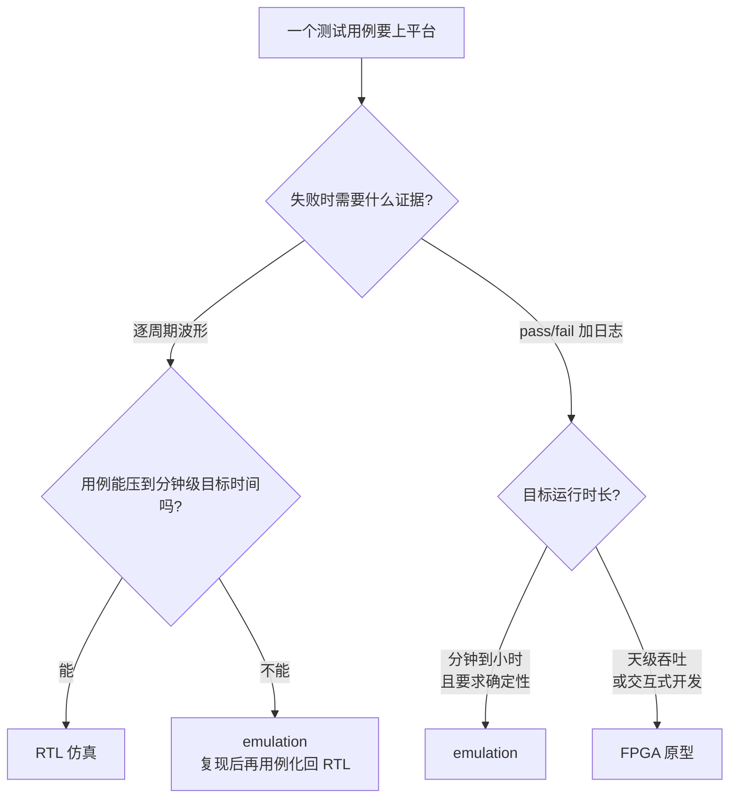
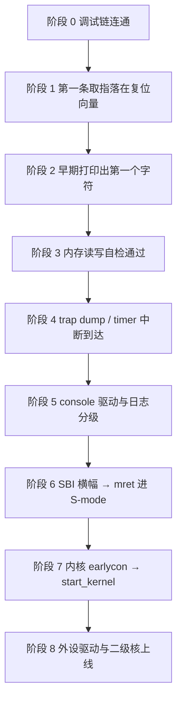

# 硅前验证环境:Palladium、FPGA 与软件验证

> 面向 RV 核 IP 的软件验证工程师:不改 RTL、不写 UVM,职责是在流片之前把固件和内核在三类硅前平台上跑起来,验证核的**软件可见行为**(CSR 语义、异常/中断、地址翻译、内存一致性、性能计数),并在出问题时回答"这是软件 bug、RTL bug,还是环境问题"。本篇沿一条主线展开:平台怎么选 → bring-up 怎么走 → 问题怎么定位 → 镜像怎么适配 → 坑在哪。

先说清一个背景:硅前你拿到的不是产品芯片,而是**验证 SoC**——你的核,加上行为级内存模型、少量外设(UART、几根中断线)、可配置的时钟复位树。外设集小、内存可能是模型、参数以 RTL 为准,这决定了后面所有软件适配和坑的形态。

| 前置阅读 | 为什么需要 |
|----------|-----------|
| [特权模式与 CSR](./03-privileged-modes-and-csr.md) | 本文多处引用 mstatus/mie/mepc/PMP 的行为 |
| [中断与异常](./04-interrupts-and-exceptions.md) | bring-up 中断使能链、CLINT/PLIC 检查的基础 |
| [启动流程](./10-boot-chain-overview.md) | bring-up 阶段划分以 OpenSBI → 内核启动链为参照 |
| [工具链与模拟器](./09-toolchain-and-simulator.md) | 交叉编译、QEMU/GDB 的基本用法 |

引用约定:特权规范指 RISC-V Privileged Architecture 20211203(本地副本 `reference/riscv-privileged-20211203.pdf`),Debug 规范指 RISC-V External Debug Support 1.0(2025-02-21 批准,本地副本 `reference/riscv-debug-specification.pdf`),引用处标章节号。

## 1. 三类平台:速度换可见性

同一个 RTL,有三个物理载体:RTL 仿真(VCS/Questa/Verilator 等软件仿真器)、emulation(Cadence Palladium、Synopsys ZeBu 等硬件仿真器;两家另有 FPGA 原型产品线 Protium/HAPS,本篇方法论通用)、FPGA 原型(把同一份 RTL 综合上板)。三者不分优劣,是**同一份设计在速度/可见性/迭代成本上的三种组合**。为每个测试挑平台的依据只有一个:失败时你能拿到什么证据。

### 1.1 对比

结论先行:没有全能平台,按"证据需求 × 目标运行时长"两问查表。

| 对比维度 | RTL 仿真 | emulation(Palladium/ZeBu) | FPGA 原型 |
|----------|----------|------------------------------|-----------|
| 典型速度量级 | 事件驱动仿真器 kHz~百 kHz;Verilator 等编译型可到低 MHz | MHz 量级(常见零点几到几 MHz,依设计与分区而异) | 几 MHz 到几十 MHz(核 SoC 常见 10–50 MHz) |
| 可见性 | 任意信号、任意时间窗的完整波形 | 信号级可 dump,支持运行状态 save/restore | 只有预先插入的探针(如 ILA),深度有限,事后补不了 |
| 迭代成本 | 编译分钟级、重启秒级 | 编译小时级,重启快;save/restore 免重跑 | 改软件便宜,改 RTL 要重新布局布线(小时级) |
| 确定性 | 完全确定,可复现到周期 | 设计本身确定;挂真实外设(speed bridge)后引入非确定 | 真实时钟与 DDR,亚稳态/时序问题会显现,且难复现 |
| 软件侧定位成本 | 低:等波形就行 | 中:波形可得,但要占资源/排队 | 高:得先移到 emulation 复现 |
| 适合的软件测试 | 冒烟、定向用例、短回归 | OS 启动、长时间压力、需要波形的 bug 定位 | 交互式开发、天级吞吐测试、demo、暴露物理时序问题 |

> **如何读这张表**:速度都是量级表述,实际取决于设计规模、多 FPGA 分区数和主机负载;Palladium/ZeBu 的具体调优手段属厂商工具链,不在本篇展开。读法是两问:失败时我需要什么级别的证据(波形?日志?);测试要跑多久(目标时间)。两个答案落到表里,平台就定了。

### 1.2 什么测试放什么平台

本节回答:一类测试该落在哪个平台。四类典型工作的落点:

- **每次 RTL 提交的冒烟回归**:定向用例、riscv-tests 风格的自检程序,目标时间秒级以内——RTL 仿真。慢不是问题,因为用例短;快的是编译和重启,以及"想看哪根信号就看哪根"。
- **OS 启动与长时间压力**:跑通 Linux、文件系统读写、内核压力测试,目标时间分钟到小时——emulation。这些用例在 RTL 仿真里等不到结果(见 §4.2 的换算),在 FPGA 上跑得动但挂了抓不到现场。
- **交互式软件开发与吞吐测试**:改一行代码马上重跑、benchmark 跑一天、给客户 demo——FPGA 原型。这是唯一接近"真机手感"的环境,代价是可见性。
- **合规/一致性测试套件**(如 RISCOF):短用例,RTL 仿真直接进 CI;需要 OS 的部分放 emulation。



比"选平台"更重要的是**问题降级链**——软件验证者的日常工作流其实是把问题沿这条链搬运:

1. FPGA 上跑出挂死(快,但看不见)→
2. 搬到 emulation 复现(用 save/restore 反复回到故障点,拿波形)→
3. 缩小成 RTL 仿真里几十万周期内可跑的定向用例 →
4. 修 RTL(或软件),用例进 DV 回归 →
5. 修复后在 emulation 全量回归、FPGA 长跑确认。

> **核心要点**:三平台的工作流是"降级定位、升级验证"。RTL 仿真回答"为什么",emulation 回答"是否复现/是否修好",FPGA 回答"真跑起来什么样"。跳过中间环节(FPGA 的 bug 直接在 FPGA 上猜)是硅前最浪费时间的行为。

与 DV 的分工也顺带说清:DV 用约束随机激励打微观时序(冒险、流水线冲突、总线协议违例),软件验证打宏观语义(一段真实程序执行的结果对不对、CSR 的行为符不符合规范)。两边发现的 bug 最终汇到同一个 RTL,但复现手段完全不同——这是 §3.7 协作界面的由来。

## 2. Bring-up:从第一条取指到 Linux

bring-up 的目标是用最少的调试手段把系统逐段点亮:先让调试链可信,再让第一条指令、第一个字符、第一次中断依次可证。本节给四条环境接口、阶段划分,和四个贯穿全程的排查点。

### 2.1 环境给软件的四个接口

搭环境时先确认四条通道,后面每个阶段都踩在它们上面:

| 接口 | 典型形态 | 用途 |
|------|----------|------|
| 镜像加载 | emulator/FPGA 的 backdoor 加载(不占目标时间)、flash 模型、JTAG 加载 | 每次镜像更新都靠它;backdoor 最快,JTAG 最慢 |
| console | UART MMIO、tohost 邮箱(§3.2) | 阶段 2 起的一切日志输出 |
| 时钟复位 | RTL 参数化的频率、复位树;Debug 规范的 ndmreset(§3.14.2) | 时间基准、重复实验的可重复性 |
| JTAG | 经厂商桥接服务接入的虚拟 JTAG,或板上物理适配器 | 全程唯一"目标不配合也能看"的通道(§3.1) |

这四条通道的 RTL 参数(地址、频率、hart 数)是设备树和构建配置的**单一事实来源**。第一件正事是把"RTL 参数 → dts 片段"的生成脚本建起来——它防的是整个 §5.2 那类坑。

### 2.2 阶段划分:逐段建立信任链

bring-up 就是逐段建立信任:每个阶段的产物是下一个阶段的调试手段。调试链可信了才敢说"取指不对";打印可信了才能自述内存测试的结果。卡住时,**退回最近一个可信点**,从那里往下查。



| 阶段 | 里程碑(你看到什么) | 卡住时先查什么 |
|------|----------------------|-----------------|
| 0 调试链 | OpenOCD 能 halt/resume,读 CSR 正常 | JTAG IR 长度与 IDCODE、TCK 速率、dtmcs 状态(§3.1) |
| 1 取指 | halt 后 dpc 停在复位向量;波形里第一条取指地址正确 | ELF 入口 = 链接地址 = 加载地址?加载是否真的写进了内存 |
| 2 早期打印 | 第一个字符出现在 host 侧(串口或 tohost) | UART 寄存器偏移与输入时钟;tohost 地址是否被环境观察 |
| 3 内存 | 读写自检(walking-bit)通过 | 内存模型容量/属性;内存内容与镜像 dump 对比 |
| 4 trap/timer | trap dump 打出 mcause/mepc;timer 中断按期到达 | 中断使能链(§2.6)、mtime/mtimecmp、mtvec |
| 5 console | console 驱动工作,日志可分级 | dts 的 uart 时钟/中断号与 RTL 是否一致 |
| 6 SBI | OpenSBI 横幅出现,委托后 mret 进 S-mode payload | PMP 范围、medeleg/mideleg、payload 入口 a0/a1 |
| 7 内核 | earlycon 出字,start_kernel 走起来 | dts 全量核对(timebase、memory reg、clint/plic)、先 nr_cpus=1 |
| 8 外设/SMP | 驱动 probe 成功、二级核上线 | probe 失败日志、secondary park 地址与 PMP、IPI 链 |

阶段 4 之后的手册就是[启动流程](./10-boot-chain-overview.md):OpenSBI 的初始化顺序(mtvec → mie → PMP → 委托 → mret)、SBI 调用约定、内核 head.S 的早期页表,那一篇逐段展开。内核侧的坑(scause 定位、earlycon)见[操作系统移植](./13-linux-bringup.md)。下面四个排查点是贯穿所有阶段的通用 checklist——它们覆盖了 bring-up 期大半数"卡住"。

阶段 3 的内存自检是"打印可信"之后的第一个真测试,代码如下(要快,慢平台上别跑全量 march 算法):

```c
/* 最小内存自检:两轮分别卡数据线和地址线,失败返回第一个坏字的序号 */
static int mem_selftest(volatile uint64_t *base, size_t words)
{
    for (size_t i = 0; i < words; i++)            /* 交替位:数据线粘连 */
        base[i] = (i & 1) ? 0x5555555555555555ULL
                          : 0xaaaaaaaaaaaaaaaaULL;
    for (size_t i = 0; i < words; i++)
        if (base[i] != ((i & 1) ? 0x5555555555555555ULL
                                : 0xaaaaaaaaaaaaaaaaULL))
            return (int)i;

    for (size_t i = 0; i < words; i++)            /* 写地址相关值:地址线粘连 */
        base[i] = (uint64_t)&base[i];
    for (size_t i = 0; i < words; i++)
        if (base[i] != (uint64_t)&base[i])
            return (int)i;
    return -1;                                    /* -1 = 通过 */
}
```

这个测试的预期失败模式要说清:行为级内存模型本身坏掉并不常见,它真正抓的是**加载链和地址译码**——loader 少写了一个段、地址高位译码错、PMA 把一段内存标成了只读。返回"第一个坏字的序号"而不是布尔值,是因为坏字的位置本身就是诊断信息(恰好坏在一个段的边界上,八成是 loader)。

### 2.3 排查点一:入口地址与链接脚本

第一块砖:程序到底从哪开始跑。三处必须一致,任何一处错位,现象是"波形里有取指,但取回来的是垃圾",或"取指地址根本不在镜像里":

- 复位向量(RTL 决定)
- 链接地址(`-Ttext`)
- 加载地址(loader 写到哪)

```bash
riscv64-unknown-elf-readelf -h firmware.elf | grep "Entry point"   # ELF 入口
riscv64-unknown-elf-nm firmware.elf | grep " _start"               # 入口符号实际地址
riscv64-unknown-elf-objdump -d -j .text.init firmware.elf           # 看开头几条指令
```

三个常见错误:

1. 链接脚本把 `.text` 链在复位向量之外(如程序被加载到 0x80000000,复位向量是 0x80000004);
2. `-mcmodel` 选错,内核/固件在高地址访问越界(工具链细节见[工具链与模拟器](./09-toolchain-and-simulator.md));
3. 加载器没把 `.data`/`.bss` 段算进长度。

验证方法很朴素:JTAG halt 后 `x/8gx <复位向量>`,和 `objcopy -O binary` 出来的头几个字节对一下。

### 2.4 排查点二:设备树与 RTL 参数一致性

阶段 5 之后,内核不再"软件写死地址",而是信设备树。dts 里每一项都是对 RTL 的断言,错一项就是一个坑:

- `timebase-frequency` ≠ RTL 实际分频 → 调度与 udelay 全错(§5.1);
- clint/plic 的 `reg` 与地址映射不匹配 → 驱动访问空地址(§5.2/§5.6);
- plic 的中断源数量与 RTL 参数不一致 → claim 越界或中断丢失;
- `memory` 节点的 `reg` 大小超过内存模型 → 内核用到一半 access fault;
- cpu 节点的 `riscv,isa` 声明了 RTL 没实现的扩展 → 内核用到该指令时非法指令异常。

```dts
/* 每个数值都应来自 RTL 参数生成脚本,而不是手抄 */
clint: clint@2000000 {
    compatible = "riscv,clint0";
    reg = <0x0 0x2000000 0x0 0x10000>;
    interrupts-extended = <&cpu0_intc 3 &cpu0_intc 7>;
};

cpus {
    timebase-frequency = <10000000>;   /* 必须等于 RTL 的 mtime 增频 */
};
```

排查动作固定两步:dts 与 RTL 参数表逐项 diff(有生成脚本就是 diff 脚本输出);JTAG halt 看 PC 停在哪个寄存器读上(§5.6 的典型现场)。

### 2.5 排查点三:cache/MMU/PMP 状态

三个"看不见的状态"造成一大类"行为诡异":

- **satp**:bring-up 早期应为 0(裸模式)。内核启用 MMU 前必须建好恒等映射,否则写 satp 的下一条指令就页错误——这是[操作系统移植](./13-linux-bringup.md)里 setup_vm 的经典约束;
- **PMP**(特权规范 §3.7):OpenSBI 会配置 PMP 后才进 S-mode。范围算错时 S-mode 的合法访问也会 access fault,现象是"内核起不来但报错位置随机"——随机是因为 fault 地址取决于第一个越界访问;
- **icache 一致性**:自修改代码或加载器写完代码区后没有 `fence.i`,取指拿到旧指令。RTL 仿真里 icache 模型若偏理想,这个 bug 可能仿真过、FPGA 挂。

JTAG 一把抓:halt 后读 `satp`、PMP 寄存器、`mstatus`,和代码里"此时此刻应该是什么"的预期对表。

### 2.6 排查点四:中断使能链

"中断没来"是 bring-up 高频卡点,而它是一条链,断在哪节都一样表现为"不来"。M-mode 下按序检查(特权规范):

1. **mstatus.MIE**(§3.1.6)——全局开关;
2. **mie.MTIE/MSIE/MEIE**(§3.1.9)——源使能;
3. **mip** 对应位(§3.1.9)——pending 是否真的置了(没置说明源头就没到:mtimecmp 设了吗?PLIC claim 了吗?);
4. **mtvec**(§3.1.7)——向量指向有效 handler;
5. 若期望 S-mode 收到:**mideleg**(§3.1.8)是否委托了对应位,委托后还要看 S-mode 侧的 sstatus/sie;
6. timer 一路另查:**mtime/mtimecmp**(§3.2.1)的值与读数竞争(mtime 64 位读要做高-低-高重读)。

JTAG halt 后 `info registers mstatus mie mip mtvec` 一步看全链,再决定往源头(设备/CLINT/PLIC)追。

## 3. 硅前 debug 手段

按"对目标配合的依赖程度"从低到高排:JTAG(目标不需要任何配合)→ tohost 邮箱(只要 MMIO 能路由)→ 早期打印(要 UART)→ 完整日志(要 console 驱动)。越早的阶段越只能用靠前的手段——这也是它们出现在 bring-up 不同阶段的原因。

### 3.1 JTAG + OpenOCD/GDB:唯一不依赖目标配合的通道

链路是:GDB → OpenOCD → JTAG(板上适配器,或 emulator 提供的桥接服务)→ DTM → Debug Module → hart。Debug 规范把 DTM/DM/hart 分成三层(Debug 规范 §2;DMI 见 §3.1,JTAG DTM 见 §6.1),软件侧只需要知道:OpenOCD 负责把"halt 这个 hart"翻译成一串 JTAG 扫描和 DMI 寄存器读写(dmcontrol,§3.14.2)。


配置要点(方法论层面,具体命令以所用 OpenOCD 版本文档为准):

1. **interface**:emulation 上 JTAG 引脚由仿真驱动,OpenOCD 经厂商桥接服务接入;FPGA 原型用物理适配器。两种形态下 OpenOCD 的 target 配置相同,受益于 Debug 规范的分层设计;
2. **IR 长度与 IDCODE**(Debug 规范 §6.1.3):扫出的 IDCODE 不对,先怀疑位序和链上其它器件;
3. **TCK 速率**:emulation 上 TCK 是被模拟的,上限远低于真机。先用低速连通,再逐步往上试;
4. **hart 状态**:dmstatus(§3.14.1)的 allhalted/havereset 反映多 hart 全局;怀疑 SMP 问题时先用 `nr_cpus=1` 把单核语义隔离干净;
5. **reset 策略**:`monitor reset halt` 抓复位向量(resethaltreq,Debug 规范 §3.2/§3.5)是阶段 1 的标准动作;
6. **断点优先于单步**:单步每次都是 halt→读→resume 的 JTAG 往返,在 emulation 上代价高昂;用硬件断点(tselect/tdata1/tdata2,Debug 规范 §5.7)代替,且早期镜像常在只读区域,软件断点(替换成 ebreak)本来就不可用——GDB 里对应 `hbreak`。

一个 bring-up 各阶段都会反复用到的会话骨架(命令是 GDB/OpenOCD 通用的,数值随平台):

```text
(gdb) target extended-remote :3333       # 连 OpenOCD
(gdb) monitor reset halt                 # 复位并停住:阶段 1 的标准动作
(gdb) info registers pc dpc dcsr         # PC 落在复位向量了吗;dcsr.cause 是几
(gdb) x/8i $pc                           # 取回来的指令是不是镜像开头
(gdb) hbreak _start                      # 硬件断点(只读区域用 hbreak,不是 break)
(gdb) continue
(gdb) info registers mstatus mie mip mtvec   # 阶段 4:中断使能链现场
(gdb) x/32gx $sp                         # 栈是否被写坏
(gdb) monitor resume                     # 放行,别一直掐着
```

halt 下来之后第一件事不是看寄存器,是看 **dcsr.cause**(§4.9.1)——"为什么停"决定你接下来查什么:

| cause 值 | 含义 |
|---------|------|
| 1 | ebreak 命中 |
| 2 | trigger(硬件断点/观察点)命中 |
| 3 | haltreq(调试器请求) |
| 4 | 单步 |
| 5 | resethaltreq |
| 6 | halt group |

(编码来自 Debug 规范 §4.9.1 Table 8。)两个误判例子:以为是 haltreq 停的,实际 cause=2,那是别人留的触发器;没写 ebreak 的地方出现 cause=1,是 PC 跑飞进了垃圾指令。

另一个救命的机制是 **System Bus Access**(SBA,Debug 规范 §3.10):它让调试器不经 hart、直接读写系统总线上的内存和外设。hart 完全挂死(取指都停不了)时,SBA 是唯一还能看内存的通道;它也是"加载镜像"之外的快速读写手段。

### 3.2 tohost/fromhost:没有 UART 时的打印与退出

tohost/fromhost 是两个 64 位 MMIO 寄存器:目标写 tohost 发请求,host 端(仿真环境)消费请求、经 fromhost 应答。

它源自 Spike 的 HTIF 约定,riscv-tests 至今用它做自检判定;**现行特权规范(20211203)已不再定义它**,地址和实现完全由平台决定。这在硅前环境里反而是优点:给它实现一个"host 侧观察者"就行,不依赖 UART 是否 ready、不依赖 dts 是否正确。

值的编码(dev/cmd/payload 位域)按 HTIF 约定:

```c
/* tohost 值编码:bits 63:56 = device, 55:48 = cmd, 47:0 = payload
 * dev=1: 1=putchar;  dev=0: 0=exit(payload 低 1 位置 1,退出码 = payload >> 1)
 */
#define TOHOST ((volatile uint64_t *)0x40008000)   /* 平台自定义地址 */

static void htif_putc(char c)
{
    while (*TOHOST)                                   /* 上次请求尚未被消费 */
        ;
    *TOHOST = (1ULL << 56) | (1ULL << 48) | (uint8_t)c;
}

static void htif_exit(int code)
{
    while (*TOHOST)
        ;
    *TOHOST = ((uint64_t)code << 1) | 1;              /* riscv-tests: 失败时 code=TESTNUM */
}
```

它对硅前验证有两个不可替代的用处:

- **最早期 printf**:阶段 2 UART 还没调好时,输出通道只需要一个被环境观察的地址;
- **可机判的 pass/fail**:回归不是人眼看串口的,`tohost = 1` 是 pass,`tohost = (TESTNUM << 1) | 1` 是"第 TESTNUM 号断言失败",CI 脚本据此打分。

代价是每个环境都要自己实现 host 侧观察者、软件要暴露这个地址;用一个 `#ifdef` 让它与 UART 版本共存(§4.1)。

### 3.3 早期 UART 打印的最小实现

ns16550 兼容 UART 的 polling 输出是标准最小实现——不使能中断、不查询输入、不做格式化:

```c
#define UART_BASE 0x10000000UL                    /* 平台地址,来自 dts */
#define UART_THR  (*(volatile uint8_t *)(UART_BASE + 0x00))
#define UART_LSR  (*(volatile uint8_t *)(UART_BASE + 0x05))
#define LSR_THRE  0x20                            /* Transmit Holding Register Empty */

static void uart_putc(char c)
{
    while (!(UART_LSR & LSR_THRE))                /* 查询发送就绪 */
        ;
    UART_THR = c;
}

static void puts(const char *s)
{
    while (*s)
        uart_putc(*s++);
}
```

两个实现细节不能省:一是 `volatile`——漏了它,轮询循环被编译器优化成"读一次死等",是最常见的"打印偶发丢字"原因;二是 C 函数依赖栈,设置 sp 之前连这点代码都跑不了,最早期的输出只能用等价内联汇编写在 `.init` 里。至于波特率:仿真环境里 UART 通常是模型,写进去就行;FPGA 上才真要校时钟分频,这也是 §5.1 的第一个受难处。

### 3.4 trap dump:让"挂"变成"说话"

比 printf 更早该有的是一个最小 trap 自述:任何异常都打印三个 CSR 再死循环。mcause(§3.1.15)/mepc(§3.1.14)/mtval(§3.1.16)能覆盖 bring-up 期八成的"挂死"——非法指令(取指跑飞)、access fault(PMP/地址错)、misaligned(链接或指针错):

```c
static void put_hex(uint64_t v)                   /* 16 个 nibble,逐字符输出 */
{
    static const char d[] = "0123456789abcdef";
    for (int i = 60; i >= 0; i -= 4)
        uart_putc(d[(v >> i) & 0xf]);
}

void trap_entry(void)                              /* mtvec 指向这里 */
{
    uint64_t cause, epc, tval;
    asm volatile("csrr %0, mcause" : "=r"(cause));
    asm volatile("csrr %0, mepc"   : "=r"(epc));
    asm volatile("csrr %0, mtval"  : "=r"(tval));
    puts("\nTRAP mcause="); put_hex(cause);
    puts(" mepc=");          put_hex(epc);
    puts(" mtval=");         put_hex(tval);
    while (1)
        asm volatile("wfi");
}
```

把 trap_entry 注册进 mtvec(§3.1.7)之后,"静默挂死"就变成了带坐标的报错。完整框架的逐步搭建见[Lab 1:裸机 trap 框架](./40-lab-baremetal-trap-handler.md)。

### 3.5 日志分级与裁剪

有了输出通道,下一个决定是"打多少"。在仿真平台上,打印本身可能是用例的主要时间成本——一次带格式化的 printf 是上千条指令,外加每个字符一次 MMIO 访问(emulation 上 MMIO 往返很贵)。所以日志要能在编译期裁剪:

```c
#define LOG_NONE 0
#define LOG_ERR  1
#define LOG_INFO 2
#define LOG_DBG  3

#ifndef LOG_LEVEL
#define LOG_LEVEL LOG_ERR                          /* make LOG_LEVEL=LOG_DBG 注入 */
#endif

#if LOG_LEVEL >= LOG_ERR
#define log_err(...)  uart_printf(__VA_ARGS__)
#else
#define log_err(...)
#endif
/* log_info / log_dbg 同理 */
```

实践节奏:debug 一个问题时开 LOG_DBG 拿全景;进回归的镜像裁回 LOG_ERR,只留断言结果和失败时的现场。内核侧同理——earlycon 起来后,`loglevel=` 引导参数控制运行时输出,而 `CONFIG_LOG_BUF_SHIFT`/dmesg 大小要按最小 rootfs 预算来。

### 3.6 printf 之外:内存转储与寄存器快照

"打印"是被动的;主动取证是"转储"。挂死现场的标准动作是一段 GDB 批处理,不进交互模式、一条命令保全全部现场:

```bash
riscv64-unknown-elf-gdb -batch firmware.elf \
    -ex 'target extended-remote :3333' \
    -ex 'set pagination off' \
    -ex 'monitor halt' \
    -ex 'info registers pc ra sp mstatus mcause mepc mtval dcsr' \
    -ex 'x/16i $pc' \
    -ex 'x/32gx $sp' \
    -ex 'dump binary memory /tmp/stack.bin $sp ($sp+0x400)' \
    -ex 'dump binary memory /tmp/bss.bin 0x80000000 0x80010000' \
    -ex 'monitor resume'
```

转储下来的内存拿回宿主机用 `riscv64-unknown-elf-objdump -D -b binary -m riscv:rv64` 反汇编、或和预期镜像逐字节 diff——"内存里的代码和我编出来的一样吗"这一问能排除整个加载链的嫌疑。hart 完全不响应时,退到 SBA(§3.1)从总线直接读。

### 3.7 与 DV 的协作界面

软件验证和 DV 的接口质量,直接决定 bug 的周转时间。约定俗成的分工:

**软件侧交付(提单要素)**:

1. 可机判的最小复现:单个自检镜像 + 加载方式 + 期望/实际输出,退出码判 pass/fail(tohost);
2. 挂点坐标:最后一条打印、JTAG 快照(PC/CSR/dcsr.cause)若有;
3. 环境指纹:镜像与 dts 的构建 commit、RTL 提交号、平台(emulation 型号/编译时间戳或 RTL 仿真器版本)。

**DV 侧交付**:

1. 波形窗口:从挂点回溯若干周期的信号集(PC、取指/访存通道、中断线、时钟复位域);
2. 时间线:第一次偏离预期的周期号——不是"最后死了",是"从哪开始不对";
3. 用例化:把复现固化进回归(断言/记分板),防止复发。

> **核心要点**:协作的瓶颈几乎从来不是波形,是"复现是否可机判"。一句"Linux 起不来"给 DV,得到的是一轮反问;一个"镜像 + 命令 + 退出码"给出去,得到的是波形。写复现用例的那半小时,是整个流程里回报最高的半小时。

## 4. 软件适配:同一镜像,三类环境

本节回答:一份固件/内核怎么同时伺候三类平台。结论是分叉不可避免,但分叉点要压到最少并全部显式声明;再警惕仿真时间的三类陷阱,用好慢平台在性能计数上的确定性。

### 4.1 构建分叉的取舍

理想是"一份源码,三个平台同一份镜像";现实是有必须分叉的点。原则:**分叉点越少越好,且全部显式声明**——分叉多了,你在 FPGA 上验证的就不再是 emulation 上那份东西。典型分叉:

| 差异点 | emulation | FPGA 原型 | 原因 |
|--------|------------|-----------|------|
| console 通道 | tohost + UART | UART | tohost 依赖 host 观察者,板上没有 |
| 内核镜像 | 未压缩 Image,backdoor 直载 | 压缩 Image / flash 加载 | 解压阶段在 emulation 上是纯浪费目标时间 |
| SMP | nr_cpus=1 起步 | 全核 | 单核问题域先验证干净(§5.4) |
| rootfs | 最小 busybox initramfs | initramfs 或块设备 | 验证 SoC 上常没有块设备/网络 |

分叉的落点集中在**一个平台配置头文件**,源码只认抽象接口——"三个平台测的是同一个东西"就靠这一点守住:

```c
/* platform.h:构建时以 -DPLAT_EMU / -DPLAT_FPGA 选择 */
#if defined(PLAT_EMU)
  #define CONSOLE_HTIF   1     /* tohost 走 host 观察者 */
  #define NR_HARTS       1     /* 单核先行 */
#elif defined(PLAT_FPGA)
  #define CONSOLE_HTIF   0
  #define NR_HARTS       4
#endif

#if CONSOLE_HTIF
  #define console_putc(c)  htif_putc(c)
#else
  #define console_putc(c)  uart_putc(c)
#endif
```

三个具体取舍:

- **压缩内核**:emulation 的加载走 backdoor,未压缩 Image 直接放进内存、复位即跑,省掉整个解压阶段;FPGA 从 flash 启动时镜像体积才成为约束。同一个测试目标,加载路径不同,镜像形态就不同——这不是浪费,是把仿真时间花在刀刃上;
- **裁剪驱动**:defconfig 尽量小。内核 probe 一个不存在的设备要等超时,在仿真平台上每一秒超时都是千倍换算后的真金白银(§4.2);更重要的是,没用的驱动让日志噪声盖住真问题;
- **单 hart 先行**:dts 只放一个 cpu 节点,或内核参数 `nr_cpus=1`。把"单核语义对不对"和"SMP 交互对不对"拆成两个问题域,分别用两个平台节奏验证——SMP 问题在 emulation 上用 save/restore 反复打。

### 4.2 仿真时间陷阱:wfi、时间比例、超时按指令数

墙钟时间和目标时间的关系:

$$T_{\text{wall}} = T_{\text{target}} \times \frac{f_{\text{target}}}{f_{\text{platform}}}$$

代真实数算几个典型操作(目标主频按 1 GHz 计):

| 目标侧操作 | 周期数 | emulation @ 1 MHz | RTL 仿真 @ 100 kHz |
|------------|--------|-------------------|---------------------|
| 一条普通指令 | ~1 | ~1 µs | ~10 µs |
| 外设轮询超时 0.1 s | $10^8$ | ~100 s | ~17 分钟 |
| `sleep(10)` | $10^{10}$ | ~2.8 小时 | ~28 小时 |
| Linux 完整启动(目标 30 s) | $3\times10^{10}$ | ~8.3 小时 | ~83 小时 |

(周期数按 $f_{\text{target}} \times T_{\text{target}}$ 算;"Linux 完整启动 30 s"是目标侧的假设时长。)

这张表解释了两件事:为什么 OS 级测试只能上 emulation(83 小时的 RTL 仿真不现实,而 8 小时挂一夜正好);为什么"按墙钟写超时"在慢平台上是定时炸弹。三个直接踩雷的习惯:

1. **按墙钟设超时**。网络上层协议的重传定时器、驱动里的"500ms 内等就绪",在慢平台上要么永远等不到,要么把回归拖到无法运行。改法是**超时阈值以指令数/周期数计**:

```c
#define POLL_LIMIT 100000000ULL                    /* 1e8 周期:1GHz 目标上 0.1s */

static int wait_ready(volatile uint32_t *status)
{
    uint64_t t0 = rdcycle64();
    while (!(*status & READY_BIT))
        if (rdcycle64() - t0 > POLL_LIMIT)
            return -1;                             /* 带着现场退出,别死等 */
    return 0;
}
```

这个写法在三类平台上语义一致:快平台上是"0.1 秒",慢平台上同样"0.1 秒目标时间"——只是墙钟不同。

2. **wfi 当结束信号**。不少 RTL testbench 把"所有 hart 都进 wfi"解释为仿真结束。这在单 hart 自检用例里是合理约定,在多 hart 或"等中断"的用例里就是灾难——用例在等 timer,wfi 一来仿真就收摊了。用例设计时先确认环境对这个语义的定义。

3. **用墙钟判断"挂死"**。有的 emulation 环境在 hart 全部 wfi 时降频省资源,表现是"看起来卡了",其实在正常推进。判据用 JTAG halt 看 PC/dcsr.cause,不用墙钟。

wfi 本身(特权规范 §3.3.3)只是"hint",实现可以当 NOP。所以 idle 线程在"wfi 循环"和"忙循环"之间的选择不影响正确性,但在仿真上两者等价于"时间静止"和"烧仿真时间",idle 循环该用 wfi。

### 4.3 性能计数器:慢环境里的确定性红利

反直觉的一点:性能计数器在仿真里**反而更可靠**。mcycle/minstret(特权规范 §3.1.10,HPM 一族;读取经 rdcycle/rdinstret)在 emulation 上跑同一个镜像两次,逐位一致——没有真实 DRAM 刷新、没有总线仲裁竞争、没有时钟抖动。这给了一个 FPGA 给不了的能力:

- **指令数回归门槛**:核心用例(一段定点运算、一次 TLB miss 序列)的 minstret/mcycle 基线化,两次运行不一致即报警——不一致本身说明存在非确定源(未初始化内存、轮询真实外设、依赖时序的分支),这类源头个个都是流片后的隐患;
- **微架构代价精确测量**:某条优化前后只差几十条指令,在真实板上被噪声淹没,在仿真里是精确数字。

前提条件有二:确认 `mcountinhibit`(§3.1.12)没把计数器关掉(否则读数恒零,§5.7);确认环境里没有挂真实外设(speed bridge 上的以太网之类),否则确定性前提被破坏。FPGA 上这套门槛不成立,只能看统计意义的均值。

## 5. 常见坑清单

每条按"现象 → 排查"组织,按遇到概率排序。

### 5.1 时间基准对不上

**现象**:`msleep(100)` 的打印间隔肉眼可见不对;调度 tick 紊乱或干脆没有 tick;定时器要么立即到期要么永不到期;带墙钟超时的用例全体超时。

**排查**:JTAG halt 后连读两次 mtime(§3.2.1),和 rdcycle 差值互算实际频率;让 DV 在波形里量 mtime 的增频,和 dts 的 `timebase-frequency` 对照。注意两条受害链:SBI Timer 的 set_timer 按 timebase 换算(影响调度),内核 udelay 按时间基准校准(影响驱动等待)。改 RTL 分频没同步重新生成 dts,是这类坑的标准成因(§2.4 的生成脚本就是防它)。

### 5.2 设备树与 RTL 参数不一致

**现象**:驱动 probe 失败、读回 0xffffffff;或访问某寄存器后 hart 永久失联(见 5.6);PLIC claim 读出 0 但设备明明在请求。

**排查**:JTAG halt 看 PC 停在哪个 load/store;dts 与 RTL 参数表逐项 diff(地址、中断号、ndev、时钟)。根治是 §2.1 说的"dts 由 RTL 参数生成",手抄 dts 的环境这类坑会反复出现。

### 5.3 DMA 一致性假设在仿真里翻车

**现象**:QEMU 上全过的网卡/块设备/DMA 用例,在 emulation 上间歇失败;DMA"完成"了但 buffer 里是旧数据;或 CPU 写的描述符 DMA 看不到。间歇性是关键词——纯软件 bug 通常稳定复现,一致性 bug 看高速缓存里"恰好"留了什么。

**排查**:查 DMA buffer 所在区域的页属性/cacheable 配置,临时改成 non-cacheable 区域对照——对照通过了就是一致性问题;软件侧补显式的 cache 维护(平台的 flush/invalidate 例程,Zicbom 的 cbo.flush/cbo.inval 一类);再查 DMA 路径是否经过 IOMMU/PMP 受限区域。

QEMU 的内存模型不做真 cache,当不了这个问题的仲裁者。这是"环境问题 / RTL 问题 / 软件问题"三分法里最容易误判的一类:先在 emulation 上复现并确认机理,再谈修谁。

### 5.4 SMP 二级核起不来

**现象**:dmesg 停在 "CPU1: failed to come online" 或干脆停在 secondary 入口附近;一级核正常。

**排查**:JTAG halt 二级核,看它停在哪个 park 循环——是没收到启动请求,还是收到了但跑飞了。然后按链查:

1. secondary 入口地址与栈(谁初始化?park 内存可写吗?);
2. dts 的 cpu `reg` 与 mhartid(§3.1.5)对应;
3. PMP(§3.7)是否放行 secondary 的代码/栈区域;
4. IPI 链是否真的到达(SBI HSM 的 hart_start 最终走 CLINT 的 msip)。

单 hart 先行(§4.1)能把这个问题的爆炸半径限制在 SMP 逻辑本身。

### 5.5 随机种子/内存随机化

**现象**:同一镜像,不同回归 run 结果不同;挂点在读一个"看起来随机"的值上。DV 环境每次仿真换 plusargs 种子是常态。

**排查**:先问环境是否随机化内存初值——不少 DV 环境故意这么做,专门抓"软件消费未初始化内存"。若是,这不是环境找茬,是硅前替你抓了一个流片后偶发 bug:查失败点消费的是不是未清零的 bss/栈/堆,软件侧补初始化。若环境不随机化,则查镜像里的未初始化数据段是否真的被 loader 写过。

### 5.6 访问未映射地址导致总线挂死

**现象**:一次 MMIO 之后 hart 再无响应;JTAG halt 后 dpc 停在那条 load/store 上不动;波形里该请求 VALID 拉高、READY 永不回应(这是和 DV 要波形的固定理由之一)。

**排查**:对照地址映射表确认该地址存在;dts 里把没实现的外设 `status="disabled"`。根源多半是软件地址算错或 dts 声明了不存在的设备(5.2)。环境侧可以和 DV 协商给未映射区域加一个"返回 error 的默认从设备",让 access fault 替代挂死——挂死浪费一小时,access fault 只浪费一次 trap。

### 5.7 性能计数器读数恒零

**现象**:rdcycle 恒 0,或两次读数差为 0;性能采样全 0,但系统明明在跑。

**排查**:mcountinhibit(§3.1.12)是否被置位——有的环境为省仿真开销会关计数器,和 DV 协商打开;低权限模式下还要看 mcounteren(§3.1.11)是否屏蔽。这是 §4.3 指令数回归门槛的前置条件,值得在环境搭建期就验一遍。

## 参考资料

- [RISC-V External Debug Support 1.0(2025-02-21)](https://github.com/riscv-non-isa/riscv-debug-spec/releases) — DM/DTM/SBA/触发器,本地副本 `reference/riscv-debug-specification.pdf`
- [RISC-V Privileged Architecture 20211203](https://github.com/riscv/riscv-isa-manual/releases/tag/Priv-v1.12) — CSR、中断、PMP、mtime,本地副本 `reference/riscv-privileged-20211203.pdf`
- [OpenOCD Documentation](https://openocd.org/doc/html/) — RISC-V target 配置与命令
- [riscv-tests](https://github.com/riscv-software-src/riscv-tests) — tohost/fromhost 自检用例的参考实现
- [OpenSBI Documentation](https://github.com/riscv-software-src/opensbi) — 固件在验证 SoC 上的移植接口

→ 下一步:[架构合规与 RISCOF](./21-arch-compliance-riscof.md)——环境跑通后,让合规测试套件在这套环境上跑起来
→ 相关:[启动流程](./10-boot-chain-overview.md) · [操作系统移植](./13-linux-bringup.md) · [Lab 1:裸机 trap 框架](./40-lab-baremetal-trap-handler.md)
