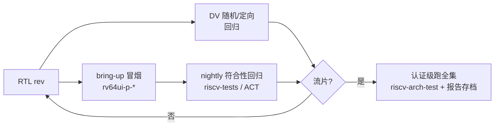
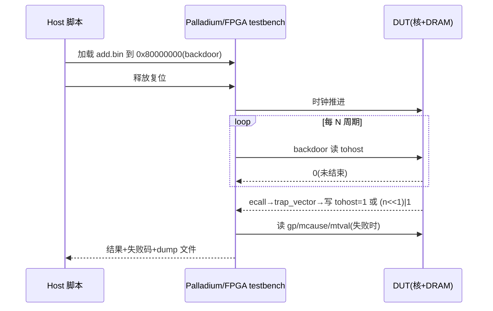
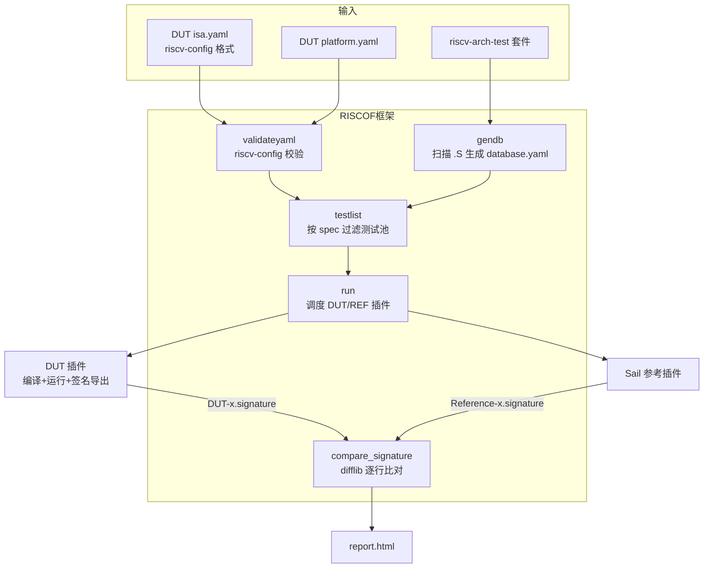
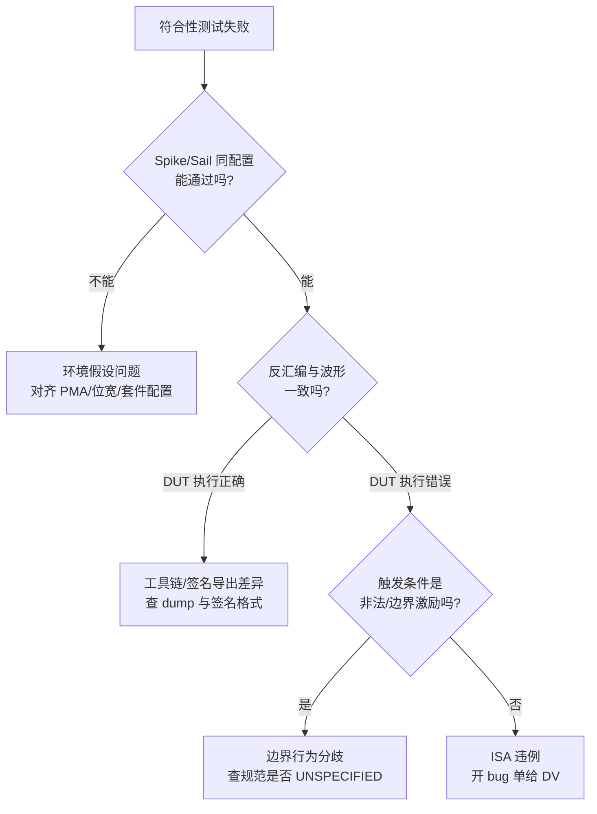

# 架构符合性测试:riscv-tests 与 RISCOF

> DV 回答的是"实现是否符合设计意图",架构符合性测试(Architectural Compliance Test,ACT)回答的是"实现是否符合规范"——两个问题都需要回答,且不可互相替代。本篇覆盖两套测试(riscv-tests、riscv-arch-test)、两代框架(RISCOF、ACT4),以及把它们跑上 Palladium/FPGA 的完整适配流程。

| 前置阅读 | 需要回忆的点 |
| --- | --- |
| [工具链与模拟器](./09-toolchain-and-simulator.md) | `-march`/`-mabi`/`-mcmodel=medany`、Spike 的角色 |
| [中断与异常](./04-interrupts-and-exceptions.md) | `mcause`/`mtvec`/`mepc`、trap 向量的分发逻辑 |
| [特权模式与 CSR](./03-privileged-modes-and-csr.md) | `mstatus` 的 MPP/FS 位、PMP 寄存器 |
| [硅前验证环境](./20-presilicon-validation-environment.md) | Palladium/FPGA 平台的镜像加载与内存后门访问方式 |

本篇源码引用均出自本仓库 `riscv/src/` 下的三个克隆:`riscv-tests`、`riscof`、`riscv-arch-test`。

## 1. 为什么需要架构符合性测试

### 1.1 它和 DV 定向验证回答的不是同一个问题

DV 的定向/随机验证以自家 reference model 和 assertion 为判定依据。它的强项是覆盖设计者**想到**的行为;盲区在于:如果 RTL 和 reference model 对规范的理解同源地错了,DV 发现不了。

架构符合性测试引入了外部基准:

- 测试集是**第三方写的、公开的**,直接从规范条文中导出(riscv-arch-test 甚至逐条关联到 ISA 手册的规范性语句);
- 判定是**确定性的**——同样的输入,任何合规实现要么行为一致,要么测试明确区分出两种合法行为;
- 参考答案来自**独立的黄金模型**(Spike、Sail),与被测 RTL 无血缘关系。

riscv-arch-test 的 README 第一段就把边界划得很清楚:"These are not verification tests and additional verification should be run on all processors."——ACT 是必要的,但不充分:

| 对比维度 | DV(定向/随机) | 架构符合性测试(ACT) |
| --- | --- | --- |
| 激励来源 | 验证环境自己生成 | 第三方公开套件,确定性 |
| 判定依据 | 设计意图(reference model/assertion) | ISA 规范 + 独立黄金模型 |
| 覆盖方向 | 定向覆盖设计特征点,随机覆盖角落 | 规范条文的正向采样 |
| 强项 | 微架构时序、cache 行为、非法激励 | 架构可见状态(GPR/CSR/内存)的规范一致性 |
| 弱项 | 与规范同源的错误发现不了 | 不测微架构、不做性能、覆盖不了负向激励空间 |
| 通过的含义 | 无已知 bug | 架构行为与规范一致 |

还有一个容易被忽视的结构性弱点:riscv-tests 的自检查依赖被测指令"自己证明自己"。它的 README 讲得很直白——自检查的分支指令(`bne`)若本身有 bug,错误结果也可能被判通过。所以 ACT 通过≠无 bug,它只是把"和规范不一致"这一类问题尽早暴露。

### 1.2 什么时候跑

ACT 在硅前流程里有三个典型时点,重要性和范围不同:

1. **bring-up 冒烟**:RTL 第一次能跑程序时,`rv64ui-p-simple` 是比"Hello World"更好的第一个程序——它不依赖 UART 驱动,只需要内存和正确执行。跑通 `rv64ui-p-*` 全集(几十个)就证明整数基准 ISA 基本成立。
2. **版本回归**:RTL 每周 rev、工具链升级、constraint 改动,都应把符合性套件作为 nightly 回归的一部分。它是"无主"的测试——不随某人的 DV 环境变动,升级套件版本即可获得社区新增的测试。
3. **认证**:要声明 RVA23/RVA20 profile 合规时,跑 riscv-arch-test 全集并留档报告(套件版本 + commit + 测试结果),这是 RISC-V International 认证的流程要求。



## 2. riscv-tests:先跑起来的那一套

riscv-tests 是自检查套件:每个测试自带 pass/fail 判定,经 tohost 上报。本节从仓库结构讲到判定协议与构建体系,最后落到 Palladium/FPGA 上的搬运流程。

### 2.1 仓库里有什么

以本仓库克隆的 master 分支为准,顶层五个目录:

| 目录 | 内容 | 对 DUT 验证的价值 |
| --- | --- | --- |
| `isa/` | 架构测试,按 `rv64ui`、`rv64ua`、`rv64uzbb`… 分目录 | 符合性主力,本篇主角 |
| `env/` | 测试运行环境(git submodule,指向 riscv-test-env 仓库),含 `p/`、`pm/`、`pt/`、`v/` 四种 | 裸机 DUT 用 `p` 环境 |
| `benchmarks/` | UCB riscv-bmarks(median、qsort、mm 等) | 性能/压力参考,不做符合性判定 |
| `debug/` | JTAG 调试器测试(gdbserver.py + OpenOCD/Spike) | 验证 debug module 时的独立战线 |
| `mt/` | 多线程矩阵乘测试 | 多核 DUT 的粗粒度并发冒烟 |

`isa/` 的目录名是编码的:`rv64ui` = RV64 + user 级 + integer;`rv64mi` 是 M 级(测 trap/CSR/PMP);`rv64ua/uc/ud/uf/um` 对应原子/压缩/双精/单精/乘除;`rv64up` 是 P 扩展(packed SIMD);`rv64uzb*`/`rv64uzfh`/`rv64uzicond` 等是 Zb* 位操作等 Z 扩展;`hypervisor/` 覆盖 H 扩展。

每个目录一个 `Makefrag` 列出测试清单,数量以 Makefrag 的 `sc_tests` 列表为准。RV64 一套约 500 个 `.S` 源文件,其中 `rv64up` 占 312 个;典型 RV64GC 核心六件套(ui/uc/um/ua/uf/ud)约 110 个。

`env/` 需要特别注意:**克隆仓库后它是空的**,必须 `git submodule update --init` 才有内容。`p` 环境是"physical、单核、虚拟内存关闭"——恰好是 Palladium/FPGA 上最容易满足的世界。

### 2.2 一个测试的解剖

以 `isa/rv64ui/add.S` 为例:它 include 两个头文件(`riscv_test.h` 提供运行环境,`test_macros.h` 提供断言宏),正文是几十组数据驱动的用例,每组一行 `TEST_RR_OP(testnum, inst, result, val1, val2)`,宏展开后就是"取操作数→执行→比对"的序列。宏的源头在 `isa/macros/scalar/test_macros.h`:

```c src="./src/riscv-tests/isa/macros/scalar/test_macros.h" lines="13-18" anchor="test_case"
```

```c src="./src/riscv-tests/isa/macros/scalar/test_macros.h" lines="172-177" anchor="test_rr_op"
```

`TEST_RR_OP` 展开成 `TEST_CASE`:先 `li TESTNUM, testnum` 记下测试号,执行指令,`bne` 比对——不匹配就跳到 `fail` 标签。`TESTNUM` 就是 `gp` 寄存器,失败时它指明死在第几号用例。整个测试文件以 [`TEST_PASSFAIL`](#src-test_passfail) 收尾,它根据 `TESTNUM` 是否为 0 跳到 fail 或 pass:

```c src="./src/riscv-tests/isa/macros/scalar/test_macros.h" lines="882-887" anchor="test_passfail"
```

`add.S` 在纯语义用例之外,还有一组源/目的寄存器重叠和旁路(bypass)用例:

```asm src="./src/riscv-tests/isa/rv64ui/add.S" lines="45-62" anchor="add_bypass"
```

`TEST_RR_DEST_BYPASS(21, 1, add, ...)` 的意思是:上一条指令的结果隔 1 个周期就被 `add` 消费——这是在压转发路径(forwarding)的时序。配合 `TEST_RR_SRC12_BYPASS` 的各种延迟组合,乱序/流水线设计的转发网络会被这几十行密集扫过,能抓到纯语义测试覆盖不到的转发路径 bug。

### 2.3 判定协议:tohost 与签名区

pass/fail 最终由 `env/p/riscv_test.h` 的宏落地。这两个宏没有用任何"打印",而是通过 `ecall` 触发 trap、在 trap 向量里统一写一块约定内存:

```c src="./src/riscv-tests/env/p/riscv_test.h" lines="262-293" anchor="passfail_sig"
```

`RVTEST_PASS` 把 `TESTNUM` 置 1 后 `ecall`;`RVTEST_FAIL` 把测试号左移一位再置最低位(`(n<<1)|1`)后 `ecall`。ecall 进入 trap 向量,由 [`trap_vector`](#src-trap_vector) 识别 `mcause` 为 ecall 后跳 `write_tohost`,把 `TESTNUM` 写进 `tohost` 变量:

```c src="./src/riscv-tests/env/p/riscv_test.h" lines="183-218" anchor="trap_vector"
```

```c src="./src/riscv-tests/env/p/riscv_test.h" lines="219-249" anchor="reset_vector"
```

这就是 **tohost 协议**:测试把自己的终态写进 `tohost` 这个 8 字节内存单元,然后死循环;运行环境(Spike 的 HTIF,或者你的 testbench)轮询这个地址:

- `tohost == 1`:通过;
- `tohost` 为奇数且 `>1`:失败,失败码 = `tohost >> 1`,即 `RVTEST_FAIL` 编码的测试号;
- 未经处理的异常(走到了 `other_exception`)会把 `TESTNUM` OR 上 1337 再写,同样表现为失败;
- 永远不变:挂死,由超时机制兜底(见 2.5)。

数据段的 [`RVTEST_DATA_BEGIN`](#src-passfail_sig) 还定义了 `begin_signature`/`end_signature` 标签。签名区(signature)是测试执行过程中有意留下的"结果痕迹"。

riscv-tests 的自检查测试大多不写签名区;签名区服务于 golden-model 比对流程——同一测试在 DUT 与 Spike/Sail 上各跑一遍,dump 出 `begin_signature..end_signature` 之间的内存逐字比对。RISCOF 的整个判定体系就建立在这上面(见 §3)。

`reset_vector` 是测试的运行时前提,里面全是**环境假设**:

- `INIT_XREG` 清零所有 GPR,`CHECK_XLEN` 用 `slli` 的符号位检查 XLEN——**不匹配时直接 `RVTEST_PASS` 伪通过**(避免把"跑错位宽的镜像"误报为 bug,但也意味着通过报告里看不出位宽错了,见 5.2);
- `RISCV_MULTICORE_DISABLE`:非 0 号核自旋等待,测试只在 core 0 上跑;
- `INIT_PMP`/`INIT_SATP`/`INIT_RNMI`:先临时把 `mtvec` 指到跳过标签再写 CSR——**CSR 不存在就 trap 并跳过**,所以无 PMP 的核也能通过初始化;
- `DELEGATE_NO_TRAPS`:清空 delegation,所有 trap 收敛到 M 模式的 `trap_vector`;
- 最后设置 `mepc` 并 `mret` 到测试体——所以 `p` 环境的"user 级"测试实际在 M 模式执行,`ecall` 是 `CAUSE_MACHINE_ECALL`。

### 2.4 构建体系:目标名、环境与链接

`isa/Makefile` 用一个 `compile_template` 模板为每个套件生成两条规则,按环境后缀命名目标:

```make src="./src/riscv-tests/isa/Makefile" lines="87-109" anchor="compile_template"
```

`$(1)-p-%` 和 `$(1)-v-%` 分别是 physical/虚拟内存环境:`-p-` 用 `env/p/riscv_test.h` 和 `env/p/link.ld` 静态编译成裸机 ELF;`-v-` 额外链接 `env/v/entry.S` 和页表建立代码,并基于目标名哈希注入 `ENTROPY`(把 `.data` 段随机重定位,防止签名里出现绝对地址)。

`RISCV_GCC_OPTS` 是 `-static -mcmodel=medany -fvisibility=hidden -nostdlib -nostartfiles`——无标准库、无启动文件,ELF 的入口就是 `_start`。`make run` 目标默认用 `RISCV_SIM ?= spike` 在模拟器上跑;对 FPGA/Palladium,你要的产物是 `-p-` 的 ELF,再转成加载镜像。

`env/p/link.ld` 定死了测试的内存地图:

```ld src="./src/riscv-tests/env/p/link.ld" lines="1-16" anchor="link_p"
```

代码从 `0x80000000` 起(DRAM 基址的约定俗成),`.tohost` 段独立成页。**DUT 的内存地图不是这个布局时,改 link.ld 重新编译,不要试图改测试**。三个输出 section 的顺序(`.text.init` → `.tohost` → `.text`)也让 tohost 地址可以通过 ELF 符号表精确拿到:`riscv64-unknown-elf-nm` 一下 `tohost` 符号即可。

构建还有一个容易被忽略的产出:每个 ELF 旁边一份同名 `.dump` 反汇编。`isa/Makefile` 的默认目标 `all` 生成的就是它(`RISCV_OBJDUMP` 带 `--disassemble-all --disassemble-zeroes`,连全零区也反汇编)。

**每轮回归把 ELF 和 `.dump` 成对归档**。失败分析时"反汇编里找失败 PC"是第一动作;现场重新生成 dump 可能因为工具链版本漂移而对不上当时的镜像,那时再解释"为什么波形和反汇编不一致"就晚了。

### 2.5 搬到 Palladium/FPGA 上跑

核心认识:spike 上的流程是"加载 ELF → 轮询 tohost → 报告"。你的 DUT 没有 HTIF,所以要**由 testbench 扮演 spike 的那一半**。完整流程:

1. **编译**:`cd riscv-tests && autoconf && ./configure --prefix=$RISCV/target && make XLEN=64`,产物 `isa/rv64ui-p-add` 等 ELF(顺带生成 `.dump` 反汇编,失败分析必留);
2. **转镜像**:`riscv64-unknown-elf-objcopy -O binary isa/rv64ui-p-add add.bin`,按 DUT 加载通道再转(Palladium 常用 hex/coe 直接预初始化 memory 模型,FPGA 常用 JTAG/以太网搬运);
3. **下载**:Palladium 走 backdoor 写 DRAM(不经总线,秒级)或 JEDEC/AXI slave 通道;FPGA 走 JTAG(慢,百 KB/s 级)或板级以太网。注意 ELF 含 `.text.init` 起始的连续段,直接按 `0x80000000` 基址摆;
4. **运行与轮询**:释放复位,程序从 `0x80000000` 的 `_start` 执行;testbench 以固定间隔(比如每 10 万仿真周期)backdoor 读 `tohost` 单元,值非零即终止;
5. **判定**:按 2.3 的编码解释 tohost,记录通过/失败/失败码;
6. **失败 dump**:失败时立刻抓 `TESTNUM(gp 寄存器值)`、当前 PC、`mcause/mtval`,触发波形回卷(emulation 都有 RTL 活动窗口);必要时 dump `begin_signature..end_signature` 区做离线比对。



两个必备的健壮性机制:

- **超时**:每个测试设独立的 wall-clock 上限(经验值:单测试动态指令数在 10^4~10^5 量级,Palladium 上给到正常执行的 10 倍时长)。超时按失败处理,dump 出波形再看——挂死通常意味着 trap 死循环或取指卡死。
- **失败 dump 自动化**:不要等到人来看。失败瞬间自动抓 PC、`gp`(TESTNUM)、`mcause`、`mtval` 和一段反汇编窗口,和 `.dump` 文件对得上,才能直接定位到死在第几号用例。

最后是裁剪的现实:`make isa` 会构建所有套件,但 DUT 未实现的扩展(比如核没有 P 扩展)编出来的镜像跑上去只会死在 illegal instruction。选择是按目录构建:`make -C isa rv64ui rv64um`(目标名即套件名),或者接受"未实现扩展的失败"并在结果分类里过滤。

**裁剪原则:跑过的子集必须留档**——"我跑了哪些目录、套件什么版本"是结果可信度的一部分。

## 3. RISCOF:按 ISA 配置自动选测试的框架

RISCOF 解决的问题:给定 DUT 的 ISA/平台配置,自动选出适用的测试,在 DUT 与黄金模型之间比对签名出报告。它补的正是 riscv-tests 的盲区(§3.1)。

### 3.1 riscv-tests 的盲区

riscv-tests 的构建是**静态**的:每套件固定一个 `-march`,全量构建、全量跑。它不回答"我的配置(RV64IMACB、无 F/D、PMP 16 项、misaligned 支持)该跑哪些测试、哪些用例该跳过"。RISC-V 的可配置性让这个问题很实际:Zbb 的测试对无 Zbb 的核毫无意义;PMP 相关用例对 PMP 项数不同的核,合法行为也不同。

RISCOF(RISC-V Architectural Test Framework,InCore 半导体贡献)把这个选择过程自动化:给框架一份 DUT 的 ISA/平台 YAML(riscv-config 格式),它扫描测试池、过滤出适用测试,分别交给 DUT 插件和黄金模型(Sail)执行,比对签名得出报告。

### 3.2 三件套与流水线

三个组成部分:

1. **riscv-arch-test 测试套件**:测试池(§4 详述);
2. **参考模型插件**:官方提供 Sail C 模型插件(`sail_cSim`),黄金签名的来源;
3. **DUT 插件**:你写的 Python 类,负责编译、运行、导出签名。



命令形态(细节见 `riscof --help` 与官方文档):

```bash
# 生成插件模板和 config.ini
riscof setup --dutname=myfpga
# 完整跑
riscof run --suite riscv-arch-test --env riscv-arch-test/env \
    --config config.ini --work-dir riscof_work
```

四个子命令对应流水线的四步:`validateyaml`(校验两份 YAML)→ `gendb`(扫描套件)→ `testlist`(过滤)→ `run`(执行 + 比对)。`run` 支持 `--dbfile`/`--testfile` 复用上次的结果(调试失败测试时不必重跑全集),`--no-dut-run`/`--no-ref-run` 分别只跑一侧。

### 3.3 config.ini

框架本身的配置是一份 ini 文件,分三段——全局段声明两个插件,随后每个插件一段自己的参数。模板就在 RISCOF 源码里:

```ini src="./src/riscof/riscof/constants.py" lines="27-41" anchor="config_temp"
```

`[RISCOF]` 段的四个 key 指定 DUT/参考插件的名字和路径;`[<dut-name>]` 段里 `ispec`/`pspec` 指向 riscv-config YAML,`target_run=0` 表示只编译不运行(调编译问题用),`jobs` 控制并行度。

插件名有个硬约定:文件必须叫 `riscof_<name>.py`,里面的类名必须等于 `<name>`,框架靠 `importlib.import_module("riscof_" + dut_model)` 动态加载。

### 3.4 DUT 插件要实现的接口

基类 `pluginTemplate` 是个 ABC,三个必须实现的抽象方法构成了插件契约:

```python src="./src/riscof/riscof/pluginTemplate.py" lines="33-53" anchor="plugin_initialise"
```

```python src="./src/riscof/riscof/pluginTemplate.py" lines="54-79" anchor="plugin_build_run"
```

- `initialise(suite, workdir, env)`:拿到工作目录、套件目录和 env 头文件目录;插件在这里准备编译命令模板;
- `build(isa_yaml, platform_yaml)`:收到**校验过**的 DUT 规格 YAML,从里面提取 XLEN 等信息调整编译命令——这是"按配置组装"落到插件侧的钩子;
- `runTests(testlist)`:拿到过滤后的测试清单,每个条目含 `test_path`(`.S` 路径)、`work_dir`(该测试的产物目录)、`isa`(该测试要求的 march 字符串)和 `macros`(要 `-D` 的条件宏)。**插件全权负责编译和运行**,这使它能适配任何 DUT。

官方模板 `Templates/setup/model/riscof_model.py` 的 `runTests` 展示了标准写法(它面向 spike 类模拟器,我们只取其骨架):

```python src="./src/riscof/riscof/Templates/setup/model/riscof_model.py" lines="126-154" anchor="model_runtests"
```

要点:

- 签名文件的命名是**框架的硬性约定**,必须写成 `os.path.join(testentry['work_dir'], self.name[:-1] + ".signature")`。`self.name` 是个属性,返回 `"<角色>-<插件名>:"`(DUT 侧是 `DUT-myfpga:`),`[:-1]` 去掉尾冒号——所以 DUT 侧签名实际叫 `DUT-<插件名>.signature`,参考侧叫 `Reference-<插件名>.signature`,框架就按这两个名字去找文件;
- 编译宏从 `testentry['macros']` 取并加 `-D` 前缀;
- 模板用 `utils.makeUtil` 生成一个 Makefile 再 `make -k -jN` 并行执行全部测试,单个测试失败不中断整批。

执行完两侧后,框架回收签名并比对:

```python src="./src/riscof/riscof/framework/test.py" lines="452-474" anchor="signature_check"
```

比对就是 `difflib` 逐行 diff:两份签名文件完全一致为通过,否则失败并在报告里附上第一处差异行。签名文件格式是纯文本、每行一个 32 位十六进制值(由测试的 `RVMODEL_DATA_BEGIN/END` 宏圈定的内存区导出,见 §4.2)。

### 3.5 为 FPGA/Palladium DUT 写一个最小插件

与模拟器插件的三处实质差异:**编译用交叉工具链(和模拟器一样),运行变成"远程执行+镜像下发",签名导出变成"内存 dump"**。骨架如下(示意,约 60 行,省略日志与错误处理):

```python
import os
import subprocess
from riscof.pluginTemplate import pluginTemplate
import riscof.utils as utils

class myfpga(pluginTemplate):
    __model__ = "myfpga"
    __version__ = "0.1"

    def __init__(self, *args, **kwargs):
        super().__init__(*args, **kwargs)
        config = kwargs.get('config')
        # config.ini 里 [myfpga] 段的所有自定义 key 都在这里可用
        self.pluginpath = os.path.abspath(config['pluginpath'])
        self.isa_spec = os.path.abspath(config['ispec'])
        self.platform_spec = os.path.abspath(config['pspec'])
        self.loader = config['loader']       # 镜像加载脚本,如 ssh+palladium 通道
        self.target_run = config.get('target_run', '1') == '1'

    def initialise(self, suite, work_dir, archtest_env):
        self.work_dir = work_dir
        # RISCOF 风格的编译命令模板:占位符在 runTests 里 format
        self.compile_cmd = ('riscv64-unknown-elf-gcc -march={0} -mabi={1} '
            '-static -mcmodel=medany -fvisibility=hidden -nostdlib -nostartfiles '
            '-T ' + self.pluginpath + '/env/link.ld '
            '-I ' + self.pluginpath + '/env/ -I ' + archtest_env + ' {2} -o {3} {4}')

    def build(self, isa_yaml, platform_yaml):
        ispec = utils.load_yaml(isa_yaml)['hart0']
        self.xlen = '64' if 64 in ispec['supported_xlen'] else '32'
        self.abi = 'lp64' if self.xlen == '64' else 'ilp32'

    def runTests(self, testList):
        for testname in testList:
            entry = testList[testname]
            elf = os.path.join(entry['work_dir'], 'my.elf')
            sig_file = os.path.join(entry['work_dir'], self.name[:-1] + '.signature')
            macros = ' -D' + ' -D'.join(entry['macros'])
            cmd = self.compile_cmd.format(entry['isa'].lower(), self.abi,
                                          entry['test_path'], elf, macros)
            subprocess.run(cmd, shell=True, check=True, cwd=entry['work_dir'])

            if self.target_run:
                # 运行 = 调加载脚本:下发 bin、跑 DUT、轮询终止条件、dump 签名区
                # loader 脚本内部完成 objcopy、backdoor 写、超时控制,最后写出 sig_file
                subprocess.run(
                    '{0} {1} {2}'.format(self.loader, elf, sig_file),
                    shell=True, check=True, timeout=1800, cwd=entry['work_dir'])
            else:
                open(sig_file, 'w').close()   # 只编译:占位空签名
```

工程上决定成败的是 `loader` 脚本和它背后的通道,职责清单:

1. `objcopy -O binary` 转 bin,按 DUT 内存地图重定位(RISCOF 套件的 link.ld 基址要改成你 DRAM 的基址——签名区地址、代码地址全由它决定);
2. 通过 Palladium 的 backdoor API 或 FPGA 的加载通道写 DRAM;
3. 释放复位,循环里轮询终止条件:riscv-arch-test 测试结束时执行 `RVMODEL_HALT`(你需要在 `env/model_test.h` 里把它定义成写一个约定的 magic 地址,或直接 `wfi`),testbench 识别后停;
4. **dump 签名区**:`begin_signature`/`end_signature` 符号地址从 ELF 的符号表拿(`nm` 或 pyelftools),backdoor 读出这段内存,按"每行 8 个十六进制字符、32 位"写成文本——格式错了比对必失败;
5. 超时(推荐 30 分钟每测试起)与失败 dump:波形回卷触发条件、`mcause/mtval` 抓取,和 §2.5 完全同构。

代价要说清楚:RISCOF 的并行模型(生成 Makefile 后 `make -jN`)假设"多个独立执行流"。你的 Palladium 机器通常一次只能跑一个镜像,`jobs=1` 串行是常态;要并行就得有 emulator farm(多台机器,loader 脚本带资源分配)。

全套 riscv-arch-test 数百个测试 × 单测试分钟级,单机串行是**天级**作业,这也是把 ACT4 自检查格式(§4.3)看作对 emulation 更友好的原因之一。

## 4. riscv-arch-test:认证级套件与它的两代格式

riscv-arch-test 是 RISC-V International 的官方认证测试集。本节讲它与 riscv-tests 的分工、经典 RISCOF 配套格式与 ACT4 自检查格式两代格式的差异,以及混用两代套件的兼容坑。

### 4.1 和 riscv-tests 的关系

两者常被混为一谈,定位其实不同。riscv-tests 起源于 Berkeley T0 项目的测试策略,通过与否由 tohost 约定判定,生态围绕 Spike;riscv-arch-test 是 RISC-V International 的官方认证测试集(Certification Test Plan,CTP),通过与否由**签名比对**判定,并由专门的框架组装。

riscv-arch-test 的 TestFormatSpec 明文规定测试**不得依赖工具或模拟器特性**(原文点名 "e.g. tohost")——因为认证测试必须能在任何合规目标上跑,tohost 这种 Spike 私有协议不能进认证链。

分工经验:riscv-tests 做**日常回归**(轻、快、社区新增测试活跃),riscv-arch-test 做**认证存档**(重、全、有版本化报告)。两者覆盖面有重叠(基础整数指令),但认证场景只认后者。

### 4.2 经典 test-format:RISCOF 配套的格式

RISCOF 消费的测试格式(3.x 版 riscv-arch-test)长这样:每个 `.S` 文件以 `RVTEST_ISA("RV32I")` 声明 ISA,正文由若干 `RVTEST_CASE(id, cond_str, cov_label)` 包裹的用例组成。规范文档里给出的实例:

```asm src="./src/riscof/docs/source/TestFormatSpec.adoc" lines="342-347" anchor="rvtest_case_example"
```

`cond_str` 里 `check` 打头的是对 DUT 规格的谓词(`ISA:=regex(.*I.*)` 即"实现了 I 扩展"),`def` 打头的是该用例启用时要传给编译器的宏。框架扫描测试时就靠这两条正则:

```python src="./src/riscof/riscof/dbgen.py" lines="21-22" anchor="dbgen_regex"
```

`gendb` 把每个文件的 ISA 声明和用例条件提取进 `database.yaml`,`testlist` 阶段拿 DUT 的 isa/platform YAML 逐条求值 `cond_str`——这就是 §3.1 说的"按配置自动选测试"的实现:选择粒度不是文件,是**单个用例**。

目标侧的钩子是 `RVMODEL_*` 系列宏(`RVMODEL_DATA_BEGIN/END` 圈定签名区、`RVMODEL_HALT` 停机、`RVMODEL_BOOT` 引导),它们定义在**每个 DUT 插件自己的 env 头文件**里。同一份测试源码,不同目标编译出不同的可执行文件,但签名区地址和语义一致,于是两侧签名可比。

签名格式也有规范:签名区预填 `0xdeadbeef`,导出为每行一个 32 位十六进制值。**签名区没被测试写过也保留 `0xdeadbeef` 原样导出**——"没有结果"本身是结果。

### 4.3 ACT4:自检查时代

2026 年 4 月,riscv-arch-test 发布 4.0.0(本仓库克隆的即此版本),CHANGELOG 的原话:"The old `riscof`/`riscv-ctg`/`riscv-isac`/`riscv-config` flow has been replaced"。框架被重写为 Make + Python(`make` 驱动),三个关键变化:

1. **测试由 testplan 生成**:`testplans/*.csv` 以指令 × coverpoint 矩阵描述测试计划(如 `testplans/I.csv` 里 add 行标了 `cp_rs1`/`cp_rs2`/`cp_rd` 等覆盖点),生成器产出 `.S` 文件。测试不再是手写的;
2. **期望值来自 Sail 并编进 ELF**:框架先编译"签名采集版"(`.sig.elf`)在 Sail 上跑出期望结果,再重新编译成**自检查 ELF**——DUT 上执行时逐用例比对,当场报告;
3. **判卷在目标侧完成**:每个测试结束时打印一行 `RVCP-SUMMARY: TEST PASSED - Test File "<name.S>"`(失败则 `TEST FAILED`,并附失败的 PC、指令、寄存器、期望值与实际值)。宿主机只需要收集输出,grep 这行字符串。

一个 ACT4 测试的开头直接声明自己的依赖(本仓库实例):

```asm src="./src/riscv-arch-test/tests/rv32i/I/I-add-00.S" lines="11-28" anchor="act4_header"
```

DUT 侧配置从"RISCOF 插件"变成一个**配置目录**。以仓库里的 CVW(CORE-V Wally 开源核)配置为例,`config/cores/cvw/cvw-rv64gc/` 下:

- `test_config.yaml`:编译器、Sail 路径、UDB 配置、链接脚本路径;
- UDB YAML:声明支持的扩展和参数(取代 riscv-config);
- `rvmodel_macros.h`:实现 `RVMODEL_HALT_PASS/HALT_FAIL` 等停机/打印宏;
- `link.ld`、`sail.json`。

其中 `test_config.yaml` 全文不过几行:

```yaml
name: cvw-rv64gc
compiler_exe: riscv64-unknown-elf-gcc
objdump_exe: riscv64-unknown-elf-objdump
ref_model_exe: sail_riscv_sim
udb_config: cvw-rv64gc.yaml
linker_script: link.ld
dut_include_dir: .
```

构建命令 `CONFIG_FILES=<该目录>/test_config.yaml make --jobs $(nproc)` 产出 `work/<config>/elfs/` 下的全部自检查 ELF。README 对运行方式的原话:"The user is then responsible for running all of the ELF files on the DUT with the user's own testbench."——框架完全退出运行环,只留下一目录 ELF 和每核一份的运行命令(`run_cmd.txt`,CVW 的例子:`wsim --sim verilator {debug:...} rv64gc --elf`,脚本追加 ELF 路径)。

**这对 Palladium/FPGA 是实质利好**:不再需要插件在运行中途导出签名,不再需要宿主机在 DUT 活着的时候碰内存。你只需要让 DUT 能跑 ELF + 能把一行结果送出来(UART、memory-mapped magic 地址轮询都行),然后:

```bash
# host 侧:全部 ELF 逐个下发,收集输出
for elf in work/mycore/elfs/*.elf; do
    ./load_and_run.sh "$elf" | tee "logs/$(basename $elf).log"
done
grep -L "RVCP-SUMMARY: TEST PASSED" logs/*.log   # 列出失败的测试
```

失败测试的日志自带"哪个用例、期望什么、实际什么",配合 `DEBUG=True` 构建出的 Sail trace(`.sig.log`)和 trap 报告(`.sig.trap_report`),复现材料大半是现成的。代价是新框架依赖较重(mise/uv、Ruby/UDB、Sail 0.13.1 版本锁定),而且测试是生成物、不可手改——要定制只能改 testplan 重新生成。

### 4.4 test-format 版本兼容坑

这是把三个仓库放在一起才看得分明的一个坑:**经典 RISCOF 与 ACT4 的套件互不兼容,且从目录外观上几乎看不出来**。

- RISCOF 的 `gendb` 靠 `RVTEST_ISA(...)`/`RVTEST_CASE(...)` 识别测试;ACT4 的 `.S` 文件里两者都没有(是 `START_TEST_CONFIG` 头 + `RVTEST_BEGIN`)。把 ACT4 的 `tests/` 目录喂给 RISCOF 当 `--suite`,`dbgen` 的正则一个都匹配不上,**测试池为空,run 直接空转通过**——0 个测试、0 个失败,报告看起来全绿,实际什么都没测;
- 反过来,ACT4 框架也不认 3.x 格式的套件;
- 旧格式套件仍在 riscv-arch-test 仓库的 `old-framework-3.x` 分支维护(CHANGELOG 的 "Previous Versions" 指路),RISCOF 的 `riscof arch-test --clone` 拉的是 main 分支——**用哪代框架就要锁哪代套件分支**,升级框架时这是显式动作;
- 版本锁不止套件:riscv-config YAML 的 schema 版本、Sail 模型版本(ACT4 声明兼容 0.13.1)、交叉工具链版本(ACT4 官方只测最新 GCC/LLVM)都参与期望值生成,认证报告里要一并记录。

实践建议:结果目录命名带上套件 commit hash(RISCOF 报告里本来就有 `rvarch_version` 字段),换版本必须重跑全集而不是增量。

### 4.5 怎么选

| 场景 | 用什么 | 理由 |
| --- | --- | --- |
| 仿真器上的开发自测 | riscv-tests(`make run` 直接 spike) | 零配置,失败即看 dump |
| bring-up 冒烟(前 10 个程序) | riscv-tests `rv64ui-p-*` 子集 | 不依赖 UART,只要内存和取指 |
| nightly 回归(Palladium/FPGA) | riscv-tests 按扩展目录子集;或 ACT4 自检查 ELF | 前者历史数据可比,后者失败信息更丰富 |
| 认证 / 对外声明合规 | riscv-arch-test(ACT4)全套 + 版本存档 | 认证流程只认官方套件报告 |
| 只想验证某个新扩展 | 对应套件单目录(`make -C isa rv64uzbb`) | 最小闭环 |
| Linux 已 bring-up 后的内核层回归 | LTP(kselftest / kvm-unit-tests 配套) | 换到 syscall 合同层,详见 [Linux 功能测试:LTP](./26-linux-test-project.md) |

> **如何读这张表**:左边两行按"省事"取舍,右边两行按"可信度要求"取舍。中间的 nightly 是自由度最大的位置,选型的真正约束往往不是功能,而是**单次回归的时间预算**(见 5.1)。

## 5. 在 emulation 上的工程实践

本节覆盖三件事:emulation 上跑符合性的时间预算与裁剪策略、失败的分类判读、交给 DV 的复现材料。

### 5.1 时间预算与裁剪

全套符合性在 Palladium 上是**天级**作业,预算要算着花。一个可代入自己参数的估算:

$$
T_{total} \approx N \times \left( T_{load} + \frac{I_{dyn}}{f_{sim}} + T_{dump} \right) + T_{setup}
$$

- $N$:测试数(rv64 核心六件套约 110,riscv-arch-test 全套数百,rv64up 这类大户单独考虑);
- $T_{load}$:镜像下发时间。Palladium backdoor 写 DRAM,1 MB 级镜像秒级;FPGA JTAG 按通道带宽算,百 KB/s 时 1 MB 要 10 秒,以太网通道可到亚秒;
- $I_{dyn}/f_{sim}$:动态指令数除以仿真频率。riscv-tests 单测试 $I_{dyn}$ 约 10^4~10^5;Palladium 常见 $f_{sim}$ 在 MHz 量级,这项通常远小于加载时间;FPGA(50 MHz)上更是噪声;
- $T_{dump}$:签名/波形导出,失败时才有大头(波形回卷下载按分钟计);
- $T_{setup}$:编译、镜像转换、通道初始化,一次性。

代一组真实感数字:Palladium、$f_{sim}=1\,\mathrm{MHz}$、$T_{load}=20\,\mathrm{s}$、单测试 $I_{dyn}=5\times10^4$(执行 50 ms,忽略)、$T_{dump}=0$(全通过)、110 个测试 → 约 37 分钟;若 10% 失败、每个失败多花 5 分钟波形,总时长约 1.5 小时。同参数跑 500 个测试(含 P 扩展)约 3 小时起。

**结论:加载时间主导,而不是仿真速度**。优化方向是 backdoor 加载、按页对齐合并写、或干脆把几十个小测试拼成一个大镜像(套件不支持时的替代:并发多台 emulator)。

裁剪的层次:

1. **按扩展**:只跑 DUT 实现的扩展目录(预算的第一刀);
2. **按频率**:nightly 跑核心六件套,每周跑全集,版本发布前跑全套 + 认证套件;
3. **按阶段**:bring-up 期先 `rv64ui-p-simple/add/lw/sw` 四五个,通了再放开。

### 5.2 失败分类:先问"这是 bug 吗"

符合性失败的三种来源,处理路径完全不同:

| 类别 | 典型症状 | 佐证手段 |
| --- | --- | --- |
| 真 bug(ISA 违例) | 稳定复现;Sail/Spike 与 DUT 同输入不同结果 | 反汇编 + 波形对拍;`mcause/mtval` 与规范条文比对 |
| 工具链差异 | 换 `-march`/工具链版本后消失;失败点在伪指令展开处 | 用 `.dump` 反汇编核对指令编码;固定工具链版本重跑 |
| 环境假设 | 失败集中在特定类别(非对齐、多核、PMP);测试在 spike 上也过不了同款 | 对照测试源码检查前提;spike 加 `--misaligned` 等参数对照 |

第三类最值得展开,四个高频例子:

- **非对齐访存**:规范允许两种合法实现——硬件支持非对齐(2024 版起归入 Zicclsm)或抛 misaligned/load-access 异常,由平台 PMA 决定(特权规范 §3.6)。套件对两种立场都有测试,立场必须和 DUT 的 PMA 一致:`rv64ui/ma_data.S` 直接检查非对齐读回的数据值(默认平台支持非对齐);`rv64mi/ma_addr.S` 的用例注释写明 "either writes the correct value, or takes an exception and performs no writeback",其 `mtvec_handler` 同时接受 misaligned 和 access-fault 两种 `mcause`。DUT 把非对齐判为 access fault 时跑 `ma_data` 必挂,但这是**平台定义问题不是 bug**;反过来,`ma_addr` 挂了才更接近真问题;
- **XLEN 伪通过**:2.3 节的 `CHECK_XLEN` 在位宽不符时静默 PASS。若怀疑镜像位宽装错,核对 ELF 头(`readelf -h` 的 `Class` 字段)而不是看测试结果;
- **初始化依赖**:`INIT_PMP` 假设 `pmpaddr0`/`pmpcfg0` 存在(不存在则静默跳过,但后续 PMP 测试的行为会不同);多核 DUT 上非 0 核自旋等待意味着**测试只约束 core 0**,多核一致性完全不在 riscv-tests 的射程内(mt/ 目录的粗粒度并发测试除外);
- **可选扩展的边界**:计数器(`rdcycle`/`rdinstret`)在 2024 版规范里被拆成独立的 Zicntr 扩展,`rv64mi/zicntr.S` 会测它——没实现 Zicntr 的核在这里失败是预期行为而非 bug,判读时要对照 DUT 的扩展清单。

还有一类"环境假失败"来自黄金模型侧:Sail/Spike 的配置(misaligned、PMP 项数)必须与 DUT 的 YAML 一致,否则两侧签名天然不同——RISCOF 里参考插件和 DUT 插件**共用同一份** ispec/pspec 就是为了这个;ACT4 则要求 `sail.json` 与 UDB 配置严格对齐。



### 5.3 交给 DV 的复现材料

符合性测试的失败最终要 DV 拿波形定位,复现包的标准清单:

1. **输入**:ELF + `.dump` 反汇编(必须同一次构建的)、套件仓库 commit hash、工具链版本(`riscv64-unknown-elf-gcc --version`)、`-march/-mabi` 参数;
2. **现象**:失败测试名与失败码(TESTNUM → 具体用例号,RISCOF/ACT4 报告里都有)、ACT4 的话直接附 `TEST FAILED` 日志(含期望值/实际值);
3. **触发窗口**:波形回卷的触发条件(哪个周期写了 tohost / 打印了失败)、PC 区间、`mcause/mtval` 快照;
4. **黄金对照**:Spike/Sail 的同测试 trace(RISCOF 的 ref 侧日志、ACT4 的 `.sig.log`),以及双方签名 diff;
5. **环境声明**:DUT 配置 YAML(RISCOF)或 UDB 配置(ACT4)、内存地图、已知裁剪范围。

给 DV 的话术要点:符合性测试提供的是**架构级最小复现**——比 DV 自己的随机用例小几个数量级。如果 RTL 修复后重跑,最小闭环就是这一个 ELF,不必等整套回归。

## 6. 下一步

符合性测试管住了"架构可见行为",但 cache 的行为(一致性、别名、自修改代码)在它射程的边缘——`fence.i` 测试只验证最终一致,不验证微架构路径;而性能、功耗、时序收敛,更是从来不在它的承诺范围里。下一专篇把 cache 拿到台前:[缓存行为测试](./22-cache-behavior-testing.md)。
