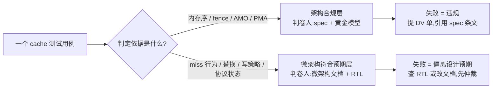
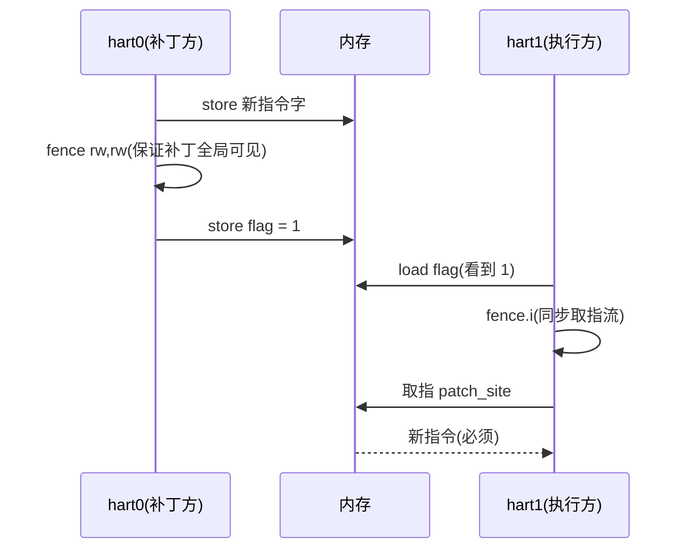
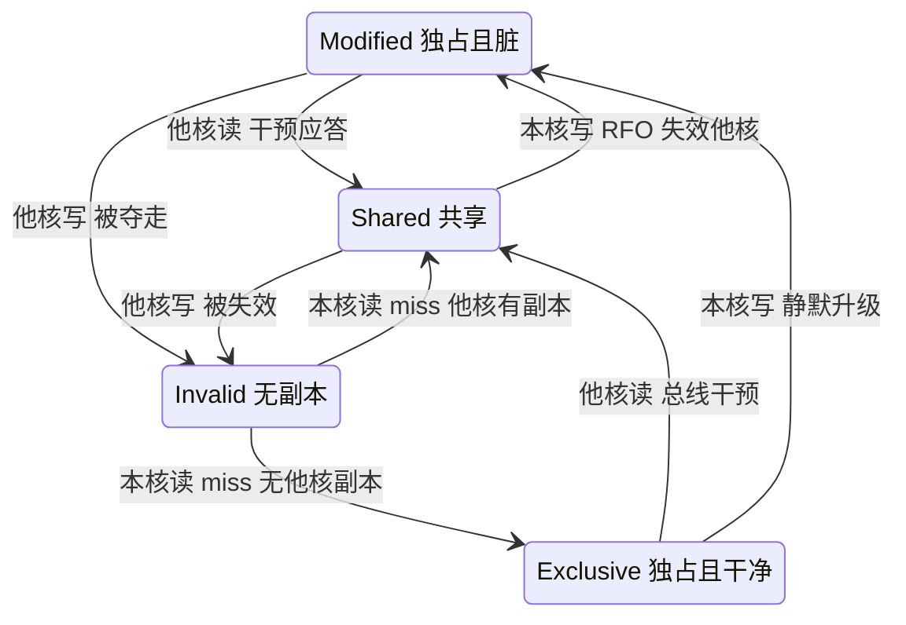

# Cache 行为与一致性测试:软件视角的微架构验证

> 面向 RV 核 IP 硅前验证工程师(软件视角):DV 用波形和断言打 cache 子系统的内部时序,你的武器只有跑在核上的程序——PMU 计数器、`rdcycle` 延迟、跨 hart 的共享内存观察。本篇讲怎么用这些手段在 Palladium/FPGA 上验证 L1 I/D cache、TLB 与多核一致性:能测什么、怎么测、判定依据是谁,以及硅前环境特有的机会与坑。

**一句话定位**:本篇在[硅前验证环境](./20-presilicon-validation-environment.md)和[架构符合性测试](./21-arch-compliance-riscof.md)之上、[性能测量](./23-performance-benchmark-pmu.md)之旁——21 篇管"和规范一致",23 篇管"跑多快",本篇管的是中间那块两者都够不着的地:**cache 的行为对不对**。

测量基础设施(Zihpm 配置、rdcycle 安全读、确定性回归)全部复用 23 篇的结论,本篇不重复。

| 前置阅读 | 需要回忆的点 |
|----------|--------------|
| [性能测量](./23-performance-benchmark-pmu.md) | Zihpm 事件计数器配置、Δ 取差口径、确定性回归金标准 |
| [硅前验证环境](./20-presilicon-validation-environment.md) | 三平台速度/可见性权衡、tohost 自检、DMA 一致性坑 |
| [架构符合性测试](./21-arch-compliance-riscof.md) | ACT 的判卷逻辑(黄金模型)、两 hart 用例的运行环境 |
| [内存管理](./05-memory-management-pmp-sv39.md) | PMP 区域检查、Sv39 页粒度(TLB 探针要用) |

引用约定与术语:

- 非特权规范指 RISC-V Unprivileged ISA 20260517 中间版(本地副本 `reference/riscv-spec.pdf`),特权规范指 Privileged Architecture 20211203(本地副本 `reference/riscv-privileged-20211203.pdf`),引用处标章节号。
- 老版非特权规范(20191213)把内存模型放在第 17 章,20260517 版重排为第 3 章——引用别人的分析文章时先对版本。
- 规范术语叫 cache block(缓存块),行话叫 cache line,本篇指同一物;MESI/MOESI 等协议名属实现选择,规范不规定。

---

## 1. 先划边界:规范管什么,不管什么

写任何 cache 测试之前必须想清楚一件事,否则整个测试计划会建立在错误的期望上:

> **cache 的工作方式几乎全部是微架构实现细节**。替换策略是 LRU 还是 PLRU、写策略是 write-through 还是 write-back、一致性协议是 MESI 还是 MOESI、有没有预取器——规范一个字都不规定。规范约束的只是**架构可见面**:RVWMO 内存模型、fence 语义、原子指令、PMA(物理内存属性)。

推论很直接:**"cache 行为正确性验证"的判卷人通常不是 spec,而是设计自己的微架构文档**。miss 率该是多少、哪个访问该 miss,这些"预期现象"来自 RTL 参数表和微架构文档,与实现比对;spec 只裁决一类问题——内存序违规(观察到了 RVWMO 允许集之外的结果)。

写报告时"与 spec 不符"和"与设计预期不符"是两类完全不同的 bug:前者直接违例、给 DV 提单引 spec 条文即可;后者要么 RTL 偏离了文档,要么文档写错了,得先仲裁"哪个是真相"。

| 对比维度 | 规范态度 | 依据 | 测试判卷人 |
|----------|----------|------|-----------|
| cache block 大小 | 实现定义;声明 Zic64b 则强制 64B | 非特权规范 §4.14 | 微架构文档 |
| 相联度/容量/替换策略 | 完全不管 | — | 微架构文档 |
| 写策略(write-through/back、allocate) | 完全不管 | — | 微架构文档 |
| 预取器 | 不管,但不得有架构可见副作用 | PMA 语义推论 | 微架构文档 + PMA |
| 一致性协议(MESI/MOESI) | 协议本身不管;可缓存主存必须支持写传播 | 特权规范 §3.6.5 | 微架构文档;写传播丢失同时是 spec 违规 |
| 内存序(多核) | RVWMO 严格规定允许的结果集 | 非特权规范 §3.1 | **spec**(唯一裁决) |
| FENCE / FENCE.I | 语义严格规定 | §2.1.7 / §4.1 | **spec** |
| AMO / LR-SC | 原子性、aq/rl、SC 失败条件 | §5.6 / §5.2 | **spec** |
| 区域能否缓存/强序 | PMA 由平台定义,但定义后必须遵守 | 特权规范 §3.6 | 平台 PMA 表 |
| CBO.CLEAN/FLUSH/INVAL | 指令语义规定(到公共点) | 非特权规范 §4.19.5 | **spec** |

于是测试天然分两层,一个用例常常同时服务两层——litmus 用例判定合规,miss 计数观察微架构路径:



> **核心要点**:每个用例动手前先回答两个问题——它观察的现象**谁说了算**(spec 还是设计文档),预期值**从哪来**(条文推导还是 RTL 参数计算)。两个都答不上来的用例,跑出来也不知道 pass/fail 意味着什么。

还有一条容易被忽略的边界:规范对一致性的定义是**单物理地址**性质的(特权规范 §3.6.5:"写一个地址最终对其他 agent 可见"),它不等于内存一致性模型——后者规定"给定读写历史,load 能读到什么值"。

软件一致性测试踩的就是这两条:写传播是 PMA 承诺,结果集是 RVWMO 承诺,两类的失败判定写法不同(前者看数据值,后者看结果枚举)。

---

## 2. 测量手段:三件工具加一个副产品

软件视角能拿到的原始信号只有三种:PMU 事件计数(计数器用法见[性能测量](./23-performance-benchmark-pmu.md) §2.2/§3.3,本篇只讲 cache 特有的口径)、`rdcycle` 延迟、以及跨 hart 的共享内存观察点(数据值本身就是信号)。这一节把三种信号各配一个标准探针。

### 2.1 miss 计数:从"比率"回到"绝对数"

[性能测量](./23-performance-benchmark-pmu.md)里事件计数器服务于 MPKI 这类比率指标;做行为验证时口径要换回来——**在确定性平台上,预期的 miss 不是比率,是绝对数**。"循环访问 5 个冲突地址,LRU 下 4096 次访问应产生 4096 次 miss"是可断言的;"miss 率应该挺高的"不是。

回归基线因此从"指标快照"升级为"计数向量逐项 diff"(§6.1 展开)。

cache 探针的口径细节,按踩坑频率排:

1. **事件号是实现定义的**(特权规范 §3.1.10、非特权规范 §4.4):load miss、store miss、icache miss、TLB miss、写回、干预命中……有哪些事件、编号多少、`S→M` 升级算不算 miss、RFO 算 load 还是 store miss,全部以核手册为准。换核换配置,事件表重查一遍。
2. **分母用该级 cache 的访问数**,不是 instret。miss rate 的定义是 Δmiss/Δaccess,icache 若没有"取指数"事件,用 instret 近似时必须在报告里写明口径(压缩指令下两者不等)。
3. **探针代码自身在污染 icache**:大数组扫描循环的循环体若跨指令行,取指 miss 会混进测量。循环体要小、要手工检查反汇编;纯 dcache 探针在报告里声明"icache 命中假设"或单独扣除。
4. **写策略/一致性探针依赖事件的归类口径**:比如"store miss"在 write-back 核上常伴随一次 fill(RFO),在 write-through 核上可能只是一次写事务——同一个探针在两种核上的预期计数写法不同(§3.2 的表格就是为这个准备的)。

### 2.2 延迟阶梯:用 rdcycle 侧写层次结构

计数器告诉你 miss 了,不告诉你**层次结构对不对**。延迟阶梯补这块:访问模式受控时,平均延迟随步长/工作集的变化画出来是一条阶梯,拐点位置暴露 line size 和各级容量。

原理:stride 小于 line size 时,一条 line 的多次访问只有第一次 miss,平均延迟被命中摊薄;stride 超过 line size 后每次访问都 miss,延迟不再变——跳变点就是 line size。工作集扫描同理,拐点是容量。

完整可跑的探针(裸机 M-mode,输出原始计数,派生指标主机端算——沿用 23 篇的原则):

```c
#include <stdint.h>

/* 数组大小按 DUT 参数改(§6.2):要盖住最大被测层。
 * 对齐到候选 line size 的公倍数,避免首地址错位干扰解读。 */
static uint8_t buf[512 * 1024] __attribute__((aligned(4096)));

static inline uint64_t rd64(void)
{
    uint64_t c;
    __asm__ volatile("rdcycle %0" : "=r"(c));
    return c;
}

/* 扫描一遍:访问 buf[0], buf[stride], buf[2*stride], ...
 * n = 访问次数,返回每次访问的平均周期。volatile + sink 防删除(§6.3)。 */
static uint64_t sweep(uint64_t len, uint64_t stride, uint64_t rounds)
{
    volatile uint64_t sink = 0;
    uint64_t n = (len / stride) * rounds;

    uint64_t t0 = rd64();
    for (uint64_t r = 0; r < rounds; r++)
        for (uint64_t off = 0; off < len; off += stride)
            sink += *(volatile uint8_t *)(buf + off);
    uint64_t dt = rd64() - t0;

    return dt / n;
}

/* 预期:每档先 warm(整段走一遍,不计时),再测 2 遍,报第二遍。
 * warm 消除 compulsory miss;第二遍消除残留冷启动。 */
static uint64_t sweep_warm(uint64_t len, uint64_t stride)
{
    for (uint64_t off = 0; off < len; off += stride)
        *(volatile uint8_t *)(buf + off);
    sweep(len, stride, 1);            /* 第一遍丢弃 */
    return sweep(len, stride, 1);
}

void ladder_report(void)
{
    /* 扫描 A:固定大数组,扫 stride → 拐点 = line size
     * 数组必须远大于 L1(否则 warm 后全命中,阶梯消失) */
    for (uint64_t s = 4; s <= 4096; s <<= 1)
        printf("stride %4lu : %lu cyc/access\n",
               (unsigned long)s,
               (unsigned long)sweep(sizeof(buf), s, 4));

    /* 扫描 B:固定 stride = line size(用扫描 A 测出的值),扫工作集
     * → 第一个拐点 = L1 容量,第二个拐点 = L2 容量 */
    for (uint64_t len = 4 * 1024; len <= sizeof(buf); len <<= 1)
        printf("ws %7lu : %lu cyc/access\n",
               (unsigned long)len,
               (unsigned long)sweep_warm(len, 64));
}
```

数值是示意量级,**以你的 RTL 参数与仿真内存模型延迟为准**。扫描 A 的平均延迟公式(stride ≤ line 时):

$$\text{avg}(\text{stride}) = t_\text{hit} + \frac{\text{stride}}{\text{line}} \times (t_\text{miss} - t_\text{hit})$$

代入 $t_\text{hit}=2$、$t_\text{miss}=18$(L2 档)、line = 64B 算一遍:stride=4 → 3;stride=16 → 6;stride=32 → 10;stride=64 → 18;stride=128 → 18。线性爬升后在 64 处封顶——拐点即 line size。两份解读表:

| stride(字节) | 预期现象 | 拐点/形状的含义 |
|---------------|----------|-----------------|
| 4 → 32 | 平均延迟随 stride 线性上升 | 同一 line 内命中摊薄,斜率正比于 $t_\text{miss}-t_\text{hit}$ |
| **64** | 延迟封顶为 miss 档 | **拐点 = cache line 大小**;声明 Zic64b 的核此处必须是 64 |
| 128 → 4096 | 平坦(全 miss) | line 间无复用,延迟稳定在下一层档位 |
| 4096 一档 | 若出现二次抬升 | 大概率是 TLB:stride = 4KB 与 4KB 页共振(见 §2.4) |

| 工作集(字节) | 预期现象 | 含义 |
|---------------|----------|------|
| ≤ L1 容量 | 命中档(~2 周期) | 工作集装得下 |
| 刚超过 L1 容量 | **跳变到下一层档** | **拐点 = L1 容量**(对照 RTL 参数逐项验证) |
| L1 与 L2 之间 | 稳在 L2 档 | L2 正常服务 |
| 刚超过 L2 容量 | 再跳一档 | 第二个拐点 = L2 容量;没有它 = L2 没接上/没使能 |

> **如何读这两张表**:读的是**拐点位置**而非绝对延迟——仿真内存模型的延迟配置决定档位数值,但拐点位置只由 RTL 参数决定,是跨平台可复现的信号。拐点"软"(渐变而非跳变)通常是预取器在平滑曲线,先跑 §3.3 的预取探针确认再回来解读。

偏离预期时的解读:拐点位置与 RTL 参数对不上(32KB 配置在 16KB 处拐)→ 容量/路数参数错或替换策略配错;扫描 B 无 L2 拐点 → 互连/L2/PMA 有一个没通;扫描 A 无拐点、全程平坦 → 数组落在了非缓存 PMA 区域(§6.3 的头号坑)。

### 2.3 伪共享:stride 64 vs 128 的双线程对照

两个 hart 各自递增自己的计数器,版本 A 把两个计数器放进同一条 line,版本 B 用填充隔开。这是教材里的性能反模式,在验证视角下它有两个身份:一是**一致性失效路径的压力用例**(每次写都触发"失效对端→重新独占"),二是**写传播正确性的断言用例**(计数器终值必须精确等于 N,乒乓再凶也不许丢写):

```c
#define N_INC  100000
#define NHART  2

/* 版本 A:c[0]/c[1] 相距 8 字节,大概率同一条 64B line */
/* 版本 B:c[me] 步长 128 字节,不同 line(对 line ≤ 128B 的实现均成立) */
static volatile uint8_t pad_buf[NHART][128] __attribute__((aligned(128)));

void false_sharing_body(int me)
{
    volatile uint64_t *c = (volatile uint64_t *)pad_buf[me];
    struct pmu_snap b = pmu_snap_read();       /* 23 篇 §3.5 的快照 */
    for (int i = 0; i < N_INC; i++)
        *c = *c + 1;                           /* load + store,无原子指令 */
    struct pmu_snap e = pmu_snap_read();
    report_delta(me, &e, &b);                  /* 每 hart 各自吐 Δ 计数 */
}
```

预期现象(示意量级,事件口径以核手册为准):

| 观察量 | 版本 B(不同 line) | 版本 A(同 line) |
|--------|--------------------|------------------|
| 每 hart dcache miss | ≈ 常数(暖机后全命中,1~2 次) | ≈ N_INC(每次写升级都失效对端,下次再 miss) |
| 循环总周期 | 命中档 | miss 档 × N_INC,慢一个数量级 |
| 计数器终值 | **恰好 N_INC** | **恰好 N_INC(允许慢,不允许错)** |

版本 A 的 miss 数不到预期量级 → 失效升级路径有 bug(比如 S 态写没有真正发失效);终值 < N_INC → **写传播丢失**,这是 spec 级违规(特权规范 §3.6.5 的写传播承诺),直接提单。

反过来,若实现声明了"store 在 S 态直接写、靠总线广播维持一致"(某些 write-through 设计),版本 A 的 miss 形态会不同——预期现象跟着微架构文档走,这就是 §1 说的判卷人问题。

### 2.4 副产品:TLB 阶梯

延迟阶梯扫到大步长时,TLB 的容量阶梯会叠上来:访问间隔恰为页大小时,每次访问都换页,TLB miss 路径的延迟混进曲线。这既是干扰项也是免费探针——**固定 stride = 4KB、扫工作集页数,拐点即数据 TLB 项数**(对照微架构文档;Sv39 下用 2MB 大页重扫一遍可分离"页表级数"与"TLB 容量"两个变量,页表结构见[内存管理](./05-memory-management-pmp-sv39.md))。

`sfence.vma` 之后再扫,若 miss 数没有恢复到冷启动水平,失效粒度有 bug——TLB 项没有按预期被冲掉。

---

## 3. 行为探针:替换、写策略、预取

这一节的每个用例都按同一格式给:构造 → 预期现象(来自设计)→ 偏离时的解读。三个用例合起来覆盖 L1 D$ 数据通路最常出 bug 的三块。

### 3.1 替换策略探针:三种访问模式三条曲线

替换策略只在"有复用、复用又超出相联度"时才区分得出。三种模式各打一个面:

- **顺序流**(stride = line size,数组 ≫ 容量):全部 compulsory miss,miss 数 ≈ 数组大小/line,**与替换策略无关**——这条是基线,用来排除"事件计数本身不对"。
- **循环冲突集**(固定地址集 = ways+1 个,间隔 = 组数×line size,无限循环):纯 conflict miss,策略差异最大。
- **随机访问**(工作集 ≈ 容量,随机置换地址序):容量型 miss,观察曲线陡峭程度。

```c
/* 循环冲突集探针:16KB/4 路/64B 的 dcache
 * 组数 = 16K/(4×64) = 64 组,同组地址间隔 = 64×64 = 4096 字节
 * 冲突集 5 个地址(= ways+1),LRU 理论 miss 率 100% */
#define SETS      64
#define LINE      64
#define WAYS      4
#define NCONF     (WAYS + 1)
#define NITER     4096

static uint8_t conf[NCONF * SETS * LINE] __attribute__((aligned(4096)));

uint64_t replacement_probe(void)
{
    volatile uint64_t sink = 0;
    pmu_clear();                                  /* dmiss 计数清零 */
    for (int i = 0; i < NITER; i++)
        for (int j = 0; j < NCONF; j++)           /* 5 个地址转圈 */
            sink += *(volatile uint8_t *)(conf + j * SETS * LINE);
    return pmu_read_dmiss();                      /* 预期:NITER×NCONF 次,LRU 全 miss */
}
```

把 NCONF 从 2 扫到 WAYS+2,得到 miss 曲线族:

| NCONF | LRU 预期 | 随机替换预期 | 偏离时怎么读 |
|-------|----------|--------------|--------------|
| ≤ WAYS | ≈ NCONF 次(首轮 compulsory 后全命中) | 同左 | 高于预期 → 组索引/路数参数错 |
| WAYS+1 | **100% miss(NITER×NCONF 次)** | 稳态 ≈ $\frac{1}{\text{WAYS}+1}$ = 20% | LRU 核明显低于 100% → 替换策略退化(常见:LRU 位更新漏写);树形 PLRU 有"钉住"效应,落在两者之间,精确值以微架构文档/参考模型为准 |
| WAYS+2+ | 100% | 略升 | 曲线形状对齐文档,不齐 = 替换仲裁 bug |

顺序流基线不对(事件数对不上数组/line)→ 先修测量再谈微架构,这是[性能测量](./23-performance-benchmark-pmu.md) §6.3"先怀疑测量"原则在行为验证里的翻版。

### 3.2 写策略探针:延迟、分配、数据落地三件事

写策略是个组合:(write-through | write-back) × (write-allocate | no-allocate),四个组合都真实存在。用三个子探针拆开:

**探针一:store 命中延迟侧写**。暖机后对同一字连发 store,测平均延迟。write-back 的 store 命中只写 cache(1~2 周期,恒定);write-through 的每次 store 都要走到公共点(emulation 上被内存模型延迟放大,几十周期起且随模型波动)。延迟恒定也可能来自深的合并 write buffer——所以此探针只做初判。

**探针二:写分配判定**。对冷 line store 一个字节,再 load 同 line 的相邻字节:

```c
volatile uint64_t sink = 0;
/* cold:指向一条已确认不在 cache 的 line(写满 cache 把它挤走,或选远地址) */
*(volatile uint8_t *)(cold + 0) = 1;             /* store 冷 line 首字节 */
pmu_clear();
sink += *(volatile uint8_t *)(cold + 8);         /* 读同 line 相邻字节 */
/* write-allocate:store 把行调进来了,相邻字节 hit,dmiss = 0
 * no-allocate:store 没动 cache,相邻字节 miss,dmiss = 1 */
```

**探针三:数据落地观察(store 后 invalidate)**。有 Zicbom 时这条最干净(非特权规范 §4.19.5):store 之后执行 `cbo.inval`(纯失效模式)再读。写策略不同,内存侧状态不同,读回来的值不同:

| 探针组合 | write-back + allocate | write-through |
|----------|----------------------|---------------|
| store 冷 line;load 同 line 相邻字节 | dmiss = 0(行已调入) | WT+allocate 同为 0,WT+no-allocate 同为 1——本行只判 allocate,不判穿透 |
| store;`cbo.inval`;load | **旧值**(脏行被直接丢弃,内存没见过这次写) | **新值**(写已穿透到公共点) |
| store;`cbo.flush`;load | 新值(脏行写回后失效) | 新值(clean 无事可做) |
| store 命中延迟 | 低且恒定 | 高且波动 |

> **如何读这张表**:第一行分 allocate,第二行分穿透与否。注意第二行"读到旧值"**不是 bug**——非特权规范 §4.19 明说纯 invalidate 模式下,"被修改的 cache block 尚未更新内存时,CBO.INVAL 可能让内存暴露旧值";丢弃脏写是文档化行为,软件本该用 flush。
>
> 前提还有:CBIE 字段(特权侧 `menvcfg`/`senvcfg`)要配成"纯失效",配成 flush 或 trap 模式时该探针不成立。脏数据真正的不变量是:**不走任何 CBO、靠容量自然逐出的路径不许丢数据**——fill 满 cache 的脏行再全量读回比对,一个都不许错。

预期能和这张表对上 = 写策略符合文档;对不上(比如 write-back 核 store 后 `cbo.flush` 之前内存侧就已经是新值)→ 要么实现其实是 write-through、文档写错,要么写回时机异常,交 DV 仲裁。

### 3.3 预取器存在性:让 miss 消失的访问

next-line 预取器存在的最直接证据:顺序流(stride = line size,数组 ≫ 容量)的 miss 数**显著低于**数组/line——预取器跑在访问流前面。对照组是随机置换的地址序,预取器无从预测,miss 回到 ≈ 数组/line。延迟阶梯的副产品(§2.2 提过):预取器会把容量拐点抹软。

```c
/* 顺序流 vs 随机序:同地址集合、同访问次数,比 dcache miss 计数 */
uint64_t miss_seq  = stream_probe(SEQ);      /* 顺序流 */
uint64_t miss_rand = stream_probe(SHUFFLE);  /* 同集合随机置换地址序(对照) */
/* 无预取:两者都 ≈ 工作集/line(全 compulsory miss)
 * 有预取:miss_seq 远小于 miss_rand,理想时只剩暖机期的常数次 */
```

预期 vs bug:预取深度/触发距离的行为对齐微架构文档(步长超过触发距离时 miss 应回升,扫步长可测出触发距离)。

**预取读进了非缓存/I/O 区域**是必须抓的架构问题——预取不该有架构可见副作用,PMA 把 MMIO 区域标成不可缓存后,若在地址计数器上观察到多余的读事务或 MMIO 副作用被重复触发,是 PMA 译码或预取过滤的 bug(这类问题软件侧只能从副作用计数和"值偶发异常"侧写,确认要 DV 上总线波形)。

---

## 4. 架构合规层:RVWMO 与 fence

微架构探针的判卷人是设计文档,这一节换判卷人:**spec**。这是 cache 验证里唯一"外部裁判"的部分,方法论也随之不同——不再比对预期数值,而是**枚举结果、查允许集**。

### 4.1 验证工程师需要的 RVWMO 最小集

三条公理加一张规则表,来自非特权规范 §3.1(细则在 §3.1.1.1–§3.1.1.4):

- **全局内存序**(§3.1.1.1):所有 hart 的内存操作排成一条总序。程序的一次执行可以有多个合法的总序——弱模型的本质就是合法总序多。
- **保留程序序 PPO**(§3.1.1.3):13 条规则、四类——重叠地址序(1–3)、显式同步(4–8:fence、acquire/release 注解、LR/SC 配对)、语法依赖(9–11:地址/数据/控制依赖)、流水线依赖(12–13)。程序序里只有这些边强制进入总序。
- **公理**(§3.1.1.4):Load Value(每个字节读到总序里最新的合法写)、Atomicity(LR/SC 配对的原子性)、Progress(不许被无限序列插队)。

验证视角的读法:不需要背 13 条规则,需要的是会用**允许集**这个概念——对一个小用例,枚举全部可能的结果,查每个结果是否落在模型允许集内;允许集之外的结果被观察到 = 违规,直接引 spec 条文提单。

两个方向的诚实性都要有:落入允许集的结果全部出现过 ≠ 合规(有限次运行只能证伪不能证实),反之**单核上基本测不出内存序问题**(重叠地址序保证同 hart 视角按序,弱行为天然是多核问题域)。

跨实现对比放一张表,litmus 结果集的差异一目了然(x86 TSO 的约束最强;RISC-V 声明 Ztso 扩展(§3.2)时允许集收缩到接近 TSO——`FENCE.TSO` 的编码就藏在 FENCE 编码里,§2.1.7,它刻意豁免 store→load 序,给 store 缓冲留活路):

| 用例 | RVWMO 基础 | + fence rw,rw | x86-TSO(免 fence) |
|------|-----------|---------------|--------------------|
| MP:见下,"flag 置位但数据旧" | **允许**(弱结果) | 禁止 | 禁止 |
| SB:双方 store 后互读,双双读到旧值 | 允许 | 禁止(全序 fence 连 store→load 都序) | 允许(TSO 刻意保留 store 缓冲) |
| CoRR:同地址两读,次序颠倒 | **禁止**(重叠地址序 + Load Value 公理) | 禁止 | 禁止 |

这张表同时是排错指南:一个声称 TSO 的核跑出 MP 弱结果 = Ztso 违规;任何核跑出 CoRR 颠倒 = RVWMO 硬违规,连 fence 都不用加。

### 4.2 可跑的 litmus 框架:两 hart + mailbox + 结果枚举

以 MP(消息传递)为例。hart0 写数据再立 flag,hart1 先读 flag 再读数据——这是所有锁、RCU、生产者消费者的最小同步骨架:

```c
/* MP litmus:两 hart 版本。同步与 mailbox 的写法与 riscv-tests
 * 的自检环境一致(见 21 篇)。FENCE 宏切换被测变体。 */
volatile uint64_t x, y, go, done, ready, res_flag, res_data;

#ifndef DELAY0
#define DELAY0 0                  /* 可扫参数:构建时注入(见下文) */
#endif
#ifndef DELAY1
#define DELAY1 0
#endif

#define FENCE()  __asm__ volatile("fence rw, rw" ::: "memory")
#define NOFENCE() __asm__ volatile("" ::: "memory")   /* 对照组 */

/* hart 1 执行 */
void litmus_hart1(void)
{
    ready = 1;                           /* 先就位再等放行 */
    while (!go) ;
    for (volatile int i = 0; i < DELAY1; i++) ;
    uint64_t r1 = y;                     /* L1:读 flag */
    FENCE();                             /* 被测 fence(变体二去掉) */
    uint64_t r0 = x;                     /* L0:读数据 */
    res_flag = r1; res_data = r0;
    done = 1;
}

/* hart 0 执行 */
void litmus_hart0(void)
{
    x = 0; y = 0; done = 0; res_flag = res_data = ~0ULL;
    go = 0;
    while (!ready) ;                     /* 握手:hart1 已在自旋,go 不会漏看 */
    go = 1;
    for (volatile int i = 0; i < DELAY0; i++) ;
    x = 1;                               /* S0:写数据 */
    FENCE();                             /* 被测 fence(变体二去掉) */
    y = 1;                               /* S1:写 flag */
    while (!done) ;

    /* 结果枚举判定 */
    if (res_flag == 1 && res_data == 0)
        report(MP_WEAK_OBSERVED);        /* 变体一(无 fence):合法;
                                           变体二(有 fence):违规,提单 */
    else
        report(MP_OK);
}
```

判定表(四象限,`res_flag/res_data` 的全部合法取值):

| res_flag | res_data | 无 fence(RVWMO) | fence rw,rw 两侧 |
|----------|----------|------------------|-------------------|
| 0 | 0 | 合法 | 合法 |
| 0 | 1 | 合法 | 合法 |
| 1 | 1 | 合法 | 合法 |
| 1 | **0** | **合法(弱结果)** | **违规** |

**硅前独有的打法:把随机交错变成参数扫描**。真实芯片上 litmus 测试靠海量随机重复撞交错;RTL 仿真与设计良好的 emulation 是逐周期确定的,同一组 (DELAY0, DELAY1) 永远得到同一结果——盲目重复一千次是在测同一个交错。

正确做法是把 DELAY0/DELAY1 当输入参数,扫一个网格(每档几十周期),每个格子是一个确定性样本;两个维度扫几百格,交错覆盖率远超真机随机跑。这招对 §5 的一致性用例同样适用。

再补两个用例。**SB(store buffering)**:双方各写自己的变量后读对方的,双 0 是弱结果——RVWMO 和 TSO 都允许,测它的意义不是抓违规,而是**确认核确实暴露弱行为**(若声称有 store buffer 却从不出现弱结果,要么时序太紧探针没打到,要么实现顺带做成了 TSO 更强的序,两件事都值得知道)。

**CoRR**:同地址先 1 后 2 两次写,另一核两次读,读到 (2,1) 即重叠地址序违规——这是最该先跑的用例,任何核、任何 fence 配置下都必须成立。

补充一个工程现实:简单顺序核经常"天然"顺序性足够强,弱结果从不出现——litmus 通过说明不了太多;它真正的价值在于**抓 RTL 比允许集更弱的时刻**(乱序核的转发/推测路径出错时)和**为 fence 语义做回归**。

系统性的内存序穷尽验证是 DV 侧形式化工具的领地(riscv-isa-manual 仓库 mem_model 目录里有 herd cat 模型与 rmem 模型检查器,给 DV 提需求时指名它们)。

### 4.3 herd7:把"查允许集"自动化

允许集不该靠人脑枚举。非特权规范附录 B 本身就是 herd 格式的模型:B.2 给出 `.cat` 文件(Listing 21 起,`riscv-defs.cat` 等),配合 herdtools7 的 `herd7` 吃进 cat 模型 + litmus 文本,直接吐出允许结果集。

标准流程:herd7 生成允许集 → DUT 实测结果落表比对 → 允许集外的样本交 DV。litmus7 还能把 litmus 用例生成为可编译的多线程 C 程序,不过那是面向宿主 Linux 的,搬到裸机 DUT 上要自己换 mailbox 框架(§4.2 的骨架就是干这个的)。

> **待确认**:herdtools7 未安装在本机(diy.inria.fr 发布),当前用例的允许集靠手工推导加 spec 附录核对;引入 herd7 后,§4.2 判定表应改为脚本生成,避免手抄错漏。

### 4.4 fence.i 与自修改代码

Zifencei(非特权规范 §4.1)提供唯一的标准取指同步机制:`FENCE.I` 保证本 hart 之后的取指看到之前的 store。单 hart 用例,顺手避开了手工编码指令字的坑——只改 I 型立即数位(bit 31:20),opcode 不动:

```asm
# 自修改:把 patch_site 的立即数从 0 改成 42
    la      a0, patch_site
    lw      t1, 0(a0)          # 读旧指令字
    li      t2, 42
    slli    t2, t2, 20         # 新立即数移进 imm 域(bit 31:20)
    or      t1, t1, t2
    sw      t1, 0(a0)          # 写回:此刻 I$ 里还是旧指令
    fence.i                    # Zifencei:取指流同步
patch_site:
    addi    t0, x0, 0          # 若 fence.i 生效,t0 = 42;失效则读到旧值 0
```

判定:`t0 == 42` 为通过。两个变体:

- 去掉 `fence.i`,应观察到旧值——I$/D$ 不一致的核上,这个对照证明探针本身有分辨力;在 I$/D$ 天然一致的核上去掉也可能对,此时探针无效,报告里要写。
- 把 store 拆成两条相邻指令字的写、fence.i 后跳转执行,若只看到一条更新则是**取指撕裂**,关联 Ziccif 取指原子性(§4.9)与取指原子粒度 PMA(特权规范 §3.6.3),交 DV 查 refill 粒度。

跨 hart 的代码补丁要多两步序列化——这是 `text_poke` + IPI 的经典序列,也是 fence 语义最容易写错的地方:



两把 fence 各管一段:hart0 的 `fence rw,rw` 保证补丁 store 排在 flag store 之前进入全局内存序;hart1 的 `fence.i` 保证自己的取指流看到已可见的补丁。少任何一把,都能构造出 hart1 取到旧指令的交错。

这类 bug 在 RTL 仿真里 icache 模型偏理想时可能仿真过、FPGA 挂([硅前验证环境](./20-presilicon-validation-environment.md) §2.5 的原话),所以该用例必须进 FPGA 回归。

### 4.5 AMO 与 LR/SC

原子指令是"合规层"与"一致性层"的交点:语义归 spec 判,执行路径归协议判。合规面三个断言:

1. **aq/rl 注解**就是 PPO 规则 5–7 的显式同步(§3.1.1.3):`amoadd.aq` 之后的 load 不会被重排到它前面。验证手法是把 §4.2 的 MP 变体里的 fence 换成 `amo` 的注解——load 侧用 `amoor.aq`(读 flag),store 侧用 `amoswap.rl` 写 flag——弱结果同样必须消失。
2. **AMO 是单个内存操作**(§3.1.1.1:既是 load 又是 store),不与自身撕裂。两个核同地址的 AMO 在全局内存序里全序排列(原子性公理):两核各做 N 次 `amoadd`,最终计数必须恰为 2N——丢一次都是违规。
3. **SC 失败条件**(§5.2):另一 hart 的 store 落进保留集,SC **必须**失败。用例:LR 后让对核写 LR 所读的同一地址,SC 必须返回非零;对核写保留集之外的地址时,SC 允许失败也允许成功(保留集大小实现定义,Za64rs/Za128rs 一类扩展才给它设上限)——预期现象要按实现文档写成两分支,别把"允许失败"误报成 bug。

---

## 5. 多核一致性:从状态推断协议

协议状态机软件看不见,但每次状态迁移都会留下 miss 计数与数据值两条可观测痕迹。本节的路线:先定递进顺序(两核先行),再用剧本化断言覆盖协议边,最后给一份典型 bug 模式清单。

### 5.1 先想清楚递进顺序

一致性 bug 的调试成本随核数平方增长,而**两核已经覆盖协议状态机的所有边**(4 状态 × 迁移边,两个 agent 就能全触发);第三核新增的是目录/仲裁/串行化路径。所以递进是:

| 阶段 | 用例集 | 在证什么 |
|------|--------|----------|
| 1. 单核 | §2/§3 全部探针 | cache 数据通路、替换、写策略 |
| 2. 两核只读共享 | 双核读同一数组,读回值全对 | 共享副本无害(S/S 稳定) |
| 3. 两核乒乓 | §2.3 伪共享、本节状态迁移用例 | 失效、RFO、写传播 |
| 4. 两核弱序压力 | §4 litmus 全家 + fence/AMO | 内存模型合规 |
| 5. 多核(>2) | 3 的全对扩展 + 全核同地址 AMO 风暴 | 目录、仲裁、全序 |
| 6. 混合 agent | DMA(非一致 master)与 CMO 配合 | 边界路径(见[硅前验证环境](./20-presilicon-validation-environment.md) §5.3) |

### 5.2 状态迁移观察用例:用 miss 计数和延迟推断 MESI

软件看不见协议状态,但每次状态迁移都留下两条可观测痕迹:**哪一核的 miss 计数动了**、**load 拿到的值是新的还是旧的**。按剧本走一遍四状态生命周期,每步都对这两条痕迹做断言:



剧本与断言(设行 A,两核初始无副本;事件口径随核,示意按"dcache miss 计一次"):

| 步 | 操作 | 预期状态 h0/h1 | 软件断言 | 断言失败意味着 |
|----|------|----------------|----------|----------------|
| 1 | h0 load A | E / I | h0 dmiss +1,值 = 内存旧值 | — |
| 2 | h1 load A | S / S | h1 dmiss +1,h0 **无**新 miss | h1 读到错值 → 共享填充路径坏 |
| 3 | h0 store A | M / I | h0 升级事务(RFO;是否计 miss 看事件口径),h1 副本失效 | h1 仍能读到旧值 → **失效丢失** |
| 4 | h1 load A | S(或 O)/ S | h1 dmiss +1,**值 = h0 新写值** | 读到旧值 → **写传播丢失**(spec 级) |
| 5 | h1 store A | I / M | h1 RFO,h0 失效 | 同 3/4 镜像 |
| 6 | 交替 3/5 N 次 | 乒乓 | 每 store 恰一次升级 miss,终值正确 | miss 数不符 → 升级路径错;终值错 → 丢写 |

> **如何读这张表**:每行是一条"协议边 × 可观测信号"的对账单。跑一遍剧本,六个断言全部落地,等于把图中每条被触碰的边都验证过一次;把它做成参数化自检镜像(tohost 退出码判 pass/fail,见 21 篇),就是一条随 RTL 提交跑的多核回归。

两个进阶侧写:**MOESI 的 Owner 转发**——步骤 4 里 h1 的 miss 由 h0 直接应答(O 态转发)还是走内存写回,延迟不同(转发快于内存往返),用 rdcycle 侧写步骤 4 的延迟档位可推断;有"干预命中"类事件计数器时计数直接给答案。协议是 MESI 还是 MOESI 由微架构文档说了算(spec 不管),侧写结论要与文档对齐而不是对齐"业界惯例"。

**S 态静默升级**——步骤 3 中 h0 在 S 态写,有的协议发 upgrade(不含数据),有的退化成完整 RFO,两者 miss 事件计数不同——§2.1 口径第 4 条说的就是这种情形。

### 5.3 典型 bug 模式清单

多核一致性 bug 的形态高度收敛,提前知道模式,用例就是对着清单打的:

| bug 模式 | 典型现场 | 抓它的用例 |
|----------|----------|-----------|
| 写传播丢失 | 对核永远读旧值(特权规范 §3.6.5 的写传播承诺被破坏) | §2.3 终值断言、§5.2 步骤 4 |
| 失效延迟/丢失 | 同一读有时新有时旧,非确定窗口;确定性平台上表现为特定 delay 格子必错 | §4.2 的 delay 网格扫描把窗口钉死 |
| 双 M(重复标签) | 两核同 line 都持 M,数据撕裂(原子性公理被破坏) | 两核交替写同地址 + 第三观察者读,值必须构成全序 |
| 总线死锁 | 双核同时 RFO 同 line 互等;hart 挂死,波形里 VALID 高、READY 永不回 | 步骤 3/5 同时发起(两核在同一周期发起对同一地址的写) |
| CMO 与协议交互 | `cbo.inval` 打进保留集导致 SC 频繁失败(非特权规范 §4.19.3.3 把"他核对保留集做 CBO"列为 constrained loop eventuality 的豁免事件) | LR 后让对核对保留集所在行做 CBO,再 SC,观察失败路径 |
| 目录容量溢出 | 核数上去后偶发失效风暴/失效丢失 | 阶段 5 全对乒乓 |

死锁类 bug 的现场处置直接引用[硅前验证环境](./20-presilicon-validation-environment.md) §5.6:JTAG halt 看 PC 卡在哪条 store 上、向 DV 要总线波形。"挂死"浪费一小时 emulation,提单时把"两核同拍写同地址"的最小复现给全,是这类问题周转最快的方式。

---

## 6. 硅前环境注意

本节收拢硅前环境特有的三件事:确定性怎么变成 cache 验证的金标准、emulation 上数组规模怎么定、探针代码自身会引入哪些坑。

### 6.1 确定性:cache 用例天然是金标准

同一用例两次运行、计数器逐位一致(条件清单见[性能测量](./23-performance-benchmark-pmu.md) §5.3,不重复)——对 cache 验证这个性质格外值钱,因为 cache 用例的输出不是布尔,是**计数向量**:

- **miss 序列回归**:每个用例的 Δ 计数(各类 miss、写回、AMO)存 JSON 入库,RTL 版本间逐项 diff。替换策略 tie-break 的改动、预取阈值的微调,可能只让某类 miss 变了 0.1% 而 CPI 纹丝不动——波形 review 看不见这种变化,计数 diff 一眼。
- **多核用例的前提**:hart 启动次序必须固定。释放次序(park 地址、启动 IPI 的次序)写进用例配置,diff 才有意义;否则两次运行的差异是调度噪声不是 RTL。
- **反着用也行**:两次运行不一致本身是信号——环境里混进了非确定源(未初始化内存、真实外设),这类源头个个都是流片后隐患,值得停下来修环境。

### 6.2 emulation 速度:数组规模跟着 DUT 容量走

延迟阶梯和替换探针的数组大小不是拍脑袋:太小,工作集盖不住被测层,拐点消失;太大,emulation 上目标周期数爆炸。算一笔账:数组 512KB、stride 64B、4 遍扫描 → 访问数 $512K/64 \times 4 = 32768$,加上循环开销约 20 万目标周期,500 kHz 的 emulation 上不到半秒墙钟;若顺手开成 8MB 数组 64 遍,就是 840 万次访存、全 miss 下数亿目标周期、半小时起步,还可能撞仿真器 license/内存上限。

**原则:数组 = 被测层容量的 2–4 倍即可**——16KB L1 的核,找 L1 拐点只要 64KB 数组;要看到 L2 拐点才需要盖过 L2。所有探针的容量参数(数组大小、组数、相联度、冲突集大小)做成编译期宏,和 RTL 参数表**同源生成**,思路与[硅前验证环境](./20-presilicon-validation-environment.md) §2.4 的 dts 生成脚本一致,防手抄错配。大容量扫描(内存档延迟曲线)放 FPGA 跑,逐事件断言(计数向量)留在 emulation。

### 6.3 测试代码自身的坑

探针代码是被测系统的邻居,它的坑会伪装成 DUT 的 bug,按出现频率:

1. **探针循环被编译器删了**。`-O2` 下无副作用的读循环整个消失,或被向量化成与手写访存完全不同的模式。三件套:`volatile` 指针、把读值累加进 sink、循环体内加编译屏障 `__asm__ volatile("" ::: "memory")`;然后**看一遍反汇编**,确认访存数、序、宽度与设计一致。23 篇 §4.2 的 instret 线性度检查(迭代翻倍、Δinstret 应近似翻倍)在这里同样管用。
2. **数组落在非缓存 PMA 区域**。链接脚本把大数组放进 DDR 模型段,而该段在环境里标了非缓存——全部访问 miss,延迟阶梯永远平的。症状与"L2 没接上"一模一样,排查靠对照:把同一用例的数组临时挪到已知 cacheable 的小段重跑,阶梯出现即环境问题。地址属性以平台 PMA 表为准;MMIO 区域**永远**不能当探针数组(读副作用会污染外设状态)。
3. **PMP 拦住了探针**。M-mode 固件配过 PMP 后,探针数组段可能落在 TOR/NAPOT 条目外,一次 access fault 混进测量窗口,表现为"随机挂死"——PMP 配置检查见[内存管理](./05-memory-management-pmp-sv39.md)。
4. **中断污染计数**。测量窗口内关中断(`mstatus.MIE`),其余 hart 进 WFI——标准动作照抄 23 篇 §6.2,本篇所有探针默认在这两条件下跑。
5. **探针自己的 icache miss**。循环体跨指令行时取指 miss 混进 dcache 测量:循环体压到几条指令、必要时 `__attribute__((aligned(64)))` 钉住,报告声明该假设。

---

## 小结

本篇的主线压缩成四句:

1. **先划边界**:cache 行为的判卷人几乎总是微架构文档而非 spec,只有内存序/fence/AMO/PMA 是 spec 裁决,两层测试的判定依据不能混。
2. **测量三件套**:miss 计数做绝对数断言、延迟阶梯做拐点断言、跨 hart 数据值做写传播断言,伪共享探针一身二任。
3. **合规靠枚举**:litmus 用例 + herd 允许集 + 确定性平台上的 delay 网格扫描,把"随机撞交错"升级成"参数扫交错"。
4. **多核看痕迹**:协议状态不可见,但每条状态迁移边都留下 miss 计数与数据值两条痕迹,剧本化断言就是回归。

硅前确定性让这一切可以逐位复现——把计数向量回归建起来,是 cache 验证回报率最高的基建。

行为测干净了,才谈得上把 cache 子系统的性能量准——miss 事件可信、延迟档位可信,benchmark 的归因分析才有地基。

→ 下一步:[性能测量](./23-performance-benchmark-pmu.md)——用本篇验证过的计数器和探针,做频率无关的 benchmark 与归因分析

## 参考资料

- [RISC-V Unprivileged ISA 20260517](https://github.com/riscv/riscv-isa-manual) — §2.1.7 FENCE、§3.1 RVWMO、§4.1 Zifencei、§4.19 CMO、§5.2/§5.6 LR-SC/AMO、附录 B 内存模型补充材料,本地副本 `reference/riscv-spec.pdf`
- [RISC-V Privileged Architecture 20211203](https://github.com/riscv/riscv-isa-manual/releases/tag/Priv-v1.12) — §3.6 PMA(main memory vs I/O、一致性/可缓存性),本地副本 `reference/riscv-privileged-20211203.pdf`
- [herdtools7 / diy suite](https://diy.inria.fr/) — herd7 litmus 允许集计算,litmus7 用例生成(本机未装,见 §4.3 待确认)
- [riscv-isa-manual 仓库 mem_model 目录](https://github.com/riscv/riscv-isa-manual) — herd cat 模型与 rmem 模型检查器(DV 侧穷尽验证的现成工具)
- [Cambridge 并发组 litmus 页](https://www.cl.cam.ac.uk/~pes20/litmus/) — 多架构弱内存模型 litmus 用例与允许集在线浏览
