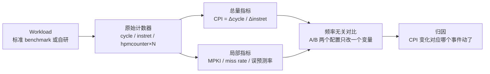
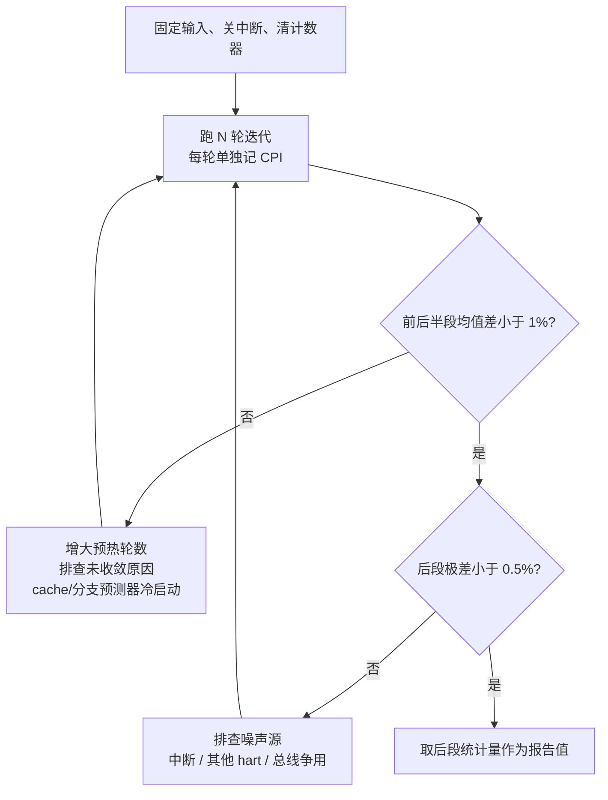

# CPU 性能 Benchmark 与 PMU:硅前环境怎么测才有意义

> 硅前验证里最容易被浪费的工作,就是花三周在 Palladium 上跑出一堆数字,最后没人敢用它做决策。本篇讲怎么让硅前的性能测量变得可信:测什么指标、PMU 怎么用、benchmark 怎么选、硅前环境的陷阱在哪、结果怎么报告。

**一句话定位**:本篇是[硅前验证环境](./20-presilicon-validation-environment.md)之上的"测量层"——环境搭好之后,怎么用 CPU 自带的 PMU 硬件和标准 benchmark,在 RTL 仿真 / Palladium / FPGA 上产出**能用来比较核、配置、微架构改动**的数字。CSR 的寄存器定义见[标准扩展](./02-standard-extensions.md)第 7 节,本篇不重复寄存器手册,讲的是"怎么用、怎么不出错"。

### 前置阅读

| 需要了解 | 参考文档 |
|----------|----------|
| PMU 三个扩展(Zicntr/Zihpm/Sscofpmf)的 CSR 定义 | [标准扩展](./02-standard-extensions.md) 第 7 节 |
| CSR 读写指令、WARL 语义、M/S/U 权限模型 | [特权模式与 CSR](./03-privileged-modes-and-csr.md) |
| QEMU / Spike 等功能模拟器的能力边界 | [工具链与模拟器](./09-toolchain-and-simulator.md) |
| Palladium / FPGA 硅前平台本身的搭建 | [硅前验证环境](./20-presilicon-validation-environment.md) |

---

## 1. 测什么:从"跑分"到频率无关指标

先想清楚一个问题:硅前测性能,和拿到芯片之后测性能,目标不一样。流片后你关心**绝对时间**(这个程序跑 8 ms 还是 10 ms);硅前你几乎从不关心绝对时间,你关心的是**比较**:

- 同一个核,dcache 从 16KB 加到 32KB,CPI 降多少?
- 分支预测器换一种组织方式,误预测率降多少?
- 我这个核和竞品(或上一代)在同一 workload 下差多少?

这两类问题的答案都不需要知道时钟频率。RTL 仿真和 emulation 的"运行速度"和真实频率毫无关系(VCS 每秒推进几百个周期,Palladium 大约几百 kHz,FPGA 几十 MHz),任何以秒为单位的指标在硅前都没有意义。

唯一在所有平台上都含义一致的量是**计数器**:周期数、指令数、cache miss 数。指标全部从计数器推导,频率完全不入场——这是整篇方法论的地基。

经典的处理器性能公式把它拆开了:

$$\text{执行时间} = \underbrace{\text{指令数}}_{\text{编译器 + 算法}} \times \underbrace{\text{CPI}}_{\text{微架构}} \times \underbrace{T_\text{clock}}_{\text{电路/频率}}$$

硅前环境里第三项不可测也不需要测(那是综合和后端的事);第一项由 workload 和工具链决定,测出来的是"这套编译器 + 这段代码"的属性;**第二项 CPI 才是核的微架构属性**,是硅前测量的核心对象。硅前性能测量 = 控制 workload(固定指令数)→ 测周期数 → 算 CPI 及其分解项。

从 PMU 计数器到可比较指标,整个推导链是:



常用的几个指标,定义和口径先立清楚(后面所有代码都按这个口径输出):

| 指标 | 公式 | 测的是什么 |
|------|------|-----------|
| CPI | $\Delta cycle / \Delta instret$ | 每条指令平均周期数,总账 |
| IPC | $1/\text{CPI}$ | 同上,核数多的团队爱用 |
| MPKI | $\Delta miss \times 1000 / \Delta instret$ | 每千条指令的 miss 数,cache 容量/相联度敏感 |
| miss rate | $\Delta miss / \Delta access$ | 局部命中率,cache 协议/替换策略敏感 |
| 误预测率 | $\Delta mispredict / \Delta branch$ | 分支预测器组织敏感 |

> **核心要点**:Δ(差值)不是随手写的。计数器从复位起一直累积,只有"被测代码段前后各读一次取差"才是这段代码的量。直接读绝对值,测到的是"从复位以来的全部历史"。

**用真实量级的数字把 CPI 算一遍**(后面 §6 的归因分析会复用这组数)。假设某双发射顺序 RV32 核跑 CoreMark 一轮:

- $\Delta cycle = 48{,}060{,}000$,$\Delta instret = 36{,}000{,}000$ → CPI = 1.335,IPC ≈ 0.75
- $\Delta dcache\_miss = 295{,}000$,$\Delta load = 9{,}000{,}000$ → MPKI = 8.19,load miss rate = 3.3%
- $\Delta branch = 7{,}200{,}000$,$\Delta mispredict = 216{,}000$ → 误预测率 = 3.0%

再做一个粗分解验证数能不能对上:假设 dcache miss 代价 16 周期、误预测代价 10 周期,则

$$\text{CPI} \approx \underbrace{1.14}_{\text{理想流水线}} + \underbrace{0.131}_{8.19 \times 16/1000} + \underbrace{0.060}_{7.2M \times 3\% \times 10 / 36M} = 1.331$$

和实测 1.335 差 0.004,归入没单独建模的项(icache miss、JALR 冒险、乘除法多周期)。分解能大致闭合,说明计数器口径没搞错;**分解对不上,先怀疑测量,再怀疑微架构**——这是硅前测量自查的第一反应。

---

## 2. 用什么测:PMU 硬件基础

指标都要从计数器来,RISC-V 的计数器分三层扩展,能力递增。CSR 地址全部与本地规范核对过:特权架构规范 20211203 版(下称"特权规范")Table 2.2/2.3/2.4 及 §3.1.10–3.1.12、§4.1.5;非特权 ISA 规范 20260517 版(下称"非特权规范")§4.3/§4.4。

### 2.1 Zicntr:三个基础计数器

Zicntr 提供三个低特权级也可读的基础计数器 `cycle`/`time`/`instret`,RV32 另配高 32 位影子。

| CSR | 地址 | 权限 | 内容 |
|-----|------|------|------|
| `cycle` | 0xC00 | URO | 周期计数(读的是核级周期,见下) |
| `time` | 0xC01 | URO | 实时时钟,memory-mapped `mtime` 的只读影子 |
| `instret` | 0xC02 | URO | 本 hart 已退休的指令数 |
| `cycleh`/`timeh`/`instreth` | 0xC80–0xC82 | URO | RV32 专用,高 32 位 |

出处:特权规范 Table 2.2(Unprivileged Counter/Timers);伪指令 `rdcycle`/`rdtime`/`rdinstret` 定义在非特权规范 §4.3,展开为 `csrrs rd, counter, x0`。M-mode 读写原始计数器的地址是 `mcycle` 0xB00、`minstret` 0xB02(特权规范 Table 2.4),S/U-mode 读到的 0xC00/0xC02 是它们的只读影子(特权规范 §3.1.11)。

两个容易被忽略的语义细节,都会咬到测量的人:

- **`cycle` 是核级的,`instret` 是 hart 级的**。特权规范 §3.1.10 原文:mcycle 可能被同核多个 hart 共享。单核单 hart 无所谓;SMT 或多 hart 同核时,CPI 的分子分母口径不一致,直接除出来的数没有意义。
- **`time` 不是 cycle**。它影子的是 CLINT 的 mtime,频率由平台定,和核时钟可以是两个域。硅前做 benchmark 计时用 `cycle`,不要用 `time`——emulation 上两者的比例和真实芯片完全不同。

### 2.2 Zihpm:事件计数器

Zihpm 在基础计数器之外提供最多 29 个可编程事件计数器:M-mode 配事件选择器并读写,低特权级经影子寄存器读。

| CSR | 地址 | 说明 |
|-----|------|------|
| `mhpmcounter3`–`mhpmcounter31` | 0xB03–0xB1F | M-mode 可读写的事件计数器,最多 29 个,WARL,可少于 64 位宽 |
| `mhpmcounter3h`–`31h` | 0xB83–0xB9F | RV32 高 32 位 |
| `mhpmevent3`–`mhpmevent31` | 0x323–0x33F | 对应计数器的事件选择器,MXLEN 位 WARL |
| `hpmcounter3`–`hpmcounter31` | 0xC03–0xC1F | S/U-mode 读的只读影子 |
| `mcountinhibit` | 0x320 | 置位停止对应计数器(§3.1.12) |
| `mcounteren` | 0x306 | 开放计数器给下一特权级(§3.1.11) |
| `scounteren` | 0x106 | S-mode 开放计数器给 U-mode(§4.1.5) |

出处:特权规范 §3.1.10(Hardware Performance Monitor)、Table 2.2/2.4;计数器个数与事件含义是平台定义的(非特权规范 §4.4)。

关键事实:**事件编号是实现定义的**。特权规范 §3.1.10 只规定了两件事——事件 0 表示"不计数";一个合法实现可以把计数器和事件选择器都做成只读 0(即一个 HPM 计数器都不给)。非特权规范 §4.4 甚至明说"事件标准化留待将来"。

所以 load miss、分支误预测这些事件在不同核上编号完全不同,跨核搬 `mhpmevent` 配置代码是硅前测量的经典事故:**事件 0x02 在核 A 上是 dcache miss,在核 B 上可能是 TLB miss,数字照样出来,只是全是错的**。每个核的事件表以该实现的手册为准;跨核对比时,要么把双方事件映射到同一组语义,要么退回只比 cycle/instret。

QEMU 和真实核的差异在这个问题上同样致命,而且方向相反:

- **QEMU(TCG)没有微架构**。cycle 读的是宿主机时钟(未开 `-icount` 时)或虚拟指令计数(`-icount` 时,与 instret 同源,CPI 恒为 1);hpmcounter 事件大多未实现或恒 0(具体行为随版本变化,以 `target/riscv/csr.c` 为准)。
- **Spike 是 ISA 参考模型**,同样无 cache/流水线时序,HPM 事件不定义。

> **核心要点**:功能模拟器上能验证的是**测量代码本身**的 CSR 读写路径、溢出处理、使能逻辑;**事件的语义和数值只能在 RTL 仿真/emulation 上出**。把 QEMU 上的 PMU 数字写进性能报告,是方法错误,不是精度问题。

### 2.3 Sscofpmf:计数器溢出中断

64 位计数器在真实频率下几乎不会溢出(1 GHz 下 cycle 要 585 年才翻),但硅前有个反直觉的场景会溢出:**计数器宽度是 WARL 的,实现可以只给 40 位甚至更少**——mhpmevent 也可以只实现低位。另外长稳态测试(跑几十亿周期)叠加窄计数器,溢出是现实问题。

Sscofpmf 扩展为此提供溢出中断:计数器最高位翻转时置 `mhpmevent` 的 OF 位,触发本地计数器溢出中断(LCOFIP),S-mode 通过 `scountovf` 读哪些计数器溢出了,软件维护高位扩展。

> **待确认**:scountovf 地址 0xDA0、mhpmevent 的 OF(bit 63)/MINH(bit 62)等 inhibit 位、mip 中 LCOFIP 的 bit 20——这些数值来自单独批准的 Sscofpmf 扩展规范,而本地 `reference/` 只有特权规范 20211203 版,其中 §3.1.10 仅预告了该机制("a future revision ... will define a mechanism to generate an interrupt when a hardware performance monitor counter overflows")而未给地址。使用前以 Sscofpmf 规范原文核对这些位域。

硅前实践里,溢出中断多数时候用不上(测的窗口短、可以主动清零),更省事的做法是 §3 里的"前后取差值 + 每轮清零"。溢出中断真正的价值是流片后 Linux perf 采样——那是另一条路(SBI PMU 扩展),本篇不展开。

### 2.4 访问控制:让 S-mode/U-mode 读得到

计数器默认对低特权级关门。分层规则(特权规范 §3.1.11、§4.1.5):

| 谁读 | 需要的条件 |
|------|-----------|
| M-mode | 无条件(直接读写 0xB00/0xB03/0x323 一族) |
| S-mode 读 `cycle`/`hpmcounter3`…(0xC00/0xC03…) | `mcounteren` 对应位 = 1,否则非法指令异常 |
| U-mode 读 | `mcounteren` **和** `scounteren` 对应位都 = 1 |

`mcounteren`/`scounteren` 位布局相同:bit 0 = CY,bit 1 = TM,bit 2 = IR,bit 3–31 = HPM3–31。注意"关门≠停走":特权规范 §3.1.11 明确,禁止访问不影响计数器继续累加;真正让计数器停走的是 `mcountinhibit`(0x320,布局同上但 bit 1 恒 0,time 不可 inhibit,§3.1.12)。

有的核复位后默认 inhibit,或固件(OpenSBI)会动这些位——测量前先读一遍 `mcountinhibit`,别假设是 0。

---

## 3. 裸机测量代码

这一节给可以直接搬进裸机测试 payload 的代码。约定:RV64 直接讲,RV32 的差异单独标出;CSR 访问用一对内联宏。

### 3.1 CSR 读写封装

两个宏封装 `csrr`/`csrw`,本节之后所有 CSR 访问都走它们:

```c
#include <stdint.h>

#define csr_read(csr)                                            \
    ({ unsigned long __v;                                        \
       __asm__ volatile("csrr %0, " #csr : "=r"(__v));           \
       __v; })

#define csr_write(csr, v)                                        \
    __asm__ volatile("csrw " #csr ", %0" :: "r"(unsigned long)(v))
```

`rdcycle`/`rdinstret` 是伪指令(非特权规范 §4.3),编译器保证它们存在;也可以直接 `csrr` 0xC00/0xC02,二者等价。S-mode/U-mode 下访问 0xC00 一族,`mcounteren`/`scounteren` 没开时硬件会抛非法指令异常——"忘开使能"的第一个症状就是它。

### 3.2 64 位计数器安全读

RV64 上 `rdcycle` 一次拿到全部 64 位,没有问题。RV32 上计数器仍是 64 位(非特权规范 §4.3:即使 XLEN=32 也强制 64 位宽,否则软件无法检测溢出),要分两次读,**低 32 位在两次高半读之间可能进位**。规范 §4.3 的 Listing 1 给了标准序列:

```asm
# RV32:安全读 64 位 cycle 到 x3:x2
again:
    rdcycleh  x3          # 先读高半
    rdcycle   x2          # 再读低半
    rdcycleh  x4          # 再读一次高半
    bne       x3, x4, again   # 高半变了说明期间低半进位,重读
```

C 版本(带上 C 编译器可能重排的问题,`volatile` 必不可少):

```c
static inline uint64_t rdcycle64(void)
{
#if __riscv_xlen == 64
    uint64_t c;
    __asm__ volatile("rdcycle %0" : "=r"(c));
    return c;
#else
    uint32_t lo, hi, hi2;
    do {
        __asm__ volatile("rdcycleh %0" : "=r"(hi));
        __asm__ volatile("rdcycle  %0" : "=r"(lo));
        __asm__ volatile("rdcycleh %0" : "=r"(hi2));
    } while (hi != hi2);
    return ((uint64_t)hi << 32) | lo;
#endif
}
```

`rdinstret` 同理。这套序列在硅前还有个副产品价值:**它是天然的"时序一致性"探针**——如果 RTL 里 CSR 读路径有 bug(两次读高半不一致且永不收敛),这个循环会卡死,比功能测试更早暴露问题。

### 3.3 配置 HPM:事件选择与计数器探针

M-mode 下一次性配好。事件号是示例,**以你的核的手册为准**(§2.2 的教训):

```c
/* 事件号示例:换成你核的手册值 */
#define EV_DCACHE_MISS     0x02
#define EV_ICACHE_MISS     0x03
#define EV_BRANCH_MISPRED  0x04
#define EV_BRANCH_RETIRE   0x05
#define EV_LOAD_RETIRE     0x06

void pmu_init_m_mode(void)
{
    /* 1. 选事件:hpm3=dcache miss, hpm4=icache miss,
     *    hpm5=分支误预测, hpm6=分支退休, hpm7=load 退休 */
    csr_write(mhpmevent3, EV_DCACHE_MISS);
    csr_write(mhpmevent4, EV_ICACHE_MISS);
    csr_write(mhpmevent5, EV_BRANCH_MISPRED);
    csr_write(mhpmevent6, EV_BRANCH_RETIRE);
    csr_write(mhpmevent7, EV_LOAD_RETIRE);

    /* 2. 解除 inhibit(cycle/instret/HPM 全部放行) */
    csr_write(mcountinhibit, 0);

    /* 3. 清零计数器 */
    csr_write(mcycle, 0);
    csr_write(minstret, 0);
    for (int i = 3; i <= 7; i++)
        pmu_counter_write(i, 0);  /* 逐个写 mhpmcounterN,见下 */

    /* 4. 开放给 S-mode(纯 M-mode 测试可跳过) */
    csr_write(mcounteren, ~0UL);  /* CY|TM|IR|HPM3-31 全开 */
}
```

`mhpmcounterN` 没有编号化的 CSR 名,而 `csrw` 的 CSR 编号必须在汇编期确定,**运行时拿到的编号 n 拼不进指令**——所以要么 switch 展开,要么单独写一段 `.S` 逐个 `csrw mhpmcounter3, x0`:

```c
static inline void pmu_counter_write(int n, uint64_t v)
{
    switch (n) {
    case 3: csr_write(mhpmcounter3, v); break;
    case 4: csr_write(mhpmcounter4, v); break;
    case 5: csr_write(mhpmcounter5, v); break;
    case 6: csr_write(mhpmcounter6, v); break;
    case 7: csr_write(mhpmcounter7, v); break;
    }
}
```

**写完务必回读验证**——mhpmevent 和计数器都是 WARL,写入不合法值会被硬件改成别的值而不报错:

```c
/* 计数器宽度探针:写入全 1,读回看实现了几位 */
csr_write(mhpmcounter3, ~0UL);
uint64_t w = csr_read(mhpmcounter3);
int width = 64 - __builtin_clzll(w);   /* 如 40 位宽 → w = 0xFF_FFFFFFFF */
```

这个探针出来的宽度要记进报告(§5.4):窄计数器限制了单次测量能覆盖的周期上限。

### 3.4 S-mode / U-mode 路径

如果测试 payload 跑在 S-mode(比如在最小 SBI 之上),M-mode 固件负责 `mhpmevent` 配置和 `mcounteren` 放行(§3.3 的 1、2、4 步),S-mode 只做两件事:开 `scounteren` 放行 U-mode(如果 workload 在 U-mode),然后读 0xC00 一族影子:

```c
/* S-mode 下:让 U-mode 也能读(仅 S-mode 自己读则不需要) */
csr_write(scounteren, ~0UL);   /* CY|TM|IR|HPM3-31 */

/* S-mode 读影子:地址与 U-mode 相同(0xC00 一族) */
static inline uint64_t read_hpm3(void)
{
    uint64_t v;
    __asm__ volatile("csrr %0, hpmcounter3" : "=r"(v));
    return v;
}
```

这里刻意用命名 CSR(`hpmcounter3`)而不是裸数值 0xC03:CSR 地址手抄是硅前测量的第一大错因——0x300 是 `mstatus`,`hpmcounter3` 是 0xC03,`time`/`instret`(0xC01/0xC02)也常被对调着抄。命名 CSR 由汇编器查表,一劳永逸地消掉这一类错。

### 3.5 测量骨架:取快照、算指标

把 §1 的指标口径落成代码:

```c
struct pmu_snap {
    uint64_t cycle, instret;
    uint64_t dmiss, imiss, brmisp, brret, ldret;
};

static struct pmu_snap pmu_snap_read(void)
{
    struct pmu_snap s;
    s.cycle   = csr_read(cycle);
    s.instret = csr_read(instret);
    s.dmiss   = csr_read(hpmcounter3);   /* 影子与 mhpmcounterN 同一底层计数器,
                                            M/S/U 都可读;写只能在 M-mode */
    s.imiss   = csr_read(hpmcounter4);
    s.brmisp  = csr_read(hpmcounter5);
    s.brret   = csr_read(hpmcounter6);
    s.ldret   = csr_read(hpmcounter7);
    return s;
}

void run_benchmark(void (*workload)(void), unsigned iters)
{
    struct pmu_snap b = pmu_snap_read();
    for (unsigned i = 0; i < iters; i++)
        workload();
    struct pmu_snap e = pmu_snap_read();

    uint64_t dc = e.cycle   - b.cycle;
    uint64_t di = e.instret - b.instret;
    uint64_t dm = e.dmiss   - b.dmiss;
    uint64_t dl = e.ldret   - b.ldret;

    /* 定点输出:硅前环境常常没有 printf 浮点,先打原始计数再在主机端算 */
    printf("cycles   = %llu\n", (unsigned long long)dc);
    printf("instret  = %llu\n", (unsigned long long)di);
    printf("dmiss    = %llu\n", (unsigned long long)dm);
    printf("loads    = %llu\n", (unsigned long long)dl);
    /* CPI = dc/di,MPKI = dm*1000/di,miss rate = dm/dl —— 主机端脚本算 */
}
```

两个工程要点:

- **原始计数优先于派生指标**。目标机上只打 Δ 计数,CPI/MPKI 在主机端脚本算。原因:目标机 printf 本身有开销和潜在中断,而且 raw 数据可以事后换口径重算(比如发现 cycle 是核级的要剔除另一 hart 的影响)。
- **测量代码自身的开销**。两次快照之间夹着第二次读序列,十几条指令会计入 Δcycle/Δinstret。对百万指令级的 workload 误差小于 0.001%,忽略;对微基准(几千条指令),先测一次空区间标定开销再减掉。

用 §1 的数字验一遍这套代码的输出形态:cycles=48060000、instret=36000000、dmiss=295000、loads=9000000 → 主机端 CPI=1.335、MPKI=8.19、miss rate=3.3%。三个数都能对上,测量链就是通的。

---

## 4. Benchmark 选型

指标有了,workload 从哪来。硅前测量的 workload 要满足三个条件:**确定**(同输入同指令流,否则确定性回归无从谈起)、短到跑得动 emulation、**微架构敏感**(能暴露 cache/分支/流水线的差异)。标准 benchmark 的适用面:

| Benchmark | 测什么 | 形态 | 适用核型 | 硅前适配性 |
|-----------|--------|------|----------|-----------|
| Dhrystone | 整数 ALU + 控制流 | 1984 年的字符串处理代码 | 嵌入式核(历史惯例) | 短、确定,但极易被现代编译器优化掉 |
| CoreMark | 整数:链表/矩阵/状态机/CRC | EEMBC,2009,事实标准 | 嵌入式/MCU 核 | 短、确定,硅前首选 |
| Embench | 19 个程序的均值(speed + size) | 2019,试图替代上面两个 | 嵌入式核 | 更全面但总周期数大,emulation 上按需跑子集 |
| STREAM | 内存带宽(copy/scale/add/triad) | 经典四内核 | 带 DDR/L2 的应用核 | 数组必须远超 cache,硅前只在验证内存子系统时用 |
| lmbench | 系统调用延迟/上下文切换/内存延迟 | 面向 OS | 应用核 + 完整软件栈 | 裸机不适用,bring-up 跑起 Linux 后才有意义 |

> **如何读这张表**:前三个测"核本身",后两个测"核 + 内存系统/软件栈"。硅前阶段(尤其 emulation)能负担的只有前两个半;STREAM 和 lmbench 留给 FPGA 原型或流片后。选型错误的表现是:花一周 emulation 跑 STREAM,结果数组全在 TCM/rom 里,测了个寂寞。

### 4.1 公开对比惯例

对嵌入式核,行业惯例是 **CoreMark/MHz**(每 MHz 的每秒迭代数)和 DMIPS/MHz,这两个无量纲数抹掉了频率,恰好和硅前"频率无关"的方法论同构——硅前算 $\text{iterations} / \Delta cycle$,乘上目标频率就是 CoreMark/MHz,emulation 上测的数天然可以和公开数据放一张表。EEMBC 公布的参考值:Cortex-M4 约 3.4 CoreMark/MHz、Cortex-M7 约 5.0(双发射,-O3,以 EEMBC 官网列表为准)。

和 Cortex-A 系列对比则不要用 CoreMark——它太小,乱序核的宽发射和大 cache 在这个 workload 里根本施展不开,数字会误导。对标 A 系列要用 SPEC 一类的大 workload,而硅前只能跑缩减输入集的版本,**缩减集的数字不能和官方 SPEC 分数直接对比**,只能内部自比。

注意 CoreMark 的对外报告规则(EEMBC 要求有效成绩至少跑 10 s,以 coremark 仓库文档为准)。这条规则在 emulation 上通常做不到也不必做到:§5 会讲,硅前 A/B 对比只需要你自己的平台内部可比,迭代数减到稳态即可,但**报告里必须标明迭代数**,否则别人无法判断你的数字是稳态值还是冷启动值。

### 4.2 编译陷阱

workload 是"编译器 + 代码"的产物,编译侧的每一个变量都会污染微架构对比。按出现频率排:

1. **优化级别不固定**。`-O2` 和 `-O3` 生成的指令数可能差 20%,CPI 对比直接失真。自比微架构时,全项目钉死一个级别、一套 flag,写进报告。
2. **LTO / 死代码消除把 workload 删了**。Dhrystone 的主循环在 `-O3 + LTO` 下可能被整体消除——程序"跑完"了,但没算东西。**检测手段就是 instret**:迭代数翻倍,Δinstret 应近似翻倍;不翻倍说明工作量被优化掉了。这是 PMU 反哺 benchmark 完整性的典型场景。
3. **内建函数替代**。`memcpy`/`strlen` 被替换成库函数或向量化的 builtin,DSP 循环被识别成 `memset`。裸机测量加 `-ffreestanding`、自实现关键库,或 `-fno-tree-loop-distribute-patterns`。
4. **`-march` 与被测核不符**。在无 B 扩展的配置上开 `zb*` 会 illegal instruction;反过来,少开扩展则指令 mix 和目标产品不一致。`-march` 必须逐字等于被测 RTL 的参数,并写进报告。
5. **时间源精度**。用 `rdcycle`,不要用 `clock()`/`gettimeofday`——粒度是宿主机/固件口径,和目标周期无关(§2.1 的 `time` 同理别用)。
6. **链接位置**。workload 落在 TCM 还是 DDR,测出来是两个核。链接脚本固定,报告标明代码/数据所在内存。

```bash
# 硅前测量的基准编译命令形态:全部参数可复现,进报告
riscv64-unknown-elf-gcc -march=rv32imac_zicsr -mabi=ilp32 -mcmodel=medany \
    -O2 -fno-lto -ffreestanding -nostdlib \
    -T bench.ld -o coremark.elf core_main.c pmu.c uart.c

# instret 线性度 sanity check:K 与 2K 两次运行
# (在 payload 里各打一次 Δinstret,主机端比对比值 ≈ 2)
```

---

## 5. 硅前环境的测量方法论

前三节是通用知识,这一节是本篇的核心价值:同样的 PMU 和 benchmark,放到 RTL 仿真 / Palladium / FPGA 上,方法论必须跟着变。

### 5.1 先认清楚三个平台的物理约束

三个平台的差距归结为三条物理约束:推进速度、确定性、内部可见性——它们决定了各自适合承担哪种测量。

| 维度 | RTL 仿真(VCS/Questa/Xcelium) | Emulation(Palladium/ZeBu/Veloce) | FPGA 原型 |
|------|------------------------------|-----------------------------------|-----------|
| 推进速度(目标周期/宿主秒) | ~10²–10⁴ | ~10⁵–10⁶ | ~10⁷–10⁸ |
| 跑完 10⁹ 目标周期 | 天级 | ~半小时(按 500 kHz) | ~10 s(按 100 MHz) |
| 确定性 | 完全确定 | 设计得当则完全确定 | 不保证(DDR/时钟/外部因素) |
| 内部可见性 | 任意信号波形 | 波形 + 加速器抓取 | 只有软件可见的(CSU/PMU) |
| 适合做的测量 | 单元级、微基准、回归 | 完整 benchmark、A/B 配置对比 | 长稳态、SoC 级、软件栈测量 |

> **如何读这张表**:速度决定迭代数预算,确定性决定回归金标准放在哪,可见性决定归因深度。典型分工:RTL 仿真做微基准和计数器单元验证,Palladium 出主数据,FPGA 补长稳态和系统级——三者产出的都是频率无关指标,互相可以交叉校验(同一个 workload 在 Palladium 和 FPGA 上 CPI 应当一致,不一致本身就是 bug 线索)。

### 5.2 emulation 慢:减迭代,但必须跑到稳态

emulation 上把 CoreMark 官方迭代跑满不现实,减迭代是必然选择。但减迭代有个前提:**测量窗口必须落在稳态**,否则测的是冷启动瞬态(cache 空、分支预测器空、TLB 空),A/B 对比会被瞬态差异淹没。§1 那组数字如果只跑前两轮,CPI 是 1.6+,比稳态值高 20%——这种数据拿去比较 cache 配置,结论全错。

稳态的验证方法:**分段测量 + 方差检查**。每轮迭代单独记 CPI,比较前后半段:

```c
#define N_ITER  16
#define N_WARM  4

double cpi[N_ITER];

for (int i = 0; i < N_ITER; i++) {
    struct pmu_snap b = pmu_snap_read();
    workload_one_iter();
    struct pmu_snap e = pmu_snap_read();
    cpi[i] = (double)(e.cycle - b.cycle) / (double)(e.instret - b.instret);
}

/* 稳态判据:丢掉前 N_WARM 轮后,
 * 1) 后半段均值 vs 前半段均值,偏差 < 1%
 * 2) 后段极差(max-min)/均值 < 0.5%
 * 两条都过才取后段均值作为报告值 */
```



判据里两个阈值(1%、0.5%)是工程经验值,按你的平台噪声水平校准;重要的是**判据本身要写进报告**,让读者知道你测的是稳态。

### 5.3 确定性:硅前独有的金标准

RTL 仿真和设计良好的 emulation 是**周期确定**的:同一 RTL、同一输入、同一初始状态,两次运行的所有计数器逐位一致。这个性质在流片后永远不可得(FPGA 都不一定有),是硅前最值钱的资产,两种用法:

- **性能回归金标准**。每个 RTL 版本跑固定 benchmark 集,计数器快照存 JSON 入库,版本间 diff。任何非预期的周期数变化——哪怕 ±1 个周期——都值得看一眼:要么是性能改动的副作用,要么是功能 bug 的先兆。CPI 无声地变了 0.3% 却没有人改动过相关模块,这种信号在波形调试里很难看到,在计数器 diff 里一目了然。
- **A/B 对比的噪声消除**。比较两个配置时,确定性平台上的差异**没有测量噪声**,看到多少就是多少(不等于就是微架构差异,归因见 §6)。这直接改写了统计方法:流片后要跑 30 次取均值,硅前仿真跑一次就是真值。

确定性是有条件的,建环境时就要守住(这些坑详见[硅前验证环境](./20-presilicon-validation-environment.md)):

- 仿真中不开随机延迟的外设模型(DDR 模型用固定延迟档);
- 关掉仿真器的随机寄存器初始化(X-prop/random init 选项),否则两次运行初值不同;
- mtime 等时序源由确定频率驱动;
- 多 hart 时固定调度序列(谁先唤醒、何时发 IPI 都是确定的)。

如果这些条件破了,计数器 diff 里全是假信号,金标准就贬值成了普通测量。

### 5.4 报告:上下文比数字更重要

一组 CPI 数字离开上下文一文不值。对齐大厂硅前性能报告的惯例,结果必须携带的上下文:

| 字段 | 示例 | 为什么影响可比性 |
|------|------|------------------|
| RTL 版本 | `rtl @ a1b2c3d, 带修复 X` | 没有版本号的数字无法回归定位 |
| 工具链 | `riscv64-unknown-elf-gcc 13.2.0` | 不同版本指令 mix 不同(§4.2) |
| 编译参数 | `-march=rv32imac_zicsr -mabi=ilp32 -O2 -fno-lto` | 同上,缺一项无法复现 |
| 核配置 | `2-issue, I$16KB/2way, D$16KB/2way, gshare 4K` | 被比较的变量本身,也是别人复核的输入 |
| 平台 | `Palladium XP, 目标周期数计` | 明示非真实频率,防止误读 |
| 迭代数与稳态判据 | `16 轮丢 4, 后半段极差 0.2%` | 证明测的是稳态(§5.2) |
| 计数器宽度 | `hpm 40-bit, cycle 64-bit` | 限制单次测量上限(§3.3) |
| 运行环境 | `单 hart, 关中断, 其余 hart WFI` | 噪声控制声明(§6) |

报告值给**原始 Δ 计数 + 派生指标**两层(§3.5 的理由):派生指标方便人读,原始计数留给以后的脚本换口径重算。一套健康的流程是:payload 吐 CSV/JSON → 主机端脚本统一算指标、画趋势 → 入库,报告从库里出,而不是手工誊数字。

---

## 6. 结果解读:什么时候差异是真差异

最后一步:两个配置的 CPI 摆在面前,1.335 和 1.278,差 4.3%。这个差异可信吗?是什么造成的?分平台回答。

### 6.1 先按平台定噪声底线

- **RTL 仿真 / 设计良好的 emulation**:确定性问题已由 §5.3 解决,运行间零方差。这里的"噪声"不是统计噪声,而是**口径误差**:测量代码自身开销没扣除(§3.5)、计数器宽度截断、非预期中断混入。底线可以定得激进:ΔCPI < 0.5% 视为无差异,除非你有明确假设要验证。
- **FPGA 原型**:运行间有真实方差(DDR 控制器抖动、时钟漂移、温度),需要多次运行。经验做法:每个配置跑 20–30 次,报均值 ± 标准差;判显著用 $|\bar{A}-\bar{B}| > 2\sqrt{\sigma_A^2+\sigma_B^2}$(粗略的 95% 置信)。更讲究的用 A/B 交错执行(ABABAB…),把慢漂移(温度、频率)在两组间对冲掉。

### 6.2 噪声源清单与关中断测量

逐项排掉能污染计数的因素:

| 噪声源 | 症状 | 处理 |
|--------|------|------|
| timer 中断(CLINT mtime) | 计数器里混入几十至几百周期的 trap 开销,随机出现 | 测量窗口内关中断 |
| 外设中断(UART/DMA) | 偶发跳变,难复现 | 同上,或屏蔽具体源 |
| 其他 hart 干扰 | cycle 是核级计数时无法剥离;共享总线/L2 争用 | 其余 hart 停入 WFI |
| 总线上的其他 master(DMA) | miss 代价变高 | 测量窗口内静默 |
| 冷启动状态 | 前几轮 CPI 偏高 | §5.2 的预热 + 稳态判据 |

关中断的标准姿势(M-mode):

```c
unsigned long mstatus_save = csr_read(mstatus);

csr_write(mstatus, mstatus_save & ~(1UL << 3));  /* 清 MIE,全局关中断 */
csr_write(mie, 0);                                /* 双保险:逐源也关掉 */

/* …… 测量窗口:清计数器 → 跑 workload → 取快照 …… */

csr_write(mstatus, mstatus_save);                 /* 恢复 */
```

单清 `mstatus.MIE` 就足够挡住所有可屏蔽中断;`mie` 清零是防御性写法,防的是测量代码里有人手滑改回 mstatus。测完必须恢复,否则后面的 UART 打印全死。S-mode payload 则对应 `sstatus.SIE`(bit 1)——位号不同,别照抄。

其余 hart 静默:

```c
/* hart 0 测量,其余 hart 送进 WFI(需各自执行) */
__asm__ volatile("wfi");
```

WFI 的中断唤醒条件此时已不可能满足(全局关中断),hart 就停在低功耗状态,总线安静。多核共享 cycle 计数器的实现,这一步是让 CPI 口径成立的前提(§2.1)。

### 6.3 归因:差异是哪个部件的

确认差异显著之后,回答"改哪儿带来的"。工具就是 §1 的分解,拿本篇一直用的数字做一遍完整示例——配置 A(dcache 16KB/2 路)对配置 B(dcache 32KB/2 路),同二进制、同迭代数:

| 量 | A | B | Δ |
|----|---|---|---|
| Δinstret | 36,000,000 | 36,000,000 | 0(指令流一致,前提成立) |
| Δcycle | 48,060,000 | 45,990,000 | −2,070,000(−4.3%) |
| CPI | 1.335 | 1.278 | −0.057 |
| dcache MPKI | 8.19 | 5.16 | −3.03 |
| load miss rate | 3.3% | 2.1% | −1.2 pp |
| 误预测率 | 3.0% | 3.0% | 0(分支路径未受影响) |

归因算术:ΔCPI 中由 dcache 解释的部分 = ΔMPKI × miss 代价 / 1000 = 3.03 × 16 / 1000 ≈ **0.048**。剩余 0.057 − 0.048 = 0.009,量级上正好对应容量加大后 tag 冲突减少带来的次生 miss 代价下降。结论:**约 84% 的收益来自 dcache miss 减少,分支侧零变化,差异真实且可解释**。

如果反过来:Δcycle 有 4%,但 MPKI、误预测率、指令数全都没动,所有事件计数都解释不了这个差——这时**先怀疑测量**(口径、计数器配置、被测二进制是否同一份),再考虑"实现定义事件之外的微架构效应"(如发射队列竞争)。硅前环境里,"数字动了但归因不上"多数以测量 bug 收场。

> **核心要点**:报告一个差异,要同时给出三件事——统计上显著(平台噪声底线之上)、归因上闭合(事件分解能解释大部分)、复现上确定(同一二进制同一 RTL 重跑逐位一致)。三缺一,先补测量,别急着下结论。

---

## 小结

本篇的主线压缩成四条:

1. **测频率无关的量**:CPI/MPKI/miss rate 全部由计数器推导,频率永远不入场。
2. **用 PMU 但敬畏实现定义**:CSR 地址和位域查 spec(特权规范 Table 2.2/2.4、§3.1.10–3.1.12),事件号查核的手册,QEMU 只验代码不验语义。
3. **emulation 减迭代但必须到稳态**:分段方差检查,判据写进报告。
4. **报告带全上下文**:RTL 版本、工具链、-march、cache 配置、迭代数、运行环境。

硅前的确定性是流片后永远拿不到的资产,把计数器回归做成金标准,是这套方法里回报率最高的一件事。

测量做干净之后,你很快会撞上本篇刻意绕开的一块:测量窗口里那些"偶发跳变"的来源——中断。怎么系统性地验证中断子系统的正确性与延迟,是下一篇的内容。

→ 下一篇:[中断验证](./24-interrupt-validation.md)
