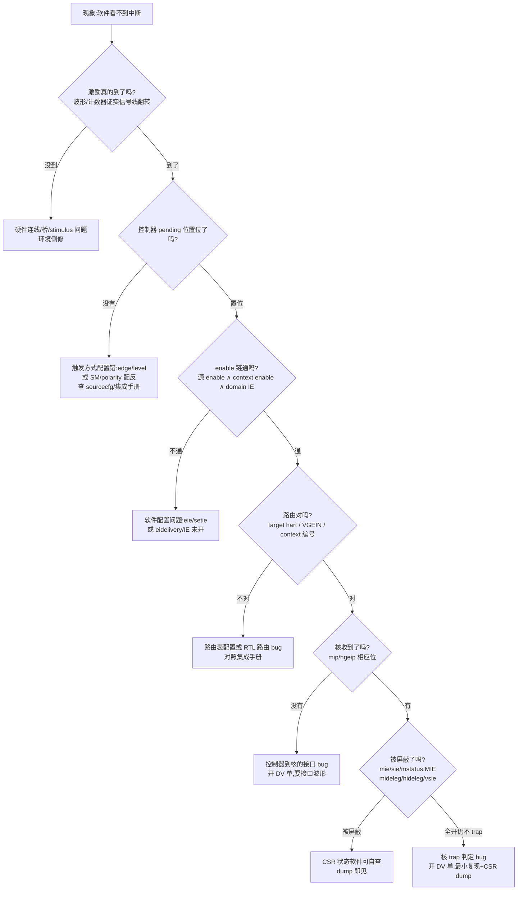

# 中断子系统验证:从 trap 到 AIA 的用例设计

> 面向 RV 核 IP 的硅前软件验证工程师:中断子系统是验证计划里"用例最好写、失败最难查"的部分——触发一个中断只要几行 MMIO 写,但一旦"软件看不到中断",问题可能藏在硬件连线、pending 位、enable 链、路由、委托、CSR 屏蔽任何一层。本篇把[中断与异常](./04-interrupts-and-exceptions.md)、[AIA 完全指南](./07-aia-advanced-interrupt-architecture.md)和[特权模式与 CSR](./03-privileged-modes-and-csr.md)里的知识换成验证视角:**分层列出被测点 → 每层的正常/边界/异常用例 → 判定与失败分类 → 执行环境与自动化 → 与 DV 的分锅决策树**。读完你应该能拿出一套可以直接在 Palladium/FPGA 上跑的中断验证用例矩阵。

| 前置阅读 | 为什么需要 |
|----------|-----------|
| [中断与异常](./04-interrupts-and-exceptions.md) | trap 七步原子操作、CLINT/PLIC 分工、claim/complete 语义——本篇直接引用不重复 |
| [AIA 完全指南](./07-aia-advanced-interrupt-architecture.md) | IMSIC/APLIC 寄存器布局、guest 中断文件、间接访问机制——本篇只讲怎么测它们 |
| [特权模式与 CSR](./03-privileged-modes-and-csr.md) | mstatus/mideleg/medeleg 的权限与委托规则 |
| [硅前验证环境](./20-presilicon-validation-environment.md) | 三平台(仿真/emulation/FPGA)的选型与降级链,本篇 §7 直接建立在它上面 |

引用约定:特权规范指 RISC-V Privileged Architecture 20211203(本地副本 `reference/riscv-privileged-20211203.pdf`);AIA 规范指 The RISC-V Advanced Interrupt Architecture 1.0 Revised 20250312(本地副本 `reference/riscv-interrupts-20250312.pdf`,与 `reference/riscv-interrupts-aia.pdf` 为同一文档的两份拷贝,后文不再区分);引用处标章节号。Double trap 引自独立批准的 Double Trap Extensions v1.0(2024-08-23),本地 1.12 副本不含该内容,涉及处单独标注。

## 1. 被测对象分层与验证矩阵

中断子系统的被测点不是一个设备,而是一条**从激励源到 trap 入口的链**:激励(设备/MSI/定时器/软件写)→ 中断控制器(排队、仲裁、路由)→ 核的中断接口(*ip/*ie + 委托)→ trap 状态机(mcause/mstatus/mtvec)→ handler → 完成(claim-complete/eoi)。链上每一层都有独立的规范依据和失败模式,用例必须分层设计,否则失败时无法定位是哪层的问题——这也是后面 §8 分锅决策树的骨架。

先分清每层的"规范依据强度"——这决定了用例的判定标准是**硬断言**还是**以集成手册为准**:

| 层 | 被测点 | 规范依据 | 强度 |
|----|--------|----------|------|
| Core trap | mcause 编码、mstatus.MPIE/MPP、mtvec 模式、委托、mret | 特权规范 §3.1.6–3.1.15 | **ratified,硬断言** |
| Core trap | double trap(mcause 16) | Double Trap Ext v1.0(Smdbltrp/Ssdbltrp,可选扩展) | 扩展实现则硬断言,未实现则跳过 |
| CLINT/mtime | mtime 计数、mtimecmp 比较语义、RV32 写序、WFI | 特权规范 §3.2.1/§3.3.3(CLINT 布局是事实标准,非 ISA 规范) | 语义硬断言,地址以集成为准 |
| Timer(Sstc) | stimecmp/vstimecmp 直接触发 | Sstc 扩展(可选) | 实现则硬断言 |
| PLIC | 触发方式、优先级、阈值、claim/complete、多 context 路由 | **无 ratified spec**(riscv-plic-spec 仍为 draft,是 SiFive 事实标准) | 语义参考 04 篇 §3.2,布局与细节**以实现的集成手册为准**,QEMU 作 golden 对照 |
| AIA-IMSIC | 消息投递、eie/eip、eidelivery/eithreshold、topei | AIA §3(ISA 扩展 Smaia/Ssaia,ratified) | **ratified,硬断言** |
| AIA-APLIC | domaincfg、sourcecfg、target、claimi | AIA §4(**non-ISA** 部分) | ratified,但允许实现子集(WARL) |
| 虚拟化注入 | hvip 直写、hgeip+VGEIN、hvien/hvictl、vstopi | 特权规范 §8 + AIA §5.3/§6 | H 扩展实现则硬断言 |

> **如何读这张表**:第二列是后面各节展开的被测点;第四列直接决定用例判定写法——"硬断言"的用例失败即开 bug 单,"以集成手册为准"的用例失败先查手册再查 RTL,两者混用会浪费 DV 的时间。PLIC 那一行要特别记住:**没有 ratified 的 PLIC 规范**,寄存器偏移、优先级位宽、context 编号全部实现定义;下文 PLIC 用例只测"事实标准语义",具体值以你手上核的集成手册和 04 篇 §3.2 的 QEMU virt 参考布局为锚。

验证矩阵的规模感(单核、含 H 扩展与 AIA 的典型配置):core trap 用例 ~40(异常编码全覆盖 16 + 状态机 10 + 委托 8 + 边界 6)、timer ~8、PLIC ~15、AIA ~20、虚拟化注入 ~12。下文各节给的是**种子用例**——每个被测点至少一条,边界与异常路径按"软件最容易写错、RTL 最容易漏"的经验补齐。

覆盖率的口径顺带说清,免得和 DV 打架:软件验证的覆盖率按**功能点**算——被测点 × {正常, 边界, 异常} 三类路径,每格至少一条定向用例;DV 的覆盖率按**激励空间**算(约束随机 + functional coverage bins)。两者相交不包含:DV 的随机激励会撞出定向用例没写的状态组合(好东西,抄回来变定向用例),软件用例会跑 DV 不会碰的真实软件栈(固件/SBI/内核)。中断子系统的功能点清单就是本篇各节的小标题,把它们抄进验证计划的 spreadsheet,每条挂上用例编号,评审时一眼看出空洞。

边界也划一下:中断**时序**(延迟、jitter 的测量方法)归[性能与 PMU 篇](./23-performance-benchmark-pmu.md)的计数器方法;合规套件的运行方式归[合规篇](./21-arch-compliance-riscof.md);本篇只管"语义正确性"——行为对不对,不问快不快。

## 2. Core trap 行为用例

这一层全部在核内,不依赖任何外设激励,是 bring-up 阶段 4([环境篇](./20-presilicon-validation-environment.md) §2.2 的 trap dump 里程碑)之后立刻能跑的第一批用例。

### 2.1 mcause 异常编码全覆盖

特权规范 §3.1.15 Table 3.6 定义了标准异常码,用例矩阵要求**每一个至少一个触发用例**,判定点是 mcause、mtval、mepc 三元组:

| 异常码 | 异常 | 触发方法(种子用例) | mtval 期望 | mepc 指向 |
|--------|------|--------------------|-----------|----------|
| 0 | 取指地址不对齐 | 跳转到 `jalr` 计算出的非对齐地址 | 错误地址 | 触发跳转的指令 |
| 1 | 取指访问错误 | 取指落在 PMP 拒绝区/未映射区 | 错误地址 | 触发指令 |
| 2 | 非法指令 | 执行 `.word 0xffffffff` | 指令编码(推荐)或 0 | 该指令 |
| 3 | 断点 | `ebreak`;或对观测地址 load/store(触发器) | 断点地址 | 该指令 |
| 4 | load 地址不对齐 | RV32 下 `lw` 非对齐地址(核不支持非对齐 load 时) | 错误地址 | 该指令 |
| 5 | load 访问错误 | 读 PMP 拒绝区/总线 error 响应 | 错误地址 | 该指令 |
| 6 | store/AMO 地址不对齐 | 非对齐 `sw` | 错误地址 | 该指令 |
| 7 | store/AMO 访问错误 | 写只读 PMP 区 | 错误地址 | 该指令 |
| 8 | U-mode ecall | U 下 `ecall` | 0(典型) | ecall 本身 |
| 9 | S-mode ecall | S 下 `ecall` | 0 | ecall 本身 |
| 11 | M-mode ecall | M 下 `ecall` | 0 | ecall 本身 |
| 12/13/15 | 取指/load/store 页错误 | 两阶段翻译 walkthrough(见 [Lab 4](./43-lab-h-extension-two-stage-mmu.md)) | 出错的 VA | 该指令 |

三个注意点:

1. 异常码 4/6 依赖核**是否实现对齐检查**——实现了非对齐访问支持(Zicclsm 类)时无法触发,用例标 SKIP 并在报告里注明,不要硬跑。
2. mtval 取值:特权规范只对页错误/访问错误/不对齐强制写地址值,对非法指令是"推荐写指令编码"(§3.1.17)。判定宏要区分"必须"与"推荐",推荐项失败记 WARN 不记 FAIL。
3. 异常优先级:Table 3.7(§3.1.15)规定一条指令同时可触发多个异常时的次序(断点 > 页错误/访问错误 > 非法指令 > 不对齐 > ecall > ebreak)。构造"非对齐且未映射的 load",断言报 5 而非 4,mepc 与优先级同时判。

表外的编码区间也要交代:10/14 是保留码(当前无标准异常,触发不了,登记即可);16-23 与 32-47 是 AIA 为标准本地中断预留的区间(其中 16 已被 double trap 占用,见 §2.6),24-31 与 48-63 留给 custom——核若实现自定义异常(如 ECC 注入),按集成手册各补一条,并确认不与未来标准分配冲突。

### 2.2 mcause 中断编码与 major interrupt 视图

异常侧覆盖完后,中断侧同样列一张判定表,把 major interrupt 号与 mip 位号、AIA 的新增本地中断对齐:

| cause | 中断 | mip 位 | 激励方法 | 备注 |
|-------|------|--------|----------|------|
| 1 | SSI | 1 | M-mode `csrs mip, 1<<1`(SSIP 软件可写,§3.1.9) | 这是无 AIA 系统的 IPI 规范路径 |
| 3 | MSI | 3 | 写本 hart 的 CLINT msip 寄存器(04 篇 §3.1) | 电平:写 0 撤除 |
| 5 | STI | 5 | Sstc 写 stimecmp;或 M-mode 转发 | 委托后 S 直收 |
| 7 | MTI | 7 | 写 mtimecmp(§3 用例 T1) | |
| 9 | SEI | 9 | PLIC claim 前的网关输出/IMSIC 汇报(§4/§5) | |
| 11 | MEI | 11 | 同上,M context | |
| 12 | SGEI | hip 位 12 | hgeip[hstatus.VGEIN] ∧ hgeie 对应位(§6) | 需 H 扩展 |
| 13 | 计数器溢出 | AIA 本地中断 | 置 mhpmcounter 小值跑溢出(sscofpmf) | AIA §5.1 才归类 |
| 35/43 | RAS 事件 | AIA 本地中断 | 通常无法软件激励 | 登记型,多数核 SKIP |

mip 各位的软件可写性本身就值得一张判定表:SSIP/MSIP 软件可写(§3.1.9 明文),MTIP/STIP 只读(timer 语义,只能靠写比较寄存器间接控制),MEIP/SEIP 由外部控制器提供(有无控制器时行为不同)。对应的边界用例:**M-mode `csrs mip, MTIP` 后读回应不变**——timer pending 不是软件能直写的;这条用例看似多余,实际抓过把 mip 实现成全可写通用寄存器的 RTL 错误。

多中断同时 pending 时先 trap 谁,有两套依据,用例要按实现选:非 AIA 核按特权规范 §3.1.9 的固定序 **MEI > MSI > MTI > SEI > SSI > STI**;AIA 核按 §5.1 Table 8 的可配置优先级(默认 43 > 11,3,7 > 9,1,5 > 12 > 10,2,6 > 13 > 35)。两套的共同点:只对"trap 到**同一特权级**"的多中断排序,trap 到更高特权级永远优先(20250312 修订再次澄清)。用例同时注入 MEI 与 SEI,断言 M-mode 先 trap;委托后同 trap 到 S,再按对应依据断言次序。

### 2.3 mstatus 中断状态机:MPIE/MPP

trap 入口硬件原子写 MPP/MPIE、清 MIE(04 篇 §2.1 的七步),用例要覆盖**进入-退出-嵌套**三个状态的往返:

1. **进入**:MIE=1 时注入外部中断,断言 handler 入口 `MPP=3, MPIE=1, MIE=0`——三个 CSR 必须在 handler 第一条指令前采样(把采样代码放 handler 最前面,或用 JTAG halt)。
2. **退出**:`mret` 后断言特权级 ← MPP、`MIE ← MPIE`、`MPIE ← 1`、MPP ← 最小支持特权级(U 若实现)(§3.1.6.1)。判定写 `mstatus` 的位域而不是整寄存器(其余位是 WPRI,整值比对必挂)。
3. **嵌套**:handler 内手动 `csrw mstatus, MIE=1`(04 篇 §4),注入更高优先级中断,断言第二层 trap 的 MPP=3、外层 mepc/mcause 未被破坏;两层 mret 逐层返回后 MIE 恢复为 1。
4. **边界:同源不重入**——MIE 重开后注入**同源**中断,pending 位在 handler 里清掉之前不重入(除非故意留 pending,那验证的是重入而非状态机)。
5. **xRET 的权限判定**:mret 在 M-mode 外执行(且非委托仿真场景)→ illegal instruction,sret 同理只在 S/HS 合法(§3.1.6.1/§4.1.1)——这是异常编码表(§2.1)里 illegal 用例的一个定向变体,单独编号因为它抓的是 CSR 权限矩阵而不是解码。

状态机 bug 的典型现象是 mret 后 MIE 恢复错(中断"只来一次"或"关不掉")——用例 2 的位域判定能直接抓住。

### 2.4 mtvec 两种模式与对齐边界

mtvec(§3.1.7)BASE 恒 4 字节对齐,MODE=Direct 所有 trap 走 BASE;MODE=Vectored 异常走 BASE、中断走 `BASE+4×cause`。用例:

1. Direct 模式:注入 cause=7/11/3,断言全部落 BASE。
2. Vectored 模式:注入 MTIP(cause 7),断言落 `BASE+0x1c`;注入 MEI(cause 11),断言落 `BASE+0x2c`;再触发一个 ecall(异常),断言仍落 BASE——**vectored 不向量化异常**是常见实现 bug 点。
3. 对齐 WARL 边界:写 BASE=非 4 字节对齐值,读回看落点(WARL,值实现定义,但必须是对齐值);Vectored 模式允许比 Direct 更严的对齐(§3.1.7),写一个仅 4 字节对齐的 BASE 看是否被接受,记录实现的实际约束——这是**记录型用例**,输出进"实现定义行为登记表",给 OS 移植的人看。
4. cause 0 歧义:vectored 模式下 cause 0 与异常同走 BASE(§3.1.7)——用户软件中断在实践中要么被禁用要么委托,此用例 SKIP 并注明原因即可。

stvec 与 mtvec 同构(§4.1.2),委托生效后 S 侧 trap 走 stvec——§2.5 的委托用例顺带把 stvec 的 Direct 模式验掉;stvec 的 Vectored 模式若实现,重复本节 2/3 的 S 侧版本,判定点相同。

### 2.5 委托链:mideleg/medeleg

委托是 M-mode 把 trap 下放 S-mode 的唯一通道,判定点来自特权规范 §3.1.8 的三句话:

1. **委托后 S-mode 处理**:置 `mideleg[5]`(STI),注入定时器中断,断言 trap 落 stvec、写 scause/sepc/stval/SPP/SPIE,**且 mcause/mepc/mtval/MPP/MPIE 不写**(§3.1.8 明确列出)——后者是 RTL 容易漏的"少写寄存器"型 bug。异常侧对称:置 `medeleg[8]`,U-mode ecall 直接落 S-mode。
2. **委托后在 M-mode 被屏蔽**:mideleg[5]=1 时 M-mode 执行期间 STIP 不 take(§3.1.8"Delegated interrupts ... masked at the delegator privilege level")——M-mode 长循环里挂 pending,断言不进 M-trap;清 mideleg[5] 后同一 pending 立刻 trap 到 M。这条同时覆盖了"delegate 位被清后行为"。
3. **trap 不降特权**:委托 illegal instruction 后,**M-mode** 执行 illegal instruction 仍 trap 到 M-mode 而非 S-mode(§3.1.8"Traps never transition from a more-privileged mode to a less-privileged mode");S-mode 执行则水平 trap 到 S-mode。
4. **只读位**:断言 `medeleg[11]`(M-mode ecall 不可委托)读 0 且写 1 无效;对称地 mideleg 中 machine 级中断位(3/7/11)不可为只读 1(§3.1.8)。S 视角:sip/sie 中未委托位只读 0、委托位成为可写别名(§3.1.9)。
5. **WARL 探测**:写全 1 到 medeleg/mideleg 读回,得到支持的委托位集合(§3.1.8 的建议做法)——这是bring-up 期就应该跑的**能力探测**用例,结果直接进平台配置文件。

委托链再往上还有一层:H 扩展的 hedeleg/hideleg 把 HS 的 trap 下放 VS,但它只能委托**已经委托到 HS 的那些位**(mideleg 先于 hideleg)——VS 级用例(§6)的前置就是这条链:`mideleg[bit]=1 ∧ hideleg[bit]=1` 后 VS 才能直收该中断。用例做一次全链验证:M 注入 → 直达 VS-mode trap,断言 HS 与 M 的 trap 都没发生。

### 2.6 边界:double trap 与"trap 入口自身异常"

M-mode trap handler 里再 trap,是最古老的现场丢失场景。规范分两档:

**实现了 Smdbltrp/Ssdbltrp(Priv 1.13 引入,Double Trap Extensions v1.0)**:trap 进 M 时 mstatus.MDT 置 1;MDT=1 期间再 trap 即 double trap,**mcause=16**、medeleg/hedeleg bit 16 只读 0(不可委托);无 Smrnmi 时 hart 进入 critical-error state(停止执行、向平台断言 critical-error 信号)。用例:handler 里故意执行非法指令,断言 mcause=16 且 hart 停在可调试状态(JTAG 还能 halt)。注意本地 1.12 规范副本不含此扩展,断言依据标 Double Trap Ext v1.0 §1.1/§1.2。

**未实现(1.12 基线行为)**:double trap 无专属编码,第二次 trap 直接覆盖 mepc/mcause——用例判定反而是"现场确实丢了":handler 第一条指令落在 PMP 拒绝区,断言 mepc 被第二次 trap 覆盖、原现场不可恢复。这个用例不为抓 bug,而是向固件团队演示"为什么 handler 头部必须裸汇编可执行":**规范不管的事,软件约定来补**。

两条路径共用一个激励骨架——把 handler 首条指令换成可控的错误指令,差异只在判定:

```asm
# double trap 激励:mtvec 指向 bad_handler,首指令非法
    .align  2
bad_handler:
    .word   0xffffffff          # 非法指令:在 handler 内立即二次异常
    # 不会执行到这里;判定在"是否到达这里"与 mcause 值上分岔:
    #   实现 Smdbltrp → mcause=16 或 critical-error(JTAG halt 验证)
    #   未实现        → mcause=2,mepc 被覆盖为 bad_handler 地址
good_handler:
    csrr    a0, mcause          # 正常用例的对照 handler
    ...
```

### 2.7 trap 用例的公共骨架

core trap 组用例共享一个最小 handler,把"采样-分发-判定"固定下来,每个用例只提供激励与期望值:

```asm
# 公共 trap 骨架:入口先采样(判定数据),再分发到用例注册的回调
trap_entry:
    csrrw  sp, mscratch, sp     # 换专用栈(04 篇 §2.2 的框架)
    csrr   t0, mcause           # 三元组必须在任何可能再 trap 的指令前采走
    csrr   t1, mepc
    csrr   t2, mtval
    sw     t0, GOT_MCAUSE       # 采样落入 .sdata,主循环轮询消费
    sw     t1, GOT_MEPC
    sw     t2, GOT_MTVAL
    bgez   t0, exc_path         # 最高位 1=中断(04 篇 §2.2 的分发)
    ...
```

骨架纪律:采样区放 .sdata 而非栈——double trap 用例(§2.6)会证明栈不可靠;handler 本体不调任何可能异常的指令(无除法、无压缩指令歧义、不对齐访问);每用例结束 mepc += 4(主动陷入类)或原样 mret(故障类),由用例元数据声明。

## 3. Timer:mtime/mtimecmp 与 Sstc

timer 看似简单,坑全在 64 位和"过去的时间"上。CLINT 的 mtime/mtimecmp 语义在特权规范 §3.2.1,布局(0xBFF8/0x4000+8N)是事实标准,04 篇 §3.1 有表。

**用例 T1:写过去的时间立即触发**。mtime=100,写 mtimecmp=50(写时 mtime 已大于新值),断言 MTIP 立刻 pending、trap 到达——实现常见的 bug 是比较器只在写时钟采一次,漏掉"写入了更小的值"这个穿越。

**用例 T2:RV32 的 64 位写序**。§3.2.1 给出的安全序列是三写:高 32 位先写 `-1`(保证中间值不小于旧值),再写新高 32 位,最后写低 32 位:

```asm
# 新比较值在 a1:a0(RV32,特权规范 §3.2.1 的推荐序列)
    li      t0, -1
    la      t1, mtimecmp
    sw      t0, 0(t1)      # 先抬高低半字,中间值必然不小于旧值
    sw      a1, 4(t1)      # 写入新高半字
    sw      a0, 0(t1)      # 最后写新低半字
```

用例要做两个方向:**按规范序列写**,断言无中间触发;**故意按坏序写**(直接低-高),配合读回观察是否出现瞬时假中断。注意规范同时说假性定时器中断(spurious timer interrupt)**软件必须容忍**(§3.2.1:MTIP 可能在 handler 里尚未落下)——所以坏序用例的判定不是 FAIL,是记录"实现是否产生瞬时 pending",tolerance 类断言。

**用例 T3:读-改-写回读**。RV32 读 64 位 mtime 也要防穿越(读低、读高、再读低,两次低不等则重读)——把这段读序列做进用例框架的 `read_mtime()`,顺带验证实现。

**用例 T4:比较器全宽**。"溢出测试"实际测的是**比较器没被截短**(mtime 是 64 位计数器,§3.2.1,溢出理论上回绕但不可期):写 mtimecmp=0xFFFF_FFFF_FFFF_FF00,断言 trap 在预期周期差后到达——抓的是比较器被实现成 32 位或高位接线错。mtime 是 MMIO read-write 寄存器(§3.2.1),"把起点配置到高位"直接写它即可,T4 顺带验掉 mtime 的可写性;单调性观察(两读之间递增,跨中断 handler 前后不回跳)作为长回归的自检项。

**用例 T5:Sstc 直接路径**。有 Sstc 时 S-mode 直接写 stimecmp(0x14D)触发 STIP,不经过 M-mode 转发(04 篇 §5.2):M-mode 委托 STI 后,S-mode `csrw stimecmp, now+delta`,断言 S-trap 直达。

判定两个细节:stimecmp 只影响 STIP,不影响 mip.MTIP;VS 侧 vstimecmp(0x24D)经 VS-mode 的 stimecmp 地址别名直达(除非 hvictl.VTI=1 拦截,§5.5 一起测)。无 Sstc 的核,stimecmp 访问应 illegal instruction——SKIP 与 FAIL 的分界要写进用例前置条件。

**用例 T6:WFI 行为**。WFI 是 hint:合法实现可以把它当 NOP,但只要有中断 pending(即使被 mstatus 屏蔽)就应使 WFI 在有限时间内完成(特权规范 §3.2.6)。三段用例:

1. pending ∧ enabled:WFI 后 trap 到达。
2. pending ∧ **屏蔽**(mie 关):WFI 仍应完成、回到轮询循环,不能睡死——idle 循环正确性的前提。
3. AIA 实现:恢复条件放宽为**任意特权级有 pending 即恢复**(AIA §5.5,与基准特权规范忽略 delegation 的规则不同),注入一个仅 VS 级 pending 的中断,断言 WFI 退出。

附加变体:hstatus.VTW=1 且 VS/VU-mode 执行 WFI → illegal instruction(§8.2.1),给虚拟化组复用。

timer 组用例汇总(判定全部有规范明文,硬断言;T2 的坏序变体是唯一的 tolerance 型):

| 编号 | 被测点 | 类型 |
|------|--------|------|
| T1 | 写过去的时间立即 pending | 边界 |
| T2 | RV32 三写序列无中间触发/坏序记录 | 正常+记录 |
| T3 | 64 位读穿越防护(低-高-低) | 边界 |
| T4 | 比较器全宽(高位值) | 边界 |
| T5 | Sstc 直达 + vstimecmp 别名 + 无 Sstc 时 illegal | 正常+异常 |
| T6 | WFI 三段 + VTW 拦截 | 边界 |

## 4. PLIC:事实标准语义的用例

再次强调:**PLIC 没有 ratified 规范**(riscv-plic-spec 仓库的 1.0.0 是 draft,SiFive 手册是事实标准)。本节用例测的是所有 PLIC 实现共享的语义骨架——source/priority/threshold/enable/claim-complete 的行为模型见[04 篇 §3.2](./04-interrupts-and-exceptions.md)。

寄存器偏移、优先级位宽、context 数量**全部以你手上核的集成手册为准**,QEMU virt 的 PLIC 作为 golden 对照(§7 的第一道网)。下文用例描述用语义名(pending/enable/priority/threshold/claim),映射到具体地址的工作放在用例框架的寄存器抽象层里——这也是让同一份用例二进制能同时跑 QEMU 与 DUT 的关键(地址差异编译期参数化)。

进入用例之前先做一次**实现参数探测**(同 §2.5 的 WARL 探测思路):

1. priority 寄存器写全 1 读回,得到优先级位宽(QEMU virt 是 3 位,0-7);
2. 写 sourcecfg/priority 超出源数的编号,读回确认源数;
3. 数 context(context 数 = dts 里 PLIC 节点的中断引用数)。

探测结果生成一个头文件,后面所有用例的参数(阈值 max、源号上限)从它取——用例里写死的参数是回归在下一个配置上炸掉的头号原因。

### 4.1 触发方式:edge vs level

集成手册通常按源声明 edge 或 level(有的实现可配)。两类源的行为差异是第一批用例:

| 对比维度 | level 源用例 | edge 源用例 |
|----------|--------------|-------------|
| 持续 assert | pending 保持,complete 后(线仍高)**立刻重新 pending**,trap 再来 | pending 只记一次沿,complete 后不再来 |
| assert 后 deassert(claim 前) | pending 随线撤除而消失 | pending 留存(边沿已锁存) |
| disable 期间的沿 | 线仍在,pending 可见(enable 只挡投递不挡 pending,以手册为准) | 沿被记录,重新 enable 后可见——**这是 edge 源最重要的语义**,漏记即丢中断 |

edge 源第三行是核心价值:设备在驱动还没 enable 时已经抛了一个沿,开中断后必须补投递。做两个变体:沿发生在 enable 置 1 之前、之后,各断言一次投递。

### 4.2 优先级仲裁与阈值边界

1. **不同优先级**:两源同时 pending(用 setip 寄存器或环境可控的 stimulus,§7.2),断言 claim 返回高优先级源 ID;complete 后第二次 claim 拿到低优先级。
2. **同优先级**:两源同优先级同时 pending,断言 claim 返回**较小 source ID**——事实标准行为,QEMU 一致,如果你的集成手册不同,以手册为准并在用例里参数化。
3. **优先级 0**:事实标准里 priority=0 通常表示该源不参与仲裁("等于禁用"),断言 pending 存在但 claim 拿不到。
4. **阈值边界**:threshold=0 放行一切;threshold=max(优先级位全 1)挡掉一切,断言无 trap 且 pending 仍在;threshold 恰等于某源 priority 时该源被挡(事实标准为严格大于才投递——04 篇 §3.2"优先级 > 阈值",参数化进用例)。

### 4.3 claim-complete 语义

这组是 PLIC 用例的重头,行为模型见 04 篇 §3.2 的时序图:

1. **claim 清 pending 且拿走 ID**:读 claim 寄存器返回 ID 且同源 pending 位清零;电平源线未撤时 pending 会**再次**置起(edge 不会)。
2. **complete 后同源重可见的时序**:complete 释放该源,新的沿/电平可再次投递。边界:claim 之后、complete 之前,该源来了新沿(edge)——事实标准行为是该沿 pending 但**不投递**(源处于 claimed 状态),complete 之后才放行。断言 complete 后第二个 trap 到达。
3. **重复 complete 同一 ID**:第二次写同 ID 的行为事实标准未定义——QEMU 的实现维护 claimed 位图,对未处于 claimed 状态的 ID 忽略。用例设计为**对照型**:DUT 与 QEMU 输出一致即 PASS,不一致登记为"与 golden 分歧"交 DV 判定,不直接 FAIL。
4. **complete 未 claim 的 ID**:同上,对照 QEMU(忽略)记录 DUT 行为。这两条把"未定义行为"从口头争论变成登记数据。
5. **claim 返回 0**:无 pending 时 claim 读 0,断言不产生副作用(pending 位不动)。

### 4.4 多 context 路由与多 hart target

PLIC 的 context 编号是集成的产物:常见布局是每 hart 两个 context、先 M 后 S(hart n 的 M context = 2n,S context = 2n+1,QEMU virt 即如此),但**编号以设备树 `interrupts-extended` 顺序为准**——用例框架从 dts 生成 context 映射,别在代码里写死:

1. 同一源使能到 context A 不使能到 context B,注入,断言只有 A 的 hart trap——**enable 是 per-context 的**,这是 PLIC 与 AIA 最大的结构差异之一。
2. target 改写(如果实现支持运行时改路由):源指向 hart0,注入,断言 hart0 trap;改 target 指向 hart1,再注入断言迁移——多 hart target 的路由表在 RTL 里是容易错的综合参数。
3. 异常路径:**两个 context 并发 claim 同一源**。PLIC 的 claim 是读操作,硬件仲裁保证只有一个 context 拿到该 ID、另一个拿 0(或下一个源)。用例在两个 hart 上同步发 claim 风暴,断言每个 trap 的 ID 序列无重复无丢失——并发语义 bug 只能靠这种压力形态暴露,单 hart 顺序用例测不出来。

### 4.5 PLIC 用例矩阵汇总

| 编号 | 被测点 | 类型 | 判定档 |
|------|--------|------|--------|
| P1 | level 源持续 assert → 重复投递 | 正常 | 手册 |
| P2 | edge 源单沿单投递 | 正常 | 手册 |
| P3 | edge 沿发生在 enable 前 → 补投递 | 边界 | 手册 |
| P4 | claim 清 pending(电平再置/边沿不置) | 正常 | 共识,硬断言 |
| P5 | claimed 期间新沿挂起,complete 后放行 | 边界 | 共识,硬断言 |
| P6 | 重复 complete 同一 ID | 异常 | 对照 QEMU 登记 |
| P7 | complete 未 claim 的 ID | 异常 | 对照 QEMU 登记 |
| P8 | claim 返回 0 无副作用 | 边界 | 共识 |
| P9 | 同优先级取小 ID | 边界 | 手册(参数化) |
| P10 | 优先级 0 不参与仲裁 | 边界 | 手册 |
| P11 | 阈值 0/max/等于源优先级三档 | 边界 | 手册(参数化) |
| P12 | per-context enable 隔离 | 正常 | 手册 |
| P13 | target 运行时改写 | 正常 | 手册 |
| P14 | 双 context 并发 claim 风暴 | 异常 | 共识(不丢不重) |

> **核心要点**:判定标准天然分三档——事实标准共识(硬断言)、集成手册规定(按手册断言)、未定义行为(与 QEMU 对照登记)。把三档写进用例元数据,回归报告才不会把"未定义行为的分歧"误报成 RTL bug。

## 5. AIA:IMSIC 与 APLIC 的用例

AIA 是 ratified 的 ISA 扩展(Smaia/Ssaia),断言可以硬气得多。寄存器布局与间接访问机制见[07 篇](./07-aia-advanced-interrupt-architecture.md) §11/§12/§17(本篇直接引用),这里按被测点给用例。

先立一个**方向性警告**:AIA 的中断优先级方向与 PLIC 相反——**中断号(identity)越小优先级越高**(AIA §3.9),而 PLIC 是优先级数值越大越高。从 PLIC 习惯切到 AIA 的用例作者,最容易把阈值与 topei 判定写反;下文涉及优先级的断言都以此为准。

### 5.1 IMSIC 消息投递与间接寄存器

**投递主路径**:向中断文件的 MMIO seteipnum 地址写中断号 i(07 篇 §11 的内存布局),断言:该文件 eip 数组 bit i 置起;若 eie bit i 使能且投递条件满足,mip.MEIP/SEIP(或 hgeip 相应位)置起、trap 到达。变体:写 i=0(identity 0 从不是中断)与写超出实现范围的 i,断言无效果或按实现登记。

**MSI 写本身的编码边界**(§3.2):MSI 是设备发起的**自然对齐 32 位写**,地址=目标中断文件内特定寄存器的物理地址,data=identity。用例模拟设备写,覆盖四类写法边界:

1. 非对齐地址的写(行为按实现登记,可能被 PMA 拦);
2. 64 位写(一次写两个字的语义,以实现为准);
3. data 高 16 位非 0(PCIe 老设备只有 16 位 data——实现应至少容忍 16 位范围内的值);
4. 写地址落在文件的 4KB 区域但不是 seteipnum 偏移(07 篇 §6.4/§11 的区域布局)。

判定多为登记型,但这组用例直接决定**真实 PCIe 设备的 MSI 能不能被你的核收到**——QEMU 对照在这里尤其有价值。

**EIDELIVERY 边界**(AIA §3.8.1,间接地址 0x30):

| eidelivery 值 | 断言 |
|---------------|------|
| 0 | eip 照常置位、topei 照常可读,但 *ip 无中断、无 trap |
| 1 | 正常投递 |
| 0x40000000(可选) | 中断文件让位于 PLIC/APLIC 直投——实现支持才有此值;复位值即为此(若支持) |

判定细节来自 §3.8.1 的明文:eidelivery 只影响中断是否出现在 *ip,**不影响 topei 的值**。用例把"delivery 关、topei 仍正确"作为一个独立断言——这是 20250312 修订专门澄清的点,老 RTL 容易连带屏蔽。

0x40000000 场景的完整验证要联动 APLIC direct 模式(§5.4):eidelivery=0x40000000 时 APLIC 替代该中断文件供 pending(AIA §4.8.2),注入 wired 源断言 trap 走 APLIC 通道而非 MSI 通道。

**EITHRESHOLD 边界**(§3.8.2,0x31):eithreshold=t(非 0)时,**中断号 >= t 的全部被挡**,如同未使能(无论 eie);t=0 放行一切。用例三段:threshold=0 全投递;threshold=5 时注入 4(投递)与 5(不投递)——5 是边界值,**等于阈值即被挡**;threshold 放到实现的最大中断号+1,断言一切被挡(等效于关投递)。

**eie/eip 数组的间接访问**(§3.8.3/§3.8.4,siselect/sireg 对,07 篇 §11.3 的机制):XLEN=64 时奇数编号的 eip/eie 寄存器不存在,访问之 → illegal instruction;**在 VS-mode 下则是 virtual instruction exception**——这个差异本身就是一条用例(顺带覆盖了 §6 的注入路径)。

数组中未实现的位读 0(如 eip0 的 bit 0),断言只比对实现的位段;siselect 写非法值后的行为(WARL/异常,以实现为准登记)也要测。

**同 ID 重复到达与 pending 集合语义**:eip 是位集合不是队列——同一 identity 在被处理前再次到达(MSI 写、seteipnum)不产生第二次 pending,**中断不排队**。用例两段:

1. pending 未清时连写两次 seteipnum_i:断言 topei 只报一次、完成一次后 pending 归零;
2. 完成之后(claim 清位)再写同 ID:断言新 pending 立即出现、可再次投递——第二段是 RTL 容易错的"清位后重置位"路径,也是设备中断风暴场景的正确性根基。

连带一条软件提醒写进用例注释:设备侧如果需要"每次事件都可见",必须用不同 identity 或在 handler 里主动查设备状态,机制上没有计数。

**复位状态**:IMSIC 复位后中断文件状态除 eidelivery(§3.8.1)外是 **UNSPECIFIED 但合法一致**(§3.4)——用例**不得**断言复位后 eip 全 0;框架初始化序列要显式清 pending、设阈值,再进入用例主体。这条规范的直接后果是:所有 AIA 用例的前置条件里都有一段"IMSIC 初始化",它属于用例框架而不是单个用例。

### 5.2 topei 与 eoi 流程

*topei(§3.9)是 AIA 的 claim/complete 合体:读返回当前最高优先级(pending ∧ enabled ∧ 过阈值)的中断,格式 bits 26:16=identity、bits 10:0=priority(identity 同值);**写**一个读到的值即完成该中断(清 pending)。

1. **动态优先级**:注入 3 与 7,断言 topei 报 3(号小者优先);只完成 3 后再读,报 7;完成 7 后读 0。再叠加 eithreshold=5 重跑,断言 3 仍可报、7 被挡。
2. **eoi 写**:写 topei 的值(读到的原值),断言该 pending 清除、*ip 随之撤(若无其他 pending);**写 0** 与**写未在读值里的 ID**,断言无效果(§3.9 的写语义以"完成读到的中断"为准,乱写应无副作用,以 golden 对照登记)。
3. **与 PLIC 时代的对照**:APLIC direct 模式下,claimi(§4.8.1.5)读=topi 值且读副作用清 pending,写被忽略;claimi 读到 0 时顺带清 iforce(§4.8.1.5)——用例判定"写 claimi 无效果"防的是把 PLIC 的 complete 习惯带进 APLIC 的软件错位,顺带抓 RTL 是否真的忽略写。

claim/complete 在框架里的落法(与 §7.3 的 CHECK 宏衔接,S-mode 文件为例):

```c
/* IMSIC claim/complete:读 stopei 拿 ID,处理后写回同值完成 */
static int imsic_claim_top(void)
{
    uintptr_t v;
    asm volatile("csrr %0, stopei" : "=r"(v));
    return (int)((v >> 16) & 0x7ff);      /* bits 26:16 = identity */
}

static void imsic_complete(int id)
{
    asm volatile("csrw stopei, %0" :: "r"(id << 16));
}
```

两个工程细节:

- complete 写回的是**读到的原值**(含 priority 字段也行,规范按 identity 匹配),不要自己拼一个只含 ID 的值——虽然多数实现都收,但那是在测实现不是在测规范;
- claim 到 0(identity 0)表示无中断,循环要能退出,否则中断风暴的收尾会死循环。

### 5.3 Guest 中断文件与 hgeip 注入

每 hart 最多 63 个 guest 中断文件(GEILEN 位,hgeie 0x607/hgeip 0xE12,bit 1..GEILEN,特权规范 §8.2.4),hstatus.VGEIN(bit 17:12)选择当前 VS-mode 绑定的文件:

1. **注入**:hgeie(0x607)置位 bit k,向 guest file k 的 seteipnum 写 i,断言 hgeip bit k 置起、hstatus.VGEIN=k 时 vstopei 报 i、VS-mode trap 到达(VS 级外部中断,cause 9)。
2. **VGEIN 切换**:VGEIN=k 时 VS-mode 访问 vsiselect/vsireg 落到 file k;VGEIN=0(未选)时 vstopei 与间接访问的行为按 AIA §3.7 登记。迁移虚拟 hart 到新文件的标准序列(保存 eidelivery/eithreshold、清新文件 pending、改 VGEIN)在 AIA §6.1.2,照抄作 bring-up 检查单。
3. **GEILEN 边界**:hgeip/hgeie 的 bit 0 恒 0、bit > GEILEN 恒 0(§8.2.4),断言读回。

### 5.4 APLIC 域配置

**domaincfg**(§4.5.1):IE 位只影响**投递**,不影响 pending/enable/topi/claimi 的任何状态——用例"IE=0 时 setip 照常、claimi 照常可读"直接断言这条(20250312 修订澄清)。复位值断言:可写位全 0(含 IE=0,§4.5.1)。

DM 位切 direct/MSI 两种投递模式;BE 位与 bits 31:24 的只读 0x80 字节序探针(读一次,解释后 bit 31 为 1 即端序正确,§4.5.1)值得单独一条 bring-up 用例。

**sourcecfg 的 inactive/delegate 边界**(§4.5.2):

1. SM=Inactive:源被漠视,沿线电平不产生 pending。
2. SM=Detached:与线脱钩,只能 setip 软件置 pending——用它给纯软件激励的优先级用例当源,不依赖外部 stimulus。
3. **D=1 委托到子域**:源的配置与投递整体移交 child domain(ChildIndex 指定);父域对已委托源的 sourcecfg 只剩 D 与 Child Index 有意义。
4. **叶子域边界**:无子域的域写 D=1,**整个寄存器变 0**(§4.5.2 明文)——这条异常路径用例是 RTL 按 WARL 实现时的经典翻车点,断言读回全 0 而不是"忽略 D 位保留 SM"。
5. Edge1/Edge0/Level1/Level0 四种活跃模式各一条行为用例(同 §4.1 的 PLIC 思路,但 AIA 是 ratified 的,判定可以硬)。

**target 与 MSI 模式**:MSI 投递模式下 target 记录 hart index + 中断文件号(EI=1 是 S 文件,EI>=2 是 guest 文件),注入后断言目标文件的 eip 置位、topei 可读——这是 APLIC→IMSIC 的转发链,是 AIA 拓扑里最长的一条软件可见路径,值得在 emulation 上跑长随机(源号 × target × 优先级随机组合)。

**pending 位的精确效果**(§4.7):什么操作会置/清 pending 是 APLIC 语义里最细的部分,值得对着 §4.7 的表逐条断言:

- setip:写 1 置位、写 0 无效果;
- in_clrip:读返回 pending 快照,且对 rectified 输入顺带清位;
- clripnum:按号清除;
- 电平源的 pending 在线撤除后消失,边沿源锁存到 claim。

判定里最容易错的是 in_clrip 的**读副作用**:它不只是读——用例"读两次 in_clrip,第二次应读 0(若第一次已清)"直接钉死这个语义。

### 5.5 hvien/hvictl:注入的直通与拦截

hvien(0x608)/hvictl(0x609)(地址以 AIA 第 2 章 CSR 表为准——个别二手资料沿用了草案期的编号,交叉核对时留意)是 hypervisor 给 VS 级注入"不存在于硬件的中断"的通道:

1. **hvien 直通**:对 major interrupt 13-63,hvien[i]=1 时 vsip[i] 成为 hvip[i] 的别名、vsie[i] 可写(AIA §6.3.2 Table 13)——注入一个 local 中断给 guest,断言 VS 侧可见可清。Table 13 的边界:hideleg[i]=1 时 vsip[i] 是 sip[i] 的别名(委托优先于 hvien)。
2. **hvictl 拦截**:hvictl.VTI=1 时,VS-mode 显式访问 sip/sie、以及**写 stimecmp/vstimecmp**(Sstc 场景)全部引发 virtual instruction exception(§6.3.2)——这条同时是 §3 用例 T5 的拦截变体。
3. **hvictl 只影响 vstopi**:断言 hvictl 改动后 mip/sip/hip/vsip 逐位不变、仅 vstopi 与 vscause 报告变化(§6.3.2,修订再澄清)——防 RTL 把注入做进了真实 pending 链。
4. vstopi 候选优先级的判定(§6.3.3):VGEIN 有效且 vstopei≠0 时报"SEI+vstopei 优先级";VGEIN=0 且 hvictl.IID=9 时报"SEI+IPRIO";两者皆否则 SEI 以 256 报——三条各一个用例,IPRIO 数值小=优先级高(同 §5.1 方向)。

### 5.6 AIA 组用例矩阵汇总

| 编号 | 被测点 | 类型 | 判定档 |
|------|--------|------|--------|
| A1 | seteipnum 投递主路径 + i=0/超范围 | 正常 | 硬断言/登记 |
| A2 | MSI 写编码边界(对齐/宽度/data 高位) | 边界 | 登记(对照 QEMU) |
| A3 | eidelivery 三值,含"关投递不挡 topei" | 边界 | 硬断言 |
| A4 | eithreshold 等于阈值即被挡 | 边界 | 硬断言 |
| A5 | eie/eip 间接访问:奇数号异常 + 未实现位读 0 | 异常 | 硬断言 |
| A6 | 同 ID 重复到达不排队;完成后可再置 | 边界 | 硬断言 |
| A7 | topei 动态优先级 + eoi 写语义 | 正常 | 硬断言 |
| A8 | guest file 注入 + VGEIN 切换 + GEILEN 边界 | 正常 | 硬断言 |
| A9 | domaincfg IE 只挡投递;字节序探针;复位值 | 边界 | 硬断言 |
| A10 | sourcecfg:Inactive/Detached/四触发模式 | 正常 | 硬断言 |
| A11 | sourcecfg D=1 委托;叶子域写 D=1 清零 | 异常 | 硬断言 |
| A12 | claimi 读副作用清 pending、写忽略;in_clrip 读副作用 | 边界 | 硬断言 |
| A13 | hvien 直通(Table 13)+ hvictl 拦截 + 只影响 vstopi | 正常/异常 | 硬断言 |

与 PLIC 矩阵对照着读:AIA 组几乎没有"手册档"——ratified 规范把自由度压缩到 WARL 字段的取值集合,判定多数能写死;剩下的登记项集中在"实现子集"(未实现的 identity、不支持的模式)上,它们进 SKIP 而不是 FAIL。

## 6. 虚拟化中断注入:VS 级的三条路径

H 扩展下,把一个中断送进 guest 有三条硬件路径。注入之所以要单独一层矩阵,是因为 VS 看到的每一个中断都经过至少一层"转手"(hypervisor 或 IOMMU 或中断控制器)——转手路径选错,guest 的中断行为整个不可信,所以用例按路径而不是按中断类型建。三条路径:

| 路径 | 机制(规范依据) | 典型用途 | 关键判定点 |
|------|------------------|----------|------------|
| hvip 直写 | 写 hvip 的 VSSIP/VSTIP/VSEIP(位 2/6/10,特权规范 §8.5) | hypervisor 注入虚拟软件/定时器/外部中断 | hip 对应位为 hvip 别名;VS trap cause=2/6/10 |
| hgeip+VGEIN | 设备 MSI 经 IOMMU 重映射进 guest file;hgeip[VGEIN] ∧ hgeie[VGEIN] → SGEI(cause 12,§8.2.4) | 直通设备的真实中断 | vstopei/vscause 报 minor ID;见 §5.3 |
| hvictl 合成 | hvictl.IID/IPRIO 影响 vstopi(§6.3.2) | 模拟不存在的中断控制器 | 只动 vstopi,不动任何 *ip(§5.5) |

**用例 V1:hvip 直写三连**。HS-mode 依次 `csrs hvip, 1<<2`、`1<<6`、`1<<10`,断言 VS-mode 各收一个 trap,vscause=2/6/10;VS 侧清 vsip 对应位(写 vsip 其实写的是 hvip 别名),断言可清——**软件中断的 pending 是 sticky 的,只有 guest 自己写 sip 能清**(§6.3.2 论述),断言"HS 再写 0 也清不掉"。

**用例 V2:优先级串扰**。同时注入 VSSI 与 VSTI(委托后 vsie 两者都开),断言先 trap 的次序——AIA 实现下按 Table 8 的 VS 段(VSEI > VSSI > VSTI,即 10,2,6)判 vscause 序列;非 AIA 实现下特权规范未强制 VS 级多中断次序,登记 + QEMU 对照。

**用例 V3:sret 的 SPV 恢复**。HS-mode 置 `hstatus.SPV=1, sstatus.SPP=1` 后 `sret`,断言进入 VS-mode(V 位 ← SPV,§8.2.1);VS 内 trap 到 HS(如 ecall),断言 HS 侧看到的 hstatus.SPV=1(记录"来自虚拟机")且 VS 返回后 V 恢复——**SPV 的置位/清除只由硬件 trap/sret 边界操作**,软件直接写 hstatus.SPV 只作用于下次 sret,断言只看行为。

**用例 V4:虚拟指令异常**。VGEIN 指向有效 guest file,hvictl.VTI=1,VS-mode 读 sip,断言 trap 到 HS、scause=10(virtual instruction exception)、stval=CSR 地址——虚拟指令异常是 H 扩展给 hypervisor 的拦截钩子,与 illegal instruction(cause 2)的分流必须精确。

**用例 V5:SGEI 全链路**。走通"设备 MSI →(IOMMU)→ guest file → hgeip → SGEI trap 到 HS → 委托后直达 VS"的完整路径,IOMMU 段可用软件写 seteipnum 旁路替代(真 IOMMU 重映射留给下一篇)。无 IMSIC 的系统(AIA §6.2 的无 guest file 场景)把 hgeip 路径整个 SKIP,用例前置条件里写清特性依赖,别让回归对着未实现的硬件打 FAIL。

虚拟化组用例汇总:

| 编号 | 被测点 | 类型 | 依赖 |
|------|--------|------|------|
| V1 | hvip 直写三注入 + sticky pending | 正常 | H |
| V2 | VS 级多中断次序 | 边界 | H(+AIA 按 Table 8) |
| V3 | sret 的 SPV 往返 | 正常 | H |
| V4 | 虚拟指令异常(VTI 拦截) | 异常 | H + AIA |
| V5 | SGEI 全链路(经 seteipnum 旁路 IOMMU) | 正常 | H + IMSIC |
| V6 | VS 级 eip/eie 奇数号访问 → virtual instruction exception | 异常 | H + AIA(§5.1 的变体) |

## 7. 执行工程:QEMU 基线到 DUT

### 7.1 QEMU 是第一道网

中断用例几乎全部是 MMIO/CSR 驱动的,天然可移植:**同一份用例二进制,先在 QEMU 跑出金标准输出,再上 DUT(Palladium/FPGA)对比**。这比单元断言多一层保险——用例自身的假设错误(最常见:PMA 差异、地址布局差异、特性未实现)在 QEMU 上就暴露,不上 DUT 浪费机时:

1. 用例镜像先过 QEMU virt(`aia=aplic-imsic` 跑 AIA 组,`aia=off` 跑 PLIC 组,07 篇 §19 的启动参数),记录每用例的判定输出到日志;
2. 同镜像上 emulation,日志逐行 diff;
3. 分歧按 §7.3 分类——**QEMU 也可能错**(尤其未定义行为),分歧不等于 RTL bug,但它精确定位了"哪里值得花波形"。

日志做成一行一用例、逐字段对齐,diff 直接给出第一个分歧点:

```text
CASE=0207 NAME=mcause_ecall_s RESULT=PASS mcause=9 mtval=0 mepc=800012a4
CASE=0208 NAME=mstatus_nest RESULT=PASS depth=2 mie_final=1
CASE=0414 NAME=plic_concurrent_claim RESULT=FAIL dup_id=7 lost=1
CASE=0521 NAME=imsic_eithreshold_eq RESULT=SKIP reason=no_smaia
```

QEMU 的角色边界要清醒:它验证**代码路径**正确性,不验证时序与并发(如 §4.4 的并发 claim,QEMU 单线程模型测不出真竞态)——那类用例的 golden 是 RTL 仿真或 DV 的形式化断言,不是 QEMU。

回归节奏上,中断组按"快慢分层"进 CI,依据还是环境篇 §1 的两问:失败时要什么证据、用例要跑多久:

- core trap + timer 组(分钟级)挂每次 RTL 提交;
- PLIC/AIA 语义组(十分钟级)进每晚回归;
- 并发 claim 风暴、APLIC→IMSIC 长随机(小时级)排 emulation 队列,周末跑全量。

中断用例多数短而确定,真正贵的只有那几个压力型。

### 7.2 stimulus:软件注入与环境注入

中断用例的激励分三类,能覆盖矩阵的绝大部分,不必等真实外设:

| 注入手段 | 适用被测点 | 速度 | 注意 |
|----------|------------|------|------|
| 软件写控制器(APLIC setipnum/PLIC setip/IMSIC seteipnum) | 优先级、阈值、claim、路由 | 快,纯目标侧 | 只测控制器之后的链;到控制器的连线测不到 |
| CLINT msip/mtimecmp、CSR(hvip/mip 类) | timer、软件中断、虚拟注入 | 快 | 本地路径,无连线依赖 |
| 验证 SoC 的测试中断源(GPIO/backdoor 翻线) | edge/level 触发、连线 | 慢(要环境配合) | 唯一能测"线"的手段,§8 决策树 L1 的验证靠它 |

设计原则:**能用软件注入的用例绝不用环境注入**——软件注入确定、可重复、在 QEMU 上可复现;环境注入留给必须测物理行为的少数用例(edge/level、连线、并发)。backdoor 翻线那类用例在用例元数据里标记 `needs=stimulus`,回归调度器自动把它们排到有环境支持的平台。

"测试中断源"的具体形态各家不同,但接口约定值得向集成团队提需求:一个 MMIO 寄存器,写入 {源号, 沿方向/电平, 持续周期数},硬件翻对应的中断线——有它,edge/level 用例(P1-P3)就能在 emulation 上全自动跑;没有它,这组用例只能手工上波形,基本等于不跑。

这是软件验证在环境设计期就该介入的例证(环境篇 §2.1 的"环境给软件的四个接口"在 interrupt 域的落点)。

### 7.3 用例框架骨架

每个用例独立编号、自检查、失败时 dump 全部中断相关 CSR。骨架(裸机,链接到验证 SoC 的 RAM):

```c
/* 用例编号全局,失败 dump 用;检查宏失败即打印并停在该用例 */
static int g_case_id;

#define CHECK(cond) do {                                          \
    if (!(cond)) {                                                \
        report_fail(g_case_id, #cond, __LINE__);                  \
        dump_csrs();   /* mcause/mepc/mtval/mstatus/mip/mie/       \
                          hstatus/hvip/hgeip + PLIC/APLIC 状态 */  \
        return;                     /* 单用例失败不拖垮后续 */     \
    }                                                              \
} while (0)

void report_fail(int id, const char *e, int line) {
    printf("FAIL case=%d line=%d expr=%s\n", id, line, e);
}
```

框架的几条纪律:

- 每用例一个入口,进入时把中断状态复位到已知(mie/mip 清、delegate 表恢复、PLIC/IMSIC 状态复位),退出时清理——**用例间零残留**是回归可重跑的前提;
- 判定输出一行一条记录(case id、PASS/FAIL/SKIP/WARN、关键 CSR 值),diff 友好;
- SKIP 要带原因(特性未实现/PMA 不符),和 FAIL 分开统计。

这套结构沿袭 riscv-tests 的 tohost 风格(21 篇的合规用例同款),可以直接复用其 run 脚本与日志解析。

"每用例独立编号 + 元数据"落到代码里就是一张注册表,调度器按元数据过滤(特性依赖、平台、判定档),而不是 if-else 散在各处:

```c
struct irq_test {
    int         id;           /* 十进制编号,百位是组号:2xx=trap,3xx=timer... */
    const char *name;
    void      (*fn)(void);
    unsigned    needs;        /* bit0:H 扩展 bit1:Sstc bit2:Smaia bit3:stimulus */
    unsigned    verdict;      /* HARD / MANUAL_SPEC / GOLDEN_DIFF(§1 的三档) */
};

static const struct irq_test tests[] = {
    { 201, "mcause_illegal",   t_mcause_illegal, 0,        HARD },
    { 301, "timer_past_write", t_timer_past,     0,        HARD },
    { 414, "plic_claim_race",  t_plic_race,      NEED_SMP, HARD },
    { 521, "imsic_thresh_eq",  t_imsic_thresh,   NEED_AIA, HARD },
    { 604, "virt_instr_exc",   t_virt_exc,       NEED_H|NEED_AIA, HARD },
};

void run_all(void)                  /* 主循环:逐用例跑,SKIP 判定在前 */
{
    for (unsigned i = 0; i < ARRAY_SIZE(tests); i++) {
        g_case_id = tests[i].id;
        if ((tests[i].needs & g_features) != tests[i].needs) {
            printf("CASE=%03d NAME=%s RESULT=SKIP reason=missing_feature\n",
                   tests[i].id, tests[i].name);
            continue;
        }
        tests[i].fn();
    }
}
```

这张表同时是验证计划的机器可读版:评审覆盖空洞时数表,报 bug 时引用 id,和 §7.5 差异登记表的 case 列对得上。

平台分配沿用[环境篇](./20-presilicon-validation-environment.md) §1 的决策树:core trap 组(秒级、确定)进 RTL 仿真每提交冒烟;PLIC 并发与 AIA 长压力进 emulation;FPGA 跑天级回归抓偶发。

中断用例在 FPGA 上的特有价值是**真实时钟域的 pending 竞态**——软件注入与 timer 到达的亚周期竞争,仿真里构造不出来。

### 7.4 失败分类:三类,先分再修

中断用例失败的第一动作不是看波形,是分类:

1. **真 bug(RTL)**:QEMU 过、DUT 挂、判定值与规范明文不符——开 bug 单,按环境篇的降级链缩到 RTL 定向用例,交 DV(§8);
2. **用例自身假设错**:最常见的三种——PMA 差异(用例访问的 MMIO 区在 DUT 的 PMA 里是不同属性/不存在,先查地址映射表与 dts);特性未实现(Sstc/AIA/GEILEN 裁剪,SKIP 没生效);判定值写的是"事实习惯"而非规范(如 PLIC 未定义行为,§4.3 的 3/4 两条);
3. **环境问题**:stimulus 没到(中断线没连、桥没配)、时钟复位不稳、JTAG 观察干扰——特征是"同用例时而 PASS 时而 FAIL"且与种子相关。

分类动作本身就是一条 checklist:失败日志里 case id → 查 QEMU 侧同用例结果 → 查用例前置(特性/地址) → 查 stimulus 通道 → 都排掉才轮到 RTL。这个顺序把"软件看不到中断"的排查前置化,正是下一节的决策树。

### 7.5 差异登记表:QEMU 与 DUT 的已知分歧

未定义行为类用例(PLIC 的 P6/P7、APLIC 乱写 topei 等)跑多了必然积累分歧——它们不是 bug,是**两套实现各自合法的 UNSPECIFIED 选择**。把它们固化成一张活文档表,新人拿到失败日志先查表,不至于每次重新分锅:

| case | 行为点 | QEMU(参考) | DUT(实测) | 规范状态 | 处置 |
|------|--------|--------------|------------|----------|------|
| P6 | 重复 complete 同 ID | 忽略(claimed 位图) | 忽略 | UNSPECIFIED(PLIC 无 ratified spec) | 一致,关闭 |
| P7 | complete 未 claim 的 ID | 忽略 | 使该源重新可见 | UNSPECIFIED | 分歧登记,交 DV 评审是否合理 |
| 0522 | 复位后 eip 初值 | 全 0 | 随机 | §3.4 UNSPECIFIED | 合法,用例加初始化前置 |

这张表的纪律:每条分歧必须有规范状态列——说得出"分歧发生在规范允许的自由度内",才能标"登记"而不是"修 RTL"。它是 §1 那张强度表在执行期的落地:三档判定(硬断言/按手册/对照登记)最终都汇到这里。

## 8. 与 DV 协作:"软件看不到中断"的分锅决策树

中断问题报告给 DV 之前,软件侧能做的定位全部做完——决策树按信号链从外到内查,每层都有明确的观察点。先把观察点的"工具箱"列出来,树才走得动:

| 观察点 | 手段 | 成本 |
|--------|------|------|
| 信号线翻转 | 波形(emulation/FPGA 预埋探针)、或验证 SoC 的中断计数器寄存器 | 要环境配合 |
| 控制器 pending/enable/优先级 | MMIO 读序列(dump_csrs 已收) | 软件自查,零成本 |
| 路由(target/context/VGEIN) | MMIO 读 + dts 对照 | 软件自查 |
| 核内 *ip/*ie | JTAG halt 读 CSR,或用例内 dump | 软件自查 |
| mstatus/mie/mideleg 链 | dump_csrs 固定输出 | 软件自查 |
| trap 是否发生 | mtvec 处的采样 stub(§2.7)或 JTAG 看 dpc | 软件自查 |

工具箱里六项有五项是软件自查——这就是决策树存在的理由:大部分链路软件自己看得见,按树走完才轮到波形。树本身:



> **如何读这棵树**:七个决策点对应信号链的七段,每段失败都有明确的"谁修"。树的前半(L1-L4)软件自己能查完——pending/enable/路由全是 MMIO 可读状态;后半(L5 之后)才需要波形。把它跑完再找 DV,报告里就能带上"链路已定位到某段",DV 直接从那段打波形。

拿一个真实形态的例子走一遍树。现象:Linux 在 DUT 上启动到 probe 阶段挂起,dmesg 停在某个驱动的中断等待;QEMU 上同一内核完全正常。逐层查:

- L1:UART 中断还活着(console 有输出),说明激励通道基本健康,先看目标设备;
- L2:读 PLIC pending 位,该源 pending=1;
- L3:enable 位,该源在本 context 使能,threshold=0;
- L4:target 指向 hart0,而内核把该中断 affinity 到了 hart1——**停在 dts 与实际路由核对**;核对发现 dts 的中断号写错了(集成手册的中断号从 1 计数,dts 写成了从 0)。

结论落 L4 的"路由表配置"分支:软件/dts 问题,不是 RTL bug。整个过程只有 L5 之后才需要 DV,而这个案例根本没走到——大多数"看不到中断"都终结在树的前半段,先把树走完,多数情况轮不到波形。

高频变体是反向的**"中断一直来"(风暴)**——决策树同构,只是问句反转。三种成因:

- pending 清不掉:电平源设备没 serviced,查 handler 是否真的处理了设备;
- complete 后立刻再 pending:§4.1 电平语义,不是 bug;
- vsip 的 sticky 位没被 guest 清(§6 V1)。

风暴类问题九成是软件处理链没走完,一成是 pending 位 RTL 清除条件错——同样按树走,结论落在 L2 分支。

交 DV 的材料沿袭[21 篇 §5.3](./21-arch-compliance-riscof.md)的清单思路,中断问题加两样:**触发时刻前后的控制器状态快照**(pending/enable/claim 的 MMIO 读序列,软件侧在失败路径上自动收集进 dump)与**CSR 时间线**(trap 前最后一次 mie/mstatus/mideleg 采样值)。

中断 bug 的最小复现通常比 DV 自己构造的 stimulus 小几个数量级——一条 seteipnum 写加一个 wfi 循环就够,这份"架构级最小复现"是软件验证对 DV 最大的价值。

## 9. 收尾:主线回放

把本篇压回四句话:

1. **分层建矩阵**(§1):每层写清规范强度,判定标准跟着强度走——PLIC 三档、AIA 硬断言、core trap 全硬。
2. **边界与异常路径才是抓 bug 的地方**(§2-§6):正常路径 DV 的随机激励早就打烂了,软件用例的价值在 double trap、阈值等于优先级、叶子域写 D=1、并发 claim 这些"规范只写了一句话"的角落。
3. **QEMU 是第一道网但不是裁判**(§7):它暴露用例自身的假设错,时序与竞态的 golden 在 RTL/DV;分歧进登记表而不是 bug 单。
4. **走完树再找 DV**(§8):信号链前半段软件全看得见,把定位做满,交出去的是"链路已定位 + 最小复现"。

中断链闭合之后,直通设备的完整故事还差 IOMMU 一段——DMA 重映射与 MSI 重映射是把"设备中断"变成"guest 中断"的最后一块拼图,那是下一篇的任务。

## 参考资料

- [RISC-V Privileged Architecture 20211203](https://github.com/riscv/riscv-isa-manual/releases/tag/Priv-v1.12) — trap/CSR/委托/H 扩展,本地副本 `reference/riscv-privileged-20211203.pdf`,引用 §3.1/§3.2/§8
- [The RISC-V Advanced Interrupt Architecture 1.0 Rev 20250312](https://github.com/riscv/riscv-aia/releases) — IMSIC/APLIC/虚拟中断,本地副本 `reference/riscv-interrupts-20250312.pdf`(与 `reference/riscv-interrupts-aia.pdf` 同文),引用 §3–§6
- [RISC-V Double Trap Extensions v1.0 (2024-08-23)](https://docs.riscv.org/reference/isa/extensions/dbltrp/_attachments/riscv-double-trap.pdf) — Smdbltrp/Ssdbltrp,mcause=16
- [riscv-plic-spec (draft)](https://github.com/riscv/riscv-plic-spec) — PLIC 事实标准语义参考(未 ratified,判定以集成手册为准)
- [Sstc Extension](https://github.com/riscv/riscv-isa-manual/releases) — stimecmp/vstimecmp(见 Priv 规范配套批准版)
- [riscv-tests](https://github.com/riscv-software-src/riscv-tests) — 用例框架与 tohost 自检风格的基础

→ 下一步:[IOMMU 与虚拟化验证](./25-iommu-virtualization-validation.md)——中断链验证闭合后,把直通设备的 DMA 重映射与 MSI 重映射(IOMMU 到 guest file 的后半程)纳入同一套用例矩阵
→ 相关:[硅前验证环境](./20-presilicon-validation-environment.md) · [架构合规与 RISCOF](./21-arch-compliance-riscof.md) · [Lab 1:裸机 trap 框架](./40-lab-baremetal-trap-handler.md)
