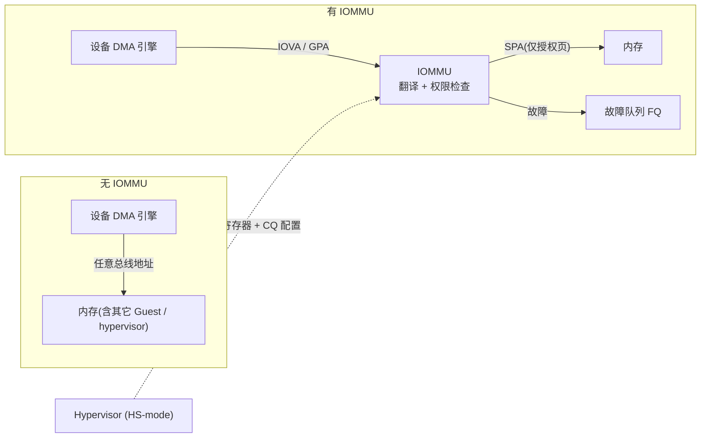
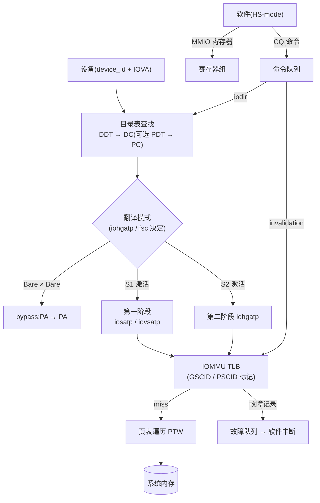
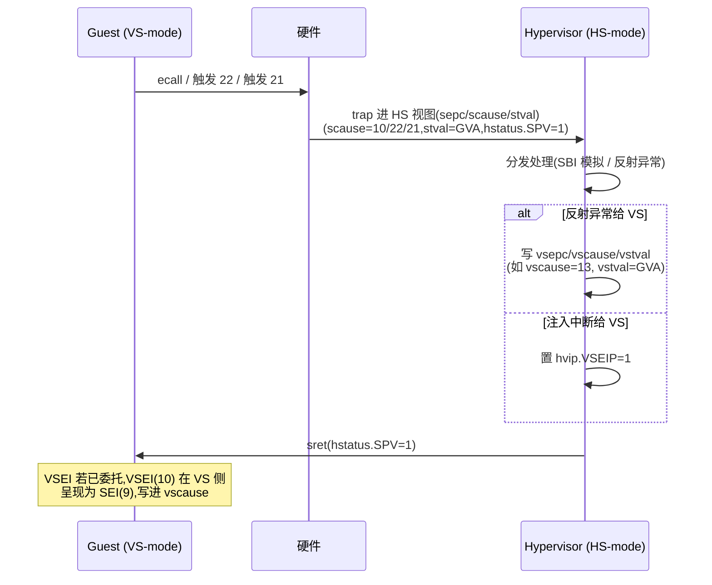
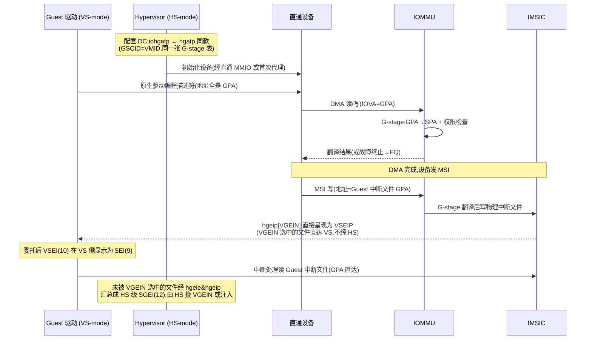

# IOMMU 与虚拟化验证:两阶段翻译与设备直通

> 站在硅前验证工程师(软件视角)的位置:H 扩展给了 CPU 两阶段翻译,IOMMU 把同样的翻译能力延伸到设备 DMA 侧。本篇回答两个问题——两阶段翻译的软件可见行为怎么验证、IOMMU 的设备直通怎么验证,以及两者组合成端到端直通用例时怎么搭、失败了怎么分锅。

| 前置阅读 | 你需要从那里带走什么 |
| --- | --- |
| [虚拟化:H 扩展与 KVM](./06-virtualization-h-extension.md) | vsatp/hgatp 分工、H 扩展 CSR 一览、hstatus 位域 |
| [内存管理:PMP 与 Sv39](./05-memory-management-pmp-sv39.md) | Sv39 页表遍历、Sv39x4 根页表为何 16 KiB |
| [AIA 高级中断架构](./07-aia-advanced-interrupt-architecture.md) | IMSIC 中断文件、Guest 中断文件、MSI 消息格式 |
| [硅前验证环境](./20-presilicon-validation-environment.md) | Palladium/FPGA 分工、bring-up 排查思路 |

**事实来源与引用约定**:本文具体实现细节(寄存器偏移、数据结构格式、命令语义)以本地 `reference/` 的 SiFive IOMMU-22 手册(24G1.02.00,下称"手册",按其章节号引用)为准;架构语义同时对照 RISC-V IOMMU Architecture Specification v1.0.1(已批准,下称"规范",按章号引用,源码在 [riscv-non-isa/riscv-iommu](https://github.com/riscv-non-isa/riscv-iommu));CPU 侧事实取自本地 `riscv-privileged-20211203.pdf`(下称"特权架构规范",按 § 章节号引用)。手册基于规范 2023-07 草案写成,术语与已批准版有少量出入(手册称 Context Table Entry/CTE,规范称 Device Context/DC;手册 `CAPABILITY.MSI` 对应规范 `capabilities.MSI_FLAT`),但**寄存器偏移两版一致**(已对照规范第 5 章源码逐项核对)。拿不准的数值一律标注待确认。

---

## 1. 问题:设备 DMA 如何打穿 Guest 隔离

CPU 侧的隔离链在虚拟化下是完整的:VU/VS 的每条访存指令都过两阶段页表,PMP 兜底物理层。但这条链只管"取指和 load/store 的那个 hart"。

设备走的是另一条路:DMA 引擎直接往互连上发读写事务,地址是驱动写进设备寄存器/描述符里的**总线地址**。一旦 Guest 驱动被攻破(或干脆是个有 bug 的驱动),它可以让设备:

- 按 Guest 猜测的宿主机物理地址直接写——覆盖 hypervisor 或别的 Guest 的内存;
- 用 DMA 把别的 Guest 的秘密数据搬进自己能读的缓冲区;
- 伪装成宿主机驱动配置的 DMA,覆盖内核数据结构。

MMU 帮不上忙(它不在设备的事务路径上),PMP 也帮不上忙(它是 per-hart 的,设备事务不经过任何 hart 的 PMP)。没有 IOMMU 时,设备侧的地址完全取决于"驱动写进去的数",而 Guest 对"物理地址长什么样"是有充分先验的(裸机时代大家都见过内存映射表)。

IOMMU 的解法是把 hart MMU 的职责复制到 IO 桥上:设备发出的地址先过一道翻译和权限检查,才落到互连。x86 和 ARM 早就走在这条路上,RISC-V IOMMU 是同类概念的第三次实现:

| 对比维度 | Intel VT-d | ARM SMMUv3 | RISC-V IOMMU |
| --- | --- | --- | --- |
| 设备→翻译上下文 | Root/Context 表,BDF 索引 | Stream Table(STE),StreamID 索引 | 设备目录表 DDT,`device_id` 索引 |
| 进程级地址空间 | PASID → PASID 表 | SubstreamID → CD | `process_id` → 进程目录表 PDT |
| 两阶段翻译 | 一阶段 + 二阶段 | Ste/CD 两级配置 | 第一阶段 + 第二阶段(与 H 扩展同构) |
| 命令接口 | Invalidate Queue 等一组队列 | 命令队列 | 命令队列 CQ |
| 故障上报 | Fault 寄存器/事件 | Event Queue / PRI Queue | 故障队列 FQ / 页请求队列 PQ |
| 中断重映射 | IRTE 表 | L1/L2 中断配置表 | MSI 地址翻译(与 AIA/IMSIC 关联) |

> **如何读这张表**:三者的结构逐行同构——"按设备查表拿到翻译配置 + 内存队列做控制面 + 队列收故障 + MSI 特殊处理"。差别在数据结构细节与 MSI 机制。验证方法论(合法性矩阵、故障注入、失效可见性)在三家是通用的,这也是 VT-d/SMMU 的老用例可以翻译过来用的原因。

RISC-V 的一个关键设计选择是**复用 CPU 的页表格式**:IOMMU 的第二阶段就是 Sv39x4/Sv48x4 页表,和 core 的 hgatp 同一种 walker 语义;第一阶段就是 Sv39/Sv48,和 satp/vsatp 同一种。换来两个验证上的好处:页表格式只有一份规范、参考模型可以共享思路;"同一张 G-stage 页表,CPU 和 IOMMU 各自走一遍"是天然的分锅对照手段(§6.3 会用到)。

但 IOMMU 不是白来的,三笔账要认:

- **延迟与面积**:每笔 inbound 事务都要过翻译,TLB miss 时还要 PTW 走内存——所以手册要花整章讲 TLB/目录/PTE 三级缓存和 8 个并行 PTW(§2.4 的参数表);
- **一致性协议**:页表是共享的、缓存是各自的,于是多出一条 invalidation 命令协议(CQ/IOFENCE),软件改表后必须显式同步——这是 §4.4 整节的来源;
- **内存管理被约束**:DMA 设备处理不了缺页,没有 PRI 时页面必须 pin 住(手册 §1.4.3 明说 Guest 需要向 hypervisor 申请 pinned pages),IOMMU 按缺页故障处理而不是像 CPU MMU 那样慢慢补页。

看清这三笔账,验证计划的优先级也随之清楚:功能正确性(翻译/故障/失效)是底线,性能(TLB 命中、PTW 并行度)是差异化,而 pinning 之类的软件契约只要用例覆盖到故障路径即可。



---

## 2. 验证对象速览:IOMMU 的软件可见接口

验证之前先把"软件能看到什么"数清楚。IOMMU 对软件暴露三样东西:一组 MMIO 寄存器、几张内存中的数据结构、三个环形队列。翻译本身对设备是透明的(设备只管发地址),所以**所有验证入口都从软件侧来**:配数据结构、发命令、观察 FQ 与 DMA 结果。



### 2.1 设备目录与翻译模式

每个 `device_id` 在设备目录表(DDT)里对应一个 32 字节的基础格式设备上下文(手册 §2.4.2 Table 2;支持 MSI 页表写入的扩展格式为 64 字节,规范第 2 章),四个双字依次是:

| 双字 | 字段 | 作用 |
| --- | --- | --- |
| [63:0] | `tc`(翻译控制) | V/EN_ATS/EN_PRI/T2GPA/DTF/PDTV 等开关(手册 Table 3) |
| [127:64] | `iohgatp` | 第二阶段:MODE[63:60] + GSCID[59:44] + PPN[43:0](手册 Table 4) |
| [191:128] | `ta`(翻译属性) | PSCID——第一阶段地址空间软标签(手册 Table 7) |
| [255:192] | `fsc`(第一阶段控制) | iosatp/iovsatp,或 PDT 指针(手册 Tables 5/6) |

结构与 core 侧的 CSR 一一对应:`iohgatp` 的布局就是 hgatp 的翻版(MODE 编码一致:Sv39x4=8、Sv48x4=9),`iosatp`/`iovsatp` 就是 satp/vsatp 的翻版。

特别的坑:`iovsatp.PPN` 指向的 VS-stage 根页表位于 **GPA** 空间,PTW 要先经第二阶段翻译才能读到它(手册 §2.4.5)——嵌套模式下页表遍历本身也在被翻译,这是用例设计时容易漏的一层。

DDT 本身按 `device_id` 宽度决定级数(手册 §2.4.1):≤7 位一级、8–16 位两级、最多 24 位三级。拿一个 16 位 DeviceID 的两级表算一遍(手册同节的例子):DeviceID=0x0234,第一级索引用 DeviceID[15:7]=0x4,读 `{ddtp.PPN, 12'b0} + 0x4×8`;第二级索引用 DeviceID[6:0]=0x34,读 `{上级 PPN, 12'b0} + 0x34×32`(基础格式 DC 每项 32 字节)。把这个算式写进用例的期望值,DDT 索引接错(侧带位序错、级数配错)会立刻在"读到的 DC 内容不对"上暴露。

GSCID/PSCID 与 core 侧 VMID/ASID 的关系是**软件的映射选择**,不是硬件绑定:手册 §2.4.4 说明 16 位 GSCID、20 位 PSCID 的尺寸就是为了容纳 14 位 VMID、16 位 ASID 或 20 位 PASID,但不要求一一对应。直通场景的惯例是 GSCID=VMID(§5 的配置契约),让设备侧 invalidation 与 core 侧 fence 的作用域天然对齐。

`iohgatp.MODE` 与第一阶段模式组合出四种翻译模式(手册 Table 11,规范第 2 章):

| iohgatp.MODE(第二阶段) | fsc.MODE(第一阶段) | 模式 | 翻译 | 典型场景 |
| --- | --- | --- | --- | --- |
| Bare | Bare | bypass | PA→PA | 不隔离的启动早期 |
| Bare | Sv39/Sv48 | 单阶段 | VA→SPA | 宿主机自用设备隔离 |
| Sv39x4/Sv48x4 | Bare | 仅 G-stage | GPA→SPA | **设备直通**(Guest 驱动用 GPA) |
| Sv39x4/Sv48x4 | Sv39/Sv48 | 嵌套 | GVA→GPA→SPA | Guest 自己管理设备 IOVA 映射 |

> **如何读这张表**:这张表是 IOMMU 验证的"模式轴"——每个功能用例都应该声明跑在哪一格。直通只需要最下一行(仅 G-stage 与嵌套);单阶段那一格在纯宿主机场景(无虚拟化)也要覆盖,因为多数系统里 IOMMU 平时就开着。

IOMMU 的 TLB 不按 `device_id` 标记,而按 SoftContextID 标记:嵌套用 {GSCID, PSCID},仅 G-stage 用 GSCID,单阶段用 PSCID(手册 §2.5 Table 12)。也就是说两个设备若共享同一软件上下文,共享 TLB 条目是**架构允许的**;隔离边界在 DC,不在 TLB。这对"多设备隔离"用例的期望值设定很重要(§4.5)。

### 2.2 三个队列

| 队列 | 条目大小 | 生产者 | 消费者 | 用途 |
| --- | --- | --- | --- | --- |
| 命令队列 CQ | 16 B | 软件 | IOMMU | invalidation、fence、目录失效、ATS 命令 |
| 故障队列 FQ | 32 B | IOMMU | 软件 | 翻译/配置故障记录 |
| 页请求队列 PQ | 16 B | IOMMU | 软件 | PCIe PRI 页请求(ATS 支持时才有) |

(手册 §2.9、§4 Table 19;规范第 3 章。)每个队列一对 head/tail 指针,规则统一:**消费者管 head,生产者管 tail**。CQ 是软件生产、IOMMU 消费(cqh 硬件维护、cqt 软件维护);FQ/PQ 反过来。队列空是 head==tail,满是 tail==head-1——注意有效容量比槽数少一。

### 2.3 MSI 地址翻译

设备发 MSI 就是往一个地址写一个数。在 RISC-V 的 AIA 里,MSI 的目的地是 IMSIC 的中断文件页(写 `seteipnum_le` 之类的寄存器,见[07-AIA](./07-aia-advanced-interrupt-architecture.md))。

规范为 MSI 提供了专门机制(扩展 DC 中的 msiptp + MSI 地址掩码/模式,支持内存驻留中断文件 MRIF,规范第 2 章),但 SiFive IOMMU-22 这一档配置**不支持** MSI 页表和 MRIF(手册 §6.1:MSI=0、MRIF=0),走的是更朴素的一条路:设备 MSI 写的地址是 GPA,G-stage 把它翻译到宿主机物理地址——如果 hypervisor 把 Guest 的中断文件页映射到了物理 IMSIC 页,MSI 就直达 Guest 的中断文件(手册 §1.2)。这条路的验证反而更贴近普通写翻译(§4.6)。

### 2.4 案例实现:SiFive IOMMU-22(iommu22_sv48_ats_max 配置)

手册描述的这颗 IOMMU 可以当"具体被测件"来对照。关键参数(用户指南 Table 1):DeviceID 16 位、ProcessID 20 位、最大 Sv48/Sv48x4、VAS=50、PAS=48、ATS=1、L1 TLB 64 项、L2 TLB 4096 项 8 路、8 个并行 PTW、L1/L2/L3 PTE 缓存各 32/64/128 项、G-stage 叶子缓存 256 项。能力寄存器(手册 §6.1)另声明:SVPBMT、T2GPA、PMON、DEBUG=1。

这些数字是性能与微架构用例的输入(比如"8 个并行 PTW,同时 miss 会不会死锁"),但架构验证只依赖软件可见行为本身。而验证这颗 IP 的第一个用例其实已经在读它们:capability 寄存器(偏移 0x0)报出的 SPEC_VERSION、支持的 MODE、PAS、DEBUG 等字段(手册 §6.1)必须与配置声明一致——能力探测对不上,后面所有用例的期望值都不可信。

---

## 3. CPU 侧:两阶段翻译的验证

IOMMU 验证开始之前,core 的两阶段翻译必须先站住——否则直通用例失败时你分不清是哪一侧翻错了(§6.3 的分锅表就是从这条前提推出来的)。这一节全是软件可见行为,全部可在 QEMU `-cpu rv64,h=true` 上先跑通。

### 3.1 翻译正确性矩阵:两阶段各自对/错

把 vsatp(第一阶段,GVA→GPA)与 hgatp(第二阶段,GPA→SPA)各自"映射正确/故意弄错"组合成四格,每格记录软件可见的 trap 结果。这是两阶段验证的主表:

| 场景 | S1(vsatp) | S2(hgatp) | trap 去向 | scause | stval | htval | hstatus.GVA |
| --- | --- | --- | --- | --- | --- | --- | --- |
| A 全对 | 正确 | 正确 | 无 trap | — | — | — | — |
| B S1 错 | 叶子 V=0 / 权限不足 | 正确 | HS 或(委托后)VS | 13(load)/15(store)页故障 | GVA | 0 | 1 |
| C S2 错 | 正确 | 叶子 V=0 / 权限不足 | **只能 HS** | 21(load)/23(store)**Guest 页故障** | GVA | **GPA>>2** | 1 |
| D 双错 | 错 | 错 | 同 B | 13/15(S1 先失败,S2 不会执行) | GVA | 0 | 1 |

> **如何读这张表**:这张表验证的是**架构的区分度**——同一个 load 失败,到底是 Guest 自己的页表错(13/15,Guest 可以自己处理)还是 hypervisor 的 G-stage 错(21/23,只有 hypervisor 能修)。判据有三条:scause 是 13/15 还是 21/23(特权架构规范 §8.6.1 Table 8.6)、htval 是否给出 GPA(htval=GPA 右移 2 位,§8.2.8)、hstatus.GVA 是否=1(§8.2.4,stval 保存 GVA 时置位)。任何一格对不上,后续的直通验证都会建立在错误前提上。

四个容易漏的深化点:

1. **C 的隐式访问子情形**。第二阶段错不只发生在数据访问:VS-stage 的页表遍历本身是 G-stage 翻译的隐式访问。如果 VS 页表所在 GPA 映射缺失,scause 同样是 21/23,但 htval 给出的是**那个读不出来的页表项的 GPA**,而原始 GVA 对应的 GPA 未知(特权架构规范 §8.2.8)。这时 htinst 非零可用于区分。用例:C 场景之外再加一格"S2 页表自身不可达"。
2. **委托的边界**。hedeleg 里 12/13/15 可写(Guest 可处理自己的 S1 缺页),而 20/21/23 与 22(虚拟指令)、10(VS ecall)是只读零(§8.2.2 Table 8.2)——**Guest 页故障永远到不了 VS**。用例:开 hedeleg[13] 后重跑 B,应看到 VS 内的 vscause=13;重跑 C,trap 仍进 HS。
3. **指令侧**。取指路径对应 12/20(指令页故障/指令 Guest 页故障),用一条放在坏映射页的 `jalr` 目标即可覆盖。
4. **非对齐访问的混合情形**。跨页的非对齐 load/store 触发 Guest 页故障时,htval 记录的是 stval 所指出错那一段对应的 GPA,不是整个访问的起点(§8.2.8)。用一条跨 4 KiB 边界、第二页 G-stage 缺失的非对齐 store 覆盖——不少实现只在第一段上做检查,这条能抓出来。

把 A 格用真实数字算一遍(§3.6 的实验可以直接照抄这组值)。目标:GVA `0x4000_0000` → GPA `0x6000_0000` → SPA `0x8020_0000`。

```text
第一阶段(VS-stage,Sv39,4 KiB 页):
  GVA 0x4000_0000 的 VPN[2]/VPN[1]/VPN[0] = 1 / 0 / 0
  遍历:vs_root[1] → L1[0] 非叶子 → L0[0] 叶子
  L0[0] PTE = 0x1_8000_0007
              = PPN 0x60000 << 10 | V|R|W
              → GPA 0x60000<<12 = 0x6000_0000   ✓

第二阶段(G-stage,Sv39x4,2 MiB 超级页):
  GPA 0x6000_0000:根索引(11 位 GPA[40:30])= 1,L1 索引 = 0x100,L0 = 0
  遍历:g_root16k[1] → L1[0x100] 叶子(超级页)
  L1[0x100] PTE = 0x2008_0017
              = PPN 0x80200 << 10 | V|R|W|U
              → SPA 0x80200<<12 = 0x8020_0000,覆盖 [0x8020_0000, 0x8040_0000) ✓
  (PPN=0x80200 最低位为 0,满足 2 MiB 超级页的对齐要求;U=1 是 §3.2 的坑)
```

两个 PTE 值都是拿位域拼出来的,读的时候可以从两头验:从地址侧验索引路径,从 PTE 侧验目标地址。实验里任何一格的观察结果异常,先回头核对是不是页表本身摆错了——排掉配置错,剩下的才是 RTL 的嫌疑。

### 3.2 权限语义的坑

两阶段各自的权限语义里有几处反直觉的坑,每条配一格负例用例:

- **G-stage 一律按 U-mode 检查 U 位**:即使访问来自 VS-mode,第二阶段检查 PTE 的 U 位时按 U-mode 算(§8.5.1)。G-stage 页表里 U=0 的叶子对 Guest 的一切访问都拒绝。这是把 Sv39 直接搬来当 G-stage 表时的经典错误——用例必须包含"U=0 的 G-stage 叶子"这一格(期望 Guest 页故障)。
- **两级权限是合取**:R/W/X 要两级都允许;MXR 分层——vsstatus.MXR 只放开 VS-stage 的 X-only 页,sstatus.MXR(HS)同时放开两级(§8.5)。构造 X-only 链:S1 X-only + S2 R,分别开两级 MXR 扫四种组合。
- **PMP 作用在 SPA**:与虚拟化模式无关(§8.5)。PMP 收紧到只覆盖目标 SPA 一半区域时,两阶段都"对"也会 access fault——这是区分"页表错"和"物理保护错"的对照用例。
- **A/D 位**:特权架构规范里 PTE 的 A=0/D=0 要么触发故障要么硬件置位;IOMMU-22 手册明说硬件不置位、只按 0 触发故障(手册 §2.7 Note)——CPU 侧与设备侧行为可能不同,跨侧对照时注意(§4.2)。

### 3.3 超级页

两级各自支持 Sv39 的 2 MiB/1 GiB 超级页(非对齐超级页必须报页故障,§4.3.2 步骤 6;Sv39x4 的 GPA 超 41 位必须报 Guest 页故障,§8.5.1)。用例按"两级大小页独立组合"排:S1 4K/S2 4K、S1 2M/S2 4K、S1 4K/S2 1G……外加两个负例:PTE 的 PPN 低位非零的非对齐超级页;GPA 第 41 位及以上非零。

### 3.4 VMID 与 TLB 语义

hgatp.VMID(RV64 字段 [57:44],最多 14 位,实际宽度 WARL、**可以为 0**,§8.2.10)的存在意义:切换 VM 不必全量刷 TLB,条目按 VMID 区分。由此推出三个必须覆盖的行为:

1. **VMID 隔离**:两个 VM(VMID=1/2)对同一 GPA 配不同 SPA,交替运行;每次切换只换 hgatp 不发任何 fence,各自读到的必须是自己的映射。漏刷(条目串 VMID)是这个用例能抓的典型 bug。
2. **VMID 回收**:VMID 数量有限(宽度可能远小于 14),复用旧 VMID 前软件必须全量 `hfence.gvma`;验证手段是把 VMID 宽度探测出来(写全 1 读回,§8.2.10),构造"VMID 耗尽→复用"序列。硬件上正确的实现可以做得比软件要求更保守(切换就刷),这不算 bug,但性能数字要另量。
3. **fence 的作用域**:`hfence.vvma` 只作用于执行时 hgatp.VMID 标识的那个 VM(§8.3.2);`hfence.gvma` 的 rs1 是 GPA>>2。还有一条极易踩:**写 hgatp 本身不产生任何排序保证**,改完页表必须补 fence(§8.2.10)。用例:改 G-stage PTE → 只写 hgatp(同值)→ 读,结果允许新旧任一;补 `hfence.gvma` 后必须新值。

把这三条排成一个可直接抄的用例序列(每行一个断言点):

| 步骤 | 动作 | 期望 |
| --- | --- | --- |
| 1 | 写 hgatp 全 1 读回 | 得到 VMID 实际宽度 N(可能为 0,则后续跳过) |
| 2 | VM1(VMID=1)配 GPA X→SPA_A,运行并读 X | 读到 SPA_A 内容 |
| 3 | 换 hgatp 到 VM2(VMID=2,X→SPA_B),无 fence,读 X | 读到 SPA_B 内容(不串 VM1 的条目) |
| 4 | VM1 改表 X→SPA_C,只写回原 hgatp,读 X | SPA_A 或 SPA_C 皆合法 |
| 5 | 同上但补 `hfence.gvma` 后读 | 必须 SPA_C |
| 6 | VMID 回绕:重用已用过的 VMID 前发全量 `hfence.gvma` 再进入 | 无陈旧翻译 |

> **如何读这张表**:步骤 3 抓"漏打 VMID 标签",步骤 4/5 抓"fence 语义错"(把允许值当必错值报,或把必错值当允许值放过),步骤 6 抓"VMID 回收"。VMID 宽度为 0 的实现里,切 hgatp 等价于全量刷,步骤 3 自动退化——期望值要按探测结果分支。

### 3.5 VM exit 入口与返回路径

从 VS 退到 HS 的入口,按触发条件列(特权架构规范 §8.6.1/§8.6.2):

| 入口 | scause | 触发条件(用例抓手) |
| --- | --- | --- |
| VS ecall | 10 | VS 内 `ecall`(SBI 调用路径) |
| 虚拟指令 | 22 | hstatus.VTVM=1 时 VS 写 satp / 执行 sfence.vma;VTW=1 时 wfi;VTSR=1 时 sret;VS 执行 hfence/HLV |
| Guest 页故障 | 20/21/23 | §3.1 的 C 格与隐式访问子情形 |
| 页故障 | 12/13/15 | §3.1 的 B 格,未委托时进 HS |
| HS 级中断 | 9(SEI)/12(SGEI) | 设备 MSI 经 IMSIC 到 HS 时的入口(§5) |

入口统一判据:`hstatus.SPV`=1 表示 trap 前在 VS/VU,SPVP 进一步区分 VS/VU(§8.2.4)。一进一出合起来看才完整:



**注入到 VS** 的两条路要成对验证:同步异常用"写 vsepc/vscause/vstval + sret";中断用 hvip.VSEIP/VSTIP/VSSIP——委托给 VS 后,VSEI(cause 10)会被硬件自动翻译成 VS 眼中的 SEI(cause 9),包括写进 vscause 的值(§8.2.2)。

这条"翻译"是中断直通(§5)的基石,值得单开用例:HS 置 hvip.VSEIP,断言 VS 侧 vscause=9 且 vsip.SEIP 可见。

### 3.6 QEMU 裸机实验:HS-mode 手搓两阶段

[43-Lab H 扩展两阶段 MMU](./43-lab-h-extension-two-stage-mmu.md) 走的是 KVM 路径——由内核替你管页表,观察的是系统级行为;这条路径的内核源码逐行走读见 [KVM on RISC-V 源码走读](./12-kvm-riscv-source-walkthrough.md)。

验证视角还需要一条互补的裸机路径:**自己同时扮演 hypervisor 和 Guest**,精确控制每一张页表、每一个 PTE 位,把 §3.1 的矩阵逐格扫掉。全程不用 KVM,QEMU TCG 的 H 扩展就够:

```bash
qemu-system-riscv64 -M virt -cpu rv64,h=true -m 128M \
    -bios none -nographic -kernel two_stage.bin
```

实验布局(地址都是编出来的,可换):

```text
GVA 0x4000_0000  --S1(Sv39)-->  GPA 0x6000_0000  --S2(Sv39x4)-->  SPA 0x8020_0000
VS 代码页同样走两级映射(vs_entry 的 GVA → GPA → 存放代码的 SPA)
HS 代码与数据留在 satp=Bare 的物理地址上(QEMU virt 内存从 0x8000_0000 起)
错误注入位:S1 叶子 V、S1 叶子 W、S2 叶子 V、S2 叶子 W、S2 叶子 U
```

核心序列(汇编骨架,完整工程仿 [40-裸机 trap handler 实验](./40-lab-baremetal-trap-handler.md) 的 Makefile/链接脚本搭):

```asm
# M-mode 启动后:medeleg/mideleg 委托给 HS,mret 进 HS,略
hs_entry:
    la      t0, hs_trap
    csrw    stvec, t0              # 不设 hedeleg:所有 trap 先到 HS
    # hgatp = Sv39x4(8)<<60 | VMID=1<<44 | G根(16KiB对齐)>>12
    li      t0, 8
    slli    t0, t0, 60
    li      t1, 1
    slli    t1, t1, 44
    la      t2, gstage_root
    srli    t2, t2, 12
    or      t0, t0, t1
    or      t0, t0, t2
    csrw    hgatp, t0
    # vsatp = Sv39(8)<<60 | VS根>>12   —— 注意写的是 vsatp(0x280)
    li      t0, 8
    slli    t0, t0, 60
    la      t2, vs_root
    srli    t2, t2, 12
    or      t0, t0, t2
    csrw    vsatp, t0
    li      t0, (1 << 7)           # hstatus.SPV=1
    csrs    hstatus, t0
    li      t0, (1 << 11)          # sstatus.SPP=1:sret 后进 VS
    csrs    sstatus, t0
    la      t0, vs_entry           # 这是一个 GVA
    csrw    sepc, t0
    sret
```

VS 侧探针循环对目标 GVA 做 load/store,HS 的 trap 处理器把观察向量全打出来:

```c
void hs_trap(void)
{
    printf("scause=%lu stval=%lx htval=%lx(GPA=%lx) GVA=%lu SPV=%lu\n",
           csr_read(scause), csr_read(stval),
           csr_read(htval), csr_read(htval) << 2,
           (csr_read(hstatus) >> 6) & 1, (csr_read(hstatus) >> 7) & 1);
    csr_write(sepc, csr_read(sepc) + 4);   /* 假定无压缩指令,-march 不带 c */
    /* 清理后 sret 回 VS 继续下一个探针 */
}
```

跑法:每轮只翻转一个错误注入位,预期输出对照 §3.1 的表格逐行 assert。这个实验在 QEMU 上是行为参考(它按特权架构规范实现),到 Palladium/FPGA 上同一份二进制就是 RTL 用例——"一份代码,两级复用"。VMID、fence、超级页的用例都可以在同一骨架上加"控制页表内容"的步骤生成。

> **核心要点**:两阶段翻译验证的主轴不是"翻译对不对",而是"**错误发生在哪一级,软件能不能区分**"。scause 13/15 对 21/23、htval 有无 GPA、hedeleg 的委托边界,三件事共同构成 hypervisor 正确处理 Guest 缺页的契约,任何含糊都会在直通场景里变成"数据神秘写坏"。

---

## 4. IOMMU 验证用例

现在把视角切到设备侧。先给出被测寄存器底账(手册 §4 Table 20;与规范第 5 章偏移一致),后面所有用例都在这张表上操作:

| 偏移 | 寄存器 | 验证中的角色 |
| --- | --- | --- |
| 0x0000 | capability | 只读能力探测(版本/支持的模式) |
| 0x0008 | fctl | 中断方式选择(WSI/MSI) |
| 0x0010 | ddtp | **总开关**:Off/Bare/1LVL/2LVL/3LVL + DDT 根 PPN + busy(手册 §6.4) |
| 0x0018/20/24 | cqb/cqh/cqt | CQ 基址/头(硬件)/尾(软件) |
| 0x0028/30/34 | fqb/fqh/fqt | FQ:基址/头(软件消费)/尾(硬件生产) |
| 0x0038/40/44 | pqb/pqh/pqt | PQ(ATS 支持时) |
| 0x0048/4C/50 | cqcsr/fqcsr/pqcsr | 队列使能/错误/中断位 |
| 0x0054 | ipsr | 中断 pending(cip/fip/pip) |
| 0x0058–0x01D8 | HPM 计数器与事件选择器 | 性能量测(手册第 10 章) |
| 0x0258/60/68 | tr_req_iova/tr_req_ctl/tr_response | **调试翻译请求**(DEBUG=1 时,手册 §6.17–6.19) |
| 0x02F8 | icvec | cause→MSI 向量映射 |
| 0x0300+ | msi_cfg_tbl | IOMMU 自身发 MSI 的配置 |

### 4.1 初始化序列

按手册 §2.10 的顺序(编号列表即用例步骤):

1. 配置 IOMMU 自身中断:msi_addr/msi_data/msi_vec_ctrl 与 icvec(或确认走有线中断);
2. 写 fqb + fqcsr 使能 FQ(先使能故障队列,保证后续步骤的故障可见);
3. 写 cqb + cqcsr 使能 CQ;
4. (ATS 支持)写 pqb + pqcsr 使能 PQ;
5. 在内存中摆好 DDT(以及 PDT),写好各设备的 DC;
6. 写 ddtp.iommu_mode(按 DeviceID 宽度选 1LVL/2LVL/3LVL)与根 PPN。

两个负用例跟在后面:写 ddtp 期间轮询 `ddtp.busy` 直到 0(手册 §6.4:busy=1 时再写的动作未定义);在 CQ 未使能时就发命令(应卡住/报错,不应静默丢)。

发命令的通用动作(手册 §2.9.1、§5.3):读 cqh 确认有空槽 → 把 16 字节命令写进 cqt 指向的槽 → 推进 cqt。IOMMU 顺序取指但**可能乱序执行**,要顺序保证就发 IOFENCE.C;非法命令会把队列卡死在 cqh 不动,同时置 cqcsr.cmd_ill:

```c
void cq_submit(uint64_t dw0, uint64_t dw1)   /* 16B 命令 = 两个双字 */
{
    uint32_t h = mmio_read32(CQH), t = mmio_read32(CQT);
    if (t == ((h - 1) & CQ_IDX_MASK))
        panic("CQ full");
    cq_base[t].dw0 = dw0;                    /* 先写命令体 */
    cq_base[t].dw1 = dw1;
    mmio_write32(CQT, (t + 1) & CQ_IDX_MASK);/* 再推进尾指针 */
}
/* IOTINVAL.GVMA 的 opcode=0x1、funct3=0x1;GV/GSCID 等
   操作数位域见手册 §3.1 的命令位图(Figure 17) */
```

> **待确认**:IOTINVAL/IOFENCE 各操作数(GV/AV/PSCV/GSCID/ADDR/DATA 等)在 16 字节命令里的精确位偏移,手册以位图(Figure 17/18)形式给出,pdftotext 无法抽取,此处不凭记忆补写;移植时按手册图或规范第 3 章的命令格式图填入。命令头(opcode[6:0]/funct3[9:7])的编码在手册 Table 14/15 里有文字表,可直接用。

顺带一个验证侧的注意:软件写命令与推进 cqt 之间必须保证顺序(手册 §2.9.1 要求生产者保证"消费者看到尾指针更新时也能看到数据"),C 里靠 volatile/屏障,这个约束本身也是用例——故意乱序写,合规的 IOMMU 不应消费到半新半旧的命令。

### 4.2 用例 1:合法映射的翻译正确性

**先不接设备**。IOMMU-22 的 DEBUG=1 意味着有一组寄存器可以直接"问"它一个翻译(手册 §6.17–6.19;规范第 4 章"Debug support"明说这接口就是为软件调试和合规测试设计的)。

流程:写 `tr_req_iova`(IOVA)→ 写 `tr_req_ctl`(置 GO/DID/PV/PID,PRIV/EXE/RWN 控制权限视角)→ 轮询 GO 清零 → 读 `tr_response`:

```c
uint64_t iommu_translate(uint64_t iova, uint64_t did, uint64_t perm)
{
    mmio_write64(TR_REQ_IOVA, iova);
    mmio_write64(TR_REQ_CTL, (1UL << 0)      /* GO,RW1S,只能由硬件清 */
                             | (did << 40) | perm);
    while (mmio_read64(TR_REQ_CTL) & 1)      /* 完成时间有限但未指定,必须轮询 */
        ;
    return mmio_read64(TR_RESP);             /* bit0=FAULT,S=超级页,PPN 编码大小 */
}
```

返回值直接给出 PPN、PBMT 和超级页大小(S=1 时大小编码在 PPN 里,手册 Table 40:从 bit 0 向上扫,第一个 0 出现在位置 x,超级页大小就是 $2^{x+1}\times 4\,\mathrm{KiB}$,其下各位全 1)。

拿 §3.1 手算过的那条 G-stage 2 MiB 超级页映射(GPA 0x6000_0000 → SPA 0x8020_0000)算期望值:SPA 的 PPN 是 0x80200,编码后 `tr_response.PPN = 0x802FF`(bit 8 为 0、bit 7:0 全 1),`S=1`,断言可以直接写死这个数。**同一个映射,CPU 侧看 htval/翻译结果、IOMMU 侧看 tr_response,两条观察路径对照**,是后面分锅的第一刀。

这组寄存器让"页表路径"与"设备接口"解耦:矩阵扫页(§2.1 四种模式 × 权限 × 超级页)不需要任何 DMA 设备,一台带 IOMMU RTL 的仿真环境就能跑。

**再上设备**:接伪 DMA 引擎(§6.1),对同一组映射做"设备写 pattern → CPU 读回来比对、CPU 写 → 设备读回来比对"的往返。这里的对照价值:tr 接口说翻译是 X,设备路径却是 Y,就说明问题在设备接口/互连侧而非页表(§6.3)。

### 4.3 用例 2:未映射/无权限 DMA 的故障上报

本节回答:非法 DMA 发生后,IOMMU 拦不拦、报什么、FQ 记录对不对。故障记录是 32 字节(手册 §7 Table 55;规范第 3 章 FQ 小节):

| 位段 | 字段 | 含义 |
| --- | --- | --- |
| [11:0] | cause | 12 位故障码 |
| [31:12] | PID | process_id |
| [32]/[33] | PV/PRIV | PID 有效 / 特权标志 |
| [39:34] | TTYP | 事务类型(2=未翻译读,3=未翻译写,8=ATS 翻译请求…) |
| [63:40] | DID | device_id |
| [191:128] | iotval | 出错 IOVA(TTYP 为消息时是消息码) |
| [255:194] | iotval2 | Guest 页故障时的 GPA 与标志 |

> **如何读这张表**:验证时逐字段断言,不能只看 cause。DID 错了说明 DeviceID 接线/目录索引错;TTYP 错了说明事务类型侧带信号错;iotval/iotval2 的值错说明故障地址在 PTW 里被污染。

故障码精选(完整表见手册 Table 56):

| cause | 含义 | 验证触发方式 |
| --- | --- | --- |
| 13/15 | 读/写页故障 | 第一阶段缺映射/权限不足 |
| 20/21/23 | 指令/读/写 **Guest** 页故障 | 第二阶段缺映射/权限不足 |
| 256 | ddtp.iommu_mode=Off 期间来事务 | Off 模式下发 DMA |
| 257/258/259 | DDT 装载访问故障/项无效/项配置错 | DC.V=0;iohgatp.MODE 写非法值 |
| 260 | 事务类型不允许 | tc 关闭 ATS 后发 ATS 请求 |
| 273 | IOMMU 自身 MSI 写访问故障 | 把 msi_addr 指向坏地址 |

**iotval2 的编码值得单开用例**(手册第 7 章):Guest 页故障时 `iotval2 = {GPA[63:12], 10'b0, 写标志, 隐式标志}`——bit0=1 表示故障来自 VS-stage 的**隐式访问**(页表遍历/GPA 里的 PDT 指针),bit0=0 表示最终 GPA 翻译失败;iotval 恒为原始 IOVA。这与 CPU 侧 htinst 区分隐式访问的设计(§3.1)是同一哲学,用例可以直接复用"让 VS 页表本身不可达"的页表布局。

故障路径还有三个工程断言:

1. FQ 满(容量-1 条)后置 fqof、丢新记录,恢复流程按手册 §5.6:读空 → fqh:=fqt → 写 1 清 fqof;
2. tc.DTF=1 时部分故障不记录(表 56 右列)但错误响应照发——"静默终止"也是架构行为;
3. Bare(透传)与 Off(全禁)语义不同:256 只在 Off 出现,Bare 是透传。**终止 vs 透传是策略轴**:Off/Bare/翻译三档要分别验证设备可见的响应。

### 4.4 用例 3:invalidation——改了页表要"立刻"可见

IOMMU 有自己的 TLB 和目录缓存,软件改内存中的页表/DC 后必须用命令同步(手册 §3.1;规范第 3 章):

```text
1. 设备写页面 A(IOVA X)成功;读回比对
2. 软件改 G-stage PTE:X → 页面 B
3. (不加 invalidation)设备再写 X——旧翻译/新翻译均允许(架构上"不可预测"),
   断言仅为"二选一且稳定"
4. 发 IOTINVAL.GVMA(GSCID 限定)+ IOFENCE.C(AV=1,ADDR=标志地址)
5. 等内存标志出现后设备再写 X——必须命中页面 B
```

IOTINVAL.VMA 管第一阶段/单阶段(按 PSCID+GSCID+地址可选收窄),IOTINVAL.GVMA 管第二阶段(按 GSCID+地址);**PSCV=1 配 GVMA 是非法命令**(手册 Table 17)。改 DC 本身要补 IODIR.INVAL_DDT(可按 DeviceID 收窄,DV=0 时全刷)。两个强化手段:

- **IOFENCE.C 是同步点**:cqh 推进不保证命令已提交,只有 fence 完成才算数(手册 §3.2);它的 AV/DATA 还能顺手写内存标志,甚至把 ADDR 指到 IMSIC 的 `seteipnum_le` 用中断通知完成——fence 完成通知路径本身也是一个用例。
- **关缓存交叉验证**:IOMMU-22 的 custom0(偏移 0xC)有 PTE_DISABLE/CTE_DISABLE 位(手册 §6.3),关掉 PTE/目录缓存后"改表即生效";再用"开缓存+正确 invalidation"对照,能把缓存一致性 bug 从页表遍历 bug 里剥离出来。这是厂商寄存器带来的私有杠杆,值得写进用例库。

### 4.5 用例 4:多设备隔离

隔离的验证问题:A 的 DMA 永远不能落到 B 的映射上,而合法共享要被识别为合法。两套 DC:设备 A 与 B 各自 `device_id`,A 配映射 M_A、B 配映射 M_B:

- 正向:A 用 A 的 IOVA、B 用 B 的 IOVA,各自读写正确;
- 反向:A 故意用 B 的 IOVA——若两表不同,必须故障(FQ 记录 DID=A)或翻译到不同 SPA;**绝不能**落到 B 的 SPA;
- 共享语义:故意让 A、B 的 DC 指向同一 iohgatp/GSCID(同一 VM 的两个直通设备),此时共享 TLB 条目是合法的(§2.1)——这条要写成"期望共享"的正向用例,防止把正确行为当 bug 报。

隔离失效的根因通常在 DeviceID 侧带接线或 DDT 索引,分锅手段见 §6.3。这条侧带本身是 SoC 集成自由度:物理设备到 DeviceID 的映射 IMPLEMENTATION DEFINED,PCIe 系统的惯例是直接用 RequesterID(手册 §2.3.1 的例子:{Bus[7:0]; Device[4:0]; Function[2:0]},多 PCIe 控制器时高位再拼 Segment ID)。

验证要做的第一件事是把这个映射从集成方要过来写进用例参数——"DeviceID 是什么"错了,后面所有 DC 配置都是在给错误的设备开门。

还有一个直通特有的负例:**设备 MMIO 的访问路径不经 IOMMU**(outbound 事务,hart 的 MMU 已把它翻成物理地址,手册 §1.2),所以隔离用例只约束 DMA 方向;若发现设备寄存器写不进去,那是 G-stage 表或 PMP 的问题,与 IOMMU 无关——别在这个方向上浪费调试时间。

### 4.6 用例 5:MSI 重映射

按 §2.3 的模型(IOMMU-22 无 MSI 页表),设备 MSI 地址是 GPA,翻译走 G-stage:

1. hypervisor 在 G-stage 里把 Guest 中断文件页的 GPA 映射到物理 IMSIC 的对应页;
2. 设备发 MSI:写 GPA 中断文件页(data=中断号);
3. 断言:Guest 侧 IMSIC 中断文件置位(通过 Guest 内读中断文件或后续中断行为观察),宿主机内存无越界写(FQ 无记录)。

负例:把 G-stage 里该 GPA 的 W 位清零 → MSI 写应当变成 21/23 类 Guest 页故障进 FQ。

另外**IOMMU 自己也会发中断**(FQ 有记录、CQ 非法命令、PQ 满):icvec 把 cause 映射到向量,msi_cfg_tbl 决定发往哪个 IMSIC 文件,ipsr 显示 pending(手册 §6.21/§6.22、第 9 章)。把"FQ 溢出中断能否送达处理核"做成用例,否则故障用例本身会在 FQ 满时悄悄失效(§4.3 的 (a) 正好联动)。

### 4.7 用例 6(可选):ATS/PRI——设备侧的翻译缓存

带 ATC 的 PCIe 设备会把翻译结果缓存在自己那边,于是多出一层"设备侧缓存"要同步。

同步手段:IOTINVAL 之外还有 ATS.INVAL(让 IOMMU 向设备发 Invalidation Request,等 Invalidation Completion 才算完成)与 ATS.PRGR(把软件的页请求响应转给设备),页请求经 PQ 上报(手册 §3.3.1、§2.9.3;规范第 3 章 ATS 命令小节)。用例骨架:

1. tc.EN_ATS=1,设备发 Translation Request → IOMMU 返回翻译(含权限);
2. 改 G-stage 页表 → IOTINVAL.GVMA + **ATS.INVAL** → IOFENCE.C → 设备用旧 ATC 条目再访存,必须被拦下(设备侧缓存与 IOMMU 侧缓存要分别失效,只刷一侧是用例的"陷阱位");
3. tc.T2GPA=1 时翻译请求返回 GPA(权限取两级合成)——手册 §2.4.2 点明这个位的用途:即便设备开了 ATS,hypervisor 仍能把直通设备的 DMA 圈在 VM 内存里;
4. PRI:设备访问未映射页 → PQ 出现页请求记录 → 软件补映射后经 ATS.PRGR 响应(仅 EN_PRI=1 且 EN_ATS=1 时合法)。

IOMMU-22 支持 ATS(caps.ATS=1)且经 AMBA DTI 协议对接 Root Port(手册 §1.1),但 ATS 用例依赖 PCIe 子系统先稳定,排期上放最后;前面所有用例都可以用不带 ATC 的伪 DMA 引擎跑。

---

## 5. 组合场景:Guest 直通设备的端到端

前面的件拼起来,就是直通:Guest 用原生驱动控制真实设备,DMA 与中断都不经 hypervisor 转手。



中断直通那条腿值得把 CSR 级语义写死(特权架构规范 §8.2.3):`hip.VSEIP = hvip.VSEIP | hgeip[VGEIN] | 平台信号`——VGEIN 选中的 guest 中断文件**直接**贡献 VS 级外部中断,VS 开着 vsie.SEIE 就能收到,全程不进 HS。

而 `hip.SGEIP = (hgeie & hgeip) != 0`,是"有未被选中的文件在 pending"的 HS 级通知(cause 12,不可委托),hypervisor 靠它发现该给别的 VM 换 VGEIN 了。两条腿分清楚,§6.3 里"中断没到"的分锅才有依据:VSEIP 链断在 VGEIN/hgeie,是 core 侧配置;断在 MSI 写,是 IOMMU 侧翻译。

端到端用例骨架(每步都留观察点):

1. hypervisor 建 G-stage 表(与 hgatp 同源),写 DC:iohgatp.MODE=Sv39x4、GSCID=VMID、tc 按 §2.1 直通格(fsc=Bare);
2. 把设备 MMIO 区域映射进 Guest GPA, Guest 驱动初始化设备;
3. Guest 发起一次收/发 DMA(数据校验 pattern);
4. 等 MSI 到达 Guest 中断文件,断言中断号与数据同时正确;
5. 负变体:抽掉 G-stage 某页 → DMA 应故障且 Guest 不收到"假成功";再抽中断文件页映射 → DMA 成功但中断丢失,这两个失败模式要在用例里可区分。

若要进一步让 Guest 自己管理设备 IOVA(嵌套模式),DC 的 iovsatp 指到 GPA 里的 Guest 页表(§2.1 右下格),同时 hypervisor 要向 Guest 提供一个"虚拟 IOMMU"视图(Guest 里的 IOMMU 驱动要能配表、收故障)。

IOMMU-22 手册 §6.1 的 Note 直接讨论了这个用法:hypervisor 可以仿真能力寄存器(清掉 SV*x4 位)来隐藏第二阶段控制权。这一档复杂度高,建议放在直通(G-stage only)稳定之后。

> **核心要点**:直通的配置契约只有一句话——**DC 的 iohgatp 与 core 的 hgatp 指同一张 G-stage 表、用同一个上下文 ID**。DMA 侧(设备写数据)与中断侧(MSI 写中断文件)共用这一张表,所以数据路径和中断路径的故障可以合并排查:先查这张表,再查两侧各自的特殊环节(设备的 tc/ATS,IMSIC 的 VGEIN 链)。

---

## 6. 硅前执行与协作

### 6.1 测试 DMA 设备从哪来

IOMMU 验证有个鸡生蛋问题:验证 IOMMU 要有设备发 DMA,而真设备(网卡/SSD)要等 PCIe 子系统和 bring-up 都稳定才接得上。三条路,按投入排序:

| 方案 | 做法 | 适合覆盖 |
| --- | --- | --- |
| 调试翻译接口 | §4.2 的 tr_req 三寄存器 | 全部页表路径、权限、超级页(无设备) |
| 伪 DMA 引擎 | 简单 DMA IP(如 PULP iDMA——[zero-day-labs/riscv-iommu-tests](https://github.com/zero-day-labs/riscv-iommu-tests) 就用它配 CVA6 搭了整套架构测试:Off/Bare/仅二阶段/嵌套等用例) | 真实事务流、FQ、invalidation、隔离 |
| 真网卡/存储 | PCIe RC + 真卡 | ATS/PRI、吞吐压力、与真驱动交互 |

开源侧还有两份现成资产可借:规范仓库自带 C 参考模型 `iommu_ref_model`(可用作行为金标准,输入同一页表/命令序列比对输出);QEMU 主线已有规范 1.0 的设备模型 `riscv-iommu-pci` / `riscv-iommu-sys`(`-M virt,iommu-sys=on` 即可挂上,支持 s-stage/g-stage/intremap/ats 选项,见 [QEMU RISC-V IOMMU 文档](https://www.qemu.org/docs/master/specs/riscv-iommu.html))。

**软件侧的寄存器/队列/命令序列可以先在 QEMU 上把代码调通**,再搬到 Palladium。这和 §3.6"一份代码两级复用"是同一个策略。Linux 侧 RISC-V IOMMU 驱动已进主线(v6.13 起,同上文档),带 OS 的系统级用例也有现成落点。

### 6.2 跑在哪个平台上

Palladium/FPGA 的分工沿用 [20-硅前验证环境](./20-presilicon-validation-environment.md) 的结论:仿真慢但波形全、可见性好;FPGA 快但黑盒。对本主题的具体映射:

- **仿真优先**:翻译矩阵、故障记录逐字段断言、invalidation 边界(时序不敏感、断言密度高);
- **FPGA 优先**:多设备并发 DMA、TLB 容量行为(4096 项 L2 TLB 的溢出/替换)、与真卡 ATS/PRI 交互;
- **微架构专项**(并行 PTW 死锁、目录缓存一致性)留在仿真里用定向激励打——这些不问"行为对不对",问"这套实现稳不稳",与架构用例分账管理(见[90-附录](./90-appendix-architecture-background.md)对 ISA/微架构边界的讨论)。

量测用 IOMMU 自带的 HPM:除自由运行的 cycle 计数器外,IOMMU-22 实现了 16 个 40 位事件计数器加对应的事件选择寄存器(手册第 10 章;寄存器偏移见 §4 底账表的 0x58–0x1D8 一段)。事件码到计数器的映射按手册 §10.3 的选择器表配。

功能验证之外,值得顺手量的两个数:嵌套翻译对仅 G-stage 的额外延迟(同一 DMA 序列两种模式各跑一轮),以及 invalidation 之后首笔 DMA 的 TLB 重填开销——这两个数直接决定系统软件愿不愿意开嵌套模式。

### 6.3 失败分锅:IOMMU 配置 / 设备侧 / core 侧

直通用例失败时,症状(数据没写/写错位置/中断没来)不指向责任方。分锅靠"把三方的可疑面逐个旁路":

| 症状 | 第一刀 | 嫌疑与排除手段 |
| --- | --- | --- |
| 数据没写入 | tr 接口问同一 IOVA | 翻译对→设备侧(事务没发出/侧带错);翻译错→页表或 PTW |
| 数据写错位置 | CPU 用同一 G-stage 表访问 | CPU 对 IOMMU 错→G-stage 页表本身错;仅 IOMMU 错→IOMMU PTW/TLB |
| 数据时对时错 | 关 IOMMU 缓存(custom0)再跑 | 关了就对→invalidation/缓存一致性;仍错→页表内容竞争 |
| 中断没到 | 查 FQ 与 ipsr | FQ 有记录→MSI 写被拒(G-stage W 位/映射缺失);FQ 空但 ipsr 空→设备没发 MSI 或 DeviceID 错;IOMMU 侧全对→core 侧 VGEIN/hgeie 链(对照 [07-AIA](./07-aia-advanced-interrupt-architecture.md)) |

几个通用杠杆:`ddtp=Bare` 旁路翻译可以区分"翻译错"与"互连/权限错";FQ 记录的 DID/TTYP/iotval 直接指认设备与事务;两阶段在 CPU 侧先按 §3 跑绿之后,core 的 MMU 基本可以移出嫌疑名单。

### 6.4 与 DV 的界面

软件视角的产出物是**能在测试环境里独立运行的 C 用例**,这是与 DV 团队协作的交接物:

- 用例通过前门(MMIO)访问寄存器,不依赖 force/backdoor——DV 可以直接在 RTL 仿真里跑,也可以在加速平台上跑;
- 每个用例自带断言与预期输出(如 §3.1 表格、§4.3 字段表),失败时打印观察向量而不是 silent fail;
- 厂商私有观测点(SiFive 的 custom0 缓存开关、Error Bank @ IOMMU_BASE+0x1000 的 RAS 记录、IOHPM 性能计数器组,手册 §6.3/§7.1/第 10 章)在用例里以条件编译隔离,保证同一份代码能跑"纯架构断言"和"实现增强"两种模式;
- 架构合规层面,[21-架构符合性测试](./21-arch-compliance-riscof.md) 的思路同样适用:规范第 4 章把 tr 调试接口定位为合规测试的载体,IOMMU 的合规套件(如 zero-day-labs 框架)可以作为 RTL 用例的种子库,而不是自己从零写。

交接物的形态可以很朴素——一个自带断言的 main 循环就够 DV 拿去挂仿真:

```c
/* 用例:G-stage 只读页被写 → 期望 cause 23 的 Guest 页故障 */
static void t_gstage_write_fault(void)
{
    struct fault_rec rec = {0};
    dma_write(DEV_A, IOVA_RO_PAGE, 0xdeadbeef);      /* 伪 DMA 引擎写只读页 */
    fq_drain(&rec);                                   /* 等 FQ 记录,超时即 fail */
    ASSERT_EQ(rec.cause, 23);
    ASSERT_EQ(rec.did, DEV_A);
    ASSERT_EQ(rec.ttyp, TTYP_UNTRANSLATED_WRITE);
    ASSERT_EQ(rec.iotval, IOVA_RO_PAGE & ~0xfffULL);
    report(TEST_PASS);                                /* 失败路径打印观察向量后停机 */
}
```

这样的用例不含任何平台私有信息(寄存器偏移集中在头文件),同一份代码在 QEMU 设备模型上调通、在 RTL 仿真里跑断言、上 FPGA 做回归——对应 §3.6 与 §6.1 两次说到的"一份代码,多级复用"。

---

## 参考资料

- SiFive IOMMU-22 Manual / User Guide, 24G1.02.00(本地 `reference/`,实现细节的一手来源)
- [RISC-V IOMMU Architecture Specification v1.0.1(ratified)](https://github.com/riscv-non-isa/riscv-iommu)——第 2 章 Data Structures、第 3 章 In-memory queue interface、第 4 章 Debug support、第 5 章 Memory-mapped register interface
- [RISC-V Privileged Architecture V20211203](https://github.com/riscv/riscv-isa-manual)(本地 `reference/`)——第 8 章 Hypervisor Extension
- [QEMU:RISC-V IOMMU support for RISC-V machines](https://www.qemu.org/docs/master/specs/riscv-iommu.html)
- [zero-day-labs/riscv-iommu-tests](https://github.com/zero-day-labs/riscv-iommu-tests)——CVA6 + PULP iDMA 的 IOMMU 架构测试框架
- [AIA 规范](https://github.com/riscv-non-isa/riscv-aia)——IMSIC 中断文件与虚拟化(配合 [07-AIA](./07-aia-advanced-interrupt-architecture.md))

---

→ 下一步:动手搭 §3.6 的两阶段裸机实验,从 [实验一:裸机 Trap Handler](./40-lab-baremetal-trap-handler.md) 的框架起步;概念不清时回 [附录:体系结构背景](./90-appendix-architecture-background.md) 查 ISA 与微架构的边界。
