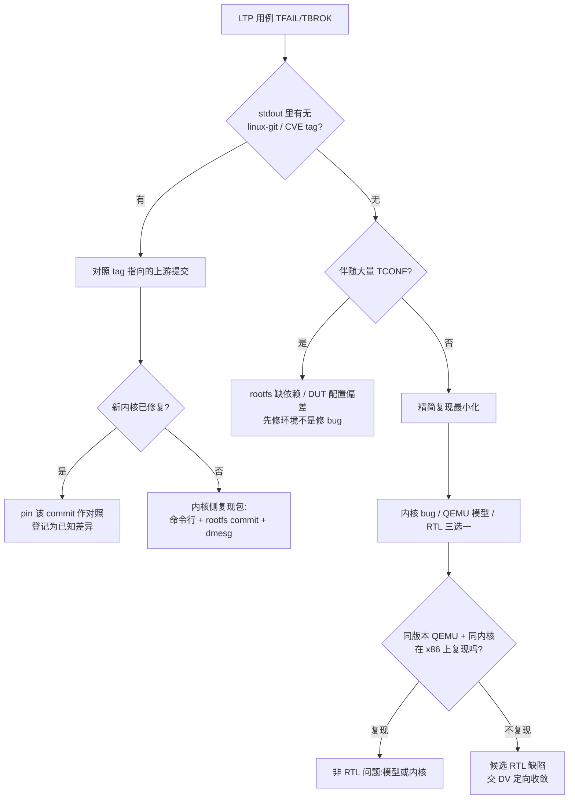

# Linux 功能测试:LTP 与内核侧测试套件

[架构符合性测试](./21-arch-compliance-riscof.md)证明核在裸机下兑现 ISA 合同;一旦真实工作负载——busybox shell、网络栈、pthread——跑起来,核就和内核一起进入另一个合同层:syscall 语义、内存管理、进程间同步。这一层的"合规性回归"由 LTP(Linux Test Project)承担。它不是把 riscv-tests 放大版再跑一遍,而是换了一个被测对象:**带上完整 Linux 的 SoC**。对硅前验证的意义在于,许多微架构缺陷(LL/SC 前向进度、TLB 管理、icache 一致性)要经过内核的调度与页表操作才暴露,LTP 提供了现成的、上千条的触发器。

## 1. 测试分层:LTP 管哪一层

硅前验证常用的软件测试套件各管一段,先分清楚谁回答哪个问题:

| 套件 | 被测对象 | 运行环境 | 回答的问题 | 本仓笔记 |
| --- | --- | --- | --- | --- |
| riscv-tests / RISCOF | 核 × ISA 合同 | 裸机(QEMU/DUT 直跑) | 指令行为对不对? | [21](./21-arch-compliance-riscof.md) |
| **LTP** | **Linux 内核**(**跑在核上**) | Linux rootfs(syscall ABI) | 内核对上表现出的 syscall 合同稳不稳? | 本篇 |
| kselftest | 内核子系统自测 | Linux rootfs | 特定机制(cgroup/mm/netfilter…)行为符合预期? | — |
| kvm-unit-tests | KVM/硬件虚拟化入口 | 极简 firmware 下直跑 | VM entry/exit、两阶段翻译通不通? | 参考 [25](./25-iommu-virtualization-validation.md) |

> **如何读这张表**:四者不互替。下游两个套件都要求 Linux 已经 bring-up 完成(见 [13](./13-linux-bringup.md));kvm-unit-tests 不需要完整发行版,适合内核起来之前、H 扩展刚能出 rumor 的阶段。

LTP 的官方自我定位是"验证 Linux 内核的可靠性、健壮性与稳定性"(README 原文),项目由 SUSE/Red Hat/Fujitsu 等联合维护,每季度发版。本篇事实基线为浅克隆的 **20260529** 版(`riscv/src/ltp`)。

## 2. LTP 的组织方式与框架解剖

### 2.1 runtest 清单:suite 即文本行

LTP 的测试池按 suite 组织,每个 suite 是一个纯文本清单:`runtest/` 目录共 66 个文件、约 5000 条用例条目,其中 syscalls 一个 suite 就有 1527 条,另有 mm(100)、cve(105) 等。每行一个二进制 + 可选参数:

```c src="./src/ltp/runtest/syscalls" lines="1-6" anchor="ltp_runtest_head"
```

选 suite 就是选文件名——跑 syscalls 还是只跑 cve,决定了回归的时长与目的。

### 2.2 新框架(newlib)下的一个用例长什么样

现代 LTP 用例收敛到一个极简形态——声明式的结构体 + 宏断言。最小的实例如下,全文不过 22 行:

```c src="./src/ltp/testcases/kernel/syscalls/wait/wait01.c" lines="1-22" anchor="ltp_wait01"
```

三个要点:`/*\ … */` 文档块既是给读者看的也是给 metadata 提取器看的;[`TST_EXP_FAIL2()`](#ltp_wait01) 这类宏把"调用 + 断言返回值 −1 且 errno=ECHILD"压成一行,失败时自动打印实际值;`.test_all` 注册入口后,框架负责 fork 计数、超时、资源清理,用例作者只写业务逻辑。

### 2.3 框架替你管什么

每个用例都是一份 `struct tst_test` 描述。常用字段位域一眼可见其自动化程度:声明 `.needs_root` 就自动以 root 断言重跑,`.needs_device` 自动准备块设备,`.all_filesystems` 把同一个测试在每个可用文件系统类型上各跑一遍,`.timeout/.runtime` 控制慢机器上的看门狗:

```c src="./src/ltp/include/tst_test.h" lines="553-585" anchor="ltp_tst_struct"
```

结果语义分五档,**TCONF 在硅前工程里最重要**:它表示"环境不具备,跳过"而不是失败——大量 TCONF 通常说明 rootfs 缺依赖或 DUT 配置和主粮机型不同,得先修环境再谈 bug。

| 结果 | 含义 | 验证工程动作 |
| --- | --- | --- |
| TPASS / TFAIL | 断言通过 / 失败 | 失败进入分锅流程(§6) |
| TBROK | 测试自身无法继续(setup 失败等) | 先看是否环境问题 |
| TCONF | 配置不支持,跳过 | 审计跳过集,防"绿了但没测" |
| TWARN | 警告但不定罪 | 记录趋势 |

失败输出还会自动携带**定位元数据**:用例若声明了 tags,框架在结果里打印对应上游修复提交号或 CVE 号:

```c src="./src/ltp/include/tst_test.h" lines="218-239" anchor="ltp_tst_tags"
```

也就是说,TFAIL 的 stdout 里经常已经写着"这个 bug 对应 linux-git 哪个 commit"——分锅的第一手证据由框架供给。

## 3. RISC-V 在 LTP 里长什么样

LTP 主体架构无关,riscv64 开箱可用。全树 grep `riscv` 只有零星几处,但每一处都值得硅前工程师驻足——它们恰好落在容易踩坑的边界上。

syscall 条目编号由脚本统一生成,riscv64/riscv32 都在内:

```sh src="./src/ltp/include/lapi/syscalls/generate_arch.sh" lines="156-168" anchor="ltp_syscall_gen"
```

第一处细节:vDSO 符号的版本字符串在 RISC-V 上不同于多数架构,直接做 vDSO 符号探测的用例(clock_gettime 时间族)依赖这类定义:

```c src="./src/ltp/libs/vdso/vdso_helpers.c" lines="50-62" anchor="ltp_vdso"
```

第二处更典型——hugetlb 的 icache 维护用例,深读一段([hugemmap15](#ltp_clear_cache)):它把代码拷进 huge page、显式清 icache 后跳进去,**期望的行为是被清算页立刻 SIGILL**(riscv 上 `__clear_cache` 展开为 fence.i 语义)。如果核 IP 对 store→fence.i→fetch 链路的 hazard 处理有偏差,内核态的这条用例会以段错误或死循环呈现,而上游几乎不会管——这正是需要我们带回去给 RTL/仿真环境复现的类型:

```c src="./src/ltp/testcases/kernel/mem/hugetlb/hugemmap/hugemmap15.c" lines="24-54" anchor="ltp_clear_cache"
```

## 4. 怎么跑:交叉编译、rootfs 与 kirk

### 4.1 构建

标准 autotools 流程,交叉编译时在 configure 阶段给足变量(INSTALL 第 144 行起原文):

```sh src="./src/ltp/INSTALL" lines="144-152" anchor="ltp_install_cross"
```

实践中通常还需 `SYSROOT` 指向编译好的 riscv64 rootfs,PKG_CONFIG_SYSROOT_DIR 同源。注意 configure 的能力检测决定最终可测面:构建机装了 libacl/libcap/libtirpc/libselinux 等,Cross 出来的二进制才会包含相应族用例(alpine 的运行期依赖清单可作参考:acl、libcap、libtirpc、numactl、openssl、py3-msgpack……)。

### 4.2 运行器已换代:别找 runltp

老教程里的 `runltp` 在当前版本已是一个报错桩,官方指定继任者为 **kirk**(runltp-ng 的 fork):

```sh src="./src/ltp/runltp" lines="1-11" anchor="ltp_runltp_removed"
```

kirk 是宿主机侧的 Python 工具(`pip install kirk`),负责把 suite 清单驱动到 **SUT(System Under Test)**上执行,支持三种连接方式:本地、QEMU 镜像、SSH 远程;还支持并行 worker 与自定义环境变量注入。基本命令形态如下(摘自其 README):

```bash
# host 上直跑 syscalls 套件
kirk --run-suite syscalls

# 经 QEMU 镜像跑到 VM 里(适合 nightly 闭环)
kirk --com qemu:image=./riscv64.qcow2:user=root:password=root \
     --sut default:com=qemu \
     --run-suite syscalls

# SSH 连到真实板子(FPGA/Palladium 上的 Linux 已就绪时)
kirk --com ssh:host=10.0.0.8:user=root:key_file=~/.ssh/id_rsa \
     --sut default:com=ssh \
     --run-suite syscalls --workers 4

# 注入环境变量(注意多组键值用冒号分隔)
kirk --run-suite mm --env 'LTP_TIMEOUT_MUL=4'
```

两条工程提示来自官方 WARNING:kirk master 分支可能有破坏性变更,取 release 版本使用;QEMU 方式要求提前备好含 rootfs 的 qcow2 镜像。

### 4.3 三种 SUT 形态怎么选

| 场景 | 连接方式 | 备注 |
| --- | --- | --- |
| 开发自测 / 内核模型问题排查 | QEMU 镜像 | 全自动启停,可并行;仿真器不可用的日子里的主力 |
| FPGA/Palladium 上的 Linux | SSH 到板上网络 | 需要 [bring-up](./13-linux-bringup.md) 完成且网络可达;串口阶段跑不了 LTP |
| 快速 smoke(单用例) | 板上直跑二进制 | 交叉编译产物 scp 过去单点执行,零依赖 |

早期串口 bring-up 阶段(还没有 init 与网络)不属于 LTP 的舞台,那是 riscv-tests 和 fuzzing 的地盘。把 LTP 当成"Linux 起来之后"的第一个大体检最合适。

### 4.4 时长预算与裁剪

全量 syscalls 在原生 x86 服务器上分钟级到十几分钟,QEMU(riscv64 模拟)会放大数倍,emulation 环境更甚。裁剪顺序建议:

1. 先 cve + mm 两个小 suite 冒烟(共约 200 条,覆盖历史雷区);
2. 再按子系统挑 suite(fs*、fcntl、mem);
3. syscalls 全量留给 nightly;
4. 慢环境下用 `LTP_TIMEOUT_MUL`(框架按倍率放宽每用例 timeout)+ 减少 `--workers`,避免伪失败刷屏。

## 5. 硅前视角:它抓什么、抓不住什么

| 微架构风险 | LTP 触达途径 | 代表用例 |
| --- | --- | --- |
| LL/SC 前向进度(liveness) | futex 族高并发争抢、clone/stress 类 | futex_wake01-05 等 futex stress |
| store→fence.i→fetch 的 icache 一致性 | 自修改代码 + huge page 探针 | [hugemmap15](#ltp_clear_cache)(§3) |
| vDSO 兼容面(符号版本/寄存器约定) | clock_gettime/gettimeofday 族走 vDSO 快路径 | gettimeofday01/02 |
| TLB/mmu 管理:mremap 合并、huge page 边界 | mmap/mremap/hugetlb 族 | mmapstress01、hugemmap 系列 |
| 内核并发下的原子指令正确性 | 各 stress 子目录多进程争抢同一对象 | msgstress、semop 族 |

> **如何读这张表**:左边一列描述的是核 IP 微架构层面的风险,右边是触发它的公开入口——LTP 让这些风险以内核 syscall 失败的形式浮出来,而不是悄悄潜伏到 22 号(cache 协议级)或 24 号(中断时序级)的专业用例里。

同样重要的是它的边界:LTP **不验证 ISA 边界**(那是 21 号的合同)、**不做时序级中断验证**(24 号)、**观察不到一致性协议内部状态**(22 号)。软件层失败永远可能有三重来源:内核 bug、QEMU/模拟器模型 bug、核 RTL bug——分锅工具箱见下一节。另外注意部分强压力用例(growfiles/doio/iogen)官方明言连生产系统都不该跑,在共享的 emulation 环境里更要节制。

## 6. 失败分锅:TFAIL 之后的第一步



要点是把"x86/QEMU 参照系"建起来:同一份交叉产物若在参照环境不复现,RISC-V 栈的独有问题(内核移植差异、模型保真度、RTL)才是我们要交付的东西;复现材料要带上 runtest 条目名、完整命令行、rootfs 与工具链版本、tags 输出——这也是交给 [DV 复现](./21-arch-compliance-riscof.md)的标准包内容。

## 7. 工程实践清单

- **环境审计先行**:首次接入新环境后先收集 TCONF 分布,TCONF 占比过高说明依赖不全而非环境良好,补库再开跑。
- **timeout 按算力校准**:emulation 上系统速度比原生慢一到两个数量级,不改 `LTP_TIMEOUT_MUL` 会得到成片伪 TBROK,掩盖真失败。
- **结果留档带溯源**:保存 suite 名 + 条目数 + 通过率曲线于每次回归;tags 机制(§2.3)让"同一条用例上次也挂"具备可比性。
- **把 futex/hugemmap 挂进核心门禁**:这两族与核微架构关联最强、又不需要人为构造,性价比最高的常态守门员。
- **配套套件分工**:kselftest 用于内核特性深度(cgroup/mm/sched),kvm-unit-tests 用于 H 扩展/两阶段翻译的最快回路([25](./25-iommu-virtualization-validation.md) 的友好前置);三者共用同一 rootfs。

## 8. 下一步

本篇之外,硅前方法学还有一块明显的空白尚未展开:**随机指令流与协同仿真**(riscv-dv 及配合 golden model 的 co-simulator 技术路线)——它是覆盖长尾激励、交叉于 DV 与软件验证之间的主力手段,计划作为下一篇验证专篇补充。在此之前,把 [缓存行为测试](./22-cache-behavior-testing.md) 或 [中断子系统验证](./24-interrupt-validation.md) 补齐仍是更优先的选择。
