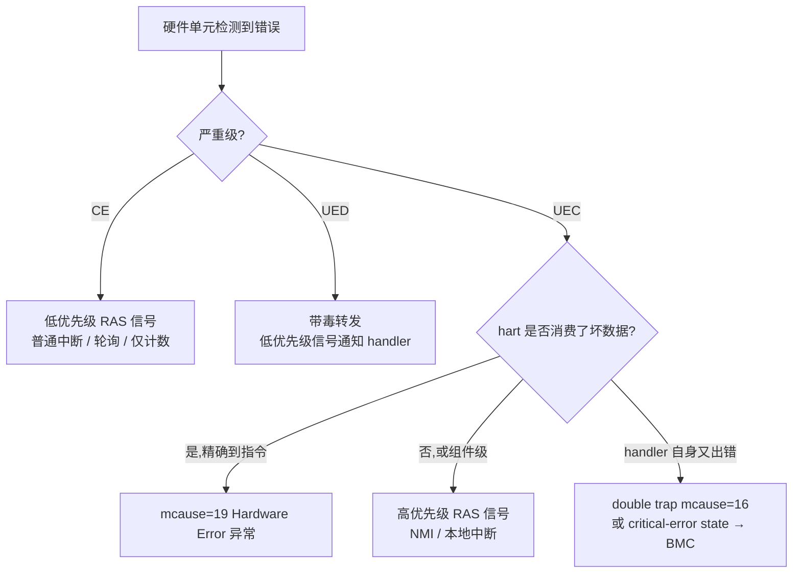
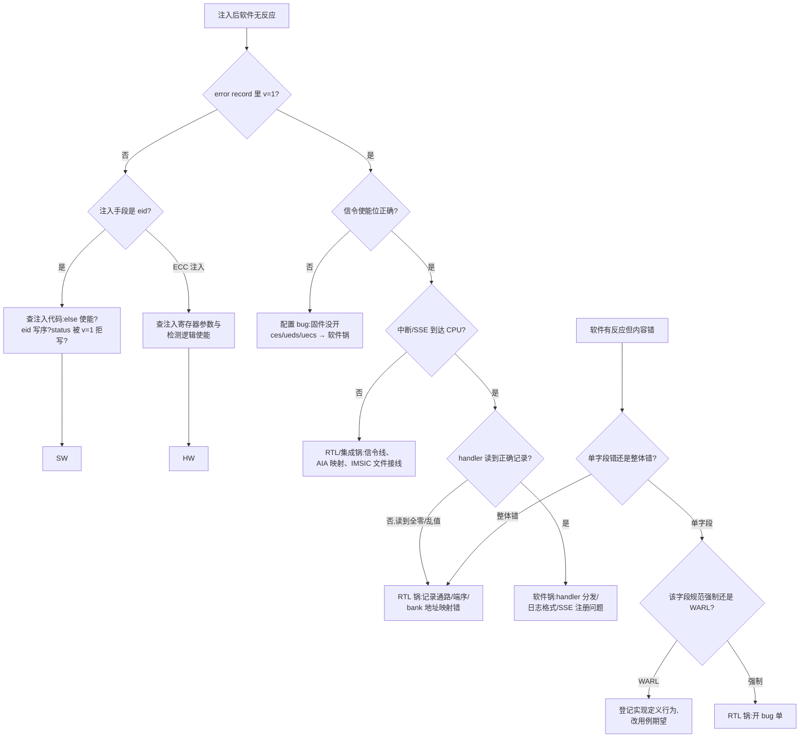

# RAS 错误处理:从 RERI 寄存器到硅前错误注入

> 面向 RV 核 IP 的硅前软件验证工程师:中断、页表这些子系统的"正确行为"是确定的,RAS 却不一样——错误什么时候发生、发生在哪一级、软件该恢复还是重启,全都是平台选择。本篇沿一条主线写:**规范要求什么(RERI + Server SoC 条款)→ hart 架构侧的三个接收钩子 → 错误记录寄存器长什么样 → 软件栈各层现状 → 硅前怎么注入和验证**。读完你应该能拿出一套可以直接在 Palladium/FPGA 上跑的错误注入用例矩阵,并且知道每个判定点的规范出处。

| 前置阅读 | 为什么需要 |
|----------|-----------|
| [特权模式与 CSR](./03-privileged-modes-and-csr.md) | trap 进入/退出语义、mcause/mtval/mepc 三元组——硬件错误异常与 NMI 的载体 |
| [中断与异常](./04-interrupts-and-exceptions.md) | trap 分发骨架、外部中断路径——RAS 信号最终也要变成 trap 才能被软件看到 |
| [硅前验证环境](./20-presilicon-validation-environment.md) | 三平台选型与降级链,本篇 §5 的用例执行环境 |
| [中断验证](./24-interrupt-validation.md) | 用例矩阵与分锅决策树的写作方法——本篇沿用同一套框架 |

引用约定:RERI 规范指 RISC-V RERI Architecture Specification v1.0(2024-05-24 批准,本地副本 `reference/riscv-reri.pdf`,章节号按该 PDF 的 Chapter 1/2 编排);Server SoC 规范指 RISC-V Server SoC Specification v1.0(2025-02-21 批准,本地副本 `reference/riscv-server-soc.pdf`);特权规范指 RISC-V Privileged Architecture 20211203(本地副本 `reference/riscv-privileged-20211203.pdf`)。Hardware Error 异常与 double trap 不在 20211203 里,涉及处单独标注来源。OpenSBI 源码引用本地克隆 `src/opensbi/`(commit `e79fd7` 附近)。

## 1. 为什么服务器级核必须有 RAS

先对齐术语,因为 RAS 领域的词在 ARM 世界和 RISC-V 世界里长得像但含义有差。RERI 规范 §1.1 给了一条链:**fault**(故障,组件状态出错)→ **error**(fault 被计算过程激活并产生错误)→ **service failure**(服务偏离规格)。检测到但被硬件纠正掉的错误叫 **CE(Corrected Error)**;纠正不了但可以带毒(poison)继续传播、推迟到真正被消费时再处理的叫 **UED(Uncorrected Error Deferred)**;既无法纠正也无法推迟、必须立刻召唤 RAS handler 的叫 **UEC(Uncorrected Error Critical)**(§1.3)。还有一个更阴险的分类:**SDE(Silent Data Error)**——错误没被检测到也没导致可观察的服务失败,只是悄悄算错了,比如加密电路悄悄产出解不开的密文(§1.2)。RERI 明说 SDE 的代价高于一切可报告错误,而对抗 SDE 的唯一手段是铺检测点——这正是"为什么核 IP 的每个大 RAM 都要挂 ECC"的第一性解释。

为什么硅前是抓 RAS 问题最后的便宜窗口?因为 RAS 的 bug 有两个讨厌的特点:其一,**触发条件稀有**——真实宇宙射线翻转率在验证环境里约等于零,DV 的随机激励也几乎不会自然撞出多错误竞争;其二,**后果滞后**——检测/记录/信令的 bug 在功能测试里完全隐形,只有错误真的发生时才暴露,而那时芯片已经在客户机房里了。所以 RAS 验证的本质是"用可控注入把稀有事件变成日常事件",本篇 §5 的所有工程手段都围绕这一句话。

边界也划清楚:ECC 编码选择、检错逻辑设计、故障仿真(fault injection at netlist)是 IC 设计与 DV 的领域,本篇不碰;硅后系统上的 RAS 运维(BMC 策略、内存页摘除调优)也不在范围。本篇管的是中间那段:**从"错误已被硬件检测到"到"软件日志里出现一条正确的记录、并做出正确的处置"之间的一切**,以及怎么在流片前验证它。

错误分类学一张表收拢:

| 类别 | 全称 | 硬件行为 | 软件需要做什么 |
|------|------|----------|----------------|
| CE | Corrected Error | ECC 纠正,数据已修好(可能顺带 scrub) | 记账、计数、预测(§1.4:CE 是未来 UE 的前兆指标) |
| UED | Uncorrected Error Deferred | 数据带 poison 继续流动,等消费方触发 | 通常只记录;消费时才升级为 UEC |
| UEC | Uncorrected Error Critical | 无法推迟,立即发信号召唤 handler | 立即恢复:杀进程、隔离、乃至重启 |
| SDE | Silent Data Error | 无任何报告 | (测不到)靠加检测点压概率 |

> **如何读这张表**:第二列缩写在后文寄存器位域里反复出现(status_i 的 ce/ued/uec 位),先记牢;最后一列决定了验证用例的期望行为——CE 用例断言"计数器+1 且系统继续跑",UEC 用例断言"handler 收到且现场信息够定位",两类用例的判定完全不同。

再看规范压力从哪来。Server SoC 规范 §2.5 一口气立了八条条款(RAS_010–RAS_080),对核 IP 供应商最有分量的几条:

- **RAS_010**:SoC 的 RAS 等级 UNSPECIFIED,但强烈建议对大 cache 和 memory 实现检错纠错码(ECC)、DRAM 控制器 single-symbol correction、周期性 patrol scrubbing。
- **RAS_020**:SoC **SHOULD** 支持毒数据的生成、存储与转发(data poisoning)。
- **RAS_040**:SoC **SHOULD** 支持 RERI 做错误记录与信令。
- **RAS_050/RAS_080**:实现了 RERI 就 **MUST** 每条错误记录支持按严重级(UEC/UED/CE)独立使能信令,**MUST** 带 CE 计数器且支持计数溢出信令。
- **RAS_060**:错误记录内容 **MUST** 跨 RAS-initiated reset 保留——组件 jam 死之后复位重启,上一轮 boot 的错误还得能捞出来分析。

注意强度分级:RERI 本身是 SHOULD,但一旦实现,RAS_050/060/080 变成 MUST——你的核 IP 只要宣称 server-ready 并集成了错误记录,CE 计数器、分级别信令、跨复位保留就不是可选项。这就是"RAS 是服务器级硬指标"的规范原文形态:不是一句口号,是一张 MUST 清单。

### 1.1 为什么 CE 计数是硬指标而不是锦上添花

Server SoC 规范用 FIT(failure-in-time)和 DPM(defects-per-million)度量可靠性目标(RAS_010 注释),而达成目标的手段里最容易被软件工程师低估的是**错误预测**:RERI §1.4 引用的多项现场研究表明,DRAM 在出现可纠正错误之后发生不可纠正错误的概率显著升高,生产系统据此做页面摘除(page offlining)和 DIMM 预防性更换。这条预测链的输入不是别的,正是每条 error record 里那个 cec 计数器和 ceco 溢出位——RAS_080 把"支持纠错的组件 MUST 带 CE 计数器且 MUST 支持溢出信令"写成硬性条款,原因就在这里:**没有量化数据,就没有预测;没有预测,RAS 就退化成"出了事再重启"**。

对验证工程师的直接推论:CE 用例的判定核心是计数器的**数值行为**(加一、饱和、溢出、UEC/UED 不动它),而不只是"来了一个中断"。R08(§5.3)这类用例看似平淡,实际是在验一条贯穿硬件到运维工具的数据链。

### 1.2 SDE:为什么"测不到"也值得写进验证计划

RERI §1.2 对 Silent Data Error 的论述值得每个验证计划引用一次:SDE 的系统代价高于一切可报告错误(想想整个数据库被静默加密错),而它的对策只有一条——铺检测点,把"静默"变成"可报告"。落到核 IP 上就是:寄存器堆 ECC、TLB parity、datapath parity、bus parity……每一处检测点的存在都该有对应的 ec 编码(§2.7 Table 6 的 12/17 号就是给它们准备的)。软件验证虽然不直接测检测逻辑(DV 的活),但要验证**每个检测点都有出口**:注入路径上任何一种检测触发的错误,最终都能在某个 error record 里找到自己的 ec 编码。这是 §5.3 矩阵按 ec 类别采样而非按严重级采样的原因。

## 2. 架构侧钩子:hart 怎么收到一个硬件错误

错误发生在 cache 控制器或内存控制器里,hart 怎么知道?规范给了三条路径,理解它们的分工是设计验证矩阵的前提。

### 2.1 路径一:RAS 信号 → 中断或 NMI

RERI 的每条错误记录可以配置三种信令(§2.4.1 Table 3):低优先级 RAS 信号、高优先级 RAS 信号、平台自定义信号。物理形态规范故意不管(UNSPECIFIED),但 §2.4.1 的注释给出了典型映射:高优先级 RAS 信号可配置成 High-priority RAS local interrupt、外部中断或 **NMI**;低优先级的配成 Low-priority RAS local interrupt 或外部中断。也就是说,UEC 这类要命错误走 NMI 或专用本地中断,CE 走普通中断甚至纯轮询。

NMI 本身在特权规范里有明确定位(§3.5 相关段落):NMIs 只用于硬件错误条件,无视中断使能位直接跳到实现定义的 NMI 向量,mepc 记录被打断的指令;与复位不同,NMI 不清处理器状态,以便诊断、上报和围堵(containment)。

NMI 与 RAS 的分工里还有一个可选扩展值得知道:**Smrnmi**(resumable NMI)。普通 NMI 打断 handler 时现场可能被覆盖(它无视一切使能),Smrnmi 引入 mnepc/mncause/mnstatus 一组独立 CSR 和重入的 RNMI handler,让"错误处理程序自己被错误打断"也有现场可救——这正是 RAS 场景要 NMI 的原因,也是它与 double trap(§2.3)互补的地方:double trap 管"trap 处理中再 trap",RNMI 管"NMI 级的错误处理被更高优先级错误打断"。验证时若核实现了 Smrnmi,RNMI handler 内再触发错误的场景应同时对照两个扩展的语义。

OpenSBI 对 RNMI 已有处理骨架:`sbi_trap_rnmi_handler` 优先调平台的 `rnmi_handler`,没有注册就当未处理 NMI 报错停机:

```c src="./src/opensbi/lib/sbi/sbi_trap.c" lines="395-416" anchor="rnmi-handler"
```

### 2.2 路径二:Hardware Error 异常(mcause = 19)

这是最精确的一条路:hart 自己消费了带毒数据,同步地、精确地在出错的指令上陷入。RERI §2.4.2 描述了它:某些 UEC 会引发 Hardware Error exception,xepc 指向试图访问坏数据的指令,xtval 要么为 0、要么是该取指/load/store 的虚拟地址;c(containable)位置 1 表示错误没传出检测组件,中断的上下文理论上可重启。

但要划一条版本红线:**本地的特权规范 20211203 副本没有这个异常**。它的 mcause 异常码表(Table 3.6,§3.1.15)里 16–23 整段是 Reserved。mcause=19(Hardware Error,"corrupt/poisoned data")是随 Privileged ISA 1.13(2024 年批准的后续修订)引入的,配套还有 mcause=18(integrity check fault)。给验证用例定判定标准时必须注明依据版本:对 1.12 基线的 RTL,断言"trap 发生且 mepc/xtval 正确"只能依赖集成手册的自定义异常编码;mcause=19 是 1.13 目标行为的判定项。

mtval 的语义顺带核对过(20211203 §3.1.16):mtval 在 trap 进 M-mode 时置零或写异常特定信息,平台规定哪些异常必须写;"For other traps, mtval is set to zero, but a future standard may redefine mtval's setting for other traps"——Hardware Error 的 xtval 语义正是这句"future standard"兑现的产物。用例里判 mtval 时同样要分版本。

三条路径放在一起对比,差异一目了然:

| 对比项 | RAS 信号→中断/NMI | Hardware Error 异常 | double trap / critical-error |
|--------|-------------------|---------------------|------------------------------|
| 触发点 | 任意组件的记录/信令 | hart 消费坏数据的那条指令 | handler 自身再出错 |
| 精确度 | 组件级(哪条记录) | 指令级(xepc/xtval) | 只知道"处理层崩了" |
| 异步性 | 异步,随时可到 | 同步、精确、可复现 | 同步 |
| 规范依据 | RERI §2.4.1 + AIA §5.1 + 平台集成 | Priv 1.13 + RERI §2.4.2 | Double Trap Ext v1.0 |
| 软件接收方 | 中断/SSE handler | 进程上下文的同步异常路径 | M-mode 兜底 / BMC |

这张表同时是矩阵"接收方"维度的依据:同一注入签名可以设计成走不同路径的变体(比如 §5.2 的 S4 签名既测信令路径也测消费异常路径),路径覆盖不足是 RAS 验证最常见的空洞。

### 2.3 路径三:double trap 与 critical-error 状态

RAS handler 自己也是代码,也会踩到坏数据。Double Trap Extensions v1.0(2024-08-23 批准,**本地无此文档**,以下依据其公开版本描述;24 篇 §2.6 已用过同一约定)引入 Smdbltrp:mstatus.MDT 置位期间再 trap 即 double trap,mcause=16(M-mode 下);若错误严重到连 double trap 都进不去,hart 进入 **critical-error state**——停止提交指令并向平台断言 critical-error 信号,交给系统恢复控制器(比如 BMC)做 RAS 复位。这对应 RERI §1.3 末尾说的场景:组件 jam 死后调 handler 已无意义,因为 handler 自己也要经过它请求服务。

critical-error state 还有一个对验证友好的细节(同样出自 Double Trap Extensions 与 Debug 规范的衔接):hart 停在该状态时仍可被调试器 halt,扩展允许配置成"进 critical error 时改入 Debug Mode 而不是只向平台断信号"。硅前的实际意义:**R11 这类把 hart 逼进不可恢复状态的用例,JTAG halt 是你唯一的观测窗口**——bring-up 阶段就确认验证 SoC 的调试链路在这种状态下还活着,别等到跑长回归才发现"停了但连不上"。

三条路径合起来就是一幅完整的分流图:



### 2.4 RAS 信号落到 AIA:本地中断 35 与 43

RERI 刻意不定义 RAS 信号的物理形态(§2.4.1),但 AIA 给了标准落点:AIA §5.1(Table 8/Table 9)分配 major interrupt **43 = 高优先级 RAS 事件中断**、**35 = 低优先级 RAS 事件中断**,且默认优先序里 43 排在最前——高于机器级外部/软件/定时器中断(11, 3, 7)。AIA 同时明说它不强制 RAS 事件必须走这两个中断(系统可以自由选择外部中断、NMI 等其他方式),这两个号只是给"想标准化"的系统预留的标准出口。

对验证的含义有三层:

1. **路由用例**:把 error record 的 uecs 配成"高优先级 RAS 信令"(§3.2 Table 3 编码 2),若平台把它接到 IMSIC 文件的 identity 43,则注入 UEC 后应收到 cause 43 的 supervisor 外部类中断(委托后 S-mode 直收)或 M-mode trap,按平台集成手册断言。24 篇 §2.2 的中断表里"35/43 通常无法软件激励"这一格,RERI 的 eid 正是那个缺失的软件激励源。
2. **优先级用例**:43 与普通 MEI(11)同时 pending 时,AIA 默认序 43 先行;这是少数能纯软件构造的"RAS 中断抢占业务中断"场景。
3. **委托语义**:35/43 属于 ≥16 的标准本地中断区间,mideleg/hideleg 相应位可委托(具体位号见 24 篇 §2.2 的表),S-mode handler 直收是服务器软件栈的典型形态——用例要覆盖 M 直收与委托后 S 直收两种接收方(§5.3 矩阵的"接收方"维度)。

还有一个容易被忽略的细节:AIA §5.1 注释提醒 Table 8 的默认优先序只对 trap 到**同一特权级**的多中断排序有效,RAS 用例里同时注入 43 和别的中断时,先确认两者确实 trap 到同一级,否则判定无意义。

## 3. RERI:错误记录寄存器的寄存器级导览

RERI 的模型很朴素:每个支持检错的组件(hart、cache、内存控制器……)可以实现一个或多个 **error bank**,每个 bank 挂最多 63 条 **error record**,每条记录对应一个或多个硬件单元(§2)。bank 是一段内存映射区,起始地址 8 字节对齐(实现可以用更粗的对齐,常见一 bank 一页,省掉译码加法器,§2 注释)。访问规则有三条值得记住:寄存器恒为小端(即使全系统大端,§2);非对齐、跨寄存器、非 4/8 字节宽度的访问行为 UNSPECIFIED,4 字节对齐访问必须单拷贝原子而 8 字节不保证(§2);页内未实现寄存器读零写忽略(§2)。

### 3.1 bank 布局与头部寄存器

布局(§2.1 Table 2):64 字节头部 + 每条记录 64 字节的记录数组,记录 i 在偏移 `64 + i*64`。最小合法实现只有一个 bank 一条记录,占 128 字节地址空间、只要 2 个真实存储位(v 和 rdip),其余字段全部 WARL 硬连线(§2.1 注释)——这对验证的意义是:**不能假设任何字段可写**,能力探测先行。

头部三个寄存器(§2.3):

| 寄存器 | 关键字段(位域) | 作用 |
|--------|------------------|------|
| `vendor_n_imp_id`(偏移 0) | vendor_id [31:0](mvendorid/JEDEC 编码)、imp_id [63:32] | 软件用它识别 UNSPECIFIED 字段的私有格式(§2.3.1 注释)——固件适配的第一步 |
| `bank_info`(偏移 8) | version [63:56](本规范=0x01,0xF0–0xFF custom)、layout [23:22] 取 0 为本规范布局、n_err_recs [21:16] 计数范围 1–63、inst_id [15:0] | 发现机制的核心:version/layout 字段的位置承诺永不变化(§2.3.2 注释),软件先读它决定后续解析方式 |
| `valid_summary`(偏移 16) | sv [0]、valid_bitmap [63:1] | sv=1 时一位对一条记录的 v 位;sv=0 只能逐条读 status_i 轮询(§2.3.3) |

发现流程值得固件直接照抄成代码骨架(依据 §2.3.2 的承诺与注释):

```c
/* RERI bank 发现:version/layout 位置跨版本不变是规范承诺,
 * 所以任何版本的 bank 都能安全走完这个探测 */
struct reri_bank probe_bank(uintptr_t base)
{
    uint64_t info = read64(base + OFF_BANK_INFO);
    uint8_t  ver  = info >> 56;
    uint8_t  lay  = (info >> 22) & 0x3;

    if (ver != 0x01 || lay != 0)
        /* 本规范之外的布局:交给 vendor_n_imp_id 对应的
         * 私有解析器(§2.3.1 注释的设计意图) */
        return vendor_parse(base, ver, lay);

    return (struct reri_bank){
        .n_recs = (info >> 16) & 0x3f,   /* n_err_recs[21:16], 1..63 */
        .inst   = (uint16_t)info,        /* inst_id[15:0],进错误日志 */
    };
}
```

两个工程提醒:其一,n_err_recs 读出值要在软件侧夹到 1–63(规范保证合法,但地址空间布局 bug 会让它读出垃圾);其二,inst_id 要原样进日志——它是硅后把同一批流片的失败实例关联起来的唯一线索(§2.3.2 注释),验证阶段的用例就应该把它打进输出。

还有一个规范刻意留白的问题:**软件从哪里知道 bank 在哪、每个 bank 属于谁?** RERI 定义了 bank 内部的布局与发现(version/layout),但没定义 bank 的枚举机制——系统里有哪些 bank、各自挂在哪个组件上,是平台集成的事。实践里两条路:设备树/ACPI 表声明(与 Linux 补丁系列的 HEST/GHES 建表对接),或固件按平台手册扫约定地址区。

> **待确认**:RERI 是否有后续的标准发现/枚举绑定(devicetree binding 或 ACPI 表格式),写作时未查到已批准的文档;硅前环境里通常由验证 SoC 的地址映射文档直接给出 bank 列表,用例框架把它做成配置输入而非硬编码。

### 3.2 control_i:控制面

control_i(§2.4.1 Figure 4)是记录的总开关盘,位域如下:

| 位域 | 位置 | 语义 |
|------|------|------|
| else | [0] | 错误记录与信令总使能;复位默认值 WARL,可为 0 可为 1(§2.4.1) |
| cece | [1] | CE 计数使能;置 1 后 cec 开始累加,**此时 CE 本身不再触发信令,只有 cec 溢出(ceco 0→1)才按 ces 配置信令**(§2.4.1)——事件模式转轮询模式的开关 |
| ces / ueds / uecs | [3:2] / [5:4] / [7:6] | CE/UED/UEC 各自的信令使能,编码同 Table 3:0=禁用、1=低优先级 RAS 信号、2=高优先级 RAS 信号、3=平台自定义;复位典型值 0,给 handler 留出自举时间窗(§2.4.1) |
| eid | [47:32] | 错误注入倒计时(§3.4 展开) |
| sinv / srdp | [48] / [49] | 写 1 生效、读恒 0:srdp 置起 status_i.rdip;sinv 在 rdip=1 时清除 v 位(§2.4.1) |
| custom | [63:60] | 私有用途 |

sinv/srdp 与 rdip 配合构成一套"原子读出"协议(§2.4.1 注释):读完记录 → 写 sinv 清 v → 重读 status_i。若 v 仍为 1 且 rdip=0,说明读取期间发生过覆盖(丢了一次错误的信息);若 v=1 且 rdip=1,说明清 v 之后来了新错误,而前一次读取是原子的。这个协议本身就是两条边界用例(§5.3 的 R07)。

### 3.3 status_i:状态面

status_i(§2.4.2 Figure 5)是信息量最大的寄存器,位域(自 LSB 起):

| 位域 | 位置 | 语义 |
|------|------|------|
| v | [0] | 记录有效。v=1 时软件写 status_i 被拒(§2.4.2) |
| ce / ued / uec | [1] / [2] / [3] | 当前记录的严重级,多位置 1 时以最高级为准;三位全 0 且 v=1 是合法的"informational update",按 ces 信令(§2.4.2) |
| pri | [5:4] | 同级错误的优先级 0–3,3 最高;决定同级覆盖(§2.4.2) |
| mo | [6] | 同级多重发生标志;**v=mo=uec=1 意味着有一条 UEC 被覆盖丢失,handler 应优先重启系统**(§2.5) |
| c | [7] | UEC 的 containable 位:错误未传出检测组件,上下文可能可恢复(§2.4.2) |
| tt | [10:8] | 事务类型(Table 5):4=显式读、5=显式写、6=隐式读、7=隐式写;注意取指字节本身算显式读,只有页表类数据结构访问算隐式(§2.4.2) |
| iv / siv / tsv | [11] / [16] / [17] | info_i / suppl_info_i / timestamp_i 内容有效标志,无效时对应寄存器值 UNSPECIFIED(§2.4.2) |
| ait | [15:12] | addr_info_i 类型(Table 4):1=SPA、2=GPA、3=VA、4–15=组件自定义 |
| scrub | [20] | CE 已回写修正值(scrub 完成)(§2.4.2) |
| ceco / rdip | [21] / [23] | cec 溢出标志 / 读进行中标志(§2.4.2) |
| ec | [31:24] | 错误码,标准编码见下(§2.7 Table 6) |
| cec | [63:48] | CE 计数器;cece=1 时每个 CE 加一,溢出置 ceco 后继续计数;UEC/UED 不动它(§2.4.2) |

ec 标准编码挑核 IP 相关的摘录(完整 0–27 见 §2.7 Table 6):2=消费带毒数据、3/4/5=cache 数据/cache scrub/cache tag、9/10=TLB 与 page-walk cache、12=hart 状态(CSR/寄存器堆 ECC)、13=中断控制器状态、17=内部 datapath/执行单元、20=内存数据 ECC、22–24=协议错误。最高位为 1 的编码留给 custom。

剩下四个信息寄存器(§2.4.3–§2.4.6)格式上几乎全部 UNSPECIFIED,但各自的**有效性由 status_i 的对应标志位背书**,这是软件解析的唯一锚点:

| 寄存器 | 有效条件 | 规范建议的用途(注释原文归纳) |
|--------|----------|-------------------------------|
| addr_info_i | ait≠0 | SPA/GPA/VA 或组件自定义地址(DRAM 地址等);标准地址应尽量捕获所有有效位 |
| info_i | iv=1 | 恢复指引、瞬态/永久属性、set/way、ECC syndrome、FSM 状态;内存控制器可记 DIMM channel/bank/row/rank/device ID |
| suppl_info_i | siv=1 | info_i 的补充(如预取/投机等事务附加属性) |
| timestamp_i | tsv=1 | 采样 mtime/cycles 等计数器,粒度与频率 UNSPECIFIED |

验证视角:这些寄存器的内容本身不可断言(UNSPECIFIED),可断言的是**一致性**——iv=1 时 info_i 不全零(弱断言,登记档)、ait=1 时 addr_info 等于注入的 SPA(硬断言)、tsv=0 时固件不得把 timestamp_i 打进日志(软件判定)。

### 3.4 eid:规范内置的错误注入通道

control_i.eid(§2.4.1)是 RERI 最贴心的设计,也是本篇 §5 的主角之一。写入大于 0 的值即启动倒数(速率实现定义),归零时把 status_i.v 置 1——等效于硬件报了一个错误,并按 status_i 里预置的严重级(ce/ued/uec 位)发出对应信令。写 0 关闭;不支持注入的记录 eid 硬连线 0。

规范特意加了一段免责声明(§2.4.1 注释):eid 注入的是**错误记录**,不是把错误打进硬件本身;它面向 RAS handler 测试,不用于 RTL 验证。真正的硬件故障注入(ECC 翻转之类)属于实现自定义机制,规范建议这类机制要有防滥用约束(安全问题)。这句话直接定义了硅前验证的两层分工:DV 用 backdoor 翻转测检测/纠正逻辑本身,软件验证用 eid 测整条上报链路——别拿错工具。

eid 注入与真实错误的行为差异清单,写用例前必须心里有数:

| 差异点 | eid 注入 | 真实硬件错误 |
|--------|----------|--------------|
| 数据本身 | 完好(没有真翻转) | 确实坏过(ECC 纠正或 poison) |
| 时序 | 倒计时确定到达 | 随机 |
| 与访问的关联 | 无(记录凭空出现) | tt/ait 反映真实事务 |
| scrub 行为 | 不存在(没有可回写的位置) | 可能真实发生 |
| 覆盖规则 | 照常适用(v 0→1 走同一套规则) | 同左 |

推论:eid 用例验"信令之后的软件世界",凡涉及**数据内容正确性**(poison 消费、scrub 回写、纠正后读到新值)的断言必须换 ECC 注入通道;反过来,ecc 注入用例里"信令与记录"部分的判定可以复用 eid 用例的检查代码——两层共享 §5.5 清单的第 1、2、4 条。

### 3.5 覆盖规则:谁顶掉谁

错误记录只有一条,新错误来了旧错误还没被读,怎么办?§2.5 Listing 1 给了确定性规则:高级别覆盖低级别(UEC > UED > CE > informational),同级看 pri;高级别覆盖时旧错误的严重级位保留(sticky,uec/ued/ce 按位或);空记录上新错误置 rdip=1,覆盖已有记录则清 rdip。两个推论直接变成用例判定:v/mo/uec 同时为 1 → 有 UEC 丢失,handler 应重启(§2.5 明文);cec/ceco 在 UEC/UED 写入时保持不变。

用一个具体序列走一遍规则(也是 R05 的判定推导),设记录初始为空:

| 步骤 | 到达的错误 | 记录终态(关键字段) | 依据 |
|------|-----------|---------------------|------|
| 1 | CE(pri=1) | v=1, ce=1, pri=1, rdip=1 | 空记录直接记入 |
| 2 | UEC(pri=0) | uec=1 ∧ ce=1(sticky),pri/c/ec 换新,rdip=0 | 高级覆盖 + sticky;mo 清 0 |
| 3 | 再来一个 UEC(pri=2) | mo=1,内容换为高 pri 版本 | 同级:先置 mo,pri 高者覆盖 |

第 2 步是 RTL 最容易做错的一处——把 sticky 做成了"整体替换"(丢掉 ce 位),或把 mo 忘了清零。第 3 步之后 handler 读到的是"UEC 且 mo=1",按 §2.5 应判重启。

### 3.6 复位语义与持久化

复位行为(§2.2)三句话值得单独一节:RERI 寄存器复位值 UNSPECIFIED(用例不得假设上电后全零);同一 bank 内所有寄存器必须同一种复位行为(不能出现 status 保住了、addr_info 却清了的半吊子实现);warm reset / RAS 复位可以保留记录而冷复位清空——规范注释点明了动机:**RAS handler 自己触发复位逃命时,错误信息就是下一轮 boot 的黑匣子**。这与 Server SoC RAS_060(MUST 跨 RAS-initiated reset 保留 status/address/info/suppl_info/timestamp,control 复位后 UNSPECIFIED)呼应,构成 §5.3 的 R12 用例。注意 RAS_060 特意把 control 排除在保留承诺之外——固件每轮 boot 都要重新配置信令使能,不能吃上一轮的遗产,这本身就是一条固件用例的判定点。

## 4. 平台与软件栈:谁来实现 handler

### 4.1 Server SoC 规范的平台要求

除了 §1 引过的条款,RAS_050 的注释还点明了软件策略:UEC 典型用事件模式(信令即中断),CE/UED 可以在事件与轮询之间自由选——RAS_050 要求按级别独立使能,正是为了这种灵活性。RAS_070 则明确:错误记录注入(MAY 支持)的目的就是 RAS handler 验证,并坦承"确定性诱发 SoC 中所有潜在错误是不现实的"——**规范作者自己承认:没有注入机制,RAS handler 就是不可验证的**——这是硅前验证工作正当性的官方背书。

还有两条毒数据条款直接关系到核 IP 的对外行为,值得核集成团队逐条对表:

- **RAS_020**(SHOULD):SoC 支持毒数据的生成、存储与转发。对核意味着:核是 poison 的**消费者**——收到带毒数据并试图使用时必须升级为 UEC(触发 Hardware Error 或高优先级信令),而不是悄悄用掉。注释还要求 poison 指示本身受检错纠错码保护(防止后续错误把"带毒"标记打掉导致静默消费)。
- **RAS_030**(MUST):向不支持 poison 处理的对端转发毒数据前,必须先转成 critical uncorrected error 报告——传播即破防,宁可报告也不外送裸的坏数据。

验证视角:这两条把"核在 poison 链路里的角色"变成可测行为——注入带 poison 的 linefill/取数(需要 ECC 注入通道配合 poison 路径),断言核侧产生 UEC 且记录里 ec=2(消费带毒数据)。没有 poison 能力的核要显式登记为能力缺口,让系统集成者按 RAS_030 在互连侧兜底。

### 4.2 固件职责与 OpenSBI 现状

M-mode 固件在 RAS 链路里的职责,排成 boot 时间轴更清楚:

1. **冷启动早期(M-mode 裸机段)**:遍历设备树/ACPI 里的 bank 基址,跑 §3.1 的发现流程;若发现 v=1 的残留记录(RAS 复位后的上一轮现场),先读出落日志再 sinv 清掉——顺序不能反。
2. **配置段**:逐记录写 control_i:else=1、按平台路由策略配 ces/ueds/uecs、cece 按运维需求决定。规范把信令使能复位默认值设计成 0(§2.4.1)就是为了让固件先完成这一步再开门收错误——**固件忘了配使能是"错误永远不上报"的头号软件原因**,§6 决策树的 CFG 分枝就是给它准备的。
3. **运行段**:注册高/低优先级 RAS 事件的 handler(SSE 或中断,视平台);CE 记账、UEC 走恢复决策树(杀任务→隔离→重启)。
4. **RAS 复位路径**:组件 jam 死时由 BMC/片上服务控制器发起复位(RERI §1.3 末尾的场景;Server SoC §2.7 manageability 也要求 BMC 能通过日志接口消费 RAS 错误记录),固件要保证复位前尽量把现场写进 error record——那是唯一承诺跨复位保留的地方。

UEC 的恢复决策值得单独说两句,因为它是 handler 里最容易写"歪"的部分。RERI §2.4.2 给了两个判定输入:c 位只说明错误**可能**可围堵("may or may not be able to recover"),handler 必须结合 addr_info 指向的受损位置做最终判断;§2.5 补充了硬规则——v/mo/uec 全 1 时应优先重启(有 UEC 已丢失)。合理的策略形态:containable 且能定位到进程地址空间 → 杀任务;containable 但位置在内核关键路径或无法定位 → 隔离 + 降级运行;非 containable 或记录丢失 → 有序重启,并把 error record 原样留给下一轮 boot(R12 闭环)。验证计划里这三条分支各要至少一条用例,判定的不是"重启没重启",而是**选择与输入一致**。

本地 OpenSBI 克隆 grep 的结论分两半。**没有的那一半**:全树搜不到 RERI/error record 的任何驱动或 SBI 调用扩展——SBI 侧尚无标准化的 RERI 访问扩展(截至本地克隆的 commit `e79fd7`;Linux RAS 补丁系列提到的"RAS agent in OpenSBI"来自厂商分支,不在主线,待确认)。**已有的那一半**:RAS 相关的事件通道已经就位——SBI SSE(Supervisor Software Events)扩展定义了四个 RAS 事件 ID 和 double-trap 事件:

```c src="./src/opensbi/include/sbi/sbi_ecall_interface.h" lines="407-411" anchor="sse-ras-events"
```

double trap 事件的处理逻辑已经接好:M-mode trap 分发里 CAUSE_DOUBLE_TRAP 落到 `sbi_double_trap_handler`:

```c src="./src/opensbi/lib/sbi/sbi_trap.c" lines="356-361" anchor="double-trap-dispatch"
```

而 handler 本体把来自 HS-mode 的 double trap 直接重定向回去,来自 S-mode 的则注入 SSE 的 LOCAL_DOUBLE_TRAP 事件交给 supervisor 软件消费:

```c src="./src/opensbi/lib/sbi/sbi_double_trap.c" lines="17-37" anchor="double-trap-handler"
```

这段代码透露了 RISC-V 阵营选择的软件架构:SSE 而非传统中断作为 RAS 事件投递通道——高优先级 RAS 事件(含 double trap)以最高优先级 SSE 事件送达内核注册的 handler。对硅前验证的含义:你的用例要么直接在 M-mode 裸机收 trap(最底层),要么跑 OpenSBI+内核验证 SSE 全链路。

### 4.3 Linux 侧:APEI/GHES 通道在路上

先补一段 ACPI 侧的名词底子,因为 Linux 的 RAS 报告几乎全部建立在这套词汇上,读内核日志或补丁说明都绕不开:

| 名词 | 是什么 | 在 RISC-V 方案里的角色 |
|------|--------|------------------------|
| firmware-first | 错误先由固件接手再转交 OS 的处理模型 | OpenSBI RAS agent 先消费 RERI 信令,整理后再通知内核 |
| HEST | ACPI 表,声明系统有哪些硬件错误源、各自的通知方式 | EDK2 构建;RISC-V 补丁新增"SSE 通知"类型 |
| GHES(Generic Hardware Error Source) | HEST 里的一类通用错误源条目,指向内存中的错误状态缓冲区 | 每个 error bank/来源映射为一个 ghes 条目 |
| CPER(Common Platform Error Record) | UEFI 定义的错误记录二进制格式(severity + section 类型) | 固件把 RERI 记录翻译成 CPER 塞进缓冲区 |
| APEI | ACPI Platform Error Interfaces 总纲,HEST/GHES 都归它管 | 内核侧 `drivers/acpi/apei/` |

Linux 内核成熟的 RAS 框架正是这条 APEI/GHES 链(firmware-first:固件先把错误记成 CPER 格式,再通过 HEST 表声明的通知类型投递内核,GHES 驱动解析打印并可联动 memory failure/EDAC)。RISC-V 的接入方式在邮件列表上已经清晰:Himanshu Chauhan(Ventana,后 Qualcomm)的系列补丁 "[Add RAS support for RISC-V architecture]"——RFC v1 于 2025-02,v2 于 2025-10,v3 于 2026-01 发出;方案是复用 GHES 框架,新增 HEST 的 SSE 通知类型,由 OpenSBI 的 RAS agent 生成 CPER 记录、EDK2 构建 HEST/GHES 表,内核经最高优先级 SSE 事件收到通知后走既有 ghes 解析路径;QEMU 侧有对应的 RERI 仿真(`-M virt,reri=true`),可用 devmem 直写 QEMU 仿真的 RERI 寄存器完成注入演示(该系列的用法说明里给了完整的 devmem 注入序列与 dmesg 输出样例)。

> **待确认**:该系列截至 v3(2026-01,LWN 存档)仍在评审中,是否已进入主线内核、落在哪个版本,写作时未能核实——引用时请查 lore.kernel.org 的最新状态。同理,RISC-V 专属 EDAC 驱动(类似 x86 的 amd64_edac)尚无主线实现,ghes_edac 能否覆盖 RISC-V 平台的 DIMM 信息亦待确认。

对硅前的现实结论:**今天在 Palladium/FPGA 上验证 RAS,内核侧大概率还没有现成栈可跑**,主战场是裸机/M-mode 用例 + 固件 handler;想验 SSE→GHES→dmesg 全链路,得自备 QEMU RERI 补丁分支 + EDK2 + 补丁版内核的组合(QEMU 上先打通,再移植到 emulation,思路同 24 篇 §7.1 的 QEMU 基线法)。该补丁系列的使用说明给过一条可照抄的 QEMU 命令骨架,要点摘录如下(细节以补丁系列的最新版本为准):

```text
qemu-system-riscv64 \
    -M virt,rpmi=true,reri=true,aia=aplic-imsic \
    -bios <opensbi>/build/platform/generic/firmware/fw_dynamic.bin \
    -blockdev ... pflash0=<edk2>/RISCV_VIRT_CODE.fd \
    -kernel <linux> -initrd <rootfs>
# 注入:宿主机 devmem 直写 QEMU 仿真的 RERI 寄存器
devmem 0x4010040 32 0x2a1     # 预置记录内容
devmem 0x4010048 32 0x9001404
devmem 0x4010044 8  1         # 触发
```

注意这套组合里注入地址是 QEMU 仿真的 RERI 实现定义的,与你的 DUT 地址映射无关——QEMU 只用来调软件栈,不当地址参考。

## 5. 硅前验证视角:注入、矩阵、判定

这是本篇的重头。RAS 验证的根本困难在于:真实错误是稀疏、随机、难复现的,而你要验证的恰恰是"错误发生之后一切都对"。所以一切围绕**可控注入**展开。

### 5.1 注入手段分层

| 手段 | 注入点 | 能测什么 | 测不了什么 | 适用平台 |
|------|--------|----------|-----------|----------|
| RERI eid 记录注入 | error record 本身(v 0→1 + 信令) | handler、信令路由、SSE/中断链、日志格式 | 检测/纠正逻辑、poison 传播 | 全部,QEMU 也能 |
| 集成 ECC 注入寄存器(实现自定义) | ECC 校验逻辑前端(翻转 syndrome/data bit) | 检测→纠正→记录→信令全链、scrub 行为 | (几乎全覆盖,但依赖 DV/集成团队提供) | RTL 仿真/emulation |
| DV backdoor force | 任意内部信号 | (DV 的领域) | —— | RTL 仿真 |
| 总线错误响应 | interconnect error response | load/store access-fault 路径(04/24 篇覆盖) | 非 bus 型错误 | 全部 |

第一行与第二行的分工就是 eid 注释(§2.4.1)的落地:eid 测"软件世界对错误的反应",ECC 注入测"硬件世界的反应",两层在"记录+信令"处交汇。向集成团队提需求时要明确:ECC 注入寄存器必须是 MMIO 可编程的(地址、翻转位宽、目标 way/set 参数化),否则 CE/UED 全链用例只能手工波形,基本等于不跑——同 24 篇 §7.2 对测试中断源的论证。

RERI eid 注入的标准序列(RERI §2.4.1,伪代码):

```c
/* eid 注入:构造一条 UEC 记录并触发高优先级信令
 * 位域见 §3.2/§3.3;rec 为该 error record 的基址(control_i 偏移 0) */
void inject_uec(uintptr_t rec)
{
    uint64_t ctrl;

    /* 1. 确认记录空闲:v=0 才能写 status_i(§2.4.2);
     *    不空闲则先 srdp+读出+sinv 走一遍合法的读清流程 */
    if (read_status(rec).v)
        drain_record(rec);

    /* 2. 预置 status 内容:ait=SPA(1),uec=1,ec=消费带毒数据(2)。
     *    v 保持 0——v 由硬件在注入时置起 */
    write_status(rec, ST_AIT_SPA | ST_UEC | ((uint64_t)EC_POISONED_ACCESS << 24));

    /* 3. 预置地址与补充信息(ait 非 0 时 addr_info 有意义) */
    write64(rec + OFF_ADDR_INFO, BAD_SPA);

    /* 4. 组合 control:else=1、uecs=高优先级(2)、eid=100。
     *    注意 eid[47:32] 与 uecs[7:6]/else[0] 同寄存器,一次写齐;
     *    若实现把 eid 归零视为"不支持注入",此用例 SKIP(R14 先探测) */
    ctrl = CTRL_ELSE | CTRL_UECS_HIGH | ((uint64_t)100 << 32);
    write32(rec + OFF_CONTROL + 0, (uint32_t)ctrl);        /* 低半段 */
    write32(rec + OFF_CONTROL + 4, (uint32_t)(ctrl >> 32)); /* 高半段含 eid */

    /* 5. eid 以实现定义速率倒数至 0 → status.v 0→1 → 按 uecs 信令。
     *    用例侧等待信令到达后走 §5.5 的判定清单 */
}
```

细节坑:RERI 寄存器 64 位但 8 字节访问不保证单拷贝原子(§2),规范允许软件按两次 4 字节访问拆分、但要求两次之间尊重副作用语义——control_i 的副作用字段(srdp/sinv/eid)集中在高半段,先写低半段再写高半段可让使能与倒计时同拍生效;status_i 在 v=1 时拒绝软件写(§2.4.2),所以注入序列永远是"先填 status 后动 control"。

### 5.2 注入数据集:错误签名从哪来

注入不只是"来一个错",而是**带参数的错**。签名(severity × ec × pri × tt × c)选得有没有代表性,决定矩阵的覆盖质量。给核 IP 验证计划的一套最小签名集:

| 签名 | status 组合 | 模拟的真实场景 | 主要考察 |
|------|-------------|----------------|----------|
| S1 | ce=1, ec=3, tt=4(显式读), scrub=1 | load 命中带单 bit 错的 cache 行,ECC 纠正并回写 | CE 记账、scrub 语义 |
| S2 | ce=1, ec=20, ait=1(SPA) | 内存控制器 patrol scrub 抓到可纠正错 | 地址上报、DIMM 定位信息 |
| S3 | ued=1, ec=14, tt=5(显式写) | interconnect 数据 ECC 失败,poison 转发 | UED 记账不升级 |
| S4 | uec=1, c=1, ec=2, tt=4, ait=3(VA) | hart 消费 poison 数据,Hardware Error | containable 恢复闭环(R02) |
| S5 | uec=1, c=0, ec=5 | cache tag parity 多 bit 错,无法归因数据 | 非 containable → 重启策略 |
| S6 | 全 0 严重级 + ec=24 | 协议超时的 informational 上报 | information 级不误判(R03) |

签名集与 ec 编码的对应关系要跟 DV 对齐:DV 关心的翻转位模式(backdoor 层)和软件关心的签名(记录层)之间是**实现的多对一映射**,这张映射表应该由 RTL 团队提供、双方共用——软件验证按表里的签名设计用例,DV 按同一张表反推激励,两边对不上号时先怀疑映射文档。

签名集之外还要配一组**负向/健壮性用例**,它们不需要任何注入通道,纯软件就能跑:对 status_i 在 v=1 时写新值(应被拒,§2.4.2);写 control_i 的 srdp/sinv 并读回(应恒 0);WPRI 字段写全 1 读回(保持、不 trap);未实现记录的偏移区读零写忽略;跨寄存器与非 4/8 字节访问(UNSPECIFIED 行为,登记即可但要知道实现选了哪种——总线错误还是静默忽略,固件得按实现的脾气来)。这组用例是 R14 探测的细化,产出直接进"实现定义行为登记表"。

### 5.3 用例矩阵

矩阵维度:错误类别(ec 代表性采样,§5.2 的签名集)× 严重级(CE/UED/UEC/informational)× 接收方(M-mode 裸机 trap / S-mode via SSE / 轮询)。接收方维度单独列出来的原因:同一条注入记录,走 M-mode 直收和走 SSE 送达内核是两条完全不同的软件路径(RERI 只管到"信令发出"为止,信令之后的世界规范不管),任何一环都可能断;而"轮询"作为第三个接收方常被忘记——RAS_050 注释明确说 CE/UED 可以纯轮询运营,这条路径没有用例覆盖的平台,量产时的运维脚本就是在裸奔。种子用例如下,R 组编号沿用 24 篇风格:

| 编号 | 注入 | 期望(判定点) | 判定档 |
|------|------|----------------|--------|
| R01 | eid 注入 CE(eid=小值) | 低优先级信令到达;status: v=1,ce=1,scrub 按实现;cec+1;系统继续跑 | 硬断言(RERI §2.4/2.5) |
| R02 | eid 注入 UEC | 高优先级信令(NMI/SSE)到达;handler 读到完整四元组(v/uec/ec/ait+addr_info) | 硬断言 |
| R03 | eid 注入 informational(ce/ued/uec 全 0) | 按 ces 信令到达且不被误判成 CE | 硬断言(§2.4.2) |
| R04 | 先注 CE 再注同级 CE | mo=1,cec=2,pri 高者覆盖低者 | 硬断言(Listing 1) |
| R05 | 先注 CE 再注 UEC | uec sticky 保留(uec∧ce 同时为 1),内容换新,rdip 清 0 | 硬断言(§2.5) |
| R06 | 连注两次 UEC | v=mo=uec=1:handler 判定须走重启策略 | 硬断言(§2.5 明文) |
| R07 | 读中覆盖:srdp→读→sinv→重读 | 按 §2.4.1 原子读协议区分三种结局 | 硬断言 |
| R08 | cec 溢出:cece=1 小计数器(若可写)或长跑 | ceco 0→1 时按 ces 信令;ceco 保持直到软件清 | 硬断言(RAS_080) |
| R09 | else=0 期间真实/ECC 注入错误 | 不产生新记录不清旧信令;重新 else=1 后恢复 | 手册档(§2.4.1 行为实现定义部分登记) |
| R10 | UED 注入 + 消费路径(若核实现 Hardware Error) | 消费带毒数据时 mcause=19、xepc/xtval 精确 | 版本档(Priv 1.13;1.12 基线 SKIP) |
| R11 | handler 内二次错误(Smdbltrp 实现) | mcause=16 double trap → OpenSBI SSE DOUBLE_TRAP 事件 | 扩展档(24 篇 §2.6 同源) |
| R12 | RAS 复位持久化:注错→触发 RAS 复位→重 boot | 下一轮 boot 读回同一记录(RAS_060) | 硬断言(Server SoC) |
| R13 | valid_summary 轮询 vs bitmap 两模式 | sv=0 时逐条轮询仍能发现全部注入 | 硬断言(§2.3.3) |
| R14 | 未实现字段探测:全 bank 读零扫描 | 未实现寄存器读 0 写忽略;WARL 字段写 1 读回合法值 | 登记档(§2/§2.1) |

> **如何读这张表**:判定档四类的含义同 24 篇——硬断言失败即开 bug 单;版本档按 RTL 实际基线决定跑或 SKIP;手册档失败先查集成手册;登记档输出进"实现定义行为登记表"。R10/R11 两条横跨架构钩子(§2),它们失败时的第一嫌疑人是**核的集成参数**而不是 RERI 单元。

规模感:全套约 35–45 条(每条种子展开正常/边界/异常变体),其中 eid 系(R01–R09、R12–R14)在 QEMU RERI 分支上即可开发调试,ECC 系和 R10/R11 必须上 RTL 仿真/emulation。

### 5.4 三类代表用例的完整展开

矩阵里每格都有共性,挑三条最不像的展开成"可以直接照着写"的程度,覆盖 CE/UEC/poison 三种完全不同的软件行为预期。

**R01 变体:CE 全链(轮询模式)**。配置:cece=1,ces 编码 0(禁用信令)——纯轮询,这是 RAS_050 注释说的第二种软件策略。步骤:ECC 注入单 bit 翻转(或 eid 注入 CE)→ 轮询 valid_summary/status_i.v → 断言 cec 增量恰为注入次数、scrub 位符合实现承诺、系统业务流零感知。这条用例的隐藏价值是**测轮询周期与记录容量的赛跑**:连续注入 n_err_recs 条以上 CE(不同 ec),断言要么全部留痕(mo=1 计数)、要么按覆盖规则有据可查——不能凭空消失。若平台开了信令,还要验证"cece=1 时单个 CE 不再触发信令"(§3.2 的语义,RTL 常见漏点)。

**R02 变体:UEC containable 的恢复闭环**。这是最能体现"serviceability"的用例。场景:eid 注入一条 c=1 的 UEC(消费侧 poison 场景),S-mode 业务线程正在跑。期望链条:高优先级信令(NMI/SSE cause 43)→ handler 读记录确认 containable → 杀掉受影响的任务(而非重启)→ 记录 sinv 清除 → 业务其余部分继续 → 日志里出现带 SPA 和 ec=2 的完整错误条目。判定点除了 §5.5 清单外多两条:受影响任务确实被终止(不能假装没事继续跑脏数据);handler 自身执行期间不再触发二次错误(R11 的前置检查)。c=0 的对照组用例同样要跑——containable 判定位读错会导致该重启的不重启,危害更大。

**R12:跨 RAS 复位持久化**。唯一需要环境配合的用例(§5.6 的接口需求是它的前置)。序列:注入并确认 v=1 → 通过调试口/平台接口触发 RAS-initiated reset(不是冷复位!)→ 重 boot 后固件在发现阶段读出同一条记录 → 比对 status/addr_info/info/suppl_info/timestamp 五个寄存器逐位相等(control 允许 UNSPECIFIED,RAS_060 明文)。这条用例同时验硬件(保持逻辑、复位树区分 warm/cold)和固件(发现顺序:先读后清)。常见翻车:验证 SoC 的复位树没把 RAS 复位和冷复位分开,导致用例根本构造不出来——那是环境的锅,找集成团队补复位控制接口,别删用例。

### 5.5 判定点清单与"注入后软件行为"检查

每个用例的判定不止"trap 来没来",完整清单按时间轴:

1. **信令到达性**:注入后 T 时间内(超时阈值按 eid 速率 × 安全系数)收到预期通道的事件;同时断言**非预期通道无事件**——ces 配低优先级却打到 NMI 是典型的 RTL 接线 bug。
2. **记录完整性**:handler 读出的 {v, ce/ued/uec, ec, ait, addr_info, tt} 与注入值逐字段相等;ait=SPA 时 addr_info 必须等于注入的物理地址——这条抓的是记录通路上的位宽截断。
3. **软件响应正确性**(分层):
   - M-mode 裸机:handler 完成记录 dump 后 mret,系统继续;
   - CE:计数增长可见(cec 或固件日志),无进程受影响;
   - UEC containable(c=1):handler 杀掉受影响任务后继续;
   - UEC 非 containable / v∧mo∧uec:走有序重启,重启后错误日志留存可查(R12);
   - UED:仅记账,等待消费升级。
4. **副作用守恒**:UEC/UED 后 cec/ceco 不变(§2.5);sinv 清 v 后 cec 保留(§2.4.2 注释)——这两条专抓"handler 图省事整寄存器写 0"的软件 bug,以及把 cec 一起清掉的 RTL。
5. **日志闭环**:固件/内核输出的错误日志(CPER 或私有格式)中的 component id(inst_id)、severity、address 与注入参数一致——这是 serviceability 的验收,也是量产 RAS 工具链的输入格式。

五个判定点对应的检查手段(都要求能在无人工干预的回归里自动执行):

| 判定点 | 检查手段 | 自动化依赖 |
|--------|----------|-----------|
| 信令到达性 | 期望流水 diff + 信令观测口 MMIO 轮询 | 观测口(§5.6) |
| 记录完整性 | handler 快照与注入签名逐字段比对 | 无,纯软件 |
| 软件响应 | 处置动作回执(kill 的进程号/reboot 原因码)进日志 | 固件埋点约定 |
| 副作用守恒 | 用例前后 cec/ceco 快照对比 | 无 |
| 日志闭环 | 解析 dmesg/固件日志,与注入参数正则匹配 | 日志格式稳定 |

"注入后软件行为"的可观测检查方法:用例框架维护一张期望事件流水(inject → signal → read → clear),handler 每步追加实际流水,用例结束逐行 diff——形式与 24 篇 §7.1 的日志 diff 相同:

```text
CASE=R05 NAME=ce_overwritten_by_uec RESULT=PASS sig=hpreread v=1 uec=1 ce=1 mo=0 rdip=0
CASE=R06 NAME=uec_lost RESULT=PASS action=restart v=1 mo=1 uec=1
CASE=R08 NAME=cec_overflow RESULT=FAIL ceco=0 expected=1 sig_count=0
CASE=R10 NAME=hw_error_exc RESULT=SKIP reason=priv_1.12_baseline
```

R08 这种失败日志的价值在于它同时排除了三个方向:信令没来(sig_count=0 指向信令路由)、ceco 没置(指向计数器 RTL)、软件没读到(指向发现机制)——配合 §6 决策树快速收敛。

### 5.6 平台分配与环境接口需求

按环境篇 §1 的两问给 RAS 用例分平台:

| 用例组 | 平台 | 理由 |
|--------|------|------|
| R01–R07, R09, R13, R14(eid/寄存器语义) | QEMU RERI 分支 → RTL 仿真 | 短、确定、纯 MMIO 驱动;QEMU 上开发调试零机时成本 |
| ECC 注入全链(R01 变体、R08) | RTL 仿真为主,emulation 复跑 | 需要 backdoor/注入寄存器,RTL 仿真可见性最高 |
| R10/R11(架构钩子) | RTL 仿真 → emulation | 依赖核配置(Smdbltrp/Priv 1.13),先定向后系统级 |
| R12(复位持久化) | emulation/FPGA | 要真实复位树与多轮 boot,QEMU 的复位模型不够真 |
| CE 长跑计数 + 业务并发 | FPGA 天级回归 | cec 溢出、轮询周期与错误率的赛跑只有长时间尺度才暴露 |

FPGA 长跑组再补两句操作细节。其一,注入源要用**可编程错误率发生器**(周期性触发 eid 注入或 ECC 翻转的自动化脚本),而不是一次性手工注入——长跑验的是稳态行为,不是单次事件;其二,长跑日志必须带单调时间戳与 hart/组件标识,否则"第 37 万秒那次溢出丢失"无法与其他事件关联——timestamp_i(若实现)正好派上用场,这本身也是对它的实测。其三,FPGA 上偶发 FAIL 的第一反应不是复现,是按 §6 决策树走确定性分支(§6 结尾的分锅实例就是教训)。

向环境设计期要的三个接口(同 24 篇 §7.2 的论证方式):可编程 ECC 注入寄存器(MMIO,参数化目标结构)、RAS-initiated reset 触发寄存器(区分于冷复位)、信令观测口(把高/低优先级 RAS 信号镜像到可读的 MMIO 位,让用例在不进 handler 时也能断言信号电平)。第三个最容易被漏——没有它,"信令使能配错级别"这类 bug 只能靠 handler 收没收到间接推断。

### 5.7 用例骨架:handler 与事件流水

M-mode 裸机路径的 handler 骨架,采样纪律与 24 篇 §2.7 相同——判定数据在任何可能再 trap 的指令之前取走,RAS 场景还要多采一份 error record 快照:

```c
/* RAS handler 骨架:采样 → 记流水 → 分级处置 → 清记录 */
void ras_trap_handler(const struct trap_frame *tf)
{
    struct event_log ev = {
        .mcause = tf->cause, .mtval = tf->tval, .mepc = tf->epc,
    };

    /* 1. 就近扫描 bank:sv=1 走 bitmap,否则逐记录(§3.1)。
     *    多 bank 平台按固件注册的基址表遍历 */
    for_each_record(&g_banks, rec) {
        if (!rec->status.v)
            continue;
        ev.sev   = severity_of(rec);      /* ce/ued/uec 最高位 */
        ev.ec    = rec->status.ec;
        ev.addr  = (rec->status.ait == AIT_SPA) ? rec->addr_info : 0;
        snapshot(rec, &ev.rec_copy);       /* 整记录快照,先于一切处置 */
    }

    log_event(&ev);                        /* 追加进期望流水(§5.5 diff 用) */

    /* 2. 分级处置:与 §5.5 清单第 3 条一一对应 */
    switch (ev.sev) {
    case SEV_INFO:
    case SEV_CE:    accounting_only(&ev);        break;
    case SEV_UED:   accounting_only(&ev);        break;  /* 等消费升级 */
    case SEV_UEC:   if (ev.containable) kill_task(&ev);
                    else                 order_restart(&ev);
                    break;
    }

    /* 3. 处置完成后统一清 v(sinv),cec/ceco 保留 */
    for_each_touched_record(&ev, rec)
        setbits32(rec->ctrl_lo + 4, SINV_BIT);   /* control_i[48] */

    advance_mepc(tf);                            /* Hardware Error 类按需跳过 */
}
```

三条骨架纪律,每条都有前车之鉴:快照必须在处置之前(R06 场景里,你处置期间新 UEC 会覆盖现场);清 v 一律用 sinv 而不是整寄存器写 status_i(§2.4.2 注释:整写会把要保留的 cec/ceco 一起冲掉);handler 内禁止再分配栈深不可控的操作——它自己就是 double trap 用例(R11)的靶子。SSE 路径的消费端结构与此同构,差别只在事件由 SSE 框架派发、且运行在 S-mode:验证时把这份骨架挂到 OpenSBI+内核栈上,就是"同一套判定逻辑、两个接收方"的复用。

### 5.8 覆盖率口径与回归组织

RAS 域的功能覆盖率建议按四个正交维度建 bin,评审覆盖空洞时逐格数(方法同 24 篇 §1 的功能点清单):

1. **签名维度**:§5.2 签名集 × {单发, 同级重复, 高级覆盖} 三种到达模式;
2. **路径维度**:三条接收路径(信令中断/NMI、Hardware Error 异常、轮询)× 各特权级接收方;
3. **时序维度**:注入与{handler 执行中, 记录读取中(sinv 协议), 复位边界}的交叠;
4. **状态维度**:记录的空/有效/溢出三态迁移,含 ceco 与 mo 的组合。

回归分层:R14 探测 + 负向用例最先跑(它们同时是环境自检——RERI 寄存器访问不通的话后面全白跑);eid 语义组随后;ECC 全链和架构钩子组需要环境支持,排 RTL 仿真/emulation 队列;长跑组只在夜间/周末窗口跑。每组用 SKIP 原因显式声明依赖(eid 硬连线 0 / 无 Smdbltrp / 无 ECC 注入通道),SKIP 统计单独汇报——RAS 用例的特性依赖比中断还重,不把 SKIP 管起来,覆盖率数字会虚高。

## 6. 失败分锅:错误没上报/报错了,怪谁

RAS 链路比中断链路更长(检测→纠正→记录→信令→路由→handler→日志),每一环都可能吞掉错误。决策树按"现象"入枝:



经验权重供参考:硅前期"没反应"的大头是配置与注入代码自身(软件锅),中期转向信令路由与记录通路(RTL 锅),末期回归里最多的是 WARL 期望漂移(文档锅)。每次分锅结论都回填进 §5.3 表格的判定档列,让下一轮回归自动按正确的档位判。

常见失败现象到根因方向的速查表(把决策树的叶子展开成日志可匹配的形态):

| 现象(日志特征) | 第一嫌疑 | 次嫌疑 | 快速甄别动作 |
|------------------|----------|--------|--------------|
| v=0 且信令无,注入代码返回正常 | 注入写序错(v=1 时 status 被拒) | eid 硬连线 0(不支持注入) | 读回 control.eid 是否为 0(R14 探测) |
| v=1 但任何信令通道都没动静 | ces/ueds/uecs 配置遗漏 | 信令线未连/AIA 映射错 | 读回 control 使能位;查信令观测口电平 |
| 中断到了但 cause 不是 35/43 | 平台把 RAS 信号接到外部中断/NMI | RTL 映射 bug | 对照集成手册的路由表;NMI 场景查 mncause |
| handler 读到全零记录 | bank 基址映射错(打到空洞页) | 端序处理错(大端 hart 忘 REV8) | 用 vendor_n_imp_id 当金丝雀:读它对不对得上手册 |
| 记录内容部分字段错 | sticky/mo 覆盖规则 RTL 实现 | 用例期望没考虑并发错误 | 按 §3.5 的表手工推演该序列 |
| cec 数值跳变/清零 | handler 整寄存器写 status_i | RTL 把 UEC 也计了数 | 检查软件是否用了 sinv(§2.4.2 注释的正确姿势) |
| 复位后记录丢失 | 复位树没区分 warm/cold | 固件先清后读(顺序反了) | JTAG 在复位前后各 dump 一次记录 |

这张表的用法同 24 篇 §7.5 的差异登记表:每次分锅后把新形态追加进来,它是团队在 RAS 域积累的第一手资产。

走一个完整的分锅实例,演示决策树的实际用法。现象:FPGA 长跑中 R08(cec 溢出信令)偶发 FAIL,注入端一切正常但 handler 十次里两三次没收到溢出事件。

1. 查记录:v=0、ceco=1——记录已被消费清掉,说明信令与读取链路是通的,排除 RTL1/RTL2;
2. 查使能:ceco=1 而 ces=0(纯计数模式)却期望"收到溢出事件"——回看规范,§2.4.1 明文 cec 溢出按 **ces** 配置信令,ces=0 就是不会发;
3. 结论:软件锅——固件把"溢出信令使能"理解成了独立开关,实际它复用 ces 编码;修正配置后 FAIL 消失;
4. 回填:这条形态进速查表("溢出事件时有时无 → 先查 ces 而非 uecs"),用例注释补上规范出处。

注意这个例子的元教训:失败是**偶发的**但根因是确定性的配置错误——RAS 域的"偶发"经常来自长跑才累积到阈值(cec 计数、轮询周期竞争),不要一看到 flaky 就怀疑环境时序,先按决策树走完确定性分支。

## 7. 下一步

本文的所有用例都需要一个执行环境:QEMU 基线、emulation 波形、FPGA 长跑的分工与降级链,见[硅前验证环境](./20-presilicon-validation-environment.md)——RAS 用例的特殊之处在于 R12(复位持久化)和 R08(计数溢出)天然是长跑型,FPGA 上的天级回归才是它们的主场。

相关篇目:[特权模式与 CSR](./03-privileged-modes-and-csr.md) 与[中断与异常](./04-interrupts-and-exceptions.md)是 trap 语义的底座;[中断验证](./24-interrupt-validation.md)的 §2.6(double trap)与 §7(QEMU 基线法)与本篇 R11 和 QEMU 流程同源;错误信令若经 AIA 路由,[AIA 完全指南](./07-aia-advanced-interrupt-architecture.md)是寄存器级的参考。
