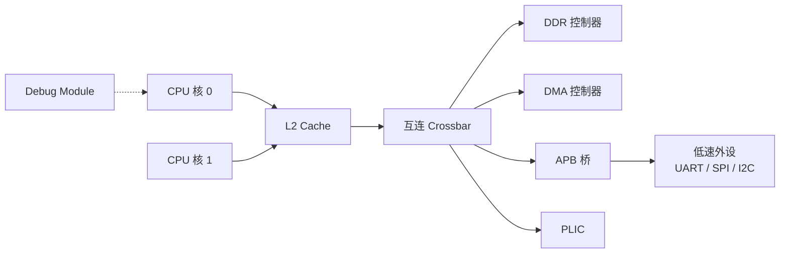
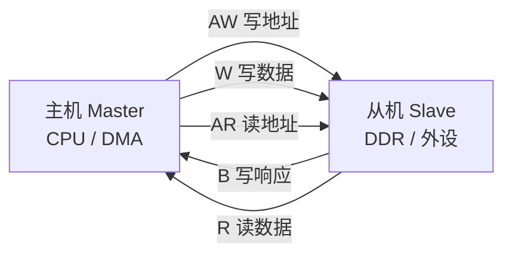
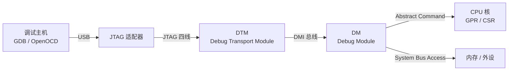

# 附录:体系结构与微架构背景速览

> 本篇是 RISC-V 工程笔记的背景参考,不是必读主线——主线各篇默认你具备体系结构常识,哪里记不清了,回这里查对应小节即可。

## 1. ISA 与微架构的边界

**ISA(Instruction Set Architecture,指令集架构)是软件与硬件之间的契约**:指令编码与语义、寄存器组、地址空间、特权模式、trap 模型、内存模型——凡是汇编程序员或编译器能观察到的东西,都属于 ISA。**微架构(microarchitecture)是履约的具体电路**:流水线级数、发射宽度、cache 配置、分支预测器——对软件透明,只在性能、功耗、面积上显形。

| 维度 | ISA:契约,软件可见 | 微架构:履约,对软件透明 |
| --- | --- | --- |
| 管什么 | 指令集、寄存器、地址空间、trap 行为 | 流水线、发射宽度、cache、预测器 |
| 变更代价 | 破坏二进制兼容,极慎重 | 每代产品都可以重做 |
| 验证含义 | 架构合规测试,跨实现通用 | 微架构专项用例,换核重来 |

同一份 RV64GC,可以有性能相差数倍的实现:

```text
SiFive U74      顺序双发射,面向嵌入式 Linux
香山(南湖)      6 宽乱序,对标 ARM Cortex-A72 级
BOOM            2-4 宽乱序,研究平台
```

三者跑同一份二进制,结果一致、速度迥异——"能做什么"写在契约里,"做多快"由施工方决定。这条边界对硅前验证与固件工作是实打实的:

- **能依赖的**:ISA 规定的行为。指令语义、trap 优先级、CSR 读写副作用在所有合规实现上一致——架构级测试跑通,换一颗合规核照样通过。
- **不能依赖的**:微架构相关的一切。cache 参数、总线时序、勘误规避逐核而异;换核,性能要重量,用例要重审。验证计划里"架构相关"与"实现相关"用例分账管理,依据正是这条边界。
- 典型的微架构专项用例:转发路径、cache 一致性、分支预测边界条件——它们不问"指令对不对",只问"这套流水线快不快、稳不稳"。

RISC-V 在这条边界之外多开了一个口子:**ISA 本身开放且允许扩展**。两颗都自称 RV64GC 的 SoC,一颗可能挂着自定义指令或 Rocket 式 RoCC 协处理器,固件与工具链要分别适配;实际兼容范围还要看 profile(如 RVA22)划定的扩展子集。

指令与扩展细节见 [RV32I/RV64I 指令集](./01-isa-rv32i-rv64i.md)与[标准扩展](./02-standard-extensions.md),生态全景见 [RISC-V 概览](./00-riscv-overview.md)。

分析性能时,同样要先问"这是哪一层的问题"。程序时间的拆解是 $T = N \times CPI / f$,三个因子各归各层:

| 因子 | 主要由谁决定 |
| --- | --- |
| 指令数 N | 编译器优化等级、ISA 的指令功能密度 |
| CPI(每指令周期数) | 微架构:冒险、cache 命中率、预测器准确率 |
| 频率 f | 工艺、流水线深度(级数越多,频率越容易做高) |

"变慢了"的排查先定位到因子,再找层——这是把 ISA/微架构边界用到性能分析上的日常动作。

三条 RISC 设计原则解释了"为什么 RISC-V 的流水线好做";读开源核 RTL 时会反复撞到其后果:

| 原则 | 内容 | 换来的简化 |
| --- | --- | --- |
| 定长指令 | 基础指令固定 32-bit(C 扩展另有 16-bit 压缩编码) | 取指译码规整,流水线前两级极简 |
| load-store 架构 | 只有 load/store 访存,运算指令只碰寄存器 | 访存集中在 MEM 级,结构冒险天然少 |
| 大寄存器文件 | 32 个通用寄存器(x86-64 只有 16 个) | 减少访存,给编译器调度留空间 |

## 2. 内存层次与局部性

核与主存之间差着约两个数量级的延迟(1 GHz 核的 1 拍约 1 ns,DRAM 访问在百纳秒量级,对应下表 ~200 拍),靠"越靠近 CPU 越快、越小、越贵"的分层弥合:

| 层级 | 容量(典型) | 延迟(量级) | 位置 |
| --- | --- | --- | --- |
| 寄存器 | ~1 KB | 0 拍 | 核内 |
| L1 I/D Cache | 32-64 KB/核 | ~4 拍 | 核内,I/D 分离 |
| L2 Cache | 256 KB-1 MB | ~10 拍 | 核/簇内 |
| L3 / LLC | 数 MB-数十 MB | ~40 拍 | 片上共享 |
| DRAM | GB 级 | ~200 拍 | 板上 |

层次能工作,靠的是**局部性**:时间局部性(刚访问的数据很快被再次访问,如循环变量)与空间局部性(被访问地址的邻居即将被访问,如数组遍历)。局部性一旦崩塌,每层 cache 都是白占的面积。最直观的对照:

```c
/* 行优先:顺着 cache 行扫,空间局部性好 */
for (int i = 0; i < N; i++)
    for (int j = 0; j < N; j++)
        sum += a[i][j];

/* 列优先:每步跨 N 个元素,一个 cache 行只用一个字就换行 */
for (int j = 0; j < N; j++)
    for (int i = 0; i < N; i++)
        sum += a[i][j];
```

同样的遍历,大矩阵上两种顺序可以差一个数量级——"代码写法 × 硬件层次"共同决定性能的最小例子。

miss 的归因分三类:compulsory(冷启动,第一次访问)、capacity(容量不够)、conflict(相联度不够,地址碰巧挤进同一组),对策各不相同。看一颗核的 cache 配置,通常盯四个参数:

| 参数 | 含义 | 为什么关心 |
| --- | --- | --- |
| 容量 | 每级大小 | 直接决定 miss 率 |
| 相联度 | 组相联的路数 | 路数低 → 冲突 miss(地址碰巧映射同组) |
| 行宽 | 一行的字节数,常见 32/64 B | 空间预取粒度,也是 false sharing 的边界 |
| 写策略 | write-back(脏行回写)/ write-through(直写) | write-back 才有"脏行",才有 flush/clean 语义 |

对固件与验证工作,这个层次是日常操作对象:

- **cache 维护指令直接管理它**:`fence.i` 同步 I-Cache 与数据写回——自修改代码、跨核加载镜像后"偶现"的取指异常,经典根因就是漏了它;`sfence.vma` 刷新 TLB。见[内存管理:PMP 与 Sv39](./05-memory-management-pmp-sv39.md)。
- **TLB 就是页表的 cache**:MMU 每次翻译都做全量页表遍历(page walk)太慢,近期映射被缓存进 TLB——所以缺页处理有快慢路径之分,也所以 `sfence.vma` 存在。
- **cache 行大小影响数据结构布局**:多核各自高频写的变量挤进同一行(false sharing),一致性流量会拖垮性能;对齐与 padding 因此是并发数据结构的常规考量。
- **DMA 与 cache 未必互相看见**:非一致 SoC 上,DMA 搬运前后固件要 flush/invalidate 相关 cache 行,否则设备读写的是旧数据——驱动里 buffer 管理的标准动作。
- **性能异常的第一直觉**:延迟超标先猜 cache miss(性能计数器可证实),再猜总线争用,最后才怀疑逻辑写错。cache 行为怎么用微基准观测,见[cache 行为与测试](./22-cache-behavior-testing.md)。

L1 分 I/D(哈佛式)是微架构消除取指/取数结构冒险的标准做法(下节);代价是两份 cache 互不同步——`fence.i` 的存在就是为这笔账付的。多核之间的一致性由协议(MESI 一类)维护:私有 L1、共享 L2,写一行要广播;而外挂 DMA/加速器的 SoC 常常不在这个一致性域里——上一条 flush/invalidate 的由来。

## 3. 流水线与冒险

非流水处理器一条指令做完才开始下一条:时钟周期被最慢的指令拖住,大部分部件每拍空转。流水线把指令切成若干级,让不同指令的不同级重叠执行。经典 5 级:

```text
周期:    1     2     3     4     5     6     7
指令1:  [IF]  [ID]  [EX]  [MEM] [WB]
指令2:        [IF]  [ID]  [EX]  [MEM] [WB]
指令3:              [IF]  [ID]  [EX]  [MEM] [WB]
```

| 级 | 做什么 | 关键硬件 |
| --- | --- | --- |
| IF | 取指,PC 自增 | PC、I-Cache |
| ID | 译码,读寄存器堆,生成立即数 | 译码器、寄存器堆 |
| EX | ALU 运算,算访存地址,判分支 | ALU |
| MEM | 访问 D-Cache(只有 load/store 走到这一级) | D-Cache |
| WB | 结果写回寄存器堆 | 寄存器堆写端口 |

稳态下每周期完成一条指令(CPI ≈ 1)。级间的流水线寄存器锁存沿途信号——流水线用面积和每级一拍的寄存器延迟,换吞吐量;读 RTL 时可对着这张速查:

```text
[IF/ID]  指令、PC+4、立即数
[ID/EX]  操作数、ALU 控制信号、目标寄存器号
[EX/MEM] ALU 结果、写数据、访存控制
[MEM/WB] ALU 结果 / load 数据、写回目标
```

重叠执行带来三类麻烦(hazard):

| 冒险 | 成因 | 标准解法 |
| --- | --- | --- |
| 数据冒险 | 后条指令要用前条尚未写回的结果 | 转发(forwarding);兜不住就停顿(stall) |
| 控制冒险 | 分支走向到流水线后段才知,取指流已按猜测方向填充 | 分支预测(下节),猜错冲刷 |
| 结构冒险 | 两条指令同拍争用同一硬件资源 | 资源复制(I/D cache 分离、多写端口)或停顿 |

数据冒险最常见的是 RAW(Read After Write):前条的结果还在流水线里没写回,后条就要用。**转发**把 EX/MEM、MEM/WB 流水线寄存器里的结果直接送回需要它的级,大部分 RAW 零代价:

```text
EX→EX :上一条的 ALU 结果,从 EX/MEM 寄存器旁路给下一条的 EX 输入
MEM→EX:load 数据从 MEM/WB 寄存器旁路给下一条的 EX 输入
```

例外是 load-use——数据到 MEM 末拍才从 D-Cache 返回,再快的转发也来不及,只能插一拍气泡(bubble):

```asm
lw   t0, 0(sp)     # 数据第 4 拍末才返回
sub  t3, t0, t4    # 第 3 拍 EX 就需要 t0 → 停 1 拍再转发
```

第三种手段在编译器手里:指令调度把无关指令填进 load 与其使用者之间。顺序核(Rocket、CVA6、E203)上这直接影响性能;乱序核由硬件自己兜底。手写关键路径汇编时留意 load-use,是最容易兑现的微架构知识。

控制冒险的代价随流水线深度增长:5 级顺序核猜错一次分支约浪费 2 拍;10+ 级深流水的乱序核要冲刷整条前端,一次 mispredict 10 拍起步。各路停顿叠加,就是实际 CPI = 1 + 每指令平均停顿数,来源大致按 cache miss > 分支预测失败 > load-use 排序——优化先从高频事件下手(Amdahl 定律的日常版)。

也所以流水线不是越深越好:级数加倍、频率上去了,mispredict 冲刷与流水线寄存器开销同步上升,设计在"频率 × IPC"的乘积上找平衡。实测有最朴素的口径:基础 CSR 里的 `mcycle`(周期数)与 `minstret`(退休指令数)相除即实测 CPI——任何合规核都有,性能分析从这两个数起步。

结构冒险的教科书例子正是取指与取数争一个存储端口——L1 分 I/D 就是为它;寄存器堆写端口不够、两条指令争同一个乘法器,同理。

两个 RISC-V 特有的要点:

- **没有 delay slot**:MIPS 式"分支后一条指令保证执行"在 RISC-V 中不存在,预测错误直接冲刷。编译器不必为延迟槽调度,RTL 不背历史包袱。
- **更宽更深即乱序**:发射宽度从 1 到 2/4/6;配寄存器重命名(消除 WAR/WAW 假依赖)、发射队列(操作数就绪即发射)、ROB(重排序缓冲,乱序执行、按序提交)。数据/结构冒险被硬件在运行时动态消解,对软件不可见,但解释了同一段代码在不同核上数倍的性能差——选型见第 5 节。

## 4. 分支预测

分支大约每 5-6 条指令一条,是控制冒险的主要来源。5 级核里分支到 EX 才解析,取指流那时已按猜测方向吞进两条指令——取指不能干等解析,只能先猜:猜对零代价,猜错冲刷,代价与流水线深度成正比。

另外,"跳不跳"与"跳去哪"是两件事:方向预测器管前者,BTB(Branch Target Buffer)缓存目标地址,RAS(Return Address Stack)专管 `ret` 的返回地址。

方向预测器从粗到细:

| 预测器 | 思路 | 准确率(量级) |
| --- | --- | --- |
| 静态 not-taken / BTFN | 固定规则;BTFN 对向后分支猜 taken,循环友好 | 60-80% |
| 2-bit 饱和计数器 | 连错两次才改方向 | ~90% |
| 局部历史 | 每个分支一份独立计数器 | ~93% |
| GShare | 全局分支历史与 PC 哈希后索引计数器表 | ~95% |
| TAGE | 多张不同历史长度的表,取最长匹配 | 97%+ |

2-bit 饱和计数器(`00 强不跳 → 01 → 10 → 11 强跳`,双向移动、端点饱和,预测方向取最高位)胜过 1-bit 的地方在循环:跑 100 次的循环,1-bit 在退出那跳被"改了主意",下次进循环第一跳就猜错;2-bit 要连错两次才翻转,单次退出动摇不了它。

开源核在这条光谱上各就各位:Rocket 用简单 BTB,CVA6 用 BTB+BHT+RAS,BOOM 可配 GShare/TAGE,香山南湖用 TAGE-SC——看预测器配置就能读出这颗核的微架构档次(第 5 节的表里专列一栏)。

对固件/验证工程师,三句实在话:

- **性能**:分支密集的 hot path 上,mispredict 率的几个百分点直接是整体性能的可见百分比,深流水核尤其如此。以量级感一下:IPC 4 的乱序核,分支占 15%、mispredict 率 2%、每次冲刷 15 拍——每 100 条指令多付 0.15×100×0.02×15 ≈ 4.5 拍,基线只要 25 拍,折合约 15% 的性能损失。性能计数器的 branch-mispredict 事件能量化,别拍脑袋。
- **可复现性**:预测器是有状态的学习机制——同一段代码首跑与第 N 次跑,分支历史不同,时序可以有差异。做延迟统计或时序敏感验证时,把预测器状态列为 variability 的来源之一,而不是怀疑芯片不稳。
- **编译器也参与**:C 的 `__builtin_expect`、内核的 `likely()`/`unlikely()` 就是在给编译器喂分支倾向,让它把大概率路径排直、冷路径挪出 hot path——固件里少数能顺手帮到预测器的动作。

## 5. 开源 RISC-V 核心对比

选核选的不是"最强",是匹配:RTL 要能读懂(出问题钻得进去)、语言与工具链能接受、验证成熟度撑得起用途。五个最常见的核:

| 核 | 出品方 / 语言 | 微架构 | 分支预测 | MMU / OS | 定位 |
| --- | --- | --- | --- | --- | --- |
| Rocket | UC Berkeley / Chisel | 顺序单发射,5-6 级 | 简单 BTB | Sv39,可跑 Linux | 生态"参考实现" |
| BOOM | UC Berkeley / Chisel | 乱序超标量,2-4 宽,重命名 + ROB | GShare,可配 TAGE | Sv39 | 高性能研究平台 |
| 香山 | 中科院计算所 / Chisel | 乱序 6 宽(南湖 ROB 192 项) | TAGE-SC | Sv39 | 开源阵营的性能上限 |
| CVA6 | ETH Zurich / OpenHW / SystemVerilog | 顺序单发射,6 级 | BTB+BHT+RAS | Sv39,支持 Linux SMP | 工业成熟度最高的开源顺序核 |
| 蜂鸟 E203 | 芯来科技 / Verilog | 2 级,RV32IMAC | 静态 | 无 MMU,裸机/RTOS | MCU 与教学 |

> **如何读这张表**:微架构一列决定性能量级——顺序单发射 IPC ≈ 0.5-0.8,乱序多发射可到 2+;语言一列决定工具链形态——Chisel 经 Scala 生成 Verilog,SystemVerilog/Verilog 直接可读;MMU 一列是 OS 分水岭——无 MMU 只能裸机/RTOS;预测器一列对应第 4 节,是微架构档次的速读指标。

每颗核一段速写,选型时对号:

**Rocket**——RISC-V 生态的参考实现。配套 Rocket Chip 是 SoC 生成器:Scala 参数配置,一键生成核 + 可选 L2 + TileLink 互连 + 常见外设的 Verilog;RoCC(Rocket Custom Coprocessor)接口挂自定义协处理器,是"ISA 可扩展"最典型的工程样例。要一个地道的 RISC-V SoC 骨架,从它起步。

**BOOM**——伯克利的乱序研究核,与 Rocket 同在 Rocket Chip 生成器里,2-4 宽发射、寄存器重命名、ROB 一样不少;面积约为 Rocket 的 3-5 倍,同工艺下频率更低。研究微架构本身(换预测器、改调度策略)用它,Chisel 参数化让实验成本低。

**香山**——中科院计算所的高性能核。南湖一代 6 宽乱序、ROB 192 项、TAGE-SC 预测器、L1 D-Cache 64 KB、共享 L2,对标 Cortex-A72 级;雁栖湖→南湖→昆明湖逐代演进,文档与论文公开。它代表开源 RISC-V 的性能上限,工程体量也最大——选它等于选一条完整的高性能工程路线。

**CVA6**——ETH Zurich 起源、OpenHW Group 维护。顺序单发射 6 级:比经典 5 级多出独立的 Issue 级,译码后的指令在发射级等操作数,顺序核也能少停顿。SystemVerilog 实现、多次流片验证(如 GF 22nm FDX)、配套工业级验证环境,不想引入 Chisel 工具链又要上产品,它是首选;支持 Linux SMP,固件要处理多核一致性初始化与 IPI。

**蜂鸟 E203**——芯来科技的 2 级核(IF + 执行),RV32IMAC,取指按 16-bit 边界对齐(C 扩展友好),面积极小,面向 MCU;无 MMU、无多核,中断与定时器全由固件自己管。配套书《手把手教你设计 CPU——RISC-V 处理器篇》是中文世界最好的处理器入门教材之一。

源码与文档入口(本地 `reference/` 目录另存有香山用户指南中文版):

| 核 | 入口 |
| --- | --- |
| Rocket / BOOM | [rocket-chip 仓库](https://github.com/chipsalliance/rocket-chip)、[BOOM 文档](https://docs.boom-core.org/) |
| 香山 | [XiangShan 仓库](https://github.com/OpenXiangShan/XiangShan) |
| CVA6 | [cva6 仓库](https://github.com/openhwgroup/cva6) |
| 蜂鸟 E203 | [Nuclei 文档](https://doc.nucleisys.com/) |
| IBEX / VexRiscv | [ibex 仓库](https://github.com/lowRISC/ibex)、[VexRiscv 仓库](https://github.com/SpinalHDL/VexRiscv) |
| 本地参考 | `reference/xiangshan-user-guide-zh-1.pdf`(香山用户指南,中文) |

决策要点,按需求倒推:

- **学处理器、读 RTL**:E203,书与代码一体最平缓;想读乱序,BOOM 与香山的文档都在线。阅读顺序建议 E203 → Rocket → CVA6 → BOOM/香山,复杂度递增。
- **ASIC 流片**:CVA6,多次流片、验证环境齐;接受 Chisel 的话 Rocket/BOOM 参数化最灵活。
- **FPGA 原型、低功耗产品**:E203、IBEX(lowRISC,OpenTitan 采用)、VexRiscv(SpinalHDL,可配置粒度极细)。
- **高性能研究/服务器方向**:香山,按它的工程体量评估团队投入。
- **对照实验**:Rocket 与 BOOM 同出一个生成器,顺序/乱序只差参数——做微架构对比实验最省事的一对。

落到固件上的差异,主要四条:

- 顺序核上编译器调度与 load-use 敏感(第 3 节);乱序核硬件兜底,但代码与性能的关系更难凭直觉判断——要量,不要猜。
- 有无 MMU/FPU 是硬门槛:无 MMU 只有裸机/RTOS;跑 Linux 要 Sv39,多核再叠加一致性初始化与 IPI;无 FPU 的核走 soft-float,连 ABI 都要跟着选。
- 自定义扩展要固件配合:RoCC 协处理器、自定义 CSR,常要 M-mode 初始化,甚至配自定义 SBI 扩展才能暴露给 S-mode。
- 换核就要重审勘误与初始化代码:cache 参数、总线位宽、自定义扩展逐核而异。多核差异在硅前怎么覆盖,见[硅前验证环境](./20-presilicon-validation-environment.md)。

## 6. SoC 互联:AXI 与调试链路

核外的世界由互连与调试链路构成,固件在这两者上花的时间不比指令集少。一颗典型双核 SoC 的互连长这样——CPU/DMA 是总线 master,DDR 控制器与外设是 slave,互连对上是 slave、对下是 master:



本节只留最常查的两块;中断控制器(CLINT/PLIC/AIA)是主线内容,见[中断与异常](./04-interrupts-and-exceptions.md)。

### 6.1 AXI4 五通道与 VALID/READY

AXI4 是 AMBA 家族的高性能总线(ARM 定义,RISC-V SoC 同样普遍采用),把一次传输拆到五个独立通道:



| 通道 | 方向 | 内容 |
| --- | --- | --- |
| AW | 主 → 从 | 写地址与控制(突发长度等) |
| W | 主 → 从 | 写数据,一笔地址可突发多拍 |
| B | 从 → 主 | 写响应,标记这笔写完成 |
| AR | 主 → 从 | 读地址与控制 |
| R | 从 → 主 | 读数据 + 逐拍响应 |

写一笔走 AW→W→B,从机回 B 才算完成;读一笔走 AR→R。读写地址通道分离,读写得以并行;不同 ID 的传输允许乱序完成;主机可同时挂多笔未完成交易(outstanding),再配合突发(burst)摊薄地址通道开销——高带宽就是这么攒出来的。

AMBA 家族其余成员:AHB 是被 AXI 取代的上一代高速总线;APB 面向低速外设,经 AXI-to-APB 桥挂上来,简单无突发,够用且省门。

控制寄存器映射常用 AXI4-Lite——砍掉突发、只留单拍的子集,寄存器访问用不着更多;流式数据(网络包、采样流)则走 AXI4-Stream,有数据没有地址。

每个通道独立握手,规则是:**源拉 VALID 表示数据有效,目的拉 READY 表示能收,传输只在两者同拍为高时发生**:

```text
周期:    1     2     3     4
VALID:  ___/‾‾‾‾‾‾‾‾‾‾‾‾
READY:  ______/‾‾‾‾‾‾‾‾
              ↑ 第 3 拍两者同高,传输发生
```

两条铁律(AMBA 规范):VALID 一旦拉高,握手完成前不得撤销或变更;VALID 不许等 READY 才出现,READY 可以等 VALID——双方至少一方无条件前进,故不会死锁。

调试"偶发挂死"的定位思路就从这来:抓总线,看哪个通道 VALID 常高而 READY 永不响应——是主机发了没人收(从机或互连问题),还是主机根本没发全(配置问题)。DMA 驱动的经典坑:没等 B 通道写响应就当写入完成,下一笔读回了旧数据。

互连(crossbar/NoC)自身的仲裁与排队还会引入延迟抖动,实时性敏感的固件要把这笔算进确定性预算。

TileLink 是 Rocket Chip 等伯克利系平台使用的开源一致性总线,原生带 MESI 缓存一致性;AXI 要等价能力得加 ACE 扩展。生态里两者并存,行业互连标准仍是 AXI。

### 6.2 JTAG → DTM → DM 调试链路

RISC-V Debug 规范把片上调试拆成三段接力:



- **DTM**(Debug Transport Module):JTAG 四线(TCK 时钟 / TMS 状态机 / TDI 入 / TDO 出)到 DMI 总线的桥,只管搬运、不懂调试语义;规范允许替换传输层而 DM 不动。JTAG 侧是标准 16 态 TAP 状态机,器件靠扫描链上的 IDCODE 被发现。
- **DM**(Debug Module):真正的调试引擎,经 DMI 收命令,对内控制核与总线;DMI 的地址空间就是 DM 的寄存器组。

OpenOCD 在中间当翻译:把 GDB 的远程协议(RSP)译成 DMI 事务;板级信息——JTAG 链上有哪些器件、几颗核——写在 target 配置文件里,换板子改的主要是这份文件。

DM 的关键能力:

| 能力 | 机制 | 典型用途 |
| --- | --- | --- |
| 读写 GPR / CSR | Abstract Command | 停核后查完整状态,不必构造 load/store 序列 |
| 直接读写内存外设 | System Bus Access | 绕开核——核挂死时也能确认总线与外设是否存活 |
| 在 DM 内执行小程序 | Program Buffer | Abstract Command 搞不定的复合操作 |
| halt / resume / 单步 | dcsr.step | 逐条过启动代码 |
| 硬件断点 / 观察点 | tdata1 / tdata2 | PC 匹配停核;监控某地址被谁读写 |
| 触发器链 | tdata1.chain | 组合多个触发器成复杂条件 |

常用寄存器速查:

| 寄存器 | 作用 |
| --- | --- |
| dmcontrol | 停核/复位请求、选择 hart(hartsel) |
| dmstatus | hart 调试状态(allhalted / anyrunning 等) |
| dcsr(核侧) | 单步使能、记录进入调试的原因 |
| dpc(核侧) | 进入调试态时的 PC,resume 从这里继续 |
| dscratch(核侧) | 调试例程的暂存寄存器,存上下文用 |

对硅前与 bring-up 最值钱的是 System Bus Access 与硬件断点:前者不依赖核存活——串口没输出时,先经它确认总线与内存是否正常;后者不改写指令存储——ROM、以及 SBI 这类会做自修改的场景,软件断点无从下手。触发器每核只有几个(数量由实现决定),规划断点时省着用。

同一条链路在硅前和板上长得不一样:仿真里直接注入 DMI 事务(不经 JTAG 时序),板上则真金白银走 JTAG,吞吐瓶颈在 JTAG 时钟——批量读写交给 system bus/program buffer,别逐字搬。

调试规范原文在 `reference/riscv-debug-specification.pdf`;在仿真环境里驱动 DMI 的具体做法见[硅前验证环境](./20-presilicon-validation-environment.md)。

## 7. 延伸阅读

背景到此够用,工程内容在主线各篇:

| 主题 | 文档 |
| --- | --- |
| RISC-V 设计哲学与生态 | [RISC-V 概览](./00-riscv-overview.md) |
| 指令集与标准扩展 | [RV32I/RV64I 指令集](./01-isa-rv32i-rv64i.md)、[标准扩展](./02-standard-extensions.md) |
| 中断与异常、CLINT/PLIC/AIA | [中断与异常](./04-interrupts-and-exceptions.md)、[AIA 专题](./07-aia-advanced-interrupt-architecture.md) |
| 页表、TLB、PMP | [内存管理:PMP 与 Sv39](./05-memory-management-pmp-sv39.md) |
| cache 行为观测与测试 | [cache 行为与测试](./22-cache-behavior-testing.md) |
| 汇编与 ABI、内联汇编 | [汇编与 ABI](./08-assembly-and-abi.md) |
| 模拟器与微架构级仿真 | [工具链与模拟器](./09-toolchain-and-simulator.md) |
| 硅前验证环境与调试实践 | [硅前验证环境](./20-presilicon-validation-environment.md) |

想系统补体系结构,教材是 Patterson & Hennessy《计算机组成与设计(RISC-V 版)》;本专题引用的规范原文都在 `reference/` 目录。

→ 下一步:[RISC-V 概览](./00-riscv-overview.md)
