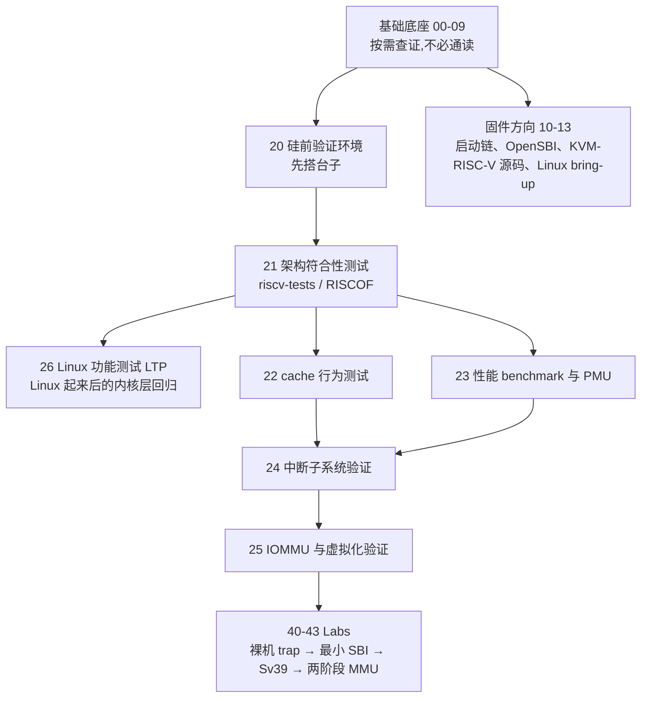

# RISC-V:硅前验证与固件的工程笔记

> 定位:面向在 Palladium/FPGA 上做 RV 核 IP 硅前验证的软件工程师(非 IC 设计、非 DV),以及写 OpenSBI/内核/UEFI 的固件工程师。主线不是"由浅入深学 RISC-V",而是"怎么用软件手段把核验对":cache 行为、CPU benchmark、中断行为、虚拟化与 IOMMU 的测试方法,加上启动链各环节的实操。

## 学习路径

两条主线:**硅前验证**(20→26,配 Labs 落地)与**固件**(10→13,RAS 展开见 30)。基础篇当工具书用——遇到不熟的 CSR、页表、中断机制再回查。

## 文档索引

### 基础底座(00-09)

| 序号 | 文档 | 概要 | 建议学时 |
| --- | --- | --- | --- |
| 00 | [RISC-V 概览](./00-riscv-overview.md) | 生态全景、RVA22/23 Profile 与跨 ISA 对照 | 2 |
| 01 | [RV32I/RV64I 指令集](./01-isa-rv32i-rv64i.md) | 六种指令格式、编码细节、读反汇编的参考 | 3 |
| 02 | [标准扩展](./02-standard-extensions.md) | M/A/F/D/C/B/V + 服务器子扩展速查手册 | 按需 |
| 03 | [特权模式与 CSR](./03-privileged-modes-and-csr.md) | 特权级、mstatus/trap CSR 位域、委托 | 4 |
| 04 | [中断与异常](./04-interrupts-and-exceptions.md) | trap 流程、CLINT/mtimecmp、PLIC、Sstc | 3 |
| 05 | [内存管理:PMP 与 Sv39](./05-memory-management-pmp-sv39.md) | PMP 编码、页表遍历、两阶段翻译入口 | 4 |
| 06 | [虚拟化:H 扩展](./06-virtualization-h-extension.md) | 两阶段翻译、H 扩展 CSR、KVM on RISC-V | 4 |
| 07 | [AIA 高级中断架构](./07-aia-advanced-interrupt-architecture.md) | IMSIC/APLIC 寄存器级详解、虚拟化中断 | 按需 |
| 08 | [汇编、ABI 与裸机编程](./08-assembly-and-abi.md) | 伪指令展开、trap 上下文保存、内联汇编、完整裸机工程 | 4 |
| 09 | [工具链与模拟器](./09-toolchain-and-simulator.md) | -march 矩阵、QEMU virt 地址映射、GDB 调试流程 | 2 |

### 固件方向(10-19)

| 序号 | 文档 | 概要 | 建议学时 |
| --- | --- | --- | --- |
| 10 | [启动链总览](./10-boot-chain-overview.md) | 复位向量→OpenSBI→内核/UEFI,复位后 CSR 状态、SBI 调用约定 | 3 |
| 11 | [OpenSBI 源码走读](./11-opensbi-source-walkthrough.md) | fw_base 启动汇编与彩票机制、init_coldboot 主干、generic 平台定制点、ecall 分发与扩展全景、FPGA 定制清单 | 5 |
| 12 | [KVM on RISC-V 源码走读](./12-kvm-riscv-source-walkthrough.md) | 文件地图、世界开关汇編、G-stage 页表搭建、exit 分发与 PMU 计数、VMID 回绕广播、AIA 内核侧分工 | 4 |
| 13 | [Linux RISC-V 移植与 bring-up](./13-linux-bringup.md) | 启动协议 a0/a1、setup_vm、PLIC 驱动、设备树解析 | 5 |
| 30 | [RAS 错误处理](./30-ras-error-handling.md) | RERI v1.0 寄存器级讲解、错误注入与用例矩阵、Server SoC 条款、软件栈现状 | 6 |

> ZSBL 与 edk2 不在规划内;RAS 按 Server SoC 方向展开在 30。

### 硅前验证(20-29)⭐ 本专题核心

| 序号 | 文档 | 概要 | 建议学时 |
| --- | --- | --- | --- |
| 20 | [硅前验证环境](./20-presilicon-validation-environment.md) | RTL 仿真/emulation/FPGA 三平台对比、bring-up 信任链、tohost/早期 UART、常见坑清单 | 5 |
| 21 | [架构符合性测试](./21-arch-compliance-riscof.md) | riscv-tests 判定协议、RISCOF 三件套、为 FPGA DUT 写 plugin、ACT4 新格式 | 5 |
| 22 | [cache 行为与一致性测试](./22-cache-behavior-testing.md) | 延迟阶梯、伪共享探针、RVWMO litmus 用例、MESI 状态迁移观察 | 6 |
| 23 | [CPU 性能 benchmark 与 PMU](./23-performance-benchmark-pmu.md) | Zicntr/Zihpm 裸机测量、CoreMark 选型、稳态判定、A/B 归因 | 5 |
| 24 | [中断子系统验证](./24-interrupt-validation.md) | mcause/mtvec/delegation 用例矩阵、timer/PLIC/AIA 边界、"看不到中断"分锅决策树 | 6 |
| 25 | [IOMMU 与虚拟化验证](./25-iommu-virtualization-validation.md) | 两阶段翻译正确性矩阵、VMID/TLB、SiFive IOMMU-22 寄存器级用例、直通端到端 | 6 |
| 26 | [Linux 功能测试:LTP](./26-linux-test-project.md) | 与 ISA 合规的分层关系、newlib 框架解剖、kirk 运行器(QEMU/SSH 到板)、RISC-V 触达点、失败分锅树 | 4 |

### 实战 Lab(40-49)

| Lab | 主题 | 对应章节 |
| --- | --- | --- |
| [Lab 1](./40-lab-baremetal-trap-handler.md) | 裸机中断框架:全寄存器保存、mtimecmp 写序、嵌套中断 | 03/04/08 |
| [Lab 2](./41-lab-minimal-sbi.md) | 手写最小 SBI:PMP、委托、M/S 跨模式调用 | 03/10 |
| [Lab 3](./42-lab-sv39-page-table.md) | Sv39 页表建立、开 MMU、缺页动态映射 | 05 |
| [Lab 4](./43-lab-h-extension-two-stage-mmu.md) | KVM API 入门与两阶段翻译概念 | 06/25 |

### 附录

| 序号 | 文档 | 概要 |
| --- | --- | --- |
| 90 | [体系结构与微架构背景速览](./90-appendix-architecture-background.md) | ISA vs 微架构、流水线/分支预测速查、开源核对比、AXI 与调试链路 |

## 本地参考资料(reference/,不进构建)

| 文档 | 版本 | 主要用途 |
| --- | --- | --- |
| `riscv-spec.pdf` | 非特权 ISA,20260517 中间版 | 指令语义、RVWMO 内存模型(§3.1)、Zicntr/Zihpm(§4.3/§4.4) |
| `riscv-privileged-20211203.pdf` | 特权架构 v1.12 | 特权 CSR、PMP/Sv39、H 扩展 |
| `riscv-debug-specification.pdf` | Debug v1.0(ratified 2025-02) | DTM/DM、abstract command、System Bus Access |
| `riscv-interrupts-aia.pdf` | AIA v1.0 rev 20250312 | IMSIC/APLIC、虚拟化中断(hvictl/hvien) |
| `riscv-reri.pdf` / `riscv-server-soc.pdf` | RERI / Server SoC | 平台要求(RAS 方向的输入,待展开) |
| `sifive_iommu22_*_manual.pdf` + `user_guide.pdf` | SiFive IOMMU-22 | IOMMU 寄存器级案例(25 号的事实来源) |
| `xiangshan-user-guide-zh-1.pdf` | 香山用户指南(中文) | 微架构参数对照 |

## 源码(src/,gitignore 的本地克隆,供 src= 引用)

| 目录 | 内容 | 服务于 |
| --- | --- | --- |
| `src/opensbi/` | **git submodule**,钉在 release tag **v1.9**(cbf9f673) | 10 启动链、11 源码走读 |
| `src/riscv-tests/` | isa/benchmarks/debug 测试套件(env 为 submodule) | 21 符合性测试 |
| `src/riscof/` | RISCOF 框架(pluginTemplate、签名比对) | 21 符合性测试 |
| `src/riscv-arch-test/` | ACT4 自检查套件(act4 分支) | 21 的版本兼容坑一节 |
| `src/ltp/` | Linux Test Project(20260529 版;kirk 为官方运行器) | 26 内核层功能测试 |
| `src/linux/` | Linux v6.16 sparse 克隆(blobless+arch/riscv 子树) | 12 KVM-RISC-V 源码走读 |

## 外部资源

| 类型 | 资源 |
| --- | --- |
| 规范仓库 | [riscv-isa-manual](https://github.com/riscv/riscv-isa-manual)、[riscv-aia](https://github.com/riscv-non-isa/riscv-aia)、[riscv-iommu](https://github.com/riscv-non-isa/riscv-iommu)(v1.0.1 ratified) |
| 教材 | Patterson & Hennessy《计算机组成与设计(RISC-V 版)》 |
| 开源核 | [Rocket Chip](https://github.com/chipsalliance/rocket-chip) / [BOOM](https://github.com/riscv-boom/riscv-boom) / [香山](https://github.com/OpenXiangShan/XiangShan) / [CVA6](https://github.com/openhwgroup/cva6) |
| 工具 | [OpenSBI](https://github.com/riscv-software-src/opensbi)、[OpenOCD](https://openocd.org/)、[herdtools7](http://diy.inria.fr)(内存模型 litmus 判定) |
| 测试套件 | [LTP](https://github.com/linux-test-project/ltp) / [kirk](https://github.com/linux-test-project/kirk)(官方运行器)、kselftest 与 kvm-unit-tests(随内核源码树) |
