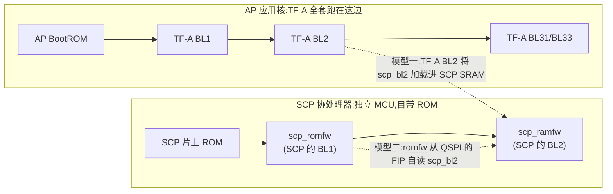
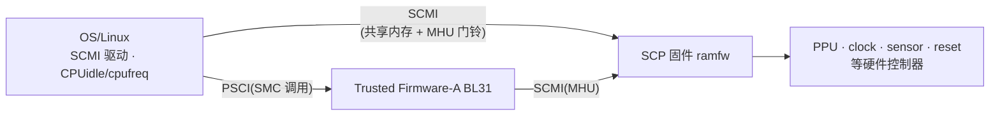
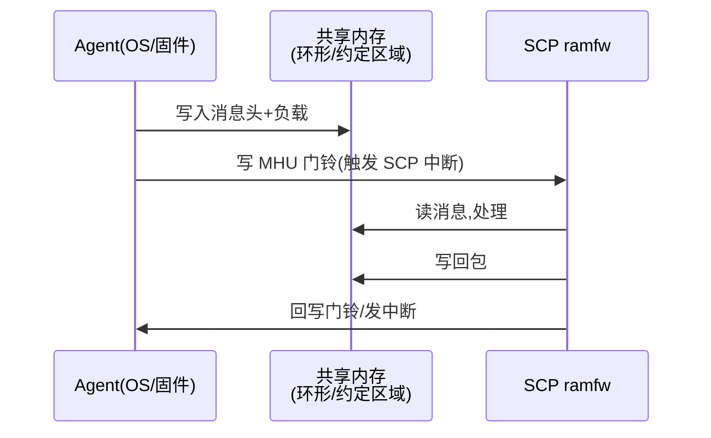

# 系统形态与多核交互:SCP 站在哪、与谁通信

> [上一篇](./00-scp-overview.md)讲了 SCP 为什么存在。本篇回答两个"怎么配合":**物理上**,SCP 固件以什么形态存在于系统里、由谁在启动时加载它;**通信上**,AP/安全固件/SCP 之间通过哪几对协议交互,各自走什么载体。事实来源:仓库 `user_guide.md`(启动链与镜像)、SCMI 规范 §1/§2/§3.1/§3.1.2/§4、PSCI 规范 §3。
>
> **本章位置**(见 [README 全景](./README.md)):旅程表([README](./README.md))第 1-3 段——意图、协议翻译、传输——的物理形态;两条启动链的加载关系也在这。

## 1. 一个 SoC,多颗管理协处理器

Arm 的 Compute Sub-System(CSS)里不止 AP 一颗处理器。典型形态:

| 处理器 | 职责 | 典型跑什么 |
| --- | --- | --- |
| **AP** | 跑 OS/用户负载 | Linux/Windows + Hypervisor |
| **SCP** | 电源与系统管理汇聚点 | SCP-firmware(本专题对象) |
| **MCP** | 可管理性入口(服务器 SoC) | SCP-firmware(MCP 配置) |
| **其它 SCP**(可选) | 大型 SoC 分区管理 | 各自 SCP-firmware 实例 |

仓库 `readme.md` 明确把"对多控制处理器平台的支持"列为能力;SCMI 规范 §2 也给过一张"两个系统控制器同时提供平台服务、彼此还用 SCMI 协调"的示例图。**一颗芯片里可以同时存在多个 SCP-firmware 实例**,它们之间也讲 SCMI。

## 2. 固件形态:ROM 固件与 RAM 固件

SCP 的代码空间不像 AP 有 DDR,固件按存放介质分两段:

| 段 | 存放 | 职责 |
| --- | --- | --- |
| **romfw(ROM 固件)** | SCP 片上 ROM(出厂烧死),或外置等效 | 极简:初始化最小硬件,为 ramfw 铺路 |
| **ramfw(RAM 固件)** | SCP 的 SRAM,由外部加载 | 主固件:全部运行时服务 |

以 Juno 为例(`user_guide.md` §Building the images):

- `juno-bl1-bypass.bin`:ROM bypass 固件,从外置非易失存储链载,用于物理板上绕过烧死的 ROM(FVP 不需要);
- `juno-bl2.bin`:SCP RAM 固件,管理全部运行时服务。

注意这组命名极易混淆:`juno-bl2.bin` 是 **SCP 的 ramfw**,跟 TF-A 的 **BL2** 是两回事。"bl2"这个名字在三个地方重复出现:SCP 侧按"BL1=ROM 固件、BL2=RAM 固件"命名(对应 `juno-bl1-bypass.bin`/`juno-bl2.bin` 两个镜像),TF-A 侧 FIP(Firmware Image Package,固件镜像包)里的 TOC 条目叫 `scp_bl2`,而 Juno 上又恰好由 TF-A 的 BL2 负责把它加载进 SCP SRAM。两边各有一套"BL1/BL2",运行在不同核上(§3 展开)。

## 3. 启动链:SCP 由谁加载

先澄清一个最容易混淆的点:**TF-A 整套固件(BL1/BL2/BL31/BL33,即 Boot Loader Stage 1/2/3.1/3.3)都运行在 AP 应用核上**——`user_guide.md` 明确写着 BL1 "stored in the system ROM",是 AP 侧的首级引导,BL2 由 BL1 加载,**它们都不是 SCP 的引导程序**。SCP 是另一颗独立处理器,有自己的片上 ROM,也有一套同名的"BL1/BL2"(`scp_romfw`/`scp_ramfw`)。两条启动链并行,不要混为一谈:

SCP 的 ramfw 由谁送进 SCP 的 SRAM,参考平台演示了两种模型——Juno 用模型一、Morello 用模型二,**在断言"SCP 由外部加载还是自行读取"之前,先分清这两条**:

**模型一 · 宿主加载:TF-A 的 BL2 送入(TF-A 一方主导)**。`user_guide.md` §Booting the firmware 讲的是这条:TF-A 至少需要三份镜像——`bl1`(存系统 ROM)、`bl2`(由 bl1 加载)、`fip`(含 `bl2` 与 `scp_bl2` 的容器)。原文白纸黑字:"`bl2` … responsible for handing over `scp_bl2` to the SCP"。BL2 从 FIP 解出的 `scp_bl2` 正是 SCP 的 ramfw(`juno-bl2.bin`,§2),写进 SCP SRAM 后 SCP 从那里开始执行。这是"AP 侧引导程序加载 SCP 固件"的经典模型,"ramfw 不是自己从介质里读的"这句话只在**这类平台**上成立。

**模型二 · 自举:romfw 自行从 QSPI 读取(TF-A 无关)**。Morello 的 SCP/MCP 都不由 TF-A 加载:`scp_romfw` 自己的 `fip` 模块从 QSPI flash 上的 FIP 直接取 `scp_bl2` 条目(`config_morello_rom.c` 里 `fip_base_address = SCP_QSPI_FLASH_BASE_ADDR`、`image_type = MOD_FIP_TOC_ENTRY_SCP_BL2`),写入 `SCP_RAM0` 后转入 ramfw 执行([04](./04-boot-and-init.md) §2;MCP 同样的流程见 [06](./06-mcp-manageability.md) §3)。

> **共同点才是关键**:两条路都走 FIP 容器——`scp_bl2` 是 FIP 里的一个 TOC 条目,和 `bl2`/`bl31`/`bl33` 并列。镜像在哪个容器里流转,就由哪一方负责验签:模型一里 BL2 已验证过 FIP 完整性,模型二里由 romfw 自行校验。**SCP 固件被嵌进整机可信启动链,靠的不是"由谁加载",而是"它在 FIP 里"。**

**AP 为何要等 SCP 就绪**。因果不在 TF-A,而在供电/复位域:上电时 SCP 率先运行(起点是它自己的片上 ROM 固件),将 AP 首级启动所需的时钟与 SRAM 环境准备就绪,AP 的 BL1/BL2 才能运行;AP 进到 BL31 之后,OS 的每笔电源动作(PSCI/SCMI)更是要 SCP 的 ramfw 出面(见 §4)。所以"先 SCP、后 AP"是分层的:AP 首级只依赖 SCP 的底层就绪,系统电源服务才依赖完整 ramfw。

## 4. 运行期交互:三对通信关系

系统启动后,涉及 SCP 的通信关系有三对,载体各不相同:

| 对话 | 发起方 → 处理方 | 协议 / 载体 | 典型请求 |
| --- | --- | --- | --- |
| OS 调频调压 | 内核 SCMI 驱动 → SCP | SCMI,共享内存 + MHU 门铃 | `PERFORMANCE_LEVEL_SET`、`CLOCK_RATE_SET` |
| OS 电源状态 | 内核 idle/电源管理 → TF-A | PSCI,SMC 调用 | `CPU_SUSPEND`、`SYSTEM_OFF` |
| TF-A 电源请求 | BL31 → SCP | SCMI(经自己的通道) | 让 SCP 切换电源域/电压 |
| 传感器/通知 | SCP → OS | SCMI 通知 | 温度越限、性能受限事件 |

两条边界要分清:

- **PSCI(Power State Coordination Interface,电源状态协调接口)是 OS↔TF-A 的电源接口,不是 SCP 的接口**。SCP 不实现 PSCI;OS 把电源意图交给 BL31,BL31 再以 SCMI(或平台私有协议)下发给 SCP。PSCI 规范(DEN0022§3)把自身定位为运行在最高特权固件里的电源协调者,而真正的硬件控制者是 SCP。
- **SCMI 是 OS/固件↔平台控制器的管理接口**。SCP 是 SCMI 的 platform 侧实现(仓库功能清单里的 "SCMI, platform-side"),内核的电源管理软件(SCMI 规范里叫 **OSPM**,Operating System-directed Power Management,操作系统主导的电源管理)和 TF-A 都是它的 agent(客户端)。详见 [11](./11-scmi-protocols.md)。

## 5. SCMI 消息模型:agent 与 platform

SCMI 把角色二分(规范 §2):

- **Agent**:发出命令的一方(OS、安全固件、Hypervisor、另一个控制器……都是潜在 agent);
- **Platform**:解释并执行命令的一方——SCP/MCP 实例扮演这个角色。

规范对两种角色给了重要约束:

- 同一份资源、同一个协议,同时只允许一个 platform 实体为某 agent 服务(§2);
- 多 agent 共享资源时,platform 要用**跨 agent 引用计数**管理状态:第一个要 enable 的资源真正打开,后续请求只加计数;要 disable 时计数减到零才真正关(§2)。后果是资源可能仍被其他 agent 的请求占用,实际状态与单个 agent 的预期不一致,agent 应使用查询命令确认真实状态。

### 5.1 一条消息长什么样

消息类似 RPC(§3.1.2):每个 32 位消息头带 `protocol_id`(8bit)、`message_id`(8bit)、`token`(10bit)、`message_type`(2bit)。小端,头永远是第一个参数、回包时原样返回。

常用协议 id(§3.1.2 Table 2):

| protocol_id | 协议 | protocol_id | 协议 |
| --- | --- | --- | --- |
| `0x10` | Base | `0x16` | Reset domain |
| `0x11` | Power domain | `0x17` | Voltage domain |
| `0x12` | System power | `0x18` | Power capping |
| `0x13` | Performance | `0x19` | Pin control |
| `0x14` | Clock | `0x1A` | MPAM-Fb |
| `0x15` | Sensor | `0x1B` | System Telemetry |

`0x00-0x0F` 保留、`0x1C-0x7F` 留给规范后续、`0x80-0xFF` 厂商/平台专用(SoC 私有协议都定义在这一段)。

消息类型:`0`=命令、`2`=延迟响应、`3`=通知(`1` 保留)。**异步命令**先回一条完成状态(通常接受),执行完成后再发一条同 token 的延迟响应——SCP 里大量慢操作(调频、上电)走这条路径,对应框架层的 `FWK_PENDING`(见 [03](./03-framework-events-deferred.md))。这个 32 位头的逐位布局与手算实例,在 [11](./11-scmi-protocols.md) §3 用 `POWER_STATE_SET` 完整走了一遍。

## 6. 传输:共享内存 + 邮箱门铃

协议消息的传递方式是:**agent 把消息写进共享内存,再写邮箱的门铃寄存器触发中断通知 SCP**(MHU,Message Handling Unit,消息处理单元):

SCP 源码里对应三组传输驱动:`module/mhu`(MHU v1)、`mhu2`、`mhu3`(MHUv3 架构,新平台)。MHU 硬件规范未收进本地 reference,传输细节以 SCMI 规范 §4 与模块内 `doc/mhu3.md` 为准。个别性能敏感通道(如 DVFS 设性能等级)还有**免消息头的 FastChannel**(§3.5.5)直写通道,绕过整条 RPC 往返。

## 7. 小结

- SCP 固件以 **romfw + ramfw** 两段形态存在;ramfw 或由 **TF-A BL2** 从 FIP 加载(Juno),或由 **romfw 自己从 QSPI 的 FIP** 自举(Morello)——两条路都经 FIP 里的 `scp_bl2` 条目,SCP 因此嵌进可信启动链;
- 运行期三对通信:PSCI(OS→TF-A)、SCMI(OS→SCP)、SCMI(TF-A→SCP),**载体分别是 SMC 和共享内存+MHU**;
- SCMI 的本质是 **agent/platform 二分 + 引用计数仲裁 + RPC 式消息**;SCP 是 platform 侧。

下一步进入 SCP 本体:[下一篇](./02-framework-module-system.md)从"这些模块是谁、怎么拼出固件"讲起——软件框架的模块化与标识体系。想先读另一条主线——**MCP**(同仓库、同框架,却扮演 SCMI agent、走管理面通道):[06 MCP 总览:管理面协处理器](./06-mcp-manageability.md)内容相对独立,随时可读。