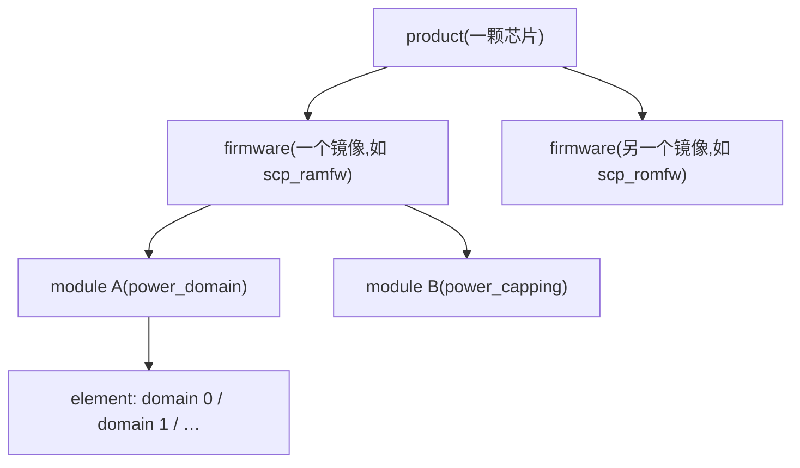

# 软件框架(一):模块化与标识

> 这是阅读 SCP 源码的基础。SCP-firmware 的代码形态不是"一堆函数互调",而是**框架(fwk)组织起来的模块化单体**:固件是一组模块,模块之间不直接调函数、而是通过显式的标识和绑定来协作。本篇用 Morello 的串口驱动 **pl011** 当贯穿样例——它是最小、最完整的真实模块——把"模块怎么拆、怎么标识、怎么描述、怎么配置、怎么走完生命周期、怎么连向其他模块"全部落到实物。事实来源:仓库 `doc/framework.md` 与 `framework/include/`、`module/pl011/` 下源码。
>
> **本章位置**(见 [README 全景](./README.md)):框架骨架:旅程表第 6/7/9 段背后的模块机制。贯穿样例是 Morello 的 pl011 串口驱动——每个概念都在它身上落地。

## 1. 框架要解决的三件事

先看一个具体的问题。pl011 是 Arm 的 UART 串口驱动,Morello 的 scp_ramfw 拿它当控制台:串口寄存器在 `0x44002000`、波特率 115200、参考时钟频率 `CLOCK_RATE_REFCLK`——这些全是 Morello 的属性。而"往发送 FIFO 写字节、等发送完成、算分频系数"是所有平台的共性。同一份 pl011 代码要原样跑在几十颗芯片上,靠的不是 ifdef,而是框架回答三个问题:

| 问题 | 不解决会怎样 |
| --- | --- |
| 一版代码要服务几十颗芯片,差异极大 | 要么 fork 一堆代码,要么巨型 ifdef |
| 模块间要低耦合、接口显式 | 互相调函数,改动会波及各处 |
| 通用代码与每颗芯片的具体配置互为矛盾 | 配置散落各处,无法构建期保证 |

框架的答案是三件套:**四级结构**(拆成型)、**标识体系**(指认)、**绑定机制**(连接)。下面逐个展开,每个都回到 pl011。

## 2. 一个模块:三个组成部分,四级结构组织

### 2.1 三部分:通用代码、构建期配置、运行时实例

SCP-firmware 里说"一个模块",其实指三样东西,pl011 的实物:

| 组成 | 放在哪 | pl011 的实物 |
| --- | --- | --- |
| **通用代码** | `module/<名字>/` | `module/pl011/src/mod_pl011.c`——读写 FIFO、算波特率分频,通篇不出现 Morello 一个字 |
| **构建期配置** | `<固件目录>/config_<名字>.c` | `product/morello/scp_ramfw_fvp/config_pl011.c`——基址、115200、时钟频率全在这 |
| **运行时实例(element)** | 配置文件里的元素表 | 一个名叫 `"SCP-UART"` 的元素(§5 看到实物) |

这条分界线就是"一版代码服务几十颗芯片"的机理:通用代码只使用**框架传入的配置**,不依赖平台。换一颗芯片,pl011 一行不动,动的是 config。

### 2.2 四级结构:product → firmware → module → element

这三部分被安放在四级目录结构里,由上到下越来越小。这一层套一层全落在目录和配置文件里,不是运行时概念——先上图,再对表:



| 层 | 是什么 | 由谁定义 |
| --- | --- | --- |
| **product** | 一颗芯片的系统表示,可产出多个固件镜像 | 目录 `product/<名字>/` + `product.mk` |
| **firmware** | 一个镜像:列出模块(`SCP_MODULES`)+ 每模块配置 + 内存布局(`fmw_memory.h`) | product 下的**固件目录**;目录名 = `product.mk` 里 `BS_FIRMWARE_LIST` 的条目,见下方说明 |
| **module** | 功能单元,单一职责 | `module/<名字>/`,通用代码,不含产品差异 |
| **element** | 模块经营的资源实例(如 power_domain 模块的每个电源域) | 固件配置里的元素表 |
| **sub-element** | 元素下的更细资源,只有索引没有结构 | 元素配置 |

pl011 在这套结构里就是一条具体的路径:`product/morello` → `scp_ramfw_fvp` → `pl011` → `"SCP-UART"` 元素。同一份 `module/pl011/` 代码,同时被 morello、totalcompute 等多个 product 引用——每处只带自己的 config。

固件目录的名字有个容易读错的点:官方树图(`doc/build_system.md`)里的 `<firmware_1>`/`<firmware_2>` 是**占位符**,不是命名规范——真实目录名由 `product.mk` 的 `BS_FIRMWARE_LIST` 逐个指定,如 morello 的 `scp_ramfw_fvp`/`mcp_ramfw_soc`。叫法也不拘 romfw/ramfw 一式:juno 有 `scp_romfw_bypass`/`scp_ut`,TC3 是 `scp_boot`/`scp_runtime`,TC4 只有 `scp_css`;唯一的硬约束是目录名不能带空格。

### 2.3 模块的四种类型

`enum fwk_module_type`(`framework/include/fwk_module.h:35`)把模块分成四类——类型只是给开发者看的语义,框架不做特殊对待,但分工习惯因此而来:

| 类型 | 职责 | 典型例子 |
| --- | --- | --- |
| **HAL** | 抽象一类硬件的统一接口,通常依赖更底层的驱动 | `power_domain`、`clock`(接口层) |
| **Driver** | 控制具体设备/某类设备,常实现 HAL 定义的 API | `pl011`(串口)、`ppu-v1`(电源单元)、`mhu`/`mhu2`(邮箱传输) |
| **Protocol** | 实现某个协议,提供 API 供人使用,并做协议级仲裁 | 各 `scmi_*` 模块 |
| **Service** | 与硬件无关的服务性工作 | `sds`(共享数据)、`system_coordinator` |

pl011 是个标准的 Driver:直接碰串口寄存器,不抽象给谁。一个模块可以同时是 HAL 和被 HAL 依赖的 Driver 的组合体边缘(如 clock 驱动 pik_clock 供 clock HAL 调度),但每个描述符只登记一个主类型。

## 3. 标识体系:fwk_id — 模块间指认的 32 位编号

模块之间不传指针、不喊名字,只传一个 **`fwk_id_t`**。它是个 32 位联合,不同类型复用一个整数(`framework/include/internal/fwk_id.h:64`):

```c src="./src/SCP-firmware/framework/include/internal/fwk_id.h" lines="64-107" anchor="fwk_id_union"
```

所有变体的低 12 位一致——`type:4` + `module_idx:8`,因为任何 id 都是"某个模块的某个东西";区别只在 12 位往上的"同型序号":

| 变体 | 继承的公共字段 | 变体专属字段 | 剩余 bit |
| --- | --- | --- | --- |
| 模块 | `type:4` + `module_idx:8` | — | 20 |
| 元素 | `type:4` + `module_idx:8` | `element_idx:12` | 8 |
| 子元素 | `type:4` + `module_idx:8` | `element_idx:12` + `sub_element_idx:8` | — |
| API | `type:4` + `module_idx:8` | `api_idx:4` | 16 |
| 事件 | `type:4` + `module_idx:8` | `event_idx:6` | 14 |
| 通知 | `type:4` + `module_idx:8` | `notification_idx:6` | 14 |

这套布局值得手算一遍,算过就知道 id 为什么便宜又可靠。`type` 的枚举值是 INVALID=0、NONE=1、MODULE=2、ELEMENT=3、SUB_ELEMENT=4、API=5、EVENT=6、NOTIFICATION=7(`fwk_id.h:14` 起)——0 不是任何"正常"类型,是留给捕获未初始化错误的 INVALID;scp_ramfw_fvp 的 `SCP_MODULES` 列表里 **pl011 排第一,模块索引 0**。它的元素 "SCP-UART" 序号 0,于是:

```text
FWK_ID_ELEMENT_INIT(FWK_MODULE_IDX_PL011, 0)
  = type[3:0]=3 | module_idx[11:4]=0 | element_idx[23:12]=0
  = 0x00000003
```

换 power_domain(列表第 4 位,索引 3)的 0 号元素:`3 | (3 << 4) | (0 << 12)` = `0x00000033`。再换 API 型,比如绑定 clock 模块(列表第 16 位,索引 15)的 0 号 API:`5 | (15 << 4)` = `0x000000F5`。框架中大量使用的 `fwk_id_get_element_idx()`、`fwk_id_is_type()` 就是这些位的取/比——一次按位与运算,比字符串比较的开销小得多,也杜绝了"拼错名字"这类错误。

所以这个 32 位整数同一时刻只用其中一种解释("类型 + 模块序号 + 层级内序号"唯一指认一个实体)。构造一律走 `FWK_ID_*_INIT` 宏(如 `FWK_ID_API_INIT(mod, api)`)而非手拼位,保证字段落位正确。

> **核心要点**:`fwk_id` 是 SCP 的"指针替代品"。指针会指向别的模块的内部,id 只指向"某个模块声明的某个东西"——这层间接是所有解耦的来源,代价是每次要用都得先"解析成回调/数据"。

## 4. 模块描述符:struct fwk_module — 框架认识模块的唯一渠道

框架层不认识任何具体模块,它知道的关于一个模块的一切,都来自模块导出的**一个** `struct fwk_module` 实例——代码注释称之为 **Module descriptor(模块描述符)**(`framework/include/fwk_module.h:72`)。它是框架与模块之间的契约:模块声明自己的类型、暴露几个 API/事件/通知、预运行各阶段该调用自己的哪个回调。

每个模块在 `mod_<name>.c` 里导出名为 `module_<name>` 的描述符实例,构建期生成的 `module_table[]` 逐项指向这些符号([05](./05-build-and-deploy.md) §5)。结构本身长这样:

```c src="./src/SCP-firmware/framework/include/fwk_module.h" lines="74-123" anchor="fwk_module"
```

结构开头是三个计数(`api_count`/`event_count`/`notification_count`)与 `init`(`:122`)——五阶段回调的第一个;同结构再往下(`:148`/`:169`/`:200`/`:223`/`:277`)是 `element_init`/`post_init`/`bind`/`start`/`process_bind_request`。抽象的定义看完还是不够直观,直接看 pl011 的描述符实物(`module/pl011/src/mod_pl011.c:732`):

```c src="./src/SCP-firmware/module/pl011/src/mod_pl011.c" lines="732-748" anchor="module-pl011"
```

逐字段读:

- **`.type = FWK_MODULE_TYPE_DRIVER`**——登记为驱动,直接操作串口寄存器;
- **`api_count`/`event_count`/`notification_count` 一个都没写**——默认 0。pl011 不暴露任何 API、不发事件:它被使用的方式不是"被别的模块调用",而是通过下面的 `adapter` 被 I/O 框架回调。API 不是必需品,§7 会看到有 API 的模块长什么样;
- **`.init`/`.element_init`/`.start`**——五阶段回调里它实现的三个(§6 逐个看);`post_init`/`bind`/`process_bind_request` 没实现,框架对空槽位直接跳过;
- **`.adapter`**——可选的 I/O 流适配器,pl011 的"对外接口":`open`/`getch`/`putch`/`close` 四个函数指针。控制台打一行日志,最终就是 I/O 子系统拿着 stream id 调到这里。

注意 `getch`/`putch` 初始指向的是 `io_*_not_initalised` 版本——模块尚未就绪时先行拦截 I/O。init 阶段末尾,模块把它们替换为实际实现:

```c src="./src/SCP-firmware/module/pl011/src/mod_pl011.c" lines="750-755" anchor="pl011-adapter-swap"
```

这行换指针发生在 `mod_pl011_init_ctx()` 里(元素上下文表建好之后)——从这一刻起 I/O 才敢真正读元素状态。而串口要真的能打字,还得等电源和时钟就绪,那是 start 阶段的事(§6)。

**框架对模块的所有了解,到这张表为止**:模块的功能代码写在哪、框架什么时候碰它,由这个结构约定死;`api_count` 等计数还让框架能在 bind 期做合法性校验(例如拒绝指向不存在 API 的绑定,`doc/framework.md`)。

## 5. 配置:固件把"芯片长什么样"交出来

通用模块 + 芯片特异的配置,靠 `struct fwk_module_config` 衔接(`framework/include/fwk_module.h:430`):

```c src="./src/SCP-firmware/framework/include/fwk_module.h" lines="432-438" anchor="fwk_module_config"
```

- `data`:模块私有配置(如 UART 基址、时钟树描述);
- `elements`:元素表——**静态表**(`FWK_MODULE_ELEMENTS_TYPE_STATIC`)或**生成器函数**(`DYNAMIC`)二选一。

每个元素是 `struct fwk_element`(`fwk_element.h:29`):`name` + `sub_element_count` + 元素私有 `data`。pl011 的配置实物(`config_pl011.c:21`):

```c src="./src/SCP-firmware/product/morello/scp_ramfw_fvp/config_pl011.c" lines="21-37" anchor="config-pl011"
```

这张表把 §1 开头那串 Morello 属性全部落实:

| 字段 | 值 | 含义 |
| --- | --- | --- |
| `.name` | `"SCP-UART"` | 元素名,日志/调试用,不参与匹配 |
| `.data->reg_base` | `SCP_UART_BASE` | 串口寄存器基址(`morello_scp_mmap.h`: `0x44000000 + 0x2000`) |
| `.data->baud_rate_bps` | `115200` | 波特率——init 时据此算分频 |
| `.data->clock_rate_hz` | `CLOCK_RATE_REFCLK` | 参考时钟频率,算分频的另一输入 |
| `.data->clock_id`/`.pd_id` | `FWK_ID_NONE_INIT` | 不挂时钟/电源域管理——Morello 的控制台 UART 常开,不需要 gating |
| `[1] = { 0 }` | 全零元素 | 静态表的**结束哨兵**:框架按 `.name == NULL` 判定表尾(`fwk_module_count_elements`),漏写会越界读 |

`fwk_module_get_data(element_id)` 在运行期把这张表提供给模块——§4 里 `mod_pl011_start` 第一行就是这样获取自己的 `cfg` 的。写一个新平台时,工作重心就是**把这样的表填对**;模块代码本身几乎不动。这也是为什么 `product/` 下主要是配置文件。

## 6. 生命周期:五阶段,两种粒度

`doc/framework.md` 把预运行阶段分成 Init、Element init、Post-init、Bind、Start 五段(§Pre-Runtime Stages),但翻到 `framework/src/fwk_module.c`,推进粒度其实分两半:**前三个钩子逐模块串行,后两个才是全模块同步**。这决定你写模块时,能依赖"别的模块已经走到哪"到什么程度:

| 段 | 推进粒度 | 能做什么 | 不能做什么 |
| --- | --- | --- | --- |
| 1. **Init** | 逐模块(见下注) | 读自己的配置、申请内存 | 碰元素、与其他模块交互 |
| 2. **Element init** | 逐模块(见下注) | 逐个初始化自己的元素 | 与其他模块交互 |
| 3. **Post-init** | 逐模块(见下注) | 拿到全部元素后做跨元素比较 | 用其他模块的 API |
| 4. **Bind** | **全部模块**,按 0..1 两轮 | 请求/批准 API 绑定(连接建立,§7) | — |
| 5. **Start** | **全部模块** | 通过绑定好的 API 执行操作 | — |

> **代码 vs 文档**:`doc/framework.md` 那节写的"每个阶段对所有模块跑完才进下个阶段",只对 Bind/Start 成立。前三段实际在 `fwk_module_init_modules()` 里是**一个模块连跑完三段才轮到下一个**——`fwk_module_init_module()` 内依次 init → 各元素 element_init → post_init。文档的五段是概念划分,粒度的真相要读代码。

处理顺序在两种粒度下都按固件 `SCP_MODULES` 列表来。五段跑完,`fwk_module_ctx.initialized = true`,进入**运行时阶段**:事件循环,靠中断和事件驱动(`doc/framework.md` §Runtime phase)。

抽象的"五段"落到 pl011 上,每一段都有具体的事(或不做):

| 阶段 | pl011 实现? | 发生了什么 |
| --- | --- | --- |
| Init | ✓ `mod_pl011_init`(`:279`) | 建元素上下文表;末尾换上"已初始化版" adapter 指针(§4) |
| Element init | ✓ `mod_pl011_element_init`(`:291`) | **空函数**——元素配置由框架持有,使用时经 `fwk_module_get_data()` 获取,init 阶段无需缓存 |
| Post-init | ✗ | 没有跨元素整理需求 |
| Bind | ✗ | 无 API(§4),整段对它不存在 |
| Start | ✓ `mod_pl011_start`(`:299`) | 订阅电源域/时钟通知,为"被断电/被变频"做准备 |

start 的订阅回答的不是"能不能启动",而是"环境变了怎么跟":

```c src="./src/SCP-firmware/module/pl011/src/mod_pl011.c" lines="299-355" anchor="pl011-start"
```

配置里 `.pd_id = FWK_ID_NONE_INIT`(§5)意味着 Morello 的控制台 UART 没挂电源域——`#ifdef` 内 `powered` 保持初值 true,串口直接可用。

挂在电源域下的 UART 以 false 为初值、由通知激活:`pd_id` 非 `FWK_ID_NONE` 时 `powered` 初值即 false(mod_pl011.c:132),`putch`/`getch` 返回 `FWK_E_PWRSTATE`;`power_state_transition` 通知报 `ON` 才置回 true(L392),恢复收发;收到 PRE_TRANSITION 且目标态为 `OFF` 时,`mod_pl011_powering_down` 先行置 false 并改订 POST 通知——下电前停止收发,上电后再激活。时钟侧同构。通知机制在 [03](./03-framework-events-deferred.md) 展开——记住一条:**start 阶段订阅,运行时收通知**,是 SCP 模块响应环境变化的标准做法。

这个设计回答了一个隐蔽问题:**为什么一个模块能"信任"它要调 API 的对象已经就绪**——它不必关心对方 init 排第几(反正此时连接尚未建立、谁也调不到谁),只需知道 **Bind 把全固件的连接建成之后才进 Start**。于是 Start 及运行期里能调到的模块必然已完成初始化;"模块还没好"的竞态在框架层被消掉了。

## 7. API 与绑定:模块间唯一合法的调用通道

pl011 没有 API,但 power_domain 有——而且它的授权逻辑是全仓库最讲究的,正好把"绑定"讲透。

先想清楚没有这套机制会怎样:`scmi-power-domain` 模块想关一个电源域,`extern` 一个 `pd_set_state()` 直接调?编译期就把两家的内部布局绑定在一起,换平台、换驱动都要修改对方代码。fwk 的方案把"连接"变成一次显式协商:

- **提供方**在描述符里声明 `api_count`,并实现 `process_bind_request` 决定是否授予;
- **使用方**在自己的 `bind()` 阶段提交一个 API id(`FWK_ID_API_INIT(...)`),框架转给提供方审批;
- 批准后使用方拿到一张**函数指针表**,从此调用走指针——id 的使命到此完成。

power_domain 声明三个 API 槽位,`pd_process_bind_request`(`module/power_domain/src/mod_power_domain.c:1348`)按槽位不同给出三种授权:

```c src="./src/SCP-firmware/module/power_domain/src/mod_power_domain.c" lines="1348-1403" anchor="pd-bind-request"
```

三种 API,三种授权决定,一层比一层严格:

| API 槽位 | 谁能绑 | 为什么这么设 |
| --- | --- | --- |
| `MOD_PD_API_IDX_PUBLIC` | 任何模块,但必须以**模块身份**绑 | 查状态、设状态,人人可用的公共面 |
| `MOD_PD_API_IDX_RESTRICTED` | 白名单 `authorized_id_table` 里的模块(表未配置则全放行) | `system_shutdown` 这类"能动整棵电源树"的危险动作,只给系统电源协调者([10](./10-power-performance-core.md) §5 的 scmi-system-power) |
| `MOD_PD_API_IDX_DRIVER_INPUT` | 只给**该元素自己的驱动**,且必须以**元素身份**绑 | 驱动回报状态走专用通道,其他模块无法伪造(`source_id` 与配置里 `driver_id` 比对) |

注意授权依据全是 id:`fwk_id_is_type(target_id, FWK_ID_TYPE_MODULE)` 检查"绑定者以什么身份请求",`fwk_id_is_equal(source_id, ...)` 检查"绑定者是谁"——§3 的 32 位编号在这里成为访问控制的基础。绑定失败返回 `FWK_E_ACCESS`,bind 阶段整个固件无法启动,错误不会遗留到运行期。

这就是 §1 第三行的完整含义:**模块间连接是数据 + 审批,不是链接器**。加一个使用方,提供方一行不改;收紧授权,改的是 `authorized_id_table` 这样的配置——[11](./11-scmi-protocols.md) 的协议注册、[07](./07-mcp-scmi-agent.md) 的角色镜像,全是这套机制的延伸。

## 8. 小结

回到 pl011 把全章串起来:同一份 `module/pl011/` 代码(`.type = DRIVER` 的描述符 + 空的 element_init + start 里订阅通知),配上 Morello 的一张元素表(`SCP-UART`,0x44002000,115200),就成了 scp_ramfw 的控制台;它没有 API,靠 adapter 被 I/O 框架回调;而要调用别人的 power_domain,得走 `fwk_id` 指认、bind 阶段审批的 API 通道。

- 骨架:**product → firmware → module/element**,配置驱动、代码通用;
- 连接:**fwk_id 标识 + Bind 绑定**,模块间无直接指针耦合;授权粒度到"元素身份 + 白名单";
- 时序:**五段、两种粒度**——前三段逐模块串行,后两段全模块同步,把"初始化先后"变成显式阶段而非隐式顺序。

模块和标识讲完了,下一层是该驱动它跑起来的**事件与异步机制**:[03 软件框架(二)](./03-framework-events-deferred.md)——运行时事件循环为什么是它、以及"慢操作"做异步时那套延迟响应怎么绕。
