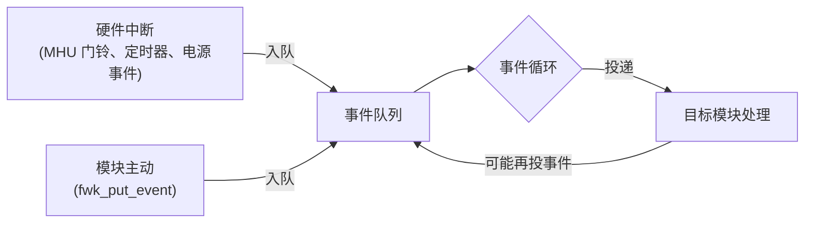
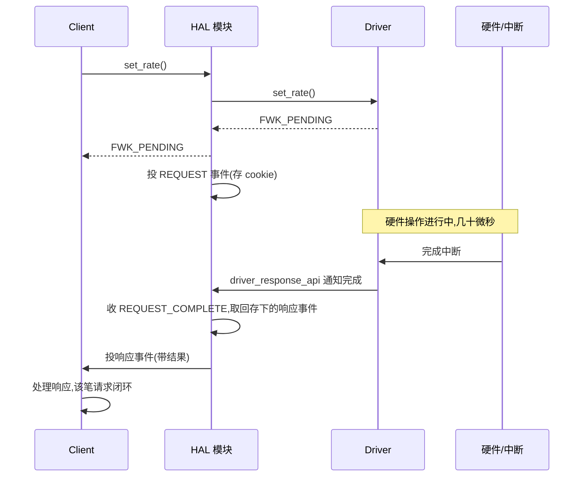

# 软件框架(二):事件、通知与延迟响应

> [上一篇](./02-framework-module-system.md)立起了模块骨架与标识体系。本篇讲运行时:SCP 没有操作系统,却要同时应对来自 AP、安全固件、中断的并发请求——它靠什么调度?答案是**事件驱动**:一切模块间协作都表现为"投递给目标的事件"被排队、被处理。本篇回答:事件和通知是什么、为什么"慢操作"必须做异步、以及那套延迟响应链怎么绕。事实来源:仓库 `doc/framework.md`、`doc/deferred_response_architecture.md`、`framework/src/fwk_core.c` 与 `module/clock/`。
>
> **本章位置**(见 [README 全景](./README.md)):旅程表第 9 段(异步回环)的框架层实现:FWK_PENDING 之后,事件怎么把结果送回请求方。

## 1. 运行时为什么是事件驱动

SCP 的运行时没有进程、没有调度器、没有锁——只有一个**事件循环**:从队列取出事件、投给目标模块、等模块处理完再取下一个(`doc/framework.md` §Runtime phase)。



为什么不用 RTOS 的线程/信号量?三条理由:

| 约束 | 事件模型的应对 |
| --- | --- |
| 芯片内 SRAM 小、无大堆 | 事件是固定大小的结构(`FWK_EVENT_PARAMETERS_SIZE = 16` 字节参数区,`fwk_event.h:38`),整个固件的事件存储是一个**静态池**——一次性 calloc 出全部事件槽(分配在 `fwk_core.c`,数量 `FWK_MODULE_EVENT_COUNT` 由 `fwk_module.c:429` 传入;默认 64,产品经 `fmw_notification.h` 的 `FMW_NOTIFICATION_MAX` 调大,如 TC3 配 128) |
| 电源操作要求确定性 | 单线程按序处理,天然无锁、无优先级翻转 |
| 模块间强制低耦合 | 处理方不必知道调用方上下文,投递即解耦 |

"池"这个细节值得展开:事件不用 malloc,固定槽位循环复用,所以事件循环跑多久都不会产生内存碎片——这是"事件必须又小又定长"的原因,也是它和 RTOS 风格(每笔请求动态分配一个消息对象)的本质区别。

代价是:任何模块的处理函数都不能阻塞太久——否则整个事件队列无法继续推进。这直接催生了下文所有"慢操作异步化"的设计。

## 2. 事件:source 投给 target 的结构化消息

`struct fwk_event`(`framework/include/fwk_event.h:48`)是模块间协作的载体:

```c src="./src/SCP-firmware/framework/include/fwk_event.h" lines="48-92" anchor="fwk_event"
```

几个字段决定了它的语义(结合 `doc/framework.md` §Events):

- `source_id` / `target_id`:投递路径,用上一章的 `fwk_id` 指认;
- **`response_requested`**:源是否期待回包。期待时,接收方处理完通过"反向投递一个 `is_response` 事件"返回结果——**请求和响应都是事件,只是反过来投**;
- `cookie`:一次请求的身份标记,让对应响应能对上号;
- `params`:16 字节参数区,消息载荷。

抽象字段不够直观,看一个真实的"回包事件"是怎么填的。电源域问 clock:"我要进待机了,你反对吗?"clock 在通知响应回调里把结果填进一个事件投回去(`module/clock/src/mod_clock.c:778`):

```c src="./src/SCP-firmware/module/clock/src/mod_clock.c" lines="778-785" anchor="clock-response-event"
```

六行初始化,把响应事件需要的路由字段(id、target_id、cookie 与三个标志位)都显式填了:

- `.id`——这是"对 power_domain 那条通知的响应",所以 id 就是**原通知的 id**;
- `.target_id`——投回给电源域(当初配置里存下的 `pd_source_id`);
- `.cookie`——从自己的通知上下文取回,用于在框架中匹配对应的原请求;
- `is_notification = true` + `is_response = true`——两个 bool 说明"我是通知的响应";后面 820 行一个 `fwk_put_event(&pd_response_event)`,答案就被投递出去。

> **核心要点**:SCP 里"远程调用"的唯一合法形式就是"投一个事件、等一个事件回来"。直接跨模块调函数只在 Bind 好的 API 上进行(且语义是同步的);要跨模块、要排队、要异步,就投事件。

## 3. 通知:给"订阅者"广播状态变化

设备状态变了(温度越限、电压下探、一次电源域状态切换),SCP 里的其他模块需要知道。事件是点对点,通知是**一对多**:

- 模块声明 `notification_count`(见 `struct fwk_module`),其他模块可**提前订阅**;
- 状态变化时广播;框架遍历订阅表逐个投递,只把订阅总数返回给广播方;
- 通知也可以要求响应——需要一个"大家都答完了吗"的计数语义,框架会把订阅总数告诉广播方,便于聚合(`doc/framework.md` §Notifications)。

02 章 §6 的 pl011 就是订阅者实物:它在 start 阶段调 `fwk_notification_subscribe(power_state_transition, ...)`,等电源域上线后把自己标成 `powered`。订阅方是 pl011,播报方是 power_domain——两家都不需要知道对方是谁,只共享一个通知 id。

"通知也可以要求响应"在 clock 那段代码里也能看到实物:电源域切换状态前发 `pre_transition` 通知征询,clock 的响应里如果给了非 SUCCESS 状态(805-808 行),电源域这次切换就被**否决**——通知响应不只是"知道了",还能否决对方的操作。

一个直觉:通知 = 事件 + 订阅关系表。它让"事件源"和"消费者"都无需互相知道对方存在,是解耦的再上一次台阶。

## 4. 延迟响应:慢硬件操作怎么不阻塞事件循环

### 4.1 问题

调一次频、把一个域上电,硬件动作要几十上百微秒。如果处理模块在事件里"等待操作完成",事件循环就会被阻塞——而它身后可能排着 AP 的紧急请求。SCP 的答案是**延迟响应(deferred response)**:操作分两段,先返回"已受理(PENDING)",完成后再补发"完成"。

### 4.2 三个角色

`doc/deferred_response_architecture.md` 定义了三个角色:

| 角色 | 行为 |
| --- | --- |
| **Client** | 调 HAL API 的模块,收到 `FWK_PENDING` 后必须准备接收响应事件 |
| **HAL 模块** | 中介:调用驱动,若驱动 `FWK_PENDING`,它给自己投一个 REQUEST 事件挂起这笔请求,并把 cookie 存下 |
| **Driver** | 直接碰硬件;做不完就回 `FWK_PENDING`,完成后通过 `driver_response_api` 返回结果 |

### 4.3 完整链路

以一次"设频率"为例(把 `deferred_response_architecture.md` 的时序整理成事件视角):



链路里两个事件 id 都能按 02 章 §3 的方法算出实际值。clock 模块的 REQUEST 事件枚举是 `MOD_CLOCK_EVENT_IDX_SET_RATE_REQUEST`(0 号,`mod_clock.h:646`),Morello ramfw 里 clock 索引 15,于是 HAL 自投的事件 id:

```text
FWK_ID_EVENT(FWK_MODULE_IDX_CLOCK, MOD_CLOCK_EVENT_IDX_SET_RATE_REQUEST)
  = type[3:0]=6 | module_idx[11:4]=15 | event_idx[17:12]=0
  = 0x000000F6
```

链路里最绕也最关键的两步:

- **HAL 给自己投 REQUEST 事件**(PE1):把"这笔请求"从调用栈上下文里取出,变成队列里一个可追踪的挂起项——这样"从响应到原请求"的对应关系有处安放(cookie);
- **驱动完事时,经 `driver_response_api` 回投 REQUEST_COMPLETE 给 HAL**(PE2):完成回调不直接沿调用栈返回,而是翻译成一个 HAL 能处理的事件——"取出结果、补发响应"于是也回到事件上下文里做,保持单一入口的处理纪律。

新手写 SCP 模块最容易犯的错误就是**在驱动/HAL 里同步等硬件**:看起来可以工作,却会阻塞整个事件循环。凡是可能超过几微秒的操作,一律走上面的链。

## 5. 和 SCMI 的延迟响应对上号

两套异步机制在 SCP 内部其实是一回事的两面:

| SCMI 侧(协议层) | fwk 侧(框架层) |
| --- | --- |
| 异步命令:平台先回接受,执行完成后再发 **delayed response**(消息头 `message_type=2`,同 token,SCMI §3.1.2) | 模块对 SCMI 命令的处理返回 `FWK_PENDING`,由事件链保证补发响应 |
| token 把"响应"和"原请求"对上 | cookie 记录挂起请求 |
| agent 必须处理 delayed response 事件 | client 必须处理响应事件 |

也就是说:[01 章](./01-system-multicore-interaction.md)里 SCMI 的"异步命令 → delayed response"在 SCP 固件内部的落地,就是本章这套事件 + 延迟响应机制。理解任意一侧,另一侧就能照着走。

## 6. 小结

- 运行时不基于线程,基于**事件循环**:确定性、无锁、SRAM 友好——事件池为 64~128 个静态槽位,跑多久都不产生碎片;
- 事件 = **source→target + response_requested**,响应就是 `is_response=true` 的事件反向投回;通知 = 事件 + **订阅关系**,响应还能否决(电源域切换征询);
- 慢操作统一走 **FWK_PENDING → 事件链 → 补发响应** 的延迟响应模式,代价是每笔异步请求多几次事件投递,换来整个系统的响应不被单个硬件操作拖死;
- 这套机制与 SCMI 的 delayed response 一一对应——协议层的异步在框架层有实体支撑。

框架的知识到这里闭环。下一组问题转向**它如何启动起来**:[04 启动与初始化](./04-boot-and-init.md)从复位向量走到事件循环,看初始化是如何逐层完成的。
