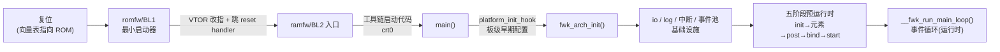

# 启动与初始化:从复位向量到事件循环

> 前置:02/03 讲了框架的骨架(模块、标识)与运行时(事件、延迟响应)。本篇把 02 里"五阶段"放到时间轴上,回答一个更朴素的问题:**固件上电后,代码是怎么一步步走到事件循环的**。([08](./08-mcp-boot-handshake.md) 的 MCP 启动互锁,是这套链路上"多一颗核要等对方"的特例,可后看。)事实来源:`arch/arm/arm-m/`、`framework/src/fwk_arch.c`/`fwk_core.c`/`fwk_module.c` 与 `doc/framework.md`。
>
> **本章位置**(见 [README 全景](./README.md)):旅程表第 4 段之前的事:固件自己怎么从复位走到事件循环——没有这一步,链上任何一段都无从谈起。

## 1. 全景:一条链

固件不是从模块的 `init` 开始的——在第一个模块函数被调用之前,CPU 已经跑完 ROM 固件、跳进 RAM、配好栈和向量表。整条链:



链路的前半段(复位→ramfw)是"谁把固件搬进内存、谁把 PC 指过去";后半段(ramfw→事件循环)是框架自己的初始化。本篇按这条链往下走。

## 2. 复位到 RAM 固件:加载与控制权交接

arm-m 侧 **没有自己的 crt0/startup 汇编**——异常向量表的复位向量指向架构层的 C 函数 `arch_exception_reset()`(`arch/arm/arm-m/src/arch_handlers.c`),它把初始化交给**工具链的 C 运行环境**:ArmClang 进 `__main`、GCC/Newlib 进 `_start`,由它们清零 ZI 段、拷入已初始化数据,最后调 `main`。SCP 不依赖 CMSIS 设备启动文件的 `Reset_Handler`,架构层只提供两样东西:

- **链接脚本**(`arch/arm/arm-m/src/arch.scatter.S`):按 `FMW_MEM_MODE` 决定内存布局。`SINGLE_REGION` 全部放入一块 SRAM;`DUAL_REGION_RELOCATION` 把只读/可执行放 MEM0、读写放 MEM1——这就是 scp_ramfw 把 `SCP_RAM0` 放代码、`SCP_RAM1` 放数据的物理依据(具体见 [05](./05-build-and-deploy.md));
- **RAM 固件的入口约定**:镜像开头是**向量表**,复位时硬件从表里取 SP 与复位入口;romfw 把 ramfw 复制进 SRAM 后,加载者要**手动补做复位时硬件自动做的两步、再跳转**(机制见下)。

**背景:Cortex-M 的启动由向量表驱动。** 镜像开头是一张 32 位地址表:

| 位置 | 内容 |
| --- | --- |
| 字 0(+0x00) | 初始栈指针(SP)初值 |
| 字 1(+0x04) | 复位处理函数入口 |
| 字 2 起 | 各异常/中断的处理地址 |

芯片复位瞬间,硬件自动执行 `SP ← 表[0]`、`PC ← 表[1]`,不需要任何软件参与。上电时表在 `0x00000000` 的 ROM 里,CPU 从此开始执行 romfw。

而 romfw 把 ramfw 复制进 SRAM 后,CPU 已在运行中——复位只会回到 ROM 开头,不能再复位一次。所以加载者**手动补做复位时硬件自动做的那两步**,再跳转(以 Morello 为例,ramfw 位于 `SCP_RAM0_BASE = 0x00800000`):

1. 从 `0x00800004`(ramfw 向量表的字 1)读出复位入口地址——等价于复位时的 `PC ← 表[1]`;
2. 把 `SCB->VTOR` 写成 `0x00800000`——VTOR 是**向量表基址寄存器**,不写的话,后续任何中断/异常仍会取 ROM 里的旧表、跳回已弃用的 romfw;
3. 跳转执行——等价于 `PC ← 入口`。SP 无需处理:跳转瞬间临时用 romfw 的栈,工具链启动代码会按链接脚本为 ramfw 建好自己的栈。

三步之后,执行流从 ROM 转入 SRAM,ramfw 从 `arch_exception_reset` 进 C 运行时、再进 `main`。MCP 侧同样的收尾代码在 [06](./06-mcp-manageability.md) §3 的 [`jump_to_ramfw()`](./06-mcp-manageability.md#jump-to-ramfw)。

"加载者"是谁,参考平台给过两种答案:

- **Morello**:SCP 和 MCP 各自的 **romfw 自己从 QSPI flash 的 FIP 里读 ramfw**。scp_romfw 的 `config_morello_rom.c` 里 `.image_type = MOD_FIP_TOC_ENTRY_SCP_BL2`、`.ramfw_base = SCP_RAM0_BASE`——romfw 用 `fip` 模块解出镜像,搬过去,改 `VTOR` 跳;
- **另一些平台**:ramfw 由 TF-A BL2 放进 SCP SRAM 再放行(所以 FIP 里那张"SCP_BL2"的 TOC 表项两种路径都用得上,见 [01](./01-system-multicore-interaction.md) §3 的加载链)。

对 MCP 来说还有一层:romfw→ramfw 交接之后,它**并不立刻往下跑**,而是先去等 SCP 的握手([08](./08-mcp-boot-handshake.md) 的序列)。SCP 自己则不需要等任何人——它是启动链上的"源头"之一。

## 3. 进入 C 代码:main() 的三步

arm-m 的 `main()` 很短:先设好 CPU 控制寄存器,再依次移交控制权。

```c src="./src/SCP-firmware/arch/arm/arm-m/src/arch_main.c" lines="66-80" anchor="arm-m-main"
```

- **`arch_init_ccr()`**(仅非 ARMv6-M):在 System Control Block 的 CCR 里打开 `DIV_0_TRP`(除零进 trap;`STKALIGN` 异常入口自动栈对齐只在 ARMv7-M 打开)——固件要尽早启用"异常立即暴露"的调试策略,而不是等故障悄悄发生;
- **`platform_init_hook(NULL)`**:板级早期钩子。默认实现是空的弱函数(同一个文件 26 行 `FWK_WEAK`),平台可覆盖,做框架初始化前必须完成的板级准备——如特定 pin 配置、等待外部电源就绪;
- **`fwk_arch_init()`**:控制权交给框架,不再返回。

> 命名要小心:`arch_main.c` 在**架构层**(arch/),`platform_init_hook` 是架构层留给**平台层**的钩子。三层(架构/框架/平台)的边界在 [12](./12-arch-and-porting.md) 展开。

## 4. fwk_arch_init:先初始化基础设施,再启动模块

框架初始化做五件事,顺序有讲究:

```c src="./src/SCP-firmware/framework/src/fwk_arch.c" lines="32-72" anchor="fwk-arch-init"
```

| 步骤 | 做什么 | 为什么排这 |
| --- | --- | --- |
| `fwk_module_init()` | 登记所有模块描述符与配置、建元素上下文 | 后面每步都要查模块表 |
| `fwk_io_init()` | I/O 抽象(CLI 控制台等) | 尽早能打日志、能交互 |
| `fwk_log_init()` | 日志子系统 | 模块初始化报错要靠它输出 |
| `fwk_arch_interrupt_init()` | 中断管理(见 §5) | 事件循环要收中断 |
| `fwk_module_start()` | 五阶段预运行时(见 §4.1) | 模块就绪后才有事可循环 |

最后分岔:`BUILD_HAS_SUB_SYSTEM_MODE` 没开时,进 `__fwk_run_main_loop()` 无限循环(§6);开了则处理完已有事件就返回,把事件循环交给宿主系统(如把 SCP 固件当 RTOS/TEE 里的一个任务跑,`doc/framework.md` §Sub system runtime mode)。

### 4.1 五阶段在代码里长什么样

02 章 §6 给了五阶段语义表(init→元素 init→post-init→bind→start)。这里补的是**代码形态**:`fwk_module_start()` 把预运行时切成三大段——

```c src="./src/SCP-firmware/framework/src/fwk_module.c" lines="416-457" anchor="fwk-module-start"
```

三个细节暴露设计意图:

1. **阶段由"每模块回调"组成,按 `SCP_MODULES` 列表顺序逐个推**。`fwk_module_init_modules()` 遍历模块表,对每个模块先 `init`、再元素级 `element_init`、再 `post_init`——"先把自己元素的配置收齐,才能和别的模块打交道"这条约束被阶段次序显式化;
2. **Bind 跑两轮**(`round=0` 与 `round=1`,`FWK_MODULE_BIND_ROUND_MAX`)。每一轮把模块和元素都过一遍,让模块的 `bind()` 有机会在第二轮补上第一轮还没就绪的绑定;只有到最后一轮,状态才真正置为 `BOUND`;
3. **Start 之后才置 `initialized`、才打 "[FWK] Module initialization complete!"**——"固件初始化完成"的定义是五阶段全部结束,不是 `main` 返回(它也不返回)。

## 5. 中断怎么进事件循环:重装向量表 + ISR 队列

02/03 讲过运行时"没有线程、只有事件队列"。它的物理基础在 arm-m 上由 `arch_interrupt_init()` 搭起来:固件**不用 ROM 里那份静态向量表,而是按硬件实际中断数重造一份放 SRAM**,再把自己的回调挂进去:

```c src="./src/SCP-firmware/arch/arm/arm-m/src/arch_nvic.c" lines="244-303" anchor="arch-nvic-init"
```

要点:中断数不是编译期写死的——从 `ICTR` 读出硬件实现的线数(`(intlinesnum+1)*32`),据此分配回调表与对齐的向量表,把系统异常表从 `SCB->VTOR` 拷进新表,再让 `VTOR` 指到新表。

中断真正"变成事件"在 `fwk_core` 里:ISR 只做最少的入队,绝不在中断现场跑模块代码——

```c src="./src/SCP-firmware/framework/src/fwk_core.c" lines="256-284" anchor="process-isr"
```

`process_isr()` 将 `isr_event_queue` 中 ISR 投入的事件移入主 `event_queue`。中断与普通事件走同一个队列、同一条 `process_next_event()` 路径——这就是"SCP 处理并发请求而不加锁"的机制:没有抢占式多任务,只有"谁先入队谁先被处理"的确定性。

## 6. 事件循环本体:消费、休眠与唤醒

预运行时结束后,固件进入一个"永不返回"的循环:

```c src="./src/SCP-firmware/framework/src/fwk_core.c" lines="327-335" anchor="run-main-loop"
```

`fwk_process_event_queue()` 把队列**消费到空**(普通事件清了还会把 ISR 搬进来的事件一并处理,见 §5);`fwk_log_unbuffer()` 有机会刷出缓冲的日志;若无事可做,`fwk_arch_suspend()` 执行 `WFE` 进入低功耗等待,中断/事件到来后回到循环顶。于是:

> **核心要点**:固件的"空闲"就是 `WFE`,固件的"忙碌"就是事件队列被逐条消费——没有线程调度器,事件循环本身就是唯一的"线程"。

对 MCP(见 [08](./08-mcp-boot-handshake.md))来说,循环跑起来后最先消费的是一串"等 SCP 握手"的自事件——`start` 阶段只投第一个,之后每步校验通过就再投下一个,整条启动序列由事件循环逐事件驱动;对 SCP 来说,循环一旦跑起来,来自 MHU 门铃的中断(SCMI 消息到达)、来自 timer 的告警,都会以事件形式进队——[03](./03-framework-events-deferred.md) 的延迟响应链、[11](./11-scmi-protocols.md) 的消息处理,全都在这里转。

## 7. 小结

- **三段启动**:ROM 最小加载器 → RAM 全量固件(改 VTOR 交接控制权)→ C 代码层的框架初始化;
- **两处平台钩子**:`platform_init_hook`(架构层留、平台层填)与 `fwk_module_start` 里的模块回调;
- **五阶段预运行时**由框架代码显式排段(init→元素→post→bind×2→start),不是靠模块自觉;
- **中断不打断逻辑**:ISR 只入队,事件循环统一处理,天然无锁;
- **运行时状态**:"初始化完成"= 五阶段结束;此后固件就是"事件循环 + WFE"的永恒交替。

代码怎么被编出来、怎么摊进那两块 SRAM、怎么知道该放哪——下一章进入构建与部署:[05 构建与部署](./05-build-and-deploy.md)。
