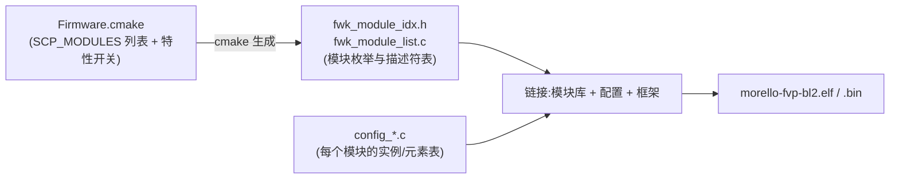

# 构建与部署:一份源码,六份固件

> 前置:04 章把固件从复位到事件循环讲清了,但是"这六份镜像(SCP/MCP × rom/ram,还有 fvp/soc 两版)是怎么从一个仓库编出来的"还没交代。本篇回答:构建系统怎么把**产品和固件两层配置**折叠成一份可执行文件,以及为什么**改一个模块列表就足以改变整套固件的行为**。事实来源:`doc/build_system.md`、`doc/build_configurations.md`、`product/morello/`。
>
> **本章位置**(见 [README 全景](./README.md)):全景图上每个固件盒子(scp/mcp × rom/ram)怎么从同一份源码编出来;改模块清单为什么能改行为。

## 1. 全景:一次构建发生什么

一次 `make`(以 Morello 为例)会编出 **6 份固件**(SCP/MCP 的 romfw/ramfw 各一,ramfw 还有 fvp/soc 两版)。每一份走同一条链路:



配置分布在四类文件里,各管一件事——概念上是 product → firmware → module 三层,固件层拆成"模块清单"与"实例配置"两个文件。这一节先看全局,后面逐层拆。

| 层 | 文件 | 决定什么 |
| --- | --- | --- |
| 产品 | `product/morello/product.mk` | 这个产品要编哪些固件 |
| 固件(模块清单) | `product/morello/<fw>/Firmware.cmake` | 这一份固件的模块列表、架构、特性 |
| 固件(实例配置) | `product/morello/<fw>/config_*.c` | 每个模块在这一份固件里的实例配置 |
| 模块 | `module/<x>/Module.cmake` | 该模块的源码/库在哪 |

## 2. 产品层:product.mk 决定构建哪些固件

`product.mk` 极短,只回答一个问题:**这个产品由哪些固件组成**:

```make src="./src/SCP-firmware/product/morello/product.mk" lines="8-15" anchor="product-mk"
```

注意列表里的分组语义:SCP/MCP 各有 romfw + ramfw;ramfw 按目标平台算两个(`_fvp` 给 Fixed Virtual Platform,`_soc` 给真实硅片)。加一个固件只是在 `BS_FIRMWARE_LIST` 里多写一行,并补一个同名目录。

## 3. 固件层:Firmware.cmake 决定单份固件的构建配置

每份固件目录下有 `Firmware.cmake`,它是编程式配置的枢纽——模块列表、架构、编译特性全在这里(以 mcp_ramfw_fvp 为例):

```cmake src="./src/SCP-firmware/product/morello/mcp_ramfw_fvp/Firmware.cmake" lines="8-41" anchor="fw-cmake"
```

三个关键渠道:

1. **`SCP_MODULES` 列表 = 这份固件的模块清单**。这份 kebab-case 列表同时决定三件事:模块被编进固件、它在 `SCP_MODULES` 里的**顺序**(初始化顺序,见 [04](./04-boot-and-init.md) §4.1)、以及其 fwk 模块索引的枚举值(`FWK_MODULE_IDX_*`)。
2. **`SCP_MODULE_PATHS`** 说明产品私有模块放哪。产品专用模块(如 `scmi-agent`、`morello-mcp-system`)不在顶层 `module/`,而是 `product/morello/module/` 下,靠 `list(PREPEND SCP_MODULE_PATHS ...)` 补进搜索路径——模块没有天然"必须放哪",路径是显式给的。
3. **`*_INIT` 系列开关**是特性配置的入口(默认值在此设定):`SCP_ENABLE_NOTIFICATIONS_INIT`、`SCP_ENABLE_OUTBAND_MSG_SUPPORT_INIT`,还有架构 `SCP_ARCHITECTURE "arm-m"`、工具链 `SCP_TOOLCHAIN_INIT`(详见 [12](./12-arch-and-porting.md))。这些开关在构建时变成 `BUILD_HAS_*` 宏,让模块源码里用 `#ifdef` 裁剪特性——注意两套名字:`build_configurations.md` 记作 `SCP_ENABLE_NOTIFICATIONS`/`SCP_ENABLE_OUTBAND_MSG_SUPPORT`,`_INIT` 后缀是固件在 `Firmware.cmake` 里给这些缓存变量设的初值。

> **一份固件 = 一组模块 + 一组开关**。要做出"管理轻固件",给 MCP 的列表填 11 个模块;要在所有 SCP 固件中禁用某个协议,改一个开关——这就是 [02](./02-framework-module-system.md) 里"配置驱动、代码通用"的构建侧落地。

## 4. 固件层:config_*.c 实例化各模块

`Firmware.cmake` 说"要哪些模块",`config_*.c` 说"每个模块在这么一份固件里是什么样"。scp_ramfw_fvp 的 `CMakeLists.txt` 罗列了整份配置:

```cmake src="./src/SCP-firmware/product/morello/scp_ramfw_fvp/CMakeLists.txt" lines="20-50" anchor="fw-target-sources"
```

写法规律:`config_<模块名>.c` 里定义 `const struct fwk_module_config config_<模块名>`,内容是一个表——每个元素的 name、data、及其引用的驱动/api。例如 config_transport.c 里每个 service 是一个 transport channel(SCP 侧按 agent 各开一条,叫 `PSCI`/`OSPM`/`MCP`;MCP 侧那条 fvp 变体叫 `MANAGEMENT-NS`、soc 变体叫 `MANAGEMENT-S`,见 [07](./07-mcp-scmi-agent.md) §1);config_power_domain.c 里每个元素是一个电源域。

**名字就是契约**:`config_<name>` 符号由构建期生成的 `fwk_module_list.c` 引用(见 §5),漏定义一个模块的 config,链接立刻报错。模块表(descriptor 表)是固定的、代码写死的;配置表是每份固件重新生成的。

## 5. 生成文件:代码与配置在构建期对接

框架遍历 `SCP_MODULES`,为固件生成两个文件(模板与生成调用在 `framework/CMakeLists.txt`;说明见 `doc/build_system.md` §Module Code Generation):

- **`fwk_module_idx.h`**:模块索引的枚举,顺序与 `SCP_MODULES` 完全一致;
- **`fwk_module_list.c`**:两张表,
  - `module_table[FWK_MODULE_IDX_COUNT]`——指向每个 `module_<name>` 描述符,
  - `module_config_table[FWK_MODULE_IDX_COUNT]`——指向每个 `config_<name>` 配置。

生成的 `module_table`/`module_config_table` 就是 [04](./04-boot-and-init.md) §4 `fwk_module_init()` 遍历的那两张表(`fwk_module_ctx.module_ctx_table[i].desc/.config`)。模板在此:

```c src="./src/SCP-firmware/framework/src/fwk_module_list.c.in" lines="14-23" anchor="fwk-module-list-gen"
```

于是"运行时怎么知道有哪些模块、每个模块的配置在哪"有了答案:**构建期生成,顺序即索引**。把规则落到 Morello scp_ramfw_fvp 的真实列表上:第 1 项 pl011 → `FWK_MODULE_IDX_PL011 = 0`,第 4 项 power-domain → `= 3`,第 16 项 clock → `= 15`——[02](./02-framework-module-system.md) §3 手算的那些 id 值,源头就是这份列表的顺序。这也是为什么 `SCP_MODULES` 的顺序不能乱动——动一个,所有 `FWK_MODULE_IDX_*` 枚举跟着变,配置和驱动对不上。

## 6. 内存布局:bin 的内容与存放位置

镜像怎么摊进 SRAM,由链接脚本 + `fmw_memory.h` 决定。Morello SCP 的 ramfw:

```c src="./src/SCP-firmware/product/morello/scp_ramfw_fvp/fmw_memory.h" lines="14-30" anchor="fmw-memory"
```

| 常量 | 值 | 含义 |
| --- | --- | --- |
| `FMW_MEM_MODE` | `ARCH_MEM_MODE_DUAL_REGION_RELOCATION` | 双区且 data 段搬移(见下) |
| `FMW_MEM0` | `SCP_RAM0`:0x00800000,512 KiB | 代码 + 只读,`-RO` 段 |
| `FMW_MEM1` | `SCP_RAM1`:0x20000000,256 KiB | `-RW` 段(data/bss/堆栈) |

双区搬移的意义:代码与只读数据常驻 MEM0,会把写的段(data/bss/栈)放在 MEM1——镜像在 MEM0 被 romfw 载入后,搬移只做一次,后续运行时的写流量都落在 MEM1,不占代码侧空间。链接脚本模板(`arch/arm/arm-m/src/arch.scatter.S`)按 `FMW_MEM_MODE` 提供三种布局:`SINGLE_REGION` 全部放在一块内存,juno/TC 的 RAM 固件用它(它们的 ROM 固件仍是双区);Morello 的六份固件则全是 `DUAL_REGION_RELOCATION`。

烧录形态:`SCP_GENERATE_FLAT_BINARY_INIT TRUE` 让构建额外产出**扁平二进制 `.bin`**——romfw 从 FIP 里载入的就是它(04 章 §2);`.elf` 留着调试。产物落在 `build/<product>/<工具链>/<构建模式>/firmware-<固件>/bin/`(`Makefile.cmake` 的 `PRODUCT_BUILD_DIR`,加上 cmake 的 `RUNTIME_OUTPUT_DIRECTORY "${CMAKE_BINARY_DIR}/bin"`)。

## 7. 构建命令与工具链

```bash
make -f Makefile.cmake PRODUCT=morello     # 编 product.mk 里全部固件
make -f Makefile.cmake help                # 查看可用的构建目标
```

工具链按固件选择(`SCP_TOOLCHAIN_INIT`,可被 `-DSCP_TOOLCHAIN` 覆盖):`GNU`(arm-none-eabi-*,默认)、`ArmClang`、`Clang`(`SCP_LLVM_SYSROOT_CC` 需指向 sysroot)。每个固件目录下的 `Toolchain-<名>.cmake` 定义了具体命令(`build_system.md` §Toolchain)。

工程实践两条:

- **调整模块顺序须先评估影响**:调整列表不是格式整理,而是改变索引与初始化顺序(04 章 §4.1 讲了顺序为什么会出问题);
- **加模块 = 三步**:写 `module/<x>/`(或 `product/<名字>/module/`)→ 在 `Firmware.cmake` 的 `SCP_MODULES` 追加 → 补 `config_<x>.c`。缺第三步,链接器直接报 `config_<x>` 未定义。

## 8. 小结

- 六份固件、一份源码:**product → firmware → module** 三层配置折叠成每份固件的 target,框架代码零改动;
- `SCP_MODULES` 是单点真相:成员、顺序、索引都由它定,构建期生成 `fwk_module_idx.h`/`fwk_module_list.c`;
- `config_<name>.c` 与生成的 `module_config_table` 按名字对接,漏配即链接错误;
- 内存以 `fmw_memory.h` + 链接脚本(MEM_MODE)落地,双区搬移是参考平台的常见形态;
- 一份固件 = 模块清单 + 开关 + 配置表 + 内存布局,四样齐了才是完整镜像。

这些模块真正执行功能的部分——电源、性能、时钟——是下一章的主题:[10 电源/性能/时钟管理核心](./10-power-performance-core.md)。