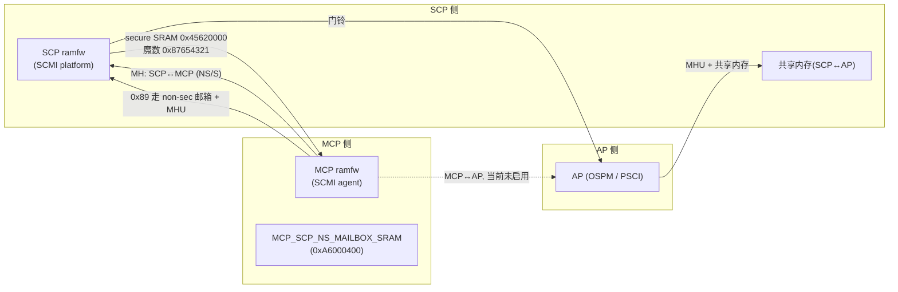

# MCP 总览:管理面协处理器

> 02-05 讲了 SCP-firmware 的公共骨架(模块、事件、启动、构建)——那不是 SCP 专属。本篇起进入 MCP 主线:**同一套框架里,第二颗协处理器 MCP 如何运行**。先回答"MCP 是谁、管什么、与谁通信、如何构建",再给一张地图让你知道后面三章各去哪儿。事实来源:`product/morello/` 下的 `mcp_romfw`/`mcp_ramfw_fvp`/`mcp_ramfw_soc` 与 product-local 模块;§1 的分层对照还用了 git 历史(`0a5b4b58^` 之前 9 个配过 MCP 固件的 product)与 reference/ 的 Neoverse V2 RD 技术总览(§3.8/§4.3.7.1/§6.3)。
>
> **本章位置**(见 [README 全景](./README.md)):MCP 主线入口:全景图右下那颗管理面协处理器是谁、在哪、怎么装。

## 1. 它管什么:与 SCP 同源,分工不同

MCP 是与 SCP **同源的第二颗协处理器**:同一颗 SoC 上,运行同一套 SCP-firmware 代码、同一套 fwk 框架、同样的 romfw→ramfw 启动流程(见 [02](./02-framework-module-system.md)、[04](./04-boot-and-init.md))。区别不在代码,而在**承担的职责**:

| | SCP | MCP |
| --- | --- | --- |
| 职责定位 | 控制面:实时电源/时钟/复位路径 | 管理面:监控、电源协商、带外通道 |
| 典型任务 | 电源域上下电、调频调压、系统复位 | 温度/功耗监控、电源协商、故障上报 |
| 服务节奏 | 响应 AP/固件的实时请求(毫秒级) | 低频全局采集;SCP 休眠时也要能响应 |

这组对照点出的本质不是"谁强谁弱",而是**节奏与范围**:SCP 守在实时控制路径上(确定、无锁、毫秒级),MCP 采集的是低频的全局状态(跨 die、秒级),还要求独立存活(带外)。PCSA(见 [00](./00-scp-overview.md))把两者排在同一级平台控制器,MCP 名字里那个 "Manageability" 就是这个意思——**管得着,不是控制**。

为什么不由 SCP 一并承担管理功能:

- 管理面请求频率低(秒级采集),而 SCP 的中断/事件路径要求确定、无锁、不被慢速外设拖住;
- 管理功能横跨整颗芯片(看全局温度、查所有域的计数器),放独立核,SCP 只管自己局部;
- 带外通道(如唤醒、故障上报)甚至要在 SCP 休眠时仍能响应。

### 分工的两层:规划里的,和代码里的

上表是**规划**,读的时候要分清证据层级——否则容易得出"PMIC 归 MCP"这类误读。DVFS 调频必然伴随调压,调压的物理端点就是 PMIC,而这条链路自始至终长在 SCP 身上。三个层级各有自己的事实来源:

| 证据层 | SCP 侧 | MCP 侧 |
| --- | --- | --- |
| PCSA 蓝图(规范) | 电源与系统管理的执行者 | 可管理性入口:SPMI 连 PMIC、SMCF 采监控(见 [09](./09-mcp-management-hardware.md)) |
| 平台文档(Neoverse V2 RD 技术总览) | "manages the overall power, clock, reset, and system control"(§3.8.1);核心域上电时"turns on the VCPUn voltage rail through an external PMIC"(§4.3.7.1) | "control all the manageability functions and RAS features",可扩展与外部 BMC 通信(§6.3) |
| 参考实现(v2.16 基线 + git 历史) | 真打 PMIC 的链路全在这:Juno XRP7724→I2C、Morello XR77128→cdns-i2c、TC/FVP 为 mock | 9 个 product 配过 MCP 固件,职责止于启动协作/SCMI agent/调试台;SPMI/SMCF 无一启用(见 [09](./09-mcp-management-hardware.md) §4) |

两层合读:**"MCP 管管理面"是规范与平台文档的规划;公开参考实现里,电源调压(含打 PMIC)从来都是 SCP 的职能,MCP 的管理面从未真正接线**。"某项硬件归谁"这类问题必须钉到"哪一层证据 + 哪个固件目标"——拿单一 product 的模块表反推 SCP/MCP 边界,两头都会错:要么把 MCP 矮化成"没用的核",要么把蓝图当成现状。

历史 MCP 固件的谱系也印证这一点:Morello/N1SDP 是"启动协作 + scmi-agent"(本系列 [07](./07-mcp-scmi-agent.md)/[08](./08-mcp-boot-handshake.md) 讲的);SGI-575/RD-N1E1/RD-N2/RD-V1 更轻,只剩 `mcp-platform` + `debugger-cli`;RD-V3 加了 `scmi-sys-power`。没有一个长成蓝图里的模样——也没有任何一个让 MCP 碰过电源。

> **核心要点**:SCP 与 MCP 的边界是"控制面 vs 管理面"——实时路径与低频全局采集分开,互相不拖累。这条边界属于规划层,在参考实现里核对时按上表逐层对号。

## 2. 它在系统里的位置:两只手,各握一对 MHU

MCP 与 SCP 与 AP 的物理关系,是理解后文所有启动依赖与查询关系的起点:



关键落在**两条通往 SCP 的通道**上,这决定了 MCP 的启动方式(见 [08](./08-mcp-boot-handshake.md)):

- **secure 共享 SRAM**(`MCP_SCP_SHARED_SECURE_RAM 0x45620000`):承载单向的握手魔数;
- **MHU + non-secure 邮箱**(`MCP_SCP_NS_MAILBOX_SRAM`):承载双向的 **0x89 协议查询**(见 [07](./07-mcp-scmi-agent.md))。

MCP 的 MHU 有两套:连 SCP 的在 `0x45600000`(`MCP_MHU_SCP_BASE`)——不在 MCP 自己的 `0x4C000000` 外设段,而是落在 SCP 一侧、紧挨 secure SRAM;连 AP 的在 `0x4C400000`(`MCP_MHU_AP_BASE`,图里那条虚线,当前未启用;`0x4C000000` 是 MCP 外设段基址 `MCP_PERIPH_BASE`)。

同一对寄存器,SCP 与 MCP 从各自的基址看,落到同一片物理硬件——MCP 侧 `MHU_SCP_TO_MCP_NS`/`MHU_MCP_TO_SCP_NS`,SCP 侧一一对应。这也是为什么"通道角色"在配置里反着写(07 章),但两边照样对上。

## 3. 固件形态:同一框架,更小的裁剪

MCP 也走 **romfw → ramfw** 两段:

- **mcp_romfw**(`morello-mcp-bl1`):最小 BL1。模块只有 `pl011`/`fip`/`morello-rom`/`clock`——初始化 UART 和时钟后,事件回调 `morello_rom_process_event()` 先用 `fip_api->get_entry()` 从 FIP 里定位 `MOD_MORELLO_FIP_TOC_ENTRY_MCP_BL2`、`memcpy` 搬到 `MCP_RAM0_BASE`,最后 `jump_to_ramfw()` 收尾。下面只贴收尾这段——改 `VTOR`、取 reset handler、跳转:

```c src="./src/SCP-firmware/product/morello/module/morello_rom/src/mod_morello_rom.c" lines="46-67" anchor="jump-to-ramfw"
```

- **mcp_ramfw_fvp / mcp_ramfw_soc**(`morello-fvp-mcp-bl2` / `morello-soc-mcp-bl2`):完整模块化固件。同一套 fwk 框架、同样的五阶段生命周期(init→element→post-init→bind→start,见 [02](./02-framework-module-system.md))、同样的 `start` 后进事件循环([03](./03-framework-events-deferred.md))。

模块列表暴露了 MCP 的"轻"——和 SCP 同一平台的 ramfw 对比:

```cmake src="./src/SCP-firmware/product/morello/mcp_ramfw_fvp/Firmware.cmake" lines="17-41" anchor="mcp-firmware-cmake"
```

| | SCP ramfw(同平台) | MCP ramfw |
| --- | --- | --- |
| 模块数 | 29 | 11 |
| 电源域/PPU/DVFS/clock 管理 | 有(`power-domain`/`ppu-v1`/`dvfs`/`scmi-power-domain`…) | 无 |
| 通信方向 | SCMI **platform**(COMPLETER),响应 AP/TF-A | SCMI **agent**(REQUESTER),问 SCP |
| 特色模块 | `scmi-management`(答 0x89 协议) | `scmi-agent`(发 0x89 协议)、`morello-mcp-system`(编排启动) |

MCP 保留的 11 个模块全是"底座":MPU/UART/时钟/timer/MHU/transport/scmi,加上两个 product-local 模块。它不管理任何电源域——**电源域仍由 SCP 全权管理**。

## 4. 四条主线:哪儿讲什么

MCP 在系统里其实有四条独立可讲的主线,我在本系列里各给一章:

| 章 | 讲什么 | 一句话问题 |
| --- | --- | --- |
| 本篇 | 角色、位置、固件形态 | MCP 是谁、在哪、怎么装 |
| [07](./07-mcp-scmi-agent.md) | SCMI agent 角色 + 0x89 协议双端实现 | MCP 怎么跟 SCP"一问一答" |
| [08](./08-mcp-boot-handshake.md) | 启动互锁:与 SCP 的启动握手 | MCP 为何必须等待 SCP、如何安全启动 |
| [09](./09-mcp-management-hardware.md) | 管理面硬件蓝图:SPMI 与 SMCF | MCP 将来怎么接 PMIC、怎么采全芯片监控 |

推荐路径:本篇(定位)→ 08(启动为何依赖 SCP)→ 07(如何与 SCP 通信)→ 09(将来还要接入什么)。也可按需直入某章。

## 5. 小结

- **角色**:MCP 是管理面协处理器,与 SCP 的控制面分工——分工是规划,公开参考实现里只落了骨架(§1 分层对照);两者同框架、同仓库、同启动流程;
- **位置**:MCP 在 `0x4C000000` 有自己的外设区,靠**一对 MHU + 一块共享 SRAM** 与 SCP 通信——secure 段走魔数握手、non-secure 段走 0x89 协议,各自有明确分工;
- **形态**:romfw 最小、ramfw 完整但只有 11 个模块,全是底座,不碰电源域——电源域与 PMIC 调压都归 SCP 的链路;
- **四条主线**:总览、agent 角色、启动互锁、硬件蓝图,即本系列 06-09。

知道它在哪、怎么装之后,下一章自然要问:它到底**怎么与 SCP 通信**——答案藏在"角色反转"的配置里:[07 MCP 的 SCMI agent 角色:0x89 协议的双端实现](./07-mcp-scmi-agent.md)。
