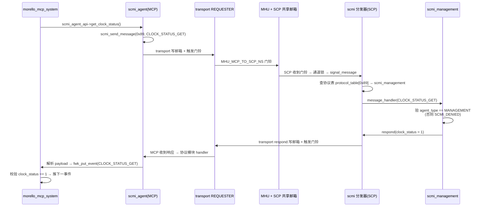

# MCP 的 SCMI agent 角色:0x89 协议的双端实现

> 前置:[06](./06-mcp-manageability.md) 总览说清了 MCP 是管理面协处理器;SCP 当 platform 怎么答 AP 的请求,在 [11](./11-scmi-protocols.md) 展开(本篇只借它的角色框架,细节可后看)。本篇转向 MCP 与 SCP 之间那对请求-应答。它在系统里是 [01](./01-system-multicore-interaction.md) §5.1 那张协议表的镜像:MCP 是 **agent(REQUESTER)**,SCP 是 **platform(COMPLETER)**。本篇回答:**同一个 fwk 分发器,怎么做到角色反着转?两台控制器内部通话,为什么不用标准协议而自造一个 0x89?** 事实来源:`product/morello/module/scmi_agent/`、`product/morello/module/scmi_management/`、`product/morello/mcp_ramfw_fvp/config_*.c` 与 `product/morello/scp_ramfw_fvp/config_scmi.c`。
>
> **本章位置**(见 [README 全景](./README.md)):MCP 短旅程(README 旅程表末段)的"打包发送"与"接收应答"两环。

## 1. 角色镜像:配置反转,而非代码分叉

[11](./11-scmi-protocols.md) 里 SCP 的 service 是 COMPLETER、答案写回 AP(见其 §1/§6)。MCP 侧同一套 fwk,只是 service 的**角色字段**从"回答"换成"发问"——代码一个字不改,行为完全反过来。这正是 SCP-firmware 的**同构设计:靠配置对称**。

先看 MCP 侧 transport 通道。它和 SCP 侧的 MCP 通道指向**同一对 MHU 寄存器**,只是各自从自己这边看:

```c src="./src/SCP-firmware/product/morello/mcp_ramfw_fvp/config_transport.c" lines="21-35" anchor="mcp-transport-requester"
```

`channel_type = MOD_TRANSPORT_CHANNEL_TYPE_REQUESTER`——这一行就是"MCP 是发请求的一方"。`out_band_mailbox_address = MCP_SCP_NS_MAILBOX_SRAM` 说明载荷不放在 MHU 寄存器里,而是放在**non-secure 共享邮箱 SRAM**;MHU 只负责传递门铃中断。这和 AP↔SCP 那对(01§6)是同一机制,只是这次 MCP 处于请求者一方。

角色再往上走一层,到 SCMI service 登记表。MCP 的 scmi 模块把 service 与 agent 身份钉在一起:

```c src="./src/SCP-firmware/product/morello/mcp_ramfw_fvp/config_scmi.c" lines="25-48" anchor="mcp-scmi-role-config"
```

`scmi_entity_role = MOD_SCMI_ROLE_AGENT` 是核心——它告诉分发器"这个 service 是 agent 侧"。而下方的 `agent_table` 里只登记了一个 `MANAGEMENT` 类型的 agent。这一份配置同时交代了三件事:**service 的实体角色、它走的 agent 身份、这个身份的授权类型**。

> **对照 [11](./11-scmi-protocols.md) §2**:SCP 侧的 `config_scmi.c` 把 `scmi_entity_role` 留成默认(platform),agent 表里登记的是 OSPM/PSCI/MANAGEMENT 三个"外部提问者"。MCP 的这张表镜像过来——只有自己是 agent,问的对象(SCP)反倒不在表里。**一张表两种形态,全是配置。**

## 2. scmi_agent:一个模块,两种角色

MCP 的 `scmi_agent` 模块在这套流程里位置特殊——它**同时扮演两个角色**:

1. **作为发起者**——暴露 `mod_scmi_agent_api`(`get_protocol_version`/`get_clock_status`/`get_chipid_info`),`morello_mcp_system` 模块调它去问 SCP;
2. **作为应答者**——把自己注册成一个 SCMI 协议模块(协议 id = 0x89),当 SCP 的响应回来时,它负责解析响应报文、再转成事件。

第二个身份不太显眼:它在**发**请求的同时,又按协议模块的注册表接**收**响应。看它怎么"注册"自己:

```c src="./src/SCP-firmware/product/morello/module/scmi_agent/src/mod_scmi_agent.c" lines="134-155" anchor="scmi-agent-dual-identity"
```

`get_scmi_protocol_id` 说"我负责协议 0x89";`handler_table` 是一张**响应消息**表——`0x0 protocol version`、`0x3 clock status`、`0x4 chipid`,全是"SCP 回答什么"的分支。`scmi_agent` 站在 agent 侧,处理的却是 **platform 发来的响应**,这正好是 11 章协议模块的镜像:那边 protocol 模块处理命令、用 `respond` 回答;这边处理回答、把结果交给上层。

真正的"发起"动作在另一侧。`morello_mcp_system` 调 `scmi_agent_api->get_clock_status(...)`,才触发一次 SCMI 请求:

```c src="./src/SCP-firmware/product/morello/module/scmi_agent/src/mod_scmi_agent.c" lines="195-229" anchor="scmi-agent-send"
```

`scmi_send_message(..., SCMI_PROTOCOL_ID_MANAGEMENT, ..., true)` 把命令发给分发器,分发器转给 transport,transport 写进 MHU 邮箱、触发门铃中断。这里的 `true` 是 `request_ack_by_interrupt`——要求对方答完用中断(门铃)通知,而不是让 MCP 轮询邮箱。[11](./11-scmi-protocols.md) §5 的两处互斥(transport 通道锁 + 域级 busy)在这个方向同样成立,只是等待方变成了 MCP。

把"这条请求长什么样"也算出实际值:`CLOCK_STATUS_GET` 的 message_id 是 0x3、协议 id 0x89、COMMAND 类型(0)、设 token 为 1,按 [11](./11-scmi-protocols.md) §3 的头格式拼起来:

```text
[31:28] reserved | [27:18] token | [17:10] protocol_id | [9:8] type | [7:0] message_id
     0x0         |     0x01      |      0x89          |    0x0     |    0x03
→ 32 位消息头 = 0x00062403
```

一个 32 位整数加一段 payload,就是 MCP 发给 SCP 的全部——"两台控制器内部通话"在报文层面毫无特殊之处。

一收一发之间的衔接,靠**事件**。协议模块收到响应后,把载荷里的关键字段填进事件参数,经 `fwk_put_event()` 投给 `morello_mcp_system` 模块(08 章的主角)。这是"模块之间异步"的标准做法,详见 [03](./03-framework-events-deferred.md):

```c src="./src/SCP-firmware/product/morello/module/scmi_agent/src/mod_scmi_agent.c" lines="89-107" anchor="scmi-agent-response-event"
```

`payload` 有约定:SCMI 响应里第一个字是 status,第二个字才是真正的返回值。`*(((uint32_t *)payload) + 1)` 跳过 status、取核心数据——这是"SCP 的回答长什么样"的硬编码知识。

## 3. scmi_management:应答前的 agent 授权校验

回答 0x89 的模块在 SCP 侧,叫 `scmi_management`。它的结构与 [11](./11-scmi-protocols.md) 讲的任何协议模块相同:一张 `handler_table`、一个 `message_handler`。但它有一个**别的协议模块少见的显式步骤**——先校验 agent 身份。

以 `CLOCK_STATUS_GET` 为例:

```c src="./src/SCP-firmware/product/morello/module/scmi_management/src/mod_scmi_management.c" lines="144-178" anchor="scmi-management-clock-auth"
```

看到关键的两步中间夹着一个 `if`:`get_agent_type(agent_id, &agent_type)`,如果不是 `SCMI_AGENT_TYPE_MANAGEMENT`,直接回 `SCMI_DENIED`。这解释了 [11](./11-scmi-protocols.md) §2 里"agent 类型为授权和协议可见性提供控制点"那句的实践形态——**为什么 MCP 要登记成 MANAGEMENT 类型**:这不是形式,`scmi_management` 确实会检查,非 MANAGEMENT 类型就得不到时钟状态。

`CHIPID_INFO_GET` 同样有这道闸,而且真正读硬件:

```c src="./src/SCP-firmware/product/morello/module/scmi_management/src/mod_scmi_management.c" lines="180-224" anchor="scmi-management-chipid"
```

`chip_info = SCC->PLATFORM_CTRL;`——chipid 不是编在代码里的魔数,是从 Morello 的 System Configuration Controller 寄存器 `SCC->PLATFORM_CTRL` 现场读出来的,再按掩码位拆出 `multi_chip_mode` 与 `chipid`。管理面连"我是谁"都要问硬件,这才符合一台平台控制器的身份。

> **工程实践**:两个模块(`scmi_agent`/`scmi_management`)各自实现 0x89 的一半,消息 id 必须一一对应——`MOD_MCP_SYSTEM_EVENT_*` 和 `SCMI_MANAGEMENT_*` 两套枚举在**不同文件里手动保持同步**,靠的就是"协议 id + 消息 id"这套二维命名空间(11§1)。真要移它,记得两端一起改,否则 MCP 发的请求 SCP 答非所问。

## 4. 一次 0x89 请求的完整旅程

把 2、3 两节串起来,是一条从 MCP 事件循环出发、绕进 SCP 的 service 再折回来的闭环:



SCP 的 `scmi` 分发器依旧是通用分发器,按协议 id 0x89 查到 `scmi_management`;这边 MCP 的分发器同样按 0x89 查到 `scmi_agent`。**同一个 fwk、同一套查表逻辑,只是 service 角色不同,于是"一问一答"的方向就反了。**

## 5. 小结

- **镜像的根**:不是复制代码,而是配置对称——`MOD_TRANSPORT_CHANNEL_TYPE_REQUESTER` + `MOD_SCMI_ROLE_AGENT` + `SCMI_AGENT_TYPE_MANAGEMENT`，三行配置把 SCP 那套 platform 逻辑反了过来;
- **scmi_agent 双身份**:发起时走 `mod_scmi_agent_api`→`scmi_send_message`,应答时把自己注册成 0x89 协议模块、把响应拆成事件投递给 `morello_mcp_system`;
- **scmi_management 授权**:SCP 端回答 0x89 前先验 `get_agent_type()==MANAGEMENT`,chipid 从 `SCC->PLATFORM_CTRL` 现场读;
- **0x89 的意义**:管理功能(问对方时钟、读芯片 id)是 SoC 内部专属需求,标准协议表没对应项;规范把 `0x80-0xFF` 留给厂商,正是给"两台控制器内部通话"的空间。

这一整套"问-答-校验-推进"的编排,是 MCP 启动阶段最关键的一环——它必须等待 SCP 确认。下一章拆解那台有限状态机:[08 MCP 启动互锁:与 SCP 的启动握手](./08-mcp-boot-handshake.md)。
