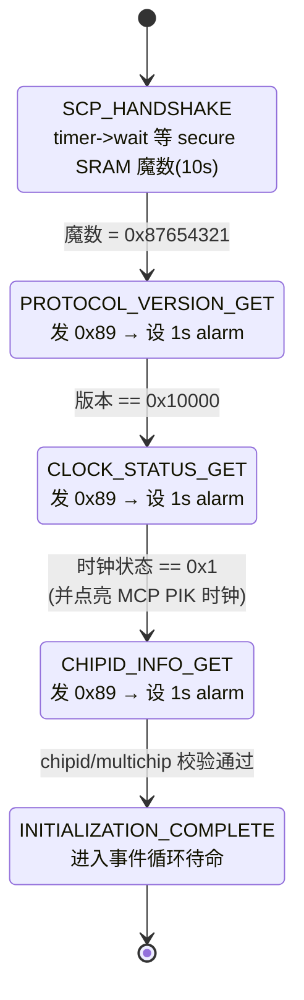

# MCP 启动互锁:与 SCP 的启动握手

> 前置:[06](./06-mcp-manageability.md) 讲了 MCP 的固件形态,[07](./07-mcp-scmi-agent.md) 讲了它的 agent 角色与 0x89 协议;固件通用的启动链(复位→事件循环)在 [04](./04-boot-and-init.md),本篇站在它之上。本篇回答一个更具体的问题:**一台启动时序受制于其他处理器的协处理器,如何安全地完成自身启动?** 答案是一台精心编排的有限状态机——它依赖 SCP 的时钟树,每一步都先查询、校验,再推进,且全程有超时告警。事实来源:`product/morello/module/morello_mcp_system/`、`product/morello/module/morello_system/`、`product/morello/include/morello_mcp_scp.h`。
>
> **本章位置**(见 [README 全景](./README.md)):MCP 短旅程的发起与推进:为什么等、何时问、问完怎么校验。

## 1. 为什么 MCP 必须等待 SCP

SCP 和 MCP 各有一块 PIK(Power Integration Kit,见仓库 `doc/glossary.md`)时钟树。关键事实是:**MCP 自己的 PIK 时钟,要到 SCP 的时钟树确认就绪之后、由 MCP 自己点亮**(4.1 的 `process_power_transition(CLOCK_PIK_IDX_MCP_CORECLK/AXICLK)`)。在 SCP 确认时钟就绪之前,MCP 不应使能自己的时钟——其 PIK 时钟源依赖 SCP 建立的时钟树,提前使能得不到可用时钟。于是 MCP 的启动不再是两者独立并行,而是必须等待 SCP 的就绪确认。

这跟 AP 是本质区别:AP 的启动由电源域/复位时序驱动,不需要向 SCP 做显式的就绪握手——而且放行 AP 主核的正是 SCP(§3);SCP 自身是启动链的源头;唯独 MCP 的启动时序**受 SCP 制约**。这正是"控制面 vs 管理面"分工在启动相位上的投影——控制面的 SCP 先建立时钟,管理面的 MCP 再启动自身功能。

## 2. 两条通路:魔数握手与 0x89 查询

MCP 与 SCP 之间其实有**两条不同的消息路径**,笔记里很容易混成一条:

| 路径 | 走什么 | 干什么 | 谁触发 |
| --- | --- | --- | --- |
| **魔数握手** | **secure 共享 SRAM 直连**(`SCMI_PAYLOAD_SCP_TO_MCP_S`) | SCP 告诉 MCP"我可以开始了" | SCP 写、MCP **轮询**(`timer->wait`) |
| **0x89 协议查询** | **MHU + non-secure 邮箱 transport**(07 章) | 三条"一问一答"取信息 | MCP 发、SCP 答(中断驱动) |

为什么分开?魔数是**单向、一次性的信号**(SCP 写入、MCP 轮询读取),用共享 SRAM 直连最省事——不需要协议头、不需要邮箱、不需要门铃,MCP 只需用一个 `timer->wait` 阻塞轮询那个地址变成特定值(见 §2 表里"谁触发"一列)。等这个信号满足、时钟可安全使能之后,才走协议通道去**取更细的信息**(版本、时钟状态、chipid)。

地址上,两侧看同一块物理内存、看得不一样。MCP 侧叫 `MCP_SCP_SHARED_SECURE_RAM (0x45620000)`,SCP 侧叫 `SCP_MCP_SHARED_SECURE_RAM (SCP_PERIPHERAL_BASE + 0x01620000)`——**从各自基址看,落到同一片 physical SRAM**。魔数常量定义在共享头文件里,两边编译都能看见:

```c src="./src/SCP-firmware/product/morello/include/morello_mcp_scp.h" lines="11-16" anchor="handshake-magic"
```

`0x87654321` 就是那个"我可以开始了"的约定值。注意 `MORELLO_SCP_MCP_HANDSHAKE_TIMEOUT_MICROSEC = 10 * 1000 * 1000`——等的时间不是无限的,10 秒等不到就报错,这也是 §4.2 超时机制存在的原因。

## 3. SCP 侧:什么时候写魔数

魔数不是 SCP 上电就写的,而是在**互联时钟真正跑起来的那一刻**。SCP 的 `morello_system` 模块订阅了 clock 状态变更通知,当互连时钟进入 `RUNNING` 状态时才动手:

```c src="./src/SCP-firmware/product/morello/module/morello_system/src/mod_morello_system.c" lines="813-835" anchor="scp-writes-handshake"
```

这一步的关键,是它写在 `MOD_CLOCK_STATE_RUNNING` 之后——**SCP 建立起自己最关键的时钟树之后,才通知 MCP"可以启动"**。而且写完后它还 `morello_system_init_primary_core()` 启动主核,再取消订阅该通知(只处理一次)。SCP 传递的信息不是"我已启动",而是"我的**时钟系统**就绪了"。

## 4. MCP 侧:事件驱动的启动状态机

MCP 的 `morello_mcp_system` 模块负责编排整个启动流程。它 `start` 阶段只投一个自事件,然后整条启动就是一台 **事件驱动的有限状态机**——每一步的下一步,取决于上一步的校验结果:

```c src="./src/SCP-firmware/product/morello/module/morello_mcp_system/src/mod_morello_mcp_system.c" lines="249-272" anchor="mcp-system-fsm-head"
```

`put_self_event()` 把下一步当作事件发给自己:控制流不在调用栈上推进,而在事件循环里流转。首步 `SCP_HANDSHAKE` 用一个 `timer->wait` 去轮询那个 secure SRAM 地址,带 10 秒超时:

```c src="./src/SCP-firmware/product/morello/module/morello_mcp_system/src/mod_morello_mcp_system.c" lines="93-98" anchor="mcp-handshake-wait"
```

`scp_handshake_wait_condition()` 返回"那个地址是否等于 `0x87654321`"。`timer->wait` 的语义是**阻塞等待条件成立或超时**——tick 到 `.wait` 时 MCP 的 CPU 停在这个条件上,直到 SCP 把它写出来。等到了就进下一步 `PROTOCOL_VERSION_GET`。

整条启动就是下面这台有限状态机——**每一步的下一步,取决于上一轮的校验结果**:



校验失败时不推进到下一态,直接报错退出——**这台 FSM 没有"回退"边,只有前进与报错退出**。alarm 超时则只输出诊断日志、不中止流程(真正的失败退出在握手段:`timer->wait` 的 10 秒 `FWK_E_TIMEOUT`);设 alarm 的意义是让"没有应答"可诊断。

### 4.1 三条查询:发送、校验、推进

握手魔数只是前置条件,后面还要三条 0x89 查询(见 07 章)确认更细的信息。这三步结构完全相同,只是校验的对象不同:

```c src="./src/SCP-firmware/product/morello/module/morello_mcp_system/src/mod_morello_mcp_system.c" lines="282-323" anchor="mcp-system-fsm-queries"
```

每个 case 先看 `event->source_id`,做"自己还是别人"的判定——如果是自己投的(`source_id == 本模块`),说明该去发查询、并挂一个 alarm 看门狗;否则(`else`)是收到了响应,该解析校验、推下一步。这个判定,是在单事件循环中处理双向交互的惯用做法。

以 `CLOCK_STATUS_GET` 这条为例,校验通过后 MCP 才去开自己的 PIK 时钟:

```c src="./src/SCP-firmware/product/morello/module/morello_mcp_system/src/mod_morello_mcp_system.c" lines="123-160" anchor="mcp-pik-clock"
```

`process_power_transition(CLOCK_PIK_IDX_MCP_CORECLK, ON)` 和 `CLOCK_PIK_IDX_MCP_AXICLK`——此时才真正去点 MCP 自己的核心/总线时钟。这印证了 §1 的因果:**只有确认 SCP 时钟就绪,才去使能自己的时钟。**

### 4.2 每一步都有超时告警

三条 SCMI 查询都要等 SCP 回话,每条设置一个 **1 秒 alarm 看门狗**。这里用 alarm API 代替裸循环,等待时长不写死在流程里:

```c src="./src/SCP-firmware/product/morello/module/morello_mcp_system/src/mod_morello_mcp_system.c" lines="67-85" anchor="mcp-alarm-timeout"
```

`set_alarm(MORELLO_SCP_AGENT_SCMI_RESPONSE_TIMEOUT_MICROSEC, ...)` 配 `MOD_TIMER_ALARM_TYPE_ONCE`,超时触发 `alarm_callback` 打一条 `[MCP SYSTEM] ... No response received. Timing Out!`。而成功收到响应时,handler 第一行就是 `disable_alarm()` 把它关掉。注意 alarm 只保证超时有一条诊断日志:若 SCP 始终不应答,该查询会一直处于等待状态;真正的失败退出路径是握手段 10 秒的 `timer->wait` 超时。

三个校验点,逐一核对:

| 查询 | 期望值 | 不同意则 |
| --- | --- | --- |
| 协议版本 | `0x10000`(`SCMI_PROTOCOL_VERSION_MANAGEMENT`) | `FWK_E_DATA` |
| 时钟状态 | `SCP_CLOCK_STATUS_INITIALIZED (0x1)` | `FWK_E_DATA`(不点 PIK 时钟) |
| chipid 组合 | `chipid != 0 && multichip_mode != 1` → 非法 | `FWK_E_DATA` |

最后一步 `INITIALIZATION_COMPLETE` 只 `FWK_LOG_INFO` 打一行"MCP Initialization completed",然后进入事件循环待命。

## 5. 小结

- **为什么等**:MCP 的 PIK 时钟要在 SCP 时钟树就绪后才能启用,提前操作会出错——这是"控制面先行、管理面跟进"的启动相位分工;
- **两条路**:魔数走 **secure SRAM 直连**(单向信号,`timer->wait` 轮询),0x89 走 **MHU transport**(双向问答,中断驱动),前者表意、后者取信,别混;
- **SCP 时机**:互联时钟 `RUNNING` 时才写 `0x87654321`,SCP 表的是"时钟系统就绪",不是"我活着";
- **MCP 编排**:一台事件驱动的有限状态机,每步用 `source_id` 判定"该发还是该收",收到就**校验→推下一步**;三条查询各设 1 秒 alarm(仅输出超时诊断日志),魔数握手的 `timer->wait` 自带 10 秒超时,才是失败退出路径。

MCP 之间这一整套"等-问-验-推",恰好是 [07](./07-mcp-scmi-agent.md) 的 0x89 协议的落地场景——协议解决了"怎么问",本篇解决了"什么时候问、问完怎么校验"。这两个合起来,MCP 才算真正立起来。下一章回到它管理面的本质,看它将来还要接哪些硬件:[09 MCP 管理面硬件蓝图:SPMI 与 SMCF](./09-mcp-management-hardware.md)。
