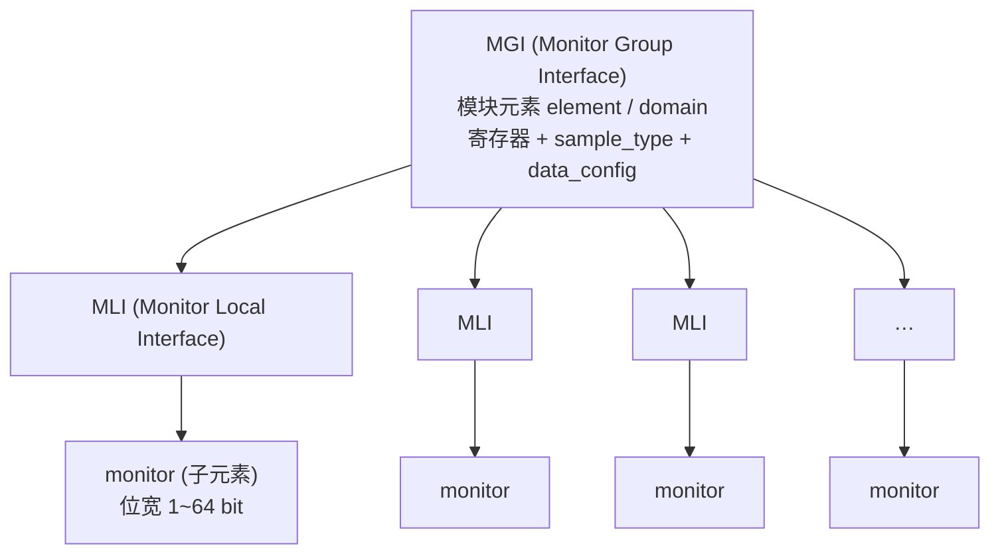

# MCP 管理面硬件蓝图:SPMI 与 SMCF

> 前置:[00](./00-scp-overview.md) 把 PCSA 给 MCP 画的管理面全图讲过:温度、功耗、电压、计数器这些系统级监控,以及带外消息。但 [06](./06-mcp-manageability.md) 也坦白:Morello 参考实现只落地了"启动协作",真正管硬件的模块一个没配。本篇讲仓库里**已提供但未被任何 product 启用的两个管理面组件**——SPMI 与 SMCF——看它们**将来会怎么用**,以及一个清醒的判断:**它们存在 ≠ 它们被启用**。事实来源:`module/spmi/`、`module/smcf/` 及其 `doc/`;§4 的"无 product 启用"判断沿 git 历史验到上游裁撤产品线前的最后一个基线(`0a5b4b58^`,含 9 个 MCP product)。
>
> **本章位置**(见 [README 全景](./README.md)):全景图上 MCP 将来要接的硬件——全芯片监控(SMCF)与 PMIC 通路(SPMI)。

## 1. Morello 参考实现中 MCP 缺失的管理面

[06](./06-mcp-manageability.md) 说 MCP 是管理面协处理器,但 Morello 参考实现里的 MCP 承担最少——实际只完成了 08 章那段"开机协作":跟 SCP 握手、确认时钟就绪、点亮自己的 PIK 时钟,然后待命。真正的管理面,要靠两样东西把"整颗芯片的监控与电压"接进 MCP:

- **对电源找 PMIC**:管理面要按自己的节奏操作电源芯片(整机功耗协商、上电时序、故障动作),蓝图给它的通路是读写 PMIC 寄存器。注意这不是"PMIC 归 MCP":控制面的调压(DVFS)同样打 PMIC,那条链路在 SCP 身上(见 [06](./06-mcp-manageability.md) §1 的分层对照);
- **对芯片去看监控**:温度、功耗、各种活动计数器,散布在整颗 die 上,MCP 要把它们统一采集起来。

SCP-firmware 把这两件事各自做成一个模块,存在于仓库中但未被任何固件启用,是 MCP 的"接口就绪、驱动待补"能力。

## 2. SPMI:连 PMIC 的那条两线

**SPMI**(System Power Management Interface)是连接 PMIC 与 SoC 电源管理控制器的一条两线接口,思想和 I2C 一脉相承——PMIC 上有一堆寄存器,MCP 按地址读写。但 SPMI 不只读写,还带一整套电源命令(复位、休眠、关断、唤醒、认证)。

模块的定位是 **HAL**,把"SPMI 硬件交互"(平台相关)与"用它的客户端设备"解耦。看它的设备配置——一张表里只有 `driver_id` 与 `api_id`,把硬件留给驱动,自己只留接口:

```c src="./src/SCP-firmware/module/spmi/include/mod_spmi.h" lines="39-50" anchor="spmi-dev-config"
```

客户端调的是 HAL API(`completer_read`/`completer_write`/`power_operation`),HAL 再把事务转给下层 driver 的 `send_command`。SPMI 命令集本身就反映了"它管的是电源"——复位/睡眠/关断/唤醒/认证,全是 PMIC 层面的动作:

```c src="./src/SCP-firmware/module/spmi/include/mod_spmi.h" lines="66-84" anchor="spmi-command-enum"
```

和 [03](./03-framework-events-deferred.md) 反复强调的"慢硬件"一致,SPMI 的读写也是**异步的**:客户端发出 `completer_read` 返回 `FWK_PENDING`,完成后 HAL 发一个响应事件通知——这套"请求-排队-FWK_PENDING-完成事件"正是 [03](./03-framework-events-deferred.md) 延迟响应机制在"真正慢的硬件"上的体现。而**总线忙**时不丢不拒——HAL 把请求标成延迟响应(`is_delayed_response = true`)挂起,一次只处理一个。

> **要点**:SPMI 是真正的 HAL——`module/spmi` 实现总线事务(读写/pm 命令),client 模块只调它、不碰硬件;底层"谁真的操作控制器寄存器"由配置里的 `driver_id` 指认,但**仓库里没有实现这个 driver 的模块**(`FWK_E_BUSY` 也只在 HAL 头文件的返回值说明里出现)。模块 doc 自述它 "based on the I2C HAL module design"——与 I2C 同级的通用总线抽象,不是 MCP 专属硬件。参考仓库里 HAL 已在,就是没接进任何 `SCP_MODULES`——SPMI 在方案蓝图里接口已就绪,而驱动与平台启用两项均缺失。这跟 [12](./12-arch-and-porting.md) §5 说的"参考平台是演示集不是清单"完全吻合。

## 3. SMCF:把整颗 die 的监控源统一起来

**SMCF**(System Monitoring Control Framework)解决的是另一头——监控源类型繁多(温度、功耗、计数器,各有各的寄存器、采样方式、触发),软件想让它们统一起来。SMCF 的答案是把它组织成一棵树:



每个数据源是一个 monitor,接到一个 **MLI**(Monitor Local Interface);一组 MLI 再接一个 **MGI**(Monitor Group Interface)。模块配置只面向元素,也就是 MGI——monitor 是子元素:

```c src="./src/SCP-firmware/module/smcf/include/mod_smcf.h" lines="37-49" anchor="smcf-element-config"
```

`.reg_base`、`.data_config`、`.sample_type`——一个 MGI 就是一组监控的统一采集点。`sample_type` 决定这组怎么采样,SMCF 定义了四种:

| 采样类型 | 触发方式 | 典型场景 |
| --- | --- | --- |
| **Manual** | 软件单次采样 | 按需抓一次 |
| **Periodic** | 按编程周期连续采 | IoT 周期看温度 |
| **Data Read** | 上一组数据被读走后才采下一组 | 持续但节流的采集 |
| **Input Trigger** | MGI 外部事件触发 | 某事件来了才采 |

数据采出来后,SMCF 用**通知**(`NEW_DATA_SAMPLE_READY`)告诉客户端"有数据了",客户端再通过 data API 去取。data/control/interrupt 三个 API 分别管采样、通用控制、中断:

```c src="./src/SCP-firmware/module/smcf/include/mod_smcf.h" lines="85-211" anchor="smcf-control-api"
```

`start_data_sampling` 控制一组开始采;control API 里还有 `mli_enable`/`mli_disable`、`config_mode` 这些细粒度控制。这样一套框架,把"上百个异构监控源"抽象成"一组组可配置、可触发、可采样的 MGI",软件不用为每种 sensor 各写一套。

## 4. 清醒判断:它们存在 ≠ 被启用

这是本系列反复强调的主旨,见 [06](./06-mcp-manageability.md)、[10](./10-power-performance-core.md) §7、[12](./12-arch-and-porting.md) §5——**SCP-firmware 是参考实现,不是商用完整固件**。

在当前仓库(main `0a5b4b58`,v2.16.0 基线)里,SPMI 的 HAL、SMCF 及其驱动(`sensor_smcf_drv`/`amu_smcf_drv`)**没有任何 product 排进 `SCP_MODULES`**;沿 git 历史再验一层:HEAD^(`0a5b4b58^`)上配过 MCP 固件的 product 恰好 9 个——Morello、N1SDP,以及 Neoverse RD 系的 sgi575/rdn1e1/rdn2/rdv1/rdv1mc/rdv3/rdv3r1;HEAD 提交(`0a5b4b58`)裁撤了其中 8 个、仅留 Morello。这 9 个 product 的全部 MCP 固件(共 17 份)的 Firmware.cmake 无一启用 SPMI/SMCF——参考实现里 MCP 的管理面从未接过真实硬件。Morello 的 SCP(`scp_ramfw_fvp`)只亮 5 个 SCMI 协议,整平台没接 SPMI/SMCF。所以:

- **有的**:PCSA 给 MCP 画的管理面全图、这两块积木的接口与驱动;(在仓库里)
- **没有的**:任何把它们接进成品平台的例子。(在参考实现里)

真要做"完整的管理固件",MCP 的工作链路大致是:通过 **SPMI** 去调 PMIC 的电压,通过 **SMCF** 去采 die 上的温/功耗/计数,再经 `scmi-sensor`/`scmi-power-capping`/`scmi-telemetry` 这些协议模块(见 [11](./11-scmi-protocols.md) §1)把数据上报给 AP。这些模块仓库里都有,唯独缺一份把它们串起来的成品配置——那正是移植新平台时要自己勾选的。

## 5. 小结

- **SPMI**:连 PMIC 的两线接口,HAL 分层(控制器驱动/client 设备驱动),带复位/睡眠/关断/唤醒/认证命令,异步读写 + 延迟响应队列逐个排队——蓝图里管理面连 PMIC 的通路(通用 HAL;控制面调压也打 PMIC,见 [06](./06-mcp-manageability.md) §1);
- **SMCF**:把异构监控源抽象成 monitor→MLI→MGI 的树,四种采样(手动/周期/读后采/外部触发),数据/控制/中断三 API,通知客户端取数——MCP 管监控的框架;
- **现实**:两块积木接口与驱动齐备,但**无 product 启用**,参考实现只落地了启动协作;
- **判断**:读参考实现要分清"已就位的零件"与"已搭好的平台"。想让 MCP 真正"管理",得自己把 SPMI/SMCF、`scmi-sensor` 等串进 `SCP_MODULES`——而这正是"移植自己的芯片"时下的功夫。

到这里,MCP 的四章(06 总览、07 agent 角色、08 启动互锁、09 硬件蓝图)讲完了。它依赖的软件骨架——模块、事件、启动、构建——在前面 02-05 已经铺垫过;接下来回到 SCP 那条主线,看它怎么从底层管理一颗颗电源域:[10 电源/性能/时钟管理核心](./10-power-performance-core.md)。
