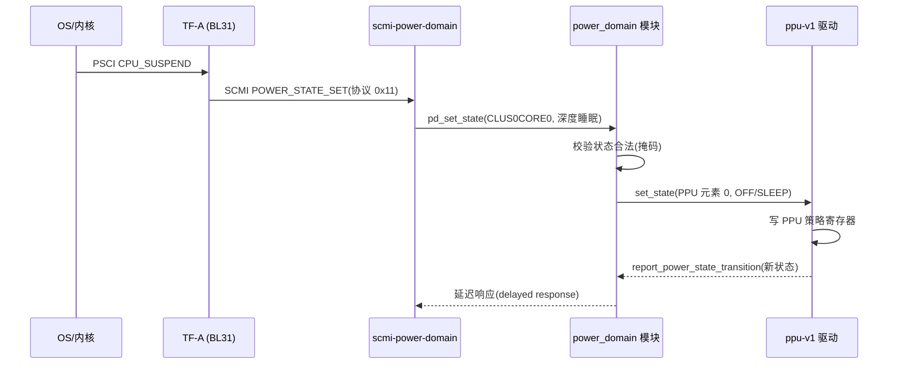

# 电源/性能/时钟管理核心

> 前置:01 章讲了 PSCI/SCMI 的分工——电源意图从 OS 进来,真正执行硬件操作的是 SCP;03 章讲了"慢操作→FWK_PENDING→补发响应"的异步模式。本篇进到 SCP 的内部看**电源这条主线怎么落地**:power_domain 模块、PPU 硬件、DVFS、系统级关电。事实来源:`module/power_domain`、`module/ppu_v1`、`module/dvfs`、`module/system_power`,及 `product/morello/scp_ramfw_fvp/` 下的 config。
>
> **本章位置**(见 [README 全景](./README.md)):旅程表第 7-8 段:power_domain 状态机与 ppu-v1 写硬件。

## 1. 主线:一条电源请求的完整路径

OS 发一个"核心进深度睡眠",到硬件真正切电,中间隔了四层。以 Morello 单芯片模式的 `CLUS0CORE0` 为例:



左边两跳(PSCI、SCMI)是**协议面**,右边两跳是**实现面**:power_domain 模块管"状态机与合法性",ppu-v1 管"把状态写进硬件"。本篇拆右边;左边(协议模块怎么分发、延迟响应怎么回)在 [11](./11-scmi-protocols.md) 展开。

## 2. 电源域树:一个元素 = 一个域

power_domain 模块的每个元素就是一个**电源域**,配置全在 `config_power_domain.c`。Morello 单芯片模式下的树:

```text
SYSTOP0 (MOD_PD_TYPE_SYSTEM)          ← 系统顶层
├── CLUS0 (MOD_PD_TYPE_CLUSTER)       ← 簇
│   ├── CLUS0CORE0 (MOD_PD_TYPE_CORE)
│   └── CLUS0CORE1 (MOD_PD_TYPE_CORE)
├── CLUS1 (MOD_PD_TYPE_CLUSTER)
│   ├── CLUS1CORE0
│   └── CLUS1CORE1
└── DBGTOP0 (MOD_PD_TYPE_DEVICE_DEBUG) ← 调试域
```

一个域元素声明了三样东西——**类型、父域、谁来驱动硬件**:

```c src="./src/SCP-firmware/product/morello/scp_ramfw_fvp/config_power_domain.c" lines="91-104" anchor="pd-element"
```

| 字段 | 作用 |
| --- | --- |
| `pd_type` | CORE/CLUSTER/SYSTEM/DEVICE_DEBUG——决定了模块对该域的管理策略 |
| `parent_idx` | 父域索引,构成树;`PD_SINGLE_CHIP_IDX_NONE` 表示根 |
| `driver_id` | 指向 ppu-v1 模块的某个元素——"域 ↔ 硬件通道"的映射 |
| `allowed_state_mask_table` | 该域在各系统状态下允许的状态集合(见 §4) |

树结构不只是文档展示:父域是子域的**合法性边界**和电源顺序的依据——父域在 `OFF` 时,子域按掩码(核心允许 `OFF|SLEEP`)至多到 `SLEEP`、不能 `ON`;请求会沿树向上/向下传播(§4)。

## 3. PPU:把状态写进硬件的最后一层

PPU(Power Policy Unit)是芯片里专门的电源策略硬件,每个 PPU 管一个域的电源引脚。ppu-v1 驱动的 `set_state` 是"写策略寄存器、硬件执行、再回报"的完整闭环:

```c src="./src/SCP-firmware/module/ppu_v1/src/mod_ppu_v1.c" lines="254-313" anchor="ppu-set-state"
```

要点:

- **写的是"策略"不是"直接切电"**:驱动把目标模式(`PPU_V1_MODE_ON`/`OFF`)写进 PPU 的寄存器(`ppu_v1.h` 里的 PWPR 策略位、DYNAMIC 位),硬件自己去完成电压/时钟门控——SCP 不逐条操作电源线;
- **硬件状态可从寄存器读回**:PWSR 里是当前模式,`get_state()` 把 PPU 模式映射回 power_domain 的状态(`ppu_mode_to_power_state` 表);
- **写完之后回报**:`report_power_state_transition()` 回调 power_domain,把"请求完成"推回上层——这就是 [03](./03-framework-events-deferred.md) 延迟响应链的下游端点:power_domain 返回 `FWK_PENDING`,等驱动的这次回报来补发响应。

> PPU 也可以带"动态"位(`DYNAMIC`):硬件根据下游设备活性自动切电,SCP 只设策略不管细节——模式表里的保留态(`MEM_RET`/`LOGIC_RET` 等)就是为这种自治准备的,映射回电源域状态时归入 OFF/ON(`ppu_mode_to_power_state` 表),并不产生独立的 SLEEP 态。

## 4. 状态机:状态迁移的合法性校验

power_domain 的状态枚举(`mod_power_domain.h`):标准三态 `OFF`/`ON`/`SLEEP`(取值 0/1/2),框架预留 `OFF_0/OFF_1/OFF_2`(3~5);平台自定义态从 `MOD_PD_STATE_COUNT` 之后追加——Morello 定义了 `FUNC_RET`/`FULL_RET`/`MEM_RET`(`morello_power_domain.h`)。枚举值**只增不减、不允许中间插位**——因为枚举值直接当遮罩位用(`MOD_PD_STATE_OFF_MASK = 1 << MOD_PD_STATE_OFF`),插位会让所有 `*_MASK` 错乱。请求进来先过**合法性校验**,约束写在各域的 `*_allowed_state_mask_table` 里,分两个维度:

- **系统状态维度**:同一电源域,在系统 `SLEEP0`/`SLEEP1`/正常态下能落到的状态不同。config 里的 `*_allowed_state_mask_table` 就是这种约束——比如 `toplevel_allowed_state_mask_table` 规定系统进 `SLEEP0` 时顶层域只能 `OFF`;
- **父域维度**:核心允许什么状态取决于簇的当前状态(`core_pd_allowed_state_mask_table` 以簇状态为下标:簇 `ON` 时核心允许其自身有效态 OFF/ON/SLEEP/FULL_RET,与簇的有效掩码不是同一集合,`morello_power_domain.h`)。

请求先进 `pd_set_state()` 过一道**浅校验**,再投事件:

```c src="./src/SCP-firmware/module/power_domain/src/mod_power_domain.c" lines="965-995" anchor="pd-set-state"
```

这个 API 只做两件很轻的事:按**本域**的掩码验目标状态合法(`is_valid_state`,§2 的 `allowed_state_mask_table`;支持 composite 的域走 `is_valid_composite_state`),然后组一个 `SET_STATE` 事件投进循环、立即返回。深层的活——父域约束、驱动否决、状态映射、写 PPU——全在事件循环的 handler 里(见下面的 `initiate_power_state_transition`)。请求方(SCMI 协议模块)得到的是立即返回,结果经完成事件补发响应——[03](./03-framework-events-deferred.md) 延迟响应链的中游。请求被 `process_event` 消化后,进入驱动层:

```c src="./src/SCP-firmware/module/power_domain/src/mod_power_domain.c" lines="111-155" anchor="initiate-transition"
```

驱动先给 `deny` 一个否决机会,再做状态映射(`retrieve_mapped_state`:查 `pd_state_mapping_table`;**Morello 没配这张表,于是原样透传**),最后 `set_state`——而 ppu-v1 的 `set_state` 只接受 ON/OFF,别的状态直接 `FWK_E_PARAM`。返回 `FWK_PENDING` 的驱动会把完成推迟到 `report_power_state_transition`——两条完成路径,状态机因此是**显式的**而不是"写完寄存器就当成功"。

## 5. 系统级电源:整棵电源树的协调下电

系统关电/休眠需要**协调整棵树**,这不是 power_domain 一个模块能决定的:协议模块 `scmi_system_power` 接住系统关电命令,经 power_domain 的**受限 API** `pd_api->system_shutdown(...)` 触发(绑定在 `mod_pd_api_id_restricted` 上),power_domain 内部投系统关电事件 `PD_EVENT_IDX_SYSTEM_SHUTDOWN`,再对每个域调用驱动的 `shutdown`(支持延迟的驱动返回 `FWK_PENDING`),全树放下后通知完成。

设计点:`perform_shutdown` 按**元素表顺序**逐个关域,而 Morello 的域表核心在前、`SYSTOP0` 排在末位(§2 的树是给人看的,元素表顺序才是执行顺序)——所以关电实际走的是**由底向上**(先子后父),不是"由顶向下"。树结构与父域约束(§4)由此共同决定系统状态迁移的合法路径。

## 6. 性能域:DVFS 将 level 映射为频率与电压

电源的另一条主线是性能。SCMI 性能协议只跟 **level** 打交道——level 的语义由实现自定,Morello 直接把它配成 Hz 频率值;真正的"频率+电压"表在 SCP 侧由 DVFS 域持有:

```c src="./src/SCP-firmware/product/morello/scp_ramfw_fvp/config_dvfs.c" lines="22-61" anchor="dvfs-domain"
```

一个 DVFS 域把三样东西绑在一起:`psu_id`(电压轨,查电源轨表)、`clock_id`(时钟源链)、一份 **opps 表**(level → 频率/功耗)。请求链路:

```text
SCMI PERFORMANCE_LEVEL_SET(level)
  → scmi-perf 模块(协议解析)
    → dvfs 模块:查 opps 表得到 频率 + 电压
      → clock 模块:set_rate(频率)
      → psu 模块:set_voltage(电压)
```

psu 之下还有一层,上图没画:真板上 psu 元素绑的是 PMIC 驱动——Morello `scp_ramfw_soc` 把 CLUSTER_0/1 两条轨绑到 `xr77128`、走 `cdns-i2c`,Juno 把各条电源轨绑到 `juno_xrp7724`、走 I2C;平台文档同样明说核心域上电由 SCP "turns on the VCPUn voltage rail through an external PMIC"。DVFS 切档拨动的物理端点,就是 PMIC 输出的电压轨——别把"调 PMIC"当成 MCP 的专属职能,SCP/MCP 分层的证据对照见 [06](./06-mcp-manageability.md) §1。

为什么协议层只传 level、不传频率?因为**level 的物理含义可由实现决定**,同一档 level 在不同芯片上的频率/电压可以各不相同;把 level 作为协议契约留在 SCMI 里、把频率/电压表留在 SCP 固件里,OS 才能"一套代码跑多种芯片"。抽象有代价:映射对 OS 不透明。Morello 选择把 level 直接配成 Hz——档位就是频率,OS 看得见真实值,代价是"加一档必须知道具体频率"。

时钟侧:每个 clock 元素是一条"时钟源链"(父时钟 + 分频/倍频),`config_clock.c` 里 CPU_GROUP0/1 绑 `css-clock`(PLL 类),Interconnect 绑 `pik-clock`。DVFS 切档时先调时钟再调电压(或反之按硬件约束),顺序敏感,所以 DVFS 模块把整套操作做成**原子事务**——这也是一次典型的"慢操作"走 `FWK_PENDING`。

## 7. 参考平台没做满的部分

Morello 的 `scp_ramfw_fvp` 没启用传感器/散热模块——`sensor`、`scmi-sensor` 在仓库里但不在它的 `SCP_MODULES` 里(`scp_ramfw_soc` 变体倒排入了 `sensor`/`morello-sensor`/`scmi-sensor`)。温度监测、功耗封顶这类能力也是"留了积木、没搭平台":跟 [09](./09-mcp-management-hardware.md) 一样,参考实现演示的是主链路的完整写法,其余靠读的人自己勾选。

## 8. 小结

- 电源主线的四层:**协议面(SCMI)→ 状态机(power_domain)→ 硬件驱动(ppu-v1)→ PPU 寄存器**;
- 电源域是树:元素定义"类型/父域/驱动/允许状态",状态合法性与开关顺序都由树结构承载;
- PPU 是"写策略、硬件执行":SCP 不逐线操作,模式寄存器 + 状态回报构成显式状态机;
- DVFS 把"level"翻译成"频率+电压":level 语义由实现定,Morello 直接配成 Hz(OS 看得见),频率/电压表在固件里;
- 系统级电源是"整树协调"的事:scmi-system-power 触发,power_domain 逐域 shutdown,顺序由元素表定。

SCMI 协议在 SCP 里不是一个模块,而是十几个模块——下一次请求怎么被解析、分派、排队、补响应,下一章完整走一遍:[11 SCMI 协议族实现](./11-scmi-protocols.md)。
