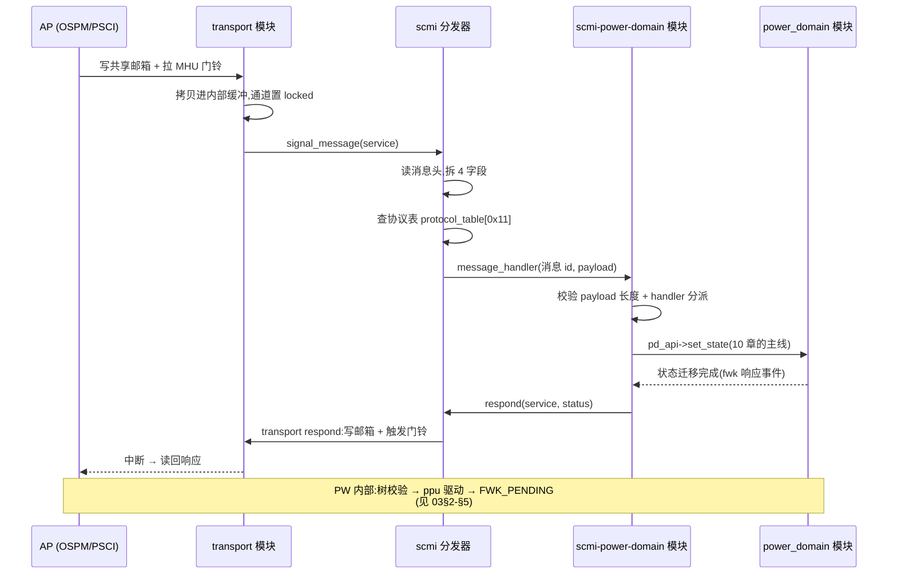

# SCMI 协议族实现:一个分发器 + 一列协议模块

> 前置:01 章给了 SCMI 的协议 id 表(0x11 电源域、0x13 性能……),03 章讲了 FWK_PENDING 延迟响应,04 章讲了 MHU 门铃怎么变成事件,10 章把电源主线讲到了 power_domain/PPU。本篇把协议面补齐:**AP 发来的一个 SCMI 消息,在 SCP 里是怎么被拆包、分派、处理、再答复的**——以及为什么"SCMI"在固件里不是一个模块,而是一个分发器加十几个协议模块。事实来源:`module/scmi/`、`module/scmi_power_domain/`、`product/morello/scp_ramfw_fvp/config_scmi.c`,消息格式对照 SCMI v4.0(DEN0056F)§3.1.2 Message format。
>
> **本章位置**(见 [README 全景](./README.md)):旅程表第 4-6、10 段:接收、分发、协议处理与应答——协议面的全部。

## 1. 全景:协议按"命令集"切,模块也这么切

SCMI 规范把接口按协议切成一块块,每块协议有自己的 **message_id 命名空间**和独立语义(电源域管状态、性能管 level、时钟管 freq……)。SCP-firmware 的模块划分照抄了这一刀:**一个协议 = 一个协议模块**,协议模块自己不碰业务硬件,只把 SCMI 命令翻译成对后端 HAL 模块(`power_domain`/`clock`/`dvfs`)的调用。角色界线:

| 角色 | 职责 | 模块 |
| --- | --- | --- |
| **分发器** | 拆消息头、按协议 id 查表、转发 | `scmi`(另含内置的 Base 协议) |
| **协议模块** | 一个协议一个:校验并实现该协议的命令 | `scmi-power-domain`/`scmi-clock`/`scmi-perf`… |
| **后端模块** | 真正的硬件管理 | `power_domain`/`clock`/`dvfs`/`ppu-v1`… |

协议 id 在规范里是硬编号(不可自由分配),仓库用一个头文件统一钉住:

```c src="./src/SCP-firmware/module/scmi/include/mod_scmi_std.h" lines="86-107" anchor="scmi-std-ids"
```

注意到 `enum scmi_base_command_id` 紧跟协议号出现:协议 id 之下还有一层消息 id,两者一起构成"协议 id : message_id"的二维命名空间——**请求头里同时带这两样**,分发就靠它们。

仓库里协议模块与规范协议的对应(不带 `_req` 的都是平台侧,即"应答命令"一侧;带 `_req` 的 requester 族见 §6):

| 协议 id | 规范协议 | 平台侧(scmi-… ) | requester 侧(scmi-…-req) |
| --- | --- | --- | --- |
| `0x10` | Base | **内置在 scmi 模块**(`mod_scmi_base.c`) | — |
| `0x11` | Power Domain | `scmi-power-domain` | `scmi-power-domain-req` |
| `0x12` | System Power | `scmi-system-power` | `scmi-system-power-req` |
| `0x13` | Performance | `scmi-perf` | — |
| `0x14` | Clock | `scmi-clock` | — |
| `0x15` | Sensor | `scmi-sensor` | `scmi-sensor-req` |
| `0x16` | Reset Domain | `scmi-reset-domain` | — |
| `0x17` | Voltage Domain | `scmi-voltage-domain` | — |
| `0x18` | Power Capping | `scmi-power-capping` | `scmi-power-capping-req` |
| `0x19` | Pin Control | `scmi-pin-control` | — |
| `0x1B` | System Telemetry | `scmi-telemetry` | — |
| `0x89` | *厂商扩展*(管理) | `scmi-management`(product 私有) | MCP 用 `scmi-agent`(见 [07](./07-mcp-scmi-agent.md)) |
| `0x90` | *厂商扩展* | `scmi-apcore`(AP 核复位/控制) | — |

规范里 `0x1A` 是 MPAM-Fb、`0x80-0xFF` 留给厂商——分发器不关心具体的 id,只关心"表里有没有"。**这份表本身就是配置文件**:Morello 的 `scp_ramfw_fvp` 只把 `scmi`、`scmi-power-domain`、`scmi-system-power`、`scmi-perf`、`scmi-management` 排进了 `SCP_MODULES`([05](./05-build-and-deploy.md) §3);`scp_ramfw_soc` 变体再排入 `scmi-clock`/`scmi-sensor`。其余协议模块都在仓库中,但未进入任何固件的构建。想点亮一个协议,改一行模块列表即可——分发器代码一个字不用动。

## 2. 分发器认三样东西:通道、agent、协议模块

分发器(scmi 模块)的**元素不是协议,是一个个 service**——每个 service 绑一个 transport 通道,即一对 MHU + 一段共享邮箱。Morello SCP 有三个 service,对应三路外部输入:

```c src="./src/SCP-firmware/product/morello/scp_ramfw_fvp/config_scmi.c" lines="21-39" anchor="scmi-service-config"
```

`scmi_agent_id` 把 service 关联到一个 **agent 身份**。agent 是 SCMI 的实体模型:**交流的是 agent 与 platform**,不是"CPU 与固件"。agent 表集中声明身份类型:

```c src="./src/SCP-firmware/product/morello/scp_ramfw_fvp/config_scmi.c" lines="82-98" anchor="scmi-agent-table"
```

| agent | 类型 | 谁在用 |
| --- | --- | --- |
| OSPM | `SCMI_AGENT_TYPE_OSPM` | Linux 内核的电源管理 |
| PSCI | `SCMI_AGENT_TYPE_PSCI` | TF-A BL31(PSCI 翻译成 SCMI,见 [01](./01-system-multicore-interaction.md) §4) |
| MANAGEMENT | `SCMI_AGENT_TYPE_MANAGEMENT` | MCP(06 章) |

agent 类型为授权和协议可见性提供控制点——`mod_scmi.h` 的 agent 配置留有 `dis_protocol_list_psci` 字段,可单独对 PSCI agent 屏蔽协议(Morello 没配,机制空置),身份检查是实际生效的。

协议模块怎么进表?在 bind 阶段逐一向分发器**自报身份**:协议模块绑定分发器的 `MOD_SCMI_API_IDX_PROTOCOL` API 取得回调(`respond`、`scmi_message_validation`),同时暴露自己的 `mod_scmi_to_protocol_api`(`get_scmi_protocol_id` + `message_handler`),分发器据此往 `scmi_protocol_id_to_idx[256]` 里填一行(id 直接当下标,填 0 表示未注册,重复注册直接报错)。这是一个**双向 bind**——协议模块只知道协议 id 和消息表,不知道自己会被哪个固件启用。

> **工程要点**:加一个协议 = 写一个协议模块 + 在 `SCP_MODULES` 加一行。分发器对协议数量、内容一无所知——查询、注册、分发全部数据驱动,是 [02](./02-framework-module-system.md)"配置驱动、代码通用"在协议层的再次落地。

## 3. 一次请求的完整旅程

现在把 10 章缺的那半边补上:从 AP 发出请求,到 SCP 应答并触发门铃中断。以 Power Domain 协议的 `POWER_STATE_SET`(协议 0x11、消息 0x04)为例:



分发器把消息头 32 bit 摊开,就能决定一切。头格式是规范硬性的(`DEN0056F` Table 3),代码逐位解析:

```text
[31:28] reserved  | [27:18] token     | [17:10] protocol_id | [9:8] message_type | [7:0] message_id
 (4 bit)          |  (10 bit)         |  (8 bit)            |  (2 bit)           |  (8 bit)
```

`token` 由 AP 自选、平台回响应时原样带回——spec 要求"命令返回时必须原样返回整个消息头"。`message_type` 是 COMMAND(0)/DELAYED_RESPONSE(2)/NOTIFICATION(3),分发器据此决定这是"要处理的命令"还是"别人发来的响应"(agent 侧,见 §6)。

手算一个真实请求:OS 调 `POWER_STATE_SET`(协议 0x11、消息 0x04,`mod_scmi_std.h:114`),设 token=1、COMMAND 类型:

```text
[31:28] reserved | [27:18] token | [17:10] protocol_id | [9:8] type | [7:0] message_id
     0x0         |     0x01      |      0x11           |    0x0     |    0x04
→ 32 位消息头 = 0x00044404
```

(token 1 左移 18 位 = 0x40000,协议 0x11 左移 10 位 = 0x4400,消息 0x04——三个数一拼,整条消息的路由信息就齐了。)AP 发出的其实就是一个 32 位整数加一段 payload,SCP 靠它精确落到处理函数。

分发器的最后一步最短,也最关键——**查表,然后交出控制权**:

```c src="./src/SCP-firmware/module/scmi/src/mod_scmi.c" lines="1256-1306" anchor="scmi-dispatch"
```

注意这个分支:`if (status != FWK_SUCCESS)` **只打日志,照样返回 FWK_SUCCESS**。协议模块的错误(校验失败、域忙)应已用 SCMI 状态码打包回给 AP;万一 handler 自身出错未回应,分发器也不再代为补救——返回错误只会误导 fwk 去处理一个本不存在的"事件故障",再往下就是 AP 侧超时。

## 4. 表格即规范:消息表把 spec 写成了代码

协议模块的"命令支持列表"长什么样,决定了这条链路的可信度。`scmi-power-domain` 模块的**消息表**是一份带下标的函数指针数组:

```c src="./src/SCP-firmware/module/scmi_power_domain/src/mod_scmi_power_domain.c" lines="164-180" anchor="scmi-pd-handler-table"
```

旁边紧挨着一张 **payload 长度表**(每条命令的固定负载长度,如 `POWER_STATE_SET` 为 `sizeof(struct scmi_pd_power_state_set_a2p)`)。这两张表就是 SCMI 规范里"协议命令列表"的源代码形式,**消息 id 做下标,长度即契约**。入口 handler 把所有消息统一收口:

```c src="./src/SCP-firmware/module/scmi_power_domain/src/mod_scmi_power_domain.c" lines="1087-1110" anchor="scmi-pd-msg-handler"
```

`scmi_message_validation` 是分发器提供的通用校验器:消息 id 越界 → `SCMI_NOT_FOUND`;payload 长度不符 → `SCMI_PROTOCOL_ERROR`;handler 为 NULL → `SCMI_NOT_SUPPORTED`。三种失败都以 SCMI 状态码经 `respond` 发回 AP——这些码是规范定义的负值(`mod_scmi_std.h:50` 起):`NOT_SUPPORTED=-1`、`INVALID_PARAMETERS=-2`、`DENIED=-3`、`NOT_FOUND=-4`、`BUSY=-6`、`PROTOCOL_ERROR=-10`。AP 不看固件源码,单凭返回值就知道错在哪一层。

> **为什么这样设计**:**校验规则和消息实现必须在同一处演进**。新增一条消息,开发者在同一个文件里加 handler 行 + 加长度行,漏一个,运行期错误码立刻暴露;校验器同时承担"不支持的命令"的处理(表里 NULL 即不支持)。规范演进,代码跟进的方式是"往表里加行",而不是改分发器——分发器保持了协议无关。

## 5. 慢请求:响应回来之前,通道一直占着

回到 10 章遗留的问题:power_domain 返回 `FWK_PENDING` 后,SCMI 侧怎么"等"而不丢这条请求?答案是两处互斥:transport 的通道锁,与协议模块的域级 busy。

**第一层,通道锁**。从 `transport` 收到消息那一刻起,通道上下文就 `locked = true`,直到 `respond()` 把响应写回邮箱、置 free 位、发门铃,才解锁。这期间同一通道再来消息,`transport` 直接返回 `FWK_E_STATE`——这不是软件设计保守,而是邮箱协议本来就只有**一个槽位**:请求没消化完,槽位不空,下一封进不来。"排队"由硬件槽位天然保证。

**第二层,域级 busy**。同一电源域上可能有多个 agent(OSPM 和 PSCI 都能操作同一个域),协议模块必须自己守住"一个域同时只处理一个状态迁移"。`scmi-power-domain` 在 `ops[]` 里记每个域的忙状态:

```c src="./src/SCP-firmware/module/scmi_power_domain/src/mod_scmi_power_domain.c" lines="700-731" anchor="scmi-pd-busy"
```

`ops_set_busy` 存下占着这条域的 service_id(谁请求的,将来还要回给谁),再投一个**自事件** `mod_scmi_pd_event_id_set_request` 到事件循环——响应时机不在调用栈上,而由异步完成事件决定(03 章的模式)。域忙时再来请求,直接回 `SCMI_BUSY`:请求不排队,也不会覆盖正在进行的迁移。

异步完成回到协议模块时,它翻出当时存下的 service_id,把结果交给分发器发出:

```c src="./src/SCP-firmware/module/scmi_power_domain/src/mod_scmi_power_domain.c" lines="1392-1412" anchor="scmi-pd-respond"
```

`respond()` → 分发器的 `respond` → transport 的 `respond`(写回邮箱、清除 locked、触发门铃中断)——三步就是一条链路,AP 中断唤醒读到的就是这条响应。

于是"延迟"在 SCP 里有两个层次,对应 03 章与本节:**fwk 层**(`FWK_PENDING`/响应事件,协议模块之间的异步)与 **transport 层**(通道锁,与 AP 的握手节奏)。AP 察觉不到这两层,它只看到"发请求 → 稍后门铃响"。

## 6. agent 侧:同一套架构的镜像

§1 表格里 `_req` 后缀的模块不是装饰——它们让**控制器自己也当 agent**。分发器对 agent 侧走另一张表:角色配置成 `MOD_SCMI_ROLE_AGENT` 的 service,查 `scmi_protocol_requester_table`,而且只认**接收方向**的消息(响应、通知)——agent 侧收不到别人发的命令;出方向靠协议模块经 `mod_scmi_from_protocol_req_api` 的 `scmi_send_message` 主动发命令、等响应。**同一套框架、同一套事件循环,只是消息流向反过来**(07 章 MCP 侧那条 `MANAGEMENT-NS` 通道就是 agent 侧实例;它上面注册的 0x89 协议交给 MCP 自带的 `scmi-agent` 产品模块,而不是 `_req` 后缀的通用族)。

SCP 是 COMPLETER **还是** REQUESTER,由配置声明而非代码分叉——这就是"一个分发器,两种角色"的对称设计。对称的另一面是收发节奏不同:agent 侧收到并处理完一条响应后,`release_transport_channel_lock` 让通道回归空闲(§3 代码块尾部可见),platform 侧则把"何时算完"交给 `respond()` 决定。

## 7. 小结

- **划分逻辑**:"协议"是规范切开的接口边界,SCP-firmware 把它翻译成模块边界——`scmi` 分发器 + 协议模块族 + 后端 HAL,三层各司其职;
- **分发**靠两张数据结构:`scmi_protocol_id_to_idx[256]`(协议 id 直接查)与 protocol_table(协议 id → handler),全部在 bind 期注册,加协议不改分发器;
- **协议模块** = 一张 handler 表 + 一张 payload 长度表 + 一个 message_handler 入口,规范的命令列表以"表"的形态落地,校验错误码直接回 AP;
- **慢请求**靠两处互斥:transport 通道锁(邮箱单槽,天然串行)+ 协议模块域级 busy(防并发迁移),完成事件从后端一路推回,由 `respond()` 触发门铃中断收尾;
- **agent 侧**只是镜像:I/响应方向反过来,角色由配置声明,`_req` 模块族与分发器同一套机制。

到这里,把 01 的协议视图、04 的事件循环、10 的电源主线和本节的协议链路拼起来,一张"AP 意图 → SCP 执行 → 硬件动作"的完整地图就立起来了。还剩最后一个环节:这一切跑在不同架构(arm-m/aarch64/工具链)与不同平台上怎么适配——下一章:[12 架构支持与移植](./12-arch-and-porting.md)。