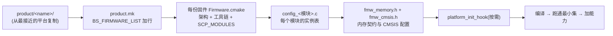

# 架构支持与移植:同一框架,三种架构

> 前置:02/03 讲了框架(与架构无关的通用部分),04 讲了 arm-m 上的启动,05 讲了构建系统怎么挑模块,06-09 讲了 MCP 这条辅线。还剩最后一个问题:**框架怎么做到"什么芯片都能跑"?** 答案藏在"架构层 + 平台层"这对世界上——本篇讲三层的责任边界、三种架构入口(arm-m/aarch64/none)、内存布局契约与 `platform_init_hook`,最后给一份"移植到自己芯片"的清单。事实来源:`arch/`、`doc/architecture_support.md`、`doc/build_system.md`、`doc/cmsis.md`。
>
> **本章位置**(见 [README 全景](./README.md)):收尾:全景图上的固件盒子怎么换一颗芯片再长出来——三层分工与移植清单。

## 1. 三层分工:责任边界与改动频率

SCP-firmware 把"可移植性"做成了**分层**:不确定的东西被压到两个很小的面上,其余全部通用。

| 层 | 位置 | 责任 | 改动频率 |
| --- | --- | --- | --- |
| **框架** | `framework/` | 模块生命周期、事件、通知——架构无关 | 基本不动 |
| **架构** | `arch/` | 固件与 CPU/中断硬件的契约:`main`、中断、链接脚本、启动 | 换核才动 |
| **平台** | `product/<name>/` | 这份固件有哪些模块、实例怎么配、内存如何布局 | 每款产品都动 |

模块不在这三层里——`module/`(及 `product/<name>/module/`)是平台**按需勾选**的能力块:通用模块进顶层、产品私有模块进产品目录([05](./05-build-and-deploy.md) §3 的 `SCP_MODULES`)。

三个参考平台(juno、morello、totalcompute 的 tc2/3/4)共用**一套 framework、一套架构代码**,区别全在第三层的 `product/` 目录——这就是"一份源码,多份固件"的物理基础([05](./05-build-and-deploy.md))。

架构层的存在是**框架与 CPU 硬件之间的最小中介**:框架通过 `fwk_arch`/`fwk_interrupt` 接口声明"我需要什么",架构层负责实现;平台则通过配置文件——以及唯一的代码钩子 `platform_init_hook`——向固件描述本平台的硬件配置。

## 2. 架构层的三种实现

`arch/` 下每个架构是一个**可选库**。`arch/CMakeLists.txt` 把候选路径全部注册,固件在 `Firmware.cmake` 里用 `SCP_ARCHITECTURE` 点名一个,构建槽查出它的 target(`arch-arm-m` 等)并让固件链接它——**固件对架构的选择是配置,不是代码**:

| 架构 | target | 代表形态 | 谁来写 `main` | 中断怎么管 | 谁提供启动 |
| --- | --- | --- | --- | --- | --- |
| `arm-m` | `arch-arm-m` | Cortex-M ROM/RAM 固件(所有参考平台) | 架构层(`main`) | NVIC 向量表 | **工具链**(`__main`/`_start`) |
| `aarch64` | `arch-aarch64` | Armv8-R64/Armv8-A | 架构层(`arm_main`) | GIC(`arch_gic.c`) | **自己**(`arch_crt0.S`) |
| `none`/`posix` | `arch-none`/`arch-posix` | 宿主机进程(单测/无硬件迭代) | 层里给一个 `main` | 空操作或 POSIX 信号 | 宿主 OS |

### 2.1 arm-m:传统主场,把启动交给工具链

arm-m 是当前全部参考平台的选择。它的架构库只给四样东西:**`main()`、NVIC 中断管理、异常 handler、链接脚本**——唯独没有启动汇编(04 章 §2):复位向量的目标不是工具链的启动符号,而是架构层自己的 C 函数 `arch_exception_reset()`,由它转入工具链 C 运行环境(`__main`/`_start` 清零 ZI、拷入已初始化数据),然后才进 `main`。架构库还直接链接 `cmsis::core-m`(架构 CMakeLists),设备相关配置由每份固件的 `fmw_cmsis.h` 完成(`doc/cmsis.md` 的 `<fmw_cmsis.h>` 约定)。

```c src="./src/SCP-firmware/arch/arm/arm-m/CMakeLists.txt" lines="30-38" anchor="arm-m-sources"
```

注意它是**链接/工具链级**的选择:同一份架构源码,编译时按 `CMAKE_SYSTEM_PROCESSOR` 决定定义 `ARMV6M`/`ARMV7M`/`ARMV8M`;链接脚本也按编译器切换(ArmClang 用 `arch.scatter.S`,GNU/Clang 用公共的 `arch.ld.S`)。对 SCP 固件来说,"选架构"其实是在选一套"硬件接口怎么满足"的答案。

### 2.2 aarch64:新面孔,一切自己来

arm-m 把启动外包给 CMSIS,`aarch64` 反过来——**没有现成的启动代码可依赖,`arch_crt0.S` 从异常级别检查和 MPU 配置开始把自己提起来**(这是它与 arm-m 最本质的分界):

```asm src="./src/SCP-firmware/arch/arm/aarch64/src/arch_crt0.S" lines="19-35" anchor="crt0-el-check"
```

之后一路自办:配置 PMSA(V8-R64)/MMU(V8-A)的 MPU 区域、开 `SCTLR` 的 M/C/I、清零 BSS、设栈、调构造函数、最后 `bl arm_main`。`arm_main` 与 arm-m 的 `main` 长得一样——平台钩子 + `fwk_arch_init()`:

```c src="./src/SCP-firmware/arch/arm/aarch64/src/arch_main.c" lines="15-30" anchor="aarch64-arm-main"
```

`doc/architecture_support.md` 给这份支持背书:同时支持 Armv8-R64 与 Armv8-A;V8-R64 独占 secure EL2,V8-A 可从 EL3 降到 EL2;中断控制器是**最小实现**(单一优先级、无 NMI、不支持扩展 SPI/PPI),且产品必须提供 `fmw_gic.h` 定义 GIC 基地址。工具链只支持 GCC/Clang 而不支持 ArmClang,部分特性(如通知)要求 newlib。

> 但这仍是"蓝图"级支持:全仓库的参考产品**没有一个**把 `SCP_ARCHITECTURE` 设成 `aarch64`。它验证了"同一框架可再加一种架构",而演示平台仍全在 arm-m——跟 [09](./09-mcp-management-hardware.md) 的 SPMI、[10](./10-power-performance-core.md) §7 的 sensor 一样,分清"已就位的零件"与"已搭好的平台"。

### 2.3 none/posix:把固件编成普通进程

`arch/none/` 不是为了跑真机:它把框架编成一个**普通宿主进程**——中断相关接口降级为空操作、ISR 由宿主信号模拟,等于给固件建了个"硬件仿真器"。框架和模块的**单元测试**就建在这上面(`make ... test`,见 `build_system.md` §Build and execute framework and module unit tests),移植上新架构前,先用它把模块逻辑调通——**架构无关的错误不该等硬件**。

## 3. 内存布局:一份契约,三套布局

arm-m 的内存布局不是"各平台自由发挥",而是架构层规定一份**契约**(`arch/arm/common/include/arch_mem_mode.h`),产品在 `fmw_memory.h` 里填三样值,其余由链接脚本模板预处理出来:

```c src="./src/SCP-firmware/arch/arm/common/include/arch_mem_mode.h" lines="12-32" anchor="mem-layout-contract"
```

产品填的是 `FMW_MEM_MODE` + `FMW_MEM0_BASE/SIZE`(双区时再加 `FMW_MEM1_BASE/SIZE`),模板按模式展开成不同的段基址(Morello 的 `DUAL_REGION_RELOCATION` 即 05 章 §6 的场景):

```c src="./src/SCP-firmware/arch/arm/arm-m/src/arch.scatter.S" lines="13-55" anchor="scatter-mem-modes"
```

这套设计的两个好处:**布局语义定义在架构层**——Linux 工具链的 `arch.ld.S` 与 ArmClang 的 `arch.scatter.S` 消费同一个 `arch_mem_mode.h`,不会各写一套;而**合法性校验也在架构层**——三模式/基址缺失直接编译期 `#error`,配错了不是运行期爆炸而是构建期报错。

## 4. 平台初始化钩子:架构层留给平台的唯一代码入口

`platform_init_hook()` 是架构层(arm-m 的 `main`、aarch64 的 `arm_main`、host 的 `main` 三处都一样)留给平台的**唯一代码钩子**。契约很窄(`doc/architecture_support.md` §Platform Initialization Hook):

- **时机**:一切模块初始化之前、`fwk_arch_init()` 之前——框架自己还没起来;
- **语义**:弱函数,默认 `FWK_SUCCESS`;平台可覆盖做"框架起来前必须先办的硬件事"(如使能某块 SRAM);
- **红线**:**不许调模块 API,不许用 `fwk_put_event`**(事件队列还没初始化),不许碰未启用的内存;
- **失败**:返回非 `FWK_SUCCESS` → `fwk_trap()`(panic 语义,arm-m 的 `main` 与 aarch64 的 `arm_main` 都是直接 trap)——钩子只适合用在这儿,可恢复的错误该在模块里处理。

**参考平台一个都没覆盖这个钩子**——这个入口完整存在,只是都留给了移植方。这也和 04 章 §3 呼应:钩子的正确用法是在 `fwk_arch_init()` 之前只办"极早、极低层"的事。

## 5. 移植清单:从复制到第一次跑通

把 SCP-firmware 挪到自己的芯片上,参考实现给了明确路径。完整清单:



1. **复制最近似的产品目录**为 `product/<name>/`,改掉名字——没有"从零开始",只有"从哪份开始"。
2. **`product.mk` 声明固件集**(`BS_FIRMWARE_LIST`):romfw + ramfw 起步(想省事,先只留一份最小编译)。
3. **每份固件的 `Firmware.cmake` 配三件事**:架构、工具链(`SCP_TOOLCHAIN`,可被 `-D` 覆盖)、模块列表。
4. **`config_<模块>.c` 一个不能少**——05 章 §4 说过,漏一个是链接错误。
5. **内存与设备头文件**:`fmw_memory.h` 填契约三件套;arm-m 还要 `fmw_cmsis.h` 告诉 CMSIS 设备是谁、有没有 MPU。填出来的实物以 Morello 为例:`DUAL_REGION_RELOCATION` + MEM0 `0x00800000`/512 KiB(代码)+ MEM1 `0x20000000`/256 KiB(数据),见 [05](./05-build-and-deploy.md) §6。
6. **先跑通最小集再加能力**:典型起点是 `pl011`(能看日志)→ `clock/mhu/transport/scmi`(能通信)→ Base 协议(AP 能看到你)→ 再逐个加协议模块。模块表是控制面上最便宜的杠杆,先小后大,一次只动一个变量。

工程实践三条:

- **记住参考平台是"最小演示集",不是功能清单**。Morello 的 `scp_ramfw_fvp` 只点亮 5 个 SCMI 协议(11 章 §1)、没启用 SPMI/SMCF(git 历史上 9 个配过 MCP 固件的 product,其 Firmware.cmake 也无一提及)、甚至没覆盖 `platform_init_hook`——你的移植方职责是**从零勾选**,不是把参考实现全套照搬。
- **先问"我要哪种架构入口"**:在 arm-m 上起步最容易(全仓库都是活例子);需要 Armv8 特性再选 aarch64,但得自己把 `fmw_gic.h`、栈、MPU 配齐。
- **以单元测试作为迁移的验证基线**:本篇 §2.3 的 host 架构单测可以零成本验证"架构无关"代码——先让它在 `arch/none` 上通过,再上真芯片。

## 6. 小结:整个系列的完整图景

SCP-firmware 可移植性的全部秘密,就是**把"必然不同"的东西摊在一个很小的面上**:CPU 契约进架构层,板子配置进平台层,剩下的模块与框架全仓库通用——三层之间靠 `fwk_arch`/`fwk_interrupt` 接口和 `fmw_memory.h`/`config_*.c` 这些契约点咬合。

回看整个系列:

- **背景与分工**:SCP 承担系统电源与管理的执行角色([00](./00-scp-overview.md) [01](./01-system-multicore-interaction.md)),MCP 是它的管理面协处理器,拥有 06-09 四章主线——总览、agent 角色、启动互锁、硬件蓝图([06](./06-mcp-manageability.md) [07](./07-mcp-scmi-agent.md) [08](./08-mcp-boot-handshake.md) [09](./09-mcp-management-hardware.md));
- **骨架与运行时**:模块、标识、事件、延迟响应([02](./02-framework-module-system.md) [03](./03-framework-events-deferred.md)),以及它们怎么从复位跑到事件循环([04](./04-boot-and-init.md));
- **构建与能力**:一份源码编出六份固件([05](./05-build-and-deploy.md)),电源这条主线([10](./10-power-performance-core.md))和 SCMI 协议族([11](./11-scmi-protocols.md))是它的两条主轴;
- **底座**:本篇的架构/平台两层,是把前面所有内容"搬到任何芯片"的最后一层。

一份 SCP 固件,到头来就是四样东西的合成:一个架构、一份模块清单、一套配置表、一块内存布局——**框架负责把四样组装在一起,其余都是数据**。这正是 Arm 参考设计的核心结构。