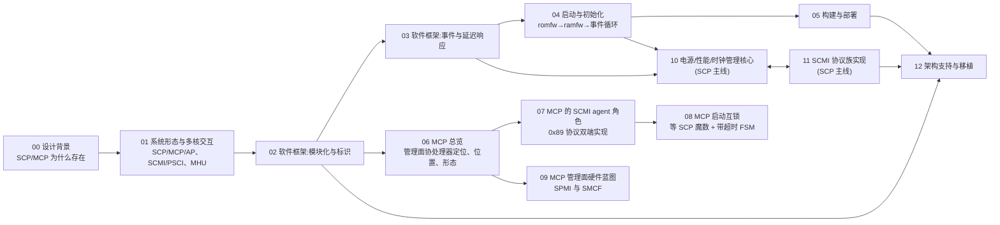
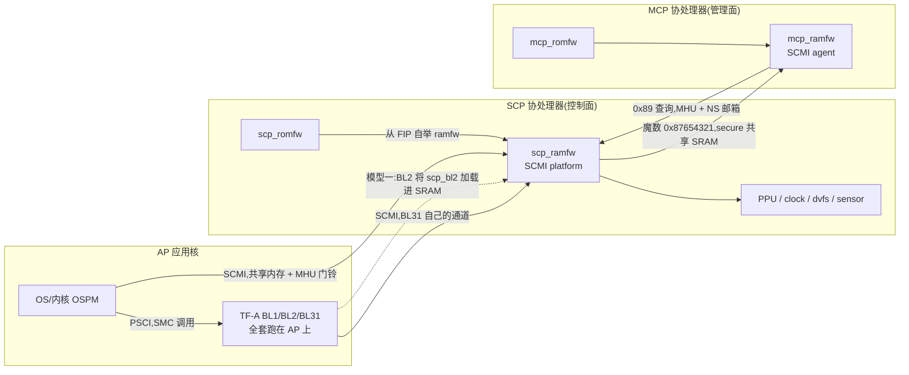

# SCP/MCP 固件:Arm 系统控制与可管理性协处理器

> 定位:面向系统/固件工程师,以 Arm 的 SCP-firmware(参考实现,仓库内同时含 SCP 与 MCP 两组固件目标)为对象,讲清楚 **SCP/MCP 各解决什么问题、为什么这么设计、公共的软件框架怎么搭、以及它们和 AP/Trusted Firmware/内核之间怎么配合**。主线是"读懂 Arm 的设计",不是"跑通某个平台";平台构建只给到能复现的最低程度。基线为上游 `src/SCP-firmware`(main `0a5b4b58`,v2.16.0 基线,commit 行号构建期同步)。

**结构:两条对等的主线 + 一段共用框架 + 一个底座。** SCP 与 MCP 同仓库同框架,但职责方向相反——SCP 做控制面(电源、性能、时钟),MCP 做管理面(系统监控、电源协商、带外;这是规划,公开参考实现里 MCP 只落了骨架,见 [06](./06-mcp-manageability.md) §1 的分层对照)。所以本系列让它们**各成一条主线**;编号按阅读顺序排,框架/底座(02-05、12)在前、两条主线在后(SCP:10/11,MCP:06-09),避免主线章节提前引用尚未定义的框架术语。

## 学习路径

**推荐顺序**:00 → 01 建立系统观(SCP 在哪儿、与谁通信);02-05 掌握公共软件骨架(模块→事件→启动→构建,阅读任何固件的基础);再二选一进主线:MCP 的 06-09(总览→agent 角色→启动互锁→硬件蓝图)或 SCP 的 10/11(电源与协议),两者顺序随意、可互相穿插。12 是移植专用章,写新平台前再看。

## 全景图:一张图看 SCP/MCP 在系统里的位置

整个系列都在讲下面这张图的一部分。读每章时回到这里定位:

## 主线:「一次 SCMI 请求的旅程」

各章不是并列的知识块,而是下面这条请求链上的一段。读任何一章前后,对照这张表就知道自己在链上的位置:

| # | 阶段 | 发生什么 | 详见 |
| --- | --- | --- | --- |
| 1 | 意图 | OS 的 cpuidle/cpufreq 决定"变状态/变频" | [01](./01-system-multicore-interaction.md) §4 |
| 2 | 协议翻译 | OS 直发 SCMI;或先发 PSCI,由 TF-A BL31 翻成 SCMI | [01](./01-system-multicore-interaction.md) §4 |
| 3 | 传输 | agent 写共享邮箱,拉 MHU 门铃 | [01](./01-system-multicore-interaction.md) §6 |
| 4 | 接收 | transport 拷贝消息、锁通道、signal_message | [11](./11-scmi-protocols.md) §3/§5 |
| 5 | 分发 | scmi 分发器拆 32 位消息头,按协议 id 查表 | [11](./11-scmi-protocols.md) §3 |
| 6 | 协议处理 | 协议模块校验消息/长度表,调后端 HAL | [11](./11-scmi-protocols.md) §4 |
| 7 | 状态机 | power_domain 校验树约束,投 SET_STATE 事件 | [10](./10-power-performance-core.md) §2/§4 |
| 8 | 硬件 | ppu-v1 写 PPU 策略寄存器 | [10](./10-power-performance-core.md) §3 |
| 9 | 异步回环 | `FWK_PENDING` → 完成事件 → 延迟响应 | [03](./03-framework-events-deferred.md) §4 |
| 10 | 应答 | `respond()` 写回邮箱、解除通道锁、触发门铃中断 | [11](./11-scmi-protocols.md) §5 |

MCP 侧有一条对等的短旅程:08 章 FSM 发起 → 07 章 `scmi_agent` 打包发送 → SCP 侧 `scmi_management` 验授权并应答(07 §3)→ 07 章拆包转事件 → 08 章校验推进。协议换成厂商自定义的 0x89,骨架与上表相同。

## 术语表

全系列以此为准;各章首现处不再重复展开:

| 术语 | 全称 / 原文 | 一句话定位 |
| --- | --- | --- |
| SCP | System Control Processor | 控制面协处理器:电源、性能、时钟 |
| MCP | Manageability Control Processor | 管理面协处理器:监控、电源协商、带外(规划;实状见 06) |
| PCSA | Power Control System Architecture | Arm 定义"SCP/MCP 该是什么"的架构规范(DEN0050) |
| SCMI | System Control and Management Interface | AP/固件 ↔ 平台控制器的管理接口,agent↔platform 二分 |
| PSCI | Power State Coordination Interface | OS↔TF-A 的电源接口(不是 SCP 的接口) |
| OSPM | Operating System-directed Power Management | SCMI 语境下"OS 里的电源管理软件" |
| MHU | Message Handling Unit | 门铃中断 + 共享内存的传输硬件 |
| agent / platform | SCMI 角色 | 发请求的一方 / 答请求的一方;SCP 是 platform,MCP 是 agent |
| romfw / ramfw | SCP 侧的 BL1 / BL2 | 片上 ROM 最小加载器 / SRAM 主固件 |
| FIP | Firmware Image Package | 启动镜像容器,`scp_bl2` 是其中一个 TOC 条目 |
| fwk 框架 | `framework/` | 模块生命周期 + 事件循环的通用骨架,SCP/MCP 共用 |
| 模块描述符 | `struct fwk_module`(Module descriptor) | 模块给框架的契约:类型、计数、生命周期回调 |
| 元素(element) | — | 模块经营的资源实例,配置表里的一行 |
| fwk_id | — | 32 位实体编号,type+module_idx+同型序号,"指针替代品" |
| API 绑定 | bind / `process_bind_request` | 使用方请求、提供方审批的函数指针分发机制 |
| 事件 / 通知 | event / notification | 点对点消息 / 一对多广播(事件 + 订阅关系) |
| 延迟响应 | deferred response,`FWK_PENDING` | 慢操作先返回"已受理"(`FWK_PENDING`)、完成后再补发结果的两段式 |
| PPU | Power Policy Unit | "写策略寄存器"管电源的硬件单元 |
| PIK | Power Integration Kit | 时钟、复位等平台基础设施 |
| DVFS | Dynamic Voltage and Frequency Scaling | 动态电压频率调节,SCMI 里只有 level |
| SPMI | System Power Management Interface | 连 PMIC 的两线接口(蓝图里管理面的通路;无 product 启用,SCP 调压也打 PMIC——见 06/09) |
| SMCF | System Monitoring Control Framework | 组织全芯片监控源的框架(monitor→MLI→MGI) |

## 文档索引

| 序号 | 文档 | 概要 | 建议学时 | 主线 |
| --- | --- | --- | --- | --- |
| 00 | [设计背景:SCP 为什么存在](./00-scp-overview.md) | PCSA/SCP/MCP 缘起、职责清单、为什么用专用 MCU、与 BMC/RISC-V 路线对比 | 3 | 公共 |
| 01 | [系统形态与多核交互](./01-system-multicore-interaction.md) | 一 SoC 多控制器部署、romfw/ramfw 两段固件、TF-A 加载链路、SCMI 与 PSCI 分工、MHU 邮箱 | 4 | 公共 |
| 02 | [软件框架:模块化与标识](./02-framework-module-system.md) | product/firmware/module/element 四级、fwk_id、API 绑定、五阶段生命周期 | 5 | 框架 |
| 03 | [软件框架:事件与延迟响应](./03-framework-events-deferred.md) | 事件驱动运行时、通知/订阅、FWK_PENDING 延迟响应链路、对慢硬件的意义 | 4 | 框架 |
| 04 | [启动与初始化](./04-boot-and-init.md) | 复位→crt0→platform_init_hook→fwk_arch_init→五阶段→事件循环;SCP_BL2 交接 | 3 | 框架 |
| 05 | [构建与部署](./05-build-and-deploy.md) | CMake 构建、product 配置、memory mode、编译产物与烧录 | 2 | 框架 |
| 06 | [MCP 总览:管理面协处理器](./06-mcp-manageability.md) | MCP 定位(管理面 vs 控制面)、到 SCP 的两条通道(魔数/0x89)、固件形态与模块表、四条主线导引 | 2 | MCP |
| 07 | [MCP 的 SCMI agent 角色:0x89 协议的双端实现](./07-mcp-scmi-agent.md) | MCP 作 REQUESTER、`scmi_agent` 双身份、`scmi_management` 授权门、一次 0x89 请求全链路 | 4 | MCP |
| 08 | [MCP 启动互锁:与 SCP 的启动握手](./08-mcp-boot-handshake.md) | MCP 为何必须等待 SCP、魔数走 secure SRAM、SCP 何时写、带超时的事件驱动 FSM | 4 | MCP |
| 09 | [MCP 管理面硬件蓝图:SPMI 与 SMCF](./09-mcp-management-hardware.md) | SPMI 连 PMIC、SMCF 监控框架(monitor→MLI→MGI)、无 product 启用的现实 | 3 | MCP |
| 10 | [电源/性能/时钟管理核心](./10-power-performance-core.md) | 从 PSCI 请求到 PPU 的电源链路、power domain 树、DVFS、clock、系统电源(`scp_ramfw_fvp` 未启用 sensor/thermal) | 6 | SCP |
| 11 | [SCMI 协议族实现](./11-scmi-protocols.md) | 各 scmi_* 模块与协议的对应、协议 id 表、一次 power 请求的完整链路 | 5 | SCP |
| 12 | [架构支持与移植](./12-arch-and-porting.md) | arm-m / aarch64(Armv8-R64、Armv8-A)/ none(host/posix)三套架构、内存布局契约、移植新平台清单 | 4 | 底座 |

> MCP 四条主线(06-09)只需 02-05 的框架基础,不假设你先读 SCP 的功能章(10/11)——职责方向相反,内容相对独立。

## 官方文档(reference/,不含构建)

| 文档 | 版本 | 在笔记中的用途 |
| --- | --- | --- |
| `DEN0056F_System_Control_and_Management_Interface_v4.0.pdf` | SCMI v4.0 | 协议层事实来源(引用其 §1/§2/§3.x/§4) |
| `DEN0022F.b_Power_State_Coordination_Interface.pdf` | PSCI v1.3 | OS↔TF-A 电源链路(引用其 §3/§4/§5) |
| `neoverse_v2_technical_overview_102759_relc_03_en.pdf` | Neoverse V2 参考设计技术总览 | Neoverse RD 平台的 SCP/MCP 分工与上电时序背景(06 章引其 §3.8/§4.3.7.1/§6.3;与 Morello 的 N2 同族) |

> PCSA 规范 DEN0050 未下载到本地,论文中涉及 PCSA 的论述以 [developer.arm.com/DEN0050](https://developer.arm.com/documentation/den0050/d/) 为链接依据,不展开细节。

## 源码导航(src/,gitignore 的本地克隆,供 `src=` 引用)

| 路径 | 内容 | 服务于 |
| --- | --- | --- |
| `src/SCP-firmware/framework/` | fwk 核心:事件循环、标识、API、内存、日志 | 02/03/04 |
| `src/SCP-firmware/module/` | 各功能模块(109 个):`scmi*` 协议、`power_domain`/`clock`/`dvfs`、`mhu*` 传输;MCP 侧 `spmi`/`smcf` | 07/09/10/11 |
| `src/SCP-firmware/arch/` | arm-m / aarch64(Armv8-R64、Armv8-A)/ none(host/posix)架构层 | 12 |
| `src/SCP-firmware/product/morello/module/` | 产品私有模块:`scmi-agent`/`scmi-management`/`morello-mcp-system`(MCP 专用)、`morello-rom` | 06/07/08 |
| `src/SCP-firmware/product/` | juno / morello / totalcompute 参考平台(含 morello 的 mcp_romfw/mcp_ramfw) | 02/06 |
| `src/SCP-firmware/doc/` | framework/user_guide/build 等官方工程文档 | 全文 |
