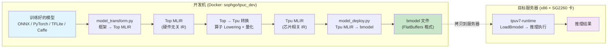

# SG2260 (TPU v7) 全栈知识体系

> 以算能 SG2260/BM1690 芯片为中心，串联 UMD/KMD 运行时、算子库与编译工具链三大知识域。

### 术语约定

本文档中，无合适中文翻译的技术术语保留英文；首次出现时附带中文说明，后续直接使用英文。

| 英文术语 | 说明 |
|---|---|
| **UMD/KMD** | User/Kernel Mode Driver (用户态/内核态驱动) |
| **bmodel** | TPU 部署模型文件格式 (FlatBuffers) |
| **MSGFIFO** | Host↔Device 环形缓冲区通信协议 |
| **ring buffer** | 环形缓冲区 |
| **spinlock** | 自旋锁 |
| **mutex** | 互斥锁 |
| **vtable** | 虚函数表 (C 语言中用函数指针结构体模拟) |
| **stub** | 编译时条件启用的空操作桩函数 (消除 `#ifdef`) |
| **doorbell** | 门铃寄存器 (写操作触发硬件中断) |
| **barrier** | 多核同步屏障 |
| **affinity** | TPU Core 粘滞绑定 (同 Stream 复用相同 TPU) |
| **write-combine (WC)** | CPU 写合并优化映射 (ioremap_wc) |
| **dedup** | 去重 (如权重 SHA256 去重) |
| **scatter-gather** | 分散-收集 (非连续内存的 DMA 操作; scatter=分散写入, gather=收集读取) |
| **uthash** | C 语言侵入式哈希表库 (宏实现) |
| **rbtree** | 红黑树 (内核中用于内存簿记) |
| **descriptor** | 描述符 (DMA 操作的参数块) |
| **lowering** | MLIR 方言降级转换 (如 Top→Tpu) |
| **Pass** | MLIR 中 IR 变换的基本单元 (一次遍历/一趟, 如 lowering Pass, canonicalization Pass, optimization Pass 等) |
| **tensor** | 张量 (多维数组) |

---

## 1. 三个仓库的分工

```
┌─────────────────────────────────────────────────────────────────────┐
│                        tpu-mlir (编译器)                             │
│  模型输入: ONNX / PyTorch / TFLite / Caffe / HuggingFace            │
│  输出: Top MLIR → Tpu MLIR → bmodel 文件                             │
│  量化: F32 / BF16 / F16 / INT8 (symmetric/asymmetric)               │
│  关键工具: model_transform.py, model_deploy.py, llm_convert.py      │
└────────────────────────────┬────────────────────────────────────────┘
                             │ bmodel 文件
                             ▼
┌─────────────────────────────────────────────────────────────────────┐
│                      TPU1686 (算子库 + 硬件定义)                      │
│  kernel/ — 硬件指令编程接口 (tpu_kernel.h, 6661行/713函数)           │
│  tpuDNN/ — DNN 算子库 (策略模板, 类似 cuDNN)                         │
│  bmcompiler/ — bmodel 序列化后端 (预编译 .so)                        │
│  firmware_core/ — 算子实现主体 (~240文件) + 标量固件 (c920_0.bin)    │
│  chip_emulator/ — 芯片模拟器 (libtpuv7_emulator.so)                  │
│  sg2260/ — 硬件架构 (8 Core×64 CU, 128MB L2M, 4GB GMEM)            │
│  backend_api/ — 后端 API 接口 (编译器和运行时的桥梁)                   │
└────────────────────────────┬────────────────────────────────────────┘
                             │ bmodel + 算子定义
                             ▼
┌─────────────────────────────────────────────────────────────────────┐
│                     tpuv7-runtime (UMD/KMD 运行时)                   │
│  cdm_driver/ — Linux 内核驱动 (sgcard.ko, ioctl, MSGFIFO, CDMA)     │
│  cdm_runtime/ — 用户态运行时 (tpuRt API, CUDA-like)                  │
│  model-runtime/ — 推理引擎 (LoadBmodel, LaunchAsync)                 │
│  AP Daemon — 芯片端主调度器 (epoll, Stream, 任务调度)                 │
│  TP Daemon — Scalar Engine 上的执行程序 (msgfifo, dlopen Kernel)     │
│  tpu-smi/ — 设备监控 (温度/功耗/利用率)                               │
│  rdma_rt/ — 多节点 RDMA 通信                                         │
└─────────────────────────────────────────────────────────────────────┘
```

### 1.1 关系总结

| 维度 | tpu-mlir | TPU1686 | tpuv7-runtime |
|---|---|---|---|
| **角色** | 编译器前端 | 硬件定义 + 算子库 + 编译器后端 | 运行时 (UMD + KMD) |
| **输入** | ONNX/PyTorch/TFLite/Caffe | MLIR IR + 硬件规格 | bmodel 文件 |
| **输出** | Top/Tpu MLIR | bmodel + 硬件指令 + kernel.so | 推理结果 |
| **语言** | C++17 (MLIR/LLVM) | C/C++ | C99/C++11 |
| **部署位置** | 开发机 (Docker) | 开发机 (交叉编译) | 服务器 + 芯片固件 |
| **用户界面** | Python CLI + API | C++ API (编译时) | C API (tpuRt*) |

---

## 2. 端到端编译-部署流水线



### 2.1 编译阶段详细步骤

```
步骤1: model_transform.py
  ┌─────────────────────────────────────────────────────────┐
  │ ONNX/PyTorch/TFLite/Caffe → Top MLIR                     │
  │                                                          │
  │ • 使用对应框架的 importer 解析模型图                       │
  │ • 转换为 Top (Tensor Operator) Dialect                    │
  │ • Top Dialect 是硬件无关的算子表示                         │
  │ • 可选: 跑一次推理验证转换正确性 (--test_input)             │
  │                                                          │
  │ 输入:  yolov5s.onnx                                      │
  │ 输出:  yolov5s.mlir (Top Dialect)                        │
  │       yolov5s_in_f32.npz (预处理后的输入)                 │
  └─────────────────────────────────────────────────────────┘

步骤2: run_calibration.py (仅 INT8 量化需要)
  ┌─────────────────────────────────────────────────────────┐
  │ 用校准数据集确定各层的量化参数                              │
  │                                                          │
  │ • 遍历校准数据集 (100-1000 张图片)                        │
  │ • 统计每层激活值的 min/max 范围                           │
  │ • 生成 calibration_table (scale + zero_point per layer)  │
  │                                                          │
  │ 输出: yolov5s_cali_table                                 │
  └─────────────────────────────────────────────────────────┘

步骤3: model_deploy.py
  ┌─────────────────────────────────────────────────────────┐
  │ Top MLIR → Tpu MLIR → bmodel                             │
  │                                                          │
  │ a) Top → Tpu 转换 (lowering):                            │
  │    • 每个 Top Op 映射到对应的 Tpu Op                      │
  │    • 量化: F32 → BF16/F16/INT8                           │
  │    • 算子融合: conv+bn+relu → 单 TPU 指令                 │
  │                                                          │
  │ b) Tpu 优化 (pass pipeline):                             │
  │    • LayerGroup: 多层融合减少内存搬运                      │
  │    • 内存规划: 分配 L2M + GMEM 缓冲区                    │
  │    • 指令生成: 每个 Tpu Op → BDC/GDMA 指令序列            │
  │                                                          │
  │ c) bmodel 打包:                                          │
  │    • Net + Stage + SubNet 结构                           │
  │    • 权重 binary (coeff_mem, SHA256 去重)                 │
  │    • BDC/GDMA 指令 binary                                │
  │    • Kernel module .so (嵌入式)                           │
  │    • FlatBuffers 序列化 + MODEL_HEADER_T                  │
  │                                                          │
  │ 输入:  yolov5s.mlir (Top Dialect)                        │
  │ 输出:  yolov5s_1684x_f16.bmodel                          │
  └─────────────────────────────────────────────────────────┘
```

### 2.2 部署阶段

```
步骤4: 拷贝 bmodel 到目标服务器
  scp yolov5s_1684x_f16.bmodel target_server:/models/

步骤5: 加载模型
  tpuRtLoadNet("/models/yolov5s_1684x_f16.bmodel", ctx, &net)
    └── [tpuv7-runtime] 解析 bmodel → 加载权重 → 加载指令 → 构建 NetInfo

步骤6: 推理
  tpuRtLaunchNet(net, input_tensors, output_tensors, "yolov5s", stream)
    └── [tpuv7-runtime] 提交任务 → AP Daemon → TP Daemon → TPU 执行

步骤7: 后处理
  tpuRtMemcpyD2S(host_output, device_output, size)
  解析输出 tensors → 应用特定的后处理逻辑
```

---

## 3. MLIR 方言降级管线

```
                     tpu-mlir                           TPU1686 + tpuv7-runtime
              ═══════════════════                    ═════════════════════════

  ONNX IR ──► Top Dialect ──► Tpu Dialect ──► bmodel ──► AP Daemon ──► TPU 硬件
              (硬件无关)      (芯片相关)      (FlatBuf)    (任务调度)    (执行)

  示例: Conv2D Op 的降级过程:
  ┌─────────────────────────────────────────────────────────────────────────┐
  │ ONNX:  "Conv" (kernel=3x3, stride=2, pad=1)                             │
  │ Top:   top.ConvOp (同样的语义, 硬件无关)                                  │
  │ Tpu:   tpu.ConvOp (绑定到 SG2260 的 BDC 卷积指令)                        │
  │ bmodel: CmdGroup {bdc_num=..., binary_bdc=[BDC指令序列]}                │
  │ AP:     task_head {LAUNCH_KERNEL} → TPU channel                          │
  │ TP:     find_sym_by_name("tpu_conv2d") → func_ptr → TPU 硬件寄存器       │
  │ HW:     8 TPU Core × 64 CU/Lane, SIMD 执行卷积和矩阵乘                   │
  └─────────────────────────────────────────────────────────────────────────┘
```

### 3.1 Dialect 文件结构

```
tpu-mlir/lib/Dialect/
├── Top/           # Top Dialect (Tensor Operator, 硬件无关)
│   ├── IR/        #   Op 定义 (.td 文件)
│   ├── Transforms/ #  图优化 Pass (算子融合, 形状推导)
│   └── Interpreter/ #  Top 解释器 (用于精度验证)
│
└── Tpu/           # Tpu Dialect (芯片相关)
    ├── IR/        #   Tpu Op 定义 (对应硬件指令)
    ├── Transforms/ #  芯片特定优化 (Layout, 内存, 指令生成)
    └── Interpreter/ #  Tpu 解释器 (芯片模拟器)

tpu-mlir/lib/Conversion/
├── TopToTpu/      # Top → Tpu Lowering (核心转换)
│                  #   每个 Top Op → 一个或多个 Tpu Op
├── TopToLinalg/   # Top → Linalg (可选: 利用上游 MLIR 优化)
└── TopToTosa/     # Top → TOSA (可选: 兼容 TOSA 生态)
```

### 3.2 关键优化 Pass

| Pass | 作用 | 影响 |
|---|---|---|
| **LayerGroup** | 将连续的 TPU 算子融合为一个 Group，中间结果留在 L2M | 减少 GMEM 读写，降低延迟 |
| **Memory Planning** | 分配 L2M + GMEM 缓冲区，复用临时 tensors | 降低峰值显存 |
| **Weight Layout** | 重排权重内存布局以匹配 BDC 引擎的读取模式 | 提升带宽利用率 |
| **Op Fusion** | Conv+BN+ReLU → 单条 TPU 指令 | 减少 Kernel 启动开销 |
| **Quantization** | F32 → BF16/F16/INT8，插入量化和反量化节点 | 降低显存和计算量 |
| **Codegen** | Tpu Op → BDC/GDMA 指令序列 (cmd_group) | 生成可执行指令 |

---

## 4. 算子生态全景

### 4.1 算子从哪里来到哪里去

```
用户模型中的算子 (Conv, MatMul, LayerNorm, SiLU, ...)
        │
        ├── 编译器 (tpu-mlir): Top Op → Tpu Op → bmodel 中的指令
        │
        ├── 算子实现 (TPU1686 firmware_core/src/): Tpu Op → BDC/GDMA 指令序列
        │         └── ~240 文件 (global_layer + local_layer + cv)
        │         └── TPUKERNEL_FUNC_REGISTER(conv2d, conv2d_impl)
        │         └── __attribute__((constructor)) 自动注册 (~80+处)
        │
        ├── DNN 库 (TPU1686 tpuDNN/): 高层 C++ API
        │         └── TPUDNNHost<SG2260Config, LinuxPolicy, tpurt>
        │         └── 对标 cuDNN 的算子接口
        │
        ├── 后端 API (TPU1686 backend_api/):
        │         └── backend_api_conv.cpp → 连接编译器和运行时
        │
        └── 运行时 (tpuv7-runtime): bmodel 加载 → Kernel 启动 → 执行
                  └── tpuRtKernelLaunch(module, "tpu_conv2d", args)
```

### 4.2 各库的算子覆盖

| 算子类别 | TPU1686 kernel | tpuDNN | bmcompiler backend_api |
|---|---|---|---|
| 卷积 (Conv2D/3D, Deconv) | ✅ | ✅ | ✅ |
| 矩阵乘 (MatMul, FC) | ✅ | ✅ | ✅ |
| 池化 (Max/Avg Pooling) | ✅ | ✅ | ✅ |
| 激活 (ReLU, SiLU, GELU, ...) | ✅ | ✅ | ✅ |
| 归一化 (BN, LN, RMS Norm) | ✅ | ✅ | ✅ |
| 注意力 (Attention, FlashAttn) | ✅ | — | ✅ |
| 元素操作 (Add, Mul, ...) | ✅ | ✅ | ✅ |
| 数据搬运 (Reshape, Transpose, ...) | GDMA | ✅ | ✅ |
| 量化 (Quant, Dequant) | ✅ | ✅ | ✅ |
| RoPE / 位置编码 | ✅ | — | ✅ |

---

## 5. bmodel 文件: 连接编译器与运行时的契约

```
bmodel 文件 = 编译器输出 = 运行时输入

┌──────────────────────────────────────────────────────────────┐
│ MODEL_HEADER_T (64B): magic=0xFF55AAEE, sizes               │
├──────────────────────────────────────────────────────────────┤
│ FlatBuffers Model:                                           │
│   ├── type/version/time/chip                                │
│   ├── net[0..N]:                                             │
│   │   ├── name: "yolov5s"                                    │
│   │   └── parameter[0..M]: (每个 Stage)                       │
│   │       ├── input_tensor / output_tensor                   │
│   │       ├── coeff_mem (权重, SHA256 去重码)                 │
│   │       ├── sub_net[]:                                     │
│   │       │   ├── subnet_mode: TPU / CPU                     │
│   │       │   ├── cmd_group[]:                               │
│   │       │   │   ├── bdc_num, gdma_num                     │
│   │       │   │   └── binary_bdc / binary_gdma               │
│   │       │   └── core_commands (多核指令)                   │
│   │       └── is_dynamic, n_dynamic, h_w_dynamic             │
│   ├── neuron_size (Neuron 内存预算)                           │
│   └── kernel_module (嵌入式 firmware .so)                     │
├──────────────────────────────────────────────────────────────┤
│ Binary Payload:                                              │
│   ├── Coeff binary (权重, 去重存储)                           │
│   ├── BDC command binary (TPU 指令序列)                       │
│   ├── GDMA command binary (DMA 指令序列)                      │
│   ├── HAU/SDMA command binary (可选)                          │
│   ├── IR binary (动态网络专用)                                │
│   └── Kernel module .so (设备端算子代码)                      │
└──────────────────────────────────────────────────────────────┘

编译器 (tpu-mlir) 写入  ←──────────→  运行时 (tpuv7-runtime) 解析
      (model_deploy.py)                  (Sgruntime::LoadBmodel)
```

---

## 6. 三个仓库的交互节点

### 6.1 tpu-mlir ↔ TPU1686

| 交互点 | 说明 |
|---|---|
| **bmcompiler 后端** | tpu-mlir 调用 TPU1686 的 `bmcompiler/libbackend_*.so` 生成最终 bmodel |
| **算子定义对齐** | tpu-mlir 的 Tpu Dialect 中每个 Op 对应 TPU1686 kernel/ 中的实现 |
| **芯片规格** | tpu-mlir 从 TPU1686 sg2260/ 获取 Core 数量、LMEM/L2M/GMEM 布局等硬件参数 |
| **指令生成** | Tpu Op Lowering → BDC/GDMA 指令格式 ∈ kernel/include/tpu_kernel.h |

### 6.2 TPU1686 ↔ tpuv7-runtime

| 交互点 | 说明 |
|---|---|
| **bmodel 加载** | tpuv7-runtime model-runtime 解析 TPU1686 bmcompiler 生成的 bmodel |
| **Kernel 执行** | bmodel 内嵌的 kernel.so 通过 tpuRtKernelLoadModule 加载并在 TPU 上执行 |
| **tpurt ABI** | tpuDNN 和 model-runtime 通过 `tpurt::tpurt` (即 tpuRt API) 通信 |
| **Firmware 模拟** | Emulator 模式下 dlopen TPU1686 chip_emulator 的 libtpuv7_emulator.so |
| **编译依赖** | build_tpuv7_emulators.sh 在编译 tpuv7-runtime cmodel 前运行 |

### 6.3 tpu-mlir ↔ tpuv7-runtime

| 交互点 | 说明 |
|---|---|
| **bmodel 格式** | 编译器写入, 运行时读取; 格式变更需要双方同步 |
| **动态 shape** | 编译器设置 `is_dynamic/n_dynamic/h_w_dynamic` → 运行时 getDynamicStageIdx 匹配 |
| **IO 内存模式** | 编译器设置 `addr_mode` (basic/io_alone/...) → 运行时按模式分配 IO 内存 |
| **模型部署** | model_tool 的 --info/--extract/--combine 用于模型管理和调试 |

---

## 7. 文档索引

| 维度 | 文档 | 重点内容 |
|---|---|---|
| **运行时 (UMD/KMD)** | [TPUv7-Runtime-Architecture.md](./TPUv7-Runtime-Architecture.md) | 内核驱动 ioctl, MSGFIFO, AP/TP Daemon, 推理引擎, RDMA |
| **算子库 + 硬件** | [TPU1686-算子库与硬件定义.md](./TPU1686-算子库与硬件定义.md) | kernel/, tpuDNN, bmcompiler, firmware_core, SG2260 硬件规格 |
| **编译工具链** | [tpu-mlir-编译工具链.md](./tpu-mlir-编译工具链.md) | MLIR 方言, 量化流程, 编译 Pass 管线, Python API, LLM 支持 |
| **全栈总览** | 本文档 | 三库关系, 编译-部署流水线, bmodel 契约, 算子全景 |

---

## 附录: 关键概念速查

| 概念 | 所属仓库 | 简要说明 |
|---|---|---|
| **Top Dialect** | tpu-mlir | 硬件无关的 MLIR 算子表示层 |
| **Tpu Dialect** | tpu-mlir | SG2260 芯片相关的 MLIR 算子表示层 |
| **bmodel** | tpu-mlir → tpuv7-runtime | FlatBuffers 格式的部署模型文件 |
| **TIU / BDC** | TPU1686 / HW | Tensor Instruction Unit 控制 + BDC 指令 (矩阵/卷积/激活) |
| **GDMA** | TPU1686 / HW | Global DMA — LMEM/SMEM/L2M/GMEM 间 DMA transfer |
| **CDMA** | tpuv7-runtime | Chip-to-Chip DMA — 多芯片间数据搬运 |
| **tpuRt API** | tpuv7-runtime | 用户态运行时接口 (CUDA-like) |
| **sgcard.ko** | tpuv7-runtime | Linux 内核驱动模块 |
| **AP Daemon** | tpuv7-runtime | AP (Application Processor) Core 上的调度 Daemon |
| **TP Daemon** | tpuv7-runtime | Scalar Engine 上的执行 Daemon |
| **tpurt** | tpuv7-runtime | 运行时 ABI 命名空间 (tpuDNN 和 model-runtime 共用) |
| **tpu_kernel.h** | TPU1686 | 算子硬件指令编程接口 (6661行, ~713函数) |
| **TPUKERNEL_FUNC_REGISTER** | TPU1686 | 算子自动注册宏 (constructor 属性) |
| **SgCoeff** | tpuv7-runtime | 权重去重管理器 (SHA256) |
| **LayerGroup** | tpu-mlir | 多层融合内存优化 Pass |
