# SG2260 TPU 微架构深度分析

> 基于 SG2260_TPU_SPEC v1.1 与 TPU V7.1 指令集设计文档 v0.26，分析关键硬件设计决策、瓶颈、与优化方向。
> 
> **术语约定**: 无合适中文翻译的微架构术语保留英文。LMEM=local memory, SMEM=static memory, L2M=Level-2 Memory, GMEM=global memory (DDR), CU=Compute Unit (亦称 Lane), TIU=Tensor Instruction Unit, EU=Execution Unit, MAC=Multiply-Accumulate, partial sum=部分和, instruction buffer=指令缓冲区 (TIU 片上 32KB, 注意与 runtime 的"指令缓存区"DDR zone 区分), bank conflict=Bank 冲突, stride=跨步, alignment=对齐, lane mask=Lane 掩码, gather=数据收集, broadcast=数据广播, IFM=Input Feature Map, OFM=Output Feature Map, IC=Input Channel, OC=Output Channel.

---

## 1. TIU 指令流水线: 一条 TPU 指令的完整旅程

### 1.1 流水线五阶段

TIU (Tensor Instruction Unit) 是每个 TPU Core 的指令控制器。一条 TPU 指令从获取到执行完成，经过以下模块:

```mermaid
flowchart LR
    subgraph DES["dpc_des: 指令获取"]
        FETCH["DES/PIO 取指"]
        BUF["指令 Buffer<br/>128×1024bit"]
        DISP["指令发射控制<br/>sync_id 门控"]
    end

    subgraph PIPE["dpc_ls_pipe: 数据流控制"]
        DEC["dpc_dec<br/>指令译码"]
        COORD["dpc_coord_gen<br/>坐标生成"]
        R0["dpc_r0_eng<br/>opd0 地址+时序"]
        R1["dpc_r1_eng<br/>opd1 地址"]
        W0["dpc_w0_eng<br/>结果写入地址"]
    end

    subgraph ARB["dpc_arb: 总线仲裁"]
        TIMING["时序控制<br/>(opd0/opd1 同步到EU)"]
        BANK["Bank 冲突仲裁<br/>(R0/R1/W0 调度)"]
    end

    subgraph GATHER["dpc_cube_b_dat_eng: 数据收集"]
        MODE["8种收集模式<br/>(32bit/64bit/NT/CW...)"]
        MM2_NT["MM2_NT 格式转换<br/>(4点IC64 → IC64 4点)"]
    end

    DES --> PIPE --> ARB --> GATHER
```



### 1.2 dpc_des — 指令获取与发射控制

**指令 Buffer 容量**: `128 × 1024bit = 16KB` (v7.0 SPEC), 升级到 `32KB` (v7.1 指令集文档)。可缓存约 400 条 TPU 指令。

**两种取指模式**:
- **PIO 模式**: Scalar Engine (RISC-V CPU) 通过 AXI 接口直接写 `dpc_des` 寄存器，再存入指令 Buffer。延迟最低，适合动态生成的指令序列。
- **DES 模式**: TIU 通过 AXI Master 接口，从 `cfg_des_addr` 指向的 GMEM 地址自行读取指令描述符。适合静态编译的指令序列，Scalar Engine 只需配置起始地址。

**发射控制 (sync_id 门控)**:

```
des_cmd_id_en[0] == 0:  直接发射 (不依赖 GDMA)
des_cmd_id_en[0] == 1:  等待 sync_id_gdma ≥ 指令ID 才发射
```

这实现了一种**粗粒度的生产者-消费者同步**: GDMA 负责将操作数从 GMEM/L2M 搬运到 LMEM，TPU 指令在数据就绪后才开始执行。硬件自动完成同步，无需软件轮询。

**关键优化点**: 
- 指令 Buffer 需确保足够深度以掩盖 GDMA 搬运延迟。如果指令 Buffer 耗尽 (所有指令都在等待 sync_id)，TPU Core 将陷入 stall。
- 编译器的指令调度应当**将不依赖 GDMA 的指令 (如纯计算链) 穿插在 GDMA 依赖指令之间**，以保持流水线填充。

### 1.3 dpc_ls_pipe — 数据流控制

这是 TIU 的核心控制模块，负责将译码后的指令参数转换为具体的内存访问命令。

**dpc_coord_gen — 坐标生成器**:

以 output tensor 为中心，按精度并行输出坐标:
```
4bit:  16 个坐标点/cycle
8bit:  16 个坐标点/cycle
16bit: 8 个坐标点/cycle
32bit: 4 个坐标点/cycle
```

**设计原理**: 精度越低，每个 cycle 能处理的元素越多，充分利用 LMEM 的 256bit 读口宽度。例如 INT8 模式下，一个 256bit 读口可读取 32 个 INT8 元素，对应需要 16 个坐标点 (每点可能需要多个通道的并行计算)。

**dpc_r0_eng / dpc_r1_eng / dpc_w0_eng — 三通道分离**:

| 引擎 | 职责 | 对应总线 |
|---|---|---|
| r0_eng | opd0 地址计算 + 全局时序控制 | scs_r0 |
| r1_eng | opd1 地址计算 | scs_r1 |
| w0_eng | 结果地址计算 + 延迟写 | scs_w0 |

**w0_eng 的延迟写机制**: 写命令与读命令并行发出，但由于计算延迟 (尤其是卷积的数据收集)，结果不会立即就绪。w0_eng 将写命令缓存，等待计算单元 `ready` 信号后再发送。

### 1.4 dpc_arb — Bank 冲突仲裁

这是决定 TPU 指令实际性能的关键模块。

**问题**: `dpc_ls_pipe` 同时产生 R0 (读 opd0)、R1 (读 opd1)、W0 (写结果) 三条命令。但每个 Lane 的 LMEM 只有 **16 个 Bank**，每个 Bank 同一 cycle 只能服务一个请求。

**仲裁策略**:
1. **时序控制**: 卷积等需要跨 Lane 收集数据的指令，dpc_arb 需要精确控制 R0/R1/W0 命令的发送时机，使得 opd0 从其他 Lane 收集回来时，opd1 也正好从本地读回，两者同时送达计算单元。
2. **Priority 调度**: 当 R0、R1、W0 命中同一 Bank 时，按优先级选择发送顺序。

**Bank 冲突来源**:
- R0 与 R1 访问同一 Bank
- R0/R1 与 W0 访问同一 Bank
- GDMA 读写与 EU 读写访问同一 Bank (GDMA 与 EU 共享读口，GDMA 仅在有空闲读口时操作)

**优化指南** (来自指令集手册):
> 如果指令有操作数 opd0/opd1/opd2, 结果 res0: res0 与 opd0/opd1 不在同一 bank，且 opd2 与 opd0/opd1 不在同一 bank 时，可以消除 bank 冲突。

### 1.5 dpc_cube_b_dat_eng — 数据收集模式

从 64 个 Lane 收集数据时，需要不同的整理模式:

| 模式 | 数据宽度 | 适用指令 |
|---|---|---|
| 0 | 1024bit | SGPL (32bit 模式) |
| 1 | 1024bit | Conv, MM2_NN, MM2_TT (32bit) |
| 2 | 128bit | EU Conv FP32 |
| 3 | 32bit | MM, VC |
| 4 | 1024bit | SGPL (64bit 模式) |
| 5 | 1024bit | Conv, MM2_NN, MM2_TT (64bit) |
| 6 | — | NT mode |
| 7 | 128bit | WC_Trans BC |
| 8 | — | CW Trans mode |

**MM2_NT 的特殊格式转换**:

MM2_NT (矩阵乘, A=Normal, B=Transpose) 需要将 `{d0~63, c0~63, b0~63, a0~63}` (4个点 × 64通道 连续存放) 转换为 `{{d63,c63,b63,a63} ... {d0,c0,b0,a0}}` (64通道4个点交织)。这种转置操作在数据收集阶段硬件完成，避免额外的 GDMA 转置开销。

---

## 2. 内存系统: 层次、布局与瓶颈

### 2.1 存储层次与带宽

```
             容量         延迟        带宽 (per Core)
  LMEM      16MB/Core    1 cycle     2R2W × 256bit × 64 Lane
  SMEM      64KB/Core    1 cycle     专用访问
  L2M       128MB (共享)  ~30ns      1024/1024 GB/s R/W
  GMEM      4GB (共享)   ~150ns      614.4 GB/s (32ch LPDDR5)
```

### 2.2 LMEM Bank 结构

> 注: SPEC v1.1 存在内部不一致 — Feature 节说 256KB/lane (→16MB 总量)，Internal Blocks 节 (Lane 小节) 也说 16 bank，但 Internal Blocks 节 (TIU dpc_arb 小节) 说 "8个bank", Lane 小节又说 LMEM "128KB"。按 cmake 配置 `LOCAL_MEM_BANKS=16` + `LOCAL_MEM_ADDRWIDTH=18` (256KB) + Feature 节的 16MB=64×256KB，**正确值应为 256KB/lane, 16 bank**。SPEC 中 "8 bank" 和 "128KB" 疑为历史遗留值。

每个 Lane 的 LMEM (256KB) 分为 **16 个 Bank**:
- 2 读口 (R0/R1) + 2 写口 (W0/DMA)，每个口 256bit 宽
- EU 占用 2 读口 + 1 写口；GDMA 使用独立的 1 写口 + 与 EU 共享的 2 读口
- **关键约束**: 同一 Bank 不能同时被两个读口或读写口访问

### 2.3 Tensor 在 LMEM 中的存储模型

Tensor 按 Channel 分布到 Lane 上:

```
Tensor (N, C, H, W) 的存储规则:
  Channel 0 → Lane[start_lane]
  Channel 1 → Lane[start_lane + 1]
  ...
  Channel 63 → Lane[(start_lane + 63) % 64]
  如果 C > 64: wrap_around 回到 Lane[0]，继续分配
```

**同 Lane 内的布局**: 先按 N 存，N 内部按 Channel 存，Channel 内部按 H 再 W。

**地址计算公式** (指令集手册 §5.2):
```
tensor_addr(n,c,h,w) = tensor_addr(0,0,0,0)
  + n × N_stride
  + c × C_stride
  + h × H_stride  
  + w × W_stride
```

**N/C/H/W Stride 可独立配置**，大小无约束。例如 `C_stride > N_stride` 或 `W_stride > H_stride` 都是合法的。这提供了极大的灵活性，但也意味着编译器需要精确计算 stride 以避免访问越界。

### 2.4 存储模式对性能的影响

**对齐存储 (Aligned)**:
```
H_stride = W × align_factor
W_stride = 1
```
要求: 起始地址按 `EU_NUM × dtype_width` 对齐。

优势: LMEM 访问无跨 Bank 碎片。劣势: H 维度的对齐填充浪费 LMEM 空间。

**紧密存储 (Compact)**:
```
N_stride = C × H × W  
C_stride = H × W
H_stride = W  
W_stride = 1
```
要求: 起始地址按 `dtype_width` 对齐。

优势: 零空间浪费。劣势: 极易产生 Bank 冲突（多通道数据可能映射到同一 Bank 的不同地址）。

**行对齐存储 (Row-aligned)**:
```
每行对齐到 64 字节边界
```
要求: 起始地址按 64 字节对齐。

编译器需要在**空间效率与访问效率**之间权衡。对于频繁访问的 Activation Tensor，通常选择对齐存储；对于一次性读取的 Weight，紧密存储即可。

### 2.5 卷积核在 LMEM 中的布局优化

不同精度的卷积核采用不同的 IC (Input Channel) 分组:

| 精度 | IC 分组 | Kernel Tensor 形状 | 设计意图 |
|---|---|---|---|
| INT8 | 64IC | `(1, OC, CEIL(IC/64)×KH×KW, 64)` | 匹配 64 Lane，每 Lane 处理 64 个 IC 的部分和 |
| FP16/BF16 | 32IC | `(1, OC, CEIL(IC/32)×KH×KW, 32)` | 匹配 FP16 cube 阵列 (32×4 MAC) |
| FP32 | 1IC | `(1, OC, IC×KH×KW, 1)` | FP32 卷积自由度最高，1 Lane 负责 1 个 IC |
| FP8 | 64IC | `(1, OC, CEIL(IC/64)×KH×KW, 64)` | 同 INT8 布局 |

**设计原理**: 卷积计算中，每个 Lane 负责部分 Input Channel 的部分和 (partial sum)。Cube 阵列在每个 cycle 计算 4 个空间点的 IC 维度的部分和。64 Lane × 64 IC/Lane = 最大 4096 个 IC 可以单次覆盖。

### 2.6 SMEM — 被低估的优化空间

SMEM (64KB Static Memory) 虽然容量小，但在特定场景下是关键优化点:

1. **泰勒展开系数**: 激活函数 (Tanh/Sigmoid/Exp) 的查表数据存储在 SMEM
2. **Scalar 暂存**: Scalar Engine 需要访问 LMEM 大量数据时，先经 GDMA 搬到 SMEM，再从 SMEM 读 (Scalar 访问 SMEM 带宽更高)
3. **API Message Buffer**: Scalar Engine 与 TPU Core 间的消息传递缓冲区

**未被充分利用的场景**: SMEM 也可以用于缓存频繁使用的 FP32 常数 (如 Attention 的缩放因子)，但目前编译器的 SMEM 分配策略相对保守。

---

## 3. Cube 引擎: 计算核心的并行与复用

### 3.1 Cube 阵列规格

> 指令集文档 (§5.1) 明确: "每个Lane中的Cube计算单元由很多个乘加器（MAC）组成"。
> 每个 Lane 含 1 个 Cube。TIU 下发一条 Conv/MM 指令时，64 Lane 的 64 个 Cube **同时并行工作**。
> (SPEC 将 cube 列于 arrays_with_fab 层级，此系文档组织结构，不改变逻辑上每Lane一Cube的事实。)

```
INT8 Cube:    每个 Lane 内的 Cube, 等效 64×4 MAC (全 Core, 跨 Lane 分布)
FP16/BF16:    每个 Lane 内的 Cube, 等效 32×4 MAC (全 Core)

SPEC 描述 "cube阵列size为64x4" — 64 = IC 维度 (匹配 64 Lane),
4 = 空间点维度 (每个 cycle 同时计算 4 个点的部分和)

另有 FP32 卷积走 Vector 单元 (非 Cube): 每 Lane 16 EU FP32
```

**64×4 的含义**: 当一条 Conv 指令发射后，64 个 Lane 的 Cube 组成一个跨 Lane 的等效 64×4 MAC 阵列。64 是沿着 IC 维度的并行度（每个 Lane 贡献其数据），4 是一次计算的空间点数。每个 cycle，这个分布式 Cube 阵列同时计算 4 个空间位置沿 64 个 IC 的部分和 (partial sum)。

### 3.2 卷积 IFM 复用 (Input Feature Map Reuse)

这是 TPU 硬件中最重要的优化之一:

```
对于 3×3 卷积:
  输出点 (h,w) 需要输入窗口 [h:h+3, w:w+3]
  输出点 (h,w+1) 需要输入窗口 [h:h+3, w+1:w+4]

  这两个窗口有 3×2 = 6 个元素重叠

Cube 利用这种重叠:
  1. 将 3×3 滤波器的 9 个权重预加载到寄存器
  2. 滑动窗口计算时，相邻输出点共享大部分输入
  3. 减少 LMEM 读次数 → 降低带宽压力
```

指令集文档提到 "支持 input feature map 复用，减少数据搬运，提高卷积执行效率，同时降低数据传输功耗"。这与 Google TPU 的 systolic array 设计理念一致。

### 3.3 TF32: 训练场景的精度-性能平衡

TF32 是 SG2260 的一个创新:

```
TF32 格式: 1-bit sign + 8-bit exponent + 9-bit mantissa (19 bit total)

在 LMEM 上: 数据以 FP32 格式存储 (32-bit)
在 Cube 读取时: FP32 → TF32 (丢弃 14-bit 尾数的低 5-bit)
在 Cube 计算后: TF32 → FP32 (尾数补零)
```

相比 FP32，TF32 减少了 Cube 内部的数据位宽和计算复杂度，同时保持了与 FP32 相同的动态范围 (8-bit exponent)。这对**训练场景的梯度累积**尤其有价值，因为梯度的精度要求低于前向推理。

### 3.4 Redundant Lane 设计

当某个 Lane 出现硬件故障时，`lane_mask` 寄存器可标记故障 Lane，同 array 内的 `redt_lane` (Redundant Lane) 将接管其功能。redt_lane 通过总线访问 TIU，实现透明故障切换，提升芯片良率和可靠性。

---

## 4. 同步机制: SyncID 与 MSG 的深层设计

### 4.1 SyncID — GDMA ↔ TPU 同步

SyncID 是性能最优的同步方式，直接在指令流中嵌入依赖信息:

```
TPU 指令:  des_cmd_id_en[0]=1, cmd_id=N
GDMA 指令: 完成后更新 sync_id_gdma 寄存器

硬件行为:
  if sync_id_gdma >= cmd_id: 发射 TPU 指令
  else:                      等待 GDMA 完成
```

**设计优势**:
- 零软件开销：硬件自动追踪 `sync_id_gdma`
- 精确同步：指令级粒度
- 低延迟：寄存器比较，单 cycle 判断

**设计局限**:
- 仅适用于 GDMA ↔ TPU 同步
- 需要编译器精确分配 cmd_id
- 静态依赖：指令流顺序固定

**硬件实现细节**: 指令 ID 的计数由硬件完成 (v7.1 后移除了 `cmd_id` 字段)。但保留 `sys_tr_wr` 指令可通过写寄存器重置 cmd_id 到特定值，用于异常恢复或动态跳转。

### 4.2 MSG — 通用多引擎同步

MSG (Message) 机制通过消息队列实现更通用的同步:

```
消息队列: 8 个队列，每队列 512 × 12 bit 空间
每条消息: sent_cnt (6-bit) + wait_remain_cnt (6-bit)

SEND msg_id, wait_cnt:   发送消息，设置 sent_cnt+=1, wait_remain=wait_cnt
WAIT msg_id, send_cnt:   等待 send_cnt 条消息到达，wait_remain-=1

当 wait_remain → 0: 该 msg_id 回收可重用
```

**MSG ID 三段分配** (避免多核冲突):

| 段 | 用途 | ID 范围 |
|---|---|---|
| 私有段 | 单 Core 内的 TIU/GDMA/SDMA/HAU 同步 | 局部 |
| 全局段 | 跨 Core 的任务级同步 | 全局 |
| C2C 段 | CDMA/vSDMA 片间同步 | C2C 专用 |

**base_msg_id 机制**: 每个 Engine 有一个可配置的 `cfg_base_msgid` 寄存器。编译器可从 0 开始分配相对 ID，运行时硬件将 `relative_msg_id + cfg_base_msgid` 映射到物理 ID。这支持了多任务并行时的 ID 隔离。

**性能代价**: MSG 同步需要 Engine 轮询消息队列。相比 SyncID (硬件自动门控)，MSG 有额外的轮询开销。但对于 TIU ↔ HAU、TIU ↔ SDMA 等引擎间同步，MSG 是唯一选择。

### 4.3 芯片间同步 — CDMA Send/Receive

```
芯片 A:  CDMA_send(data, chip_B, msg_id, wait_cnt)
芯片 B:  CDMA_receive(chip_A, msg_id, send_cnt)

同步方式: 基于 MSG 机制的扩展，CDMA 作为消息载体
```

支持 Pipeline 并行和张量并行两种模式，通过 CDMA 的 `send`/`receive` 指令配对实现跨芯片的 barrier。

---

## 5. GDMA: 数据搬运的优化空间

### 5.1 指令类型与适用场景

| 指令 | 功能 | 优化场景 |
|---|---|---|
| `GDMA_tensor` | 按 Tensor 布局搬运 | Conv Activation/Weight (含 stride 和压缩) |
| `GDMA_matrix` | 按矩阵行优先搬运 | MatMul 的 A/B 矩阵 |
| `GDMA_general` | 任意地址搬运 | 小数据块/标量 |
| `GDMA_cw_transpose` | Channel-Wise 转置搬运 | NHWC ↔ NCHW 格式转换 |
| `GDMA_reverse` | 反向搬运 | 特定数据整理 |
| `GDMA_nonzero` | 非零元素搬运 | 稀疏化场景 |
| `GDMA_masked_select` | 条件搬运 | Gather 类操作 |

### 5.2 CW Transpose — NHWC ↔ NCHW

这是深度学习推理中最常见的数据搬运优化:

```
NHWC (Channel Last):  [N][H][W][C] — GPU 友好，相邻 Channel 的同一像素连续存储
NCHW (Channel First): [N][C][H][W] — TPU 友好，同一 Channel 的所有像素连续存储

GDMA_cw_transpose 在搬运过程中完成:
  NHWC in L2M/GMEM → 转置 → NCHW in LMEM
```

硬件在 DMA 传输路径中插入转置逻辑，**零额外延迟**。这避免了先用 GDMA 搬运再用 TPU 指令转置的两遍操作。

### 5.3 NNVLC 压缩

GDMA 支持 Golomb-Rice 熵编码 (NNVLC 算法) 压缩数据传输:

```
压缩格式:
  header (3B, 128B 对齐) + kmap (元数据) + payload (编码数据)

适用数据类型: INT8/UINT8/FP16/BF16/INT16/UINT16
压缩率: 取决于数据分布，一般 1.5× ~ 2×

两种模式:
  - 非随机访问: 完整解压，适合 Weight 加载
  - 随机访问: 按需解压，适合 Activation 的切片访问
```

**优化考虑**: 对于高度稀疏的 Activation (如经过 ReLU 后)，NNVLC 可显著提升等效带宽。但压缩/解压本身消耗 GDMA 计算资源，对于密集数据，直接搬运可能更高效。

### 5.4 GDMA 带宽利用率

来自指令集手册的性能规格:
- **GMEM (DDR) 场景**: 带宽利用率 ≥ 90% (延迟 read 150ns, write 60ns)
- **L2M 场景**: 带宽利用率 ≥ 95% (延迟 read 30ns, write 20ns)

要达到 95%+ 利用率，需要:
1. **地址对齐**: 128B 对齐的突发传输
2. **连续大块**: 避免碎片化的小搬运 (每次 GDMA 启动有固定开销)
3. **Outstanding 深度**: 利用 GDMA 的 outstanding 请求队列掩盖延迟
4. **Bank-aware 编程**: 避免 DDR channel 间的冲突

---

## 6. 性能公式与优化模式

### 6.1 TPU 指令执行 Cycle 数

指令集手册给出 TPU 指令 `cycle = f(shape, dtype, eu_num, mac_num, ...)`:

关键变量:
- **shapes**: 输入/输出 tensor 的各维度
- **dtype**: 影响每个 cycle 处理的元素数
- **EU_NUM per Lane**: INT8=64, FP16=32, FP32=16
- **MAC_NUM per Cube**: INT8=256, FP16=128

对于卷积指令:
```
total_cycles ≈ (OC / groups) × (OH × OW / points_per_cycle)
               × (KH × KW × IC / IC_per_cycle)
```

其中 `points_per_cycle` 和 `IC_per_cycle` 由硬件 Cube 规模和数据类型决定。

### 6.2 Bank 冲突对性能的影响

```
无 Bank 冲突: 每 cycle 完成 1 次 R0 读 + 1 次 R1 读 + 1 次 W0 写
有 Bank 冲突: dpc_arb 按优先级串行化冲突请求

极端情况 (R0/R1/W0 全部命中同一 Bank):
  IPC (Instruction Per Cycle) 退化到 1/3
```

### 6.3 LMEM Mask: 降低功耗的隐性优化

```
每条 TPU/GDMA 指令都包含 CE_NUM 个 mask bit
mask bit = 0 → 该 Lane 的 LMEM 不被修改
mask bit = 1 → 该 Lane 正常参与
```

**应用场景**:
- 当 C (Channel) 不是 64 的整数倍时，多余 Lane 被 mask 掉
- 算子只需要部分 Lane 参与时 (如小 batch 的 LayerNorm)
- 动态形状推理中，只激活需要的 Lane，降低功耗

### 6.4 实测性能参考 (来自手册)

| 场景 | 带宽利用率 | 条件 |
|---|---|---|
| GDMA/SDMA (GMEM) | 90%+ | 基础算子测试 |
| GDMA/SDMA (L2M) | 95%+ | 低延迟场景 |
| GDMA/SDMA (模型实测) | 90%+ | ABCSetL0 模型抽取 |
| AllReduce (双芯片) | 70%+ PCIe 带宽 | 2×131072B per CDMA |
| DDR 访问 (LLM 实测) | 88.9% 平均 | Llama2 MLP traffic |
| TPU 计算 (模型实测) | 与建模误差 < 5% | ABCSetL0 去重指令 |

---

## 7. 软件栈优化要点总结

### 7.1 编译器优化

| 优化点 | 技术 | 收益 |
|---|---|---|
| **Bank 冲突消除** | 计算 opd0/opd1/res 的 LMEM 地址，确保不同 Bank | IPC 提升 2-3× |
| **LayerGroup 决策** | 评估 L2M 容量 vs 中间数据量；128MB 内做 zero-copy 融合 | 消除中间 GMEM 搬运 |
| **Weight Layout** | 匹配 Cube 的 IC 分组 (INT8=64, FP16=32, FP32=1) | Cube 利用率最大化 |
| **指令调度** | 不依赖 GDMA 的指令穿插在 GDMA 等待窗口 | 隐藏 GDMA 延迟 |
| **MSG ID 分配** | 三段式分配 (私有/全局/C2C) + base_id 偏移 | 多任务隔离 |

### 7.2 运行时优化

| 优化点 | 技术 | 收益 |
|---|---|---|
| **PIO vs DES** | 小批量动态 shape 用 PIO (低延迟)；大批量静态 shape 用 DES (高吞吐) | 匹配工作负载 |
| **GDMA 批量** | 合并多个小搬运为一个大的 GDMA_tensor | 摊销启动开销 |
| **NNVLC 压缩** | 稀疏 Activation 启用压缩；密集 Weight 禁用 | 避免无效压缩开销 |
| **LMEM Mask** | 对不满 64 Channel 的算子精确设置 mask | 省电 + 避免误写 |
| **CDMA 并行** | 多 CDMA 端口同时传输 | C2C 带宽线性提升 |

### 7.3 硬件瓶颈与规避

| 瓶颈 | 表现 | 规避方法 |
|---|---|---|
| **LMEM Bank 冲突** | 计算吞吐下降 | 编译器 RA (Register Allocation) 级别的 LMEM 地址规划 |
| **指令 Buffer 耗尽** | TPU stall | 穿插 GDMA-independent 指令 |
| **GMEM 带宽** | DDR 平均利用率 88.9% | Bank-aware 编程, 连续大块搬运 |
| **MSG 轮询开销** | 同步延迟 | 优先使用 SyncID；MSG 仅用于跨 Engine |
| **L2M 容量** | 128MB 不够容纳完整模型 | LayerGroup 按层切分，仅热点层驻留 L2M |

---

## 8. 关键数据结构补充

### 8.1 指令描述符 (DES) 格式

指令描述符 (`des_cmd_id_en`, `sync_id` 等域) 的完整定义见 `Athena2_TPU_TIU_Reg` 寄存器手册 (SG2260_TPU_TIU_Reg1.0.xlsx)。每条 TPU 指令的描述符包含:

```
┌────────────────────────────────────────────────┐
│ 指令描述符 (1024-bit)                            │
│  ├── cmd_id / sync_id_depend                   │
│  ├── opd0_addr / opd1_addr / opd2_addr / res_addr│
│  ├── N/C/H/W shapes + strides                  │
│  ├── dtype (opd + res)                         │
│  ├── eu_cmd 相关域 (计算单元配置)                │
│  ├── LMEM mask (64-bit)                        │
│  └── 其他控制域 (bank_conflict_ctrl, ...)       │
└────────────────────────────────────────────────┘
```

### 8.2 消息队列物理分布

8 个消息队列散放在 8 个 TPU Core 子系统周边，减少访问延迟。Engine 就近使用消息队列可以最小化同步开销。编译器在分配 MSG ID 时应考虑 Engine 与消息队列的物理距离。

---

## 参考资料

- SG2260_TPU_SPEC_v1.1.docx — 芯片 SPEC，TIU 微架构，array 内部结构
- TPU V7.1指令集设计文档v0.26(2).docx — 指令集手册，编程模型，存储模型，同步机制，性能测试
- SG2260_TPU_TIU_Reg1.0(1).xlsx — TIU 寄存器详细定义
- Athena2_TPU_TIU_Regx — TIU 寄存器域级定义 (引用自 SPEC)
- Performance Monitor Specification_AXI_v0.5 — PMU 性能监控规格 (引用自 SPEC)
