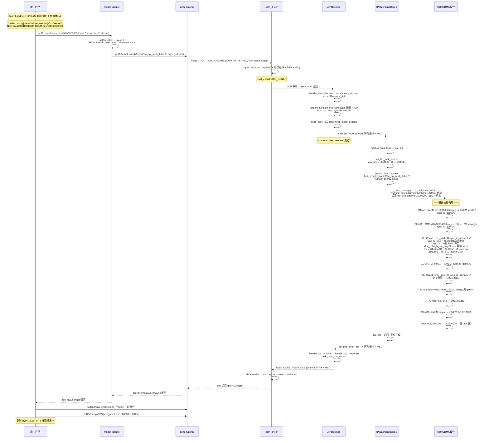

# SG2260 端到端 Demo: MicroResNet 全流程追踪

> 用一个具体的小模型 MicroResNet，从 ONNX 文件到硬件执行，逐层、逐字节追踪整个软件栈。
> 所有地址、大小、指令字节都是具体数值，便于建立完整的工程直觉。

---

## 0. Demo 模型定义

MicroResNet 是一个 7 层的微型残差网络，输入一张 32×32 RGB 图像，输出 16 通道 16×16 特征图。它虽小，却覆盖了卷积、归一化、激活、1×1 卷积、残差相加、池化——足以走通整个栈。

```
Input  [1, 3, 32, 32] FP32  (RGB 图像)
  │
  ├─ Conv0  Conv2D(3→16, k=3, s=1, p=1)   weight[16,3,3,3] bias[16]
  ├─ BN0    BatchNorm(16)                 weight/bias/mean/var[16]
  ├─ ReLU0
  │  └─ (Conv0+BN0+ReLU0 融合为单条 TPU 指令)
  │  产出: feat0 [1, 16, 32, 32]   ← 残差分支
  │
  ├─ Conv1  Conv2D(16→16, k=1, s=1, p=0)  weight[16,16,1,1] bias[16]   ← 1×1 降维/变换
  │  产出: feat1 [1, 16, 32, 32]
  │
  ├─ Add    feat0 + feat1  (逐元素相加, 残差连接)
  ├─ ReLU1
  │
  └─ MaxPool0  2×2, s=2
        产出: Output [1, 16, 16, 16]
```

**数据量预算** (FP32):
| tensor | shape | bytes |
|---|---|---|
| Input | [1,3,32,32] | 12,288 (0x3000) |
| Conv0 weight | [16,3,3,3] | 1,728 |
| Conv0 bias+BN | [16]×4 | 1,024 |
| feat0 | [1,16,32,32] | 65,536 (0x10000) |
| Conv1 weight | [16,16,1,1] | 1,024 |
| feat1 | [1,16,32,32] | 65,536 |
| Output | [1,16,16,16] | 16,384 (0x4000) |

---

## Stage A: ONNX 模型文件

用户的 `microresnet.onnx` 是一个 ONNX protobuf 二进制文件，关键结构:

```protobuf
# 伪 ONNX 表示
graph "microresnet" {
  input  "input"    [1, 3, 32, 32] float
  input  "w_conv0"  [16, 3, 3, 3] float     # initializer
  input  "b_conv0"  [16] float
  input  "w_bn0"    [16] float
  ... (bn0 bias/mean/var)
  input  "w_conv1"  [16, 16, 1, 1] float
  input  "b_conv1"  [16] float
  output "output"   [1, 16, 16, 16] float

  %0   = Conv(input, w_conv0, b_conv0) {kernel=3, stride=1, pad=1}
  %1   = BatchNorm(%0, w_bn0, ...)      {epsilon=1e-5}
  %2   = Relu(%1)
  %3   = Conv(%2, w_conv1, b_conv1) {kernel=1, stride=1, pad=0}
  %4   = Add(%2, %3)                    # 残差: feat0 + feat1
  %5   = Relu(%4)
  %6   = MaxPool(%5) {kernel=2, stride=2}
}
```

文件实际是 protobuf 序列化的二进制，约几十 KB。权重以 initializer 内联存储。

---

## Stage B: model_transform.py → Top MLIR

```bash
model_transform.py \
  --model_name microresnet \
  --model_def microresnet.onnx \
  --input_shapes [[1,3,32,32]] \
  --mean 0,0,0 --scale 0.0039216,0.0039216,0.0039216 \
  --pixel_format rgb \
  --output_names output \
  --test_input cat.jpg \
  --test_result ref_outputs.npz \
  --mlir microresnet.mlir
```

**内部流程**:
1. ONNX importer 解析 protobuf → 构建计算图
2. 逐节点转换为 Top Dialect Op (硬件无关)
3. 预处理 mean/scale 融入第一个 Conv 的 weight (等价变换)
4. 跑一次 Top Interpreter 验证，产出 `microresnet_in_f32.npz`

**生成的 Top MLIR** (简化):

```mlir
module {
  func.func @microresnet(%input: tensor<1x3x32x32xf32>) -> tensor<1x16x16x16xf32> {
    // mean/scale 已融入 w_conv0: w' = w * scale, b' = (b - mean) * scale
    %w_conv0 = "top.Weight"() {file="w_conv0.bin"} : () -> tensor<16x3x3x3xf32>
    %b_conv0 = "top.Weight"() {file="b_conv0.bin"} : () -> tensor<16xf32>
    %0 = "top.Conv"(%input, %w_conv0, %b_conv0)
         {kernel_shape=[3,3], strides=[1,1], pads=[1,1,1,1], dilations=[1,1]}
         : (tensor<1x3x32x32xf32>, ...) -> tensor<1x16x32x32xf32>

    %w_bn0 = "top.Weight"() {file="w_bn0.bin"} : () -> tensor<16xf32>
    %1 = "top.BatchNorm"(%0, %w_bn0, %b_bn0, %mean_bn0, %var_bn0)
         {epsilon=1e-5} : (...) -> tensor<1x16x32x32xf32>
    %2 = "top.Relu"(%1) : (tensor<1x16x32x32xf32>) -> tensor<1x16x32x32xf32>

    %w_conv1 = "top.Weight"() {file="w_conv1.bin"} : () -> tensor<16x16x1x1xf32>
    %3 = "top.Conv"(%2, %w_conv1, %b_conv1)
         {kernel_shape=[1,1], strides=[1,1], pads=[0,0,0,0]} : (...) -> tensor<1x16x32x32xf32>

    %4 = "top.Add"(%2, %3) : (tensor<1x16x32x32xf32>, ...) -> tensor<1x16x32x32xf32>
    %5 = "top.Relu"(%4) : (...) -> tensor<1x16x32x32xf32>
    %6 = "top.MaxPool"(%5) {kernel_shape=[2,2], strides=[2,2], pads=[0,0,0,0]}
         : (...) -> tensor<1x16x16x16xf32>
    return %6 : tensor<1x16x16x16xf32>
  }
}
```

注意 Add 的输入 `%2` 同时是 Conv0+BN+ReLU 的输出和 Add 的残差输入——这个拓扑关系决定了运行时的数据依赖。

---

## Stage C: model_deploy.py → Tpu MLIR → bmodel

```bash
model_deploy.py \
  --mlir microresnet.mlir \
  --quantize INT8 \
  --calibration_table microresnet_cali_table \
  --processor bm1684x \
  --model microresnet_int8.bmodel
```

**Step C1: Top → Tpu Lowering (方言降级)**

每个 Top Op 查表映射到 Tpu Op，同时完成算子融合和量化插入:

```mlir
// 融合: Conv0 + BN0 + ReLU0 → 单个 tpu.Conv2DOp (has_bn=true, has_relu=true)
// 量化: F32 权重 → INT8 + requant scale; 激活 → INT8
%q_input = "tpu.Dequant"(%input) {scale=0.0039216, zero_point=0}  // FP32→INT8 桥接
%c0 = "tpu.Conv2D"(%q_input, %w_conv0_i8, %b_conv0_i32)
      {kernel=[3,3], stride=[1,1], pad=[1,1,1,1],
       has_bn=true, has_relu=true,
       in_dtype=INT8, out_dtype=INT8,
       ic=3, oc=16,  // 注意: IC=3 会触发 64IC 分组的 padding 问题
       requant_scale=..., requant_shift=...}
      : (...) -> tensor<1x16x32x32xi8>   // feat0 (INT8)

// Conv1 (1×1) 不与 ReLU 融合 (因为它在残差路径, 后接 Add)
%c1 = "tpu.Conv2D"(%c0, %w_conv1_i8, %b_conv1_i32)
      {kernel=[1,1], stride=[1,1], pad=[0,0,0,0],
       in_dtype=INT8, out_dtype=INT8, ic=16, oc=16} : (...) -> tensor<1x16x32x32xi8>

// Add: 逐元素二元, 同 lane 无需 gather
%c2 = "tpu.Add"(%c0, %c1) {in_dtype=INT8, out_dtype=INT8, relu=true}  // ReLU1 融合
      : (...) -> tensor<1x16x32x32xi8>

// MaxPool
%c3 = "tpu.Pool"(%c2) {kernel=[2,2], stride=[2,2], mode=MAX, in_dtype=INT8}
      : (...) -> tensor<1x16x16x16xi8>

%dq_out = "tpu.Quant"(%c3) {...}  // INT8→FP32 (如用户需要 FP32 输出)
```

**Step C2: 量化参数 (来自 calibration table)**

```
# microresnet_cali_table (示例)
# layer                min      max     scale      zero_point
input                -1.0      1.0   0.0078125      128     # 非对称 INT8
feat0 (conv0_out)   -2.5      3.2   0.022266       112
feat1 (conv1_out)   -1.8      2.1   0.015294       118
add_out             -3.0      4.0   0.027451       109
output (pool_out)   -2.8      3.5   0.024510       114
```

Conv0 权重 per-channel INT8 对称量化: `w_i8 = round(w_fp32 / scale_per_oc)`, 16 个 OC 各一个 scale。

**Step C3: 内存布局优化 (Weight Layout)**

INT8 卷积核必须按 **64IC 分组**重排 (见微架构文档 §2.5):

```
原始 w_conv0: [16, 3, 3, 3]  (OC, IC, KH, KW)  432 INT8
重排后:       [1, 16, 1*3*3, 64] = [1, 16, 9, 64]  9216 INT8
                                ↑           ↑
                          ROUND_UP(3/64)=1  按 64 对齐
                          实际 IC=3, 余 61 个位置填 0 (padding!)
```

⚠️ **此处暴露一个真实低效点**: 第一层卷积从 RGB (IC=3) 输入时, 64IC 分组导致 61/64 ≈ 95% 的 MAC 算力浪费在零值上。这是为何许多部署方案在第一层前插入一个"IC 扩展"预处理 (复制 3 通道到 64 通道) 或用 FP32 1IC 分组 (此时 `ROUND_UP(3/1)=3`, 无 padding, 但 FP32 更慢)。编译器通常对此有启发式选择。

Conv1 权重: IC=16, `ROUND_UP(16/64)=1`, 重排为 `[1, 16, 1, 64]` = 1024 INT8 (填充 48 个零)。

**Step C4: LayerGroup 与 SubNet 划分**

编译器评估: 整个 MicroResNet 中间数据 = feat0(16KB) + feat1(16KB) + add_out(16KB) ≈ 48KB INT8。远小于单 Core LMEM (16MB)。

决策: **全部融合为 1 个 LayerGroup, 1 个 TPU SubNet**, 中间结果全留 LMEM, 零 GMEM 搬运 (除首尾)。

```
SubNet 0 (TPU, static, 单 Core):
  cmd_group[0]: Conv0(BDC) + GDMA_in(input) + GDMA_in(w_conv0)
  cmd_group[1]: Conv1(BDC) + GDMA_in(w_conv1)
  cmd_group[2]: Add+ReLU(BDC binary)
  cmd_group[3]: MaxPool(BDC pool)
  cmd_group[4]: GDMA_out(output)
```

**Step C5: 指令生成 (Codegen)**

每个 Tpu Op → 一条 1024-bit (128B) 的 TPU 指令描述符 (DES) + 对应的 GDMA 描述符:

```
BDC 指令缓冲 (GMEM 指令缓存区):
  offset 0x000:  Conv0 DES  (128B): {opd0_addr, opd1_addr, res_addr, NCHW, dtype, has_bn, has_relu, lane_mask=0x0007(仅lane0-2有input)... 实际输出用16 lane}
  offset 0x080:  Conv1 DES  (128B)
  offset 0x100:  Add DES    (128B)
  offset 0x180:  MaxPool DES(128B)

GDMA 指令缓冲:
  offset 0x000:  GDMA0: GMEM→LMEM input   (tensor mode, NCHW stride)
  offset 0x080:  GDMA1: GMEM→LMEM w_conv0 (64IC layout)
  offset 0x100:  GDMA2: GMEM→LMEM w_conv1
  offset 0x180:  GDMA3: LMEM→GMEM output

SyncID 依赖 (BDC 依赖 GDMA):
  Conv0.cmd_id = 1, des_cmd_id_en=1 → 等 sync_id_gdma ≥ 1 (GDMA0+GDMA1 完成)
  Conv1.cmd_id = 2 → 等 sync_id_gdma ≥ 2 (GDMA2 完成, 复用已在 LMEM 的 feat0)
  Add.cmd_id  = 3 → 等 Conv1 完成 (同引擎, 隐式顺序)
  GDMA3.cmd_id = 4 → 等 MaxPool 完成
```

**Step C6: bmodel 打包**

```
microresnet_int8.bmodel
┌──────────────────────────────────────────────────────────┐
│ MODEL_HEADER_T (64B): magic=0xFF55AAEE                   │
│   flatbuffers_size=0x2000, binary_size=0x4000           │
├──────────────────────────────────────────────────────────┤
│ FlatBuffers Model:                                       │
│   chip="BM1690", version="2.2", type="B"                 │
│   neuron_size=0x10000 (64KB, 最大中间tensor)            │
│   kernel_module: Binary{offset=0x1000, size=0x3000}    │
│   net[0]:                                                 │
│     name="microresnet", addr_mode=BASIC                 │
│     parameter[0] (单 stage):                             │
│       input_tensor:  [{name="input",  addr=0x0,   size=0x3000, dtype=INT8}]│
│       output_tensor: [{name="output", addr=0x10000,size=0x4000, dtype=INT8}]│
│       coeff_mem: {addr=0x3000, check_code=SHA256(w_conv0+w_conv1+...), size=0x2000}│
│       is_dynamic=false, core_num=1                       │
│       sub_net[0]: subnet_mode=TPU, is_dynamic=false      │
│         core_commands[0]:                                │
│           gdma_tiu_commands[0..3] (4个 cmd_group)        │
│             cmd_group[i]: {bdc_num=1, gdma_num=...,      │
│               binary_bdc: Binary{offset, 512B},          │
│               binary_gdma: Binary{offset, 512B}}         │
├──────────────────────────────────────────────────────────┤
│ Binary Payload (0x4000 bytes):                           │
│   offset 0x0000: w_conv0_i8 (9216B, 64IC 重排)          │
│   offset 0x2400: w_conv1_i8 (1024B)                     │
│   offset 0x2800: b_conv0/b_conv1/bn 参数 (INT32 缩放)   │
│   offset 0x3000: kernel_module.so (嵌入式 firmware)     │
│                 (含 sg_api_multi_fullnet 等 kernel 函数)│
└──────────────────────────────────────────────────────────┘
```

---

## Stage D: 运行时 LoadBmodel

用户程序:
```c
tpuRtNetContext_t ctx;
tpuRtNet_t net;
tpuRtCreateNetContext(&ctx);
tpuRtLoadNet("/models/microresnet_int8.bmodel", ctx, &net);
```

**Step D1: ModelCtx 解析**
- 验证 magic `0xFF55AAEE` ✓
- FlatBuffers 解析 → 获得 net/stage/subnet 结构
- chip = "BM1690" → `BackendAksv()` 兼容性检查 ✓

**Step D2: LoadTpuModule() — 加载嵌入式 kernel.so**
```
model_ctx->read_binary(kernel_module_binary, host_buffer)  // 从 bmodel 读 0x3000 字节
tpuRtKernelLoadModule(host_buffer, 0x3000, m_stream)
  └── ioctl(fd, SG_IOC_TASK_CREATE, {LOAD_LIB, lib_md5, addr, size=0x3000})
        └── [driver] send_request → msgfifo → AP Daemon
              └── [AP] load_module_api_task:
                    write /tmp/<pid>/ap/<md5>.so
                    dlopen(...) → handle
                    dlsym("tpu_kernel_init_v2") → tpu_kernel_init(0, &context)
              └── [AP→TP] 同步发送 LOAD_LIB 到 TPU0 channel
                    └── [TP] load_lib_process: dlopen + tpu_kernel_init(tpu_id=0, &ctx)
                          dlsym("tpu_core_barrier") → task_barrier
                          dlsym("tpu_poll") → poll_engine_done
```

**Step D3: 权重上传 (SgCoeff + S2D)**

```
m_coeffs->Register(model_ctx, coeff_mem):
  check_code = SHA256(coeff_binary) + size
  m_coeff_map.find(check_code) → 未命中 (首次加载)
  tpuRtMalloc(&weight_dev, 0x2000, parallel=0)
    └── ioctl(MALLOC_DEVICE_ADDR) → gen_pool_alloc → GMEM 0x10004000
  tpuRtMallocHost(&host_block, min(1GB, 0x2000)=0x2000)
  model_ctx->read_binary(coeff_binary, host_block)  // 读 w_conv0_i8 + w_conv1_i8 + ...
  tpuRtMemcpyS2D(weight_dev=0x10004000, host_block, 0x2000)
    └── ioctl(TASK_CREATE, S2D)
          └── [AP] s2d_d2s_task → CDMA 引擎: host_pa → device 0x10004000
  m_coeff_map.insert({check_code, {dev=0x10004000, devid=0}})
  net_stage->coeff_offset = 0x10004000 - 0x3000 = 0x10001000  (相对 coeff_mem.address)
```

**Step D4: 指令上传 (tpuRtMallocInstr + S2D)**

```
setupCmdContext(param, stage):
  // BDC 指令 (4 条 × 128B = 512B)
  tpuRtMallocHost(&bdc_host, 512)
  model_ctx->read_binary(binary_bdc, bdc_host)  // 读 4 条 BDC DES
  tpuRtMalloc(&bdc_dev, 512, parallel=0xf)  // 0xf = 指令缓存 zone!
    └── GMEM 0x10008000 (instr cache zone)
  SgMemory::Init("bdc", bdc_host, bdc_dev=0x10008000, 512)
    └── tpuRtMemcpyS2D(0x10008000, bdc_host, 512)
  stage->core_commands[0].bdc_mem.addr = 0x10008000

  // GDMA 指令 (4 条 × 128B = 512B)
  tpuRtMallocHost(&gdma_host, 512)
  model_ctx->read_binary(binary_gdma, gdma_host)
  tpuRtMalloc(&gdma_dev, 512, parallel=0xf)  // GMEM 0x10009000
  tpuRtMemcpyS2D(0x10009000, gdma_host, 512)
  stage->core_commands[0].gdma_mem.addr = 0x10009000
```

**Step D5: Neuron 内存预分配**

```
neuron_size = model->neuron_size() = 0x10000 (64KB, 覆盖最大中间 tensor)
tpuRtMalloc(&neuron_dev, 0x10000, parallel=0)  // GMEM 0x1000A000
net->context->activation = 0x1000A000

ctx_offset[0] = 0x1000A000 - ctx_start(0x0) = 0x1000A000
  // 编译期地址 (tag + offset) + ctx_offset → 运行期实际 GMEM 地址
```

**Step D6: FillTensorAttr — 构建 IO tensor 映射**

```
input tensor:  compiled addr = 0x0 + ctx_offset(0x1000A000) = 0x1000A000
output tensor: compiled addr = 0x10000 + ctx_offset = 0x1001A000

stage->inputs[0][0] = {shape=[1,3,32,32], dev_mem=0x1000A000}
stage->outputs[0][0] = {shape=[1,16,16,16], dev_mem=0x1001A000}
```

至此模型加载完成，GMEM 布局:
```
GMEM (4GB DDR) 布局:
  0x10000000: 用户 input tensor (12KB, 由 tpuRtMemcpyS2D 上传)
  0x10004000: 权重 (coeff, 8KB)          [Stage D3]
  0x10008000: BDC 指令 (512B, instr zone) [Stage D4]
  0x10009000: GDMA 指令 (512B, instr zone)[Stage D4]
  0x1000A000: Neuron/IO 区 (64KB+)        [Stage D5]
    0x1000A000: input (用户拷入)
    0x1001A000: output (推理产出)
```

---

## Stage E: tpuRtLaunchNet — 完整执行追踪

用户程序:
```c
tpuRtTensor_t in  = {.dtype=INT8, .shape={1,3,32,32}, .data=(void*)0x10000000};
tpuRtTensor_t out = {.dtype=INT8, .shape={1,16,16,16}, .data=NULL};
tpuRtStream_t stream;
tpuRtStreamCreate(&stream);
tpuRtLaunchNet(net, &in, &out, "microresnet", stream);
tpuRtStreamSynchronize(stream);
tpuRtMemcpyD2S(host_result, out.data, 16384);
```

### E1: Shape 匹配 + 地址映射 (model-runtime)

```
getStageIdx(inputs, net_ctx) → stage 0 (静态, shape 匹配)
InitOutputTensors: out.shape = [1,16,16,16], dtype=INT8

FillTpuNetInfo → tpu_net_info_t:
  input_info[0]:  {user_global_addr=0x10000000, compiled_global_addr=0x1000A000, byte_size=12288}
  output_info[0]: {user_global_addr=0x10000000(out复用input区), compiled=0x1001A000, byte_size=16384}
                  ↑ 注: 用户未给 out.data, 运行时让其复用 input 区 (因 input 用完即可覆盖)
  bdc_cmd_addr = 0x10008000, gdma_cmd_addr = 0x10009000
  coeff_start_addr = coeff_offset = 0x10001000
  neuron_start_addr = [0x1000A000]
```

**关键**: `user_global_addr` (用户给的 GMEM) 与 `compiled_global_addr` (bmodel 编译期地址) 通常不同 → 运行时在 kernel 参数里同时传两个, kernel 内部做 D2D 把数据从 user 区搬到 compiled 区 (或直接改写指令地址)。

### E2: tpuRtKernelLaunch → ioctl → AP Daemon

```
AKS::LaunchStaticSubnetAsync(net_info, kernel_module, stream):
  // 序列化 tpu_net_info_t 为 api 缓冲 (< 8192B, 直接 inline)
  func_name = "sg_api_multi_fullnet"
  args = serialize(net_info)  // 含 input/output user+compiled addr, cmd addrs, coeff/neuron offset
  tpuRtKernelLaunchAsync(module, "sg_api_multi_fullnet", args, size,
                          group_num=1, block_num=1, stream)
    └── 构造 host_ioctl_info {LAUNCH_KERNEL, task_head, task_body=args}
        ioctl(fd, SG_IOC_TASK_CREATE, &info)
```

`task_head` (64B, 在 ioctl 的 host_ioctl_info 中):
```
task_type   = LAUNCH_KERNEL (4)
task_dest   = TASK_TO_TP (0)
task_resp   = TASK_NEED_RESP
group_num   = 1
block_num   = 1           // 单 Core 执行
msg_sync_id = 0x1234      // 由 alloc_tpu_msg_sync_id 分配
stream_id   = 1001        // 由 allocate_stream_id 分配 (从 1000 起)
task_body_pa = <指向 RX 环形缓冲区中 args 的物理地址>
task_body_size = <序列化 args 的字节数>
```

### E3: cdm_driver → MSGFIFO → AP Daemon

```
[driver] sg_ioctl → runtime_api_ioctl → rt_task_create:
  send_request(hdev, request_buf, size, msg=STREAM_CREATE/TASK):
    sgdrv_send_to_msgfifo(hdev, request_buf, size):
      1. wait_for_fifo_space (TX 环形缓冲区, 1MB)
      2. memcpy_toio(BAR 共享内存 + head, request_buf, size)
      3. bip8 = calculate_bip8(request_buf, size)  // 64-bit XOR 校验
      4. memcpy_toio(BAR + head + size, &bip8, 8)
      5. hdev->tx_circ_buf.head = (head + size + 8) & (1MB - 1)
      6. *(uint32_t*)msi_addr = 0x1  // ← 触发 MSI 中断通知 AP
    wait_event_interruptible(ap_wqueue_list[TASK_DONE], find_api_response(...))
```

### E4: AP Daemon — 接收、调度、分发

```
[AP] epoll_wait → channel[0] (HOST) fd 可读 → handle_host_channel:
  read_enough(rx, fd, &read_buf, sizeof(host_request_action)):
    user_read(rx, fd, &buf, size, &context_index):
      // 硬件模式: 直接返回环形缓冲区指针 (零拷贝)
      tail = rx->cur_tail
      available = CIRC_CNT(*rx->head, tail, buf_size)
      smp_mb()  // 内存屏障
      *buf = rx->buf + tail  // 指向环形缓冲区内的数据
      rx->cur_tail = (tail + size) & (buf_size - 1)

  解析 host_request_action → type = TASK_CREATE_REQUEST
  task_create_request(stream, &request):
    node = malloc(sizeof(stream_node))
    node->id = allocate_task_id(device)  // __sync_add_and_fetch, 原子
    node->task_point = request->task     // 指向环形缓冲区中的 task
    node->property = task_head.property  // {LAUNCH_KERNEL, TP, NEED_RESP}
    node->resource_num = 1
    node->resource[0] = {RESOURCE_TPU, block_num=1, status=RESOURCE_UNKNOWN}
    list_add_tail(&node->list, &stream->node_list)
```

### E5: AP Daemon — 资源调度 (seq_scheduler)

```
stream_function (stream 独立线程) 循环:
  service_first_node(stream):
    node = list_first_entry(&stream->node_list)
    launch_kernel_to_tp(stream, node):
      ops->launch_kernel = launch_kernel_to_tp_soft  // 软件调度
      node_allocate_resource(stream, node):
        stream->allocate_block_resource(resource, node):
          seq_scheduler(resource, node):
            // 从 last_tpu_index 起找 1 个可用 TPU
            // 检查 channel[tpu].task_num_has_send < max_task_in_fifo
            begin = scheduler_info.last_tpu_index  // 假设 = 0
            resource->available_tpu[0] = 0  // TPU Core 0
            resource->available_tpu_bitmap = 0x1
        alloc_tpu_msg_sync_id(stream):
          // spinlock 保护, 轮转分配
          sync_id = msg_sync_id_base + (sync_id_index++)
          sync_id_index &= (msg_sync_id_num - 1)
          resource->msg_sync_id = sync_id  // 0x1234
        cdma_kernel_alloc_resource → 1 (成功)
        resource->status = RESOURCE_ALLOCATED

      exec_task(stream, node):
        // 构造发往 TPU 的 task_head
        task_head.task_type = LAUNCH_KERNEL
        task_head.msg_sync_id = resource->msg_sync_id  // 0x1234
        task_head.stream_id = stream->stream_id  // 1001
        task_head.task_id = node->id
        task_head.block_num = 1
        task_head.barrier_block_num = 1
        task_head.request_cc_info = {group_id=0, block_id=0,
                                     barrier_group_id=0, barrier_block_id=0}
        task_head.task_body_pa = <RX 缓冲区中 args 的物理地址>

        // clean_dcache_range: 确保任务体数据已写入内存 (TPU DMA 可见)
        clean_dcache_range(stream->rx.buf + node->task_tail + sizeof(task_head),
                           task_body_size + 9*64)

        // 写入 TPU0 channel
        channel_index = TPU_TO_CHANNEL(0) = 1
        channel = &device->channel[1]
        pthread_spin_lock(&channel->task_num_mutex)
        channel->task_num_has_send++  // 流控
        pthread_spin_unlock(&channel->task_num_mutex)

        channel->tx.write(channel, channel->fd, task, len):
          user_write(channel, fd, task, len):
            read_cache_mem(&head, tx->head, 8)  // 读生产者指针
            while (...) {  // 环形缓冲写入, 处理 wrap
              write_cache_mem(tx->buf + head, task + offset, chunk)
              head = (head + chunk) & (buf_size - 1)
            }
            *(volatile uint32_t*)tx->head = head  // 更新 head
            clean_dcache_range(tx->head, 8)
            smp_mb()  // 内存屏障
            *(uint32_t*)channel->msi_addr = 0x1  // ← MSI 通知 TP Core 0

        resource->status = RESOURCE_SENT
        list_move(node, node_list → running_list)
```

### E6: TP Daemon — 接收、屏障、执行

```
[TP Core 0] msgfifo_process (无限循环):
  list_empty(task_list) → msgfifo_read_task:
    msgfifo_empty()? 读 head/tail:
      rp = sg_shmem_read(MSG_FIFO_RX_RP_OFFSET)
      wp = sg_shmem_read(MSG_FIFO_RX_WP_OFFSET)
      rp != wp → 有数据
    msgfifo_read_task_header(&task_header):
      sg_msgfifo_rx_read_bytes(rp, &task_header, 64)  // 读 64B task_head
    task_header.task_type == LAUNCH_KERNEL:
      task_body = map_to_kaddr(task_header.task_body_pa)  // DMA 缓冲映射
      invalidate_dcache_range(task_body, task_header.task_body_size)
      task_item = malloc(...)
      task_item->task.task_body = task_body
      task_item->task.task_header = task_header
      list_append(&task_item->list, &cur_thread->task_list)
      sg_msgfifo_rx_update(64)  // 更新读指针

  msgfifo_task_handle(task_item):
    // Phase 2: 屏障同步
    sync_id = task_header.msg_sync_id  // 0x1234
    block_id = task_header.request_cc_info.block_id  // 0 (主核)
    skip_barrier = (block_id != BARRIER && api_id == LOAD_LIB)  // false
    cur_thread->task_barrier(sync_id, barrier_block_num=1):
      → tpu_core_barrier(0x1234, 1)  // 单核, 立即返回
    // block_id != BARRIER_TASK_ONLY → 继续

    // Phase 3: API 分发
    api_header = (struct api_header *)task_item->task.task_body
    api_id = API_ID_LAUNCH_FUNC  // 0x90000003
    launch_func_process(task_item):
      launch_func = task_body + sizeof(api_header)
      // {fun_name="sg_api_multi_fullnet", lib_md5, lib_name, size, param[4096]=序列化args}

      list_for_each(load_lib_list):
        if lib_md5 匹配:
          get_tpu_groupset_info(&groupset_info)  // {tpu_id=0, group_num=1, block_num=1}
          find_sym_by_name(lib, "sg_api_multi_fullnet", &func_ptr):
            // uthash 缓存查找 (key: name+md5, 80B)
            HASH_FIND(hh, func_table, key, 80, p)
            命中 (首次未命中 → dlsym → HASH_ADD)
          func_ptr(launch_func->param, launch_func->size):
            // sg_api_multi_fullnet 执行!
            // 该 kernel 函数解析 param 中的 cmd addrs + tensor addrs,
            // 调用 tpu_kernel.h 的 BDC/GDMA API 编程硬件指令
```

### E7: Kernel 函数 → TIU/GDMA 硬件编程

`sg_api_multi_fullnet` 解析 args 后, 调用 `tpu_kernel.h` 中的原语编排执行流:

```c
// 简化的 sg_api_multi_fullnet 内部逻辑
void sg_api_multi_fullnet(void *args, uint32_t size) {
    struct api_info *info = (struct api_info *)args;
    // info 含: bdc_cmd_addr=0x10008000, gdma_cmd_addr=0x10009000,
    //          input_user=0x10000000, input_compiled=0x1000A000,
    //          output_compiled=0x1001A000, coeff_offset, neuron_offset

    // 1. D2D: 把 input 从 user 区 (0x10000000) 搬到 compiled 区 (0x1000A000)
    //    (因为编译期指令里的地址是 compiled 区)
    tpu_gdma_tensor_copy(..., src=0x10000000, dst=0x1000A000, shape=[1,3,32,32], INT8);
    //   → 生成 GDMA 描述符, 写入 GDMA 引擎寄存器, 启动

    // 2. 执行预编译的 BDC/GDMA 指令流 (DES 模式)
    //    设置 cfg_des_addr 指向 0x10009000 (GDMA 指令缓冲)
    //    TIU 从 GMEM 自行取指 (DES 模式)
    tpu_set_des_addr(0x10009000);  // GDMA 指令基址
    tpu_sys_start_gdma();           // 启动 GDMA 引擎取指执行

    // GDMA 指令流 (从 0x10009000):
    //   GDMA0: GMEM 0x1000A000 (input) → LMEM lane[0..2] addr=0x0
    //          tensor mode, NCHW stride, INT8
    //          sync_id_gdma 更新到 1
    //   GDMA1: GMEM 0x10004000 (w_conv0, 64IC) → LMEM weight 区
    //          sync_id_gdma 更新到 2
    //   ... (后续 GDMA 在对应 BDC 完成后启动)

    tpu_set_des_addr(0x10008000);  // BDC 指令基址
    tpu_sys_start_tiu();            // 启动 TIU 取指执行

    // BDC 指令流 (从 0x10008000):
    //   Conv0: des_cmd_id_en=1, cmd_id=1 → 等 sync_id_gdma≥2 (input+weight 就绪)
    //          Cube 计算: 64 Lane × 64×4 MAC, IC=3 (61 padding), OC=16, KH=KW=3
    //          has_bn=true (BN 参数融合在 opd2), has_relu=true
    //          结果写入 LMEM feat0 区
    //   Conv1: cmd_id=2 → 等 sync_id_gdma≥3 (w_conv1 就绪)
    //          1×1 卷积, IC=16 OC=16
    //   Add:   cmd_id=3 → 逐元素, feat0 + feat1, relu 融合
    //   MaxPool: cmd_id=4 → 2×2 pool
    //   GDMA3:  LMEM output → GMEM 0x1001A000
    //   D2D:    0x1001A000 → 0x10000000 (output 回 user 区, 若用户复用)

    tpu_poll();  // 等待所有指令完成 (poll_engine_done)
}
```

### E8: TIU 微架构执行 (一条 Conv0 的硬件旅程)

```
[硬件] TIU 从 0x10008000 取到 Conv0 DES (128B):

dpc_des:
  指令存入 buffer, 设置 des_cmd_id_en=1, cmd_id=1
  循环检查: sync_id_gdma (由 GDMA 更新) ≥ 1 ?
    GDMA0 (input) 完成 → sync_id_gdma=1; GDMA1 (weight) 完成 → sync_id_gdma=2
    2 ≥ 1 ✓ → 发射 Conv0 到 dpc_ls_pipe

dpc_ls_pipe:
  dpc_dec: 译码 Conv0 参数 {kernel=3, stride=1, pad=1, IC=3, OC=16, INT8, has_bn, has_relu}
  dpc_coord_gen: output [1,16,32,32] INT8 → 每 cycle 输出 16 个坐标点
  dpc_r0_eng: 由 output (n,c,h,w) 计算 opd0 (input) 坐标 → LMEM 地址 → R0 读命令
    input [1,3,32,32]: C=3 → lane 0,1,2 各持 1 channel
    卷积: output(c=0..15) 需 input 的 3 个 channel 全部 → 跨 lane 收集!
  dpc_r1_eng: opd1 (weight) 坐标 → R1 读命令
    weight 64IC 布局, OC=16 → lane 0..15 各持部分 OC
  dpc_w0_eng: result 地址 → W0 写命令 (延迟到 ready)

dpc_arb:
  R0/R1/W0 可能命中同一 LMEM bank → 按优先级串行化
  时序控制: opd0 从 lane 0-2 收集回 dpcmd 时, opd1 也正好读回

dpc_cube_b_dat_eng:
  收集模式 1 (conv, 1024bit, 32bit 模式): 从 lane 0-2 收集 input 的 32bit 切片
  整理后广播到 lane 0-15 (持有 weight 的 OC 分组)

Cube 阵列 (每 array):
  INT8: 64×4 MAC, 每 cycle 计算 4 个空间点 × 64 IC 的 partial sum
  IC=3: 实际只累加 3 项 (61 个位置是零, 算力浪费)
  has_bn: 部分和累加后, 乘 BN scale + 加 BN bias (融合在 cube 后级)
  has_relu: BN 输出过 ReLU (融合)

EU (Vector Unit):
  INT8: 64 EU per lane, 512bit SIMD
  (本例 ReLU 已融合进 Conv, EU 主要用于纯激活/元素操作)
  Add 指令: feat0 + feat1, 16 lane 并行, 无需 gather

结果写入:
  W0 命令就绪 → 写入 LMEM feat0 区 (lane 0-15)

LMEM 布局 (feat0 [1,16,32,32] INT8):
  C=16 → lane 0-15, 每 lane 1 channel = 32×32 = 1024 INT8 = 1024B
  N_stride=C_stride (N=1), C_stride=H*W=1024, H_stride=W=32, W_stride=1
  lane 0: feat0 addr 0x000 (channel 0)
  lane 1: feat0 addr 0x000 (channel 1, 独立 LMEM)
  ...
  lane 15: feat0 addr 0x000 (channel 15)
  lane_mask = 0xFFFF (lane 0-15 激活, 16-63 关闭省电)
```

### E9: 完成 → 响应回传

```
[TP] 所有指令完成 (tpu_poll 返回):
  SYNC_MODE: block_id=0 (主核) → 自旋等待 task_done[0] (自身已完成)
  msgfifo_finish_api(&task_response):
    sg_msgfifo_tx_response(task_response):
      // 写 TX 环形缓冲区 (TP→AP 方向)
      ... 更新 tx head ...
    asm volatile("fence iorw, iorw")  // 内存屏障
    send_msi_to_host():
      *(uint32_t*)MTLI_REG = 0x1  // 写 MTLI 寄存器触发 MSI 给 AP

[AP] epoll → channel[1] (TPU0) fd 可读 → handle_tpu_channel:
  read task_response_from_tpu {stream_id=1001, task_id, result=0, start/end_time}
  handle_tpu_response:
    get_smid_target(smid2sm, stream_id=1001) → stream
    list_for_each(running_list) 找 node->id == task_id
    resource->received_response_num++
    channel->task_num_has_send--  // 流控
    check_node_complete_soft(stream):
      all resources done → 构造 TASK_DONE_RESPONSE
      → 写 channel[0] (HOST) TX 环形缓冲 + MSI

[driver] sgdrv_msg_irq_handler:
  读 RX 环形缓冲, 匹配 response_id
  wake_up_interruptible(ap_wqueue_list[TASK_DONE])

[Host] wait_event 返回 → ioctl 返回 tpuRtSuccess
[Host] tpuRtStreamSynchronize 返回
[Host] tpuRtMemcpyD2S(host_result, 0x10000000, 16384):
  → 再一次 S2D 方向反过来 (D2S): GMEM → host
  → CDMA: device 0x10000000 → host_pa
用户拿到 [1,16,16,16] INT8 推理结果。
```

---

## 全流程时序图



---

## 关键设计点回溯

| 现象 | 根因 | 在 Demo 中的体现 |
|---|---|---|
| **首层 RGB 卷积低效** | INT8 64IC 分组, IC=3 导致 61/64 算力浪费 | Conv0 (IC=3) 的 Cube 计算 |
| **算子融合省指令** | Conv+BN+ReLU 三合一 | Conv0 融合后只有 1 条 BDC |
| **LayerGroup 零搬运** | 中间数据 < 16MB LMEM | feat0/feat1/add 全留 LMEM, 仅首尾访问 GMEM |
| **SyncID 硬件同步** | GDMA 完成后更新 sync_id_gdma, BDC 自动门控 | Conv0 等 sync_id_gdma≥2 |
| **lane_mask 省电** | C<64 时多余 lane 关闭 | input 用 lane 0-2 (mask=0x7), feat0 用 0-15 (mask=0xFFFF) |
| **cross-lane gather** | Conv 需多个 input channel | dpc_cube_b_dat_eng 收集模式 1 |
| **user vs compiled addr** | 编译期地址与运行期分配地址不同 | FillTpuNetInfo 双地址 + D2D 搬运 |
| **指令缓存区 vs LMEM buffer** | 两个不同概念 | BDC/GDMA DES 存 GMEM 0x10008000/9000 (DDR), TIU 32KB buffer 在片上 |
| **MSGFIFO 零拷贝** | 硬件模式 rx.read 返回环形缓冲指针 | AP 的 user_read 直接返回 buf+tail |
| **cacheline 对齐** | head/tail 独立 cacheline 避免 false sharing | cacheline_align_circ_buf 结构 |

---

## 附: 各阶段产物文件

| 阶段 | 产物 |
|---|---|
| A | `microresnet.onnx` |
| B | `microresnet.mlir` (Top), `microresnet_in_f32.npz`, `ref_outputs.npz` |
| C | `microresnet_cali_table`, `microresnet_int8.bmodel` |
| D | GMEM 布局: 权重@0x10004000, 指令@0x10008000/9000, neuron@0x1000A000 |
| E | 推理结果 (GMEM 0x10000000 → host) |
